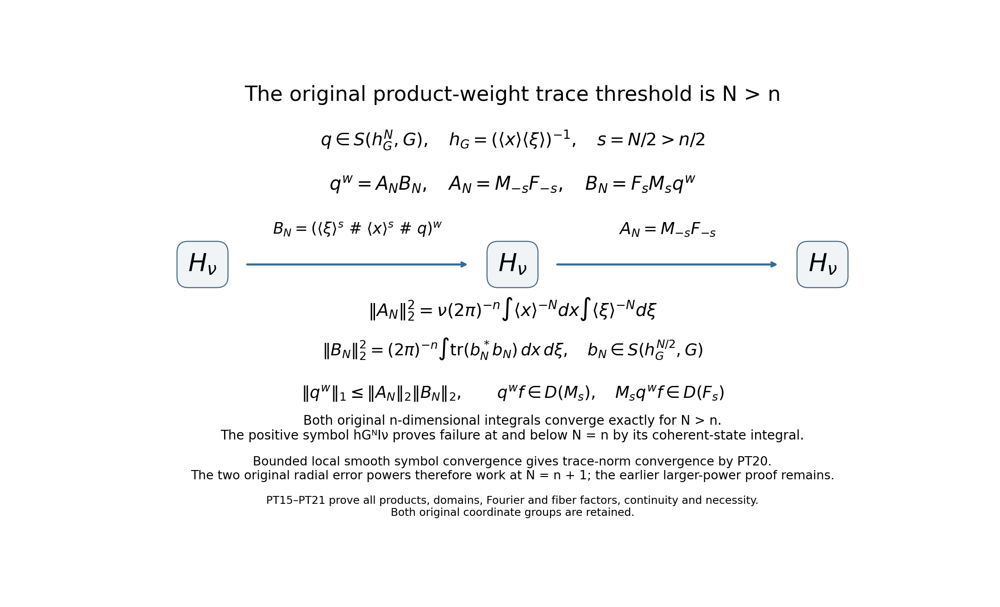
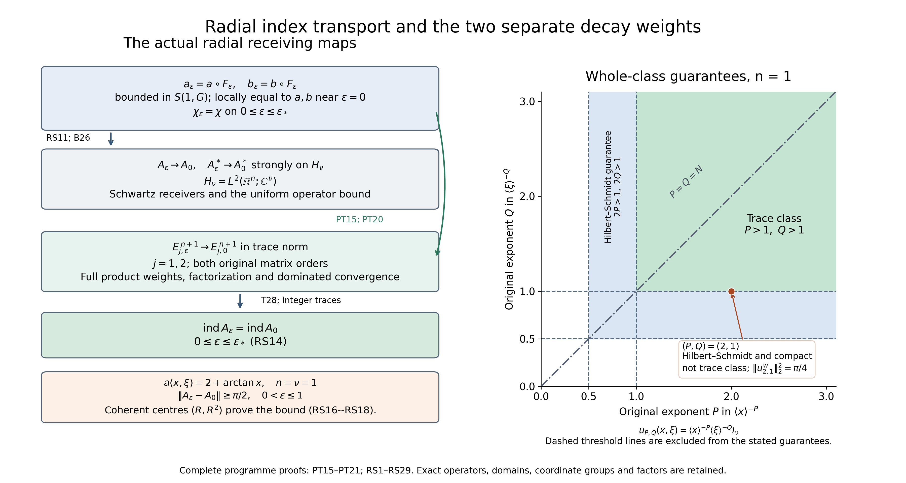
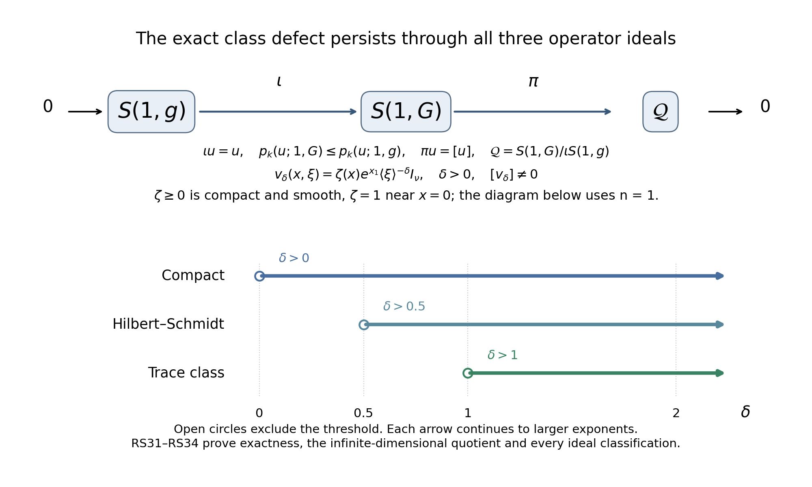

# Radial compression and index transport for product-metric symbols

*Written and dedicated to the public domain by Codex, September 2026 (CC0).*

The product metric measures \(x\)- and \(\xi\)-derivatives with separate weights. A symbol can therefore belong to its class without belonging to the isotropic class used in the scaled Weyl calculation. We build the original radial compression exactly, prove uniform control in the product metric and fixed-positive-scale control in the isotropic metric, then compare Fredholm indices by trace-norm convergence of the two ordered error powers. The cutoff inverse \(\chi\) and the radial profile \(\psi\) serve different purposes and are kept separate. The left and Weyl quantizations are linked by an explicit compact correction.

Read [Weyl products for a varying metric](weyl-metric-products.md) for \(W31\)–\(W33\) and \(W40\), [Quadratic Fourier multipliers at a moving scale](gauss-transform-estimates.md) for the quadratic-phase remainder, [Metric operator bounds](metric-operator-bounds.md) for boundedness and compactness, [Weyl kernels, operator traces, and a finite trace-class test](weyl-trace-criterion.md) for \(CT1\)–\(CT2\), and Traces that survive passage to cohomology for the powers-of-errors index identity. This lesson retains the full original \(x,\xi\) and matrix coordinates throughout.

## 1. The original product metric and coordinate bounds

Let \(z=(x,\xi)\in\mathbb R^{2n}\), \(n\ge1\), and preserve the two separate weights:
\[
 G_z={|dx|^2\over1+|x|^2}
             +{|d\xi|^2\over1+|\xi|^2},\qquad
 g_z={|dx|^2+|d\xi|^2\over1+|x|^2+|\xi|^2},\qquad
 a\in S(1,G;\operatorname{End}\mathbb C^\nu).
 \tag{RC1}
\]
The definition of \(S(1,G)\), by evaluating its derivative seminorms on normalized coordinate directions and then using the multilinear expansion, is exactly
\[
 \|\partial_x^\alpha\partial_\xi^\beta a(x,\xi)\|
       \le C_{\alpha,\beta}
             \langle x\rangle^{-|\alpha|}
             \langle\xi\rangle^{-|\beta|},
 \quad
 \langle x\rangle=(1+|x|^2)^{1/2},
 \quad \langle\xi\rangle=(1+|\xi|^2)^{1/2}.
 \tag{RC2}
\]
The corresponding isotropic \(S(1,g)\) condition requires a derivative of total order \(k\) to be \(O((1+|x|^2+|\xi|^2)^{-k/2})\). These are different requirements when one coordinate group is large and the other is bounded.

Choose a positive smooth radial function \(\psi\) on \(\mathbb R^{2n}\) such that \(\psi(z)=1\) for \(|z|\le1\) and \(\psi(z)=|z|^{-1}\) for \(|z|\ge2\), with a positive smooth interpolation on the annulus. For \(0\le\varepsilon\le1\), put
\[
 \psi_\varepsilon(z)=\psi(\varepsilon z),\qquad
 F_\varepsilon(z)=
    (\psi_\varepsilon(z)x,\psi_\varepsilon(z)\xi),\qquad
 a_\varepsilon(z)=a(F_\varepsilon(z)).
 \tag{RC3}
\]
At \(\varepsilon=0\), \(\psi_0=1\), \(F_0(z)=z\), and \(a_0=a\). For \(\varepsilon>0\) and \(|\varepsilon z|\ge2\), the original formula is exactly \(F_\varepsilon(z)=z/(\varepsilon|z|)\); the exterior is compressed to a sphere of radius \(1/\varepsilon\).

## 2. A uniform product-weight bound for the radial map

For each multiindex \(\gamma\), the specified radial profile satisfies
\[
 |\partial^\gamma\psi(s)|
       \le C_\gamma\psi(s)\langle s\rangle^{-|\gamma|}.
 \tag{RC4}
\]
On \(|s|\le2\) this follows from smoothness and a positive lower bound for \(\psi\); on \(|s|\ge2\) it follows by differentiating the homogeneous function \(|s|^{-1}\). After scaling, each derivative supplies a factor \(\varepsilon\). For any \(x,\xi\) and \(0\le\varepsilon\le1\),
\(\varepsilon\langle x\rangle\le\langle\varepsilon z\rangle\) and
\(\varepsilon\langle\xi\rangle\le\langle\varepsilon z\rangle\).
Apply the first inequality once for each \(x\)-derivative and the second once for each \(\xi\)-derivative in (RC4). This proves the full mixed estimate
\[
 |\partial_x^\alpha\partial_\xi^\beta
          \psi_\varepsilon(x,\xi)|
 \le C_{\alpha,\beta}\psi_\varepsilon(x,\xi)
       \langle x\rangle^{-|\alpha|}
       \langle\xi\rangle^{-|\beta|}
 \quad\text{uniformly for }0\le\varepsilon\le1.
 \tag{RC5}
\]
For \(\varepsilon=0\), all positive-order derivatives vanish and the same estimate holds.

Write \(F_{\varepsilon,x}=\psi_\varepsilon x\) and \(F_{\varepsilon,\xi}=\psi_\varepsilon\xi\). Differentiate each product. A term in which no derivative hits \(x\) is bounded by \(\psi_\varepsilon|x|\) times the full product weight in (RC5). A term in which one derivative hits \(x\) is bounded by \(\psi_\varepsilon\langle x\rangle\) times that same weight, because the derivative used on \(x\) removes one \(x\)-weight. Since the positive profile is uniformly bounded, both \(\psi_\varepsilon|x|\) and \(\psi_\varepsilon\langle x\rangle\) are bounded by \(C\langle\psi_\varepsilon x\rangle\). The analogous statement holds for \(\xi\). Thus, for every positive total derivative order,
\[
 \begin{aligned}
 \|\partial_x^\alpha\partial_\xi^\beta
       F_{\varepsilon,x}(z)\|
 &\le C_{\alpha,\beta}
       \langle F_{\varepsilon,x}(z)\rangle
       \langle x\rangle^{-|\alpha|}
       \langle\xi\rangle^{-|\beta|},\\
 \|\partial_x^\alpha\partial_\xi^\beta
       F_{\varepsilon,\xi}(z)\|
 &\le C_{\alpha,\beta}
       \langle F_{\varepsilon,\xi}(z)\rangle
       \langle x\rangle^{-|\alpha|}
       \langle\xi\rangle^{-|\beta|}.
 \end{aligned}
 \tag{RC6}
\]
No distinction between inner and outer regions was discarded: (RC4) proves both uniformly.

## 3. Uniform \(G\)-symbol bounds for the actual composition

Apply the multivariable chain rule to \(a\circ F_\varepsilon\). Every term of an \((\alpha,\beta)\) derivative is an actual derivative
\(\partial_X^\mu\partial_\Xi^\nu a(F_\varepsilon(z))\)
times \(|\mu|\) derivatives of \(F_{\varepsilon,x}\) and \(|\nu|\) derivatives of \(F_{\varepsilon,\xi}\), whose derivative multiindices sum to \((\alpha,\beta)\). Equation (RC2) at \(F_\varepsilon(z)\) supplies
\(\langle F_{\varepsilon,x}\rangle^{-|\mu|}
\langle F_{\varepsilon,\xi}\rangle^{-|\nu|}\).
Equation (RC6) supplies exactly the opposite positive powers, so they cancel without comparing the \(x\) and \(\xi\) lengths. The remaining product of the separate source weights is precisely the bound in (RC2). Summing the finitely many chain-rule terms at each order proves
\[
 \sup_{0\le\varepsilon\le1}
 \sup_{x,\xi}
 \langle x\rangle^{|\alpha|}
 \langle\xi\rangle^{|\beta|}
 \|\partial_x^\alpha\partial_\xi^\beta
             a_\varepsilon(x,\xi)\|
       <\infty
       \quad\text{for every }\alpha,\beta .
 \tag{RC7}
\]
Therefore \(a_\varepsilon\) is a bounded family in the *original* product-metric class \(S(1,G)\), including its endpoint \(a_0=a\). Local smooth convergence to \(a\) as \(\varepsilon\downarrow0\) is even exact on every fixed compact set once \(\varepsilon\) is small enough that \(|\varepsilon z|\le1\) there; no global symbol-topology or operator-norm convergence is claimed.

## 4. The separate fixed-positive-\(\varepsilon\) isotropic conclusion

Fix \(\varepsilon>0\). On \(|z|\ge2/\varepsilon\), \(F_\varepsilon(z)=z/(\varepsilon|z|)\) is smooth homogeneous of degree zero and has bounded image of radius \(1/\varepsilon\). Its \(k\)-th derivative is \(O_\varepsilon(|z|^{-k})\) for every \(k\ge1\). All derivatives of \(a\) are bounded on the compact image sphere. The chain rule therefore gives
\[
 \|\partial_z^\gamma a_\varepsilon(z)\|
       \le C_{\varepsilon,\gamma}|z|^{-|\gamma|}
       \quad (|z|\ge2/\varepsilon).
 \tag{RC8}
\]
On the remaining compact ball, every derivative is bounded and \((1+|z|^2)^{-|\gamma|/2}\) has a positive minimum depending on \(\varepsilon\). Combining the regions proves
\[
 a_\varepsilon\in S(1,g)
       \quad\text{for every fixed }\varepsilon>0 .
 \tag{RC9}
\]
The constants in (RC8)–(RC9) need not be uniform as \(\varepsilon\downarrow0\).

The exclusion of zero is real. In dimension one take \(a(x,\xi)=\arctan x\), or this scalar function times an identity matrix. Its \(x\)-derivatives satisfy (RC2), and all \(\xi\)-derivatives vanish, so \(a\in S(1,G)\). But \(\partial_xa(0,\xi)=1\) for every \(\xi\), contradicting the \(S(1,g)\) requirement \(|\partial_xa(0,\xi)|\le C(1+|\xi|^2)^{-1/2}\). Thus
\[
 S(1,G)\not\subset S(1,g),\qquad
 a_0=a\ \text{need not belong to }S(1,g).
 \tag{RC10}
\]
This example also shows why the uniform conclusion in (RC7) cannot be silently promoted to a uniform isotropic one.

## 5. Product metric and its Planck weight

Keep the two coordinate groups and the original product metric
\[
 G_z={|dx|^2\over\langle x\rangle^2}
             +{|d\xi|^2\over\langle\xi\rangle^2},
 \qquad
 G_z^\sigma
   =\langle\xi\rangle^2|dx|^2
       +\langle x\rangle^2|d\xi|^2,
 \qquad
 h_G(z)={1\over\langle x\rangle\langle\xi\rangle}.
 \tag{PT1}
\]
The symplectic dual follows by inverting the two diagonal blocks and exchanging them under the standard symplectic form. The ratio \(G/G^\sigma\) is \(h_G^2\) in either block, so \(h_G\le1\) and \(h_G(z)\to0\) as \(|z|\to\infty\).

Here are the structural checks used below. If \(G_z(v)\le\delta^2\) for \(\delta<1\), then \(|v_x|\le\delta\langle x\rangle\) and \(|v_\xi|\le\delta\langle\xi\rangle\). The inequalities
\((1-\delta)\langle x\rangle\le\langle x+v_x\rangle\le(1+\delta)\langle x\rangle\)
and the identical \(\xi\) inequalities prove slow variation. For arbitrary \(z,w\), each ratio
\(\langle x\rangle/\langle y\rangle\) and its inverse is bounded by \(1+|x-y|\), and similarly for \(\xi,\eta\). Since \(G_w^\sigma(z-w)\ge|z-w|^2\), these ratios and the coefficients of \(G,G^\sigma,h_G^{\pm1}\) are bounded by fixed powers of \(1+G_w^\sigma(z-w)\). Thus \(G\) and every fixed \(h_G\) power meet the one-metric W31–W33 and B26 hypotheses, with constants independent of the radial parameter used later.

## 6. Original cutoff inverse and a uniformly compact cutoff term

Assume \(a\in S(1,G;\operatorname{End}\mathbb C^\nu)\) is invertible with uniformly bounded inverse outside a ball. Choose a separate scalar cutoff \(\chi\), supported in its invertibility region and equal to one for \(|z|\ge R_0\), and define \(b=\chi a^{-1}\) there, extended by zero where \(\chi=0\). Differentiating the inverse in its actual matrix order and using the separate coordinate derivative bounds RC2 proves \(b\in S(1,G)\) and
\[
 ba=ab=\chi I_\nu .
 \tag{PT2}
\]
Let \(\psi\) be the radial compression profile of RC3, \(F_\varepsilon(z)=\psi(\varepsilon z)z\), and
\[
 a_\varepsilon=a\circ F_\varepsilon,\qquad
 b_\varepsilon=b\circ F_\varepsilon,\qquad
 \chi_\varepsilon=\chi\circ F_\varepsilon,
 \quad 0\le\varepsilon\le1.
 \tag{PT3}
\]
RC7 applies separately to \(a\), \(b\), and \(\chi\), so all three families are uniformly bounded in \(S(1,G)\). Also \(b_\varepsilon a_\varepsilon=a_\varepsilon b_\varepsilon=\chi_\varepsilon I_\nu\) pointwise.

The cutoff part is even more stable than mere boundedness. Set
\(c=\min_{r\ge1}r\psi(r)>0\); this minimum is positive because \(r\psi(r)=1\) for \(r\ge2\) and is positive on the compact annulus \(1\le r\le2\). Choose \(\varepsilon_*>0\) with \(\varepsilon_*R_0<\min(1,c)\). If \(0<\varepsilon\le\varepsilon_*\) and \(|\varepsilon z|\ge1\), then
\(|F_\varepsilon(z)|=\varepsilon^{-1}(|\varepsilon z|\psi(\varepsilon z))\ge c/\varepsilon>R_0\), hence \(\chi_\varepsilon(z)=1\). If \(|\varepsilon z|\le1\), then \(F_\varepsilon(z)=z\); whenever \(|z|\ge R_0\) the same conclusion holds. Therefore
\[
 1-\chi_\varepsilon=1-\chi
       \quad\text{globally for }0\le\varepsilon\le\varepsilon_*,
 \tag{PT4}
\]
where the right side has one fixed compact support. This exact identity prevents an escaping cutoff defect.

## 7. Both error sides and trace-class powers

W31–W33 in the product metric, in each written matrix order, give uniform \(S(h_G,G)\) remainders from the two zeroth products \(\chi_\varepsilon I_\nu\). With the actual bounded Weyl operators \(A_\varepsilon=a_\varepsilon^w\), \(B_\varepsilon=b_\varepsilon^w\), the same compact-approximation and kernel argument used in IP8 identifies symbol product with operator composition. Thus
\[
 \begin{aligned}
 E_{1,\varepsilon}
 &=I-B_\varepsilon A_\varepsilon
       =(r_{1,\varepsilon})^w,\\
 E_{2,\varepsilon}
 &=I-A_\varepsilon B_\varepsilon
       =(r_{2,\varepsilon})^w,\\
 r_{j,\varepsilon}-(1-\chi_\varepsilon)I_\nu
 &\in S(h_G,G)\quad\text{uniformly in }\varepsilon .
 \end{aligned}
 \tag{PT5}
\]
By (PT4), the compact cutoff term belongs to \(S(h_G,G)\) with one fixed seminorm bound for \(0\le\varepsilon\le\varepsilon_*\). Hence both full error symbols are uniformly in \(S(h_G,G)\) on this smaller interval. W31 and the operator identity preserve the original factor order under powers:
\[
 E_{j,\varepsilon}^{\,N}
       =\bigl(r_{j,\varepsilon}^{\#N}\bigr)^w,
 \qquad
 r_{j,\varepsilon}^{\#N}
       \in S(h_G^N,G)
 \quad\text{uniformly for }0\le\varepsilon\le\varepsilon_* .
 \tag{PT6}
\]

Take the explicit integer \(N=2n+2\) for the comparison argument. If \(q\in S(h_G^N,G)\), its derivative of \(x\)-order \(p\) and \(\xi\)-order \(q'\) is bounded by
\(C\langle x\rangle^{-N-p}\langle\xi\rangle^{-N-q'}\).
For any four multiindices in the *original* CT1 sum, with total degree at most \(n+1\), multiplication by \(x^\alpha\xi^\beta\) gives
\[
 |x^\alpha\xi^\beta
       \partial_x^{\alpha'}\partial_\xi^{\beta'}q(x,\xi)|
 \le C\langle x\rangle^{|\alpha|-N-|\alpha'|}
       \langle\xi\rangle^{|\beta|-N-|\beta'|}
 \le C\langle x\rangle^{-(n+1)}
       \langle\xi\rangle^{-(n+1)}.
 \tag{PT7}
\]
The right side is in \(L^2(\mathbb R^{2n})\), separately in each \(n\)-dimensional group. CT1–CT2 therefore make both error powers trace class, uniformly bounded in trace norm. T28 proves Fredholmness of every \(A_\varepsilon\) for \(0\le\varepsilon\le\varepsilon_*\) and gives
\[
 \operatorname{ind}A_\varepsilon
  =\operatorname{Tr}E_{1,\varepsilon}^{\,N}
   -\operatorname{Tr}E_{2,\varepsilon}^{\,N}.
 \tag{PT8}
\]
This larger power is chosen only to obtain an elementary uniform product-weight \(L^2\) dominator; it does not replace the original \(n+1\) threshold proved for the isotropic calculation in IP11–IP14.

## 8. Trace-norm convergence, without an operator-norm claim for \(A_\varepsilon\)

RC3 gives \(a_\varepsilon=a\), \(b_\varepsilon=b\), and \(\chi_\varepsilon=\chi\) on every fixed compact phase-space set once \(\varepsilon\) is small. The W31 product is continuous in the local smooth topology on bounded symbol sets. Apply this successively to the two errors and their \(N\)-fold products. Every derivative of \(r_{j,\varepsilon}^{\#N}\) converges locally uniformly to the corresponding derivative of \(r_{j,0}^{\#N}\). The common global majorant in (PT7) makes dominated convergence applicable to each of the finitely many weighted \(L^2\) norms in CT1. Hence
\[
 \mathcal N_{n+1}
   \bigl(r_{j,\varepsilon}^{\#N}
         -r_{j,0}^{\#N}\bigr)\longrightarrow0,\qquad
 \|E_{j,\varepsilon}^{\,N}
       -E_{j,0}^{\,N}\|_{\mathcal S_1}\longrightarrow0 .
 \tag{PT9}
\]
The second limit is CT2 with the exact Weyl symbols. Taking traces in (PT8), the integer \(\operatorname{ind}A_\varepsilon\) tends to the integer \(\operatorname{ind}A_0\). Therefore the two integers are equal for every sufficiently small positive \(\varepsilon\):
\[
 \operatorname{ind}(a\circ F_\varepsilon)^w
       =\operatorname{ind}a^w
       \quad(0<\varepsilon\le\varepsilon_0)
       \quad\text{for some }\varepsilon_0>0 .
 \tag{PT10}
\]
For a chosen enclosing sphere \(\partial B_R\), reduce \(\varepsilon_0\) so that \(\varepsilon_0R\le1\). Then \(F_\varepsilon(z)=z\) on that sphere, and
\[
 (a\circ F_\varepsilon)|_{\partial B_R}
       =a|_{\partial B_R},\qquad
 ((a\circ F_\varepsilon)^{-1}d(a\circ F_\varepsilon))
       |_{\partial B_R}
       =(a^{-1}da)|_{\partial B_R}.
 \tag{PT11}
\]
The second equality concerns the pullback to the tangent bundle of the sphere. The restriction of \(F_\varepsilon\) to this sphere is exactly its identity map, so its tangent differential is exactly the identity, including the endpoint \(\varepsilon R=1\). Under a strict inequality it is also the identity on a neighborhood. At equality, smoothness of \(\psi\) and its constant value for \(r\leq1\) give \(\psi(1)=1\) and \(\psi'(1)=0\); the full first differential in (RC3) is therefore the identity there as well. No neighborhood assertion is needed at that endpoint. Equations (PT10)–(PT11) are the exact analytic and boundary receiving maps needed for the product-metric extension. Section 14 receives the completed finite ordered isotropic coefficient; an exterior boundary evaluation is not used to prove these maps.

## 9. Left quantization keeps the same index

The kernel identity W40 is exact for tempered symbols: \(\operatorname{Op}_0(a)=\operatorname{Op}_{1/2}(a_{\mathrm W})\) with
\[
 a_{\mathrm W}
  =\exp\!\left(-{i\over2}\langle D_x,D_\xi\rangle\right)a .
 \tag{PT12}
\]
For the product metric (PT1), one \(x\)- and one \(\xi\)-derivative of \(a\) give the full factor \(h_G\). The quadratic-phase estimate of the owned Gauss theorem applies because its parameter is at most \(h_G/4\le1/4\); its first-order Taylor remainder, or the integral over the multiplier parameter with the same estimate, gives
\[
 a_{\mathrm W}-a\in S(h_G,G).
 \tag{PT13}
\]
The distributional identity W40 and bounded-symbol approximation identify both sides as bounded operators. Since \(h_G\to0\) at full phase-space infinity, the finite-matrix compactness result B35 makes \((a_{\mathrm W}-a)^w\) compact. Fredholm index stability under compact perturbation then proves
\[
 \operatorname{ind}\operatorname{Op}_0(a)
       =\operatorname{ind}a^w .
 \tag{PT14}
\]
This retains the original left and Weyl quantizations as distinct operators connected by a proved compact morphism; it does not equate their symbols.

### The exact product-weight trace threshold and the smaller error power

The preceding \(N=2n+2\) argument remains valid with every original CT1 term. A separate factorization proves the stronger criterion
\[
 \begin{gathered}
 q\in S(h_G^N,G;\operatorname{End}\mathbb C^\nu),\qquad N>n
 \quad\Longrightarrow\quad q^w\text{ is trace class},\\
 \|q^w\|_1\leq C_{n,\nu,N}\,p_J(q;h_G^N,G),
 \qquad h_G=(\langle x\rangle\langle\xi\rangle)^{-1}.
 \end{gathered}                                                   \tag{PT15}
\]
Here \(p_J\) is a finite collection of the original symbol seminorms; \(N\) may be any real number exceeding \(n\). We prove both the estimate and continuity in the bounded local smooth topology. These give both original error powers at \(N=n+1\), without requiring the larger CT1 dominator (PT7).

Put \(s=N/2>n/2\), and define the actual configuration-space and Fourier multipliers
\(M_s f(x)=\langle x\rangle^sf(x)\) and
\(F_s f=\mathcal F^{-1}(\langle\xi\rangle^s\widehat f)\).
Their maximal domains are respectively
\(\{f:\langle x\rangle^sf\in L^2\}\) and
\(\{f:\langle\xi\rangle^s\widehat f\in L^2\}\), with the fixed original Plancherel coefficient. Multiplication and Plancherel prove they are closed; the inverse multipliers \(M_{-s},F_{-s}\) are bounded, have norm at most one, and map onto those domains with both inverse identities. Every multiplier preserves Schwartz functions, since its exact weight is smooth with polynomially bounded derivatives.

The original \(q^w\) also preserves Schwartz functions. In fact all Euclidean derivatives of \(q\) are bounded when \(N>0\), and the exact Weyl commutators are
\[
 [x_j,q^w]=i(\partial_{\xi_j}q)^w,\qquad
 [D_j,q^w]=-i(\partial_{x_j}q)^w.
 \tag{PT16}
\]
They follow by applying CT10 on the left and the same complete kernel calculation on the right. Repeatedly move each output coordinate or derivative to the input using these identities; every resulting symbol is an actual derivative of \(q\), bounded in the Euclidean order-zero class. The owned boundedness theorem bounds its action on every input Schwartz monomial in \(L^2\). Thus all output polynomial-weighted derivatives are in \(L^2\); local Sobolev embedding, applied at each higher order with those weights, gives all Schwartz seminorms. This proves preservation before applying either unbounded multiplier.

Keep the full original order and set
\[
 \begin{gathered}
 b_N=\langle\xi\rangle^s\#\langle x\rangle^s\#q,
 \qquad B_N=F_sM_sq^w\text{ on }\mathcal S,\\
 b_N\in S(\langle x\rangle^s\langle\xi\rangle^s h_G^N,G)
        =S(h_G^{N-s},G)=S(h_G^s,G),\qquad B_N=b_N^w,\\
 A_N=M_{-s}F_{-s},\qquad
 K_{A_N}(x,y)=(2\pi)^{-n}\langle x\rangle^{-s}
       \int e^{i(x-y)\cdot\xi}\langle\xi\rangle^{-s}I_\nu\,d\xi.
 \end{gathered}                                                   \tag{PT17}
\]
The positive weights and all their powers satisfy the original \(G\)-temperateness bounds proved in Section 5. Their derivative bounds are \(C_\alpha\langle x\rangle^{s-|\alpha|}\) or \(C_\beta\langle\xi\rangle^{s-|\beta|}\); hence the one-metric product theorem W31 applies in exactly the written order. Its operator identity on Schwartz vectors gives the displayed \(B_N\) equality. In the kernel of \(A_N\), the Fourier integral is understood as its \(L^2\) inverse transform; the multiplier \(\langle\xi\rangle^{-s}\) is in \(L^2\) because \(2s=N>n\).

Partial Plancherel for that kernel and the complete Weyl formula CI5 for \(b_N\) give
\[
 \begin{split}
 \|A_N\|_2^2
 &=\nu(2\pi)^{-n}
       \int\langle x\rangle^{-2s}\,dx
       \int\langle\xi\rangle^{-2s}\,d\xi<\infty,\\
 \|B_N\|_2^2
 &=(2\pi)^{-n}\int
       \operatorname{tr}_{\mathbb C^\nu}(b_N^*b_N)(x,\xi)
                                      \,dx\,d\xi\\
 &\leq C(2\pi)^{-n}p_J(q;h_G^N,G)^2
       \int\langle x\rangle^{-2s}\,dx
       \int\langle\xi\rangle^{-2s}\,d\xi<\infty.
 \end{split}                                                     \tag{PT18}
\]
The two integrals are separate original \(n\)-dimensional integrals, not an isotropic replacement. W31 bounds the full \(b_N\) seminorm by finitely many original \(q\) seminorms, and its Hilbert--Schmidt fiber norm supplies the stated finite matrix constant.

On Schwartz vectors, the actual cancellations are adjacent and ordered:
\[
 A_NB_N=M_{-s}F_{-s}F_sM_sq^w
             =M_{-s}M_sq^w=q^w.                               \tag{PT19}
\]
Both \(A_N\) and the Hilbert--Schmidt extension of \(B_N\) are bounded. The original \(q^w\) is bounded by the owned metric bound, since \(h_G^N\leq1\). Thus equality on the dense Schwartz domain extends to the original Hilbert space. The trace-ideal product inequality and (PT18) prove (PT15).

There are also actual unbounded-domain maps for every input, not merely a formal equality on Schwartz vectors. Given \(f_j\in\mathcal S\) tending to \(f\in H_\nu\), (PT19) gives
\(M_sq^wf_j=F_{-s}B_Nf_j\), whose right side tends to \(F_{-s}B_Nf\). Closedness of \(M_s\) proves \(q^wf\in D(M_s)\) and the same identity at \(f\). Then
\(F_sM_sq^wf_j=B_Nf_j\to B_Nf\); closedness of \(F_s\) proves \(M_sq^wf\in D(F_s)\) and \(F_sM_sq^wf=B_Nf\). This gives both full receiving domains for (PT17) and (PT19).

Suppose a family \(q_\varepsilon\) is bounded in this original \(S(h_G^N,G)\) class and converges locally smoothly to \(q_0\). Applying the bounded-set continuity of W31 with the two fixed multipliers shows \(b_{N,\varepsilon}\to b_{N,0}\) locally smoothly, bounded in \(S(h_G^s,G)\). The squared dominator \(Ch_G^{2s}=C\langle x\rangle^{-N}\langle\xi\rangle^{-N}\) is integrable in both coordinate groups. Dominated convergence and the exact CI5 factor therefore give
\[
 \begin{gathered}
 \|B_{N,\varepsilon}-B_{N,0}\|_2^2
   =(2\pi)^{-n}\|b_{N,\varepsilon}-b_{N,0}\|_{L^2;\mathrm{HS}}^2
                    \longrightarrow0,\\
 \|q_\varepsilon^w-q_0^w\|_1
     \leq\|A_N\|_2\|B_{N,\varepsilon}-B_{N,0}\|_2
                    \longrightarrow0.                       \tag{PT20}
 \end{gathered}
\]
Apply this to each original ordered error symbol \(q_\varepsilon=r_{j,\varepsilon}^{\#N}\) in (PT6), now with the integer \(N=n+1>n\). The same W31 continuity and local equality of the original input symbols used in Section 8 prove its local smooth convergence. Equations (PT15) and (PT20) consequently prove uniform trace class and trace-norm convergence of both error powers at \(n+1\). The powers-of-errors identity gives (PT8) at this smaller exponent, and integer trace continuity gives precisely the same (PT10) and (PT11) receiving maps. The original \(2n+2\) calculation remains an independently proved larger-power case.

The exponent condition in (PT15) is exact for the whole symbol class. For any real \(N\), the original positive symbol
\(q_N(x,\xi)=\langle x\rangle^{-N}\langle\xi\rangle^{-N}I_\nu
             =h_G^NI_\nu\)
belongs to \(S(h_G^N,G)\) by its full separate derivative bounds. If its Weyl operator were trace class, the positive coherent-state argument CI9–CI11, as proved in WT11, would imply
\[
 \|q_N^w\|_1\geq(2\pi)^{-n}\nu
          \int\langle x\rangle^{-N}\,dx
          \int\langle\xi\rangle^{-N}\,d\xi.                   \tag{PT21}
\]
Each \(n\)-dimensional tail converges exactly for \(N>n\), diverges logarithmically at \(N=n\), and diverges by a power for \(N<n\). The coherent pairings remain defined for every real \(N\), since the symbol has polynomial growth and the Wigner function is Gaussian. Thus \(N\leq n\) has an explicit member of the class whose Weyl operator is not trace class. This proves the precise whole-class boundary without changing any original product metric, symbol or Fourier factor.

The diagram records the actual \(A_N,B_N\), their Hilbert-space types, both domain maps, the two original coordinate integrals and the endpoint \(N>n\). Equations (PT15)–(PT21) prove its sufficiency, bounded-set trace-norm continuity and sharpness. This is an editorial strengthening of the larger-power comparison; the original calculation remains identifiable.

## 10. Worked example: a product symbol outside the isotropic class

Set \(n=\nu=1\) and
\[
 a(x,\xi)=2+\arctan x,\qquad
 2-\frac{\pi}{2}\le a(x,\xi)\le2+\frac{\pi}{2}.
 \tag{RT1}
\]
Every positive \(x\)-derivative of \(\arctan x\) is bounded by \(C_k\langle x\rangle^{-k}\), and every positive \(\xi\)-derivative vanishes. Thus (RC2) holds and \(a\) is uniformly invertible everywhere. Yet \(\partial_xa(0,\xi)=1\) for every \(\xi\), so \(a\notin S(1,g)\) by the exact isotropic first-derivative requirement. For each \(\varepsilon>0\), (RC9) puts \(a\circ F_\varepsilon\) in \(S(1,g)\); (PT10) proves that its Weyl index equals the index of \(a^w\) for sufficiently small positive \(\varepsilon\). Since this original symbol depends only on \(x\), its Weyl operator is multiplication by \(2+\arctan x\), whose inverse is multiplication by \((2+\arctan x)^{-1}\). Both are bounded on \(L^2(\mathbb R)\). Hence
\[
 \operatorname{ind}a^w
 =\operatorname{ind}(a\circ F_\varepsilon)^w
 =0\qquad(0<\varepsilon\le\varepsilon_0).
 \tag{RT2}
\]
No positivity assertion about the compressed Weyl operator is needed for its index equality.

## 11. Exercise with complete solution: compare both Planck weights

**Exercise.** For \(n=1\), compare the original product-metric Planck weight \(h_G\) in (PT1) with the isotropic weight \(h_g=(1+x^2+\xi^2)^{-1}\) from (RC1) along the rays \((x,\xi)=(R,0)\) and \((R,R)\), \(R\to\infty\). Decide whether they are uniformly comparable.

**Solution.** The exact values are
\[
 \begin{array}{c|cc}
 (x,\xi)& h_G & h_g\\ \hline
 (R,0)&(1+R^2)^{-1/2}&(1+R^2)^{-1}\\
 (R,R)&(1+R^2)^{-1}&(1+2R^2)^{-1}.
 \end{array}
 \tag{RT3}
\]
The first-ray ratio \(h_G/h_g=\sqrt{1+R^2}\) diverges; the second-ray ratio \((1+2R^2)/(1+R^2)\) tends to \(2\). Therefore no two constants bound both weights above and below on the full phase space. The comparison must keep the two coordinate groups instead of replacing \(G\) by \(g\) at \(\varepsilon=0\).

## 12. Antecedent and the received matrix formula

Equations (PT10)–(PT14) prove the analytic and quantization receiving maps. The completed [scaled Weyl coefficient proof](scaled-weyl-index-degree.md), (DE11) and (OC1)–(OC31), gives the exact finite ordered coefficient and its analytic index in every dimension. Section 14 below proves the receiving map with the separate cutoff and radial profile. The later [matrix Weyl boundary lesson](matrix-weyl-index-theorem.md) concerns the exterior evaluation of that coefficient; no theorem from that later lesson is used in the proofs here.

## 13. Complete operator receivers and further consequences

This supplement proves the operator composition needed for the growing multipliers in (PT17), writes out the cutoff inverse calculation, and strengthens the radial comparison. It retains every original object and calculation in Sections 1–11. The earlier inputs are the proved Fourier inversion and Plancherel formulas in [Fourier prerequisites](prerequisite-bridges.md), the Gauss extension and remainders (G19)–(G26) in [Quadratic Fourier multipliers](gauss-transform-estimates.md#7-pointwise-extension-and-derivative-control), the symbol product and its full factors (W27)–(W34), (WG1)–(WG4) in [Weyl products](weyl-metric-products.md#7-products-with-distinct-metrics), the operator bound (B26) and finite-matrix compactness proof (B35) in [Metric operator bounds](metric-operator-bounds.md), the kernel and trace formulas (CI1)–(CI12), (CT1)–(CT2) in [Weyl traces](weyl-trace-criterion.md), and the trace-ideal product and index identity (T7), (T28)–(T30) in Traces and complexes. Index constancy and compact perturbations are proved in Finite defects, (F6) and (F10). These are programme proofs, rather than substitutes by external citations.

### 13.1. The full product weights and the quantization map

For real \(p,q\), put
\[
 m_{p,q}(x,\xi)=\langle x\rangle^p\langle\xi\rangle^q,\qquad
 \mathcal S_{p,q}=S(m_{p,q},G).
 \tag{RS1}
\]
The symbol may have any fixed finite matrix input and output sizes. For the square maps below, the actual Hilbert space is \(H_\nu=L^2(\mathbb R^n;\mathbb C^\nu)\). The same coordinate expansion as in (RC2) gives exactly
\[
 \|\partial_x^\lambda\partial_\xi^\kappa u(x,\xi)\|
 \leq C_{\lambda,\kappa}\,
       \langle x\rangle^{p-|\lambda|}
       \langle\xi\rangle^{q-|\kappa|}.
 \tag{RS2}
\]
The bracket is one-Lipschitz, by its gradient or by the triangle inequality in \(\mathbb R^{n+1}\). Thus each bracket ratio and its inverse is at most \(1+|x-y|\), or \(1+|\xi-\eta|\), respectively. Raising these two inequalities to the absolute values of the two real exponents proves the full temperateness of \(m_{p,q}\), with real exponent \((|p|+|q|)/2\) after the bound
\((1+|z-w|)^2\leq2(1+G_w^\sigma(z-w))\).
The corresponding constant is \(2^{(|p|+|q|)/2}\); if an integer exponent is desired, its ceiling has the same upper bound. The local comparisons in Section 5 prove local continuity. This verifies the weight hypotheses for every real \(p,q\), including the two positive weights in (PT17).

Keep the original quantization parameters \(\tau,s\) and set \(c=\tau-s\). For \(c\ne0\), the phase \(A_c(P,Q)=cP\cdot Q\) on the original dual variables has symmetric map
\[
 B_c=\frac c2\begin{pmatrix}0&I_n\\I_n&0\end{pmatrix},
 \qquad
 G_z^{A_c}=\frac4{c^2}G_z^\sigma,\qquad
 h_{G,A_c}=\frac{|c|}{2}h_G.
 \tag{RS3}
\]
Indeed
\(G_z(B_c(P,Q))=(c^2/4)(|Q|^2/\langle x\rangle^2+
|P|^2/\langle\xi\rangle^2)\); taking its ordinary dual gives precisely the displayed two blocks. The ratio to \(G_z\) in each original direction is \(c^2h_G^2/4\). Every full dual-distance bound in Section 5 remains a phase-dual bound, with its constant multiplied by the corresponding power of \(\max(1,c^2/4)\). Hence (G24)–(G26) apply on the whole original phase space, with \(h_*=|c|/2\) and ambient dimension \(2n\). Their counting factor is \((1+|c|/2)^{2n}\); their other structural constants also retain their indicated dependence on \(c\).

Consequently the actual distributional Fourier multiplier \(T_{A_c}=\exp(ic\langle D_x,D_\xi\rangle)\) satisfies, for every integer \(L\geq0\) and every derivative order \(k\),
\[
 \begin{split}
 T_{A_c}u&\in\mathcal S_{p,q},\\
 R_L^cu&=T_{A_c}u-
       \sum_{j<L}\frac{(ic\langle D_x,D_\xi\rangle)^j}{j!}u
       \in S(m_{p,q}h_G^L,G),\\
 p_k(R_L^cu;m_{p,q}h_G^L,G)
 &\leq C_{L,k,c}\left(\frac{|c|}{2}\right)^L
             p_{\leq J_{L,k}}(u;m_{p,q},G).
 \end{split}
 \tag{RS4}
\]
The fixed phase factor remains in the bound. The Gauss theorem supplies both finite-seminorm continuity and local smooth continuity on bounded source sets. For \(c=0\), the multiplier is exactly the identity; \(R_0^0u=u\) and \(R_L^0u=0\) for \(L\geq1\). These cases require no zero positive weight.

To identify the Gauss extension with the distributional multiplier, use the bounded compact approximants constructed below. Their common bound is a fixed polynomial in \(x,\xi\). Every Schwartz test therefore supplies an integrable majorant, so the approximants converge in \(\mathcal S'\). Fourier transformation and multiplication by \(e^{iA_c}\) are continuous on that space, because their transpose maps preserve Schwartz space. The Gauss limit is locally smooth and has the same polynomial bound, so it has the same distributional limit. The kernel change (W40) is therefore the exact identity
\(\operatorname{Op}_s(T_{A_c}u)=\operatorname{Op}_\tau(u)\)
for these original product-weight symbols, with its original sign.

The full product estimate also has an explicit receiver here. For two copies of \(G\), its original cross parameter is \(H=h_G\), its product-space phase parameter is \(h_G/4\), its diagonal metric is \(2G\), and the product space has dimension \(4n\). Set
\[
 w_G(z)=(1+h_G(z)/4)^{4n},\qquad
 1\leq w_G(z)\leq(5/4)^{4n}.
 \tag{RS5}
\]
For \(u\in\mathcal S_{p_1,q_1}\), \(v\in\mathcal S_{p_2,q_2}\), (WG4) reads
\[
 \begin{split}
 p_k\!\left(R_L(u,v);
        m_{p_1+p_2,q_1+q_2}h_G^Lw_G,G\right)
 &\leq C_{L,k}\,4^{-L}2^{k/2}2^J
       p_{\leq J}(u;m_{p_1,q_1},G)
       p_{\leq J}(v;m_{p_2,q_2},G),\\
 p_k\!\left(R_L(u,v);
        m_{p_1+p_2,q_1+q_2}h_G^L,G\right)
 &\leq(5/4)^{4n}
       p_k\!\left(R_L(u,v);
        m_{p_1+p_2,q_1+q_2}h_G^Lw_G,G\right).
 \end{split}
 \tag{RS6}
\]
Here \(R_0(u,v)=u\#v\), and \(R_L\) retains the original finite ordered coefficients. The integer \(J\) obeys the provider's (WG3) with the actual product metric and weights. The second inequality follows by multiplying each directional-derivative quotient by \(w_G(z)\), without differentiating that denominator. Thus all the full factors remain, even when the displayed bounded weight is used to receive the old class.

### 13.2. Actual Schwartz compositions for growing symbols

We prove the needed common domain for all \(\mathcal S_{p,q}\), rather than applying the classical bounded-symbol theorem to \(\langle x\rangle^s\). For \(f\in\mathcal S(\mathbb R^n)\), start with the original left formula
\(\operatorname{Op}_0(u)f(x)=(2\pi)^{-n}\int e^{ix\cdot\xi}u(x,\xi)\widehat f(\xi)\,d\xi\).
The integral is absolutely convergent on compact sets of \(x\), with all output derivatives, by (RS2) and Schwartz decay. Differentiating and integrating by parts in \(\xi\) gives, for every pair \(\alpha,\beta\),
\[
 \begin{split}
 x^\alpha\partial_x^\beta\operatorname{Op}_0(u)f(x)
 &=(2\pi)^{-n}i^{|\alpha|}
   \sum_{\lambda\leq\beta}\binom{\beta}{\lambda}
   \sum_{\kappa+\theta+\omega=\alpha}
        \frac{\alpha!}{\kappa!\theta!\omega!}\\
 &\quad\times\int e^{ix\cdot\xi}
       P_{\beta-\lambda,\kappa}(\xi)
       (\partial_\xi^\theta\partial_x^\lambda u)(x,\xi)
       (\partial_\xi^\omega\widehat f)(\xi)\,d\xi,\\
 P_{v,\kappa}(\xi)
 &=\begin{cases}
 i^{|v|}\dfrac{v!}{(v-\kappa)!}\xi^{v-\kappa},
                  &\kappa\leq v,\\
 0,&\kappa\not\leq v.
 \end{cases}
 \end{split}
 \tag{RS7}
\]
The coefficient \(i^{|\alpha|}\) is exactly
\((-1)^{|\alpha|}i^{-|\alpha|}\) from integration by parts. Each boundary term vanishes by the full Schwartz decay in \(\xi\); (RS2) gives polynomial growth for all differentiated symbol factors.

Let \(Q_{\theta,\lambda}(u)\) be the supremum in (RS2), with its whole displayed weight as denominator, and let
\(U_{M,\omega}(f)=\sup_\xi\langle\xi\rangle^M
|\partial_\xi^\omega\widehat f(\xi)|\).
For every nonzero summand put
\(E=|\beta-\lambda-\kappa|+q-|\theta|\), and choose an integer \(M>n+\max E\) over this finite set. With \(p_+=\max(p,0)\), (RS7) gives the complete bound
\[
 \begin{split}
 |x^\alpha\partial^\beta\operatorname{Op}_0(u)f(x)|
 &\leq\langle x\rangle^{p_+}(2\pi)^{-n}
 \sum_{\lambda\leq\beta}\binom{\beta}{\lambda}
 \sum_{\substack{\kappa+\theta+\omega=\alpha\\
                 \kappa\leq\beta-\lambda}}
 \frac{\alpha!(\beta-\lambda)!}
      {\kappa!\theta!\omega!(\beta-\lambda-\kappa)!}\\
 &\quad\times Q_{\theta,\lambda}(u)U_{M,\omega}(f)
                   \int\langle\xi\rangle^{E-M}\,d\xi .
 \end{split}
 \tag{RS8}
\]
Every integral is finite: on the dyadic annulus of radius \(2^j\), its bound is a constant times \(2^{j(n+E-M)}\), a convergent geometric sum. The original Fourier factor, polynomial derivatives, zero terms and finite sums all remain.

This polynomial output bound implies rapid output decay, as follows. For an integer \(k\geq0\), retain the exact polynomial
\[
 \langle x\rangle^{2k}
   =\sum_{|\gamma|\leq k}
          \frac{k!}{(k-|\gamma|)!\gamma!}x^{2\gamma}.
 \tag{RS9}
\]
Multiply \(x^\alpha\partial^\beta\operatorname{Op}_0(u)f\) by this polynomial and apply (RS8) separately with \(\alpha+2\gamma\) for every term. Division by the positive \(\langle x\rangle^{2k}\) yields a finite-seminorm bound times \(\langle x\rangle^{p_+-2k}\). Given any desired output decay order, choose \(2k\) larger than that order plus \(p_+\). The Fourier prerequisite bounds every \(U_{M,\omega}\) by finitely many original Schwartz input seminorms. Thus \(\operatorname{Op}_0(u):\mathcal S\to\mathcal S\) is continuous, with finite symbol-seminorm control, for all real \(p,q\). The quantization map (RS4), followed by this left action, proves the same statement for every fixed \(\operatorname{Op}_\tau(u)\), including the original Weyl operator.

This action also respects bounded-set local smooth convergence. Suppose \(u_j\to u\) locally smoothly in a bounded set of \(\mathcal S_{p,q}\), and let the inputs range over a bounded Schwartz set. For the output \(v_j=\operatorname{Op}_0(u_j-u)f\), the higher seminorms just proved are uniformly bounded. If \(|x|>R\), some coordinate satisfies \(|x_i|>R/\sqrt n\), so
\[
 |x^\alpha\partial^\beta v_j(x)|
 \leq\frac{\sqrt n}{R}
             \max_i\sup_x|x^{\alpha+e_i}\partial^\beta v_j(x)|.
 \tag{RS10}
\]
On \(|x|\leq R\), use (RS7), split the frequency integral at \(|\xi|=S\), and choose \(M\) larger by one in (RS8). Its integrable tail tends to zero uniformly in \(j,x,f\). On the remaining compact phase box, each required symbol derivative tends uniformly to zero and the input Fourier derivatives are uniformly bounded. First choose \(R,S\), then \(j\). This proves convergence in every Schwartz output seminorm, uniformly on the bounded input set. Equation (RS4) supplies the same convergence for the Weyl action.

Choose a compact smooth scalar \(\zeta\) equal to one on the unit ball, and put
\(u_R(x,\xi)=\zeta(x/R)\zeta(\xi/R)u(x,\xi)\), \(R\geq1\).
These are Schwartz symbols. If \(k\geq1\) derivatives hit one cutoff, their factor is \(R^{-k}\) on an annulus where its coordinate bracket is comparable to \(R\). It is therefore bounded by the original bracket to power \(-k\). The full product rule and (RS2) prove uniform bounds for \(u_R\) in \(\mathcal S_{p,q}\), and local equality with \(u\) once \(R\) is large. This constructs the bounded approximants used above, without asserting convergence in the global symbol seminorms.

For \(u,v\) in two such classes with matching finite matrix fibers, choose these approximants for both. The full product theorem gives \(u_R\#v_R\to u\#v\) locally smoothly in a bounded set of the class in (RS6). Since \(w_G\) is bounded, this is also bounded in \(\mathcal S_{p_1+p_2,q_1+q_2}\). For each Schwartz input \(f\), write \(U_R=u_R^w\), \(V_R=v_R^w\). The sequence \(V_Rf\) converges to \(v^wf\) in Schwartz space and is bounded there. Consequently
\[
 \begin{split}
 U_RV_Rf-u^wv^wf
 &=(U_R-u^w)V_Rf+u^w(V_Rf-v^wf)\longrightarrow0,\\
 (u\#v)^w&=u^wv^w:\mathcal S\longrightarrow\mathcal S .
 \end{split}
 \tag{RS11}
\]
The first term uses uniform convergence on bounded Schwartz inputs; the second uses the proved continuous action. The Schwartz-symbol identity (W27) and convergence of \((u_R\#v_R)^wf\) prove the second line. Entrywise finite sums retain every intermediate matrix index and its order. Kernel injectivity from (W20) now proves associativity, because the two parenthesizations have the same actual Schwartz composite. When the symbols have bounded weights, (B26) and density extend the identity to all of \(H_\nu\).

In particular, the three factors of (PT17) belong, respectively, to
\(\mathcal S_{0,s}\), \(\mathcal S_{s,0}\) and \(\mathcal S_{-N,-N}\).
Equation (RS11) proves the exact ordered action \(b_N^w=F_sM_sq^w\) on Schwartz vectors, including its intermediate domains. Each of the two product steps retains its factor from (RS6); the resulting seminorm bound is a finite chain of those full bounds. Formula (PT18) extends this actual \(B_N\) to a Hilbert–Schmidt map, and the two closed-domain arguments after (PT19) extend both receiving domains to every \(H_\nu\) input. Thus the factorization does not apply an unbounded multiplier to an unspecified distribution.

The Schwartz receiver also supplies the sup-norm step mentioned after (PT16) without a separate embedding assumption. For a function whose weighted derivatives are all in \(L^2\), fix an integer \(k>n/2\) and apply the Fourier transform to each \(x^\alpha\partial^\beta f\). Its derivatives through \(k\) give an \(L^2\) bound for \(\langle\xi\rangle^k\) times that transform, by the exact multinomial comparison (RS9). Cauchy–Schwarz against \(\langle\xi\rangle^{-k}\), whose square has a convergent dyadic tail, makes the transform integrable. Inversion with coefficient \((2\pi)^{-n}\) bounds the corresponding continuous output. Applying this to every weighted derivative gives all Schwartz seminorms. These Fourier identities first hold for smooth approximants and extend in \(L^2\); distributional inversion identifies the original function.

### 13.3. The cutoff inverse and both exact errors

For a combined coordinate multiindex \(\kappa\ne0\), differentiation of the actual inverse gives the finite ordered identity
\[
 \partial^\kappa a^{-1}
 =\sum_{m=1}^{|\kappa|}(-1)^m
   \sum_{\substack{\kappa_1+\cdots+\kappa_m=\kappa\\
                   |\kappa_i|\geq1}}
       \frac{\kappa!}{\kappa_1!\cdots\kappa_m!}
       a^{-1}(\partial^{\kappa_1}a)a^{-1}
            \cdots(\partial^{\kappa_m}a)a^{-1}.
 \tag{RS12}
\]
To prove it, write \(a(z+h)=a(z)+\Delta(h)\). For small \(h\), the actual inverse is the norm-convergent ordered series
\(\sum_{m\geq0}(-a(z)^{-1}\Delta(h))^m a(z)^{-1}\).
For the derivative of total order \(|\kappa|\) at \(h=0\), every term \(m>|\kappa|\) vanishes since each \(\Delta(0)=0\). Leibniz's rule on each remaining ordered term gives exactly the inner sum and its multinomial coefficient. The norm-convergent inverse and its finite derivatives can also be justified by differentiating the identity \(a^{-1}a=I_\nu\) successively; the same ordered sums result. Uniform boundedness of the inverse and (RC2) bound every term by the full separate \(x,\xi\) weights. Multiplying by \(\chi\), with the finite full Leibniz sum, proves the \(b\) membership claimed in Section 6. Its zero extension is smooth because the support of \(\chi\) is a closed subset of the open invertibility region, so \(\chi\) vanishes on a neighborhood of every point outside that region.

We take the chosen \(\varepsilon_*\) at most one, as required by the original parameter range (PT3); shrinking it preserves its strict inequality in Section 6. The core part of (PT4) is also explicit: if \(|z|<R_0\), then \(\varepsilon|z|<1\) for every \(0\leq\varepsilon\leq\varepsilon_*\), so \(F_\varepsilon(z)=z\) there. Outside that ball, the two cases in Section 6 give both cutoffs equal to one. This proves the global equality, including the region where the original cutoff varies. On the one fixed compact support of \(1-\chi\), \(h_G\) has a positive minimum and all coordinate brackets have a finite maximum. Every original derivative quotient of \((1-\chi)I_\nu\) by \(h_G\) is therefore bounded. Thus its full \(S(h_G,G)\) bound is independent of \(\varepsilon\).

Equations (RS6) and (RS11) now give the actual errors in (PT5), their ordered powers in (PT6), and their bounded-set local continuity used in (PT9) and (PT20). No matrix factors are interchanged. In the latter factorization the fixed positive multipliers are allowed by (RS1)–(RS11). The dominated integrals are exactly those displayed in (PT7) and (PT18), with their original separate coordinate dimensions. This closes both original trace-norm comparison arguments.

### 13.4. The whole admissible radial interval and all quantizations

Fix \(0<\delta\leq M\leq\varepsilon_*\), and let \(J=[\delta,M]\). On \(|z|\geq2/\delta\), the original radial map is \(F_\varepsilon(z)=z/(\varepsilon|z|)\) for every \(\varepsilon\in J\). The derivatives in \(z\) of this map and of
\(\partial_\varepsilon F_\varepsilon(z)=-z/(\varepsilon^2|z|)\)
have the complete bounds \(C_{J,\gamma}|z|^{-|\gamma|}\). The images all lie in the fixed ball of radius \(1/\delta\); all derivatives of \(a\) on that ball are bounded. Chain rule, including every derivative hitting the \(\varepsilon\) factor, proves
\[
 \|\partial_\varepsilon\partial_z^\gamma
                   (a\circ F_\varepsilon)(z)\|
       \leq C_{J,\gamma}\langle z\rangle^{-|\gamma|}.
 \tag{RS13}
\]
On the remaining compact ball the map is smooth in \((\varepsilon,z)\), so it has the same bound with a larger finite constant. The fundamental theorem of calculus therefore gives a Lipschitz bound in each original isotropic symbol seminorm. It also gives the \(G\) seminorm bound, since
\(\langle x\rangle^{|\alpha|}\langle\xi\rangle^{|\beta|}
\leq\langle z\rangle^{|\alpha|+|\beta|}\).
The operator bound (B26) makes \(\varepsilon\mapsto A_\varepsilon\) norm continuous on \(J\).

Every \(A_\varepsilon\) on \(0\leq\varepsilon\leq\varepsilon_*\) is Fredholm by (PT8). Its integer index is locally constant on the positive interval by the complete finite-defect perturbation proof (F6). A locally constant function on an interval is constant: the set where it has its value at one point and its complement are both relatively open. To prove that these cannot both be nonempty, take \(a\) in one set and \(b\) in the other, ordering them so that \(a<b\), and let \(t\) be the supremum of the first set's intersection with \([a,b]\). Openness at \(a,b\) gives \(a<t<b\). If \(t\) is in the first set, openness produces a larger point of that set before \(b\), contradicting the supremum. If \(t\) is in the second set, openness excludes points of the first set just below \(t\), again contradicting that supremum. The small-parameter equality (PT10), already proved by trace-norm convergence, identifies the constant. Hence the stronger full-interval result is
\[
 \operatorname{ind}(a\circ F_\varepsilon)^w
     =\operatorname{ind}a^w
          \quad(0\leq\varepsilon\leq\varepsilon_*).
 \tag{RS14}
\]
This retains the original \(\varepsilon_0\) assertion as a consequence. It makes no invertibility or Fredholm assertion beyond the stated admissible interval.

For every fixed real \(\tau\), put \(c=\tau-1/2\). The exact map (RS3)–(RS4), with \(L=1\), gives
\[
 \begin{split}
 u_\tau&=\exp\!\left(i(\tau-1/2)\langle D_x,D_\xi\rangle\right)a,
 &\operatorname{Op}_\tau(a)&=u_\tau^w,\\
 u_\tau-a&\in S(h_G,G),
 &\operatorname{ind}\operatorname{Op}_\tau(a)
     &=\operatorname{ind}a^w .
 \end{split}
 \tag{RS15}
\]
The operator difference is compact by the finite-matrix (B35) proof, because \(h_G\to0\). Both operators are bounded by (B26), and (F10) proves the last equality and Fredholmness. At \(\tau=1/2\) the difference is exactly zero. At \(\tau=0\) this is precisely (PT12)–(PT14), including the coefficient \(-i/2\). Applying the same reasoning to each \(a_\varepsilon\) proves all these index equalities throughout (RS14); constants may depend on the fixed quantization parameter. On any enclosing sphere with \(\varepsilon R\leq1\), the exact boundary maps (PT11) remain unchanged, including the endpoint differential proved there.

There is an actual strong operator map at the zero endpoint. Local equality in (RC7), uniform \(G\) bounds and the Schwartz convergence proof above give \(A_\varepsilon f\to A_0f\) for Schwartz \(f\). Equation (B26) gives one uniform Hilbert-space norm bound. Approximate any \(f\in H_\nu\) by a Schwartz vector and use that bound on the difference; this proves strong convergence on all of \(H_\nu\). The adjoint has the exact Weyl symbol \(a_\varepsilon^*\), by transposing the original kernel. These symbols have the same uniform bounds and local convergence, so the adjoints converge strongly too.

Global norm convergence would be a false strengthening, even for the original example (RT1). Keep \(n=\nu=1\), \(a(x,\xi)=2+\arctan x\), and the original coherent vectors
\[
 g_{R,R^2}(y)=e^{iR^2(y-R/2)}
                \pi^{-1/4}e^{-(y-R)^2/2},\qquad R>0.
 \tag{RS16}
\]
They have norm one. For fixed \(0<\varepsilon\leq1\), set \((x,\xi)=(R+u,R^2+v)\) in the exact Gaussian Wigner pairing. For each fixed \(u,v\), its phase length eventually lies in the exterior region, and
\[
 F_{\varepsilon,x}(R+u,R^2+v)
     =\frac{R+u}{\varepsilon
          \sqrt{(R+u)^2+(R^2+v)^2}}\longrightarrow0.
 \tag{RS17}
\]
The symbol \(a_\varepsilon\) is bounded by \(2+\pi/2\) in absolute value, independently of \(R,u,v\). The Wigner formula (CI11), with all its factors, therefore gives by dominated convergence
\[
 \begin{split}
 \langle A_\varepsilon g_{R,R^2},g_{R,R^2}\rangle
  &=\frac1{2\pi}\int_{\mathbb R^2}
       a_\varepsilon(R+u,R^2+v)\,2e^{-u^2-v^2}\,du\,dv
       \longrightarrow2,\\
 \langle A_0g_{R,R^2},g_{R,R^2}\rangle
  &=\pi^{-1/2}\int_{\mathbb R}
       (2+\arctan(R+u))e^{-u^2}\,du
       \longrightarrow2+\pi/2,\\
 \|A_\varepsilon-A_0\|&\geq\pi/2
                         \qquad(0<\varepsilon\leq1).
 \end{split}
 \tag{RS18}
\]
The first integral is an exact distributional Weyl pairing: bounded symbols paired with the Schwartz Wigner function are obtained by compact approximation, so (CI11) applies without an integrability assumption on the symbol. The original operator \(A_0\) is multiplication by \(a(x)\); the modulation cancels in its displayed second pairing. The last inequality follows from the norm bound on the pairing with each unit vector and then the two limits. Thus the endpoint has strong convergence of both operators and adjoints, a trace-norm receiving map for both error powers, and a concrete uniform obstruction to operator-norm convergence. Their types and mechanisms are all proved.

### 13.5. Separate decay exponents, exact trace and a solved example

The two original coordinate groups allow a further sharp statement. For real \(P,Q\), let \(u\in\mathcal S_{-P,-Q}\) with coefficients in \(\operatorname{End}\mathbb C^\nu\). If \(P>n\) and \(Q>n\), put \(s_x=P/2\), \(s_\xi=Q/2\) and retain the ordered factorization on \(H_\nu\)
\[
 \begin{split}
 A_{P,Q}&=M_{-s_x}F_{-s_\xi},&
 B_{P,Q}&=F_{s_\xi}M_{s_x}u^w=b_{P,Q}^w,\\
 b_{P,Q}&=\langle\xi\rangle^{s_\xi}
                 \#\langle x\rangle^{s_x}\#u
        \in\mathcal S_{-P/2,-Q/2},&
 A_{P,Q}B_{P,Q}&=u^w .
 \end{split}
 \tag{RS19}
\]
Equations (RS6) and (RS11) prove its symbol and operator maps. Partial Plancherel of the actual left kernel of \(A_{P,Q}\) and the Weyl kernel isometry (CI5) give
\[
 \begin{split}
 \|A_{P,Q}\|_2^2
   &=\nu(2\pi)^{-n}
          \int\langle x\rangle^{-P}\,dx
          \int\langle\xi\rangle^{-Q}\,d\xi,\\
 \|B_{P,Q}\|_2^2
   &=(2\pi)^{-n}\int
             \operatorname{tr}_{\mathbb C^\nu}(b_{P,Q}^*b_{P,Q})\,dx\,d\xi\\
   &\leq C(2\pi)^{-n}p_J(u;m_{-P,-Q},G)^2
          \int\langle x\rangle^{-P}\,dx
          \int\langle\xi\rangle^{-Q}\,d\xi .
 \end{split}
 \tag{RS20}
\]
Both factors are Hilbert–Schmidt because each original \(n\)-dimensional integral is finite. The exact adjacent inverse cancellations on Schwartz vectors give (RS19), and density extends it to \(H_\nu\). Closedness of \(M_{s_x}\) and \(F_{s_\xi}\), by the same two limit arguments after (PT19), proves both full receiving domains for every input. The trace-ideal product bound gives a finite-seminorm trace-norm bound for \(u^w\). For a bounded family converging locally smoothly, (RS6) gives local smooth convergence of \(b_{P,Q}\); its squared norm is dominated by
\(C\langle x\rangle^{-P}\langle\xi\rangle^{-Q}\).
Dominated convergence in (CI5), followed by
\(\|A_{P,Q}(B_j-B_0)\|_1\leq\|A_{P,Q}\|_2\|B_j-B_0\|_2\),
proves trace-norm convergence. Thus (PT15) and (PT20) are the diagonal case \(P=Q=N\) of a proved statement retaining both original weights.

The whole-class thresholds are exact. The original positive symbol
\[
 u_{P,Q}(x,\xi)=\langle x\rangle^{-P}
                    \langle\xi\rangle^{-Q}I_\nu
                     \in\mathcal S_{-P,-Q}
 \tag{RS21}
\]
has polynomial growth for all real \(P,Q\). Here are its full separate derivative bounds. For every real \(v\), a derivative of \(\langle x\rangle^v\) is a finite sum of terms \(C x^\rho(1+|x|^2)^{v/2-j}\) with \(2j-|\rho|\) equal to the derivative order. The starting term has \(j=0,\rho=0,C=1\). Differentiating one such term in \(x_i\) gives the two exact terms
\(C\rho_i x^{\rho-e_i}(1+|x|^2)^{v/2-j}\) and
\(C(v-2j)x^{\rho+e_i}(1+|x|^2)^{v/2-j-1}\);
the first is zero when \(\rho_i=0\). Both retain the relation at the next order. Each term is bounded by its coefficient times \(\langle x\rangle^{v-|\alpha|}\). Apply this finite induction separately with \(v=-P\) and \(v=-Q\) in the two original coordinate groups. It proves every bound in (RS2) for (RS21), without removing any derivative term. If its Weyl operator were trace class, the absolute coherent-state bound and positive Gaussian Wigner function in (CI9)–(CI11) give, by nonnegative Tonelli,
\[
 \|u_{P,Q}^w\|_1
   \geq\nu(2\pi)^{-n}
          \int\langle x\rangle^{-P}\,dx
          \int\langle\xi\rangle^{-Q}\,d\xi .
 \tag{RS22}
\]
Each coherent pairing is finite because a Gaussian dominates every polynomial. This argument uses positivity of the symbol and of its Gaussian pairing; it does not assume positivity of its Weyl operator. If either coordinate integral diverges, restricting the other coordinate to its unit ball gives a strictly positive finite lower factor and proves divergence without an ambiguous product of infinite quantities.

For any real exponent \(t\), on
\(2^j\leq|x|<2^{j+1}\) the bracket to power \(-t\) is bounded above and below by positive constants depending on \(t\) times \(2^{-jt}\). The annulus volume is exactly
\(|B_1|(2^{(j+1)n}-2^{jn})\), by the affine measure formula. Hence its tail integral is comparable to
\(\sum_{j\geq0}2^{j(n-t)}\): it converges for \(t>n\), has a logarithmically growing truncated tail at \(t=n\), and grows by a power for \(t<n\). This proves (RS22) fails to be finite if \(P\leq n\) or \(Q\leq n\), including negative exponents. The exact whole-class trace guarantee is therefore \(P>n\) and \(Q>n\). Equation (PT21) is its original equal-exponent case.

For \(t>n\), the Gamma identity proved in Section 13.2 of the trace lesson and the \(n\) original Gaussian integrals give
\[
 \begin{split}
 I_n(t):=\int_{\mathbb R^n}\langle x\rangle^{-t}\,dx
 &=\frac1{\Gamma(t/2)}
       \int_0^\infty r^{t/2-1}e^{-r}
           \left(\int_{\mathbb R^n}e^{-r|x|^2}\,dx\right)dr\\
 &=\frac{\pi^{n/2}}{\Gamma(t/2)}
       \int_0^\infty r^{(t-n)/2-1}e^{-r}\,dr
  =\pi^{n/2}\frac{\Gamma((t-n)/2)}{\Gamma(t/2)} .
 \end{split}
 \tag{RS23}
\]
All interchanges are nonnegative Tonelli; the two endpoints converge precisely under \(t>n\). With \(P,Q>n\), (RS19)–(RS20) prove trace class, (RS23) proves symbol integrability, and (CI12) now gives the exact original trace
\[
 \operatorname{Tr}u_{P,Q}^w
  =\nu(2\pi)^{-n}I_n(P)I_n(Q)
  =\nu(2\pi)^{-n}\pi^n
      \frac{\Gamma((P-n)/2)\Gamma((Q-n)/2)}
           {\Gamma(P/2)\Gamma(Q/2)} .
 \tag{RS24}
\]
This is a trace, with the original matrix-rank and Fourier factors; it is not asserted to equal the trace norm.

**Solved exercise.** Keep \(n=\nu=1\), \(P=2\), \(Q=1\), and the exact symbol
\(u_{2,1}(x,\xi)=(1+x^2)^{-1}(1+\xi^2)^{-1/2}\).
It has all the original \(G\) derivative bounds. Its square is integrable, and (CI5) gives
\[
 \|u_{2,1}^w\|_2^2
   =(2\pi)^{-1}I_1(4)I_1(2)
   =(2\pi)^{-1}\frac{\pi}{2}\,\pi
   =\frac{\pi}{4}.
 \tag{RS25}
\]
Here \(I_1(2)=\pi\) follows from the antiderivative \(\arctan x\), and the substitution \(x=\tan\theta\) gives
\(I_1(4)=\int_{-\pi/2}^{\pi/2}\cos^2\theta\,d\theta=\pi/2\),
with both endpoint limits retained. Alternatively these are the same Gamma values in (RS23). Its weight tends to zero at full phase-space infinity, so (B35) also proves compactness. But \(Q=n=1\) makes the original \(\xi\) integral in (RS22) diverge logarithmically. Its Weyl operator is consequently Hilbert–Schmidt and compact, and is not trace class. This example keeps the two actual coordinates and proves the distinction between those operator ideals.

The left panel records the proved endpoint maps (PT20), (RS14) and (RS18). The right panel uses the original exponents \(P,Q\) with \(n=1\); its regions concern guarantees for the entire symbol class, and the marked symbol is the exact solved exercise (RS25). The original equal-exponent line \(P=Q=N\) is retained. The Hilbert–Schmidt region follows from (CI5): its weight squared is integrable precisely when \(2P>1\) and \(2Q>1\), and (RS21) witnesses failure at either complementary exponent. The figure is a proof diagram and exponent plot, not a numerical claim of operator positivity. Sections 13.1–13.5 prove all of its maps, domains, bounds and boundaries. These are editorial consequences of the retained calculation; no novelty claim is made.

## 14. The exact receiver for the completed finite coefficient

The completed [scaled Weyl coefficient proof](scaled-weyl-index-degree.md#18-editorial-supplement-the-complete-finite-ordered-coefficient-calculation) proves the full finite coefficient and its analytic index identity in all dimensions. Its (DE11) is the identity with that coefficient; it does not identify the coefficient with an exterior boundary integral. We now give its receiving map on the original product-metric symbol. Its cutoff called \(\psi\) is received here by the separate \(\chi\), and its isotropic dilation parameter is independent of the radial parameter \(\varepsilon\). The original radial profile in (RC3) remains \(\psi\).

Fix \(0<\varepsilon\leq\varepsilon_*\). By (RC9), both \(a_\varepsilon,b_\varepsilon\) are in the original isotropic \(S(1,g)\) class. By (PT4), their pointwise products are exactly \(\chi I_\nu\), with the same compact cutoff. At every point where \(\chi(z)\ne0\), the equality \(\chi(F_\varepsilon(z))=\chi(z)\) puts \(F_\varepsilon(z)\) in the original invertibility region. Therefore
\[
 b_\varepsilon(z)=\chi(z)a_\varepsilon(z)^{-1},
 \qquad
 \sup_{|z|\geq R_0}\|a_\varepsilon(z)^{-1}\|
    \leq\sup_{|w|\geq R_0}\|a(w)^{-1}\| .
 \tag{RS26}
\]
The supremum on the right is finite: the original hypothesis bounds the inverse outside its given ball, and the remaining closed bounded region with \(|w|\geq R_0\) has a finite bound by continuity of the inverse. All of that region is invertible since \(\chi=1\) there. Section 6 proves \(|F_\varepsilon(z)|\geq R_0\) in this exterior region. The support condition is smooth at its boundary for the same reason as in (RS12). These are precisely the symbol, matrix, inverse and cutoff hypotheses of the earlier isotropic proof, at a fixed positive radial parameter. Its isotropic seminorms may depend on this parameter; none is asserted uniform at the radial zero endpoint.

Keep \(N=n+1\), the original two orders, and the exact binary differential coefficient
\[
 \begin{split}
 (f_{1,\varepsilon},g_{1,\varepsilon})
     &=(b_\varepsilon,a_\varepsilon),&
 (f_{2,\varepsilon},g_{2,\varepsilon})
     &=(a_\varepsilon,b_\varepsilon),\\
 C_\ell(u,v)
 &=\sum_{|\alpha|+|\beta|=\ell}
       \left(\frac i2\right)^\ell
       \frac{(-1)^{|\beta|}}{\alpha!\beta!}
       (\partial_x^\alpha\partial_\xi^\beta u)
       (\partial_x^\beta\partial_\xi^\alpha v),\\
 c_{j,0,\varepsilon}&=(1-\chi)I_\nu,&
 c_{j,k,\varepsilon}&=-C_k(f_{j,\varepsilon},g_{j,\varepsilon})
                                      \quad(k\geq1).
 \end{split}
 \tag{RS27}
\]
This is the original (W26) coefficient with \(D=-i\partial\) and \(\sigma((x,\xi),(y,\eta))=\xi\cdot y-x\cdot\eta\); the two signs and each factorial remain. There is no interchange of the matrix arguments.

For each edge \(r<s\) among the \(N\) slots, choose multiindices \(\alpha_{rs},\beta_{rs}\), and keep
\[
 \begin{split}
 m&=\sum_{r<s}(|\alpha_{rs}|+|\beta_{rs}|),\\
 A_s&=\sum_{t>s}\alpha_{st}+\sum_{r<s}\beta_{rs},&
 B_s&=\sum_{t>s}\beta_{st}+\sum_{r<s}\alpha_{rs},\\
 F_{j,k,\varepsilon}^{(N)}(z)
 &=\sum_{\substack{i_1,\ldots,i_N\geq0,\
                        \alpha_{rs},\beta_{rs}\in\mathbb N^n\\
                    \sum_s i_s+m=k}}
       \left(\frac i2\right)^m
       \frac{(-1)^{\sum_{r<s}|\beta_{rs}|}}
            {\prod_{r<s}\alpha_{rs}!\beta_{rs}!}
       \prod_{s=1}^{N}
          (\partial_x^{A_s}\partial_\xi^{B_s}
                         c_{j,i_s,\varepsilon})(z).
 \end{split}
 \tag{RS28}
\]
The last product is ordered by increasing slot number. This is exactly (OC17), with the receiving symbols of (RS27). The complete finite induction (OC14)–(OC17) proves this formula from the binary coefficient; no formal series is used. Since the total intrinsic degree is at most \(k\), at least \(N-k\) of the slots have intrinsic degree zero when \(k<N\). A derivative of \(c_{j,0,\varepsilon}\) has support in the original fixed \(\operatorname{supp}(1-\chi)\). Thus every coefficient with \(k<N\) is compactly supported there. This also verifies directly the support receiving hypothesis of (DE9), and keeps every original cutoff contribution.

The earlier (DE5)–(DE11) and complete (OC1)–(OC31) proofs now apply to this fixed isotropic pair, giving \(\operatorname{ind}a_\varepsilon^w\) as its exact degree-\(n\) coefficient integral. Composing with the proved radial and quantization maps (RS14)–(RS15) yields the complete finite formula on the original operator:
\[
 \begin{split}
 \operatorname{ind}\operatorname{Op}_\tau(a)
 &=\operatorname{ind}a^w
  =\operatorname{ind}(a\circ F_\varepsilon)^w\\
 &=(2\pi)^{-n}\int_{\mathbb R^{2n}}
      \operatorname{tr}_{\mathbb C^\nu}
        \bigl(F_{1,n,\varepsilon}^{(n+1)}
              -F_{2,n,\varepsilon}^{(n+1)}\bigr)(x,\xi)
                                             \,dx\,d\xi,\\
 &\hspace{20mm}
       \tau\in\mathbb R,\qquad0<\varepsilon\leq\varepsilon_* .
 \end{split}
 \tag{RS29}
\]
The coefficient integral is absolutely defined by the just-proved compact support; its two matrix orders, rank, signs, Fourier factor and original coordinates remain. For every \(k<n\), the corresponding difference of the two coefficient integrals is zero by the same proved (DE11), while its separate summands need not vanish. At degree zero they are pointwise equal to \((1-\chi)^{n+1}I_\nu\), as the full zero-slot specialization of (RS28) also shows.

This is the exact finite ordered matrix formula received from the completed earlier proof. Together with (PT11), it preserves both the analytic index and the actual boundary restriction of the original symbol. No exterior coefficient identity is imported from a later lesson or an external theorem to prove any result here.

## 15. Exact class comparison and the retained examples

The two-ray exercise has a sharp global counterpart. Write \(X=|x|^2\), \(Y=|\xi|^2\) while retaining both original weights. Since
\(0\leq XY\leq(X+Y)^2/4\), with the second inequality proved by \((X-Y)^2\geq0\), the exact product gives
\[
 \begin{split}
 h_G&=((1+X)(1+Y))^{-1/2}
       =(1+X+Y+XY)^{-1/2},\\
 \frac{2}{2+X+Y}&\leq h_G\leq\frac1{\sqrt{1+X+Y}},\\
 \frac{2h_g}{1+h_g}&\leq h_G\leq\sqrt{h_g},
          \qquad h_g=(1+X+Y)^{-1}.
 \end{split}
 \tag{RS30}
\]
For each fixed \(X+Y\), the lower endpoint occurs at \(X=Y\) and the upper endpoint at \(XY=0\). In every \(n\geq1\), the original coordinate groups realize both choices by using their first coordinate axes. Thus these are sharp bounds at every fixed phase length, with the full factors \(2\) and \(1\) retained. They reproduce both values and ratios in (RT3), and do not replace either metric.

For every original direction \(T\), direct coefficient comparison gives \(g_z(T)\leq G_z(T)\). Applying the original directional-derivative definition consequently proves the exact continuous identity inclusion
\[
 \iota:S(1,g)\longrightarrow S(1,G),\qquad
       p_k(\iota u;1,G)\leq p_k(u;1,g).
 \tag{RS31}
\]
No values, factors or derivatives of \(u\) are changed. The example (RC10) proves this inclusion is strict. Its precise algebraic defect is the vector space
\(\mathcal Q=S(1,G)/\iota S(1,g)\), with projection \(\pi u=[u]\).
The sequence
\(0\longrightarrow S(1,g)\xrightarrow{\iota}S(1,G)
\xrightarrow{\pi}\mathcal Q\longrightarrow0\)
is exact: \(\iota\) is the identity injection, \(\ker\pi\) is its image by the equivalence defining the quotient, and every class has a representative. The arctangent example has a nonzero class. This is an algebraic quotient; no closedness of that subspace in the original symbol topology is needed or asserted.

Here is also the full derivative check for both retained arctangent examples. For \(k\geq1\),
\(\partial_x^k\arctan x=\partial_x^{k-1}(1+x^2)^{-1}\).
The exact bracket derivative induction after (RS21), with exponent \(-2\), gives
\[
 |\partial_x^k\arctan x|
     \leq C_k\langle x\rangle^{-(k+1)}
     \leq C_k\langle x\rangle^{-k};
 \qquad \partial_\xi^\beta\arctan x=0\quad(|\beta|\geq1).
 \tag{RS32}
\]
The stronger bound proves all of (RC2); the nondecaying first derivative at \((0,\xi)\) proves (RC10) exactly as written. The original strict positive bound for \(2+\arctan x\) follows also from
\(\pi/2=\int_0^\infty(1+t^2)^{-1}dt
=2\int_0^1(1+t^2)^{-1}dt<2\):
in the second half of the first integral use \(t=1/u\), retaining the derivative \(dt=-u^{-2}du\) and reversing both endpoints. Thus \(2-\pi/2>0\), and the original reciprocal is bounded. Integration in \(\xi\) in the original Weyl kernel gives the distribution \(\delta(x-y)\), with coefficient \((2\pi)^{-1}\) exactly cancelled by Fourier inversion. Multiplying it by \(2+\arctan((x+y)/2)\) gives multiplication by \(2+\arctan x\). This proves both original inverse maps on \(L^2\) and the zero index (RT2), without a positivity claim for the compressed operator.

The quotient defect and the operator-ideal thresholds have a useful joint example. Choose a nonnegative compact smooth \(\zeta(x)\) equal to one near the origin, and put
\[
 \phi(x)=\zeta(x)e^{x_1},\qquad
 v_\delta(x,\xi)=\phi(x)\langle\xi\rangle^{-\delta}I_\nu,
                    \qquad\delta>0 .
 \tag{RS33}
\]
Every derivative of \(\phi\) has compact support, so for every real \(P\), \(v_\delta\in\mathcal S_{-P,-\delta}\) by (RS2) and the bracket induction. The exact weight with any \(P>0\) tends to zero at phase-space infinity. Hence (B35) makes every \(v_\delta^w\) compact. Formula (CI5) and its inverse kernel map prove it is Hilbert–Schmidt exactly when \(2\delta>n\), because its squared symbol integral is
\(\nu\int|\phi(x)|^2dx\int\langle\xi\rangle^{-2\delta}d\xi\);
the first factor is finite and strictly positive. For \(\delta>n\), choose \(P>n\) and apply (RS19)–(RS20) to prove trace class. If \(\delta\leq n\), positivity of \(\phi\), the exact Gaussian coherent pairing and (RS22) give an infinite lower bound with the strictly positive factor \(\int\phi(x)dx\). Therefore
\[
 \begin{split}
 v_\delta^w&\text{ is compact for every }\delta>0,\\
 v_\delta^w&\text{ is Hilbert--Schmidt }\Longleftrightarrow\delta>n/2,\\
 v_\delta^w&\text{ is trace class }\Longleftrightarrow\delta>n .
 \end{split}
 \tag{RS34}
\]
For the necessity in the Hilbert–Schmidt statement, an assumed Hilbert–Schmidt extension has its unique \(L^2\) Weyl symbol by the inverse map after (CI5); distributional kernel injectivity forces that symbol to be this original \(v_\delta\), so the same integral must be finite.

Nevertheless every one of these symbols has a nonzero class in \(\mathcal Q\). Indeed \(\partial_{x_1}^kv_\delta(0,\xi)=\langle\xi\rangle^{-\delta}I_\nu\) for every \(k\), since \(\phi=e^{x_1}\) near zero. Choose an integer \(k>\delta\); the isotropic requirement would bound this by a constant times \(\langle\xi\rangle^{-k}\), which fails at infinity. More precisely, any finite set of distinct positive exponents gives linearly independent quotient classes. If a nonzero linear combination were isotropic, choose \(k\) larger than all its exponents and apply this derivative at zero. Along \(\xi=te_1\), multiply by \(\langle te_1\rangle\) to the smallest exponent having a nonzero coefficient. All other terms tend to zero and that coefficient remains; the isotropic bound tends to zero because \(k\) is larger. This contradiction proves independence. Taking any infinite sequence of distinct positive exponents makes \(\mathcal Q\) infinite dimensional. This supplies the exact morphism and defect space relating the two classes, and shows that the isotropic class obstruction persists at each of the three proved operator-ideal regimes. These are consequences of the full original formulas, with no novelty assertion.

The diagram keeps the identity inclusion and quotient projection as distinct exact maps. Its exponent chart is the explicit case \(n=1\) of (RS34), with strict boundaries; all three arrows concern the same original \(v_\delta\). The nonzero quotient classes persist throughout every arrow, and the complete proofs above establish their finite linear independence. No topology or algebra product is assigned to the quotient beyond its defined vector-space structure.
