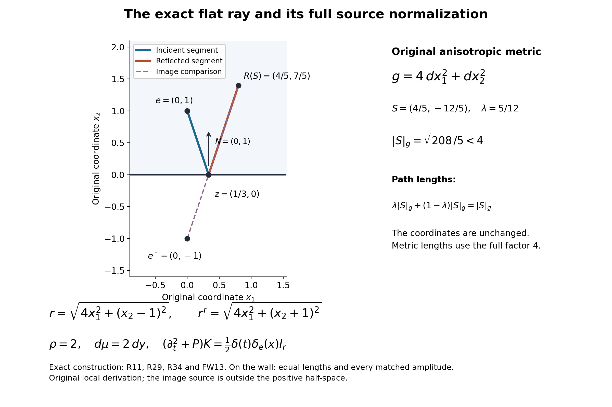
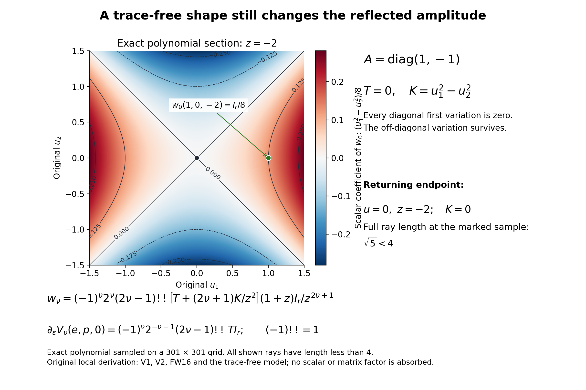

# A wave kernel that cancels at a curved boundary

An image point gives an exact Dirichlet kernel for a flat wall. For a curved wall, the useful replacement is a second coordinate chart: its radial curves travel to the wall and then reflect. The incident and reflected terms have the same singular distribution on the wall. Their smooth amplitudes can therefore be matched there, before any remainder is estimated.

The scale matters. A source at distance \(\varepsilon\) from the wall is examined for times and path lengths smaller than \(4\varepsilon\). Dividing space and time by \(\varepsilon\) turns the source into a fixed point and the wall into a smooth perturbation of a plane. This makes the construction uniform as the source approaches the boundary. It does not include tangent reflection or arbitrarily many reflections.

## 1. The equation and the two pieces of input

Let \(X\) be a smooth manifold with smooth boundary, and work in a coordinate neighborhood of a compact subset \(K\subset\partial X\). An open bounded smooth domain is a particular case. The spatial operator has positive scalar principal symbol and, in a local frame of a complex bundle of rank \(r\), is
\[
 P=-\partial_j\bigl(g^{jk}(q)\partial_k\bigr)I_r
       +b^j(q)\partial_j+c(q).                         \tag{R1}
\]
Repeated spatial indices are summed. The matrix \((g^{jk})\) is real, symmetric, smooth and positive definite up to the boundary; \(b^j,c\) are arbitrary smooth complex matrices, acting on the left. The metric on vectors is \(g=(g_{jk})=(g^{jk})^{-1}\). Coefficients are extended smoothly across the boundary, retaining positive definiteness after reducing the neighborhood. Every conclusion is local over \(K\); no global uniform ellipticity or global trivialization is assumed.

We use coordinate distributions and the source normalization
\[
 \rho(q)=(\det g^{jk}(q))^{-1/2},\qquad
 \delta_\mu(q,y)=\rho(y)^{-1}\delta_y(q),\qquad d\mu=\rho\,dq.
                                                               \tag{R2}
\]
Thus a kernel acting with \(d\mu(y)\) has the identity source \(\delta_\mu I_r\). In a new coordinate chart the density and the coordinate Dirac mass must both be transformed. The wave operator is \(\partial_t^2+P\), with negative spatial Laplacian in the flat case.

The construction uses the following basic facts and earlier lessons.

* **Calculus and distributions.** smooth finite-dimensional calculus, the inverse and implicit function theorems, Taylor's formula with remainder, smooth cutoffs, compactness, and local smooth dependence for the geodesic ordinary differential equation. Distributional differentiation, smooth multiplication, coordinate change and Fourier transformation have their usual meanings. The required linear matrix transport is proved below.
* **Interior geometry and transport.** Sections 4–6 of [Building a local inverse from radial singularities](elliptic-hadamard-parametrices.md) provide geodesic coordinates and jointly smooth matrix amplitudes \(U_\nu(q,y)\), with \(U_0(y,y)=I_r\), obtained from the negative-principal operator (R1). Only the local geometry and these transport amplitudes are used. No boundary result or reflection coefficient is imported.
* **Causal wave kernels.** [Causal kernels, initial data, and short-time geometry](wave-hadamard-kernels.md) supplies the distributions \(E_\nu\), \(\nu\in\mathbb N_0\), on \(\mathbb R_t\times\mathbb R^n_z\), with the normalization
\[
\begin{split}
 (\partial_t^2-\Delta_z)E_0&=\delta_{(0,0)},\\
 (\partial_t^2-\Delta_z)E_\nu&=\nu E_{\nu-1},\qquad
 -2\partial_{z_j}E_\nu=z_jE_{\nu-1}\quad(\nu>0),\\
 E_\nu(at,az)&=a^{2\nu+1-n}E_\nu(t,z),\qquad a>0.
\end{split}                                                     \tag{R3}
\]
They are rotationally invariant, supported in \(t\geq|z|\), and smooth in \(t\geq0\) with values in spatial distributions. Their one-sided initial derivatives vanish through order \(2\nu\), and the next is \(\nu!\delta_0\). Away from the cone vertex, the only singularity is a conormal distribution to \(t=|z|\). For \(\nu>(n-1)/2\), their causal cone formula is a constant multiple of \(\boldsymbol1_{t>0}(t^2-|z|^2)_+^{\nu-(n-1)/2}\); the wave unit proves integer regularity strictly below that exponent, including at the vertex. The Hölder refinement is proved in Section 7 below. The same prerequisite supplies the finite incident identity obtained from (R3) and the preceding interior amplitudes.

The reflected proof applies to every finite rank and retains the order of matrix multiplication. It is a Dirichlet theorem for a scalar principal symbol; it does not close general complementing boundary systems or operators with several distinct principal propagation cones.

## 2. A uniform coordinate neighborhood at boundary distance one

Choose local boundary coordinates \(p\) and follow the inward unit normal geodesic from each boundary point. This gives boundary-normal coordinates \((p,a)\), with
\[
 X=\{a\geq0\},\qquad g_{jn}=g_{nj}=0\ (j<n),\qquad g_{nn}=1.
                                                               \tag{R4}
\]
Here and below an index smaller than \(n\) is tangential; the normal coordinate itself is written \(q_n\) when ambiguity is possible. To justify the construction, at distance zero the differential of the normal-geodesic map consists of a tangential basis and the inward normal, so it is invertible. Smooth geodesic dependence and the inverse function theorem give a collar. Orthogonality in (R4) follows by differentiating the inner product of the normal velocity and a tangential variation field: metric compatibility and the geodesic equation make this derivative zero, and its initial value is zero. The normal velocity has constant unit length. Finitely many such neighborhoods cover \(K\), and reducing their thickness gives uniform bounds. In this collar the coordinate \(q_n\) is the distance to the boundary: every curve reaching the boundary has length at least the change of \(q_n\), since (R4) makes its speed at least \(|\dot q_n|\), and a normal segment achieves equality.

Write the center as \(y=(p,\varepsilon)\), \(\varepsilon>0\), and set
\[
 q=(p,0)+\varepsilon x,\qquad t_{\rm phys}=\varepsilon t,
 \qquad e=(0,\ldots,0,1),
 \qquad G_{p,\varepsilon}(x)=(g_{jk}((p,0)+\varepsilon x)).       \tag{R5}
\]
The capital \(G\) here denotes the covariant metric of the scaled space. On every fixed bounded set of \(x\), this metric is smooth jointly in \((x,p,\varepsilon)\) down to \(\varepsilon=0\). At zero it is constant, has normal coefficient one and no tangential-normal cross terms. In particular it need not be tangentially Euclidean in the original coordinates.

Let
\[
 A_y(S)=\exp^{G_{p,\varepsilon}}_e S,\qquad
 B_y=\{S:|S|_{G_y(e)}<4\}.                                   \tag{R6}
\]
For sufficiently small \(\varepsilon\), the map is defined and is a diffeomorphism on a neighborhood of the closure of \(B_y\), uniformly over compact subsets of a boundary chart. Here is a useful quantitative version of that assertion. The Christoffel symbols of \(G_y\) are \(O(\varepsilon)\), with all fixed derivative bounds uniform; on the slightly larger ball \(|S|_{G_y(e)}\leq 4+\eta\), the geodesic equation and its differentiated integral equations give
\[
 A_y(S)=e+S+O(\varepsilon),\qquad d_SA_y=I+O(\varepsilon),
                                                               \tag{R7}
\]
uniformly with each fixed number of derivatives. Choose a common Euclidean velocity ball containing these ellipsoids. On it, reduce \(\varepsilon\) until the derivative error has norm below \(1/2\). Integration along a line segment proves
\(|A_y(S)-A_y(T)|\geq|S-T|/2\). This proves injectivity as well as local invertibility; it is stronger than applying the inverse function theorem separately at each point. Compactness supplies the same choices for the finitely many charts. Ordinary exponential coordinates around \(y\) follow by undoing (R5). In particular \((y,s)\mapsto(y,\exp_y s)\) is a local diffeomorphism near the zero section and the diagonal.

## 3. Which rays hit, and how they return

Let \(F_y(S)\) be the last coordinate of \(A_y(S)\). By (R7),
\[
 F_y(S)=1+S_n+O(\varepsilon),\qquad d_SF_y=dS_n+O(\varepsilon).
                                                               \tag{R8}
\]
The level surface \(\Sigma_y=\{F_y=0\}\cap B_y\) divides the velocity ball into incident endpoints in \(X\) and endpoints beyond the wall. Denote the latter region, including the hitting surface, by \(B_y^-\).

Every \(S\in B_y^-\) has one first hitting time \(\lambda_y(S)\in(0,1]\), defined by
\[
 F_y(\lambda_y(S)S)=0.                                       \tag{R9}
\]
The word "first" can be verified uniformly. A zero with \(|S|_{G_y(e)}<4+\eta\) has \(\lambda S_n=-1+O(\varepsilon)\). Consequently \(S_n\leq-c<0\), \(\lambda\geq c>0\), and
\(\partial_\lambda F_y(\lambda S)=S_n+O(\varepsilon)\leq-c\), for a uniform \(c\). The entire relevant segment has negative normal velocity, since its velocity differs from \(S\) by \(O(\varepsilon)\). Hence it crosses at most once. The implicit function theorem proves smoothness of \(\lambda_y\), including up to \(\Sigma_y\). At \(\varepsilon=0\), \(\lambda_y=-1/S_n\). The bounds also show that an endpoint with \(F_y>0\) has not secretly crossed and returned before time one: if its normal velocity is ever capable of reaching the wall in the allowed time, that velocity has the same strict negative sign along the segment.

Let \(z=A_y(\lambda S)\) and let \(T\) be the geodesic velocity at the hit when the geodesic is parameterized on the same unit-time scale as \(S\). Reflect it in the metric normal:
\[
 T^r=T-2\langle T,N_z\rangle_{G_y}N_z,\qquad
 R_y(S)=\exp_z^{G_y}\big((1-\lambda)T^r\big).                 \tag{R10}
\]
In (R4) this changes only the sign of the last tangent component. The outgoing velocity has uniformly positive normal component, and its variation on the remaining bounded interval is \(O(\varepsilon)\); it therefore has no second hit. Both the hitting and reflected constructions are smooth up to \(\Sigma_y\), and
\[
 R_{p,0}(S)=(S',-1-S_n).                                     \tag{R11}
\]
The same derivative and line-segment argument as in (R7), applied to a slightly larger region \(S_n<-1+c_1\), proves that \(R_y\) is a diffeomorphism onto its image \(\Omega_y\). The extension to this region is obtained by allowing the implicit hitting parameter a little beyond one; the actual reflected segment uses only \(\lambda\leq1\). Thus a collar of the reflecting surface causes no differentiability problem. The image contains a neighborhood of \(e\): the vector \(-2e\) gives the normal ray down to the wall and back to the center, with total length two, exactly in boundary-normal coordinates. Define the reflected length by
\[
 r_y^r(x)=|R_y^{-1}(x)|_{G_y(e)},\qquad x\in\Omega_y.          \tag{R12}
\]
It is smooth and bounded away from zero there, locally uniformly with parameters. The incident distance \(r_y(x)=|A_y^{-1}(x)|_{G_y(e)}\) is smooth off \(x=e\). At the wall the two lengths agree, since the reflected segment has length zero. There is no assertion of a single smooth chart obtained by joining \(A_y\) and \(R_y\) across the switch. Each branch is used on its own domain.

## 4. The radial identity survives a reflection

For a smooth family of geodesic segments, the variation of length equals the final unit momentum paired with final displacement minus the initial unit momentum paired with initial displacement. This follows by differentiating the length integral, using metric compatibility, and integrating the velocity-variation term by parts; the interior term is the covariant acceleration and vanishes for a geodesic. Apply the formula to both segments of the broken path. The two terms at the moving hit point \(z\) add to
\[
 \langle T/|T|-T^r/|T^r|,\dot z\rangle_{G_y}=0,              \tag{R13}
\]
because the vector difference is normal and \(\dot z\) is tangent to the boundary. Thus the derivative of the total length is just its final unit momentum paired with the final endpoint variation. This proves orthogonality of each reflected wavefront to its final rays; it also proves the full identity needed for transport, not just orthogonality at one endpoint.

Indeed put \(H_0=G_y(e)\) and let \(\widehat G_y=R_y^*G_y\). Along a radial change of \(S\), the endpoint moves along the outgoing geodesic with velocity corresponding to the entire path length. Since the squared total length is \(S^tH_0S\), (R13) gives
\[
 \widehat G_y(S)(S,W)=H_0(S,W)\quad\hbox{for every }W,
 \qquad \widehat G_y(S)S=H_0S.                              \tag{R14}
\]
Writing \(a_y=\widehat G_y^{-1}\), this is
\(a_y(S)H_0S=S\). The identical calculation for a segment without reflection proves the incident identity. An orthonormalizing linear change is optional; retaining \(H_0\) makes the density normalization transparent.

Pull the actual operator \(P_y\) into the reflected chart and write it uniquely in divergence form relative to \(dS\):
\[
 Q_y=-\partial_{S_j}(a_y^{jk}\partial_{S_k})I_r
                 +\beta_y^j\partial_{S_j}+\gamma_y,
 \qquad h_y(S)=\beta_y^j(S)(H_0S)_j.                        \tag{R15}
\]
The pullback of a differential operator acting on functions includes its coordinate first-order terms. They are part of \(\beta_y\), even when the original operator is a Laplace operator. In particular
\[
 Q_{p,0}=-g^{jk}(p,0)\partial_{S_j}\partial_{S_k}I_r,
 \qquad h_{p,0}=0,\qquad\gamma_{p,0}=0.                     \tag{R16}
\]
The minus sign in (R16) is fixed by (R1) and (R3).

For a radial smooth function \(f(S^tH_0S)\), (R14) gives
\(a_y\nabla f=2Sf'\). Taking the divergence shows that the principal divergence operator on such a function is its constant-metric counterpart. The same assertion holds for the cone distributions \(E_\nu(t,|S|_{H_0})\). On this reflected domain \(|S|\) never vanishes, so one can use \((t,|S|,\omega)\) coordinates: multiplication and differentiation of the one-dimensional distribution in its radial argument obey the ordinary chain rule. Equivalently, regularize that one-dimensional distribution, apply the smooth identity and pass to distributions. No unverified multiplication at the cone is required.

For \(\nu>0\), the product rule and (R3) now give
\[
 (\partial_t^2+Q_y)(vE_\nu)
  =(Q_yv)E_\nu+
     \big(\nu v+S\cdot\nabla_Sv-\tfrac12h_yv\big)E_{\nu-1}.
                                                               \tag{R17}
\]
The coefficient acts on the left of the matrix amplitude. For \(\nu=0\), the same product rule has no point source on this domain, and its radial derivative term vanishes precisely when
\(2S\cdot\nabla v=h_yv\). These calculations explain which operator sign and which multiplication order belong in the reflected transport equations.

## 5. Transport starts at the wall

Let smooth matrix data \(d_\nu\) be prescribed on \(\Sigma_y\). Set \(v_{-1}=0\). There is a unique smooth family on \(B_y^-\), including its boundary, satisfying
\[
 (S\cdot\nabla_S+\nu-\tfrac12h_y)v_\nu=-Q_yv_{\nu-1},
 \qquad v_\nu|_{\Sigma_y}=d_\nu.                             \tag{R18}
\]
The assertion is local on the bounded velocity region under discussion, and smoothness includes every parameter in a compact set.

Here is an explicit solution and uniqueness proof. Fix \(S\), put \(\lambda=\lambda_y(S)\), and let \(M(r,s)\) solve
\[
 \partial_rM(r,s)=\frac{h_y(rS)}{2r}M(r,s),\qquad M(s,s)=I_r,
 \qquad \lambda\leq r,s\leq1.                               \tag{R19}
\]
The coefficient is smooth, since \(\lambda\geq c>0\). Iterating its integral equation gives an ordered integral series whose term of order \(k\) has norm at most \(C^k/k!\). Each fixed number of derivatives in \((S,y,r,s)\) contributes at most a polynomial factor in \(k\), so the differentiated series converges uniformly as well. The reverse equation \(\partial_rM(s,r)=-M(s,r)h_y(rS)/(2r)\) proves invertibility. This argument does not commute any matrices.

If \(f_\nu=-Q_yv_{\nu-1}\), variation of constants gives
\[
 v_\nu(S)=\lambda^\nu M(1,\lambda)d_\nu(\lambda S)
     +\int_\lambda^1r^{\nu-1}M(1,r)f_\nu(rS)\,dr.             \tag{R20}
\]
To verify the formula, on a ray multiply the equation by \(r^\nu M(\lambda,r)\); its derivative is \(r^{\nu-1}M(\lambda,r)f_\nu(rS)\). Integration gives (R20). The boundary data and the equation determine the solution uniquely on that ray, and every point lies on exactly one such outgoing ray. Smoothness of the endpoint \(\lambda(S,y)\), the integrand and the ordered series proves smoothness of the solution. Induction in \(\nu\) proves the entire statement. The factor \(\lambda^\nu\) is necessary even in the scalar case. Unlike transport from a center, transport here has a nonzero initial radius and allows an independent datum for every \(\nu\).

## 6. Scaling the incident wave and matching all coefficients

Under (R5), the scaled spatial operator is
\[
 P_y=-\partial_{x_j}(g^{jk}((p,0)+\varepsilon x)\partial_{x_k})I_r
   +\varepsilon b^j((p,0)+\varepsilon x)\partial_{x_j}
   +\varepsilon^2c((p,0)+\varepsilon x).                    \tag{R21}
\]
In fact \(\partial_{q_j}=\varepsilon^{-1}\partial_{x_j}\) and \(\partial_{t_{\rm phys}}=\varepsilon^{-1}\partial_t\); multiplying the original equation by \(\varepsilon^2\) proves every factor in (R21). Let
\[
 A_\nu(x,y)=\varepsilon^{2\nu}U_\nu((p,0)+\varepsilon x,y),
 \qquad I_N(t,x,y)=\sum_{\nu=0}^N A_\nu(x,y)E_\nu(t,r_y(x)).  \tag{R22}
\]
Then the finite incident identity is
\[
 (\partial_t^2+P_y)I_N
   =\rho(y)^{-1}\delta_{(0,e)}I_r
          +(P_yA_N)E_N(t,r_y(x)).                           \tag{R23}
\]
For a direct scaling check, multiply the physical kernel by \(\varepsilon^{n-1}\) before substituting (R5). Its \(\nu\)-th term acquires the factor \(\varepsilon^{n-1}\varepsilon^{2\nu+1-n}=\varepsilon^{2\nu}\). The operator contributes \(\varepsilon^2\), and the spacetime delta contributes \(\varepsilon^{-n-1}\). Their product is one. Thus the source is at \((0,e)\), not at the unscaled coordinate value \((0,y)\). In (R23), \(P_yA_N=\varepsilon^{2\nu}P_y[U_N((p,0)+\varepsilon\,\cdot,y)]\) with \(\nu=N\); the operator differentiates the composed function of \(x\).

Use (R18) with data
\[
 d_\nu(S,y)=A_\nu(A_y(S),y),\quad S\in\Sigma_y,
 \qquad V_\nu(x,y)=v_\nu(R_y^{-1}(x),y).                     \tag{R24}
\]
All these functions are smooth down to \(\varepsilon=0\). At zero, the incident data are \(d_0=I_r\) and \(d_\nu=0\) for \(\nu>0\), because \(U_0(y,y)=I_r\) and the positive-index factor is \(\varepsilon^{2\nu}\). Equations (R16), (R18) and uniqueness give
\[
 V_0(x,p,0)=I_r,\qquad V_\nu(x,p,0)=0\quad(\nu>0).          \tag{R25}
\]
The latter conclusion uses \(Q_{p,0}I_r=0\) at the first induction step. Smooth extension of \(V_\nu\) through \(\varepsilon=0\) does not mean it contains the factor \(\varepsilon^{2\nu}\); the differentiated transport equations will show a curvature obstruction to that stronger statement.

## 7. A finite Dirichlet parametrix, with its exact error

On the common incident and reflected coordinate region put
\[
 K_N(t,x,y)=\sum_{\nu=0}^N
       \{A_\nu(x,y)E_\nu(t,r_y(x))
                   -V_\nu(x,y)E_\nu(t,r_y^r(x))\}.          \tag{R26}
\]
There is a sufficiently small collar over \(K\), chosen independently of \(N\), such that this is defined for \(r_y^r(x)<4\) and \(t<4\). The coefficients for every fixed finite \(N\) are smooth jointly in \((x,p,\varepsilon)\) down to zero. The distribution has zero Dirichlet trace and satisfies
\[
\begin{split}
 (\partial_t^2+P_y)K_N
   &=\rho(y)^{-1}\delta_{(0,e)}I_r+\mathcal R_N,\\
 \mathcal R_N
   &=(P_yA_N)E_N(t,r_y(x))
                 -(P_yV_N)E_N(t,r_y^r(x)).
\end{split}                                                     \tag{R27}
\]
For every nonnegative regularity index satisfying
\[
                  \mu<N-\frac{n-1}{2},                       \tag{R28}
\]
the error is locally \(C^\mu\), uniformly on compact subsets of the scaled variables and the closed parameter collar. For integral \(\mu\), this means continuously differentiable through order \(\mu\); for nonintegral \(\mu\), it means the corresponding local Hölder class. If no nonnegative \(\mu\) satisfies (R28), the identity still holds as a distributional finite parametrix, without a positive regularity claim for its error.

**Proof of cancellation.** At \(x_n=0\), equations (R12) and (R24) give equal lengths and equal coefficients term by term. The traces exist as distributions in \((t,x',y)\). One can check this without a general restriction theorem. The lengths at the boundary are uniformly positive. For such a smooth positive length \(r\), (R3) is locally a one-dimensional distribution in \(t-r\), smoothly depending on all other variables: in the expression involving \(t^2-r^2\), the derivative with respect to \(t\) is \(2t\ne0\) near its forward cone. Pullback is consequently defined by a change of the time variable. Outside that cone the distribution is smooth. Restricting the smooth length and amplitude to \(x_n=0\) gives the claimed trace, and the two traces coincide. The apparent cone singularity therefore does not obstruct the cancellation.

The incident chart is available on this whole reflected region. Work first with the slightly larger normal ball used in (R7). The incident Gauss identity bounds the length of any curve escaping that ball below by its radius: in radial coordinates its speed is at least the absolute radial speed. Thus a path of length less than four cannot escape the larger ball. Inside it the same estimate proves that the incident radial geodesic minimizes length. Applying this to the once-broken path gives \(r_y(x)\leq r_y^r(x)<4\). Hence no additional, unmentioned intersection restriction reduces the stated reflected domain.

Apply (R17) to the reflected sum. Equation (R18) cancels each consecutive pair; the term of index zero has no delta source because the reflected chart excludes \(S=0\). The only reflected term left is \((P_yV_N)E_N\). Subtract it from (R23) to obtain (R27). The same reasoning covers \(N=0\). Causality follows from the supports in (R3). Near \(t=0\) the reflected sum vanishes, since its length is bounded below, so the initial point singularity is exactly the incident one. In the Euclidean case with zero lower-order coefficients, (R25) holds for every \(\varepsilon\), every higher coefficient vanishes, and (R26) becomes the exact image kernel
\[
 E_0(t,x-e)-E_0(t,x-e^*),\qquad e^*=(0,\ldots,0,-1).          \tag{R29}
\]
Its reflected source lies outside the interior half-space. This also directly verifies the flat equation, causal support, initial source and boundary trace.

**Proof of the error estimate.** All coefficients in (R27), including their parameter derivatives, are bounded on each of the stated compact sets. Near the incident center, the map from \((x,y)\) to its incident velocity and \(y\) is a smooth diffeomorphism. A smoothly parameterized positive square root of \(H_0\) reduces the constant metric there to the Euclidean metric; such a square root is smooth, for instance by the implicit equation \(L^2=H_0\) on positive matrices, whose derivative \(Z\mapsto LZ+ZL\) is invertible after diagonalizing \(L\). The regularity input for \(E_N\), composed with this diffeomorphism and multiplied by smooth coefficients, gives (R28) at the incident cone vertex as well as away from it. The reflected cone has no vertex in the chart and uses the same argument or the one-dimensional representation just used for its trace. No factor \(\varepsilon^{-1}\) is introduced: these are the scaled variables in which the entire family is smooth.

Here is the additional argument for a nonintegral \(\mu=k+\alpha\), with \(k\geq0\) integral and \(0<\alpha<1\). Set \(a=N-(n-1)/2>k+\alpha\). On a fixed annulus about the cone vertex, the \(k\)-th derivatives of the causal cone function are \(\alpha\)-Hölder: near its nonzero cone this follows by differentiating \(q_+^a\) and using \(|u_+^\beta-v_+^\beta|\leq C|u-v|^\alpha\) on bounded intervals when \(\beta>\alpha\); away from the cone the function is smooth. This elementary inequality follows from concavity when \(0<\beta\leq1\) and the mean value estimate when \(\beta\geq1\). By homogeneity, on an annulus of radius \(r\leq1\) the Hölder bound for a derivative of order \(k\) scales by \(r^{2a-k-\alpha}\). This exponent is positive. For two points whose separation is less than half their larger radius, use that rescaled annular estimate. For a pair separated by at least half that radius, the bound \(|D^kE_N|\leq Cr^{2a-k}\), together with the zero extension at the vertex, gives the same \(C|h|^\alpha\) estimate. These two cases prove local \(C^{k,\alpha}\) regularity across the vertex as well. Smooth coordinate changes, tensoring with a constant in the parameters, and smooth coefficient multiplication preserve this class, completing (R28) for every specified \(\mu\).

The strict bound in (R28) follows from the behavior in the explicit causal radial distribution away from the vertex, which is a constant multiple of \((t^2-r^2)_+^{N-(n-1)/2}\). Differentiation at the cone loses one power for each derivative; at an integer power the critical derivative can jump. A smooth coefficient does not generally remove that jump. For a noninteger exponent the corresponding Hölder endpoint is attained; for a positive integer exponent the preceding derivative is Lipschitz, while the next derivative can still jump. The complete proof through the vertex is in Section 11 of the linked wave lesson. Increasing \(N\) yields any prescribed finite regularity. It does not turn a given finite sum into an exact inverse. \(\square\)

Returning to physical variables gives the kernel \(\varepsilon^{1-n}K_N(t_{\rm phys}/\varepsilon,(q-(p,0))/\varepsilon,y)\) in the corresponding neighborhood. Its error estimates have the powers obtained by this formula and the chain rule; the uniform statement (R28) is in the scaled coordinates. Coefficient extension supplies the incident construction with all centers up to the boundary, while the incident term alone can solve the local mixed problem only before the wave reaches the wall. The reflected construction deals with times less than a fixed multiple of the boundary distance. A construction for times small relative to its square root would need additional control of approaching tangency and is not proved here.

**Editorial strengthening of the finite error.** Retain (R26)--(R28) and all their hypotheses. Set \(a=N-(n-1)/2>0\). For nonintegral \(a=k+\alpha\), with integer \(k\geq0\) and \(0<\alpha<1\), the exact error belongs jointly to \(C^{k,\alpha}\) on the stated compact scaled sets and closed parameter collar. For positive integer \(a=\ell\), it belongs to \(C^{\ell-1,1}\), meaning Lipschitz derivatives at the preceding order, not \(C^\ell\). The full cone proof, with its gamma constant, all derivative terms, vertex argument, sharpness and joint parameter transfer, is in Section 11 of [Causal kernels, initial data, and short-time geometry](wave-hadamard-kernels.md#11-the-strict-regularity-bound-and-the-causal-extension). In (R27) the incident term uses the smooth normal chart and the original positive square root; the reflected length stays away from zero. Smooth multiplication preserves the class in the original matrix order. This gives the claimed endpoint for each original error term.

**Reflected-error proof 5. The original finite reflected error and its extra distance factor.**

Keep the original scaled operator \(P_y\) of R21, incident amplitude \(A_N\)=\(\varepsilon ^{2N}\)\(U_N\)((p,0)+εx,y), \(y=(p,\varepsilon )\), and all ordered reflected transport coefficients \(V_N\). The exact error remains

\[
 \mathcal R_N=(P_yA_N)E_N(t,r_y(x))
                -(P_yV_N)E_N(t,r_y^r(x)).
 \tag{ER1}
\]

Acting on a composed smooth function, the complete operator scaling in R21 gives the following identity,

\[
 P_y[U_N((p,0)+\varepsilon x,y)]
 =\varepsilon^2(P_qU_N)((p,0)+\varepsilon x,y),
\]

, since y is held fixed during the q differentiation. Consequently

\[
 \begin{split}
 P_yA_N&=\varepsilon^{2N+2}(P_qU_N)((p,0)+\varepsilon x,y),\\
 P_yV_N(x,p,\varepsilon)&=\varepsilon B_N(x,p,\varepsilon),\\
 B_N(x,p,\varepsilon)&=\int_0^1
   \left.\partial_s\big[P_{p,s}V_N(x,p,s)\big]
                                    \right|_{s=\theta\varepsilon}\,d\theta.
 \end{split}
 \tag{ER2}
\]

For the second equality, R25 gives \(V_0(x,p,0)=I_r\) and \(V_N(x,p,0)=0\) for \(N>0\), both spatially constant, and R21 at ε=0 is the constant principal operator with no drift or potential. Thus \(P_{p,0}V_N(x,p,0)=0\) for every \(N\geq 0\). Taylor's integral formula proves ER2 exactly. All spatial and p derivatives of \(B_N\) are bounded on the original compact sets; every fixed ε derivative is also bounded because its integrand is smooth. No claim that \(V_N\) has incident vanishing order \(\varepsilon ^{2N}\) is made.

Keeping both original terms visible, ER1 therefore also has the exact expression

\[
 \mathcal R_N=\varepsilon^{2N+2}(P_qU_N)((p,0)+\varepsilon x,y)
                         E_N(t,r_y(x))
       -\varepsilon B_N(x,p,\varepsilon)E_N(t,r_y^r(x)).
 \tag{ER3}
\]

For \(a>0\) and k,α defined above, the two kernel families have uniform joint endpoint bounds by Section 4. Hence for fixed retained (p,ε), the scaled \(C^{k,\alpha }\) norm in (t,x) is at most Cε; the incident term separately is bounded by C\(\varepsilon ^{2N+2}\). These bounds also hold after any fixed p derivative permitted by the endpoint class, and spatial derivatives do not consume the explicit ε factor. An ε derivative can consume that factor and can differentiate the cone coordinate; arbitrary ε derivatives are not being asserted to remain functions of this finite regularity.

**Reflected-error proof 6. Full physical variables, without suppressing a power.**

The physical kernel and error are exactly

\[
 \begin{split}
 K_N^{\rm phys}(t_{\rm phys},q,y)
 &=\varepsilon^{1-n}K_N\left(t_{\rm phys}/\varepsilon,
                         (q-(p,0))/\varepsilon,y\right),\\
 \mathcal R_N^{\rm phys}(t_{\rm phys},q,y)
 &=\varepsilon^{-n-1}\mathcal R_N\left(t_{\rm phys}/\varepsilon,
                         (q-(p,0))/\varepsilon,y\right).
 \end{split}
 \tag{ER4}
\]

The full wave operator contributes ε^{-2}; the full space/time Dirac mass contributes ε^{n+1} under composition. Therefore the point source remains exactly ρ(y)^{-1}δ(t_phys)δ_y(q)I_r. Nothing in the norm strengthening changes that density or the finite distribution identity.

Let β be a list of physical time/spatial derivatives of length \(j\leq k\) and hold \(y=(p,\varepsilon )\) fixed. On a physical compact set obtained by scaling a specified original compact set,

\[
 D_{t_{\rm phys},q}^{\beta}\mathcal R_N^{\rm phys}
 =\varepsilon^{-n-1-j}(D_{t,x}^{\beta}\mathcal R_N)
            \left(t_{\rm phys}/\varepsilon,(q-(p,0))/\varepsilon,p,\varepsilon\right),
 \quad
 \|D^\beta\mathcal R_N^{\rm phys}\|_\infty
                         \leq C_\beta\varepsilon^{-n-j}.
 \tag{ER5}
\]

For derivatives of order k their Hölder seminorm has the additional distance factor ε^{-α}, giving

\[
 [D^k\mathcal R_N^{\rm phys}]_\alpha
 \leq C\varepsilon^{-n-k-\alpha},\qquad
 \|D^j\mathcal R_{N,\rm incident}^{\rm phys}\|_\infty
       \leq C_j\varepsilon^{2N+1-n-j},\qquad
 [D^k\mathcal R_{N,\rm incident}^{\rm phys}]_\alpha
       \leq C\varepsilon^{2N+1-n-k-\alpha}.
 \tag{ER6}
\]

For nonintegral a, k+α=N−(n−1)/2; for integral a the class is \(C^{a-1,1}\). These are norms with the physical metric distance for a fixed source, not joint uniform bounds as ε→0 in physical source coordinates.

For completeness the exact ε derivative at fixed p,t_phys,q retains every term:

\[
 \partial_\varepsilon\mathcal R_N^{\rm phys}
 =\varepsilon^{-n-2}
 \big[-(n+1)\mathcal R_N-t\partial_t\mathcal R_N
       -\sum_jx_j\partial_{x_j}\mathcal R_N
       +\varepsilon\partial_\varepsilon\mathcal R_N\big]
        (t_{\rm phys}/\varepsilon,(q-(p,0))/\varepsilon,p,\varepsilon).
 \tag{ER7}
\]

It is a classical identity when the required derivatives exist and always a distribution identity for ε>0. More generally, after j physical derivatives, write \(F=D^\beta  R_N\) and \(\lambda =n+1+j\). For every h for which a classical claim is made, or distributionally without that restriction,

\[
 \partial_\varepsilon^h[\varepsilon^{-\lambda}F(t_{\rm phys}/\varepsilon,
                  (q-(p,0))/\varepsilon,p,\varepsilon)]
 =\varepsilon^{-\lambda-h}
  \left[\prod_{v=0}^{h-1}
    (\varepsilon\partial_\varepsilon-t\partial_t
        -\sum_ix_i\partial_{x_i}-\lambda-v)\right]F
       (t_{\rm phys}/\varepsilon,(q-(p,0))/\varepsilon,p,\varepsilon).
 \tag{ER8}
\]

Induction proves this identity by differentiating the prefactor and the three composed arguments; each new prefactor exponent is λ+v. All operators in the product differ only by scalar constants and therefore commute. At fixed physical q a p_i derivative also includes \(-\varepsilon ^{-1}\partial _{x_i}\), in addition to the explicit \(\partial _{p_i}\); thus these bounds are not silently transferred to physical source derivatives. This completes the original scaling comparison, the cone endpoint and the extra error factor, without removing any coefficient, density or exceptional integer endpoint.

## 8. The first geometric perturbation

The reflected coefficients respond to the first normal derivative of the metric. Fix one boundary point, choose tangential coordinates geodesic for the induced boundary metric, and orthonormalize the tangent frame at that point. Put
\[
 A=-\tfrac12(\partial_{q_n}g_{jk}(0))_{j,k<n},\qquad
 K(u)=u^tAu,\qquad T=\operatorname{tr}A.
 \tag{R30}
\]
The matrix \(A\) is symmetric. Our shape operator is \(-dN\), where \(N\) points into \(X\). Thus \(T\) is the sum of the principal curvatures. A definition of mean curvature as their average replaces \(T\) by \((n-1)\) times that average. For \(n=1\), the tangential matrix is empty and \(K=T=0\).

With the base point suppressed from the notation, Taylor expansion of the scaled metric in boundary-normal coordinates gives
\[
 g_\varepsilon=\sum_jdq_j^2-2\varepsilon q_n\,dq'^t A\,dq'
                       +O(\varepsilon^2).                  \tag{R31}
\]
All tangential first derivatives vanish by the choice of the boundary coordinates; the normal cross coefficients vanish identically by (R4). Here and throughout the variation calculation, \(O(\varepsilon^2)\) means \(\varepsilon^2\) times a function smooth jointly in the spatial variables, the base point and \(\varepsilon\). Spatial and base-point derivatives retain the two powers; an \(\varepsilon\) derivative can consume one. Taylor's integral remainder gives precisely this meaning, uniformly on each compact scaled set.

The change
\[
 X'=q'-\varepsilon q_nAq',\qquad
 X_n=q_n+\tfrac{\varepsilon}{2}K(q')                         \tag{R32}
\]
pulls the Euclidean metric back to (R31), through first order. Indeed the tangential differential square contributes \(-2\varepsilon q_n\,dq'^tA\,dq'\) and \(-2\varepsilon(Aq'\cdot dq')dq_n\); the normal differential square contributes the opposite cross term. The map fixes \(e\), and sends the boundary to the graph \(X_n=\varepsilon K(X')/2+O(\varepsilon^2)\). Smooth ODE dependence, the uniform transversality estimate in Section 3, and the inverse function theorem show that perturbing these metric and boundary jets by \(O(\varepsilon^2)\) changes each ray, hitting time and inverse chart by \(O(\varepsilon^2)\), with all fixed derivative bounds. Consequently the first variation can be computed in this Euclidean graph model.

Write the graph-model initial vector as \(S=(u,z)\), with \(z<-1\), and the reflected endpoint as \(\Phi_\varepsilon(S)\). Both are expressed in the Euclidean \(X\) coordinates, with center \(\Pi=e\). The parameter in the following calculation is the unit travel-time parameter, so the total path length is \(|S|\).

The unreflected path is \(\Pi+\lambda S\). The hitting equation is

\[
 1+\lambda z=\frac{\varepsilon}{2}\lambda^2K(u).
\]

At ε=0 its solution is \(\lambda_0=-1/z\), and the derivative of the left minus right side with respect to λ is z. Hence the implicit function theorem gives a smooth hitting time and

\[
 \lambda z=-1+\frac{\varepsilon K(u)}{2z^2}+O(\varepsilon^2).
 \tag{V3}
\]

At the hit point the inward unit normal equals
\((\varepsilon Au/z,1)+O(\varepsilon^2)\). Its squared norm differs from 1 only in order ε². Therefore reflection of the tangent gives

\[
 \widetilde S=S-2(S\cdot N)N
 =\left(u-2\varepsilon Au,
       -z-2\varepsilon K(u)/z\right)+O(\varepsilon^2).
\]

Adding the remaining segment, \(\lambda S+(1-\lambda)\widetilde S+\Pi\), yields

\[
 \Phi_\varepsilon(S)=
 \left(u-2\varepsilon(1+1/z)Au,
 -1-z-\varepsilon K(u)(z^{-2}+2z^{-1})\right)
 +O(\varepsilon^2).
 \tag{V4}
\]

Composing the endpoint with the fixed isometry \(R(X',X_n)=(X',-1-X_n)\) leaves the Euclidean Laplacian unchanged and gives

\[
 R\Phi_\varepsilon(S)=S+\varepsilon\psi(S)+O(\varepsilon^2),\qquad
 \psi(S)=\left(-2(1+1/z)Au,(z^{-2}+2z^{-1})K(u)\right).
 \tag{V5}
\]

No diagonalization of A was used, so the calculation applies to a general real symmetric second fundamental form.

## 9. The coordinate drift fixes the sign

Let \(F_\varepsilon(S)=S+\varepsilon\psi(S)\), and put
\(D=\operatorname{div}\psi\) and
\(C_{jk}=\partial_j\psi_k+\partial_k\psi_j\).
For a test function f in S coordinates, differentiate
\(f(F_\varepsilon^{-1}(X))\) twice. The inverse derivative is
\(I-\varepsilon D\psi+O(\varepsilon^2)\), so the scalar pullback of the **positive** Laplacian is

\[
 L_\varepsilon f
 =\Delta f-\varepsilon\sum_{j,k}C_{jk}\partial_j\partial_k f
       -\varepsilon\sum_k(\Delta\psi_k)\partial_k f
       +O(\varepsilon^2).
 \tag{V6}
\]

The equivalent divergence form is

\[
 L_\varepsilon
 =\Delta-\varepsilon\sum_{j,k}\partial_j(C_{jk}\partial_k)
       +\varepsilon\sum_k(\partial_k D)\partial_k
       +O(\varepsilon^2).
 \tag{V7}
\]

Indeed \(\sum_j\partial_j C_{jk}=\Delta\psi_k+\partial_kD\).
The last term in (V7) is the **gradient of the divergence**, not the vector whose components are \(\Delta\psi_k\). Confusing these two tensors changes the operator.

The pullback of the actual spatial operator \(-\Delta\) is

\[
 Q_\varepsilon=-L_\varepsilon
 =-\sum_{j,k}\partial_j(a^{jk}\partial_k)
       -\varepsilon\sum_k(\partial_kD)\partial_k
       +O(\varepsilon^2),\qquad
 a^{jk}=\delta_{jk}-\varepsilon C_{jk}.
 \tag{V8}
\]

Let \(\mathcal R=S\cdot\partial_S\). A direct differentiation of (V5) gives

\[
 D=-2(1+1/z)T-2(z^{-3}+z^{-2})K,
 \qquad
 \mathcal R D=\frac2z\left(T+\frac K{z^2}\right).
 \tag{V9}
\]

The radial metric condition is \(\sum_j C_{jk}S_j=0\). One elementary verification is to calculate
\(S\cdot\psi=-K/z\) and use
\((D\psi+D\psi^T)S=\mathcal R\psi+\nabla(S\cdot\psi)-\psi\).
Both tangential and normal components vanish. Consequently the radial drift h for (V8) is

\[
 h=-\varepsilon\mathcal R D+O(\varepsilon^2)
   =-\frac{2\varepsilon}{z}\left(T+\frac K{z^2}\right)
     +O(\varepsilon^2).
 \tag{V10}
\]

This sign can also be obtained without rewriting the operator: the pullback volume Jacobian is \(J=1+\varepsilon D+O(\varepsilon^2)\); therefore the radial Laplace–Beltrami drift is \(\mathcal R\log J\), and the negative Laplacian has its negative.

The radial identity and the divergence expression must be used together. A coordinate change does not preserve a bare divergence formula relative to an arbitrarily fixed coordinate measure. The extra first-order term in (V8) is therefore present even though the Euclidean operator has no drift in its own coordinates.

## 10. Every first variation from one recurrence

For the pure Euclidean operator \(-\Delta I_r\) in the graph model, define \(w_\nu\) by
\[
 v_0=I_r+\varepsilon w_0+O(\varepsilon^2),\qquad
 v_\nu=\varepsilon w_\nu+O(\varepsilon^2)\quad(\nu>0).
 \tag{R33}
\]
The following formula holds for every integer \(\nu\geq0\), with \((-1)!!=1\):
\[
 w_\nu=(-1)^\nu 2^\nu(2\nu-1)!!
   \left[T+(2\nu+1)\frac{K(u)}{z^2}\right]
                 \frac{1+z}{z^{2\nu+1}}I_r.                 \tag{V1}
\]
The formula concerns each finite index. No convergence of the infinite Hadamard series is needed or asserted.

For \(Q=-\partial_j(a^{jk}\partial_k)+b^k\partial_k+c\), with the radial metric condition, the product rule and the flat kernel identities give the coefficient of \(E_{\nu-1}\) in
\((\partial_t^2+Q)(v_\nu E_\nu)\) as

\[
 \nu v_\nu+\mathcal Rv_\nu-\frac12 h v_\nu,
 \qquad h=b\cdot S.
\]

The coefficient contributed at the same kernel order by the preceding amplitude is \(Qv_{\nu-1}\). Thus the transport system is

\[
 (\mathcal R+\nu)v_\nu-\frac12 h v_\nu=-Qv_{\nu-1},
 \qquad v_{-1}=0.
 \tag{V11}
\]

This also fixes the zeroth transport equation: \(2\mathcal Rv_0=hv_0\). For the Euclidean graph model the incident zeroth amplitude is identically I and all positive incident amplitudes vanish. At ε=0 the hitting surface is z=−1; differentiating its shifted location introduces no first-order term because the limiting amplitudes are spatially constant. Hence
\(w_0|_{z=-1}=0\) and \(w_\nu|_{z=-1}=0\) for ν>0.

Equation (V10) now gives

\[
 \mathcal Rw_0=-\frac1z\left(T+\frac K{z^2}\right),\qquad
 w_0|_{z=-1}=0.
\]

Since \(K/z^2\) is homogeneous of degree zero, radial integration gives
\(w_0=(T+K/z^2)(1+1/z)\), as asserted. There is a second direct check: D=0 on z=−1, so to first order the normalized transport solution is \(J^{-1/2}\). At u=0,z=−2, its value is
\((1-\varepsilon T)^{-1/2}=1+\varepsilon T/2+O(\varepsilon^2)\).
This positive focusing variation is independent of the recurrence calculation.

For ν≥1, \(h v_\nu=O(\varepsilon^2)\), and \(Q=-\Delta+O(\varepsilon)\). Since the limiting positive amplitudes vanish, (V11) reduces to

\[
 (\mathcal R+\nu)w_\nu=\Delta w_{\nu-1},\qquad
 w_\nu|_{z=-1}=0.
 \tag{V12}
\]

For ν=1 the right side is

\[
 \Delta w_0=\frac{2T(z+2)}{z^3}
              +\frac{6K(z+2)}{z^5},
\]

and the solution is
\(w_1=-2(T+3K/z^2)(1+z)/z^3\).
For the full induction set

\[
 F_\nu=\left[T+(2\nu+1)K/z^2\right]
                   (1+z)z^{-2\nu-1}.
\]

The identities \(\Delta'K=2T\) and \(u\cdot\partial_uK=2K\) give, for every integer ν≥1,

\[
 (\mathcal R+\nu)F_\nu
 =-\frac{\nu z+\nu+1}{z^{2\nu+1}}
             \left[T+(2\nu+1)K/z^2\right],
 \tag{V13}
\]

\[
 \Delta F_{\nu-1}
 =2(2\nu-1)\frac{\nu z+\nu+1}{z^{2\nu+1}}
             \left[T+(2\nu+1)K/z^2\right]
 =-2(2\nu-1)(\mathcal R+\nu)F_\nu.
 \tag{V14}
\]

For explicit verification, expand
\(F_\nu=T(z^{-2\nu-1}+z^{-2\nu})
+(2\nu+1)K(z^{-2\nu-3}+z^{-2\nu-2})\), differentiate each power twice in z, and add \(2T\) times the coefficient of K. These operations produce (V13)–(V14) without any dimension-dependent simplification.
Writing \(w_\nu=c_\nu F_\nu\) therefore requires
\(c_0=1\) and \(c_\nu=-2(2\nu-1)c_{\nu-1}\), whose solution is the coefficient in (V1).
Every \(F_\nu\) vanishes at z=−1. Uniqueness follows from the scalar radial ODE along each ray: the difference of two solutions is a constant times the inverse ν-th power of the radial parameter, and its value at the nonzero initial parameter is zero.

## 11. The diagonal derivative retains arbitrary lower-order terms

For the original operator (R1), including every smooth complex matrix \(b^j,c\), the reflected amplitudes satisfy
\[
 \left.\partial_\varepsilon V_\nu(e,p,\varepsilon)
                    \right|_{\varepsilon=0}
   =(-1)^\nu 2^{-\nu-1}(2\nu-1)!!\,T(p)I_r,
       \qquad \nu\geq0.                                   \tag{V2}
\]
Here \(x=e\) is held fixed in the scaled boundary-normal chart. In particular the right side is invariant under a change of the bundle frame at the base point. The value for \(\nu=0\) is \(T/2\), and the signs alternate for positive indices with our negative spatial operator convention.

After stretching coordinates, a smooth zeroth-order term has a factor ε². A smooth first-order matrix coefficient has the form \(\varepsilon B^j+O(\varepsilon^2)\) on each fixed compact set, with constant matrices B^j at first order. A general smooth metric, in boundary-normal coordinates tangentially geodesic at the base point, has first jet

\[
 g_\varepsilon=\sum_j dq_j^2-2\varepsilon q_n\,dq'^T A\,dq'
                  +O(\varepsilon^2).
 \tag{V15}
\]

The explicit map

\[
 X'=q'-\varepsilon q_nAq',\qquad
 X_n=q_n+\frac{\varepsilon}{2}K(q')
 \tag{V16}
\]

has Euclidean pullback metric (V15), carries q_n=0 to the graph, and fixes Π. Its Jacobian is \(1-\varepsilon q_nT+O(\varepsilon^2)\). Thus the conversion between the divergence-form operator and the Laplace–Beltrami operator adds only a constant first-order term to this precision. More explicitly,
\(-\Delta_g=-\operatorname{div}(g^{-1}\nabla)+\varepsilon T\partial_n+O(\varepsilon^2)\), so an original coefficient B becomes \(B^n-TI\) in the normal direction, with its other components unchanged at first order. All such terms can therefore be included in an effective constant collection \(\mathsf B^j\).

Consider the matrix function

\[
 G_\varepsilon(X)=I+\frac{\varepsilon}{2}
                      \sum_j\mathsf B^j(X_j-\Pi_j).
 \tag{V17}
\]

It is invertible on every fixed compact set for sufficiently small ε, satisfies \(G_\varepsilon(\Pi)=I\), and obeys

\[
 \left(-\Delta I+\varepsilon\sum_j\mathsf B^j\partial_j
            +O(\varepsilon^2)\right)(G_\varepsilon f)
 =G_\varepsilon(-\Delta f)+O(\varepsilon^2)
 \tag{V18}
\]

as an equality of differential-operator coefficient expansions. To check it, use
\(2\partial_jG_\varepsilon=\varepsilon\mathsf B^j\),
\(\Delta G_\varepsilon=0\), and cancel the two first-order derivative terms. Products or commutators of distinct matrices first appear in order ε²; no commutativity, symmetry, reality or self-adjointness is needed.

Conjugation respects homogeneous Dirichlet data. With source normalization at Π it multiplies the first-order reflected zeroth amplitude by

\[
 \frac12\sum_j\mathsf B^j(\Phi_0(S)_j-\Pi_j)
 =\frac12\left(\sum_{j<n}\mathsf B^j u_j-\mathsf B^n(z+2)\right).
 \tag{V19}
\]

This is affine in S, is harmonic, and equals zero at S=(0,−2). Its boundary value at z=−1 is precisely the first-order incident gauge value. Thus it contributes no forcing in (V12). For positive indices it also multiplies a limiting amplitude that is zero, so it cannot change their first variations. Equation (V19) proves both the off-diagonal qualification and the diagonal cancellation for every allowed lower-order operator.

The source-center metric in (V15) differs from the Euclidean one at first order. Its initial tangent is converted by the derivative of (V16) at Π; the normal tangent (0,−2) is unchanged, while any tangential reparameterization affects only first-order functions multiplied by ε. It therefore does not change (V2).

Finally, let \(S_\varepsilon(x)=\Phi_\varepsilon^{-1}(x)\). At fixed x=Π, \(S_0(\Pi)=(0,-2)\). The chain rule reads

\[
 \partial_\varepsilon V_\nu(\Pi,0)
 =\partial_\varepsilon v_\nu(S_0(\Pi),0)
  +d_Sv_\nu(S_0(\Pi),0)\,
                  \partial_\varepsilon S_\varepsilon(\Pi)|_0.
\]

The second term is zero: \(v_0(\cdot,0)=I\) and
\(v_\nu(\cdot,0)=0\) for ν>0. Evaluating (V1) at u=0,z=−2 gives (V2).

For completeness, the density normalization also survives the graph reduction. The coordinate density of (R31) at the center is \(1-\varepsilon T+O(\varepsilon^2)\), and the determinant of (R32) at the same point is \(1-\varepsilon T+O(\varepsilon^2)\). Under a change of spatial variables, the point source picks up this Jacobian. The two factors in \(\rho(e)^{-1}\delta_e\) cancel through first order, giving the Euclidean source normalization. No additional scalar first variation is hidden in (V2).

The diagonal calculation explains the loss of higher vanishing. If \(T(p)\ne0\), (V2) is nonzero for every positive \(\nu\), whereas the incident coefficient in (R22) has a factor \(\varepsilon^{2\nu}\). The reflected positive-index coefficient thus has a simple zero in general. When \(T(p)=0\), the diagonal derivative vanishes; a nonzero trace-free \(A\) can still make the off-diagonal expression (V1) nonzero. A zero trace is weaker than a flat boundary.

## 12. Four worked models

**An anisotropic flat wall.** In two spatial dimensions take constant covariant metric \(4\,dx_1^2+dx_2^2\), center \(e=(0,1)\), and zero lower-order coefficients. At \(x=(a,b)\), \(b\geq0\), the incident and reflected lengths are
\[
 r=\sqrt{4a^2+(b-1)^2},\qquad
 r^r=\sqrt{4a^2+(b+1)^2}.                                  \tag{R34}
\]
At the wall they agree. The coordinate source is \(\tfrac12\delta_{(0,e)}\), since \(\rho=2\). The normalized kernel is \(E_0(t,r)-E_0(t,r^r)\), acting against \(2\,dy\). This checks that flattening the wall does not justify discarding anisotropy or the source density.

**A curved wall with a nonzero trace.** In two dimensions take the graph \(X_2=3\varepsilon X_1^2/10\). It has \(T=3/5\) in the normalized first jet. At the center, (V2) for \(\nu=0,1,2,3\) gives
\[
             \frac3{10},\quad-\frac3{20},\quad
                      \frac9{40},\quad-\frac9{16}.           \tag{R35}
\]
These multiply \(I_r\) if arbitrary smooth matrix drift and potential are added. For example \(\nu=2\) has incident factor \(\varepsilon^4\), but its reflected derivative is \(9/40\). The curved reflection cannot be reproduced by multiplying the higher incident coefficients by a fixed reflection sign.

**Zero trace with nonzero off-diagonal response.** In three dimensions let \(A=\operatorname{diag}(1,-1)\). Then \(T=0\) but \(K(u)=u_1^2-u_2^2\). For \(u=(1,0)\), \(z=-2\), the ray has length \(\sqrt5<4\), and the leading variation (V1) is \(w_0=1/8\). At the return center, where \(u=0\), all the derivatives (V2) vanish. The two observations concern different endpoints and are consistent. They distinguish a mean-curvature diagnostic on the diagonal from the full second fundamental form seen off it.

**A noncommuting drift.** In two dimensions choose
\[
 B^1=\begin{pmatrix}0&1\\0&0\end{pmatrix},\qquad
 B^2=\begin{pmatrix}0&0\\1&0\end{pmatrix}.                  \tag{R36}
\]
Their commutator is \(\operatorname{diag}(1,-1)\). Nevertheless (V17) cancels their first-order drift together, because a product of the two first-order perturbations is \(O(\varepsilon^2)\). In the flat graph model its off-diagonal zeroth correction is \((B^1u-B^2(z+2))/2\), which is harmonic and vanishes at \((u,z)=(0,-2)\). The ordered transport proof applies at every order; only this first variation admits the simpler affine gauge.

## 13. Problems with complete solutions

**Problem 1 — A transport factor at nonzero radius.** Set \(h=0\), let the right side in (R18) vanish for an index \(\nu>0\), and prescribe a matrix datum \(D\) that is constant on each boundary ray. Find the solution and explain why merely extending \(D\) constantly along the ray fails.

**Solution.** Along a ray parameterized by \(r\in[\lambda,1]\), the equation is \(r v'(r)+\nu v(r)=0\), so \((r^\nu v(r))'=0\). The boundary value at \(r=\lambda\) gives \(v(r)=(\lambda/r)^\nu D\), and hence \(v(1)=\lambda^\nu D\), precisely (R20). A constant extension gives the nonzero residual \(\nu D\), unless the datum itself is zero. There is no singularity at the lower endpoint because the geometric bound gives \(\lambda\geq c>0\).

**Problem 2 — Check the operator rather than a sign convention.** For an arbitrary smooth vector field \(\psi\), derive both the nondivergence and divergence expansions of the pullback of \(\Delta\) by \(F_\varepsilon(S)=S+\varepsilon\psi(S)\). Why is \(\Delta\psi\) the wrong final drift in its divergence expansion?

**Solution.** The inverse derivative is \(\partial_{X_j}S_k=\delta_{jk}-\varepsilon\partial_j\psi_k+O(\varepsilon^2)\). Applying two \(X\) derivatives to \(f(S)\) yields the Hessian coefficient \(\delta_{jk}-\varepsilon(\partial_j\psi_k+\partial_k\psi_j)\) and the first-order coefficient \(-\varepsilon\Delta\psi_k\). This gives (V6). Writing the Hessian coefficient as a divergence adds the first-order term \(-\varepsilon\partial_jC_{jk}\). Since \(\partial_jC_{jk}=\Delta\psi_k+\partial_k\operatorname{div}\psi\), one must restore \(+\varepsilon\partial_k\operatorname{div}\psi\), giving (V7). Replacing it by \(+\varepsilon\Delta\psi_k\) would leave the wrong coefficient \(-\varepsilon\partial_k\operatorname{div}\psi\). For a concrete distinction, take \(\psi(S_1,S_2)=(0,S_1^2)\): its divergence is zero and its component Laplacian is \((0,2)\).

**Problem 3 — A prescribed regularity budget.** In spatial dimension six, find the least integer \(N\) guaranteed by (R28) to make the error \(C^{2,1/4}\). State precisely what this says as the source approaches the wall, and whether it gives the same bound in unscaled physical coordinates.

**Solution.** The desired index is \(\mu=2+1/4=9/4\), and \((n-1)/2=5/2\). The strict inequality is \(N>19/4\), so \(N=5\) is the least permitted integer. Coefficients and pullbacks are smooth down to \(\varepsilon=0\), so on any fixed compact subset of the scaled coordinate domain the residuals have a common local \(C^{2,1/4}\) bound. This is a bound on \(\mathcal R_N(t,x,p,\varepsilon)\). The physical residual equals \(\varepsilon^{-n-1}\mathcal R_N(t_{\rm phys}/\varepsilon,(q-(p,0))/\varepsilon,p,\varepsilon)\); two physical derivatives cost a further \(\varepsilon^{-2}\), and the corresponding Hölder quotient costs \(\varepsilon^{-1/4}\). Thus the stated scaled theorem does not supply a bound independent of \(\varepsilon\) on the physical residual. Additional amplitude vanishing may improve a particular term, but must be proved separately. The editorial proof (ER2)--(ER6) now supplies an explicit additional factor for this finite remainder: in this model the physical two-derivative bound is at most \(C\varepsilon^{-8}\), and its quarter-Hölder seminorm at most \(C\varepsilon^{-33/4}\). These still do not remain bounded as the source reaches the wall. The stronger cone endpoint itself is \(C^{2,1/2}\), since \(N=5\) gives \(a=5/2\).

**Problem 4 — Differentiate at a fixed endpoint.** Suppose \(R_\varepsilon\) is a smooth family of diffeomorphisms and \(v_0(S,0)=I_r\), \(v_\nu(S,0)=0\) for \(\nu>0\). Derive the first derivative of \(V_\nu(x,\varepsilon)=v_\nu(R_\varepsilon^{-1}(x),\varepsilon)\) at fixed \(x\). Does the same simplification hold for its second derivative?

**Solution.** Put \(S_\varepsilon=R_\varepsilon^{-1}(x)\). The first derivative is \(\partial_\varepsilon v_\nu+d_Sv_\nu\,S'_\varepsilon\). The second summand vanishes at zero because each limiting amplitude is spatially constant. For the second derivative the chain rule gives
\[
 \partial_\varepsilon^2V_\nu
 =\partial_\varepsilon^2v_\nu
 +2d_S\partial_\varepsilon v_\nu\,S'_\varepsilon
 +d_S^2v_\nu(S'_\varepsilon,S'_\varepsilon)
 +d_Sv_\nu\,S''_\varepsilon.                               \tag{R37}
\]
At zero the last two terms vanish, but \(d_S\partial_\varepsilon v_\nu\) need not. Therefore second normal variations generally require the derivative of the inverse chart. The simplification in (V2) is specific to the first variation and the constant limiting amplitudes.

**Problem 5 — Curvature orientation and a trace-free test.** In dimension three use the graph \(X_3=\varepsilon(2X_1^2-X_2^2)/2\), with inward normal pointing upward. Compute the first three diagonal variations and say how the displayed coefficients change if curvature is instead defined using the outward normal. Compare with the trace-free example above.

**Solution.** The inward shape matrix is \(A=\operatorname{diag}(2,-1)\), hence \(T=1\). Formula (V2) gives \(1/2,-1/4,3/8\) for indices zero, one and two. The outward shape operator has trace \(T_{\rm out}=-1\). The same geometric derivatives are written as \((-1)^{\nu+1}2^{-\nu-1}(2\nu-1)!!T_{\rm out}\); changing the name of the curvature does not change the derivatives themselves. An averaged inward mean curvature would be \(1/2\) and needs the factor two. In the earlier trace-free example all diagonal derivatives vanish, but \(w_0(1,0,-2)=1/8\), so a vanishing trace cannot justify a higher off-diagonal vanishing order.

**Problem 6 — Why Dirichlet matching is not Neumann matching.** In the Euclidean half-space, compute the boundary normal derivative of \(E_0(t,r)-E_0(t,r^r)\), with the lengths from (R34) but tangential coefficient one. Explain why equal boundary values of amplitudes alone would not give a curved Neumann parametrix.

**Solution.** At \(b=0\), the lengths equal \(R=\sqrt{|a|^2+1}\), whereas \(\partial_b r=-1/R\) and \(\partial_b r^r=1/R\). Differentiating through the smooth positive-length parameter gives \(-2R^{-1}\partial_rE_0(t,R)\), generally a nonzero time distribution. The sum of the two kernels gives zero normal derivative in this flat zero-drift model. In a curved construction, differentiating each product also produces the normal derivative of its amplitude; equality of amplitude values cancels only the value trace. A Neumann or Robin construction needs derivative matching conditions and their own transport analysis. It cannot be inferred by reusing (R24) unchanged.

## References

This lesson isolates the nonzero-radius matrix transport, proves distributional boundary restriction by a time-coordinate argument, and tests the first variation using both the coordinate Jacobian and an affine matrix gauge. Its examples and problems are independently constructed.

The scaled point source is \((0,e)\), with the full density fixed by (R2), the scaling calculation and the finite identity. With the original negative spatial principal part (R1) and the original wave kernels (R3), direct differentiation gives (V8)–(V12), the alternating coefficient in (V1) and the signs in (V2). The complete coordinate chain rule gives the gradient of a divergence in (V7). These local calculations retain the existence, exact boundary cancellation and finite error-regularity statement; §14 supplies all their operative incident and causal receivers independently.

Victor Ivrii's [*Asymptotic and Perturbation Methods*, §5.4](https://www.math.utoronto.ca/ivrii/APM-textbook/Chapter5/L5.4.html), especially equations (5.4.11)–(5.4.21), gives a useful geometric-optics comparison: incoming and outgoing phases agree at the wall, their normal derivatives have opposite signs, and the boundary condition fixes the leading reflection amplitude. That discussion does not supply the boundary-distance blow-up, uniform finite Hadamard remainder or all-index curvature derivative proved here. 

Beatrice Costeri, Claudio Dappiaggi, Benito A. Juárez-Aubry and Raman Deep Singh, [*The Hadamard parametrix on half-Minkowski with Robin boundary conditions: Fundamental solutions and Hadamard states*, arXiv:2509.26035v1](https://arxiv.org/html/2509.26035v1), §§4.2 and 5.2, provides another comparison. Its scalar constant-coefficient half-space problem permits Robin data and separates ordinary from reflected singularities. The inspected version is dated 30 September 2025 and marked CC BY 4.0. Its flat geometry does not determine the curved-boundary coefficients above. 

**Visible corrections for the cited Robin v1.** These computations compare the original-author TeX of arXiv:2509.26035v1, specifically its boundary condition, positive-parameter remark, map, Fourier multiplier and spectral modes. Formula names below identify the separate editorial derivation. They do not replace or reattribute the source text, and they do not certify the unread remainder of its Hadamard argument.

**Robin source comparison 1. The boundary condition and the two modes.**

The source uses z≥0, spacetime dimension \(d\geq 2\), signature (+,−,…,−), mass m²≥0 and the differential expression ∂_t²−Δ_space+m². Its boundary definition and smooth Robin space (source lines562–564 and658) specify ∂_n=∂_z and \(u'(0)+\kappa u(0)=0\). Thus orientation is explicit. The mode at998, repeated at1083, is

\[
 \Psi_{\rm displayed}(z)=\frac1{\sqrt{2\pi}}
 \left[e^{-ikz}-\frac{\kappa+ik}{\kappa-ik}e^{ikz}\right],
 \qquad k>0,\quad\kappa>0.
 \tag{RS1}
\]

Direct differentiation with its full original coefficient gives

\[
 \Psi_{\rm displayed}(0)=\frac{-2ik}{(\kappa-ik)\sqrt{2\pi}},\qquad
 \Psi_{\rm displayed}'(0)=\kappa\Psi_{\rm displayed}(0),\qquad
 (\partial_z+\kappa)\Psi_{\rm displayed}(0)
                 =\frac{-4ik\kappa}{(\kappa-ik)\sqrt{2\pi}}\ne0.
 \tag{RS2}
\]

This mode obeys the opposite Robin sign. Retaining the incoming factor and solving the stated original condition requires (κ−ik)+(κ+ik)r=0, and therefore

\[
 \Psi_{\rm original}(z)=\frac1{\sqrt{2\pi}}
 \left[e^{-ikz}-\frac{\kappa-ik}{\kappa+ik}e^{ikz}\right],\qquad
 (\partial_z+\kappa)\Psi_{\rm original}(0)=0.
 \tag{RS3}
\]

The nonzero denominators for real k>0 and \(\kappa >0\) justify every division. This is a correction of the displayed mode for the original condition, not a convention change in the course or a claim of a complete Robin spectral resolution.

**Robin source comparison 2. The exact map and its discarded kernel.**

On the original smooth normal function spaces let \(C_\kappa ^\infty \) consist of \(u\in C^\infty ([0,\infty ))\) with \(u'(0)+\kappa u(0)=0\), and \(C_D^\infty \) consist of \(g\in C^\infty ([0,\infty ))\) with \(g(0)=0\). Use the real field for real functions and its complexification for the spectral modes, denoting that same field by F. The source operator \(T_\kappa \)=∂_z+κ has the exact sequence and right inverse

\[
 0\longrightarrow\mathbb F e^{-\kappa z}
 \longrightarrow C_\kappa^\infty
 \xrightarrow{T_\kappa} C_D^\infty\longrightarrow0,\qquad
 u(z)=e^{-\kappa z}\left[c+\int_0^z e^{\kappa s}g(s)\,ds\right].
 \tag{RS4}
\]

Indeed \(T_\kappa \)u=g by the product rule; at zero this gives the required Robin condition because \(g(0)=0\). Conversely every solution of \(T_\kappa \)u=g has this formula after multiplying the equation by e^{κz} and integrating. The zero right side gives precisely the stated one-dimensional kernel. Taking c=0 supplies a linear right inverse. For additional tangential variables the same proof holds with the integration constant c depending smoothly on those variables. This proves the quotient map in the source's lines663–675 at the original smooth-space level; no L² mapping bound is inferred from this unrestricted function-space formula.

For the corrected continuous mode,

\[
 T_\kappa\Psi_{\rm original}(z)
 =\frac{\kappa-ik}{\sqrt{2\pi}}(e^{-ikz}-e^{ikz})
 =\frac{-2i(\kappa-ik)}{\sqrt{2\pi}}\sin(kz).
 \tag{RS5}
\]

This is exactly a Dirichlet mode, with its full map coefficient. The missing kernel is a real spectral contribution when \(\kappa >0\):

\[
 f_\kappa(z)=\sqrt{2\kappa}\,e^{-\kappa z},\qquad
 \int_0^\infty |f_\kappa(z)|^2dz=1,\qquad
 T_\kappa f_\kappa=0,\qquad
 (-\partial_z^2+m^2)f_\kappa=(m^2-\kappa^2)f_\kappa.
 \tag{RS6}
\]

All equalities follow by direct integration and differentiation. The differential expressions \(T_\kappa \) and −∂_z²+m² commute on smooth functions, since their coefficients are constant. No equality of unbounded domains follows just from that formal commutation; RS6 verifies the required boundary condition and L² eigenfunction separately.

**Robin source comparison 3. The mass threshold and its causal contribution.**

For smooth u with the original Robin condition and sufficiently fast decay for integration by parts, retaining the endpoint term gives

\[
 \begin{split}
 \int_0^\infty\overline u(-u''+m^2u)\,dz
 &=\int_0^\infty|u'|^2dz-\kappa|u(0)|^2
                         +m^2\int_0^\infty|u|^2dz\\
 &=\int_0^\infty|u'+\kappa u|^2dz
                    +(m^2-\kappa^2)\int_0^\infty|u|^2dz.
 \end{split}
 \tag{RS7}
\]

The boundary at infinity vanishes. The cross term in the last square is κ∫(|u|²)'=−κ|u(0)|², which proves the second identity without dropping that term. For \(\kappa >0\) the lower bound \(m^2-\kappa ^2\) is attained at \(f_\kappa \) by RS6. For \(\kappa <0\) the first line instead gives a lower bound m² because both derivative and boundary terms are nonnegative. For \(\kappa =0\) that line is also nonnegative. Thus the sign and the mass threshold in the source's remark594 require correction.

In the allowed case \(d=2\) and \(\kappa >m\geq 0\) set b=√(κ²−m²). The explicit solution

\[
 u(t,z)=\cosh(bt)f_\kappa(z),\qquad
 (\partial_t^2-\partial_z^2+m^2)u
             =(b^2-\kappa^2+m^2)u=0
 \tag{RS8}
\]

satisfies the original Robin condition, has finite spatial L² norm at every finite t, and grows exponentially. In particular the source's allowed massless positive-κ case has such a mode. For \(\kappa \leq m\) there is no growth conclusion from RS8. The tangential Fourier version adds |k_perp|² to the eigenvalue; the two-dimensional example already proves the defect within the source's stated scope.

The exact time function of the bound channel, with \(\lambda =m^2-\kappa ^2\), is

\[
 S_\lambda(t)=\begin{cases}
 \sin(t\sqrt\lambda)/\sqrt\lambda,&\lambda>0,\\
 t,&\lambda=0,\\
 \sinh(t\sqrt{-\lambda})/\sqrt{-\lambda},&\lambda<0,
 \end{cases}\quad
 K_{\rm bound}(t,z,z')=\boldsymbol1_{\{t>0\}}
                    S_\lambda(t)f_\kappa(z)\overline{f_\kappa(z')}.
 \tag{RS9}
\]

In every case \(S_\lambda \)(0)=0, \(S_\lambda \)'(0)=1 and \(S_\lambda \)''+λ\(S_\lambda \)=0. Differentiating its causal extension as a distribution therefore gives

\[
 (\partial_t^2-\partial_z^2+m^2)K_{\rm bound}
       =\delta(t)f_\kappa(z)\overline{f_\kappa(z')}.
 \tag{RS10}
\]

The right side is exactly the orthogonal projection kernel onto the normalized bound mode, rather than the entire spatial delta. A full fundamental solution for the original positive-κ sign must account for this channel. RS9–RS10 construct its contribution but do not assert completeness of the remaining continuous modes or a repaired state construction.

**Robin source comparison 4. Fourier and longitudinal measure factors.**

The source's definition684 is L_κ(z)=1_{z>0}e^{−κz}. With the inverse convention e^{ikz}dk/(2π) displayed at985, direct integration for \(\kappa >0\) gives

\[
 \widehat L_\kappa(k)=\int_0^\infty e^{-(\kappa+ik)s}\,ds
                         =\frac1{\kappa+ik},\qquad
 \int_0^\infty e^{-\kappa s+iks}\,ds=\frac1{\kappa-ik}.
 \tag{RS11}
\]

Convergence follows from \(\kappa >0\). Evaluating the antiderivative at both endpoints proves the equalities; the endpoint at infinity is zero. The first source multiplier721 is 1/(ik−κ), which already gives −1/κ at k=0 instead of the positive integral 1/κ. Reversing the Fourier exponential would give 1/(κ−ik), still positive at zero. The s-integral in the displayed line990 is exactly the second integral in RS11; the next source line991 has its negative. Moreover990 writes dk_z where987 and991 use dk_z/(2π). Keeping that first line literally, its longitudinal integral has an extra factor 2π relative to the latter convention. These evaluations may be performed after compact Fourier testing, when the frequency integrals and the decaying s integral are absolutely integrable; thus no unrestricted exchange of oscillatory integrals is needed. Restoring the measure in990 and using the second equality in RS11 repairs this literal evaluation. The complete convolution's spatial shift and later microlocal argument have not been proved by this bounded calculation.

**Robin source comparison 5. The exact Dirichlet comparison.**

Retain d=n+1, m=0, Δt=t−t', tangential difference Δx_perp and the source's σ and σ_- from302 and318. Then

\[
 2\sigma=(\Delta t)^2-|\Delta x_\perp|^2-(z-z')^2,\qquad
 2\sigma_-=(\Delta t)^2-|\Delta x_\perp|^2-(z+z')^2.
 \tag{RS12}
\]

The Fourier formula985 has the complete inverse factor (2π)^{−(d−1)} and the sine quotient sin(|ξ|Δt)/|ξ|, whose continuous value at |ξ|=0 is Δt. Its first time derivative at zero is the inverse Fourier transform of1, hence δ in all n spatial coordinates. Its causal future extension has the wave point source δ(Δt)δ_space. The image difference611 therefore gives precisely the course's flat Dirichlet difference R29 with the reflected source outside z>0; the reflected sine term has zero initial trace in that interior because z+z'>0. Both original factors2 in RS12 remain visible. A constant positive anisotropic metric is compared by the original linear map H^{1/2}, whose determinant gives the course's exact ρ(y)^{-1} coordinate delta and the retained density measure. The future factor is attached to G^- in source640; the source's names do not alter this support computation. None of the defects above changes this particular Dirichlet comparison.

## Further questions

Three further directions are suggested by specific steps of the proof. First, extending the time window towards the square root of the source distance requires quantitative estimates as reflection approaches tangency; the fixed transverse chart no longer supplies them. Second, the second normal variation involves the inverse-chart term (R37), second metric jets and products of lower-order matrices, so it can detect information absent from (V2). Third, Robin boundary conditions couple amplitude derivatives with amplitude values. This remains a separate curved Robin construction.

## 14. Complete local receivers for the original finite construction

This supplement supplies the causal distributions and the incident amplitudes used in Sections 1–7, without assuming the wave, elliptic-Hadamard or spectral lessons. The earlier links in Section 1 identify the original exposition; the proofs below are the operative receivers here. All original operators, amplitudes, densities, matrix products and reflection coordinates remain those of (R1)–(R37), (ER1)–(ER8), (V1)–(V19) and (RS1)–(RS12).

The basic Fourier inversion and distribution operations are proved in [the Fourier prerequisite bridge](prerequisite-bridges.md), §§1–3. The finite derivative rules and parameter-integral rules are proved in [the metric foundation bridge](metric-foundation-bridges.md), OC21–OC29. The complete local ordinary differential equation, inverse and normal-coordinate proofs are in [the geometric calculus lesson](geometric-microlocal-calculus.md), NF1–NF21, NG0–NG7b and IV1–IV10. The normal collar uses [the divergence lesson](divergence-solvability.md), MG1–MG9, only for its local geometric calculation. The Gamma, beta and full ball-density calculations used below are proved in [the conormal lesson](conormal-transmission.md), CX29–CX38. Those are earlier proofs of the stated finite calculus and integration facts; no later heat equation, wave parametrix, spectral resolution or index formula is an input.

### 14.1. The original Fourier family and every initial derivative

Fix the original spatial dimension \(n\geq1\). With the original Fourier convention, define, for \(t\geq0\),

\[
\begin{aligned}
 s_0(t,\xi)&=\frac{\sin(t|\xi|)}{|\xi|},& s_0(t,0)&=t,\\
 s_\nu(t,\xi)&=\nu\int_0^t s_0(t-u,\xi)s_{\nu-1}(u,\xi)\,du
      =\nu!\,s_0^{*(\nu+1)}(t,\xi),\\
 E_\nu(t,z)&=\boldsymbol1_{t>0}(2\pi)^{-n}
       \int_{\mathbb R^n}e^{iz\cdot\xi}s_\nu(t,\xi)\,d\xi .
\end{aligned}\tag{FW1}
\]

The last integral is a spatial tempered distribution, not an assertion of absolute integration. The convolution in the second line is only in the original positive time variable. Since \(|s_0(t,\xi)|\leq t\) for real \(\xi\), repeated integration on the positive simplex gives

\[
 |s_\nu(t,\xi)|\leq\frac{\nu!\,t^{2\nu+1}}{(2\nu+1)!},\qquad
 s_\nu(t,\xi)=\nu!\sum_{j=0}^{\infty}
   \frac{(-1)^j\binom{\nu+j}{j}|\xi|^{2j}
               t^{2\nu+2j+1}}{(2\nu+2j+1)!} .\tag{FW2}
\]

To prove the series, multiply the absolutely convergent sine series under each bounded time integral. The integral of \((t-u)^a u^b\), for the nonnegative integer powers here, is \(a!b!t^{a+b+1}/(a+b+1)!\), by the beta integral or repeated integration by parts with its endpoints. Grouping the \(\nu+1\) nonnegative indices with sum \(j\) gives \(\binom{\nu+j}{j}\). The series and every finite derivative converge uniformly on compact \((t,\xi)\)-sets. For large real \(|\xi|\), differentiate the sine quotient and the finite convolution integral: the derivative of \(|\xi|\) has degree \(1-\ell\) at order \(\ell\), and every time derivative contributes a finite power of \(|\xi|\). On \(|\xi|\leq1\) use the convergent series. Thus each finite derivative is bounded by a fixed polynomial in \(|\xi|\), uniformly on bounded time intervals. Schwartz testing therefore justifies all derivatives in spatial distributions, including at \(t=0\).

Differentiating the convolution twice gives \(s_\nu''+|\xi|^2s_\nu=\nu s_{\nu-1}\); the first endpoint term is zero because \(s_0(0)=0\), and the second is \(s_0'(0)s_{\nu-1}=s_{\nu-1}\). The series gives

\[
 \partial_t^j s_\nu(0,\xi)=0\ (0\leq j\leq2\nu),\qquad
 \partial_t^{2\nu+1}s_\nu(0,\xi)=\nu! .\tag{FW3}
\]

For a smooth right-time family, differentiating its causal extension twice adds its value at zero times \(\delta'(t)\) and its first derivative at zero times \(\delta(t)\). Hence \(E_0\) has exactly the original source \(\delta(t)\delta_0(z)\); all \(\nu>0\) have no extra time-endpoint term. These identities prove the first two equations in (R3) and all the original one-sided initial derivatives.

For completeness, comparison of the coefficients in (FW2) gives
\(-2i\xi_j s_\nu=i\partial_{\xi_j}s_{\nu-1}\): the coefficient of \(|\xi|^{2j}\xi_j\) on the right comes from index \(j+1\), and
\((j+1)(\nu-1)!\binom{\nu+j}{j+1}=\nu!\binom{\nu+j}{j}\).
Fourier inversion gives exactly \(-2\partial_{z_j}E_\nu=z_jE_{\nu-1}\), with its factor two and sign. The convolution or the full series gives
\(s_\nu(at,\xi)=a^{2\nu+1}s_\nu(t,a\xi)\); changing the original Fourier integration variable contributes \(a^{-n}\). This proves the last equation in (R3), with no change in the working time or spatial coordinates. Rotation invariance follows from dependence on \(|\xi|^2\).

These families are unique among smooth right-time spatial tempered families with the stated initial data. Indeed, Fourier transformation reduces a difference to a homogeneous second-order equation. On each compact frequency set its fundamental matrix has entries \(\cos(t|\xi|)\), \(\sin(t|\xi|)/|\xi|\), \(-|\xi|\sin(t|\xi|)\) and \(\cos(t|\xi|)\), smooth also at zero. Multiply the distributional first-order system by the inverse matrix and differentiate; its derivative is zero, and the initial value is zero. Testing on every compact frequency set proves the difference zero. This uses no spectral theorem.

### 14.2. The cone, its full constant, and the exceptional distributions

Let \(M\) be any integer with \(\alpha_M=M-(n-1)/2>0\). Retain the entire constant

\[
 C_M=\frac{M!}{2^{2M+1}\pi^{(n-1)/2}
                 \Gamma(M+1)\Gamma(\alpha_M+1)},\qquad
 H_M(t,z)=C_M\boldsymbol1_{t>0}(t^2-|z|^2)_+^{\alpha_M}.
 \tag{FW4}
\]

Its spatial Fourier transform is (FW2) for index \(M\). Here is the calculation including every integration factor. For \(\alpha>-1\), integrate first over the last \(n-1\) variables in the unit ball and then over \(u_1\). The substitution in that slice contributes \((1-u_1^2)^{(n-1)/2}\), and the power contributes \((1-u_1^2)^\alpha\). The full ball and beta formulas give

\[
 \int_{|u|<1}u_1^{2j}(1-|u|^2)^\alpha\,du
 =\frac{\pi^{(n-1)/2}\Gamma(j+1/2)\Gamma(\alpha+1)}
              {\Gamma(j+\alpha+1+n/2)} .\tag{FW5}
\]

For \(n=1\) the slice has its single point of mass one, and the two half-interval substitutions \(v=u_1^2\) give the same formula directly. Thus no negative-dimensional sphere has been used. Rotate the original frequency to the first axis, put \(z=tu\), and expand the exponential on the compact ball. Odd terms integrate to zero; the even term contributes \((-1)^j t^{2j}|\xi|^{2j}/(2j)!\) times (FW5), in addition to the original \(t^{2\alpha_M+n}=t^{2M+1}\). The recursion \(\Gamma(a+1)=a\Gamma(a)\), \(\Gamma(1/2)=\sqrt\pi\) gives
\(\Gamma(j+1/2)=(2j)!\sqrt\pi/(2^{2j}j!)\) and
\(\Gamma(M+j+3/2)=(2M+2j+1)!\sqrt\pi/[2^{2M+2j+1}(M+j)!]\).
Substitution into the full constant (FW4) gives exactly
\(M!\binom{M+j}{j}/(2M+2j+1)!\). Absolute uniform exponential convergence justifies integration term by term. Therefore \(H_M=E_M\).

For each original \(\nu\leq M\), the whole distribution, including its vertex, is consequently

\[
 E_\nu=\frac{\nu!}{M!}(\partial_t^2-\Delta_z)^{M-\nu}
      \left[
       \frac{M!\boldsymbol1_{t>0}(t^2-|z|^2)_+^{M-(n-1)/2}}
       {2^{2M+1}\pi^{(n-1)/2}\Gamma(M+1)
                              \Gamma(M+1-(n-1)/2)}
      \right].\tag{FW6}
\]

The Fourier recurrence proved above verifies this equality for the causal distributions themselves; it includes all endpoint derivatives. In particular it is not a prescription omitting a possible vertex mass. Derivatives preserve support, so every \(E_\nu\) is supported in the closed original forward cone \(t\geq|z|\). Increasing \(M\) gives the same distribution by the same recurrence and the uniqueness calculation.

To describe the singularity away from the vertex, introduce an auxiliary one-dimensional comparison distribution, not a replacement for the original Fourier kernel. For \(a>-1\) set \(D_a(q)=q_+^a/\Gamma(a+1)\); for any real \(a\), choose an integer \(l\geq0\) with \(a+l>-1\) and set \(D_a=\partial_q^lD_{a+l}\). Integration by parts and the Gamma recursion show independence of the choice of \(l\). Specifically, for \(b>0\), the zero endpoint vanishes and \(\partial_qD_b=D_{b-1}\); comparison of two choices repeatedly uses this equality in a range with positive exponent. The identities extend by differentiation:

\[
 \partial_qD_a=D_{a-1},\qquad qD_a=(a+1)D_{a+1},\qquad
 D_{-k}=\delta^{(k-1)}\quad(k=1,2,\ldots).\tag{FW7}
\]

For the multiplication identity at lower exponents apply
\(q\partial^l T=\partial^l(qT)-l\partial^{l-1}T\); both terms and their integer factor remain present. Since \(D_0=\boldsymbol1_{q>0}\), its first derivative is \(\delta\), giving the last equality. Nonintegral negative exponents are the actual derivatives of locally integrable positive powers; no divergent endpoint integral or value obtained by division by a Gamma pole is asserted.

Where \(q=t^2-|z|^2\) has nonzero differential and \(t>0\), its pullback is defined by an actual smooth change of variables. The chain rule and (FW7) give
\((\partial_t^2-\Delta_z)D_a(q)=4qD_{a-2}(q)+2(n+1)D_{a-1}(q)
=(4a+2n-2)D_{a-1}(q)\).
Descending from (FW4), while retaining the ratio of the full constants, therefore gives

\[
 E_\nu(t,z)=
  \frac{\nu!\,\boldsymbol1_{t>0}}
             {2^{2\nu+1}\pi^{(n-1)/2}\Gamma(\nu+1)}
        D_{\nu-(n-1)/2}(t^2-|z|^2)
 \quad\text{away from }(0,0).\tag{FW8}
\]

Indeed the scalar coefficient at index \(\nu\) is one fourth the preceding one, whereas the displayed wave derivative contributes \(4\nu\). Formula (FW6), rather than a pullback through \(dq=0\), is the definition at the vertex. For positive exponent (FW8) contains the additional full factor \(\Gamma(\nu+1-(n-1)/2)^{-1}\) through the definition of \(D_a\), exactly as in (FW4). For zero exponent it is a step distribution; for negative integer exponent it is the retained cone delta derivative; for negative half-integer exponent it is the specified derivative distribution. This covers the dimensional and resonant cases used in this lesson.

In coordinates \((q,w)\) flattening a nonzero cone, (FW8) is a finite-order one-variable distribution multiplied by a smooth coefficient. Its singular covectors are normal to \(q=0\). To verify the assertion directly, insert a compact cutoff and Fourier test. If the tangential frequency has a fixed positive fraction of the total frequency, repeated integration by parts in a tangential coordinate gives any prescribed negative power; the finite order of \(D_a\) costs only a fixed polynomial power of the normal frequency. On a smaller cone of directions the chosen tangential component is still bounded below, so this proves rapid decrease in every nonnormal direction. Away from \(q=0\) the distribution is a smooth function, including zero on the exterior. This is precisely the conormal assertion in Section 1; it does not presume a global spectral kernel.

### 14.3. The sharp endpoint and its parameter budget

Put \(a=N-(n-1)/2>0\). The function \(q_+^a\) at a nonzero cone has the following endpoint regularity:

\[
 \begin{cases}
 C^{k,\theta},&a=k+\theta,\quad k\in\mathbb N_0, 0<\theta<1,\\
 C^{\ell-1,1},&a=\ell\in\mathbb N.
 \end{cases}\tag{FW9}
\]

For the first line, the \(k\)-th derivative is the retained product \(a(a-1)\cdots(a-k+1)q_+^\theta\); the inequality \(|u_+^\theta-v_+^\theta|\leq|u-v|^\theta\) follows by integrating the decreasing derivative on positive intervals and treating an interval crossing zero separately. For the second line the derivative of order \(\ell-1\) is the retained coefficient \(\ell!q_+\), which is Lipschitz. Its next derivative jumps, so the endpoint does not assert \(C^\ell\).

At the vertex the original high kernel is homogeneous of degree \(2a\) in \((t,z)\). On the compact annulus \(1/2\leq|(t,z)|\leq2\), only the already treated nonzero cone is singular, and outside the cone the function is zero. Rescaling an annulus of radius \(r\) bounds its derivative of order \(j\leq k\) by \(Cr^{2a-j}\), and the endpoint Hölder seminorm of its \(k\)-th derivative by \(Cr^{2a-k-\theta}\). At the noninteger endpoint \(k+\theta=a\), the latter exponent is \(a>0\). At the integer endpoint take \(k=\ell-1,\theta=1\), and again it is \(a>0\). Each derivative through order \(k\) extends continuously by zero at the vertex. For two points whose separation is at most one fourth of the larger radius, use one enlarged rescaled annulus. Otherwise the derivative magnitude bounds at their two radii and \(r\leq4\) times their separation prove the Hölder inequality across the vertex. The same estimates justify the derivatives there by difference quotients, since \(2a-j>1\) for each derivative needed before the last. This proves (FW9) globally near the vertex, and hence (R28) for every strict \(\mu<a\).

Smooth multiplication and a smooth diffeomorphism on a specified compact set preserve these endpoint norms. The finite chain rule expands the derivatives into finitely many products of bounded smooth derivatives and derivatives of the original function; the Hölder difference of a product is the sum of the differences of its factors with the other factors bounded. For the incident cone use the joint smooth map \((t,x,p,\varepsilon)\mapsto(t,H_0^{1/2}A_y^{-1}(x))\); the positive square root is smooth by the finite positive-matrix calculus in the earlier bridge, or by solving the symmetric equation \(LH+HL=B\) in a diagonal basis with all eigenvalue sums positive. For the reflected cone its radius is positive and the local time-coordinate proof below applies. Thus the estimates include all source and metric parameters.

The derivative budget is exact: a total of \(d\) derivatives in any parameters leaves the corresponding \(C^{k-d,\theta}\) budget when \(d\leq k\). Tangential source derivatives do not cost an extra explicit power of \(\varepsilon\) in (ER3), but they still use this regularity budget. This gives the precise meaning of the original phrase “permitted by the endpoint class.” It is not a claim that arbitrarily many source derivatives retain one fixed finite cone norm.

### 14.4. Incident amplitudes and the vertex source, constructed here

Let \(\gamma_y(s)=\exp_y^g(s)\) in the original local coordinates, \(C=D_s\gamma_y\), \(J=|\det C|\), \(H_0=g(y)\). The accepted finite normal-coordinate calculation gives \(C(0)=I\) and the full Gauss identity. Pulling the original coordinate-divergence operator into this chart gives

\[
\begin{aligned}
 a&=C^{-1}(g^{jk}(\gamma_y))C^{-t},& aH_0s&=s,\\
 Q&=-\partial_{s_j}(a^{jk}\partial_{s_k})I_r
                         +\beta^k\partial_{s_k}+c(\gamma_y),\\
 \beta^k&=\sum_j(C^{-1})_{kj}b^j(\gamma_y)
            -\sum_j a^{jk}\partial_{s_j}\log J\,I_r,&
 h(s,y)&=\sum_k\beta^k(s,y)(H_0s)_k .
\end{aligned}\tag{FW10}
\]

To verify the divergence term, coordinate substitution in a test integral turns the original divergence into \(-J^{-1}\partial_{s_j}(Ja^{jk}\partial_{s_k})\). Expansion gives the displayed \(-a^{jk}\partial_j\log J\) drift. The original \(b^j\partial_{q_j}\) gives the first term in \(\beta^k\) by the derivative chain rule. Thus none of the Jacobian drift is discarded. These scalar factors commute with matrices, while all original matrix coefficients still act on the left. The normal coordinate proof gives \(aH_0s=s\), also when the original coordinates at the center are not orthonormal. In particular \(h(0,y)=0\).

Define a fundamental matrix on the ray from the center by

\[
 \partial_tY(t,s,y)=\frac{h(ts,y)}{2t}Y(t,s,y),\qquad
 Y(0,s,y)=I_r,\qquad S(s,y)=Y(1,s,y).\tag{FW11}
\]

The apparent denominator at zero has the full smooth extension
\(h(ts,y)/t=\int_0^1D_sh(uts,y)[s],du\), by \(h(0,y)=0\). Ordered iteration gives the \(j\)-th term as the integral of the product of \(j\) coefficients in decreasing time order on a simplex of volume \(1/j!\). For a fixed finite number of derivatives, differentiating the factors gives at most a polynomial in \(j\) times \(C^j/j!\) on any specified compact parameter set. Endpoint changes can first be put on a fixed simplex by rescaling time; their differentiated factors satisfy the same estimate. This proves joint smoothness at the center and in all parameters. The reverse equation is \(Z'=-Zh(ts,y)/(2t)\), not its commuting analogue; differentiating \(ZY\) gives zero, so \(ZY=I\). A left inverse of a finite square matrix is also a right inverse, proving both ordered inverses. Rescaling time in the equation gives \(Y(t,s,y)=S(ts,y)\) and therefore \(s\cdot\partial_sS=hS/2\), \(S(0,y)=I_r\).

Now define the original amplitudes by the following local receiver:

\[
 \begin{aligned}
 u_0(s,y)&=S(s,y),\\
 u_\nu(s,y)&=S(s,y)\int_0^1t^{\nu-1}S(ts,y)^{-1}
                [-Q u_{\nu-1}](ts,y)\,dt\quad(\nu\geq1),\\
 (s\cdot\partial_s+\nu-h/2)u_\nu&=-Q u_{\nu-1},&
 u_\nu(0,y)&=-[Q u_{\nu-1}](0,y)/\nu .
 \end{aligned}\tag{FW12}
\]

All products have their displayed order. Smoothness and each finite derivative follow by differentiating the integral on the fixed interval; \(t^{\nu-1}\) is integrable including \(\nu=1\), and every differentiated smooth factor has a compact bound. On each ray, multiply the equation by \(t^\nu S(ts,y)^{-1}\), differentiate and integrate from zero. Its lower endpoint is zero for \(\nu>0\), precisely because the solution is smooth. This proves the formula and uniqueness. For \(\nu=0\) the prescribed value \(I_r\) fixes the ray solution. Thus \(U_\nu(q,y)=u_\nu(\gamma_y^{-1}(q),y)\) are the original objects identified by their initialization and transport equations, now with an independent proof here. No unaccepted theorem about the elliptic lesson is used in that identification.

We check the original point source without using a radial coordinate at its vertex. Set \(L=H_0^{1/2}\), so \(\det L=\sqrt{\det g(y)}=\rho(y)\). The distribution \(E_\nu(t,Ls)\) has the constant-metric wave recurrence with the full source \(\rho(y)^{-1}\delta(t)\delta_0(s)\) at index zero. The Fourier change of variable, with determinant \(\det L\), proves this; the smooth original chart has \(J(0)=1\), so its source is also \(\rho(y)^{-1}\delta_y(q)\).

Let \(D=a-H_0^{-1}\). The full Gauss identity says \(DH_0s=0\). Regularize the radial distribution by a spatial rotationally invariant smooth approximate identity in the \(w=Ls\) variables, and, if necessary, by a time approximate identity. Each regularization is radial in \(w\); its spatial derivative is proportional to \(H_0s\) off zero and is zero at zero. Therefore \(D\nabla_s E_{\nu,\eta}=0\) identically. Distributional convergence and continuity of smooth multiplication give \(D\nabla_sE_\nu=0\) on the whole chart, including the vertex. Taking divergence proves that its principal radial action is exactly the constant-metric action, without an omitted vertex term.

For \(\nu>0\), the original derivative identity becomes
\(-2\partial_{s_k}E_\nu(t,Ls)=(H_0s)_kE_{\nu-1}(t,Ls)\).
The cross terms in the full product rule are
\(-2a^{jk}(\partial_j u)\partial_kE_\nu+
\beta^ku\partial_kE_\nu\). Their contraction with \(H_0s\) is exactly \((s\cdot\partial_su-hu/2)E_{\nu-1}\). This proves (R17), with the same matrix order, also on the incident chart. At \(\nu=0\), put
\(W^k=\beta^ku_0-2\sum_j a^{jk}\partial_j u_0\).
Then \(\sum_kW^k(H_0s)_k=hu_0-2s\cdot\partial_su_0=0\). The same radial regularization proves \(\sum_kW^k\partial_kE_0=0\) distributionally at the vertex. There is no need to invent an undefined \(E_{-1}\). The remaining source is multiplied by \(u_0(0,y)=I_r\), exactly.

Consequently, for every finite original \(N\), cancellation of all adjacent transport terms gives

\[
 (\partial_t^2+P_q)\sum_{\nu=0}^N
       U_\nu(q,y)E_\nu(t,r(q,y))
 =\rho(y)^{-1}\delta(t)\delta_y(q)I_r
             +(P_qU_N)(q,y)E_N(t,r(q,y)).\tag{FW13}
\]

Every original summand is retained, including the last one. For the scaling (R5), the original identity \(A_\nu=\varepsilon^{2\nu}U_\nu\) and the degree in (R3) give the incident identity (R23); \(P_y=\varepsilon^2P_q\) under the coordinate composition gives exactly (ER1). The physical kernel factor \(\varepsilon^{1-n}\), operator factor \(\varepsilon^{-2}\) and composed coordinate time-space mass factor \(\varepsilon^{n+1}\) multiply to one. Thus (R2), rather than a rescaled source convention, is the physical point-source receiver.

### 14.5. Uniform reflected geometry and exact wall trace

Here are the quantitative receiver details for Sections 2–6. On a compact boundary coordinate set choose common upper and lower positive eigenvalue bounds for the original metric; retain its actual tangential block. In the scaled coordinates the Christoffel coefficients are \(\varepsilon\) times smooth bounded functions. On a slightly larger velocity ball than the original radius-four ball, bound all initial velocities by \(V\) and choose a spatial neighborhood containing their flat trajectories with a fixed margin. If velocity has remained at most \(2V\), the geodesic equation bounds its change on \([0,1]\) by \(C\varepsilon(2V)^2\). Choose \(\varepsilon\) so this is less than \(V/2\), and so the position change is less than the chosen margin. The first-exit argument then preserves both bounds throughout the interval; the proved local ODE continuation theorem extends it to the endpoint. The differentiated integral equation and its ordered finite derivative rules give (R7) with every specified finite derivative and parameters. Choose \(\|D_SA_y-I\|<1/2\) on the common convex enlarged ball. Integrating along the original line segment gives \(|A_y(S_1)-A_y(S_2)|\geq|S_1-S_2|/2\), proving global injectivity there as well as the local inverse.

For a hit, \(F_y(\lambda S)=0\), the endpoint equation gives \(S_n<-1/2\) for small enough \(\varepsilon\). Since \(|S|\leq V\), it also gives \(\lambda\geq1/(2V)>0\). Along the incident trajectory its normal derivative is \(S_n+O(\varepsilon)<-1/4\), with the neighborhood reduced once; hence this hit is the first and unique one. The implicit derivative is uniformly bounded away from zero. Allowing \(\lambda\) a little beyond one defines a smooth extension across the reflecting surface. On a convex enlarged region \(S_n<-1+c_1\), the reflected map is the flat affine map (R11) plus a smooth \(O(\varepsilon)\) map; the same derivative and segment estimate proves its injectivity and smooth inverse. The reflected normal velocity is \(-T_n>0\), its variation is \(O(\varepsilon)\), and it remains positive on the remaining bounded segment. This proves no second hit. The exact normal ray \(S=-2e\) returns to \(e\) with total length two; it is not an approximate assertion.

The full first variation used in (R13) can be verified at its variable endpoint as follows. Differentiate \(\int|\dot\gamma|_g\,ds\). Metric compatibility converts the differentiated integrand into \(\langle\nabla_sV,\dot\gamma/|\dot\gamma|\rangle_g\). Integration by parts gives the two endpoint momenta minus \(\int\langle V,\nabla_s(\dot\gamma/|\dot\gamma|)\rangle_gds\); the latter is zero on each nonzero-speed geodesic. At the hit, the difference of incident and outgoing unit momenta is normal, whereas the moving hit lies in the boundary, so their pairing is zero. Under a radial change \(S\mapsto aS\), the hit parameter is \(\lambda/a\), the hit itself and the outgoing unit direction are unchanged, and the extra endpoint moves along the outgoing ray by the change in the total original length \(a|S|_{H_0}\). Pairing the final momentum with arbitrary endpoint variation therefore proves the entire bilinear identity (R14), not only its value on the radial vector.

The incident normal chart covers the endpoints required here. Work first in a slightly larger normal ball. Any path from the center that leaves the radius-four normal ball must have length at least four before its first exit: the incident Gauss identity bounds its speed below by the absolute derivative of its incident radial coordinate. A reflected broken path of total length less than four therefore remains in that ball. Its endpoint has incident distance at most its full broken length by the same inequality. This proves the domain receiver for both terms in (R26), without assuming a global injectivity radius or a joined reflected chart.

The ordered transport (R19) is on a genuine positive interval \(\lambda\geq c\). Its simplex estimates and reverse ordered equation are those proved in (FW11), now with the two endpoints retained. Variation of constants gives exactly (R20), including \(\lambda^\nu\). On the wall \(\lambda=1\), so the integral has zero length and the datum has its original value; \(R_y=A_y\) there. Thus \(d_\nu=A_\nu|_{\Sigma_y}\) gives equality of every incident and reflected coefficient.

For each nonzero common wall radius put \(\tau=t-r_y(x)\). The full quadratic argument is \(\tau(\tau+2r_y(x))\), with positive derivative \(2r_y(x)\) at \(\tau=0\). Use this as an actual one-dimensional coordinate change for (FW8), with the remaining variables as smooth parameters. The wall trace is defined by evaluating these smooth parameters; it is a distribution in the original time variable. Both lengths and every amplitude agree on the wall, so each matched difference has exactly zero trace. This proves the singular boundary restriction directly, rather than restricting an arbitrary distribution without a receiver. Applying the finite product identities to the two sums gives precisely (R27). The high-index endpoint (FW9) then gives (R28) and the strengthened endpoint in Section 7; the finite residual has exactly the two stated terms and is not asserted to be a smooth error for a fixed \(N\).

### 14.6. Every explicit scale in the finite error

At \(\varepsilon=0\), the original reflected operator is (R16), all leading amplitudes are the spatial constants in (R25), and \(P_yV_N\) is zero for every \(N\), including \(N=0\). Smoothness gives the exact integral identity

\[
 P_yV_N(x,p,\varepsilon)=\varepsilon B_N(x,p,\varepsilon),\qquad
 B_N=\int_0^1\partial_\varepsilon(P_yV_N)(x,p,s\varepsilon)\,ds .
 \tag{FW14}
\]

Together with (ER1), this is the original (ER2)–(ER3) with an explicit smooth coefficient, not an assumed vanishing order. Multiplying by the endpoint kernels and using (FW9) proves the \(O(\varepsilon)\) bound on a specified compact scaled set. The original incident term separately has its \(\varepsilon^{2N+2}\) factor. Tangential parameter derivatives preserve these explicit factors, with the finite regularity budget in §14.3. An \(\varepsilon\) derivative can differentiate that factor and uses the same budget; no unlimited fixed-norm assertion is made.

In physical coordinates the residual factor is exactly \(\varepsilon^{-n-1}\). A physical derivative gives \(\varepsilon^{-1}\), and a Hölder quotient of exponent \(\theta\) gives \(\varepsilon^{-\theta}\). Thus the reflected bounds are \(C\varepsilon^{-n-j}\) at derivative order \(j\), and \(C\varepsilon^{-n-k-\theta}\) for the endpoint seminorm; the incident bound is \(C\varepsilon^{2N+1-n-j}\). These prove all the powers in (ER4)–(ER6) without discarding the last term of either branch.

For a moving source and fixed physical \((t_{\rm phys},q)\), differentiating \(\varepsilon^{-\lambda}F(t_{\rm phys}/\varepsilon,(q-(p,0))/\varepsilon,p,\varepsilon)\) gives

\[
 \partial_\varepsilon\bigl[\varepsilon^{-\lambda}F\bigr]_{
                   \text{fixed physical endpoint}}
 =\varepsilon^{-\lambda-1}
     (\varepsilon\partial_\varepsilon-t\partial_t
                -\sum_jx_j\partial_{x_j}-\lambda)F .\tag{FW15}
\]

Iterating this exact identity gives the retained successive factors in (ER7)–(ER8), including each shift of \(\lambda\); there is no permission to replace them by a single unshifted Euler operator. A physical tangential-source derivative is \(\partial_{p_i}-\varepsilon^{-1}\partial_{x_i}\). Applying these identities term by term to (FW14) and the full incident term proves the original mixed scale budgets. In particular dimension six with \(N=5\) gives endpoint \(C^{2,1/2}\), physical derivative order two bound \(\varepsilon^{-8}\), and quarter-Hölder bound \(\varepsilon^{-33/4}\), exactly as in Problem 3.

### 14.7. All-index first variation and lower-order matrices

The first-jet computation (V3)–(V10) uses only the original inward matrix \(A\), full \(K(u)=u^tAu\) and \(T=\operatorname{tr}A\). Its graph replacement does not discard the actual higher metric jets. In fact (R31)–(R32) give a smooth \(O(\varepsilon^2)\) difference between the transformed original metric and the Euclidean graph model, with all prescribed finite derivatives on a compact set. Subtract their geodesic integral equations. The difference is \(\varepsilon^2\) times a smooth forcing plus a bounded linear coefficient times the unknown difference; ordered iteration proves an \(O(\varepsilon^2)\) solution with every prescribed finite parameter derivative. The implicit hitting equation has its already bounded nonzero normal derivative, so its solution differences also are \(O(\varepsilon^2)\); the same holds for reflection and inversion. This proves that the model gives the actual first variation while leaving every higher-jet contribution in the remainder.

To check the all-index algebra without suppressing the tangential quadratic form, put \(z=S_n\), \(u=S'\). Its full derivatives satisfy \(\Delta_uK=2T\) and \(u\cdot\partial_uK=2K\). With the original

\[
 F_\nu=\left(T+\frac{(2\nu+1)K}{z^2}\right)
                        \frac{1+z}{z^{2\nu+1}},\qquad
 c_\nu=(-1)^\nu2^\nu(2\nu-1)!!,\quad(-1)!!=1,\tag{FW16}
\]

differentiate its two retained pieces \(T(z^{-2\nu-1}+z^{-2\nu})\) and \((2\nu+1)K(z^{-2\nu-3}+z^{-2\nu-2})\). Euler differentiation acts on a power of \(z\) with its exponent and on \(K\) with the additional factor two. This gives exactly (V13). Twice normal differentiation contributes \(l(l+1)z^{-l-2}\) for each term \(z^{-l}\), and tangential differentiation contributes \(2T\) for each term containing \(K\). Collecting the original powers yields exactly (V14), including its \(2(2\nu-1)\) factor. Thus \((S\cdot\partial_S+\nu)c_\nu F_\nu I_r=\Delta(c_{\nu-1}F_{\nu-1}I_r)\) because \(c_\nu=-2(2\nu-1)c_{\nu-1}\). At \(z=-1\) every \(F_\nu\) is zero. The leading equation uses \(\tfrac12\partial_\varepsilon h=-(T+K/z^2)I_r/z\) from (V10), and its solution is \(F_0I_r\), with the same zero wall datum. Uniqueness of (R20) therefore proves (V1) for every original integer \(\nu\), not just finitely many checked indices.

At the exact returning ray \(u=0,z=-2\), the retained \(K\) term is zero and \((1+z)/z^{2\nu+1}=2^{-2\nu-1}\). Thus \(c_\nu F_\nu I_r=(-1)^\nu2^{-\nu-1}(2\nu-1)!!TI_r\), proving (V2) with its full sign and factor. The inverse-chart first derivative adds \(d_Sv_\nu(S,0)S'_0=0\) because the limiting amplitudes are constants; at second order the mixed derivative in (R37) remains. These two statements must not be interchanged.

For arbitrary original lower-order matrices the scaled constant drift is order \(\varepsilon\), while the potential is order \(\varepsilon^2\). The affine matrix \(G_\varepsilon\) in (V17) has its original factor \(1/2\), source value \(I_r\), constant first derivatives \(\varepsilon\mathsf B^j/2\) and zero Laplacian. Expanding the full conjugation on a test vector function gives the first-derivative term \(-2\partial_jG_\varepsilon+\varepsilon\mathsf B^jG_\varepsilon\), which is \(O(\varepsilon^2)\), and the zeroth-order term \(-\Delta G_\varepsilon+\varepsilon\mathsf B^j\partial_jG_\varepsilon\), also \(O(\varepsilon^2)\). The matrices retain their original order in both expressions. Since \(G_\varepsilon=I+O(\varepsilon)\) on the compact chart it is invertible there, and its inverse has the usual convergent finite-matrix Neumann series with the original multiplication order. Products or commutators of distinct drifts first occur at order two, not one. The effective normal drift is the original \(B^n-TI_r\) from (V16); this includes the geometric normal term. At the source, the Jacobian of (V16) and the original density are both \(1-\varepsilon T+O(\varepsilon^2)\). The source coefficient in the new coordinates is their full ratio \(\rho(e)^{-1}J(e)=1+O(\varepsilon^2)\), since the coordinate delta transforms with \(J(e)\). Thus no extra first-order source amplitude is lost in the graph calculation.

On the reflected endpoint the original first-order gauge term is the complete affine expression in (V19). It is harmonic, agrees with the incident gauge on the wall and vanishes at \(u=0,z=-2\). For positive indices there is no leading amplitude to multiply it, so their first derivative receives no constant-drift correction. Smooth nonconstant drifts have the same constant first jet after scaling; their variation enters order two. The potential also first enters order two. Thus (V2) at first order has exactly its stated scope for arbitrary smooth complex lower coefficients, without assuming commutativity or selfadjointness.

Under a smooth bundle-frame change \(T(q)\), the exact amplitude map is \(U_\nu(q,y)\mapsto T(q)^{-1}U_\nu(q,y)T(y)\). The full conjugated operator has first coefficient \(T^{-1}\beta^kT-2\sum_j a^{jk}T^{-1}\partial_jT\) and zeroth coefficient \(T^{-1}Q(T)\); the product calculation proves this map preserves the transport and source, with both endpoint factors retained. At \(q=y\) the point-source identity is unchanged. The constant zeroth-limit reflected amplitudes make the first diagonal variation transform by conjugation only. This is an exact frame receiver, not a replacement of the original matrices by scalar entries.

### 14.8. The four models and every solution

For the anisotropic model, the original linear map is \(L=\operatorname{diag}(2,1)\), its determinant is two, its metric is \(4\,dx_1^2+dx_2^2\), and its inverse principal coefficients are \(1/4,1\). Thus the two lengths in (R34) are exactly the norms of \(L(x-e)\) and \(L(x-e^*)\). Applying the wave operator to the incident term gives \(\delta(t)\delta_e(x)/2\); the reflected source is outside the interior. The acting measure is exactly \(2\,dy\), so it gives the identity source. Equality of lengths at the wall proves the boundary trace. This checks the original formula without silently using a Euclidean source normalization.

For the graph \(X_2=3\varepsilon X_1^2/10\), the inward shape coefficient is \(A=T=3/5\). Substituting that full trace in (V2) gives \(3/10,-3/20,9/40,-9/16\) at indices zero through three. For the trace-free three-dimensional graph, \(A=\operatorname{diag}(1,-1)\), \(K(1,0)=1\), \(T=0\), and \(|(1,0,-2)|=\sqrt5<4\). Hence (V1) at zero gives \((1-1/2)/4=1/8\) off the diagonal even though every diagonal coefficient vanishes. For the noncommuting-drift model, the two given nilpotent matrices have commutator \(\operatorname{diag}(1,-1)\). Their original affine gauge with factor \(1/2\) has zero Laplacian and zero value at the returning endpoint. The full ordered conjugation above proves the stated first-order vanishing; it asserts no second-order commutator vanishing.

Problem 1 is the homogeneous transport equation on a positive ray interval: multiplication by \(r^\nu\) gives derivative zero, so evaluation at the original lower endpoint gives \(\lambda^\nu d_\nu\). A constant datum along the ray would violate the equation whenever \(\nu d_\nu\ne0\). Problem 2 follows by the complete chain rule for the coordinate change: the principal second derivatives give \(C^{jk}\partial_j\partial_k\), while the first-order part gives \(\Delta\psi^k\partial_k\); rewriting in divergence form adds precisely \(\partial_k\operatorname{div}\psi\). In its example \(\psi=(0,S_1^2)\), the divergence is zero but \(\Delta\psi=(0,2)\), so the coordinate first-order term cannot be dropped. These are the exact defect terms in (V6)–(V8).

Problem 3 has been checked with all physical powers in §14.6. For Problem 4 apply the complete second derivative chain rule: the two differentiated first-order terms give \(2d_S\partial_\varepsilon v\,S'\), the spatial second derivative gives \(d_S^2v(S',S')\), and differentiating the inverse-chart velocity gives \(d_SvS''\). The last two vanish at zero, whereas the mixed term need not; this proves (R37). In Problem 5 the inward trace is \(2-1=1\), giving \(1/2,-1/4,3/8\). Outward trace is its negative; substituting \(T=-T_{\rm out}\) keeps the extra minus sign and gives the displayed unchanged geometric derivative. The averaged curvature is \(T/(n-1)\), so dimension three requires its original factor two. Finally in Problem 6, at the wall \(\partial_b r=-1/R\), \(\partial_b r^r=1/R\). Applying the positive-radius distribution derivative gives exactly \(-2\partial_rE_0(t,R)/R\) for the difference, and zero for the sum. Differentiating a curved product also differentiates its amplitude, proving the exact reason value matching alone is not Neumann matching. No curved Neumann theorem has been assumed.

### 14.9. Exact scope of the free Robin-source comparison

The original-author archive of arXiv:2509.26035v1 contains its native TeX and archive metadata. The body actually used for comparison here is lines 248–355, 544–733, 973–1004 and 1069–1092 of that version: its two world functions, differential expression, boundary sign, smooth map, Fourier multiplier and repeated modes. No source PDF or paid work is an input. The independent calculations (RS1)–(RS12) are proofs in this lesson, not an appeal to the source's unverified remainder or to the spectral lesson.

For clarity, all asserted Robin mechanisms have direct receivers. At \(z=0\) differentiate the two exponentials in (RS1) and add \(\kappa\) times their values: the result is precisely the nonzero residual (RS2). Replacing the ratio by that in (RS3) makes this residual zero. For any smooth right-hand side the integrating-factor equation \((e^{\kappa z}u)'=e^{\kappa z}g\) proves (RS4), including its arbitrary tangential smooth coefficient and entire kernel; it gives no automatic Hilbert-space inverse. Applying that same first-order operator to (RS3) gives (RS5) with its factor \(-2i\). For \(\kappa>0\), \(\int_0^\infty2\kappa e^{-2\kappa z}dz=1\), and the full mode in (RS6) has zero Robin residual and eigenvalue \(m^2-\kappa^2\). Integration by parts on a compactly supported smooth function satisfying the boundary relation gives the retained term \(-\kappa|u(0)|^2\); expansion of \(|u'+\kappa u|^2\) and its original endpoints gives exactly (RS7). The same equality holds for the exponential mode by direct integration. Thus the lower value is attained for positive \(\kappa\); for nonpositive \(\kappa\) the original first energy expression is at least \(m^2\|u\|^2\). Taking smooth bumps increasingly wide and far from the wall shows this latter threshold is sharp: their derivative-to-function norm ratio is \(R^{-2}\) times the fixed bump ratio, and their boundary value is zero.

The proposed positive-parameter stability assertion is therefore false when \(\kappa>m\). The original solution \(\cosh(t\sqrt{\kappa^2-m^2})f_\kappa\) in (RS8) satisfies both the wave equation and its boundary relation by differentiation and is square-integrable in space at each finite time. For the causal factor in (RS9), the three explicit functions \(\sin(t\sqrt\lambda)/\sqrt\lambda\), \(t\), and \(\sinh(t\sqrt{-\lambda})/\sqrt{-\lambda}\) have value zero and derivative one at zero and solve \(S''+\lambda S=0\) on positive time. Its causal extension gives \(\delta(t)\), so multiplication by the rank-one mode product gives exactly the projector source in (RS10). It is a proved bound-channel contribution, not a proof of continuous-mode completeness or a replacement for the full spatial delta.

For positive \(\kappa\), directly integrate the original exponential \(e^{-(\kappa+ik)z}\) on \(z\geq0\) to obtain \((\kappa+ik)^{-1}\); using \(e^{ikz}\) instead gives \((\kappa-ik)^{-1}\). These full transforms prove (RS11), including the source's missing Fourier measure and its sign mismatch, without claiming to repair a whole convolution theorem. The two explicit squared intervals give (RS12) with both original factors two. The sine quotient and the full original inverse factor \((2\pi)^{-(d-1)}\) give first derivative \(\delta\) at zero exactly as in (FW1)–(FW3); the reflected image source is outside the positive half-space. This proves precisely the Dirichlet comparison described after (RS12). Curved Robin transport, mode completeness, state positivity and the unread Hadamard argument remain separate results, not prerequisites substituted into the finite Dirichlet construction.

### 14.10. Findings and consequences with their exact receivers

Three consequences are fully proved within the original local setting. First, the cone endpoint (FW9) strengthens the strict regularity conclusion, with the sharp noninteger Hölder or integer Lipschitz endpoint and its exact finite derivative budget. Second, (FW14) proves a full extra reflected remainder factor \(\varepsilon\), while retaining the separate \(\varepsilon^{2N+2}\) incident factor and every physical scale in (FW15). Third, for positive bundle rank the trace-free model proves that diagonal first variation can vanish at every index while off-diagonal variation is nonzero; the actual receiver is the full quadratic form \(K\) in (FW16). These findings propagate through the four models and six solutions as checked above.

For positive bundle rank, the diagonal first-variation map on the original symmetric shape matrices has exactly the trace-free matrices as its kernel. The formula (V2) proves inclusion; its zeroth value \(TI_r/2\) proves the converse. This defect has a complete off-diagonal receiver. In this positive-rank case retain the original rank and define the scalar coefficient \(a_0(u,z)=\operatorname{tr}(w_0(u,z))/r\); (V1) proves \(w_0=a_0I_r\), so this operation loses no information from this particular matrix coefficient. At the fixed original radius coordinate \(z=-2\), all unit tangential basis vectors and their pairwise sums have full path length at most \(\sqrt6<4\). The exact reconstruction is

\[
 \begin{aligned}
 T&=2a_0(0,-2),& K(u)&=4\,[2a_0(u,-2)-T],\\
 A_{ii}&=K(e_i),&
 A_{ij}&=\tfrac12\,[K(e_i+e_j)-K(e_i)-K(e_j)]\quad(i\ne j).
 \end{aligned}\tag{FW17}
\]

Substituting \(z=-2\) in (V1) gives \(a_0=(T+K/4)/2\), proving the first line with both factors four and two. Expansion of the original quadratic form proves the second line with its retained cross factor two. Thus, at positive bundle rank, the full first variation determines every shape entry in the exact chosen coordinates, including the data killed by every diagonal index. In dimension one the tangential matrix is empty and both its trace and quadratic form are zero; the statement has no nonexistent tangential evaluation. This is a consequence of the local calculation, with no novelty assertion.

**Editorial rank-case correction.** The finite-rank reflected theorem retains rank zero. Its shape-data receiver must keep that case explicitly. With the original tangential coordinates, let \(\mathcal S=\operatorname{Sym}(n-1,\mathbb R)\) and retain the full diagonal observation map

\[
 D_r:\mathcal S\longrightarrow\prod_{\nu\geq0}\operatorname{Mat}_r(\mathbb C),
 \qquad D_r(A)=\bigl((-1)^\nu2^{-\nu-1}(2\nu-1)!!
                 \operatorname{tr}(A)I_r\bigr)_{\nu\geq0}.
 \tag{RZ1}
\]

For \(r\geq1\), its zeroth component is exactly \(\operatorname{tr}(A)I_r/2\). Since the identity matrix is nonzero, that component vanishes precisely when the trace is zero; (V2) then makes every component zero. For \(r=0\), each target matrix is the unique empty matrix. Every component is zero for every original shape matrix. Therefore the exact defect and quotient are

\[
 \begin{array}{c|c|c}
 &\ker D_r&\mathcal S/\ker D_r\\
 r\geq1&\{A\in\mathcal S:\operatorname{tr}A=0\}
       &\operatorname{im}(\operatorname{tr}:\mathcal S\to\mathbb R)\\
 r=0&\mathcal S&\{0\}.
 \end{array}\tag{RZ2}
\]

In the first row the precise quotient map sends the class of \(A\) to \(\operatorname{tr}A\). It is well defined because each difference in the kernel has zero trace, injective by the computed kernel, and onto the stated image by its definition. If \(n\geq2\), that image is all of \(\mathbb R\), since \(\operatorname{diag}(t,0,\ldots,0)\) has trace \(t\). If \(n=1\), the shape space and the trace image are both zero. In the second row the map is the unique isomorphism between zero spaces.

Let the full off-diagonal shape observation retain every graph-model coefficient from (V1). For positive rank, (FW17) supplies its exact left inverse, so its kernel is zero and its quotient is the original shape space. For rank zero, every one of these observations is empty, its kernel is all of \(\mathcal S\), and its quotient is zero. When \(n\geq2\), the zero shape and \(\operatorname{diag}(1,0,\ldots,0)\) have equal empty observations and different traces. They are realized by the actual smooth Euclidean boundary graphs \(X_n=\varepsilon X'{}^tAX'/2\), with the rank-zero bundle; shrinking the local chart preserves all transverse ray hypotheses. This is an explicit counterexample to unconditional recovery at rank zero. No division by zero is made. In dimension one the empty shape matrix is uniquely known independently of the bundle rank.

The original core construction remains valid at rank zero. Its bundle has one zero section, all matrix amplitudes and source matrices are empty, every ordered transport equation is an equality in a zero vector space, and the finite kernel and residual are zero. The original metric, shape and rays are retained; an empty wave observation cannot recover the shape. This corrects the observation claim and its caption without narrowing the finite-rank Dirichlet theorem. The scalar \(w_0\) used in (FW17) remains the original pure graph-model coefficient from (V1). For the full arbitrary-drift variation, the entire affine matrix term (V19) must also be retained; it is not silently identified with that graph coefficient.

The specific Robin defect defines an exact space: the kernel of the smooth map \(T_\kappa\) is the space of \(e^{-\kappa z}\) times arbitrary smooth tangential data; for positive \(\kappa\) its spatial square-integrable normal fiber is the span of the explicitly retained \(f_\kappa\). The map, its kernel, its quotient and the wave operator on that bound fiber are proved in (RS4), (RS6), (RS9) and §14.9. Neither a failure of the displayed continuous mode nor a nonidentity of the two maps is treated as a claim that the objects are unrelated. The exact corrected mode, intertwining calculation and bound projector give their proved connection.

The local finite construction is complete at its stated scalar-principal, transverse, one-reflection, boundary-distance scale. Its quantitative proof does not establish a tangency regime, an arbitrary-reflection global inverse, a smooth finite error, curved Robin transport or second-order curvature formula. Those are distinct mathematical calculations; no such assertion is used in the completed theorem here.

## 15. Exact coordinate rays and data beyond the diagonal

This is the actual coordinate ray for the original metric in (R34). The solid segments use the exact hitting parameter and reflection map (R11); the dashed segment compares the image source outside the positive half-space. The metric factor four, density two and coordinate source factor one half all remain visible. The distributional source is proved in (FW13). The diagram and its exact rational coordinates are original local constructions in this lesson.

The colors display the scalar coefficient of the original matrix amplitude at the stated fixed normal ray coordinate. They sample its exact polynomial on the stated grid, rather than a numerical solution of a wave equation. The marked ray is the original trace-free model in Section 12. Its nonzero off-diagonal value and every zero diagonal value follow from (V1), (V2) and (FW16). At positive bundle rank the exact receiver (FW17), applied to its pure graph-model coefficient, recovers the full shape matrix from the zeroth variation, including the trace-free information invisible on the diagonal. At rank zero the displayed scalar polynomial is still defined by the geometry, but its empty matrix amplitude carries no observation of the shape; the exact defect is proved in (RZ1)–(RZ2). The full signs, double factorial and matrix identity are retained. Both diagrams have reproducible Python, SVG and exact parameter JSON beside their PNG files; no paid source or template is used.
