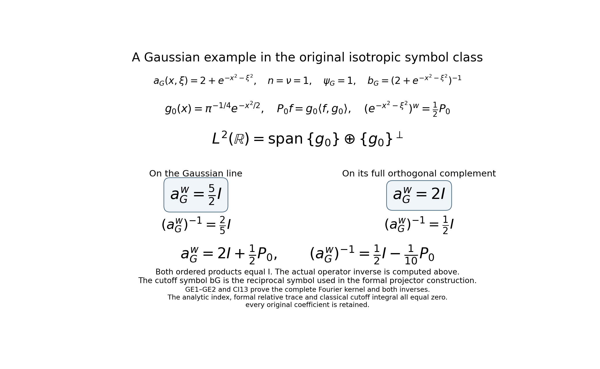
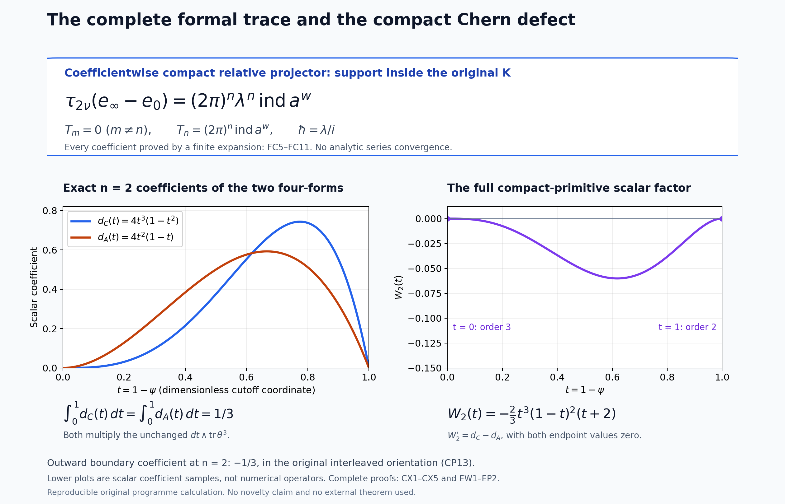

# Relative Weyl projectors and the Chern cutoff form

*Written and dedicated to the public domain by Codex, September 2026 (CC0).*

The matrix index can be represented by two different exact objects. A Fredholm operator and its cutoff inverse produce a trace-class difference of operator idempotents. The same full symbols produce a coefficientwise compact difference of formal Weyl idempotents. The zeroth formal projector has a Chern form whose integral equals the original cutoff differential form; its pointwise difference is an explicit compact exact form. This lesson proves those constructions and keeps both matrix product orders, the original phase coordinates, the cutoff endpoints and the ambient orientation.

For the metric and ordered Weyl product, read [Two measuring scales, one Weyl product](weyl-metric-products.md). For bounded quantization and compactness, read [When a moving symbol scale controls an operator](metric-operator-bounds.md). For Fredholm stability, read [Finite defects under perturbation](fredholm-stability.md). For the trace-class threshold, read [Weyl kernels, operator traces, and a finite trace-class test](weyl-trace-criterion.md). For the scaled errors and their finite coefficient expansion, read [Scaled Weyl parametrices and the surviving differential degree](scaled-weyl-index-degree.md). For the powers-of-errors identity, read [Traces that survive passage to cohomology](traces-and-complexes.md). Every required symbol and operation is also defined where used below.

Let \(n,\nu\ge1\), \(z=(x_1,\xi_1,\ldots,x_n,\xi_n)\),
\(\Omega=dx_1\wedge d\xi_1\wedge\cdots\wedge dx_n\wedge d\xi_n\),
\(h(z)=(1+|z|^2)^{-1}\), and \(g_z=h(z)(|dx|^2+|d\xi|^2)\).
Assume the full matrix \(a\in S(1,g;\operatorname{End}\mathbb C^\nu)\)
has a uniformly bounded inverse on an exterior region. Choose a smooth
scalar cutoff \(\psi\), equal to one outside a compact set and zero near
the complement of that invertibility region. Put \(b=\psi a^{-1}\) there,
extended smoothly by zero, and \(t=1-\psi\). Thus \(ab=ba=\psi I_\nu\);
\(K=\operatorname{supp}t\) is compact. Fix the same Weyl scaling and
\(\lambda\) convention as in the scaled-index lesson.

## 1. Exact operator construction

For fixed \(0<\varepsilon\le1\), let \(A=a_\varepsilon^w:H_X\to H_Y\) and \(B=b_\varepsilon^w:H_Y\to H_X\), where \(H_X,H_Y\) are labeled copies of \(L^2(\mathbb R^n;\mathbb C^\nu)\). The metric operator bounds and the scaled Weyl construction make them bounded. Define
\[
 r=I_X-BA,\qquad s=I_Y-AB,\qquad rB=Bs,\qquad Ar=sA.
 \tag{RP1}
\]
The last identities follow by distributing products, without commuting \(A\) and \(B\).

For an integer \(N\ge n+1\), define the finite corrected parametrix
\[
 C_N=B\sum_{j=0}^{N-1}s^j
     =\left(\sum_{j=0}^{N-1}r^j\right)B,\qquad
 R=I_X-C_NA=r^N,\qquad S=I_Y-AC_N=s^N.
 \tag{RP2}
\]
Induction from (RP1) gives the equality of sums; both error identities are geometric telescopings. In particular \(RC_N=C_NS\) and \(AR=SA\). The scaled-error estimates and the finite trace-class criterion prove that \(R,S\) are trace class at the full \(N\ge n+1\) threshold. No trace-class assertion about \(r\) or \(s\) is needed.

On \(H_X\oplus H_Y\), set
\[
 E_+=\begin{pmatrix}I_X&C_N\\0&I_Y\end{pmatrix},\qquad
 E_-=\begin{pmatrix}I_X&0\\-A&I_Y\end{pmatrix},\qquad
 U=E_+E_-E_+
  =\begin{pmatrix}R&C_N(I_Y+S)\\-A&S\end{pmatrix},
 \tag{RP3}
\]
\[
 U^{-1}=E_+^{-1}E_-^{-1}E_+^{-1}
   =\begin{pmatrix}R&-C_N(I_Y+S)\\A&S\end{pmatrix}.
 \tag{RP4}
\]
Direct block multiplication using (RP2) verifies each entry; the triangular factorization proves invertibility without assuming \(A\) invertible. Let \(p=\operatorname{diag}(I_X,0)\), \(e_0=\operatorname{diag}(0,I_Y)\), \(e=UpU^{-1}\). Then \(e^2=e\), \(e_0^2=e_0\), and the exact block difference is
\[
 e-e_0=
 \begin{pmatrix}
 R^2&-RC_N(I_Y+S)\\
 -AR&-S^2
 \end{pmatrix}.
 \tag{RP5}
\]
Each block is trace class because \(R,S\) are trace class and \(A,C_N\) bounded. This is a relative idempotent pair, with no selfadjointness assertion. The block trace, the powers-of-errors identity at exponent \(2N\), and positive-scaling index transport give
\[
 \operatorname{Tr}_{H_X\oplus H_Y}(e-e_0)
 =\operatorname{Tr}_{H_X}r^{2N}-\operatorname{Tr}_{H_Y}s^{2N}
 =\operatorname{ind}A
 =\operatorname{ind}a^w.
 \tag{RP6}
\]
Thus the relative trace-class class and analytic trace arise from the original two orders; no external index theorem is being assumed.

## 2. A compactly supported flat formal projector

Use the original coordinates \(z=(x_1,\xi_1,\ldots,x_n,\xi_n)\), the exact ordered Weyl coefficients, and the constant Poisson tensor \(J^{2p,2p-1}=1\), \(J^{2p-1,2p}=-1\). The formal product is
\[
 f\#_\lambda g=\sum_{m\ge0}\lambda^m
       \sum_{p+q+k=m}C_k(f_p,g_q),\qquad
 C_k(f,g)=\frac{J^{j_1l_1}\cdots J^{j_kl_k}}
                {k!(2i)^k}
       (\partial_{j_1}\cdots\partial_{j_k}f)
       (\partial_{l_1}\cdots\partial_{l_k}g).
 \tag{RP7}
\]
Every coefficient is finite and retains matrix order. On three tensor factors the constant-coefficient Poisson bidifferential operators commute; their exponential identity proves associativity coefficient by coefficient. The parameter identity is \(\hbar=\lambda/i\); no convergence of the infinite formal series is asserted.

On the actual open invertibility region \(U_a\) of \(a\), construct a formal star inverse \(c=\sum_{m\ge0}\lambda^m c_m\) from \(c_0=a^{-1}\) and
\[
 c_m=-\left(\sum_{k=1}^{m}C_k(c_{m-k},a)\right)a^{-1}
 \qquad(m\ge1).
 \tag{RP8}
\]
This recursion gives \(c\#_\lambda a=I\). A right-inverse recursion gives \(a\#_\lambda d=I\); associativity proves \(c=c\#(a\#d)=(c\#a)\#d=d\), so \(c\) is two-sided. The inverse-derivative formula, the \(S(1,g)\) estimates, and the \(k\) derivative pairs in \(C_k\) show inductively that \(c_m\in S(h^m,g)\) on the exterior region where \(a^{-1}\) is uniformly bounded. On the compact part of \(\operatorname{supp}\psi\), all derivatives are bounded and \(h\) is bounded below. Hence
\[
 B_\infty=\sum_{m\ge0}\lambda^m b_m,\qquad
 b_m=\psi c_m\text{ on }U_a,\quad b_m=0\text{ where }\psi=0
 \tag{RP9}
\]
is a formal series of globally smooth \(S(h^m,g)\) coefficients. Its zeroth coefficient is exactly the original \(b\).

Put \(K=\operatorname{supp}(1-\psi)\), a fixed compact set. Outside \(K\), \(\psi=1\) with all derivatives zero, so \(B_\infty=c\) coefficientwise. The two formal errors
\[
 \rho=I-B_\infty\#_\lambda a,\qquad
 \sigma=I-a\#_\lambda B_\infty
 \tag{RP10}
\]
have every coefficient supported in \(K\). This does not say that the actual analytic errors are compactly supported.

Use the same three triangular block matrices (RP3) with \(A=a\), \(C=B_\infty\), and every product interpreted as \(\#_\lambda\). Triangular inversion and associativity give an exact idempotent \(e_\infty=U_\infty\#p\#U_\infty^{-1}\). The calculation (RP5) remains valid in this associative algebra with \(R=\rho,S=\sigma\). Every block of \(e_\infty-e_0\) contains \(\rho\) or \(\sigma\), and every \(C_k\) is local. Therefore
\[
 e_\infty\#_\lambda e_\infty=e_\infty,\qquad
 [\lambda^m](e_\infty-e_0)
   \in C_c^\infty(\mathbb R^{2n};M_{2\nu}(\mathbb C)),
 \quad\operatorname{supp}[\lambda^m](e_\infty-e_0)\subseteq K
 \quad(m\ge0).
 \tag{RP11}
\]
The compact relative pair is the input for the source theorem in the next lesson; its trace normalization is proved there.

## 3. Comparison with the original finite trace coefficient

Form the finite \(C_N\) of (RP2) in the formal \(\#_\lambda\) algebra, with \(r=I-b\#a\) and \(s=I-a\#b\). Outside \(K\), the zeroth coefficients of \(r,s\) vanish because \(b=a^{-1}\). Locality implies \(r^{\#N}=s^{\#N}=O(\lambda^N)\) there. The formal (RP2) makes \(C_N\) a two-sided inverse of \(a\) through degree \(N-1\) outside \(K\); uniqueness of (RP8) yields
\[
 [\lambda^m](C_N-B_\infty)=0\text{ outside }K,
 \qquad 0\le m<N.
 \tag{RP12}
\]
Interpolate \(C_u=(1-u)C_N+uB_\infty\), \(0\le u\le1\), and build \(e_u=U(C_u)\#p\#U(C_u)^{-1}\) from the same elementary matrices. Every \(e_u\) is exactly idempotent. Since \(C_u\) is a two-sided inverse modulo \(\lambda^N\) outside \(K\), both \(e_u-e_0\) and \(\partial_u e_u\) have compact support in each coefficient through degree \(N-1\).

If at least one of \(f,g\) has compact support, the constant-coefficient formula (RP7) and integration by parts give
\[
 \int_{\mathbb R^{2n}}\operatorname{tr}C_k(f,g)\,dz
  =\begin{cases}
    \int\operatorname{tr}(fg)\,dz,&k=0,\\
    0,&k\ge1.
    \end{cases}
 \tag{RP13}
\]
For \(k\ge1\), move the derivatives on the compact factor to the other factor; each resulting positive-order term contracts an antisymmetric \(J^{jl}\) with symmetric second derivatives. The boundary terms vanish by compact support. At \(k=0\), finite matrix trace is cyclic. Thus coefficientwise integration of the matrix trace is cyclic for \(\#_\lambda\) whenever one factor is compactly supported.

Differentiating \(e_u\#e_u=e_u\) gives \(e_u\#e'_u\#e_u=0\) and then the exact identity
\[
 e'_u=[[e'_u,e_u]_\# ,e_u]_\#.
 \tag{RP14}
\]
At degrees at most \(n\) when \(N=n+1\), every term contains a compactly supported coefficient of \(e'_u\); (RP13) makes its integrated trace zero. Integrating in \(u\), and then taking the block diagonal of (RP5), proves for \(0\le k\le n\)
\[
 \int\operatorname{tr}_{2\nu}[\lambda^k](e_\infty-e_0)\,dz
  =\int\operatorname{tr}_{2\nu}[\lambda^k](e_N-e_0)\,dz
  =\int\operatorname{tr}_{\nu}[\lambda^k]
       (r^{\#2N}-s^{\#2N})\,dz .
 \tag{RP15}
\]
No matrix factor or cutoff contribution has been deleted.

The scaled-degree estimates apply with exponent \(2N\ge n+1\): the same induction gives a uniform remainder in \(S(h_\varepsilon^{n+1},g_\varepsilon)\), and every coefficient through degree \(n\) has compact support because \(2N>n\). The trace-class remainder is \(O(\varepsilon^2)\) by the scaled trace estimate and finite trace-class criterion. Equation (RP6) is constant for \(\varepsilon>0\), so uniqueness of its finite expansion in powers \(\varepsilon^{2k-2n}\) forces all integrated difference coefficients below \(n\) to vanish and the degree-\(n\) coefficient to equal \(\operatorname{ind}a^w\). With (RP15), this proves
\[
 \int\operatorname{tr}_{2\nu}[\lambda^k](e_\infty-e_0)\,dz=0
      \quad(0\le k<n),\qquad
 \boxed{\displaystyle
 \operatorname{ind}a^w=(2\pi)^{-n}
      \int_{\mathbb R^{2n}}
       \operatorname{tr}_{2\nu}
       [\lambda^n](e_\infty-e_0)(z)\,dz.}
 \tag{RP16}
\]
The integral retains the original \(dx_1\,d\xi_1\cdots dx_n\,d\xi_n\) orientation and CI12/CT15's \((2\pi)^{-n}\) factor. The source comparison in the following lesson keeps the exact parameter \(\hbar=\lambda/i\), the coordinate-orientation sign and the full compact projector pair. Equation (RP16) alone makes no equality with the Chern integral proved below.

## 4. The zeroth projector and its complete Chern density

Keep \(a,b=\psi a^{-1},t=1-\psi\) as defined above, including the full invertibility domain \(U_a\), the extension of \(b\) by zero, and the original ambient orientation \(\Omega=dx_1\wedge d\xi_1\wedge\cdots\wedge dx_n\wedge d\xi_n\). On \(U_a\), put \(\theta=a^{-1}da\). All products of matrix-valued forms below retain their written order and the exterior wedge; \(\operatorname{tr}\) is the ordinary finite matrix trace.

At \(\lambda=0\), the two formal error symbols RP10 are both \(tI_\nu\), so RP3–RP5 give the exact smooth matrices
\[
 U_0=
  \begin{pmatrix}tI_\nu&b(1+t)\\-a&tI_\nu\end{pmatrix},
 \qquad
 U_0^{-1}=
  \begin{pmatrix}tI_\nu&-b(1+t)\\a&tI_\nu\end{pmatrix},
 \qquad
 P=U_0\begin{pmatrix}I_\nu&0\\0&0\end{pmatrix}U_0^{-1}.
 \tag{CP1}
\]
The inverse is verified by both matrix products using the *original* \(ab=ba=\psi I_\nu\) and \(\psi=1-t\); no global inverse of \(a\) is required. Thus \(P^2=P\) on all of \(\mathbb R^{2n}\), and \(P=\operatorname{diag}(0,I_\nu)\) outside \(\operatorname{supp}t\). Its coefficients are smooth even where \(a\) is not invertible.

Set \(\Theta=U_0^{-1}dU_0\), a \(2\nu\)-square matrix of one-forms. Differentiating (CP1), with every block multiplication in order, gives
\[
 \Theta_{12}=t(1+t)\,db-b\,dt,\qquad
 \Theta_{21}=a\,dt-t\,da.
 \tag{CP2}
\]
With \(p=\operatorname{diag}(I_\nu,0)\), \(dP=U_0[\Theta,p]U_0^{-1}\), where
\[
 [\Theta,p]=
 \begin{pmatrix}0&-\Theta_{12}\\\Theta_{21}&0\end{pmatrix}.
 \quad\text{Consequently}\quad
 \operatorname{tr}_{2\nu}\!\left(P(dP)^{2n}\right)
   =(-1)^n\operatorname{tr}_{\nu}
        \left((\Theta_{12}\wedge\Theta_{21})^n\right).
 \tag{CP3}
\]
The sign is the \(n\) factors \(-\Theta_{12}\wedge\Theta_{21}\) in the first diagonal block. Cyclic matrix trace removes the outer \(U_0,U_0^{-1}\), but does not reorder any interior factor.

On \(U_a\), the exact inverse differential and the original cutoff give
\[
 da=a\theta,\qquad
 db=(-dt\,I_\nu-\psi\theta)a^{-1}.
 \tag{CP4}
\]
Substitute (CP4) into (CP2), keeping \(dt\) as a scalar one-form:
\[
 \Theta_{12}
   =\bigl[-(1+t^2)dt\,I_\nu-t(1+t)\psi\theta\bigr]a^{-1},
 \qquad
 \Theta_{21}=a(dt\,I_\nu-t\theta).
 \tag{CP5}
\]
Since \((1+t^2)+(1+t)\psi=(1+t^2)+(1-t^2)=2\), direct multiplication yields the **untraced** identity
\[
 X:=\Theta_{12}\wedge\Theta_{21}
     =2t\,dt\wedge\theta+t^2(1-t^2)\theta^2.
 \tag{CP6}
\]
All matrix factors remain in the order inherited from \(a,b\). In particular the second term is a genuine noncommutative Maurer–Cartan contribution; it cannot be dropped pointwise.

The scalar form \(dt\) satisfies \((dt\wedge\theta)^2=0\). Graded cyclicity gives \(\operatorname{tr}\theta^{2n}=0\): moving the first odd \(\theta\) past the other \(2n-1\) odd factors changes the sign. Every mixed term in \(X^n\) with exactly one \(dt\wedge\theta\) has the same finite trace, since its two-form factors are cyclically moved with sign \(+1\); terms with two such factors vanish. Therefore the complete traced Chern density is
\[
 \operatorname{tr}_{2\nu}\!\left(P(dP)^{2n}\right)
 =(-1)^n\,2n\,t^{2n-1}(1-t^2)^{n-1}
     dt\wedge\operatorname{tr}_\nu(\theta^{2n-1})
 \quad\text{on }U_a.
 \tag{CP7}
\]
This form extends by zero across the noninvertible region because \(dt=0\) on a neighborhood where \(\psi=0\); it is supported in the compact cutoff transition. Formula (CP7) follows from the full original matrix \(P\), rather than a rank-one or determinant-only replacement.

For comparison, put \(Y=db\wedge da\). Equation (CP4) gives \(Y=-d t\wedge\theta-\psi\theta^2\). Terms with two copies of \(dt\) vanish. Among the remaining \(n\) choices for its position, graded cyclicity makes each traced word equal; the all-\(\theta^2\) trace vanishes. This proves directly from the original \(b=\psi a^{-1}\), with matrix order intact, that
\[
 2t^n\operatorname{tr}_\nu[(db\wedge da)^n]
 =(-1)^n\,2n\,t^n(1-t)^{n-1}
       dt\wedge\operatorname{tr}_\nu(\theta^{2n-1}).
 \tag{CP8}
\]
The two densities (CP7)–(CP8) generally differ pointwise when \(n>1\). Define the exact scalar polynomial
\[
 W_n(t)=2n\int_0^t
   \left[v^{2n-1}(1-v^2)^{n-1}
         -v^n(1-v)^{n-1}\right]\,dv .
 \tag{CP9}
\]
It has \(W_n(0)=0\). Its other endpoint also vanishes: substituting \(u=v^2\) in the first integral gives \(\tfrac12 B(n,n)\), while the second is \(B(n+1,n)\); the elementary factorial identities
\[
 \frac12\,\frac{((n-1)!)^2}{(2n-1)!}
 =\frac{n!(n-1)!}{(2n)!}
 \tag{CP10}
\]
show these moments are equal. Thus \(W_n(1)=0\) with no endpoint suppressed. The Maurer–Cartan equation \(d\theta=-\theta^2\) and graded cyclicity give \(d\,\operatorname{tr}\theta^{2n-1}=0\): the derivative is a signed sum of \(2n-1\) copies of \(-\operatorname{tr}\theta^{2n}\), and that even trace is zero. Subtract (CP8) from (CP7), use \(W_n'\), and differentiate the full product to obtain the exact pointwise morphism on \(U_a\):
\[
 \boxed{\displaystyle
 \operatorname{tr}_{2\nu}\!\left(P(dP)^{2n}\right)
 -2t^n\operatorname{tr}_\nu[(db\wedge da)^n]
 =(-1)^n d\!\left(
      W_n(t)\operatorname{tr}_\nu(\theta^{2n-1})\right).}
 \tag{CP11}
\]
The right-hand primitive extends by zero to a **smooth compactly supported** form on the entire phase space. Near a noninvertible point \(\psi=0,t=1\) on a neighborhood and \(W_n(1)=0\); outside a compact set \(\psi=1,t=0\) and \(W_n(0)=0\). On the remaining compact transition \(a\) is invertible. This proves the support and domain extension, rather than merely ignoring an inner boundary.

Integrate (CP11) in the fixed ambient orientation \(\Omega\). Stokes applied to the compactly supported primitive proves
\[
 \int_{\mathbb R^{2n}}\operatorname{tr}_{2\nu}
        \!\left(P(dP)^{2n}\right)
   =2\int_{\mathbb R^{2n}}
       (1-\psi)^n\operatorname{tr}_{\nu}[(db\wedge da)^n].
 \tag{CP12}
\]

## 5. The exact boundary primitive

Keep the original \(n\ge1\), cutoff \(\psi\), invertible-region one-form \(\theta=a^{-1}da\), and ambient orientation \(\Omega=dx_1\wedge d\xi_1\wedge\cdots\wedge dx_n\wedge d\xi_n\). The calculation preceding (CP8), with \(d\psi=-dt\), gives
\[
 \operatorname{Tr}[(db\wedge da)^n]
   =n(-1)^{n-1}\psi^{n-1}d\psi\wedge
       \operatorname{Tr}(\theta^{2n-1}).
 \tag{BN1}
\]
Multiplying by \((1-\psi)^n\) retains the full scalar cutoff factor. Define a scalar polynomial primitive
\[
 F_n(t)
   =n\int_0^t u^{n-1}(1-u)^n\,du
   =n\sum_{j=0}^{n}
       (-1)^j\binom nj\,{t^{n+j}\over n+j},
 \qquad
 F_n'(t)=nt^{n-1}(1-t)^n .
 \tag{BN2}
\]
The binomial expression is an exact finite sum, including the endpoint \(t=0\). Since Maurer–Cartan and graded cyclicity give \(d\,\operatorname{Tr}(\theta^{2n-1})=0\), the product form extends smoothly through the noninvertible set and obeys
\[
 (1-\psi)^n\operatorname{Tr}[(db\wedge da)^n]
   =(-1)^{n-1}d\!\left(
       F_n(\psi)\operatorname{Tr}(\theta^{2n-1})
     \right).
 \tag{BN3}
\]
The extension by zero is legitimate because \(\psi\) is identically zero near the noninvertible region and \(F_n(0)=0\).

To compute its outer value with every factorial, use the scalar beta integral. Expand neither endpoint away:
\[
 \begin{aligned}
 F_n(1)
 &=n\int_0^1 u^{n-1}(1-u)^n\,du\\
 &=n\,B(n,n+1)
   =n\,{\Gamma(n)\Gamma(n+1)\over\Gamma(2n+1)}
   ={(n!)^2\over(2n)!}.
 \end{aligned}
 \tag{BN4}
\]
The beta equality follows directly by changing variables \(u=s/(s+t)\), \(v=s+t\) in
\(\Gamma(n)\Gamma(n+1)=\int_{s,t>0}s^{n-1}t^n e^{-(s+t)}\,ds\,dt\); the Jacobian is \(v\), so the \(v\)-integral is \(\Gamma(2n+1)\). This proves the value directly with every original factor. For Stokes, choose an actual open ball \(B=B_R=\{|z|<R\}\) whose interior contains \(K=\operatorname{supp}(1-\psi)\). Its boundary has an open collar where \(\psi=1\) and \(a\) is invertible. The global smooth primitive in (BN3) has derivative supported in \(K\), so its full-space derivative integral equals its integral over \(B_R\). On the boundary its value is \(F_n(1)\operatorname{Tr}(\theta^{2n-1})\). Thus Stokes in the original orientation, with no inner boundary omitted, gives the exact identity
\[
 \int_{\mathbb R^{2n}}
    (1-\psi)^n\operatorname{Tr}[(db\wedge da)^n]
   =(-1)^{n-1}{(n!)^2\over(2n)!}
      \int_{\partial B}
         \operatorname{Tr}[(a^{-1}da)^{2n-1}].
 \tag{BN5}
\]
For \(n=1\), \(F_1(1)=1/2\); for \(n=2\), \(F_2(1)=1/6\). These are checks of the exact scalar moment.

Combining this **proved classical equality** with (BN5) yields the fully oriented boundary value
\[
 \int_{\mathbb R^{2n}}\operatorname{tr}_{2\nu}
        \!\left(P(dP)^{2n}\right)
 =2(-1)^{n-1}\frac{(n!)^2}{(2n)!}
   \int_{\partial B}\operatorname{tr}_\nu[(a^{-1}da)^{2n-1}],
 \tag{CP13}
\]
where \(\partial B\) has the outward boundary orientation induced from \(dx_1\wedge d\xi_1\wedge\cdots\wedge dx_n\wedge d\xi_n\). The exact classical cutoff coefficient is therefore the Chern functional
\[
 (2\pi)^{-n}\frac{2}{i^n n!}
  \int(1-\psi)^n\operatorname{tr}_\nu[(db\wedge da)^n]
 =(2\pi)^{-n}\frac{1}{i^n n!}
  \int\operatorname{tr}_{2\nu}[P(dP)^{2n}].
 \tag{CP14}
\]
This is an exact comparison between the original cutoff expression and its relative-projector Chern form, with the compactly supported defect (CP11). The next lesson proves that (RP16)'s degree-\(n\) formal trace equals the right side of (CP14) by applying the cited source theorem to this same pair. The direct term-by-term expansion of the separate finite Weyl coefficient is a different calculation.

## 6. Worked example: a full matrix symbol with zero index

For \(n=\nu=1\), take \(a(x,\xi)=2+\arctan x\) and choose
\(\psi\equiv1\), which is allowed because \(a\) is invertible everywhere.
Its Weyl operator is multiplication by
\(2+\arctan x\), whose bounded inverse is multiplication by
\((2+\arctan x)^{-1}\). Hence its analytic index is zero. The symbol
and cutoff are independent of \(\xi\), so the complete exterior
\(2\)-form \((db\wedge da)\) vanishes. Formula (CP12) then makes the
integrated Chern \(2\)-form zero as well. This is an exact nonconstant operator and formal example, but it is not in the isotropic symbol class assumed at the start of this lesson. In fact \(\partial_xa(0,\xi)=1\) for every \(\xi\), whereas that class requires a bound by \(C(1+\xi^2)^{-1/2}\); this is the same product-metric example checked in RC10 and RT1. Retain the original symbol and its actual class. Since both \(a\) and \(b=a^{-1}\) depend only on \(x\), every positive Weyl differential coefficient vanishes: each Poisson pair requires one \(\xi\)-derivative. The analytic operators are the exact inverse multiplication pair, so \(r=s=0\) and the construction RP1–RP6 gives \(e=e_0\) directly. The whole formal inverse also has \(c_0=b,c_m=0\) for \(m>0\), so RP7–RP11 give the same constant relative projector. These facts prove the example at its actual generality without invoking the general isotropic argument RP16.

**An example satisfying the isotropic hypotheses.** Keep \(n=\nu=1\), and use the full original symbol and cutoff
\[
 a_G(x,\xi)=2+e^{-x^2-\xi^2},\qquad
 \psi_G=1,\qquad b_G=(2+e^{-x^2-\xi^2})^{-1},\qquad t_G=0.
 \tag{GE1}
\]
Every positive derivative of the Gaussian is a polynomial times that same Gaussian. Every positive derivative of \(b_G\) is a finite sum of such products with powers of the full denominator \(2+e^{-x^2-\xi^2}\), which is at least two. Thus the positive derivatives of both symbols decrease faster than every radial power; their zeroth values are bounded. They belong to the exact original \(S(1,g)\) class, and \(a_G\geq2\) is uniformly invertible everywhere.

Let \(g_0(x)=\pi^{-1/4}e^{-x^2/2}\) and let \(P_0f=g_0\langle f,g_0\rangle\) be its actual rank-one orthogonal projector. The full Weyl Fourier calculation CI13 gives
\[
 a_G^w=2I+\frac12P_0,\qquad
 (a_G^w)^{-1}=\frac12I-\frac1{10}P_0,
 \qquad \operatorname{ind}a_G^w=0.                            \tag{GE2}
\]
Indeed \(P_0^2=P_0\), and on the exact decomposition
\(L^2=\operatorname{span}\{g_0\}\oplus g_0^\perp\), the first operator has eigenvalues \(5/2\) and \(2\); the displayed inverse has eigenvalues \(2/5\) and \(1/2\). Both products are the identity on this decomposition, proving bounded invertibility and zero kernel and cokernel. This computes the original operator inverse; it does not identify it with the pointwise cutoff inverse symbol \(b_G\).

The full formal inverse (RP8) exists globally since \(a_G\) is invertible everywhere. Because \(\psi_G=1\), its two formal errors in (RP10) are zero at every degree, and \(e_\infty=e_0\). The finite corrected parametrices have the complete trace-class powers in RP2; RP6 proves their relative operator trace is zero. For the classical zeroth projector, \(t_G=0\) in CP1 gives \(P=e_0\) pointwise, hence \(dP=0\). Also \(a_G\) and \(b_G\) are scalar functions of the same original \(x^2+\xi^2\); their differentials are scalar multiples of its differential, so \(db_G\wedge da_G=0\). Thus every side of RP16, CP12 and CP14 is zero with its original factors, as the analytic calculation requires. No individual analytic error is asserted to vanish.

The two summands, original eigenvalues and full inverse in the diagram are proved by (GE1)–(GE2) and CI13. The actual finite relative trace, full formal projector and classical Chern form are all checked above. This example supplies the lesson's stated isotropic hypotheses while the earlier product-metric example remains identifiable.

## 7. Exercises with solutions

**Exercise 1.** In dimension \(n=1\), compute \(W_1(t)\) in (CP9) and
decide whether the two densities in (CP11) differ pointwise.

**Solution.** Both terms in the integrand of (CP9) are \(v\), since
\((1-v^2)^0=(1-v)^0=1\). Thus \(W_1(t)=0\) for every \(t\). Equation
(CP11) says the two \(2\)-forms agree pointwise in this dimension,
including on the cutoff transition.

**Exercise 2.** Evaluate \(F_2(1)\) without quoting a beta-function
table and use it to state the factor multiplying the outward boundary
integral in (BN5) for \(n=2\).

**Solution.** Direct polynomial integration gives
\(F_2(1)=2\int_0^1 u(1-u)^2\,du
=2(1/2-2/3+1/4)=1/6\). The sign in (BN5) is
\((-1)^{2-1}=-1\), so the factor is \(-1/6\), with the
boundary oriented by \(dx_1\wedge d\xi_1\wedge dx_2\wedge d\xi_2\).

## References

The compact formal projector is
prepared for the higher algebraic index theorem of M. Pflaum,
H. Posthuma and X. Tang,
[arXiv:0805.1411v3](https://arxiv.org/abs/0805.1411),
original IndThms.tex, theorem thm:higher-algind, lines 412–479. The following
lesson proves the exact source product, cyclic pairing, orientation
and theorem specialization before using that theorem to identify
(RP16) with (CP14).

## 8. Editorial supplement: the exact algebra and the complete formal trace

The original constructions and formulas above are retained. The following supplies the full finite algebra behind their receiving maps and proves a stronger consequence of (RP16): **every integrated formal coefficient other than degree \(n\) is zero**, including all degrees greater than \(n\). It uses the complete finite proofs in [the scaled Weyl lesson](scaled-weyl-index-degree.md), not an external higher index theorem. No convergence of the full formal series and no novelty are asserted.

### 8.1. The actual typed block algebra

For any bounded pair \(A:H_X\to H_Y\), \(C:H_Y\to H_X\), put \(R=I_X-CA\) and \(S=I_Y-AC\). These have the actual types \(R:H_X\to H_X\), \(S:H_Y\to H_Y\), and direct multiplication gives
\[
 RC=CS,\qquad AR=SA,\qquad CA=I_X-R,\qquad AC=I_Y-S.
 \tag{FB1}
\]
Let \(U(C)\) be exactly the three-factor matrix (RP3). Its displayed candidate inverse is (RP4). Their upper left product entry is
\[
 R^2+C(I_Y+S)A
 =R^2+(I_X-R)+(I_X-R)R=I_X.
 \tag{FB2}
\]
The upper right entry is \(-RC(I_Y+S)+C(I_Y+S)S=0\), the lower left is \(-AR+SA=0\), and the lower right is \(AC(I_Y+S)+S^2=I_Y\). The product in the opposite order has the same diagonal entries and the negatives of these off-diagonal expressions, so it too is the identity. Both inverses are therefore actual bounded maps on \(H_X\oplus H_Y\). Multiplying the first column of \(U(C)\) by the first row of its inverse gives
\[
 U(C)pU(C)^{-1}
 =\begin{pmatrix}
 R^2&-RC(I_Y+S)\\
 -AR&I_Y-S^2
 \end{pmatrix}.
 \tag{FB3}
\]
This proves every block of (RP5), with its original order. For \(C=C_N\), the full \(R=r^N\), \(S=s^N\) are trace class by IP11–IP13 of the scaled lesson at the actual fixed positive scale. Its operator product is the bounded extension of the exact Schwartz product, proved in WO6–WO8 and the scaled lesson's Section15. Products of these trace-class maps with the bounded factors are trace class by T9 of [the trace lesson](traces-and-complexes.md). Choose the orthonormal basis formed by the union of a basis of \(H_X\) and a basis of \(H_Y\). Absolute trace convergence makes its diagonal sum exactly \(\operatorname{Tr}_{H_X}R^2-\operatorname{Tr}_{H_Y}S^2\); the off-diagonal blocks contribute zero diagonal entries. T28 at exponent \(2N\) and IP16 give precisely (RP6). No selfadjointness or bounded inverse of \(A\) is assumed.

The same calculation is an identity in any of the finite associative matrix algebras used below. Its entries retain the labeled fiber maps \(\mathbb C_X^\nu\) and \(\mathbb C_Y^\nu\). It is a polynomial identity in \(A,C\), their ordered products and their two errors, so it also holds coefficient by coefficient in the original formal algebra.

### 8.2. The original coefficient convention and both inverse recursions

Write the original phase coordinates in their original interleaved order. The tensor of (RP7) has \(J^{2p,2p-1}=1\) and \(J^{2p-1,2p}=-1\). Thus its first contraction is exactly
\[
 {J^{jl}\over2i}(\partial_jf)(\partial_lg)
 ={i\over2}\sum_{p=1}^n
 \bigl((\partial_{x_p}f)(\partial_{\xi_p}g)
       -(\partial_{\xi_p}f)(\partial_{x_p}g)\bigr).
 \tag{FB4}
\]
Commuting coordinate derivatives and applying the finite multinomial formula gives, for every nonnegative integer \(k\),
\[
 C_k(f,g)=\left({i\over2}\right)^k
 \sum_{|\alpha|+|\beta|=k}
 {(-1)^{|\beta|}\over\alpha!\beta!}
 (\partial_x^\alpha\partial_\xi^\beta f)
 (\partial_\xi^\alpha\partial_x^\beta g).
 \tag{FB5}
\]
This is the identical coefficient proved in OC1–OC5 of the scaled lesson; each factor has exactly \(k\) derivatives and its matrix order is unchanged. For three independent phase variables, its scalar contraction operators are \(L_{12},L_{13},L_{23}\) of OC2. The diagonal chain rule turns an outer contraction against a product of the first two slots into \(L_{13}+L_{23}\). Expanding the two finite parenthesizations of total contraction degree \(m\) therefore gives the same finite expression
\[
 \delta_3\sum_{a+b+c=m}
 {L_{12}^aL_{13}^bL_{23}^c\over a!b!c!}
       f(X_1)g(X_2)h(X_3).
 \tag{FB6}
\]
All three operators have scalar constant coefficients, so their derivatives commute even in shared slots. This reorders differential operators only. Summing over the finite intrinsic degrees proves formal associativity at every finite coefficient, as in OC6–OC13. Restriction to an open set commutes with every \(C_k\), because these are local differential expressions.

On the actual open inverse domain \(U_a\), the degree-\(m\) equation \(c\#_\lambda a=I\) is
\[
 c_m a+\sum_{k=1}^mC_k(c_{m-k},a)=0\quad(m\ge1).
 \tag{FB7}
\]
Right multiplication by the original \(a^{-1}\) proves exactly (RP8). The opposite recursion is
\[
 d_0=a^{-1},\qquad
 d_m=-a^{-1}\sum_{k=1}^m C_k(a,d_{m-k}),
 \qquad a\#_\lambda d=I.
 \tag{FB8}
\]
In every coefficient the associativity just proved makes
\(c=c\#(a\#d)=(c\#a)\#d=d\). This proves both inverse identities, their uniqueness, and both multiplication orders on their actual domain. No formal inverse has been extended across a noninvertible point.

For clarity, the weight assertion also includes every derivative order. OC24–OC26 of the scaled lesson prove the full ordered inverse derivative formula. On an exterior region where the original inverse is bounded, it gives
\(\|\partial^\gamma a^{-1}\|\le C_\gamma h^{|\gamma|/2}\).
If the estimates \(\|\partial^\gamma c_j\|\le C_{j,\gamma}h^{j+|\gamma|/2}\) hold for \(j<m\), differentiation of the full finite sum (FB7) distributes all additional derivatives between its two factors. Each resulting term has weight
\[
 h^{m-k+(k+|\gamma_1|)/2}
 h^{(k+|\gamma_2|)/2}
 =h^{m+|\gamma|/2},\qquad \gamma_1+\gamma_2=\gamma.
 \tag{FB9}
\]
Multiplication by \(a^{-1}\), with its own distributed derivative order, retains this exponent. This proves the assertion for \(c_m\) by induction. On the compact part of \(\operatorname{supp}\psi\), smoothness of the inverse and positivity of \(h\) give the same estimates with finite constants. The complete product rule for \(b_m=\psi c_m\) uses these estimates and compactly supported cutoff derivatives. Near every point outside \(U_a\), \(\psi\) is identically zero, so the zero extension and all its derivatives are smooth there. Hence every original \(b_m\) is globally in \(S(h^m,g)\), with no domain contribution discarded.

The scalar parameter map is also exact. Substitution \(\lambda=i\hbar\), with inverse \(\hbar=\lambda/i\), sends the original coefficient \(\lambda^kJ^{j_1l_1}\cdots J^{j_kl_k}/(k!(2i)^k)\) to
\(\hbar^kJ^{j_1l_1}\cdots J^{j_kl_k}/(k!2^k)\).
Both expressions and every \(i\) factor remain explicit. This is a coefficientwise isomorphism of scalar formal series; it is not an analytic scaling limit.

### 8.3. The compact ideal, its cyclic integral, and every finite homotopy degree

Let \(\mathcal F_d=M_d(C^\infty(\mathbb R^{2n}))[[\lambda]]\) with the original product (RP7), and let \(\mathcal I_d\) be its coefficientwise compactly supported subspace. Its coefficients need not have a single common support. For a fixed coefficient of a product, only finitely many input coefficients and derivatives occur. A derivative of a compactly supported function is supported in the same compact set, and a pointwise ordered product containing it is supported there. A finite union of these compact sets is compact. Therefore \(\mathcal I_d\) is a two-sided ideal of \(\mathcal F_d\).

Define the exact coefficientwise map
\[
 \tau_d:\mathcal I_d\longrightarrow\mathbb C[[\lambda]],
 \qquad
 \tau_d(f)=\sum_{m\ge0}\lambda^m
      \int_{\mathbb R^{2n}}\operatorname{tr}_d f_m(z)\,dz.
 \tag{FC1}
\]
Every coefficient integral is absolutely defined. For each \(k\ge1\), if \(f\) is compact, integrate all \(j_1,\ldots,j_k\) derivatives in (RP7) off \(f\). The resulting expression has the full factor \((-1)^k/(k!(2i)^k)\) and the differential operator
\[
 J^{j_1l_1}\cdots J^{j_kl_k}
 \partial_{j_1}\cdots\partial_{j_k}
 \partial_{l_1}\cdots\partial_{l_k}g.
 \tag{FC2}
\]
Its contraction in the first pair is zero: the complete sum \(J^{jl}\partial_j\partial_l\) vanishes by antisymmetry of \(J\) and commutation of the two derivatives. The other constant derivatives commute with that sum. If \(g\) is the compact factor instead, move its \(l\)-derivatives onto \(f\); the identical antisymmetric contraction vanishes. All integrations have zero boundary terms because the moved-from factor is compact. At \(k=0\) the finite matrix trace satisfies \(\operatorname{tr}(fg)=\operatorname{tr}(gf)\), by its finite entry sum. Summing the finite terms of each formal coefficient proves
\[
 \tau_d(f\#g)=\tau_d(g\#f)
 \quad\hbox{whenever one factor belongs to }\mathcal I_d.
 \tag{FC3}
\]
No integral of the noncompact identity has been defined.

For any integer \(N\ge1\), work also in \(\mathcal F_d/(\lambda^N)\) and its compact ideal \(\mathcal I_d/(\lambda^N)\). A coefficient of degree at least \(N\) cannot contribute to a lower degree, since all intrinsic and contraction degrees are nonnegative. The product and \(\tau_d\) therefore descend to these finite quotients exactly. For \(d=2\nu\), the original \(C_N\), \(B_\infty\) and \(C_u=(1-u)C_N+uB_\infty\) can now be used without any infinite analytic assertion.

Outside the actual \(K=\operatorname{supp}(1-\psi)\), both original zeroth errors \(r_0,s_0\) vanish on a neighborhood. In a degree less than \(N\) of an \(N\)-fold product, at least one of its \(N\) intrinsic degrees is zero; all contraction degrees are nonnegative. Every derivative of that factor is zero on this neighborhood. Thus \(r^{\#N}=s^{\#N}=0\) modulo \(\lambda^N\) there. Equations (RP2) and the uniqueness recursion (FB7) show that \(C_N=B_\infty\) in this finite quotient outside \(K\), proving (RP12) for every \(N\ge1\).

The exact polynomial block formula (FB3) applies to \(e_u\). Its coefficients are polynomials in \(u\), with smooth phase coefficients. Modulo \(\lambda^N\), its two errors vanish outside \(K\); hence both \(e_u-e_0\) and \(e'_u\) belong to the compact ideal in this finite quotient, with the same fixed support \(K\). Differentiating \(e_u\#e_u=e_u\) and multiplying on both sides by \(e_u\) proves \(e_u\#e'_u\#e_u=0\). Consequently
\[
 \begin{aligned}
 [[e'_u,e_u]_\#,e_u]_\#
 &=e'_u\#e_u-2e_u\#e'_u\#e_u+e_u\#e'_u\\
 &=e'_u.
 \end{aligned}
 \tag{FC4}
\]
The inner commutator is in the compact ideal in this quotient, so (FC3) kills the trace of its outer commutator. For each \(m<N\), phase support lies in the fixed compact \(K\) and the coefficient is smooth in \(u\in[0,1]\). A finite coefficient integral can therefore be differentiated and integrated in \(u\), by the bounded continuous derivative on \([0,1]\times K\). This proves the strengthening of (RP15):
\[
 \begin{aligned}
 \int\operatorname{tr}_{2\nu}[\lambda^m](e_\infty-e_0)\,dz
 &=\int\operatorname{tr}_{2\nu}[\lambda^m](e_N-e_0)\,dz\\
 &=\int\operatorname{tr}_{\nu}[\lambda^m]
           (r^{\#2N}-s^{\#2N})\,dz,
 \qquad 0\le m<N,\quad N\ge1.
 \end{aligned}
 \tag{FC5}
\]
The second equality is the diagonal of the unchanged full block formula (FB3). Each diagonal coefficient is compact in these degrees, by the same zero-slot argument with \(2N\) slots. All matrix orders, off-diagonal terms and cutoff contributions were retained before taking the trace.

### 8.4. Vanishing in every degree other than n

Set
\[
 T_m=\int_{\mathbb R^{2n}}
           \operatorname{tr}_{2\nu}[\lambda^m]
                      (e_\infty-e_0)(z)\,dz\quad(m\ge0).
 \tag{FC6}
\]
These are all absolutely defined by (RP11), independently of \(N\). Fix any integer \(M>n\), and choose any integer \(N\ge M\). The original analytic construction (RP1)–(RP6) uses the full symbols \(a_\varepsilon,b_\varepsilon\), not \(B_\infty\). Its relative trace is exactly the original index at every positive scale.

Apply DE5 of the scaled lesson to each ordered error power of exponent \(2N\), truncated at the integer \(M\). The coefficient is its original \(F_{j,m}^{(2N)}\). By the exact finite scaling identity DE3, this is also \([\lambda^m]r^{\#2N}\) or \([\lambda^m]s^{\#2N}\), respectively; the scalar exponent is precisely \(\lambda=\varepsilon^2\) in this finite coefficient comparison. Since \(m<M\le N<2N\), OC29 supplies compact support of every retained coefficient in the original \(K\). The complete remainder \(E_{j,\varepsilon}^{(2N,M)}\) is uniform in \(S(h_\varepsilon^M,g_\varepsilon)\). At each analytic product the actual provider factor is \((1+h_\varepsilon/4)^{4n}\); RP1–RP5 of the scaled lesson prove its full receiving inclusion, with \(1\le(1+h_\varepsilon/4)^{4n}\le(1+\varepsilon^2/4)^{4n}\). Its finite product constants and all high intrinsic-degree products are retained in that remainder proof.

RA1–RA10 of the scaled lesson now prove the actual trace-norm bound \(\|(E_{j,\varepsilon}^{(2N,M)})^w\|_1\le C_{M,N}\varepsilon^{2M-2n}\). Each compact coefficient is trace class and has the original CI12 trace, with inverse Fourier factor \((2\pi)^{-n}\) and phase Jacobian \(\varepsilon^{-2n}\). Equations (RP6) and (FC5) therefore give the finite equality
\[
 \operatorname{ind}a^w
 =(2\pi)^{-n}\sum_{m=0}^{M-1}
             T_m\varepsilon^{2m-2n}
       +O_{M,N}(\varepsilon^{2M-2n})
 \quad(0<\varepsilon\le1).
 \tag{FC7}
\]
It has a separately proved trace-norm remainder, not an evaluation of a convergent formal series.

The case \(M=n+1\) recovers (RP16):
\[
 T_0=\cdots=T_{n-1}=0,
 \qquad T_n=(2\pi)^n\operatorname{ind}a^w.
 \tag{FC8}
\]
For completeness, multiply (FC7) by the power corresponding to a least nonzero lower coefficient to prove its vanishing, exactly as in DE10–DE11, and then take \(\varepsilon\downarrow0\) to obtain its degree-\(n\) value. Now let \(k>n\), and suppose inductively that \(T_m=0\) for \(n<m<k\). Choose \(M=k+1\), \(N\ge M\) in (FC7). Subtract its exactly known constant term and divide by the positive power \(\varepsilon^{2k-2n}\). Every remaining lower term is zero, so
\[
 0=(2\pi)^{-n}T_k+O_{k+1,N}(\varepsilon^2).
 \tag{FC9}
\]
Passage to zero proves \(T_k=0\). Starting at \(k=n+1\) and applying ordinary induction proves this for every higher degree. Thus the full original coefficientwise integral satisfies the exact formal identity
\[
 \boxed{\displaystyle
 \tau_{2\nu}(e_\infty-e_0)
     =(2\pi)^n\lambda^n\operatorname{ind}a^w.}
 \tag{FC10}
\]
In the other explicitly retained parameter this reads
\[
 \tau_{2\nu}(e_\infty-e_0)
      =(2\pi)^n(i\hbar)^n\operatorname{ind}a^w
      =(2\pi i)^n\hbar^n\operatorname{ind}a^w,
 \qquad \hbar=\lambda/i.
 \tag{FC11}
\]
These statements concern formal coefficients only. All original Fourier, phase, parameter and orientation factors remain present. They prove no equality between this formal trace and the classical Chern functional in (CP14).

## 9. Editorial supplement: exterior signs, Euclidean integration and cutoff independence

### 9.1. The full graded matrix trace and zero extensions

For homogeneous matrix-valued forms \(\alpha,\beta\) of exterior degrees \(p,q\), their finite entry sums give
\[
 \operatorname{tr}(\alpha\wedge\beta)
 =\sum_{i,j}\alpha_{ij}\wedge\beta_{ji}
 =(-1)^{pq}\sum_{i,j}\beta_{ji}\wedge\alpha_{ij}
 =(-1)^{pq}\operatorname{tr}(\beta\wedge\alpha).
 \tag{ES1}
\]
On the actual \(U_a\), differentiation of \(aa^{-1}=I\) gives \(d a^{-1}=-a^{-1}(da)a^{-1}\), so
\[
 d\theta=-\theta^2,\qquad
 d(\theta^r)=-\sum_{j=0}^{r-1}(-1)^j\theta^{r+1}.
 \tag{ES2}
\]
In particular \(\operatorname{tr}\theta^{2n}=0\) by (ES1), and the full alternating sum in (ES2) proves \(d\operatorname{tr}\theta^{2n-1}=0\). Matrix multiplication has never been replaced by scalar multiplication.

In (CP6), put \(D=dt\wedge\theta\), \(Q=\theta^2\). Any ordered word containing two \(D\)'s is zero: move its second scalar \(dt\) past the intervening one-forms, retaining their exterior signs, until it meets the first \(dt\), whose square is zero. Among words with one \(D\) and \(n-1\) copies of \(Q\), (ES1) moves the two-form blocks with sign \(+1\), and each finite trace is \(dt\wedge\operatorname{tr}\theta^{2n-1}\). The all-\(Q\) trace is zero by (ES1). Their original scalar coefficients are therefore exactly the \(n\) copies of \(2t[t^2(1-t^2)]^{n-1}\) in (CP7). Applying the same reasoning to the complete \(Y=-dt\wedge\theta-\psi\theta^2\) gives the \(n\) copies of \((-1)^n\psi^{n-1}\) in (CP8) and (BN1). This proves the full signed expansions, including every mixed word before tracing.

There is also a direct verification where the inverse is unavailable. On a neighborhood on which \(\psi=0\), the original \(b=0\), \(t=1\), and (CP1) gives
\[
 P=\begin{pmatrix}I_\nu&0\\-a&0\end{pmatrix},\qquad
 dP=\begin{pmatrix}0&0\\-da&0\end{pmatrix},\qquad
 (dP)^2=0.
 \tag{ES3}
\]
Hence the actual classical Chern top form and cutoff top form are both zero there, for every \(n\ge1\). The expressions involving \(\theta\) in (CP7), (CP8), (CP11) and (BN3) therefore agree with the globally defined forms after the stated zero extension. At every such point the extension is zero on an entire neighborhood, so all its derivatives are zero as well. The original matrix \(P\) itself has not been made constant there.

### 9.2. All scalar moments and the exact ball boundary orientation

For positive integers \(p,q\), ordinary integration by parts, with both endpoints retained, gives
\[
 \int_0^1 u^{p-1}(1-u)^{q-1}\,du
 ={(p-1)!(q-1)!\over(p+q-1)!}.
 \tag{ES4}
\]
For \(q=1\) the value is \(1/p\). For \(q>1\), the boundary term \(u^p(1-u)^{q-1}/p\) is zero at both endpoints, and the integral is \((q-1)/p\) times the same integral with \((p,q)\) replaced by \((p+1,q-1)\). Repeating proves (ES4). The change \(u=v^2\), with \(dv=du/(2\sqrt u)\), makes the first moment in (CP9) exactly one half of the \((p,q)=(n,n)\) moment. Its second moment is the \((n+1,n)\) moment. Equation (ES4) yields every factorial in (CP10), \(W_n(1)=0\), and \(F_n(1)=(n!)^2/(2n)!\). The Euler Gamma integral and its full beta change of variables are proved in TG1–TG4 of [the trace criterion lesson](weyl-trace-criterion.md); they give the identical Gamma expression in (BN4), without replacing these original scalar integrals.

Here is the precise Euclidean integration theorem needed for both uses of Stokes. Put \(d=2n\), retain the interleaved original coordinate list \(z_1=x_1,z_2=\xi_1,\ldots,z_d=\xi_n\), and write a smooth \((d-1)\)-form as
\[
 \beta=\sum_{j=1}^d(-1)^{j-1}V_j(z)
       dz_1\wedge\cdots\wedge\widehat{dz_j}
                      \wedge\cdots\wedge dz_d.
 \tag{ES5}
\]
The hat omits that factor only. Direct exterior differentiation gives \(d\beta=(\sum_j\partial_jV_j)\Omega\). If \(\beta\) is compactly supported, each coordinate derivative integral is zero by the one-dimensional fundamental theorem of calculus along the full line and Fubini; all functions involved are compact smooth and absolutely integrable. Thus \(\int_{\mathbb R^d}d\beta=0\).

If \(\beta\) is smooth on a neighborhood of the closed original ball \(\overline{B_R}\), the same coordinate calculation and Fubini, now on its chords, give for each \(j\)
\[
 \int_{B_R}\partial_jV_j\,dz
 =\int_{|y|<R}
    \bigl[V_j(y,+\sqrt{R^2-|y|^2})
          -V_j(y,-\sqrt{R^2-|y|^2})\bigr]\,dy.
 \tag{ES6}
\]
Here \(y\) consists of all original coordinates other than \(z_j\), in their retained order; the endpoint values are inserted in slot \(j\). On the upper and lower hemispheres in that direction, the pullback of the \(j\)-th summand of (ES5), with the outward induced orientation, is respectively \(+V_j\,dy\) and \(-V_j\,dy\). Indeed its oriented normal factor is \(\nu_jdS=+dy\) or \(-dy\), obtained by differentiating the graph \(z_j=\pm\sqrt{R^2-|y|^2}\); the sign \((-1)^{j-1}\) is exactly the sign already present in (ES5). The equator is covered by finitely many smooth sphere graph charts in the other coordinate directions; its chart preimage lies in a coordinate hyperplane, which has zero Lebesgue measure by Fubini. It therefore has zero surface measure. The form is smooth there, and its j-th component has zero normal factor there. Integration of this summand over the full oriented sphere is therefore the right side of (ES6). Summing over \(j\) proves
\[
 \int_{B_R}d\beta=\int_{\partial B_R}\beta,
 \tag{ES7}
\]
with the actual outward orientation induced by \(\Omega\). This proves the version used in (CP12) and (BN5), including its full sign; there is no interior boundary. The global primitives in those formulas were already shown smooth across the noninvertible set. The primitive in (CP11) is compact, so its full-space derivative integral is zero by (ES5). The derivative of the primitive in (BN3) is supported in the original \(K\), and \(K\subset B_R\), so (ES7) applies to that original primitive and yields exactly (BN5) and (CP13).

### 9.3. The compact defect and every admissible cutoff

Define the original two top forms by
\[
 \eta_\psi=\operatorname{tr}_{2\nu}(P_\psi(dP_\psi)^{2n}),
 \qquad
 \alpha_\psi=2(1-\psi)^n
                   \operatorname{tr}_\nu[(db_\psi\wedge da)^n].
 \tag{CX1}
\]
Both are compact smooth, and the exact compact primitive is
\[
 \Gamma_\psi=(-1)^n W_n(1-\psi)
                    \operatorname{tr}_\nu\theta^{2n-1},
 \qquad \eta_\psi-\alpha_\psi=d\Gamma_\psi.
 \tag{CX2}
\]
It is defined on \(U_a\) and extended by zero as proved above. In particular the exact defect is a specified compact form and a specified differential, not an omitted pointwise contribution. If \(\mathcal Q_c^{2n}=\Omega_c^{2n}(\mathbb R^{2n})/d\Omega_c^{2n-1}(\mathbb R^{2n})\), the full-space integral in orientation \(\Omega\) is a well-defined linear map \(\mathcal Q_c^{2n}\to\mathbb C\), by (ES5), and (CX2) proves \([\eta_\psi]=[\alpha_\psi]\) in this exact quotient.

Let \(\psi_0,\psi_1\) be any two original admissible cutoffs for the same unchanged \(a\); set \(t_j=1-\psi_j\), \(b_j=\psi_j a^{-1}\) on \(U_a\), and keep their zero extensions. Their union of compact supports \(K_0\cup K_1\) contains the support of the following primitive:
\[
 \begin{aligned}
 \Xi_{1,0}={}&
 2(-1)^{n-1}\bigl(F_n(\psi_1)-F_n(\psi_0)\bigr)
                         \operatorname{tr}_\nu\theta^{2n-1}\\
 &+(-1)^n\bigl(W_n(t_1)-W_n(t_0)\bigr)
                         \operatorname{tr}_\nu\theta^{2n-1}.
 \end{aligned}
 \tag{CX3}
\]
Outside that union both cutoffs are one and both \(t_j\) are zero; near every point outside \(U_a\) both cutoffs vanish and both \(t_j\) equal one. Every scalar difference in (CX3) is therefore zero on those neighborhoods. This proves that its zero extension is globally smooth and compact. Using the closed odd trace in (ES2), differentiating each full scalar factor, and retaining (BN3) and (CX2) proves
\[
 \eta_{\psi_1}-\eta_{\psi_0}=d\Xi_{1,0},
 \qquad
 \alpha_{\psi_1}-\alpha_{\psi_0}
 =2(-1)^{n-1}d\!\left[
   (F_n(\psi_1)-F_n(\psi_0))
             \operatorname{tr}_\nu\theta^{2n-1}\right].
 \tag{CX4}
\]
Thus both compact classes and both exact full integrals are independent of the admissible cutoff. This proves more than equality of the two integrals for a single cutoff. Choose one ball containing \(K_0\cup K_1\); (BN5) and (CP13) compute both integrals from the same original exterior \(a\), with the identical orientation and factorials. For any two containing radii \(R_1<R_2\), apply (ES7) separately to the globally smooth primitive of (BN3) on both balls. Its derivative has the same compact support in the smaller ball, so the two boundary integrals of the primitive are equal. On each boundary its scalar value is \(F_n(1)\ne0\). Consequently
\[
 \int_{\partial B_{R_1}}\operatorname{tr}_\nu[(a^{-1}da)^{2n-1}]
 =\int_{\partial B_{R_2}}\operatorname{tr}_\nu[(a^{-1}da)^{2n-1}],
 \tag{CX5}
\]
with each boundary oriented outward from the retained ambient \(\Omega\). This is the actual radius comparison, with no unavailable inverse inside the balls assumed.

The full formal integrated coefficients are likewise independent of the admissible cutoff: construct each original \(B_\infty\) and relative \(e_\infty\) with its own \(\psi_j\), then apply the fully proved (FC10) to the same unchanged operator \(a^w\). Both coefficientwise integrals equal \((2\pi)^n\lambda^n\operatorname{ind}a^w\). This conclusion includes all higher zero coefficients. It still does not equate the formal trace with (CP14)'s classical Chern value.

### 9.4. An exact endpoint sample of the compact defect

The original polynomial has a full finite expression in every dimension:
\[
 W_n(t)=2n\sum_{j=0}^{n-1}(-1)^j\binom{n-1}{j}
 \left[{t^{2n+2j}\over2n+2j}
       -{t^{n+j+1}\over n+j+1}\right].
 \tag{EW1}
\]
This follows by expanding both retained binomials in (CP9) and integrating each term; no summand is removed. For \(n=1\) the two summands agree and the polynomial is identically zero. For \(n\ge2\), the least nonzero degree in (EW1) is \(n+1\), with coefficient \(-2n/(n+1)\). At the other endpoint the exact derivative is
\[
 W_n'(t)=2n t^n(1-t)^{n-1}
     [t^{n-1}(1+t)^{n-1}-1].
 \tag{EW2}
\]
The bracket equals \(2^{n-1}-1\ne0\) at \(t=1\), and \(W_n(1)=0\). Integrating its finite Taylor polynomial about this endpoint gives
\(W_n(t)=-2(2^{n-1}-1)(1-t)^n+O((1-t)^{n+1})\).
Thus, for every \(n\ge2\), its endpoint zeros have exactly orders \(n+1\) and \(n\), and polynomial division gives an exact polynomial \(Q_n\) such that
\[
 W_n(t)=t^{n+1}(1-t)^nQ_n(t),\qquad
 \deg Q_n=2n-3,\qquad
 Q_n(0)=-{2n\over n+1},\qquad
 Q_n(1)=-2(2^{n-1}-1).
 \tag{EW3}
\]
The degree follows because the nonzero highest-degree term in (EW1) has degree \(4n-2\), with coefficient \(2n(-1)^{n-1}/(4n-2)\), whereas its second retained binomial has degree at most \(2n\). These are exact polynomial identities and endpoint multiplicities of the original compact-defect scalar factor.

For \(n=2\), the original polynomial (CP9), with both full summands retained, is
\[
 \begin{aligned}
 W_2(t)
 &=4\int_0^t[v^3(1-v^2)-v^2(1-v)]\,dv\\
 &=-{4\over3}t^3+2t^4-{2\over3}t^6
   =-{2\over3}t^3(1-t)^2(t+2).
 \end{aligned}
 \tag{EP1}
\]
The last equality is an exact polynomial comparison, not a replacement for (CP9). It displays its zero of order three at \(t=0\) and order two at \(t=1\). The scalar coefficients in the two actual traced four-form densities are
\[
 d_C(t)=4t^3(1-t^2),\qquad
 d_A(t)=4t^2(1-t),\qquad
 d_C(t)-d_A(t)=W_2'(t),\qquad
 \int_0^1d_C(t)\,dt=\int_0^1d_A(t)\,dt={1\over3}.
 \tag{EP2}
\]
They multiply the unchanged form \(dt\wedge\operatorname{tr}\theta^3\); these scalar curves alone are not matrix-valued forms or numerical operators. At the actual outer boundary, (CP13) has the coefficient \(-1/3\) when \(n=2\), with outward orientation \(dx_1\wedge d\xi_1\wedge dx_2\wedge d\xi_2\). The positive moment in (EP2) is consistent with that sign: the cutoff coordinate is one on the inner zero-cutoff region and zero on the outer unit-cutoff region, so it runs from \(t=1\) to \(t=0\) in the outward passage. Equations (BN3)–(BN5), already proved globally, supply the exact orientation argument without assuming a radial cutoff.

The upper map is the proved formal coefficient identity (FC10), including every higher zero coefficient. The lower plots are the exact \(n=2\) scalar polynomials (EP1)–(EP2) on \(0\le t\le1\), with their full factors and endpoints; they are a coefficient sample, not a restriction on the admissible cutoff. The compact matrix-form defect is (CX2), and its full cutoff comparison is (CX3)–(CX4). The [reproducible figure source](../figures/relative-projector-complete-formal-trace.py) accompanies these complete proofs.

## 10. Operative scope of the retained free reference

The original product-metric example's references RC10 and RT1 identify those exact passages of [Radial symbols and index transport](radial-symbol-index-transport.md). They are context for the same example; its complete inverse multiplication calculation, failed isotropic estimate and vanishing Weyl contractions are proved directly in Section6 above. A repeated equation prefix in a different lesson does not identify that source or supply a missing proof.

Its bounded inverse can also be checked using only its defining scalar derivative. The original \(\arctan 0=0\), \((\arctan)'(x)=(1+x^2)^{-1}\) and the fundamental theorem of calculus give
\[
 |\arctan x|\le\int_0^\infty{du\over1+u^2}
 \le {1\over2}+{1\over2}{4\over5}
                       +\int_1^\infty u^{-2}\,du
 ={19\over10}.
 \tag{EX1}
\]
The three retained terms integrate the intervals \([0,1/2]\), \([1/2,1]\), and \([1,\infty)\), respectively. Hence the unchanged multiplier \(2+\arctan x\) is at least \(1/10\), and its original reciprocal is bounded by ten. In CI4 the original \((2\pi)^{-1}\) inverse Fourier integral in \(\xi\) is the delta distribution at \(x-y\), as proved by Fourier inversion in [the Fourier prerequisite](prerequisite-bridges.md). For a symbol depending only on \(x\), its midpoint value on that delta is its original value at \(x\); the exact Weyl operator is therefore multiplication by that symbol on Schwartz functions and then on \(L^2\) by boundedness. Both products with the displayed reciprocal multiplication operator are exactly the identity. Each positive \(C_k\) in (FB5) contains a frequency derivative in one of its two factors, so it is zero for this pair. This verifies every analytic, formal and classical assertion of that example directly at its stated scope, without using isotropic estimates it does not satisfy.

For the Gaussian example, every full coordinate derivative of \(e^{-|z|^2}\) is a polynomial times that same full Gaussian, by induction using its exact derivative \(-2z_j e^{-|z|^2}\). Differentiation of the original ordinary inverse identity, with the complete product rule of OC25–OC26, retains powers of the complete denominator \(2+e^{-|z|^2}\ge2\); every positive derivative term contains at least one full Gaussian. A polynomial of degree \(q\) times that Gaussian is bounded by any required radial inverse power, since the positive exponential series has a term of degree greater than \(q\) plus that power. This proves all derivative orders required for the exact \(S(1,g)\) estimates of (GE1). The full Gaussian kernel in CI13 is \(\frac12g_0(x)\overline{g_0(y)}\) in the actual \(n=1\) case. Thus (GE2) and its two explicit inverse products hold on the full orthogonal sum already displayed, with no identification of the operator inverse and the pointwise symbol inverse.

The freely accessible preprint already referenced above is a route for the later comparison between formal trace and classical Chern value. Its original-author source `IndThms.tex`, theorem `thm:higher-algind`, states a more general pairing theorem and proves it using its earlier reduction and local Riemann–Roch results. That theorem is not used in any statement proved in this lesson, including (FC10). The exact block algebra, finite cyclic integral, all analytic remainder and trace maps, exterior calculations, endpoint values and boundary integration needed here have complete proofs in this lesson or the explicitly linked earlier programme lessons. Reading or citing that preprint does not replace those proofs. No claim of a whole-paper reading, an external higher-index proof completed here, or a novelty comparison is made.
