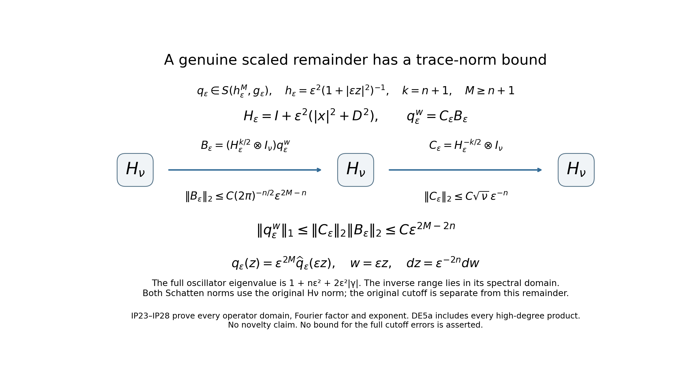
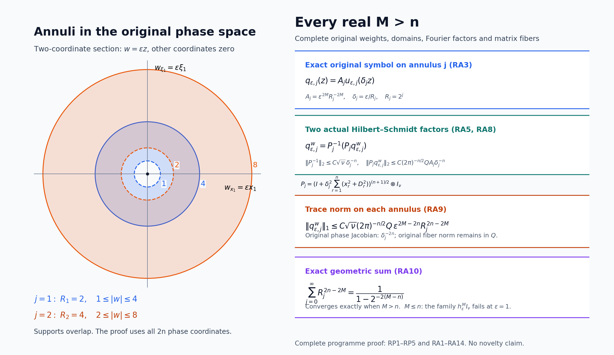

# Scaled Weyl parametrices and the surviving differential degree

*Written and dedicated to the public domain by Codex, September 2026 (CC0).*

The index can be read from two ordered errors of a cutoff inverse. Scaling the original matrix symbol makes the analytic remainders small enough to expose a finite differential coefficient, but the cutoff part of each error must stay visible. We establish Fredholmness at every positive scale, retain both matrix orders, prove a uniform trace bound only for genuine high-order remainders, and then show exactly why the lower differential degrees cancel in the difference of traces. The surviving coefficient is still a finite Weyl expression; its exterior and boundary evaluation is a further calculation.

The prerequisites are [Weyl products for a varying metric](weyl-metric-products.md) for the ordered \(C_k\) coefficients and remainders, [Metric operator bounds](metric-operator-bounds.md) for boundedness, [Symbols, operators and Sobolev scales](euclidean-symbol-calculus.md) for the operator product, [Traces that survive passage to cohomology](traces-and-complexes.md) for the powers-of-errors index identity, and [Weyl kernels, operator traces, and a finite trace-class test](weyl-trace-criterion.md) for the exact matrix trace and finite weighted-derivative test. All objects below retain their original \(x,\xi\) coordinates and the original isotropic metric.

## 1. Original metric, symbol and cutoff

Let \(n,\nu\ge1\), \(z=(x,\xi)\in\mathbb R^{2n}\), and \(e=|dx|^2+|d\xi|^2\). Preserve the original metric and its weight:
\[
 h(z)=(1+|x|^2+|\xi|^2)^{-1},\qquad
 g_z=h(z)e,\qquad
 a\in S(1,g;\operatorname{End}\mathbb C^\nu).
 \tag{IP1}
\]
Assume that \(a(z)\) is invertible outside an open ball \(B\), with \(\sup_{z\notin B}\|a(z)^{-1}\|<\infty\). Choose a real scalar \(\psi\in C^\infty(\mathbb R^{2n})\) which vanishes near the noninvertible region, whose support lies where \(a\) is invertible, and which equals one outside a compact set. Put
\[
 b(z)=
 \begin{cases}\psi(z)a(z)^{-1},&z\in\operatorname{supp}\psi,\\
 0,&\text{where }\psi=0.\end{cases}
 \qquad ba=ab=\psi I_\nu .
 \tag{IP2}
\]
The two pointwise equalities keep their displayed matrix order. On the invertibility region, differentiating \(a^{-1}a=I_\nu\) gives
\(\partial_j a^{-1}=-a^{-1}(\partial_j a)a^{-1}\). Induction over a multiindex expresses every higher derivative as a finite sum of ordered words alternating bounded inverse factors with derivatives of \(a\), whose derivative orders add to the total order. The defining estimate for (IP1) makes a derivative of total order \(k\) at most \(C_k h^{k/2}\). Derivatives of \(\psi\) are supported in a fixed compact region, on which \(h\) has a positive lower bound. Consequently
\[
 b\in S(1,g;\operatorname{End}\mathbb C^\nu).
 \tag{IP3}
\]
This is the actual cutoff inverse; no global inverse of \(a\) is assumed.

## 2. The scaled metric with uniform structural constants

For \(0<\varepsilon\le1\), define all four scaled objects:
\[
 a_\varepsilon(z)=a(\varepsilon z),\quad
 b_\varepsilon(z)=b(\varepsilon z),\quad
 \psi_\varepsilon(z)=\psi(\varepsilon z),\quad
 h_\varepsilon(z)=\varepsilon^2h(\varepsilon z)
   ={1\over\varepsilon^{-2}+|z|^2},\quad
 g_{\varepsilon,z}=h_\varepsilon(z)e .
 \tag{IP4}
\]
The Euclidean symplectic dual of \(g_\varepsilon\) is \(g_\varepsilon^\sigma=h_\varepsilon^{-1}e\); its Planck weight is exactly \(h_\varepsilon\le1\). Write \(L_\varepsilon(z)=\varepsilon^{-2}+|z|^2\). If \(g_{\varepsilon,z}(v)\le\delta^2\) with \(0<\delta<1\), then \(|v|\le\delta\sqrt{L_\varepsilon(z)}\). The triangle inequality in \(\mathbb R^{2n+1}\), applied to \((\varepsilon^{-1},z)\), yields
\[
 (1-\delta)^2L_\varepsilon(z)
 \le L_\varepsilon(z+v)
 \le(1+\delta)^2L_\varepsilon(z).
 \tag{IP5}
\]
This proves slow variation uniformly in \(\varepsilon\). For any \(z,w\), \(|z|\le|w|+|z-w|\) gives \(L_\varepsilon(z)\le2L_\varepsilon(w)+2|z-w|^2\), and the same inequality holds with \(z,w\) exchanged. Since \(L_\varepsilon(z),L_\varepsilon(w)\ge1\), both ratios of \(L_\varepsilon(z)\) and \(L_\varepsilon(w)\) are bounded by a fixed multiple of \(1+L_\varepsilon(w)|z-w|^2=1+g_{\varepsilon,w}^\sigma(z-w)\). Thus \(g_\varepsilon\) and each fixed power of \(h_\varepsilon\) have uniform symplectic-temperateness and weight constants. These are the exact hypotheses needed for the one-metric specialization of W31–W33 and the boundedness estimate B26.

For a multiindex \(\alpha\) of length \(k\), the chain rule and (IP1),(IP3) give
\[
 \|\partial_z^\alpha a_\varepsilon(z)\|
 +\|\partial_z^\alpha b_\varepsilon(z)\|
 \le C_\alpha\varepsilon^k(1+\varepsilon^2|z|^2)^{-k/2}
 =C_\alpha h_\varepsilon(z)^{k/2}.
 \tag{IP6}
\]
The constants do not depend on \(0<\varepsilon\le1\). The same argument treats \(\psi_\varepsilon\), so these three families are uniformly bounded in their respective \(S(1,g_\varepsilon)\) seminorms.

## 3. Both ordered Weyl errors and their cutoff parts

The one-metric Weyl product W31–W33 with \(N=1\), applied in each factor order, gives
\[
 d_{1,\varepsilon}
   =b_\varepsilon\#a_\varepsilon-\psi_\varepsilon I_\nu
       \in S(h_\varepsilon,g_\varepsilon),\qquad
 d_{2,\varepsilon}
   =a_\varepsilon\#b_\varepsilon-\psi_\varepsilon I_\nu
       \in S(h_\varepsilon,g_\varepsilon),
 \tag{IP7}
\]
with all indicated symbol seminorms uniform in \(\varepsilon\). Here \(C_0(b_\varepsilon,a_\varepsilon)=b_\varepsilon a_\varepsilon=\psi_\varepsilon I_\nu\), and \(C_0(a_\varepsilon,b_\varepsilon)=a_\varepsilon b_\varepsilon=\psi_\varepsilon I_\nu\); no interchange of derivative factors in the two noncommutative remainders is made.

Let \(A_\varepsilon=a_\varepsilon^w\) and \(B_\varepsilon=b_\varepsilon^w\) on \(L^2(\mathbb R^n;\mathbb C^\nu)\). B26 makes both bounded. Their symbols have bounded derivatives of every Euclidean order, because \(h_\varepsilon\le1\), so they also belong to the Euclidean order-zero calculus. For compact smooth approximants, Fubini gives the Weyl operator product identity. Both W31 and the Euclidean operator-composition theorem E19 pass that identity through bounded symbol families converging locally smoothly; uniqueness of the Weyl kernel identifies the two products. Hence the actual operator errors are
\[
 R_{1,\varepsilon}=I-B_\varepsilon A_\varepsilon
       =(r_{1,\varepsilon})^w,\qquad
 R_{2,\varepsilon}=I-A_\varepsilon B_\varepsilon
       =(r_{2,\varepsilon})^w,
 \quad
 r_{j,\varepsilon}
       =(1-\psi_\varepsilon)I_\nu-d_{j,\varepsilon}.
 \tag{IP8}
\]
In particular, the uniform assertion is exactly
\[
 r_{j,\varepsilon}-(1-\psi_\varepsilon)I_\nu
       \in S(h_\varepsilon,g_\varepsilon)
       \quad\text{uniformly for }0<\varepsilon\le1 .
 \tag{IP9}
\]
It is generally false to claim that the whole \(r_{j,\varepsilon}\) has a uniform \(S(h_\varepsilon,g_\varepsilon)\) seminorm. If \(\psi(0)=0\), then \(1-\psi_\varepsilon(0)=1\) while \(h_\varepsilon(0)=\varepsilon^2\).

For each *fixed* \(\varepsilon>0\), \(1-\psi_\varepsilon\) is smooth and supported in \(|z|\le C/\varepsilon\). On that support \(h_\varepsilon(z)\ge c_\varepsilon>0\), and its derivatives obey (IP6). It therefore belongs to \(S(h_\varepsilon^M,g_\varepsilon)\) for every fixed integer \(M\), with constants allowed to depend on \(\varepsilon\). In particular (IP7)–(IP8) imply
\[
 r_{1,\varepsilon},r_{2,\varepsilon}
       \in S(h_\varepsilon,g_\varepsilon)
       \quad\text{for each fixed }\varepsilon>0,
 \tag{IP10}
\]
without converting (IP10) into a false uniform claim.

## 4. Trace-class powers with the full finite threshold

For a fixed \(\varepsilon>0\), the weight \(h_\varepsilon\) is admissible for the product theorem. Repeated W31 products and the operator identity in Section 3 therefore give, in each original factor order,
\[
 R_{j,\varepsilon}^{\,N}
   =\bigl(r_{j,\varepsilon}^{\# N}\bigr)^w,\qquad
 r_{j,\varepsilon}^{\# N}
   \in S(h_\varepsilon^N,g_\varepsilon)
       \quad(N\in\mathbb N).
 \tag{IP11}
\]
There is no uniform-in-\(\varepsilon\) seminorm claim for the full power. To apply the exact CT1 criterion, fix \(N\ge n+1\), put \(q=r_{j,\varepsilon}^{\# N}\), and take polynomial weight degree \(d=|\alpha|+|\beta|\) and derivative degree \(k=|\alpha'|+|\beta'|\) with \(d+k\le n+1\). Because \(h_\varepsilon(z)\asymp_\varepsilon\langle z\rangle^{-2}\) for this fixed \(\varepsilon\), its symbol estimate gives
\[
 |x^\alpha\xi^\beta
    \partial_x^{\alpha'}\partial_\xi^{\beta'}q(z)|
 \le C_{\varepsilon,\alpha,\beta,\alpha',\beta'}
        \langle z\rangle^{d-2N-k}.
 \tag{IP12}
\]
The square of the right side is integrable in \(2n\) dimensions: the smallest decay exponent \(2N+k-d\) occurs at \(k=0,d=n+1\), where it is \(2N-(n+1)\ge n+1>n\). Every term of the original four-multiindex CT1 sum is finite. CT1–CT2 thus prove that both \(R_{1,\varepsilon}^N\) and \(R_{2,\varepsilon}^N\) are trace class. The exact CI12/CT15 trace identity also applies because \(q\in L^1\):
\[
 \operatorname{Tr}R_{j,\varepsilon}^{\,N}
 =(2\pi)^{-n}\int_{\mathbb R^{2n}}
        \operatorname{tr}_{\mathbb C^\nu}
          \bigl(r_{j,\varepsilon}^{\# N}(x,\xi)\bigr)
          \,dx\,d\xi .
 \tag{IP13}
\]
The matrix trace, both phase coordinates, and the inverse Fourier factor remain explicit.

## 5. Fredholmness, power index and scaling continuity

Apply the proved powers-of-errors identity T28 to the bounded pair \(T=A_\varepsilon,S=B_\varepsilon\) and the two trace-class powers in Section 4. It proves, for every \(0<\varepsilon\le1\), that \(A_\varepsilon\) is Fredholm and
\[
 \operatorname{ind}A_\varepsilon
 =\operatorname{Tr}R_{1,\varepsilon}^{\,N}
  -\operatorname{Tr}R_{2,\varepsilon}^{\,N}
 =(2\pi)^{-n}\int_{\mathbb R^{2n}}
   \operatorname{tr}_{\mathbb C^\nu}
   \bigl(r_{1,\varepsilon}^{\# N}
        -r_{2,\varepsilon}^{\# N}\bigr)(z)\,dz ,
 \qquad N\ge n+1.
 \tag{IP14}
\]
This does not assume the two errors commute. At \(\varepsilon=1\), \(A_1=a^w\), so (IP14) already establishes Fredholmness of the original operator.

For completeness, index constancy along the entire *positive* scaling interval follows from actual operator-norm continuity, not an asserted limit at \(\varepsilon=0\). Fix \(\varepsilon_0>0\) and restrict \(\varepsilon\) to a compact interval \(J\subset(0,1]\) around it. The weights \(h_\varepsilon\) and \(h_{\varepsilon_0}\) are uniformly comparable there. Differentiating an order-\(k\) spatial symbol derivative gives
\[
 \partial_\varepsilon\partial_z^\alpha a(\varepsilon z)
 =k\varepsilon^{k-1}(\partial^\alpha a)(\varepsilon z)
  +\varepsilon^k
       z\cdot\nabla(\partial^\alpha a)(\varepsilon z).
 \tag{IP15}
\]
The first term is bounded by \(C_Jh_{\varepsilon_0}^{k/2}\); the second has the same bound because
\(\varepsilon|z|/\sqrt{1+\varepsilon^2|z|^2}\le1\) and \(\varepsilon^{-1}\) is bounded on \(J\). The fundamental theorem of calculus in every finite \(S(1,g_{\varepsilon_0})\) seminorm and B26 imply \(A_\varepsilon\to A_{\varepsilon_0}\) in operator norm. The Fredholm index is locally constant under that topology, hence
\[
 \operatorname{ind}a_\varepsilon^w
       =\operatorname{ind}a^w
       \quad\text{for every }0<\varepsilon\le1.
 \tag{IP16}
\]
Nothing here states norm continuity at \(\varepsilon=0\), where the rescaled symbol need not have such a limit.

## 6. The exact metric-weight integral and its limit

The uniformly controlled *symbolic* remainder in (IP9) involves powers of \(h_\varepsilon\). Its phase-space integral has a separate exact scaling, for every real \(M>n\):
\[
 \begin{aligned}
 \int_{\mathbb R^{2n}}h_\varepsilon(z)^M\,dz
 &=\varepsilon^{2M-2n}
   \int_{\mathbb R^{2n}}(1+|w|^2)^{-M}\,dw\\
 &=\varepsilon^{2M-2n}
       \pi^n{\Gamma(M-n)\over\Gamma(M)}.
 \end{aligned}
 \tag{IP17}
\]
The first equality is the exact change \(w=\varepsilon z\), whose \(2n\)-dimensional Jacobian is \(\varepsilon^{-2n}\). For the second, insert
\((1+|w|^2)^{-M}=\Gamma(M)^{-1}
\int_0^\infty t^{M-1}e^{-t}e^{-t|w|^2}\,dt\).
Tonelli applies to the nonnegative integrand, the \(2n\)-dimensional Gaussian integral is \((\pi/t)^n\), and the remaining integral is \(\Gamma(M-n)\).

Equation (IP17) is **not** a trace-norm bound for the full powers in (IP14). Those powers contain the compact cutoff contribution \(1-\psi_\varepsilon\), whose \(S(h_\varepsilon)\) seminorm is not uniform. The later differential-degree extraction must keep that contribution and prove its cancellations, as well as any separate trace estimate for uniformly controlled symbolic remainders. The top-degree alternating form, boundary Stokes sign and final integral of target 051 remain to be derived.

## 7. Uniform trace bounds for genuine symbolic remainders

There is nevertheless an exact trace estimate for a remainder that *is* uniform in its full weight. For either order of the original matrix factors, W32–W33 give, for an integer \(M\ge n+1\),
\[
 \begin{split}
 q_{1,\varepsilon}^{(M)}
   &=b_\varepsilon\#a_\varepsilon
       -\sum_{k=0}^{M-1}C_k(b_\varepsilon,a_\varepsilon),\\
 q_{2,\varepsilon}^{(M)}
   &=a_\varepsilon\#b_\varepsilon
       -\sum_{k=0}^{M-1}C_k(a_\varepsilon,b_\varepsilon),\\
 q_{j,\varepsilon}^{(M)}
   &\in S(h_\varepsilon^M,g_\varepsilon)
       \quad\text{with seminorms uniform in }\varepsilon.
 \end{split}
 \tag{IP18}
\]
The coefficients \(C_k\) are the actual ordered Weyl differential coefficients W29; in the matrix case the order of factors in each coefficient stays as written. By the CT1 argument used in (IP12), each \(q_{j,\varepsilon}^{(M)w}\) is trace class for fixed \(\varepsilon\). Its zeroth symbol seminorm and the trace identity then give the uniform *trace* bound
\[
 \left|\operatorname{Tr}(q_{j,\varepsilon}^{(M)})^w\right|
 \le(2\pi)^{-n}\nu C_M
       \int_{\mathbb R^{2n}}h_\varepsilon(z)^M\,dz
 \le C'_M\varepsilon^{2M-2n}.
 \tag{IP19}
\]
No trace-norm estimate is inferred from the final inequality. Repeated W31 products show the same conclusion when finitely many uniformly bounded \(S(1,g_\varepsilon)\) factors stand before or after this \(S(h_\varepsilon^M,g_\varepsilon)\) remainder, in any fixed displayed order.

### A separate proof of the uniform trace-norm bound

The uniform symbol hypothesis gives a stronger conclusion than (IP19). If the original matrix symbols \(q_\varepsilon(z)\) are uniformly bounded in \(S(h_\varepsilon^M,g_\varepsilon)\), with an integer \(M\geq n+1\), then
\[
 \|q_\varepsilon^w\|_1\leq C\varepsilon^{2M-2n},
                       \qquad 0<\varepsilon\leq1.              \tag{IP22}
\]
The constant uses finitely many of those original symbol seminorms. This statement applies to the genuine remainders and every displayed finite ordered product containing one such factor. It does not supply a uniform estimate for the full errors (IP8), since their cutoff term fails the required weight hypothesis.

Put \(k=n+1\) and retain the full auxiliary oscillator
\[
 \begin{gathered}
 H_\varepsilon=I+\varepsilon^2\sum_{j=1}^n(x_j^2+D_j^2),\\
 H_\varepsilon h_\gamma
   =(1+n\varepsilon^2+2\varepsilon^2|\gamma|)h_\gamma,\\
 \|(H_\varepsilon^{-k/2}\otimes I_\nu)\|_2^2
 =\nu\sum_{r=0}^\infty\binom{r+n-1}{n-1}
             (1+n\varepsilon^2+2\varepsilon^2r)^{-k}
 \leq C_{n,k}\nu\varepsilon^{-2n}.
 \end{gathered}                                                  \tag{IP23}
\]
The basis and every constant in its eigenvalue come from CT3–CT5, without shifting away \(I\) or \(n\varepsilon^2\). More precisely, \(H_\varepsilon=(1-\varepsilon^2)I+\varepsilon^2H\) on the original \(D(H)\); for each fixed positive \(\varepsilon\), its diagonal eigenvalues are comparable to those of \(H\), so this is exactly its selfadjoint domain. Write \(\lambda_{\varepsilon,\gamma}=1+n\varepsilon^2+2\varepsilon^2|\gamma|\). Every real spectral power used here has the explicit domain and action
\[
 \begin{gathered}
 D(H_\varepsilon^s)=\left\{f:\sum_\gamma
       \lambda_{\varepsilon,\gamma}^{2s}|f_\gamma|^2<\infty\right\},
 \qquad H_\varepsilon^sf=\sum_\gamma
                   \lambda_{\varepsilon,\gamma}^sf_\gamma h_\gamma,
 \quad s>0,\\
 H_\varepsilon^{-s}:H_\nu\longrightarrow D(H_\varepsilon^s),
 \qquad H_\varepsilon^sH_\varepsilon^{-s}f=f,\quad
 H_\varepsilon^{-s}H_\varepsilon^sf=f\ (f\in D(H_\varepsilon^s)).
 \end{gathered}                                                   \tag{IP23a}
\]
For vector-valued functions, each coefficient is in \(\mathbb C^\nu\) and the sums use its full squared norm. The diagonal coefficient calculation proves both identities and closedness of the graph directly. To prove the bound (IP23), the terms with \(r<\varepsilon^{-2}\) have total multiplicity at most \(C_n\varepsilon^{-2n}\). On each dyadic block \(2^j\varepsilon^{-2}\leq r<2^{j+1}\varepsilon^{-2}\), the multiplicity sum is at most \(C_n2^{jn}\varepsilon^{-2n}\), and the displayed inverse eigenvalue power is at most \(C_k2^{-jk}\). Their full sum is bounded by \(C\varepsilon^{-2n}\sum_{j\geq0}2^{j(n-k)}\), which converges because \(k=n+1\). Endpoint rounding changes only the finite dimensional constants.

The graph estimate needed for the other factor is
\[
 \|H_\varepsilon^{k/2}f\|_2
 \leq C_{n,k}\sum_{|\alpha|+|\beta|\leq k}
           \varepsilon^{|\alpha|+|\beta|}
                          \|x^\alpha D^\beta f\|_2.             \tag{IP24}
\]
First, for each Hermite coefficient, the full eigenvalue satisfies
\((1+n\varepsilon^2+2\varepsilon^2|\gamma|)^k
 \leq C_{n,k}(1+\varepsilon^{2k}\sum_j(\gamma_j+k)!/\gamma_j!)\).
This follows from \((1+s)^k\leq2^{k-1}(1+s^k)\), \(0<\varepsilon\leq1\), and a coordinate with \(\gamma_j\geq|\gamma|/n\), exactly as in CT7–CT8. Summing gives a bound by \(\|f\|_2^2+\varepsilon^{2k}\sum_j\|(c_j^*)^kf\|_2^2\). Expand each creator power with every lower commutator term retained, as in CT9. A resulting monomial has total degree \(d\leq k\), and its actual coefficient \(\varepsilon^k\) obeys \(\varepsilon^k\leq\varepsilon^d\). The triangle inequality proves (IP24) on Schwartz vectors. The diagonal spectral graph norm is closed, so convergence of all the weighted derivative terms passes it to the corresponding graph domain.

We now prove the estimate for the original \(q_\varepsilon^w\). The coordinate pullback
\(\widehat q_\varepsilon(w)=\varepsilon^{-2M}q_\varepsilon(w/\varepsilon)\)
is used only to evaluate its symbol norms and integrals. Its exact derivative comparison is
\[
 \partial_w^\sigma\widehat q_\varepsilon(w)
   =\varepsilon^{-2M-|\sigma|}
          (\partial_z^\sigma q_\varepsilon)(w/\varepsilon),
 \qquad
 |\partial_w^\sigma\widehat q_\varepsilon(w)|_{\mathrm{HS}}
       \leq C_\sigma h(w)^{M+|\sigma|/2}.                       \tag{IP25}
\]
Thus this family has uniform \(S(h^M,g)\) bounds, with the original factor \(q_\varepsilon(z)=\varepsilon^{2M}\widehat q_\varepsilon(\varepsilon z)\) explicit. Applying \(\varepsilon x_j\) or \(\varepsilon D_j\) on the output uses the full left-action identities CT10, including their coefficients \(i\varepsilon/2\) and \(-i\varepsilon/2\). After \(d\leq k\) such ordered actions, every symbol term is
\[
 \begin{split}
 C\varepsilon^d z^\rho\partial_z^\sigma q_\varepsilon(z)
 &=C\varepsilon^{2M+d-|\rho|+|\sigma|}
       w^\rho\partial_w^\sigma\widehat q_\varepsilon(w)
          \big|_{w=\varepsilon z},\\
 &\hspace{10mm}|\rho|+|\sigma|\leq d\leq k.
 \end{split}                                                     \tag{IP26}
\]
Derivatives hitting a polynomial weight produce lower-degree monomials with the same actual \(\varepsilon^d\); none is omitted. The extra exponent \(d-|\rho|+|\sigma|\) is nonnegative. In the original \(2n\) phase dimensions, changing \(w=\varepsilon z\) contributes \(\varepsilon^{-2n}\) to the squared integral. By (IP25), each squared \(w\)-norm is bounded by the integral of a constant times \(\langle w\rangle^{2|\rho|-4M-2|\sigma|}\). Its worst exponent is \(2k-4M\leq-2(n+1)<-2n\), so every term is integrable uniformly.

The exact Hilbert–Schmidt formula CI5 and (IP24) now give
\[
 \|(H_\varepsilon^{k/2}\otimes I_\nu)q_\varepsilon^w\|_2
       \leq C(2\pi)^{-n/2}\varepsilon^{2M-n}.                  \tag{IP27}
\]
One can first use a compact smooth phase cutoff, where every output is Schwartz by CT11a. For fixed \(\varepsilon\), the weighted derivative estimates above give convergence of the cutoff symbols and every output-weighted operator in Hilbert–Schmidt norm, by CI5 and the finite CT10 action. The closed spectral graph of \(H_\varepsilon^{k/2}\) then identifies the limiting second factor in (IP27) and shows that every output of \(q_\varepsilon^w\) lies in its domain. No multiplication of an unverified unbounded operator is used.

The actual factorization on the original Hilbert space is consequently
\[
 q_\varepsilon^w=(H_\varepsilon^{-k/2}\otimes I_\nu)
              ((H_\varepsilon^{k/2}\otimes I_\nu)q_\varepsilon^w).
 \tag{IP28}
\]
Use the exact inverse-domain identity in this product, then multiply the two Hilbert–Schmidt bounds (IP23),(IP27) with the trace-ideal inequality. Their exponents are \(-n\) and \(2M-n\), so the result is (IP22), with all original Fourier and fiber factors in the stated constant. W31 puts every finite ordered product containing the genuine remainder uniformly in the same \(S(h_\varepsilon^M,g_\varepsilon)\) class; applying this proved estimate gives its trace-norm bound in the same order. In particular the telescoping differences used in (IP21) and the full analytic remainder (DE7) tend to zero in trace norm, as well as in trace.

Equations (IP23)–(IP28) prove both typed factors and every exponent in the diagram. The original symbol, phase coordinates, weight and cutoff remain present in their separate formulas. This is a proved strengthening of the genuine-remainder estimate; it does not assert a trace-norm bound for the full errors.

To connect this genuine remainder estimate to the full errors, retain the cutoff and define the finite symbols
\[
 s_{j,\varepsilon}^{(M)}
 =(1-\psi_\varepsilon)I_\nu
     -\sum_{k=1}^{M-1}C_k(f_{j,\varepsilon},g_{j,\varepsilon}),
 \quad
 (f_{1,\varepsilon},g_{1,\varepsilon})=(b_\varepsilon,a_\varepsilon),
 \quad
 (f_{2,\varepsilon},g_{2,\varepsilon})=(a_\varepsilon,b_\varepsilon).
 \tag{IP20}
\]
Equations (IP8),(IP18) give \(r_{j,\varepsilon}
=s_{j,\varepsilon}^{(M)}-q_{j,\varepsilon}^{(M)}\).
For any ordered associative product, the noncommutative telescoping identity
\(u^{\# N}-v^{\# N}
=\sum_{\ell=0}^{N-1}u^{\#\ell}\#(u-v)\#v^{\#(N-1-\ell)}\)
follows by expanding adjacent differences; it does not interchange factors. Apply it with \(u=r_{j,\varepsilon}\) and \(v=s_{j,\varepsilon}^{(M)}\). Both are uniformly bounded in \(S(1,g_\varepsilon)\), whereas \(u-v=-q_{j,\varepsilon}^{(M)}\) is uniformly in \(S(h_\varepsilon^M,g_\varepsilon)\). W31, the fixed-\(\varepsilon\) trace criterion and (IP17) therefore prove
\[
 \begin{split}
 &\operatorname{Tr}R_{j,\varepsilon}^{\,N}
   -\operatorname{Tr}
      \bigl((s_{j,\varepsilon}^{(M)})^{\# N}\bigr)^w
      =O(\varepsilon^{2M-2n}),\\
 &\operatorname{ind}a^w
  =\operatorname{Tr}
      \bigl((s_{1,\varepsilon}^{(M)})^{\# N}\bigr)^w
   -\operatorname{Tr}
      \bigl((s_{2,\varepsilon}^{(M)})^{\# N}\bigr)^w
      +O(\varepsilon^{2M-2n}),
 \qquad N\ge n+1 .
 \end{split}
 \tag{IP21}
\]
Each finite-symbol power in (IP21) is trace class for fixed \(\varepsilon\): every \(s_{j,\varepsilon}^{(M)}\) belongs to \(S(h_\varepsilon,g_\varepsilon)\) with fixed-\(\varepsilon\) constants, and the argument of (IP11)–(IP13) applies. The displayed errors are uniform in \(\varepsilon\), because every telescoping summand contains the one genuinely uniform \(h_\varepsilon^M\) factor. This proves a bounded remainder step while keeping the unbounded-support cutoff contribution in the finite main expression. It does not yet identify which of that expression's differential degrees survive.

## 8. Differential coefficients in the two original orders

Keep \(n,\nu\ge1\), \(h(z)=(1+|z|^2)^{-1}\), \(g=h(|dx|^2+|d\xi|^2)\), and the original square matrix symbol \(a\), cutoff \(\psi\), and \(b=\psi a^{-1}\) from IP1–IP3. Denote the actual ordered Weyl differential coefficient of W29 by \(C_\ell(f,g)\), so that \(C_0(f,g)=fg\), the first argument's matrix derivatives stand to the left of the second argument's, and \(C_\ell\) has exactly \(\ell\) phase derivatives on each factor. Put
\[
 (f_1,g_1)=(b,a),\qquad(f_2,g_2)=(a,b),\qquad
 c_{j,0}=(1-\psi)I_\nu,\qquad
 c_{j,k}=-C_k(f_j,g_j)\quad(k\ge1).
 \tag{DE1}
\]
The scalar \(\psi\) is one outside a compact set, so \(c_{j,0}\) is compactly supported. Since \(f_j,g_j\in S(1,g)\), the product rule in the explicit differential formula gives \(c_{j,k}\in S(h^k,g)\) for every \(k\ge1\). No equality between \(C_k(b,a)\) and \(C_k(a,b)\) is assumed for matrix symbols.

For \(0<\varepsilon\le1\), write \(\mathscr S_\varepsilon f(z)=f(\varepsilon z)\). If \(f\in S(h^i,g)\), the chain rule proves
\[
 \varepsilon^{2i}\mathscr S_\varepsilon f
       \in S(h_\varepsilon^i,g_\varepsilon)
       \quad\text{with seminorms uniform in }\varepsilon,
 \qquad
 h_\varepsilon(z)=\varepsilon^2h(\varepsilon z).
 \tag{DE2}
\]
Indeed an order-\(q\) derivative on the left is bounded by
\(C\varepsilon^{2i+q}h(\varepsilon z)^{i+q/2}
=C h_\varepsilon(z)^{i+q/2}\).
Since \(C_\ell\) differentiates both of its inputs exactly \(\ell\) times in total, the scaled coefficients obey the *exact* identity
\[
 C_\ell(\varepsilon^{2i}\mathscr S_\varepsilon f,
          \varepsilon^{2j}\mathscr S_\varepsilon g)
 =\varepsilon^{2(i+j+\ell)}
       \mathscr S_\varepsilon C_\ell(f,g).
 \tag{DE3}
\]
Thus powers of \(\varepsilon^2\) count pairs of actual phase derivatives; no factor is absorbed into a completed or normalized symbol.

## 9. A finite noncommutative star polynomial

Use a formal variable \(t\) only to organize the *finite* calculation. For coefficient sequences \((u_i),(v_j)\), define their degree-\(k\) ordered Weyl polynomial coefficient by
\[
 (u\star_t v)_k
    =\sum_{\substack{i,j,\ell\ge0\\i+j+\ell=k}}
          C_\ell(u_i,v_j).
 \tag{DE4}
\]
This is a finite sum for every \(k\), retains the order of matrix multiplication, and is associative through each finite degree because the actual Weyl product is associative and W32 supplies a remainder in the next metric weight. Define \(F_{j,k}^{(N)}\) as the degree-\(k\) coefficient obtained by applying (DE4) to \(N\) copies of the sequence \(c_{j,0},c_{j,1},\ldots\), with left-associative parentheses. Associativity shows that the chosen parentheses do not change the coefficient. Every summand is an ordered differential word in exactly \(N\) of the \(c_{j,i}\), with total scale degree \(k\).

We now prove the analytic statement behind this finite algebra. For any fixed integers \(N\ge1\) and \(M\ge1\),
\[
 r_{j,\varepsilon}^{\# N}
 =\sum_{k=0}^{M-1}
        \varepsilon^{2k}
          \mathscr S_\varepsilon F_{j,k}^{(N)}
       +E_{j,\varepsilon}^{(N,M)},\qquad
 E_{j,\varepsilon}^{(N,M)}
       \in S(h_\varepsilon^M,g_\varepsilon)
       \ \text{uniformly in }\varepsilon .
 \tag{DE5}
\]
For \(N=1\), IP18 and (DE1) give this identity, including the sign of the two product remainders. Suppose it holds for a given number of factors. Multiply its left and right sides by \(r_{j,\varepsilon}\) in that original order. IP8–IP9 make \(r_{j,\varepsilon}\) uniformly bounded in \(S(1,g_\varepsilon)\), so W31 puts the previous \(E^{(N,M)}\#r\) uniformly in \(S(h_\varepsilon^M,g_\varepsilon)\). Expand the new factor to degree \(M-1\) by the \(N=1\) case; its remainder, multiplied by the finite previous sum, lies in the same weight. For a pair of retained terms of intrinsic degrees \(i,j\) with \(i+j<M\), W32 with positive truncation \(M-i-j\) gives all \(C_\ell\) with \(i+j+\ell<M\), and puts the rest in \(S(h_\varepsilon^M,g_\varepsilon)\). If \(i+j\geq M\), apply W31 to the entire ordered product, placing it uniformly in \(S(h_\varepsilon^{i+j},g_\varepsilon)\). Its exact inclusion bound in the required remainder class is
\[
 p_l(v;h_\varepsilon^M,g_\varepsilon)
 \leq\varepsilon^{2(i+j-M)}
                 p_l(v;h_\varepsilon^{i+j},g_\varepsilon),
 \quad v\in S(h_\varepsilon^{i+j},g_\varepsilon),\quad i+j\geq M,
 \tag{DE5a}
\]
because \(h_\varepsilon^{i+j-M}\leq\varepsilon^{2(i+j-M)}\leq1\). Here \(p_l\) is the original directional-derivative seminorm; each of its quotients has exactly this weight ratio. This case uses no negative truncation order and retains the entire high-degree product in the proved remainder. The uniform constants follow from IP5–IP6 and W33; (DE3) identifies the retained term exactly. This proves (DE5) by induction, without treating a formal series as convergent.

## 10. Compact support of every coefficient through degree \(n\)

Fix the trace-power exponent \(N=n+1\) and truncate (DE5) at \(M=n+1\). For every \(0\le k\le n\), each summand of \(F_{j,k}^{(n+1)}\) contains \(n+1\) original \(c\)-factors. If all those factors had positive intrinsic degree, their degrees would sum to at least \(n+1>k\), even before adding the nonnegative Weyl differential degrees. Therefore at least one factor is \(c_{j,0}=(1-\psi)I_\nu\). The \(C_\ell\) are local differential expressions, so every derivative of that factor remains supported in the same fixed compact set. Consequently
\[
 F_{j,k}^{(n+1)}
   \in C_c^\infty(\mathbb R^{2n};
                  \operatorname{End}\mathbb C^\nu),
       \qquad 0\le k\le n .
 \tag{DE6}
\]
This is the exact support reason the separate coefficient integrals exist. A decay claim for \(c_{j,k}\) alone at \(k\le n\) would not give the same conclusion.

## 11. Integrable trace remainder and the exact expansion

The remainder in (DE5) with \(N=M=n+1\) is uniform in \(S(h_\varepsilon^{n+1},g_\varepsilon)\). For each fixed \(\varepsilon\), the full four-multiindex estimate IP12 proves that its Weyl operator is trace class. The exact matrix Weyl trace formula and IP17 then give
\[
 \left|\operatorname{Tr}
       (E_{j,\varepsilon}^{(n+1,n+1)})^w\right|
 \le (2\pi)^{-n}\nu C
        \int_{\mathbb R^{2n}}h_\varepsilon^{n+1}(z)\,dz
 =O(\varepsilon^2).
 \tag{DE7}
\]
For \(0\le k\le n\), (DE6) makes
\(\varepsilon^{2k}\mathscr S_\varepsilon F_{j,k}^{(n+1)}\)
a compactly supported smooth phase-space symbol for fixed \(\varepsilon\). It is trace class by CT1 and has the exact CI12 trace
\[
 \operatorname{Tr}
   \bigl(\varepsilon^{2k}
       \mathscr S_\varepsilon F_{j,k}^{(n+1)}\bigr)^w
 =(2\pi)^{-n}\varepsilon^{2k-2n}
       \int_{\mathbb R^{2n}}
          \operatorname{tr}_{\mathbb C^\nu}
                F_{j,k}^{(n+1)}(w)\,dw .
 \tag{DE8}
\]
The Jacobian is \(\varepsilon^{-2n}\), not \(\varepsilon^{-n}\), because both \(x\) and \(\xi\) are scaled.

Set the finite coefficients
\[
 A_k=(2\pi)^{-n}
   \int_{\mathbb R^{2n}}
      \operatorname{tr}_{\mathbb C^\nu}
       \bigl(F_{1,k}^{(n+1)}
           -F_{2,k}^{(n+1)}\bigr)(w)\,dw,
       \quad 0\le k\le n .
 \tag{DE9}
\]
They are absolutely defined by (DE6). Insert (DE5)–(DE8) into the already proved IP14 index formula and use IP16 to identify the left side with the original operator index. The result is the full finite asymptotic equality
\[
 \operatorname{ind}a^w
       =\sum_{k=0}^{n}A_k\varepsilon^{2k-2n}
              +O(\varepsilon^2),
       \qquad \varepsilon\downarrow0.
 \tag{DE10}
\]
No trace of an individual nonintegrable coefficient was written: each coefficient in (DE9) has compact support, and the remainder has the uniform trace bound (DE7).

## 12. The exact cancellation and surviving degree

The left side of (DE10) is one fixed integer for all positive \(\varepsilon\). If some \(A_k\ne0\) with \(k<n\), choose the smallest such \(k\). After multiplication by \(\varepsilon^{2n-2k}\), its term tends to \(A_k\), all larger-\(k\) terms and the \(O(\varepsilon^2)\) remainder tend to zero, while the constant left side tends to zero. This contradiction proves \(A_k=0\). Repeating for each lower \(k\), then letting \(\varepsilon\downarrow0\) in (DE10), gives
\[
 A_0=A_1=\cdots=A_{n-1}=0,\qquad
 \operatorname{ind}a^w=A_n .
 \tag{DE11}
\]
A degree \(k\) term in (DE4) has \(k\) Weyl derivative pairs, hence exactly \(2k\) total phase differentiations on the original ordered factor expressions, including derivatives of \(b=\psi a^{-1}\) and of the retained cutoff. Thus (DE11) says precisely that only total differential degree \(2n\) contributes after taking the **difference** of the two full matrix traces. It does not assert that the lower-degree trace of either error power vanishes separately. The cancellation is proved by the exact Fredholm index constancy together with the uniform analytic remainder, rather than by an unsupported formal cancellation.

## 13. Two examples with complete solutions

**Example 1: constant invertible matrix.** Take \(a(z)=A_0\in\operatorname{GL}_{\nu}(\mathbb C)\) at every \(z\), and choose \(\psi=1\). The actual cutoff inverse is \(b=A_0^{-1}\). Every positive-order derivative of either factor vanishes, so both ordered Weyl products are the identity. Thus, at every scale,
\[
 r_{1,\varepsilon}=r_{2,\varepsilon}=0,\qquad
 F_{1,k}^{(n+1)}=F_{2,k}^{(n+1)}=0
 \quad(0\le k\le n),\qquad
 \operatorname{ind}A_0^w=A_n=0 .
 \tag{SD1}
\]
This uses the full \(n+1\)-power formula, although the errors happen to vanish already before taking powers.

**Example 2: why the full error has no uniform \(h_\varepsilon\) bound.** Keep \(a(z)=I_\nu\), but choose a smooth scalar \(\psi\) that is zero in a neighborhood of \(z=0\) and one outside a compact set. The hypotheses in (IP2) hold because \(a\) is invertible everywhere. Now \(b=\psi I_\nu\). Weyl multiplication by the constant identity is exact, so \(d_{1,\varepsilon}=d_{2,\varepsilon}=0\) and
\[
 r_{1,\varepsilon}(0)=r_{2,\varepsilon}(0)=I_\nu,
 \qquad h_\varepsilon(0)=\varepsilon^2 .
 \tag{SD2}
\]
If the full \(r_{j,\varepsilon}\) had a uniform \(S(h_\varepsilon,g_\varepsilon)\) zeroth seminorm, (SD2) would require \(1\le C\varepsilon^2\) for every positive \(\varepsilon\), which is impossible. For each fixed \(\varepsilon\), (IP10) remains true. This distinction is why the finite expansion retains \((1-\psi_\varepsilon)I_\nu\) separately.

## 14. Current coefficient and next calculation

Here the complete ordered coefficient \(A_n\) is defined and proved to equal the analytic index. Identifying that coefficient with its noncommutative exterior boundary integral requires the later programme coefficient calculation; no such identification is used in this lesson.

## 15. Editorial supplement: the full product weight at this receiving map

The original mathematics above, including its integer truncations and (IP22), is retained. This supplement records the exact receiving map for the later product extension (WG1)--(WG4) in [Weyl products](weyl-metric-products.md), and proves a stronger trace estimate for the same original symbols. The proof uses only the earlier complete programme lessons linked here and the calculations written below; no novelty claim is made.

For the original pair of identical metrics \(g_\varepsilon=h_\varepsilon e\), the cross parameter of (W6) is exactly \(H=h_\varepsilon\). Indeed the symplectic dual is \(h_\varepsilon^{-1}e\), so the ratio defining its squared cross parameter is \(h_\varepsilon^2\) on every nonzero direction. The actual product-space multiplier parameter remains \(h_\varepsilon/4\), the diagonal metric remains \(2g_\varepsilon\), and the product space still has dimension \(4n\). Therefore the full extra weight is
\[
 w_\varepsilon(z)=(1+h_\varepsilon(z)/4)^{4n},\qquad
 1\leq w_\varepsilon(z)
       \leq(1+\varepsilon^2/4)^{4n}\leq(5/4)^{4n}.
 \tag{RP1}
\]
No factor has been removed from the provider's actual estimate. For any real \(s,t\), every target derivative order \(l\), and every nonnegative integer truncation \(N\), the specialization of (WG4) gives
\[
\begin{aligned}
 &p_l\!\left(R_N(u,v);
       h_\varepsilon^{s+t+N}w_\varepsilon,g_\varepsilon\right)
 \leq C_{N,l}\,4^{-N}2^{l/2}2^J
       p_{\leq J}(u;h_\varepsilon^s,g_\varepsilon)
       p_{\leq J}(v;h_\varepsilon^t,g_\varepsilon),\\
 &p_l\!\left(R_N(u,v);
       h_\varepsilon^{s+t+N},g_\varepsilon\right)
 \leq(1+\varepsilon^2/4)^{4n}
       p_l\!\left(R_N(u,v);
       h_\varepsilon^{s+t+N}w_\varepsilon,g_\varepsilon\right).
\end{aligned}
\tag{RP2}
\]
Here \(R_0(u,v)=u\#v\); \(R_N\) and its finite coefficients retain the provider's order. The finite input integer \(J\), its Gaussian iteration condition (WG3), and \(C_{N,l}\) use the original structural constants. Those constants are uniform here by (IP5)--(IP6) and the power-weight comparisons. For the second inequality, each original directional-derivative quotient is multiplied by precisely \(w_\varepsilon(z)\); its supremum is bounded by the displayed upper bound. The definition (B4) differentiates the symbol, with the weight in the denominator, so it does not require differentiating or replacing that weight.

The derivative comparison is also available explicitly. Write \(L_\varepsilon(z)=\varepsilon^{-2}+|z|^2\). For every real \(s\) and every coordinate multiindex \(\sigma\), repeated differentiation of the original \(h_\varepsilon^s=L_\varepsilon^{-s}\) gives a finite sum
\[
 \partial_z^\sigma h_\varepsilon(z)^s
   =\sum_{p,\rho} A_{\sigma,p,\rho}(s)
                  z^\rho L_\varepsilon(z)^{-s-p},\qquad
        2p-|\rho|=|\sigma|.
 \tag{RP3}
\]
For \(\sigma=0\), the sole coefficient is \(A_{0,0,0}=1\). The exact recursion is
\[
 \partial_{z_j}\!\left(z^\rho L_\varepsilon^{-s-p}\right)
  =\rho_j z^{\rho-e_j}L_\varepsilon^{-s-p}
    -2(s+p)z^{\rho+e_j}L_\varepsilon^{-s-p-1}.
 \tag{RP4}
\]
The first term is zero when \(\rho_j=0\), and all remaining terms, coefficients and signs are retained. This proves (RP3) by induction, because both new terms have \(2p-|\rho|=|\sigma|+1\) with their respective new indices. Since \(|z_j|\leq L_\varepsilon^{1/2}\), every summand has absolute value at most \(|A_{\sigma,p,\rho}(s)|h_\varepsilon^{s+|\sigma|/2}\). Thus
\[
 |\partial_z^\sigma h_\varepsilon^s|
       \leq C_{s,\sigma}h_\varepsilon^{s+|\sigma|/2},\qquad
 \partial_z^\sigma w_\varepsilon
   =\sum_{r=0}^{4n}\binom{4n}{r}4^{-r}
                    \partial_z^\sigma h_\varepsilon^r,
 \qquad
 |\partial_z^\sigma w_\varepsilon|
       \leq C_{n,\sigma}h_\varepsilon^{|\sigma|/2}.
 \tag{RP5}
\]
In the last bound, use \(h_\varepsilon\leq1\); for a positive derivative order the \(r=0\) term is exactly zero. The finite polynomial expansion keeps every \(4^{-r}\) and binomial coefficient. In particular the full weight and all its derivatives have uniform \(S(1,g_\varepsilon)\) estimates, rather than being declared absent.

Applying (RP2) in a finite displayed product gives a finite chain of these explicit factors. In particular, if one input is uniform in \(S(h_\varepsilon^M,g_\varepsilon)\) and the remaining finitely many inputs are uniform in \(S(1,g_\varepsilon)\), every fixed ordered parenthesization lands uniformly in \(S(h_\varepsilon^M,g_\varepsilon)\). At each application the bound includes \((1+\varepsilon^2/4)^{4n}2^{l/2}2^J\) and the actual source seminorms; the list of derivative orders and input integers can change in a finite chain. This is an explicit inclusion of the provider's larger target into the original receiving class. For a retained product of intrinsic degree \(i+j\geq M\), the original (DE5a) bound is still exactly \(h_\varepsilon^{i+j-M}\leq\varepsilon^{2(i+j-M)}\), after the factor in (RP2). The entire high-degree product remains in the remainder.

The operator product used here has its actual domain. Every \(S(1,g_\varepsilon)\) symbol has bounded coordinate derivatives, since \(h_\varepsilon\leq1\), and hence belongs to the classical class \(S^0_{0,0}\) without changing its coordinates or values. The same holds for \(S(h_\varepsilon^M,g_\varepsilon)\) when \(M>0\). The exact matrix maps (WO6)--(WO8) give \((u\#v)^w=u^wv^w\) on \(\mathcal S(\mathbb R^n;\mathbb C^\nu)\), with each intermediate fiber index summed in its original order. B26 and (RP2) bound both sides on \(H_\nu=L^2(\mathbb R^n;\mathbb C^\nu)\). Density extends that equality uniquely to all of \(H_\nu\). Thus no composition of two unspecified maps to distributions is used.

## 16. Editorial supplement: every real remainder exponent above the dimension

**Theorem.** Retain \(n,\nu\geq1\), the original coordinates \(z=(x,\xi)\), the metric and weight (IP4), and the original Weyl quantization (CI4). Let \(M\) be any real number with \(M>n\). Suppose \(q_\varepsilon(z)\in\operatorname{End}\mathbb C^\nu\) is smooth and uniform in \(S(h_\varepsilon^M,g_\varepsilon)\) for \(0<\varepsilon\leq1\). Then
\[
 \|q_\varepsilon^w\|_1
      \leq C_{n,M,\nu}\,Q\,
             \varepsilon^{2M-2n},\qquad
 Q=\max_{|\sigma|\leq n+1}
       \sup_{\substack{0<\varepsilon\leq1\\z\in\mathbb R^{2n}}}
       {\|\partial_z^\sigma q_\varepsilon(z)\|_{\mathrm{HS}}
             \over h_\varepsilon(z)^{M+|\sigma|/2}}.
 \tag{RA1}
\]
The finite \(Q\) is controlled by finitely many original directional symbol seminorms, with the original finite-dimensional norm comparison. Every fixed finite ordered product described after (RP5) obeys the same exponent, with its proved finite product-seminorm constant. This extends (IP22) while retaining the integer truncation statement (IP18).

**Proof of the annular symbol estimates.** Fix a smooth radial \(\chi\) on \(\mathbb R^{2n}\), with \(0\leq\chi\leq1\), equal to one for \(|w|\leq1\) and zero for \(|w|\geq2\), and nonincreasing in \(|w|\). Such a cutoff follows, for example, from \(\eta(t)=0\) for \(t\leq0\) and \(\eta(t)=e^{-1/t}\) for \(t>0\), using \(\chi(w)=\eta(4-|w|^2)/(\eta(4-|w|^2)+\eta(|w|^2-1))\); the denominator is positive at every \(w\). This formula retains both endpoint radii. Put
\[
 \begin{gathered}
 \phi_0(w)=\chi(w),\qquad
 \phi_j(w)=\chi(w/2^j)-\chi(w/2^{j-1})\quad(j\geq1),\\
 R_j=2^j\quad(j\geq0),\qquad
 \delta_j=\varepsilon/R_j,\qquad
 q_{\varepsilon,j}(z)=q_\varepsilon(z)\phi_j(\varepsilon z),\\
 \sum_{j=0}^Jq_{\varepsilon,j}(z)
       =q_\varepsilon(z)\chi(\varepsilon z/2^J).
 \end{gathered}
 \tag{RA2}
\]
This is an exact finite telescoping identity for the original symbol, not a formal replacement. For \(j\geq1\), the support satisfies \(R_j/2\leq|\varepsilon z|\leq2R_j\). Define the comparison functions, keeping their factors:
\[
\begin{aligned}
 &A_j=\varepsilon^{2M}R_j^{-2M},\\
 &u_{\varepsilon,0}(v)
       =\varepsilon^{-2M}q_\varepsilon(v/\varepsilon)\chi(v),\\
 &u_{\varepsilon,j}(v)
       =\varepsilon^{-2M}R_j^{2M}
          q_\varepsilon(R_jv/\varepsilon)
                    [\chi(v)-\chi(2v)]\quad(j\geq1),\\
 &q_{\varepsilon,j}(z)=A_j u_{\varepsilon,j}(\delta_j z).
\end{aligned}
\tag{RA3}
\]
The comparison functions do not replace the original Weyl operator. They evaluate its derivatives and phase-space integrals. Their supports lie in \(|v|\leq2\), and for \(j\geq1\) in \(1/2\leq|v|\leq2\). For an original derivative \(\tau\), the chain rule and the symbol hypothesis give
\[
\begin{aligned}
 &\left\|\partial_v^\tau
       [\varepsilon^{-2M}R_j^{2M}
                     q_\varepsilon(R_jv/\varepsilon)]\right\|_{\mathrm{HS}}\\
 &\quad\leq Q\,
       {R_j^{2M+|\tau|}\over
                  (1+R_j^2|v|^2)^{M+|\tau|/2}}
 \leq Q\,2^{2M+|\tau|}
                   \quad(1/2\leq|v|\leq2, j\geq1).
\end{aligned}
\tag{RA4}
\]
Every \(\varepsilon\) exponent cancels exactly in this comparison: the original derivative contributes \(\varepsilon^{2M+|\tau|}\), and the displayed pullback contributes \(\varepsilon^{-2M-|\tau|}\). The last inequality uses \(M+|\tau|/2>0\) and \(1+R_j^2|v|^2\geq R_j^2|v|^2\). For \(j=0\), the same first comparison with \(R_0=1\) is bounded by \(Q(1+|v|^2)^{-M-|\tau|/2}\leq Q\). The full multiindex product rule now bounds every \(\partial^\sigma u_{\varepsilon,j}\), \(|\sigma|\leq k=n+1\), uniformly by
\(Q\sum_{\tau\leq\sigma}\binom\sigma\tau 2^{2M+|\tau|}\|\partial^{\sigma-\tau}(\chi-\chi(2\cdot))\|_\infty\) for \(j\geq1\), and by its corresponding \(\chi\) expression for \(j=0\). Derivatives of \(\chi(2v)\) retain the factor \(2^{|\sigma-\tau|}\). Smoothness makes all these finite constants valid at the support boundaries as well. Thus every compact-support comparison norm \(\|v^\rho\partial^\sigma u_{\varepsilon,j}\|_{L^2_v;\mathrm{HS}}\) with \(|\rho|+|\sigma|\leq k\) is bounded by \(C_{n,M,\chi}Q\), independently of \(\varepsilon,j\).

**Proof of the typed operator estimate on each annulus.** Use the full auxiliary oscillator at the actual \(\delta_j\):
\[
\begin{gathered}
 H_{\delta_j}=I+\delta_j^2\sum_{r=1}^n(x_r^2+D_r^2),\qquad
 H_{\delta_j}h_\gamma
       =(1+n\delta_j^2+2\delta_j^2|\gamma|)h_\gamma,\\
 P_j=H_{\delta_j}^{k/2}\otimes I_\nu,
 \qquad
 \|P_j^{-1}\|_2^2
   =\nu\sum_{r=0}^\infty\binom{r+n-1}{n-1}
                     (1+n\delta_j^2+2\delta_j^2r)^{-k}
   \leq C_{n,k}\nu\delta_j^{-2n}.
\end{gathered}
\tag{RA5}
\]
This is (IP23) with \(0<\delta_j\leq1\). Its domain is the original coefficient domain (IP23a), with \(\varepsilon\) replaced by \(\delta_j\); the identity, \(n\delta_j^2\), shell multiplicity and every fiber are retained. Equations (IP24) and (CT10) likewise apply with that actual scale. In particular each left output action retains the original identities
\[
 \delta_j x_r a^w
   =\left(\delta_j x_r a+
                  {i\delta_j\over2}\partial_{\xi_r}a\right)^w,
 \qquad
 \delta_j D_r a^w
   =\left(\delta_j\xi_r a-
                  {i\delta_j\over2}\partial_{x_r}a\right)^w.
 \tag{RA6}
\]
After an ordered word of length \(d\leq k\), induction using these two identities writes every term, with its actual finite coefficient \(C\), as
\[
\begin{aligned}
 C\delta_j^d z^\rho\partial_z^\sigma q_{\varepsilon,j}(z)
 &=C A_j\delta_j^{d-|\rho|+|\sigma|}
          v^\rho\partial_v^\sigma u_{\varepsilon,j}(v)
                   \big|_{v=\delta_j z},\\
 &|\rho|+|\sigma|\leq d\leq k.
\end{aligned}
\tag{RA7}
\]
Here \(z^\rho\) can contain both \(x\) and \(\xi\) coordinates. Each new multiplication increases \(|\rho|\) by one, each derivative of the symbol increases \(|\sigma|\) by one, and differentiation of an earlier monomial retains its full coefficient and decreases \(|\rho|\) by one. All such terms are kept. Therefore \(d-|\rho|+|\sigma|\geq0\), and its actual \(\delta_j\) power is at most one. The original phase-space change \(v=\delta_j z\) has Jacobian \(\delta_j^{-2n}\). Equations (RA4)--(RA7), the exact Weyl Hilbert--Schmidt identity (CI5), and (IP24) consequently prove
\[
 \|P_j q_{\varepsilon,j}^w\|_2
       \leq C_{n,M,\chi,k}(2\pi)^{-n/2}
                         Q A_j\delta_j^{-n}.
 \tag{RA8}
\]
To verify the unbounded graph before this estimate, \(q_{\varepsilon,j}\) is compact smooth for each fixed positive \(\varepsilon\) and finite \(j\). Its full Weyl kernel is Schwartz by (CI4), including the original inverse Fourier factor and coordinate change with absolute Jacobian one. CT11a maps every \(H_\nu\) input into a Schwartz output. Hence that output lies in the coefficient domain of \(P_j\). Apply (IP24) to each vector of an orthonormal input basis, use (RA7) and CI5 for each weighted output, and sum the nonnegative squared norms. Tonelli and the finite sum inequality prove (RA8). This also proves that the displayed composition is an actual Hilbert--Schmidt operator on all of \(H_\nu\).

The exact inverse-domain map in (IP23a) now gives, for every \(f\in H_\nu\),
\[
 q_{\varepsilon,j}^w f
   =P_j^{-1}(P_j q_{\varepsilon,j}^w f),\qquad
 \|q_{\varepsilon,j}^w\|_1
   \leq\|P_j^{-1}\|_2\|P_j q_{\varepsilon,j}^w\|_2
   \leq C_{n,M,\chi,k}\sqrt\nu(2\pi)^{-n/2}Q
           \varepsilon^{2M-2n}R_j^{2n-2M}.
 \tag{RA9}
\]
The ideal product inequality is (T7). The last equality of scale factors is exactly
\(A_j\delta_j^{-2n}
=\varepsilon^{2M}R_j^{-2M}(\varepsilon/R_j)^{-2n}
=\varepsilon^{2M-2n}R_j^{2n-2M}\). Neither the configuration dimension \(n\) nor the phase dimension \(2n\) is exchanged. The \(\sqrt\nu\) shown in (RA9) comes from the inverse factor; the full symbol fiber norm remains in \(Q\).

**Identification of the sum with the original operator.** Since \(M>n\), the exact annular sum is
\[
 \sum_{j=0}^\infty R_j^{2n-2M}
       ={1\over1-2^{-2(M-n)}},\qquad
 \sum_{j=J+1}^\infty R_j^{2n-2M}
       ={2^{-2(J+1)(M-n)}\over1-2^{-2(M-n)}}.
 \tag{RA10}
\]
By (RA9) and completeness of the trace ideal, the operator sum converges in trace norm. For each fixed \(\varepsilon\), the original symbol lies in \(L^2\): its full zeroth estimate bounds its squared norm by \(Q^2h_\varepsilon^{2M}\), whose integral is finite by (IP17) with \(2M>n\). Equation (RA2) converges to \(q_\varepsilon\) in that original matrix \(L^2_z\) norm by dominated convergence, because \(\chi(\varepsilon z/2^J)\to1\) and \(0\leq\chi\leq1\). CI5 makes the finite operator sums converge in Hilbert--Schmidt norm to the original \(q_\varepsilon^w\). Trace-norm convergence implies operator-norm convergence, as does Hilbert--Schmidt convergence. Uniqueness of the operator-norm limit identifies both limits exactly. Summing (RA9) with (RA10) proves (RA1), including a bound with the displayed denominator. This argument verifies the original operator rather than assigning a Weyl symbol to a different trace-ideal limit. \(\square\)

The left drawing is the \((x_1,\xi_1)\) section with the other original phase coordinates zero, expressed by the comparison coordinates \(w=\varepsilon z\). It shows the exact supports \(R_j/2\leq|w|\leq2R_j\) for \(j=1,2\); their overlap is intentional. The right side records (RA3), (RA5), (RA8), and (RA9)--(RA10), not a numerical approximation to an operator. The proof applies in all \(2n\) phase dimensions. The [reproducible drawing](../figures/scaled-remainder-real-exponent-annuli.py) keeps the original symbol, its factors, both Hilbert--Schmidt maps, and the geometric convergence condition.

## 17. Sharpness, exact trace, and propagation to the ordered coefficients

The condition \(M>n\) is sharp for the whole symbol class. For any real \(M\), keep the actual family
\[
 q_\varepsilon(z)=h_\varepsilon(z)^M I_\nu
     =(\varepsilon^{-2}+|x|^2+|\xi|^2)^{-M}I_\nu.
 \tag{RA11}
\]
The complete recursion (RP3)--(RP4) with \(s=M\) proves
\(\|\partial^\sigma q_\varepsilon(z)\|_{\mathrm{HS}}
\leq\sqrt\nu C_{M,\sigma}h_\varepsilon(z)^{M+|\sigma|/2}\)
for every derivative order, uniformly in \(\varepsilon\). To pass to the exact directional seminorm, expand each directional derivative into coordinate derivatives; for \(g_{\varepsilon,z}(T_i)\leq1\), each \(|T_i|\leq h_\varepsilon(z)^{-1/2}\), and the finite coordinate sum cancels precisely the derivative factor \(h_\varepsilon^{|\sigma|/2}\). Thus (RA11) satisfies the full stated symbol hypothesis even for \(M\leq n\). At \(\varepsilon=1\), it is the original rational symbol of (WT6) in [the trace criterion](weyl-trace-criterion.md). That result proves failure of trace class for every real \(M\leq n\), so a universal conclusion in (RA1) cannot hold there.

For completeness the necessity used here is visible in the original Weyl map. Its positive Gaussian Wigner function is exactly \(2^n e^{-|u-q|^2-|\xi-p|^2}\), with full integral \((2\pi)^n\) in \((q,p)\). If (RA11) at \(\varepsilon=1\) were trace class, the absolute rank-one integral bound (CI9)--(CI10), summed over the \(\nu\) fibers, and nonnegative Tonelli would give
\[
 \|q_1^w\|_1
       \geq (2\pi)^{-n}\nu
             \int_{\mathbb R^{2n}}(1+|x|^2+|\xi|^2)^{-M}
                                         \,dx\,d\xi.
 \tag{RA12}
\]
The symbol has polynomial growth for every real \(M\), so its Gaussian pairings are absolutely defined before Tonelli. The radial tail behaves as \(r^{2n-1-2M}\): at \(M=n\) the integral of \(r^{-1}\) diverges, and for \(M<n\) the power also diverges. This proves the needed obstruction with the original Fourier and fiber factors.

For \(M>n\), (RA1) supplies trace class and the original zeroth symbol bound supplies \(L^1\), so CI12 gives the full trace and bound
\[
\begin{aligned}
 \operatorname{Tr}q_\varepsilon^w
    &=(2\pi)^{-n}\int_{\mathbb R^{2n}}
                  \operatorname{tr}_{\mathbb C^\nu}
                          q_\varepsilon(x,\xi)\,dx\,d\xi,\\
 |\operatorname{Tr}q_\varepsilon^w|
    &\leq (2\pi)^{-n}\nu Q_0
       \varepsilon^{2M-2n}\pi^n
                         {\Gamma(M-n)\over\Gamma(M)},
 \quad
 Q_0=\sup_{\varepsilon,z}
                    {\|q_\varepsilon(z)\|_{\mathrm{op}}
                                      \over h_\varepsilon(z)^M}.
\end{aligned}
\tag{RA13}
\]
The identity uses both proved hypotheses, not an inference of trace class from \(L^1\) alone. For the family (RA11), its trace is exactly
\((2\pi)^{-n}\nu\varepsilon^{2M-2n}\pi^n\Gamma(M-n)/\Gamma(M)>0\).
Since \(|\operatorname{Tr}T|\leq\|T\|_1\), no bound with a strictly larger positive power of \(\varepsilon\) can hold uniformly for this whole class as \(\varepsilon\downarrow0\). Thus the scale exponent in (RA1), as well as the threshold, is sharp.

This extension applies to every actual ordered remainder product through (RP2). It leaves the truncation integer in (IP18), the finite polynomial (DE4), and all the original \(C_k\) unchanged. For (IP21), keep its exact telescoping order
\(u^{\#\ell}\#(u-v)\#v^{\#(N-1-\ell)}\).
The preceding symbol inclusion and (RA1) give trace norm \(O(\varepsilon^{2M-2n})\) for each of its finitely many terms. In particular the original \(M=n+1\) case and (DE5) with \(N=M=n+1\) give
\[
 \|(E_{j,\varepsilon}^{(n+1,n+1)})^w\|_1
                         =O(\varepsilon^2).
 \tag{RA14}
\]
Every low-degree coefficient remains compactly supported by the original factor count (DE6), so its individual trace keeps the full \((2\pi)^{-n}\varepsilon^{2k-2n}\) factor (DE8). The constant index and the finite power comparison still give (DE10)--(DE11) without any formal infinite-series assertion. The real exponent concerns a genuine uniform remainder; it cannot be applied to \((1-\psi_\varepsilon)I_\nu\) or to the full error without its required hypothesis.

## 18. Editorial supplement: the complete finite ordered coefficient calculation

This provides the direct finite proof of the associativity stated in Section9, and clarifies the complete differential count in Section12. In a binary degree-\(k\) coefficient, the outer contraction degree is only \(\ell\); the other intrinsic degrees are already inside its inputs. After expanding those inputs the full count is exactly \(2k\), as proved below. The original statements and formulas remain identifiable above. The proof also extends the support assertion from \(N=n+1\) to every \(N\geq1\) and \(k<N\).

This derivation checks DE4, the differential count in DE11, and the support assertion DE6. It uses the actual coefficient in W26, on the original phase space \(W=\mathbb R_x^n\oplus\mathbb R_\xi^n\), with the original convention
\[
\sigma(P,Q)=q\cdot r-p\cdot s,
\quad P=(p,q),\quad Q=(r,s),\qquad D=-i\partial,
\qquad \mathcal A(P,Q)=\frac12\sigma(P,Q).
\tag{OC1}
\]
All matrix products below have their displayed order. No coefficient sequence is interpreted as a convergent series.

### 18.1. The exact binary coefficient

For independent phase variables \(X_r=(x_r,\xi_r)\) and \(X_s=(x_s,\xi_s)\), put
\[
\begin{aligned}
L_{rs}
&=i\mathcal A(D_{X_r},D_{X_s})\\
&=\frac i2\sum_{a=1}^n
  \left(D_{\xi_{r,a}}D_{x_{s,a}}
        -D_{x_{r,a}}D_{\xi_{s,a}}\right)\\
&=\frac i2\sum_{a=1}^n
  \left(\partial_{x_{r,a}}\partial_{\xi_{s,a}}
        -\partial_{\xi_{r,a}}\partial_{x_{s,a}}\right).
\end{aligned}
\tag{OC2}
\]
The second equality retains W26's phase \(\sigma/2\); the third follows from the two factors \(-i\) in each summand. In particular the sign of the \(x_r,\xi_s\) term is positive. If \(\delta_2\) denotes restriction to \(X_r=X_s=X\), W26 is exactly
\[
C_\ell(f,g)=\frac1{\ell!}\delta_2
                L_{rs}^{\ell}\bigl(f(X_r)g(X_s)\bigr).
\tag{OC3}
\]
The coordinate derivatives commute, and their coefficients are scalars. The finite multinomial rule therefore gives the complete formula
\[
C_\ell(f,g)(X)
=\left(\frac i2\right)^\ell
 \sum_{\substack{\alpha,\beta\in\mathbb N^n\\
                 |\alpha|+|\beta|=\ell}}
 \frac{(-1)^{|\beta|}}{\alpha!\,\beta!}
 (\partial_x^\alpha\partial_\xi^\beta f)(X)
 (\partial_\xi^\alpha\partial_x^\beta g)(X).
\tag{OC4}
\]
Indeed the multinomial coefficient in \(L_{rs}^\ell\) is
\(\ell!/(\alpha!\beta!)\), and OC3 retains its divisor \(\ell!\). Every summand differentiates \(f\) exactly \(\ell\) times and \(g\) exactly \(\ell\) times. At \(\ell=0\), OC4 gives \(fg\). At \(\ell=1\), it gives
\[
\frac i2\sum_{a=1}^n
\bigl((\partial_{x_a}f)(\partial_{\xi_a}g)
      -(\partial_{\xi_a}f)(\partial_{x_a}g)\bigr),
\tag{OC5}
\]
which is W29 with its stated symplectic convention. In particular \(C_1(x^2,\xi^2)=2ix\xi\), preserving the sign in the source's polynomial example.

### 18.2. A finite triple coefficient identity

Let \(f,g,h\) be arbitrary smooth square matrix functions on \(W\). Write
\[
T(X_1,X_2,X_3)=f(X_1)g(X_2)h(X_3),
\qquad
\delta_3T(X)=T(X,X,X).
\tag{OC6}
\]
No factor is moved past another. The ordinary chain rule for diagonal restriction says, for each original coordinate \(z_a\),
\[
\partial_{z_a}\bigl[U(X_1,X_2)\bigr]_{X_1=X_2=X}
=\bigl[(\partial_{z_{1,a}}+\partial_{z_{2,a}})
          U(X_1,X_2)\bigr]_{X_1=X_2=X}.
\tag{OC7}
\]
Repeated derivatives obey the repeated version of OC7 because all its derivative operators commute. Apply it to the inner coefficient \(C_p(f,g)\) in \(C_q(C_p(f,g),h)\). The outer left derivatives become the sum of derivatives in slots 1 and 2, so their contraction against slot 3 becomes \(L_{13}+L_{23}\). Thus, for all \(p,q\ge0\),
\[
C_q(C_p(f,g),h)
=\frac1{p!\,q!}\delta_3
 (L_{13}+L_{23})^qL_{12}^pT.
\tag{OC8}
\]
Apply the same chain rule to the inner coefficient \(C_q(g,h)\) in the other parenthesization. The outer right derivatives become the sum of derivatives in slots 2 and 3, and hence
\[
C_p(f,C_q(g,h))
=\frac1{p!\,q!}\delta_3
 (L_{12}+L_{13})^pL_{23}^qT.
\tag{OC9}
\]
Each of \(L_{12},L_{13},L_{23}\) is a constant coefficient differential operator with scalar coefficients. Every coordinate derivative in one commutes with every coordinate derivative in the others, including derivatives in a shared slot. Consequently these three operators commute on every matrix entry. This commutation reorders differential operators only; it never reorders matrix factors.

Fix \(m\ge0\). Summing OC8 over \(p+q=m\) and applying the finite binomial rule gives
\[
\begin{aligned}
\sum_{p+q=m}C_q(C_p(f,g),h)
&=\delta_3
 \sum_{p+q=m}\frac{L_{12}^p(L_{13}+L_{23})^q}{p!\,q!}T\\
&=\delta_3
 \sum_{a+b+c=m}\frac{L_{12}^aL_{13}^bL_{23}^c}{a!\,b!\,c!}T.
\end{aligned}
\tag{OC10}
\]
Summing OC9 over the same total degree gives
\[
\begin{aligned}
\sum_{p+q=m}C_p(f,C_q(g,h))
&=\delta_3
 \sum_{p+q=m}\frac{(L_{12}+L_{13})^pL_{23}^q}{p!\,q!}T\\
&=\delta_3
 \sum_{a+b+c=m}\frac{L_{12}^aL_{13}^bL_{23}^c}{a!\,b!\,c!}T.
\end{aligned}
\tag{OC11}
\]
Every sum in OC8–OC11 is finite. The two right sides are identical, proving
\[
\boxed{\sum_{p+q=m}C_q(C_p(f,g),h)
       =\sum_{p+q=m}C_p(f,C_q(g,h)).}
\tag{OC12}
\]
This is an exact differential identity for arbitrary smooth matrix functions. It needs neither analytic Weyl-product associativity nor a remainder estimate nor a uniqueness argument for asymptotic coefficients.

### 18.3. Associativity of DE4 through every finite degree

For three coefficient sequences \((u_i),(v_j),(w_r)\), DE4 gives
\[
\begin{aligned}
((u\star_t v)\star_t w)_k
&=\sum_{i+j+r+p+q=k}C_q(C_p(u_i,v_j),w_r),\\
(u\star_t(v\star_t w))_k
&=\sum_{i+j+r+p+q=k}C_p(u_i,C_q(v_j,w_r)).
\end{aligned}
\tag{OC13}
\]
All indices are nonnegative integers. Fix \(i,j,r\) with \(i+j+r\le k\) and apply OC12 with \(m=k-i-j-r\). Summing those equalities over the finitely many \(i,j,r\) proves equality of the two coefficients in OC13. This proves DE4's associativity for every finite \(k\).

For any chosen \(K\), coefficients of degree greater than \(K\) can be discarded throughout the calculation: every intrinsic degree and every contraction degree is nonnegative, so a discarded degree can never enter a coefficient of degree at most \(K\) in a later product. Thus the proof establishes an associative operation on the finite sequences of degrees \(0,\ldots,K\) directly.

### 18.4. The complete ordered N-factor coefficient

For \(N\ge1\), use independent original phase variables \(X_1,\ldots,X_N\). For each \(1\le r<s\le N\) keep the operator \(L_{rs}\) of OC2, and let \(\delta_N\) restrict all variables to \(X\). The coefficient defined recursively from DE4 is exactly
\[
F_{j,k}^{(N)}
=\sum_{\substack{i_1,\ldots,i_N\ge0,\ d_{rs}\ge0\\
       \sum_{s=1}^Ni_s+\sum_{r<s}d_{rs}=k}}
 \frac1{\prod_{r<s}d_{rs}!}
 \delta_N\left(\prod_{r<s}L_{rs}^{d_{rs}}\right)
 \bigl(c_{j,i_1}(X_1)\cdots c_{j,i_N}(X_N)\bigr).
\tag{OC14}
\]
For \(N=1\) all edge products and sums are empty and OC14 is \(F_{j,k}^{(1)}=c_{j,k}\). To prove the induction from \(N-1\) to \(N\), multiply the previous coefficient on the right by the new final coefficient using DE4 in the original order \(F^{(N-1)}\) followed by \(c_{j,i_N}\). The chain rule replaces each derivative on the diagonal of the first \(N-1\) slots by their sum. An outer contraction of degree \(q\) is therefore
\[
\frac1{q!}\left(\sum_{r=1}^{N-1}L_{rN}\right)^q
=\sum_{\substack{d_{1N},\ldots,d_{N-1,N}\ge0\\
                 \sum_{r=1}^{N-1}d_{rN}=q}}
 \prod_{r=1}^{N-1}\frac{L_{rN}^{d_{rN}}}{d_{rN}!}.
\tag{OC15}
\]
It commutes with all old edge operators and produces precisely OC14. Associativity already proved in OC13 gives the same formula for every other parenthesization preserving the leaf order.

The full coordinate version records every edge coefficient. Choose \(\alpha_{rs},\beta_{rs}\in\mathbb N^n\) for each \(r<s\), put
\[
\begin{aligned}
m&=\sum_{r<s}(|\alpha_{rs}|+|\beta_{rs}|),\\
A_s&=\sum_{t>s}\alpha_{st}+\sum_{r<s}\beta_{rs},\\
B_s&=\sum_{t>s}\beta_{st}+\sum_{r<s}\alpha_{rs}.
\end{aligned}
\tag{OC16}
\]
Then OC14 expands to
\[
F_{j,k}^{(N)}(X)
=\sum_{\substack{i_1,\ldots,i_N\ge0,\ \alpha_{rs},\beta_{rs}\in\mathbb N^n\\
                 \sum_s i_s+m=k}}
 \left(\frac i2\right)^m
 \frac{(-1)^{\sum_{r<s}|\beta_{rs}|}}
      {\prod_{r<s}\alpha_{rs}!\,\beta_{rs}!}
 \prod_{s=1}^{N}
   \bigl(\partial_x^{A_s}\partial_\xi^{B_s}c_{j,i_s}\bigr)(X).
\tag{OC17}
\]
The last product is explicitly ordered by increasing \(s\). Each edge contributes one derivative to each of its two endpoints, with the two original signs in OC2. Therefore
\[
\sum_{s=1}^N(|A_s|+|B_s|)=2m.
\tag{OC18}
\]
No factorial, phase factor, derivative or matrix order is omitted in OC14 or OC17.

### 18.5. Exactly 2k derivatives after expanding DE1

Keep the two original pairs
\((f_1,g_1)=(b,a)\), \((f_2,g_2)=(a,b)\), with \(b=\psi a^{-1}\). DE1 is
\[
c_{j,0}=(1-\psi)I_\nu,
\qquad c_{j,q}=-C_q(f_j,g_j)\quad(q\ge1).
\tag{OC19}
\]
Let \(\gamma\in\mathbb N^{2n}\) be a full phase multiindex, write \((\alpha,\beta)\) for its spatial and frequency components when needed, and use the componentwise relation \(\delta\le\gamma\). From OC4 and the complete matrix-valued product rule, for \(q\ge1\),
\[
\begin{aligned}
\partial^\gamma c_{j,q}
={}&-\left(\frac i2\right)^q
\sum_{|\alpha|+|\beta|=q}
\sum_{\delta\le\gamma}
 \frac{(-1)^{|\beta|}}{\alpha!\,\beta!}
 \binom\gamma\delta\\
&\quad\cdot
 \bigl(\partial^{\delta+(\alpha,\beta)}f_j\bigr)
 \bigl(\partial^{\gamma-\delta+(\beta,\alpha)}g_j\bigr).
\end{aligned}
\tag{OC20}
\]
Both factors remain in the original order \(f_j,g_j\). Every summand has exactly
\[
|\delta+(\alpha,\beta)|
 +|\gamma-\delta+(\beta,\alpha)|
=2q+|\gamma|
\tag{OC21}
\]
phase differentiations. For \(q=0\),
\[
\partial^\gamma c_{j,0}
=\bigl(\partial^\gamma(1-\psi)\bigr)I_\nu,
\tag{OC22}
\]
which has \(|\gamma|\) differentiations on the original cutoff expression.

In an OC17 summand take \(\gamma_s=(A_s,B_s)\), expand every positive intrinsic coefficient with OC20, and retain OC22 for every zero intrinsic coefficient. The complete resulting word has total differential degree
\[
\sum_{s=1}^{N}(2i_s+|\gamma_s|)
=2\sum_{s=1}^{N}i_s+2m
=\boxed{2k}.
\tag{OC23}
\]
Its full phase factor is the outer \((i/2)^m\) times the intrinsic factors \((i/2)^{i_s}\), hence \((i/2)^k\). Its coefficient also keeps the minus sign from each positive intrinsic coefficient, every sign \((-1)^{|\beta|}\) of each contraction, all edge factorials, all intrinsic factorials and every Leibniz binomial in OC20. No matrix factors are exchanged.

The count in OC23 concerns the complete differential words in the retained expansion. Particular words can evaluate to zero, and different words can cancel. These evaluations do not change the count of the derivatives in their defining expressions.

If the original \(b=\psi a^{-1}\) is expanded further at a point where the inverse is defined, the count still holds. For every full phase multiindex \(\eta\), the exact product rule is
\[
\partial^\eta(\psi a^{-1})
=\sum_{\rho\le\eta}\binom\eta\rho
   (\partial^\rho\psi)(\partial^{\eta-\rho}a^{-1}).
\tag{OC24}
\]
For \(\lambda\ne0\), differentiating \(aa^{-1}=I_\nu\) yields the full ordered inverse formula
\[
\partial^\lambda a^{-1}
=\sum_{r=1}^{|\lambda|}(-1)^r
 \sum_{\substack{\lambda_1,\ldots,\lambda_r\in\mathbb N^{2n}\setminus\{0\}\\
                 \lambda_1+\cdots+\lambda_r=\lambda}}
 \frac{\lambda!}{\lambda_1!\cdots\lambda_r!}
 a^{-1}(\partial^{\lambda_1}a)a^{-1}
       \cdots(\partial^{\lambda_r}a)a^{-1}.
\tag{OC25}
\]
For \(\lambda=0\) retain \(a^{-1}\) itself. To verify OC25 without assuming it, the product rule gives the recurrence
\[
\partial^\lambda a^{-1}
=-a^{-1}\sum_{0<\tau\le\lambda}
   \binom\lambda\tau(\partial^\tau a)
                       (\partial^{\lambda-\tau}a^{-1}).
\tag{OC26}
\]
Induction on \(|\lambda|\) in OC26 attaches the first nonzero part \(\tau\) to every ordered composition of \(\lambda-\tau\), with coefficient
\(\binom\lambda\tau(\lambda-\tau)!/(\lambda_2!\cdots\lambda_r!)
=\lambda!/(\tau!\lambda_2!\cdots\lambda_r!)\)
and the additional minus sign. The zero remainder gives the \(r=1\) term. This proves every term and coefficient in OC25. Each inverse term has total derivative order \(\sum_l|\lambda_l|=|\lambda|\) on the original \(a\), and each term of OC24 therefore has total order \(|\rho|+|\eta-\rho|=|\eta|\), preserving OC23. Where the cutoff construction uses a smooth extension of \(b\), OC20–OC23 apply to that original smooth \(b\) directly; OC25 is asserted only on the inverse's actual domain.

### 18.6. Compact support for every k<N

Let
\[
K=\operatorname{supp}(1-\psi).
\tag{OC27}
\]
It is a fixed compact set because \(\psi=1\) outside a compact set. In every OC14 or OC17 summand,
\[
\sum_{s=1}^{N}i_s\le k.
\tag{OC28}
\]
The number of positive \(i_s\) is at most \(\sum_s i_s\), hence at most \(k\). For \(k<N\), there are at least \(N-k\) slots whose intrinsic degree is zero. In particular at least one ordered factor in that summand is a derivative of \(c_{j,0}\).

For every \(\gamma\), \(\operatorname{supp}(\partial^\gamma c_{j,0})\subset K\): at a point outside \(K\), \(c_{j,0}\) is identically zero on a neighborhood, and all of its derivatives vanish there. The entire ordered matrix product is therefore zero outside \(K\), regardless of the position of this factor and regardless of the other matrix factors. The sum is finite, and all factors are smooth. Consequently
\[
\boxed{F_{j,k}^{(N)}\in C_c^\infty
 (W;\operatorname{End}\mathbb C^\nu),\qquad
 \operatorname{supp}F_{j,k}^{(N)}\subset K,
 \qquad 0\le k<N.}
\tag{OC29}
\]
Taking \(N=n+1\) recovers DE6 for \(0\le k\le n\). This support argument is valid in both original orders independently and uses no equality between \(C_q(b,a)\) and \(C_q(a,b)\).

The same full derivative count verifies the symbol weight used in DE5. On the original metric \(g=h(|dx|^2+|d\xi|^2)\), DE1 gives
\(|\partial^\gamma c_{j,i}|\le C_{i,\gamma}h^{i+|\gamma|/2}\), including \(i=0\) by compact support and positivity of \(h\) on \(K\). If \(q\) extra derivatives are applied to an OC17 word, the full product rule distributes all \(q\) among its factors. Each resulting term is bounded by
\[
C h^{\sum_s i_s+(\sum_s|\gamma_s|+q)/2}
=C h^{k+q/2}.
\tag{OC30}
\]
All sums are finite for fixed \(N,k,q\), which proves \(F_{j,k}^{(N)}\in S(h^k,g)\) with the original weight and coordinates.

### 18.7. The exact zeroth coefficient in both original orders

Degree zero in the full formula (OC14) forces every intrinsic degree and every contraction degree to be zero. Both sequences have the same original zeroth coefficient \(c_{j,0}=(1-\psi)I_\nu\). Therefore, for every integer \(N\geq1\),
\[
 F_{1,0}^{(N)}=F_{2,0}^{(N)}=(1-\psi)^N I_\nu,
 \qquad F_{1,0}^{(N)}-F_{2,0}^{(N)}=0
                      \quad\hbox{pointwise on }\mathbb R^{2n}.
 \tag{OC31}
\]
For \(N=n+1\), this proves the original \(A_0=0\) directly, retaining each of its trace and Fourier factors in (DE9). The index-constancy argument (DE10)--(DE11) still proves the cancellation of every other lower coefficient and the exact surviving coefficient \(A_n\). No pointwise equality of positive coefficients in the two matrix orders is assumed.
