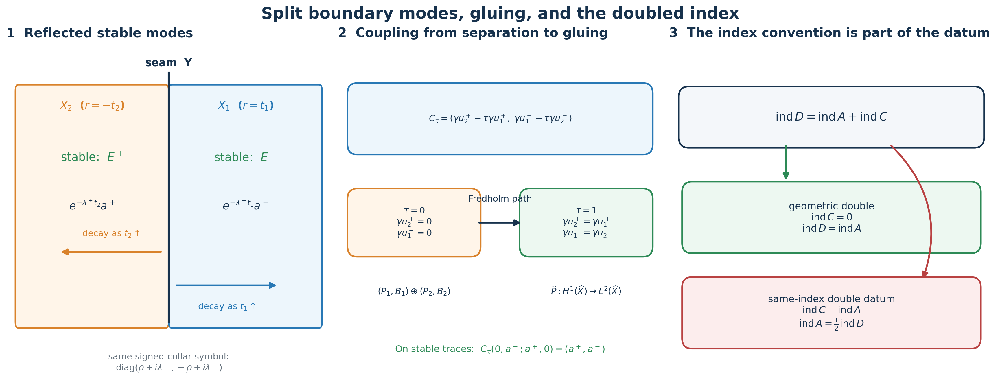

# Doubling a boundary problem and computing its index

A first-order elliptic boundary problem can be turned into an operator on a closed doubled manifold. The construction has three parts that must agree exactly: the reflected half must carry the complementary stable modes, the boundary coupling must stay elliptic while separate boundary conditions become matching traces, and the resulting mixed operator must be approximated in operator norm before its continuous symbol can compute the index.

This lesson proves all three parts. It also resolves a possible factor-of-two ambiguity: the geometric double built here has a zero-index complementary half, so its index equals the boundary index. A one-half formula belongs to a different doubled datum whose complementary half has the same index as the original problem.

The named prerequisites are [Stable modes and the algebra of boundary data](stable-boundary-models.md), [Fredholm boundary problems with first-order Calderón defects](generalized-collar-fredholm.md), Finite defects under perturbation, and [Symbols, finite defects, and the index on a closed manifold](global-elliptic-symbol-index.md). We use \(D_t=-i\partial_t\), inward collar coordinates, and Hermitian inner products linear in the first entry. Matrix factors retain their displayed order.

## 1. The split first-order model

Let \(X\) be compact with boundary \(Y\). Suppose

\[
 E|_Y=E^+\oplus E^-
 \tag{DI1}
\]

is orthogonal for a chosen Hermitian metric. Choose a product density
and product metric in a collar \(Y\times[0,\delta)_t\). Let
\(\phi\in C_c^\infty([0,\delta))\) be real, \(0\leq\phi\leq1\), and
\(\phi=1\) near \(t=0\). Take
\(\Lambda^\pm\in\Psi_{\mathrm{phg}}^1(Y;E^\pm)\) with positive scalar
real principal symbols \(\lambda^\pm(y,\eta)I_{E^\pm}\), and take an
interior operator \(\Lambda\in\Psi_{\mathrm{phg}}^1(X^\circ;E)\) whose
principal symbol \(\lambda(x,\xi)I_E\) is positive for every
\(\xi\ne0\). Extend \(\Lambda^\pm\) constantly in \(t\) where
\(\phi=1\), and put

\[
 \begin{aligned}
 P^bu&=\phi
 \begin{pmatrix}
  D_t+i\Lambda^+&0\\
  0&-D_t+i\Lambda^-
 \end{pmatrix}
 \binom{u^+}{u^-},\\
 P^iu&=i(1-\phi)\Lambda(1-\phi)u,\qquad
 P=P^b+P^i,\qquad Bu=\gamma_0u^-.
 \end{aligned}
 \tag{DI2}
\]

In the collar-transition region the principal symbol is

\[
 p(y,t,\eta,\tau)=
 \phi(t)
 \begin{pmatrix}
  \tau+i\lambda^+(y,\eta)&0\\
  0&-\tau+i\lambda^-(y,\eta)
 \end{pmatrix}
 +i(1-\phi(t))^2\lambda(y,t,\eta,\tau)I_E.
 \tag{DI3}
\]

If \(0<\phi<1\), the imaginary part of each diagonal scalar is
positive at every nonzero covector. Where \(\phi=1\), a nonzero
tangential covector gives a positive imaginary part and a nonzero pure
normal covector gives the real entries \(\pm\tau\). Where \(\phi=0\),
the last term is invertible. Thus \(P\) is elliptic.

Freeze at \((y,\eta)\in T^*Y\setminus0\). The two normal equations and
their solutions are

\[
 \begin{array}{lll}
 (D_t+i\lambda^+)v^+=0,
 &v^+(t)=e^{\lambda^+t}v^+(0),
 &v^+\text{ bounded}\Longleftrightarrow v^+(0)=0,\\[1mm]
 (-D_t+i\lambda^-)v^-=0,
 &v^-(t)=e^{-\lambda^-t}v^-(0),
 &v^-\text{ bounded for every }v^-(0).
 \end{array}
 \tag{DI4}
\]

Hence the stable Cauchy space is exactly \(E^-_y\), and the principal
boundary map \(v\mapsto v^-(0)\) is its identity. The generalized
interior and boundary symbols are elliptic. [Fredholm boundary problems with first-order Calderón defects](generalized-collar-fredholm.md) therefore makes

\[
 (P,B)_s:\bar H_s(X^\circ;E)\longrightarrow
 \bar H_{s-1}(X^\circ;E)\oplus H^{s-1/2}(Y;E^-)
 \tag{DI5}
\]

Fredholm for every real \(s\geq1\).

## 2. The boundary signs and the shifted kernel

For a compactly supported smooth scalar or vector function \(w\) in
the collar, integration by parts with the stated inner-product
convention gives the exact signs

\[
 \begin{aligned}
 2\operatorname{Im}(\phi D_tw,w)_X
   &=\|\gamma_0w\|_Y^2+\int_X\phi'(t)|w|^2,\\
 2\operatorname{Im}(-\phi D_tw,w)_X
   &=-\|\gamma_0w\|_Y^2-\int_X\phi'(t)|w|^2.
 \end{aligned}
 \tag{DI6}
\]

Indeed, the first difference from its complex conjugate is
\(-i\int\phi\partial_t|w|^2\), and the endpoint at \(t=0\) has the
displayed positive sign. The second identity is its negative.

The scalar positive principal symbols of \(\Lambda^\pm\) and
\(\Lambda\) give the matrix Gårding lower bounds for the real parts of
their quadratic forms. Derivatives of \(\phi\), nonsymmetric
lower-order terms, and the bounded collar patching terms contribute at
most \(C\|u\|_X^2\). Combining these facts with (DI6) gives

\[
 2\operatorname{Im}(Pu,u)_X
 \geq \|\gamma_0u^+\|_Y^2-
       \|\gamma_0u^-\|_Y^2-C\|u\|_X^2.
 \tag{DI7}
\]

For \(T>C/2\), set \(P_T=P+iT I_E\). If \(P_Tu=0\) and \(Bu=0\),
then

\[
 0=2\operatorname{Im}(P_Tu,u)_X
 \geq\|\gamma_0u^+\|_Y^2+(2T-C)\|u\|_X^2.
 \tag{DI8}
\]

Thus \(u=0\). Elliptic regularity from [Fredholm boundary problems with first-order Calderón defects](generalized-collar-fredholm.md) first makes every weak
kernel element smooth, so the calculation applies to the full kernel
of (DI5).

## 3. The adjoint boundary relation and the shifted cokernel

Take the base realization \(s=1\). A pair \((v,h)\) in the annihilator
of the range of \((P_T,B)_1\) is smooth by the dual regularity theorem
in [Fredholm boundary problems with first-order Calderón defects](generalized-collar-fredholm.md). The leading normal terms give Green's identity

\[
 (Pu,v)_X-(u,P^*v)_X
 =i(\gamma_0u^+,\gamma_0v^+)_Y
  -i(\gamma_0u^-,\gamma_0v^-)_Y.
 \tag{DI9}
\]

The annihilation equation is therefore

\[
 0=(u,(P^*-iT)v)_X
   +i(\gamma_0u^+,\gamma_0v^+)_Y
   -i(\gamma_0u^-,\gamma_0v^-)_Y
   +(\gamma_0u^-,h)_Y.
 \tag{DI10}
\]

Interior tests and arbitrary boundary traces give, with no change of
the conjugate-linear slot,

\[
 (P^*-iT)v=0,\qquad
 \gamma_0v^+=0,\qquad h=-i\gamma_0v^-.
 \tag{DI11}
\]

Put \(Q=-P^*\). Exchange the names of the two orthogonal summands:

\[
 E_Q^+=E^-,\qquad E_Q^-=E^+.
 \tag{DI12}
\]

The full differentiated-cutoff terms are computed below in (DA3)--(DA5).
The collar principal part of \(Q\), written in the order \(E_Q^+\oplus E_Q^-\), is

\[
 \begin{pmatrix}
  D_t+i(\Lambda^-)^*&0\\
 0&-D_t+i(\Lambda^+)^*
 \end{pmatrix},\qquad
 B_Qv=\gamma_0v^+=\gamma_0v_Q^-.
 \tag{DI13}
\]

Multiplying the first equation in (DI11) by \(-1\) gives
\((Q+iT)v=0\), while \(B_Qv=0\). The estimate (DI8), with the same
sufficiently large \(T\) after enlarging \(C\) once, gives \(v=0\),
and then \(h=0\). Thus \((P_T,B)_1\) is bijective. The path

\[
 (P+i rT I_E,B),\qquad 0\leq r\leq1,
 \tag{DI14}
\]

keeps both principal symbols fixed and stays Fredholm. Its index is
constant, so \(\operatorname{ind}(P,B)_1=0\). [Fredholm boundary problems with first-order Calderón defects](generalized-collar-fredholm.md) identifies the same
smooth kernel and adjoint obstruction spaces at every \(s\geq1\).
Consequently

\[
 \boxed{\operatorname{ind}(P,B)_s=0\quad(s\geq1).}
 \tag{DI15}
\]

### The full positivity remainder and adjoint coefficients

Here is a direct proof of the lower bounds used in (DI7), with
their actual lower-order operators retained. If \(A\) is any of
\(\Lambda^+\), \(\Lambda^-\), or the interior \(\Lambda\), its
principal symbol is \(\lambda_A I\), with \(\lambda_A>0\) off
the zero section. Quantize the degree-one-half symbol
\(\sqrt{\lambda_A}I\) to an operator \(R_A\). Use the full bundle
composition and adjoint formulas in [Symbols, operators and Sobolev
scales](euclidean-symbol-calculus.md) and [Detecting regularity
without choosing coordinates](geometric-microlocal-calculus.md).
Their principal product is exactly \(\lambda_A I\). Hence

\[
 H_A=\frac{A+A^*}{2}-R_A^*R_A\in\Psi^0,
 \qquad
 \operatorname{Re}(Aw,w)=\|R_Aw\|_2^2+(H_Aw,w),
 \qquad C_A=\|H_A\|_{L^2\to L^2}.
 \tag{DA1}
\]

The principal symbol comparison proves the order-zero claim;
the linked order-zero mapping theorem makes \(C_A\) finite. The
formula retains the entire lower-order operator \(H_A\), rather
than replacing \(A\) by its positive principal symbol. It gives
\(\operatorname{Re}(Aw,w)\geq-C_A\|w\|_2^2\).
For tangential families take the supremum of these constants on
the compact support of \(\phi\). Smooth family quantization and
the finite seminorm bounds give finite suprema. For the interior
operator the input \((1-\phi)u\) is supported away from the
boundary; insert cutoffs equal to one on that support and use
the same calculation on interior charts. All errors from these
cutoffs are included in \(H_\Lambda\).

At each fixed \(t\), the scalar \(\phi(t)\) commutes with the
tangential operators. It is nonnegative, so multiplying (DA1)
by it and integrating in \(t\) gives the tangential lower bound
without taking a square root of the cutoff. The exact interior
quadratic form is
\(\operatorname{Im}(i(1-\phi)\Lambda(1-\phi)u,u)
=\operatorname{Re}(\Lambda(1-\phi)u,(1-\phi)u)\).
Combining these statements with both full identities in (DI6)
proves (DI7) with the concrete choice

\[
 C_b=\max(C_{\Lambda^+},C_{\Lambda^-}),\qquad
 C_i=C_\Lambda,\qquad
 C_P=\|\phi'\|_\infty+2C_b+2C_i.
 \tag{DA2}
\]

No self-adjointness of \(A\) was assumed. Its geometric adjoint
has the same real quadratic form, so the same constants work for
\(\Lambda^*\) and \((\Lambda^\pm)^*\).

To compute \(Q=-P^*\), use the original product metric and
density. Multiplication by the real \(\phi\) is self-adjoint and
\(D_t\phi=\phi D_t-i\phi'\). The full collar adjoint, before
exchanging summands, is

\[
 (P^b)^*=
 \begin{pmatrix}
  \phi D_t-i\phi'-i\phi(\Lambda^+)^*&0\\
  0&-\phi D_t+i\phi'-i\phi(\Lambda^-)^*
 \end{pmatrix},\qquad
 (P^i)^*=-i(1-\phi)\Lambda^*(1-\phi).
 \tag{DA3}
\]

Tangential operators commute with \(\phi(t)\), including when
their coefficients depend on \(t\). Let \(S(v^+,v^-)=(v^-,v^+)\)
be the unitary change of order on the collar. In precisely the
order (DI12) the full operator is

\[
 \begin{aligned}
 SQ^bS^{-1}
 &=\phi\begin{pmatrix}
       D_t+i(\Lambda^-)^*&0\\
       0&-D_t+i(\Lambda^+)^*
      \end{pmatrix}
       +\begin{pmatrix}-i\phi'&0\\0&i\phi'\end{pmatrix},\\
 SQ^iS^{-1}&=i(1-\phi)S\Lambda^*S^{-1}(1-\phi),\\
 B_Qv&=\gamma_0v^+=\gamma_0(Sv)^-.
 \end{aligned}
 \tag{DA4}
\]

The second formula is a collar expression only; it does not
assert that the splitting or \(S\) extends over the whole
interior bundle. On the original bundle the full interior
operator is \(i(1-\phi)\Lambda^*(1-\phi)\). These descriptions
give the same quadratic form on their respective charts.
The displayed multiplication remainder contributes exactly

\[
 2\operatorname{Im}
   \left(\begin{pmatrix}-i\phi'&0\\0&i\phi'\end{pmatrix}
                       v_Q,v_Q\right)
   =-2\int\phi'|v_Q^+|^2+2\int\phi'|v_Q^-|^2.
 \tag{DA5}
\]

Its absolute value is at most
\(2\|\phi'\|_\infty\|v\|_2^2\). Therefore (DI7) holds for
\(Q\) with \(C_Q=C_P+2\|\phi'\|_\infty\), with its plus and
minus boundary spaces exactly as in (DI12). A single
\(T>\max(C_P,C_Q)/2\) supplies both estimates used in (DI8)
and (DI11). This proves the shifted bijectivity without
discarding either differentiated-cutoff term.

## 4. A surjective boundary constraint preserves the index

Let \(X_0,Y_0,Z_0\) be Hilbert spaces, let
\(A=(P,B):X_0\to Y_0\oplus Z_0\) be Fredholm, and suppose
\(B:X_0\to Z_0\) is surjective. Its restriction to
\((\ker B)^\perp\) is a bounded bijection onto \(Z_0\), so the Banach
inverse theorem supplies a bounded right inverse \(R:Z_0\to X_0\).
Set \(X_B=\ker B\). Define

\[
 \begin{aligned}
 J:X_B\oplus Z_0&\longrightarrow X_0,
 &J(x,z)&=x+Rz,\\
 J^{-1}u&=(u-RBu,Bu),\\
 S:Y_0\oplus Z_0&\longrightarrow Y_0\oplus Z_0,
 &S(y,z)&=(y-PRz,z).
 \end{aligned}
 \tag{DI16}
\]

Both \(J\) and \(S\) are bounded isomorphisms, and direct substitution
gives the exact triangular reduction

\[
 SAJ(x,z)=(Px,z),\qquad
 SAJ=(P|_{X_B})\oplus I_{Z_0}.
 \tag{DI17}
\]

It follows that \(P|_{X_B}:X_B\to Y_0\) is Fredholm and that its
kernel, cokernel, and index agree with those of \(A\):

\[
 \ker(P|_{X_B})=\ker A,\qquad
 \operatorname{coker}(P|_{X_B})\simeq\operatorname{coker}A,\qquad
 \operatorname{ind}(P|_{X_B})=\operatorname{ind}A.
 \tag{DI18}
\]

This also proves the cokernel isomorphism, rather than only an index count.

## 5. The reflected complementary half

Now let \(P_1:E_1\to F_1\) be any elliptic first-order mixed operator
on a copy \(X_1=X\) whose collar part, after a fixed collar
identification \(\kappa:F_1\simeq E_1\), is the split expression in
(DI2). Its compactly supported interior part need not be the positive
model used to prove (DI15). Give a second copy \(X_2=X\) the inward
coordinate \(t_2\geq0\), copy the split bundle \(E_2^+\oplus E_2^-\),
and set near its boundary

\[
 P_2^b=\phi
 \begin{pmatrix}
  -D_{t_2}+i\Lambda^+&0\\
  0&D_{t_2}+i\Lambda^-
 \end{pmatrix},\qquad
 B_2u_2=\gamma_0u_2^+.
 \tag{DI19}
\]

Complete \(P_2^b\) away from the boundary by the reflected version of
the positive interior term in (DI2): choose
\(\Lambda_2\in\Psi_{\mathrm{phg}}^1(X_2^\circ;E_2)\) with positive
scalar principal symbol and set
\(P_2^i=i(1-\phi)\Lambda_2(1-\phi)\), \(P_2=P_2^b+P_2^i\).
Its frozen solutions are

\[
 u_2^+(t_2)=e^{-\lambda^+t_2}u_2^+(0),\qquad
 u_2^-(t_2)=e^{\lambda^-t_2}u_2^-(0).
 \tag{DI20}
\]

Thus its stable trace is exactly \(E^+\), and \(B_2\) is the identity
there. After ordering the summands as \(E_2^-\oplus E_2^+\), this is
the model of Section 1. Hence

\[
 \operatorname{ind}(P_2,B_2)=0.
 \tag{DI21}
\]

## 6. Smooth gluing of the doubled bundles and operator

Glue \(X_1\) and \(X_2\) along \(Y\). In the resulting two-sided collar
use the signed coordinate

\[
 r=t_1\quad\hbox{on }X_1,\qquad
 r=-t_2\quad\hbox{on }X_2.
 \tag{DI22}
\]

Glue \(E_1\) to \(E_2\) by the identity on \(E^+\oplus E^-\), producing
\(\widehat E\). Glue \(F_1\) to the target \(E_2\) by the collar
identification \(\kappa\), producing \(\widehat F\). Since
\(D_{t_2}=-D_r\), both collar formulas become

\[
 \widehat P^b=
 \begin{pmatrix}
  D_r+i\Lambda^+&0\\
 0&-D_r+i\Lambda^-
 \end{pmatrix}
 \tag{DI23}
\]

on a full two-sided neighborhood of the seam. The interior terms
vanish on that neighborhood because \(1-\phi=0\) there. Thus all
coefficient jets and the bundle maps match, and the piecewise operator
defines

\[
 \widehat P:H^s(\widehat X;\widehat E)
       \longrightarrow H^{s-1}(\widehat X;\widehat F).
 \tag{DI24}
\]

This is a smooth mixed collar operator. It need not be an ordinary
global pseudodifferential operator, because \(\Lambda^\pm\) act only in
the tangential variables near the seam. This proves both the construction and the distinction between a mixed collar operator and an ordinary global pseudodifferential operator.

## 7. The coupling path and the \(H^1\) gluing domain

At the base level put

\[
 \begin{aligned}
 \mathcal X&=\bar H_1(X_1;E_1)\oplus\bar H_1(X_2;E_2),\\
 \mathcal Y&=L^2(X_1;F_1)\oplus L^2(X_2;E_2),\\
 \mathcal Z&=H^{1/2}(Y;E^+)\oplus H^{1/2}(Y;E^-),\\
 C_\tau(u_1,u_2)&=
 \bigl(\gamma_0u_2^+-\tau\gamma_0u_1^+,
       \gamma_0u_1^--\tau\gamma_0u_2^-\bigr),
       \qquad0\leq\tau\leq1,\\
 \mathcal A_\tau&=(P_1\oplus P_2,C_\tau):
              \mathcal X\longrightarrow\mathcal Y\oplus\mathcal Z.
 \end{aligned}
 \tag{DI25}
\]

The stable traces of \(P_1\oplus P_2\) have the form
\((0,a^-;a^+,0)\). On them,

\[
 C_\tau(0,a^-;a^+,0)=(a^+,a^-),
 \tag{DI26}
\]

independently of \(\tau\). The principal boundary map is therefore an
isomorphism for every parameter. The generalized Fredholm theorem and
homotopy stability give

\[
 \operatorname{ind}\mathcal A_\tau
       =\operatorname{ind}\mathcal A_0
       \qquad(0\leq\tau\leq1).
 \tag{DI27}
\]

The coupling map itself is surjective. For data \((a^+,b^-)\), choose
fixed Sobolev trace extensions with

\[
 \gamma_0u_2^+=a^+,\quad \gamma_0u_1^-=b^-,\quad
 \gamma_0u_1^+=0,\quad \gamma_0u_2^-=0.
 \tag{DI28}
\]

This gives one bounded right inverse \(R:\mathcal Z\to\mathcal X\)
for every \(C_\tau\). Apply (DI18):

\[
 \operatorname{ind}\bigl((P_1\oplus P_2)|_{\ker C_\tau}\bigr)
       =\operatorname{ind}\mathcal A_\tau.
 \tag{DI29}
\]

At \(\tau=0\), the two constraints are
\(\gamma_0u_2^+=0\) and \(\gamma_0u_1^-=0\). After a fixed permutation of
the target factors, the constrained operator is the direct sum of
\(P_1|_{\ker B_1}\) and \(P_2|_{\ker B_2}\). Equation (DI18) identifies
their indices with those of \((P_1,B_1)\) and \((P_2,B_2)\).
Equations (DI21), (DI27), and (DI29) give

\[
 \operatorname{ind}\bigl((P_1\oplus P_2)|_{\ker C_1}\bigr)
 =\operatorname{ind}(P_1,B_1).
 \tag{DI30}
\]

The varying kernels can also be trivialized explicitly. Put

\[
 K(u_1,u_2)=(\gamma_0u_1^+,\gamma_0u_2^-),\qquad
 C_\tau=C_0-\tau K,\qquad KR=0,\qquad C_0R=I_{\mathcal Z}.
 \tag{DI31}
\]

For \(x\in\ker C_0\), define

\[
 J_\tau x=x+\tau RKx.
 \tag{DI32}
\]

Then \(C_\tau J_\tau x=0\). Its inverse on \(\ker C_\tau\) is
\(y\mapsto y-RC_0y\), because \(C_0y=\tau Ky\) and \(KR=0\). Hence
\(J_\tau:\ker C_0\to\ker C_\tau\) is a continuous family of bounded
isomorphisms. This makes the Fredholm deformation in (DI30) an actual
fixed-domain path, not merely an index comparison between unnamed
spaces.

At \(\tau=1\), the constraint is equality of the two full boundary
traces. The exact \(H^1\) gluing identity is

\[
 H^1(\widehat X;\widehat E)
 \simeq\{(u_1,u_2)\in\mathcal X:
        \gamma_0u_1^+=\gamma_0u_2^+,
        \ \gamma_0u_1^-=\gamma_0u_2^-\}
 =\ker C_1.
 \tag{DI33}
\]

One direction follows by restriction. Conversely, the distributional
first derivative of a piecewise \(H^1\) section has a seam delta whose
coefficient is its trace jump; equality of traces removes that delta,
leaving every weak first derivative in \(L^2\). Under (DI33), the
constrained piecewise operator is exactly (DI24). Thus

\[
 \boxed{\operatorname{ind}\widehat P
       =\operatorname{ind}(P_1,B_1)}
 \tag{DI34}
\]

at \(H^1\to L^2\). The statement at this step is deliberately made at
\(s=1\): equality of value traces alone is not the complete gluing
condition for arbitrary higher Sobolev order.

The left panel keeps both inward coordinates and the signed collar coordinate visible. The middle panel shows why the boundary symbol stays invertible throughout the coupling. The right panel records the complementary index that distinguishes equality from a one-half formula.

### The complete seam distribution

We verify the asserted gluing in the actual product collar.
Use its signed coordinate \(r=t_1=-t_2\), product density
\(d\mu_Y\,dr\), and the domain-bundle identification from
Section 6. In any product frame, write

\[
 u(y,r)=\begin{cases}
             u_1(y,r),&r>0,\\
             u_2(y,-r),&r<0,
          \end{cases}
 \qquad j(y)=\gamma_0u_1(y)-\gamma_0u_2(y).
 \tag{DG1}
\]

Let \(H\) be the Heaviside function; its value at zero does not
affect the distribution. Integration by parts on each half,
with the common boundary measure, gives every first derivative:

\[
 \begin{aligned}
 D_ru&=H(r)D_{t_1}u_1(y,r)
        -H(-r)D_{t_2}u_2(y,-r)-i j(y)\delta(r),\\
 D_{y_a}u&=H(r)D_{y_a}u_1(y,r)
               +H(-r)D_{y_a}u_2(y,-r),
       \qquad 1\leq a\leq\dim Y.
 \end{aligned}
 \tag{DG2}
\]

For smooth half-sections this follows directly from
\(\partial_rH(r)=\delta(r)\) and
\(\partial_rH(-r)=-\delta(r)\). For half-sections in \(H^1\),
approximate on each half by smooth sections. The continuous
\(H^1\to H^{1/2}\) trace map from [Mixed symbols on every real
two-parameter Sobolev scale](mixed-sobolev-mapping.md) makes the seam
coefficients converge, while the half-space functions and weak
derivatives converge in \(L^2\). Pairing with each compactly
supported smooth test section passes the identities to the
limit. Thus no differentiability of the traces is assumed.

All bulk terms in (DG2) are in \(L^2\). If \(j=0\), every weak
first derivative is in \(L^2\), proving the converse in (DI33).
If \(j\ne0\), choose a smooth compactly supported tangential
test section \(b\) with \(\langle j,b\rangle\ne0\). Such a test
exists because a nonzero distribution cannot vanish on every
test section. Choose \(h\in C_c^\infty(\mathbb R)\) with
\(h(0)=1\), and put \(h_\varepsilon(r)=h(r/\varepsilon)\).
Then

\[
 \begin{aligned}
 \langle j\delta(r),b(y)h_\varepsilon(r)\rangle
     &=\langle j,b\rangle,\\
 \|b(y)h_\varepsilon(r)\|_{L^2(d\mu_Y\,dr)}
     &=\varepsilon^{1/2}\|b\|_{L^2(d\mu_Y)}\|h\|_{L^2(dr)}.
 \end{aligned}
 \tag{DG3}
\]

An \(L^2\) distribution has pairings bounded by its \(L^2\)
norm times the second line, which tends to zero. The first
line is a fixed nonzero number. Therefore the seam delta is
not in \(L^2\). In (DG2) it cannot cancel an \(L^2\) bulk
term. This proves necessity of trace equality as well.

The restriction map and the piecewise inverse are bounded for
the finite-chart \(H^1\) norms: (DG2) with zero jump bounds
every coordinate first derivative by the two half-norms, and
restriction bounds each half-norm by the global norm. Smooth
transition matrices contribute their actual bounded first
derivatives; the fixed product metric and density compare
these finitely many chart norms. This proves the bounded
isomorphism (DI33), including its full domain. It makes no
claim that matching values alone glues higher Sobolev orders,
which would require the corresponding normal-jet conditions.

## 8. Approximation by ordinary operators and the symbol index

In the signed collar let \((\eta,\rho)\) be the covariables dual to
\((y,r)\). The principal symbol of (DI23), extended by the ordinary
interior symbols, is continuous and degree one on
\(T^*\widehat X\setminus0\). At \(\eta=0\), positive homogeneity gives
\(\lambda^\pm(y,0)=0\), so its two collar blocks equal \(\rho\) and
\(-\rho\). Thus it is still invertible there. Denote this continuous
elliptic symbol by

\[
 \widehat p:T^*\widehat X\setminus0
       \longrightarrow
       \operatorname{Hom}(\pi^*\widehat E,\pi^*\widehat F).
 \tag{DI35}
\]

We now verify the operator-norm approximation required by [Symbols, finite defects, and the index on a closed manifold](global-elliptic-symbol-index.md) rather
than inferring it from pointwise smoothing. Choose the scalar cutoff
from [Symbols, finite defects, and the index on a closed manifold](global-elliptic-symbol-index.md), Section 10,

\[
 \chi(\eta,\rho)=1\ \text{if }|\rho|\leq\max(1,|\eta|),
 \qquad
 \chi(\eta,\rho)=0\ \text{if }|\rho|\geq2\max(1,|\eta|),
 \tag{DI36}
\]

and for \(0<\varepsilon\leq1\) replace every partial tangential symbol
\(a(y,r,\eta)\) of order one by

\[
 a_\varepsilon(y,r,\eta,\rho)
       =a(y,r,\eta)\chi(\eta,\varepsilon\rho).
 \tag{DI37}
\]

For fixed \(\varepsilon>0\), this is a classical full-variable symbol.
On the total unit cosphere its leading term differs from the continuous
zero extension of the partial leading symbol only where
\(|\eta|\leq2\varepsilon|\rho|\). Since that leading term has size at
most \(C|\eta|\),

\[
 \sup_{|\eta|^2+\rho^2=1}
 \|a_{\varepsilon,1}-a_1\|\leq C\varepsilon.
 \tag{DI38}
\]

The exact partial-operator estimate in Section 10 of [Symbols, finite defects, and the index on a closed manifold](global-elliptic-symbol-index.md) gives, for every real
\(s\),

\[
 \|\operatorname{Op}(a_\varepsilon)-a(y,r,D_y)\|
       _{H^s\to H^{s-1}}\leq C_s\varepsilon.
 \tag{DI39}
\]

Apply this construction in a finite signed-collar atlas. Keep \(D_r\)
and every ordinary interior operator unchanged, and patch with the
same fixed bundle charts and cutoffs. The compactness of \(\widehat X\)
turns the local estimates into ordinary classical operators
\(\widehat P_\varepsilon\) satisfying

\[
 \widehat P_\varepsilon\longrightarrow\widehat P
 \quad\text{in }\mathcal L(H^s,H^{s-1})
 \text{ for every real }s,\qquad
 \widehat p_\varepsilon\longrightarrow\widehat p
 \text{ uniformly on }S^*\widehat X.
 \tag{DI40}
\]

Uniform invertibility of \(\widehat p\) on the compact cosphere makes
\(\widehat p_\varepsilon\) elliptic for all sufficiently small
\(\varepsilon\). The norm-limit theorem and its continuous-symbol
identity, proved in Sections 5 and 8 of that lesson, now give

\[
 \operatorname{ind}\widehat P
       =\operatorname{sind}(\widehat p).
 \tag{DI41}
\]

Because (DI40) is compatible at every Sobolev order, the compatible
norm-limit conclusion in that lesson identifies the same smooth kernel
and adjoint obstruction spaces at all levels. Hence
(DI34) and (DI41) hold for every \(s\geq1\):

\[
 \boxed{\operatorname{ind}(P_1,B_1)_s
       =\operatorname{ind}(\widehat P:H^s\to H^{s-1})
       =\operatorname{sind}(\widehat p).}
 \tag{DI42}
\]

This proves the doubled symbol-index formula with the precise approximation hypotheses.

## 9. The two exact kinds of doubled index datum

Two published index wordings become exact once the complementary half is made part of the datum.
Let \(A:X_A\to Y_A\) be Fredholm. A *deformation double datum* for
\(A\) is a Fredholm operator \(D:X_D\to Y_D\), a Fredholm complement
\(C:X_C\to Y_C\), fixed domain and target isomorphisms at the two
endpoints, and a continuous fixed-space Fredholm path joining \(D\) to
\(A\oplus C\). Homotopy invariance and direct-sum additivity give the
exact morphism from this space of data to the integers:

\[
 \mathfrak I(D,C)=\operatorname{ind}D
 =\operatorname{ind}A+\operatorname{ind}C.
 \tag{DI43}
\]

There are two mathematically different strata:

\[
 \begin{array}{lll}
 \mathfrak D_0(A)=\{(D,C):\operatorname{ind}C=0\}
 &\Longrightarrow&\operatorname{ind}D=\operatorname{ind}A,\\[1mm]
 \mathfrak D_{=}(A)=\{(D,C):\operatorname{ind}C=\operatorname{ind}A\}
 &\Longrightarrow&\operatorname{ind}D=2\operatorname{ind}A.
 \end{array}
 \tag{DI44}
\]

Equations (DI31)–(DI34) supply all the data for the geometric double:
the fixed-domain path is
\((P_1\oplus P_2)J_\tau\), its endpoint complement is
\((P_2,B_2)\), and (DI21) gives its index zero. Therefore the concrete
operator \(\widehat P\) belongs to \(\mathfrak D_0(P_1,B_1)\), and its
formula is the equality in (DI42).

A one-half formula is valid only after a separately specified double
datum is proved to lie in \(\mathfrak D_{=}(A)\):

\[
 \operatorname{ind}A=\frac12\operatorname{ind}D
 \quad\Longleftrightarrow\quad
 \operatorname{ind}C=\operatorname{ind}A
 \quad\text{within a deformation double datum.}
 \tag{DI45}
\]

Thus the introductory one-half wording cannot be applied to the
operator \(\widehat P\) constructed here. The zero-index complementary half proved in (DI21) gives equality. A summary using one half
must name and prove a different same-index complement and its
deformation data. Without that information the one-half statement is
underdetermined; it is not a replacement for (DI42). This is the exact conceptual correction. It keeps the equality theorem and the conditional one-half formula attached to their respective doubled constructions.

## 10. Scalar sign check

For \(E^+=E^-=\mathbb C\) and
\(\Lambda^+=\Lambda^-=|D_y|\), the first-half stable mode is
\((0,e^{-|\eta|t_1}a^-)\), while the second-half stable mode is
\((e^{-|\eta|t_2}a^+,0)\). The coupling gives

\[
 C_\tau(0,e^{-|\eta|t_1}a^-;
        e^{-|\eta|t_2}a^+,0)=(a^+,a^-).
 \tag{DI46}
\]

In the signed coordinate, both halves have symbol
\(\operatorname{diag}(\rho+i|\eta|,-\rho+i|\eta|)\). This checks the
reflection sign, the stable summands, the order of the coupling
components, and the seam compatibility in one calculation.

## 11. Three concrete models

### A finite-dimensional boundary constraint

Take \(X_0=\mathbb C^3\), \(Y_0=\mathbb C^2\), \(Z_0=\mathbb C\), and

\[
 P(x_1,x_2,x_3)=(x_1,x_2+x_3),\qquad B(x_1,x_2,x_3)=x_3.
 \tag{DI47}
\]

The combined map \((P,B)\) is invertible. On \(\ker B\), the restricted
map is \((x_1,x_2,0)\mapsto(x_1,x_2)\), also invertible. The right
inverse \(Rz=(0,0,z)\) makes (DI16)–(DI17) an ordinary triangular
matrix factorization. This finite model displays the exact cokernel
isomorphism used for Sobolev boundary spaces.

### Why matching values is the right \(H^1\) condition

Let \(u_1\in H^1([0,1])\) and \(u_2\in H^1([-1,0])\), and join them as
a piecewise function \(u\). For every compactly supported smooth test
function \(\varphi\), integration by parts on the two halves gives

\[
 \langle \partial_ru,\varphi\rangle
 =\int_{-1}^0u_2'\varphi\,dr+\int_0^1u_1'\varphi\,dr
  +(u_1(0)-u_2(0))\varphi(0).
 \tag{DI48}
\]

The distributional derivative lies in \(L^2\) exactly when the trace
jump vanishes. This is the one-dimensional form of (DI33). Higher
Sobolev gluing needs further matching derivatives, which is why the
index identification is first made at \(H^1\to L^2\).

### The angular cap estimate

For the scalar partial symbol \(a(\eta)=|\eta|\), the leading-symbol
difference in (DI37) is supported where
\(|\eta|\leq2\varepsilon|\rho|\). On
\(|\eta|^2+\rho^2=1\),

\[
 |a_{\varepsilon,1}-a_1|\leq|\eta|\leq2\varepsilon.
 \tag{DI49}
\]

This is the exact small factor that turns the tangential operator into
an operator-norm limit of ordinary full-variable pseudodifferential
operators.

## 12. Exercises with complete solutions

**1. Recover the two endpoint signs.** Starting from
\(D_t=-i\partial_t\), prove (DI6) without assuming that \(w\) is
scalar.

**Solution.** The fiber metric gives
\(\partial_t|w|^2=(\partial_tw,w)+(w,\partial_tw)\). Hence

\[
 \begin{aligned}
 2i\operatorname{Im}(\phi D_tw,w)
 &=-i\int_0^\infty\phi\,\partial_t|w|^2dt\\
 &=i|w(0)|^2+i\int_0^\infty\phi'|w|^2dt.
 \end{aligned}
 \tag{DI50}
\]

Divide by \(i\). Replacing \(D_t\) by \(-D_t\) reverses both terms. The
calculation is component-free, so it holds for bundle-valued \(w\).

**2. Check the cokernel multiplier.** In (DI10), use arbitrary minus
traces to recover the exact formula for \(h\).

**Solution.** For \(a=\gamma_0u^-\), the minus terms are
\(-i(a,\gamma_0v^-)+(a,h)\). Since the inner product is linear in the
first entry,
\((a,i\gamma_0v^-)=-i(a,\gamma_0v^-)\). Vanishing for every \(a\)
gives

\[
 h+i\gamma_0v^-=0,\qquad h=-i\gamma_0v^-.
 \tag{DI51}
\]

**3. Verify the triangular reduction.** Prove directly that the maps
\(J\) and \(S\) in (DI16) are invertible and calculate \(SAJ\).

**Solution.** Because \(BR=I\), \(u-RBu\in\ker B\), so the displayed
formula for \(J^{-1}\) is defined. Direct substitution gives
\(J^{-1}J(x,z)=(x,z)\) and \(JJ^{-1}u=u\). The inverse of \(S\) is
\(S^{-1}(y,z)=(y+PRz,z)\). Finally,

\[
 SAJ(x,z)=S(Px+PRz,z)=(Px,z).
 \tag{DI52}
\]

**4. Trivialize the coupling kernels.** Prove that \(J_\tau\) in
(DI32) maps \(\ker C_0\) bijectively onto \(\ker C_\tau\).

**Solution.** For \(x\in\ker C_0\), use
\(C_\tau=C_0-\tau K\), \(C_0R=I\), and \(KR=0\):

\[
 C_\tau(x+\tau RKx)=0+\tau Kx-\tau Kx-\tau^2KRKx=0.
 \tag{DI53}
\]

If \(y\in\ker C_\tau\), then \(C_0y=\tau Ky\). Put
\(x=y-RC_0y\). This lies in \(\ker C_0\), \(Kx=Ky\), and
\(x+\tau RKx=y\). Thus \(y\mapsto y-RC_0y\) is the inverse.

**5. Test the two index strata.** Let \(\operatorname{ind}A=-3\).
Compute the doubled index for a zero-index complement and for a
same-index complement.

**Solution.** Equation (DI43) gives

\[
 \operatorname{ind}D=
 \begin{cases}
 -3,&\operatorname{ind}C=0,\\
 -6,&\operatorname{ind}C=-3.
 \end{cases}
 \tag{DI54}
\]

The first construction gives equality. The second gives
\(\operatorname{ind}A=\frac12\operatorname{ind}D=-3\). Moving the
factor \(1/2\) between these two data would give the wrong integer.

**6. Why must the approximation be in operator norm?** Explain why
pointwise convergence of the full symbols in (DI37) would not by itself
prove the index identity.

**Solution.** Fredholm index stability applies to bounded operators in
their operator-norm topology. Pointwise symbol convergence gives no
uniform control on the maps between Sobolev spaces and does not exclude
a loss concentrated in a shrinking angular cap. The partial-operator
estimate supplies the needed bound:

\[
 \|\widehat P_\varepsilon-\widehat P\|_{H^s\to H^{s-1}}
 \leq C_s\varepsilon.
 \tag{DI55}
\]

Together with uniform principal-symbol convergence and ellipticity,
this is exactly the hypothesis of the norm-limit index theorem.

## 13. Reading notes and references

Equations (DI43)–(DI45) identify the missing datum and give
the exact correction for the actual chosen complementary half.

[Stable modes and the algebra of boundary
data](stable-boundary-models.md) proves the stable-space algebra used in
Sections 1 and 5. [Fredholm boundary problems with first-order Calderón
defects](generalized-collar-fredholm.md) supplies the generalized
Fredholm and regularity theorem. [Symbols, finite defects, and the index
on a closed manifold](global-elliptic-symbol-index.md) proves the
partial-operator approximation and continuous symbol-index theorem used
in Section 8.

The arguments, examples, figure, and exercises in this lesson are independently written.

Written and dedicated to the public domain by Codex under CC0 1.0.
