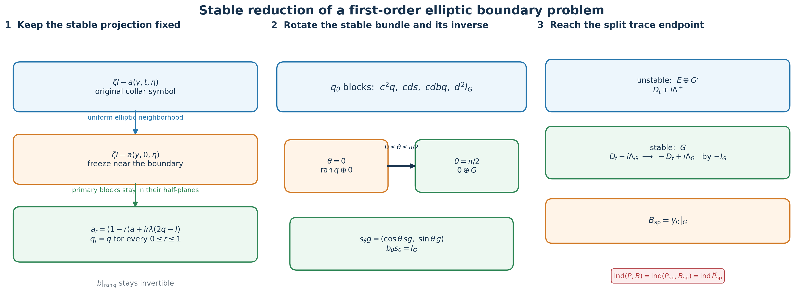
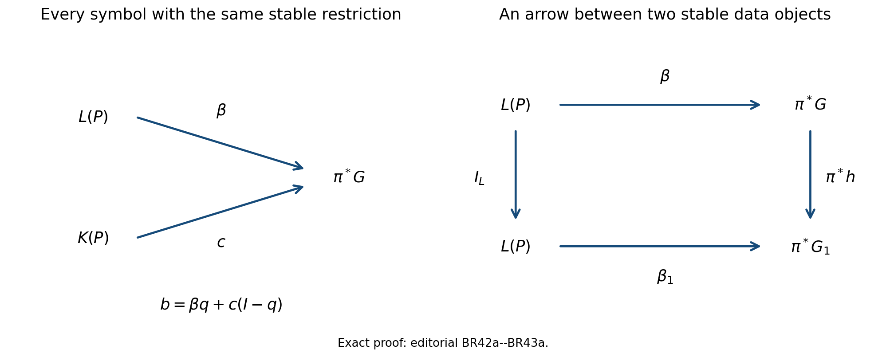
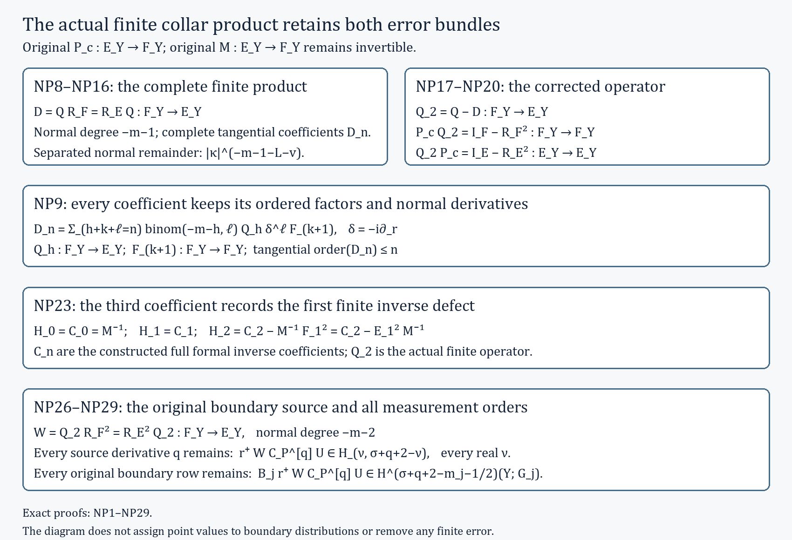

# Reducing first-order boundary data to a split trace

The index of a first-order elliptic boundary problem can be computed after a sequence of explicit deformations. Each deformation has to preserve two structures at once: the interior symbol must remain invertible, and the boundary symbol must remain an isomorphism on the decaying Cauchy data. This lesson constructs the whole sequence. It normalizes the normal coefficient, freezes the collar symbol, collapses all spectral rates while keeping the Calderón projection fixed, rotates the boundary isomorphism after a zero-index stabilization, and reaches the split trace model used by doubling.

The formulas keep every bundle map and every matrix factor in its typed order. In particular, the inverse of the boundary symbol is defined only on the stable bundle, the two off-diagonal blocks of the rotation have different source and target bundles, and a quantized projection is never treated as an exact operator projection.

The named prerequisites are [Stable modes and the algebra of boundary data](stable-boundary-models.md), [Cauchy data from jumps and residues](calderon-cauchy-data.md), [Fredholm boundary problems with first-order Calderón defects](generalized-collar-fredholm.md), Finite defects under perturbation, [Symbols, finite defects, and the index on a closed manifold](global-elliptic-symbol-index.md), [The Bott operator, suspension, and reduction of the index to Euclidean space](bott-suspension.md), and [Doubling a boundary problem and computing its index](split-doubling-boundary-index.md). We use \(D_t=-i\partial_t\), an inward collar coordinate \(t\geq0\), and complex bundles.

## 1. The starting problem and the reduction theorem

Let \(X\) be a compact smooth manifold with boundary \(Y\). Let \(E,F\to X\) and \(G\to Y\) be smooth complex bundles. Consider a first-order elliptic operator and an order-zero boundary operator

\[
 (P,B)_1:H^1(X;E)\longrightarrow
 L^2(X;F)\oplus H^{1/2}(Y;G),
 \qquad B=\mathcal B\gamma_0 .
 \tag{BR1}
\]

Here \(\mathcal B\in\Psi_{\mathrm{phg}}^0(Y;E|_Y,G)\). Write \(p\) for the principal symbol of \(P\). Ellipticity at a nonzero conormal makes

\[
 c(y,t)=p(y,t,0,dt):E_{(y,t)}\longrightarrow F_{(y,t)}
 \quad\text{invertible on a sufficiently small collar.}
 \tag{BR2}
\]

After using \(c\) to identify the target with the source in that collar, the boundary principal symbol has the form

\[
 \widetilde p(y,0,\eta,\zeta)=\zeta I_E-a(y,\eta),\qquad
 q(y,\eta)=\frac{1}{2\pi i}\int_{\Gamma_+}
 (zI_E-a(y,\eta))^{-1}\,dz .
 \tag{BR3}
\]

The contour surrounds the spectrum of \(a(y,\eta)\) in the upper half-plane. The stable Cauchy bundle is \(L=\operatorname{ran}q\) over \(T^*Y\setminus0\). If \(b=\sigma_0(\mathcal B)\), the complementing condition is precisely that
\(b|_L:L\to\pi^*G\) be a bundle isomorphism.

**Stable reduction theorem.** There is a bundle \(H\to X\), a zero-index auxiliary first-order problem on \(H\), and a continuous Fredholm deformation of the stabilized problem to a split bundle-trace problem. If \((P_{\mathrm{sp}},B_{\mathrm{sp}})\) is the endpoint and \(\widehat P_{\mathrm{sp}}\) is its geometric double, then

\[
 \boxed{
 \operatorname{ind}(P,B)
 =\operatorname{ind}(P_{\mathrm{sp}},B_{\mathrm{sp}})
 =\operatorname{ind}\widehat P_{\mathrm{sp}}
 =\operatorname{sind}(\widehat p_{\mathrm{sp}}).}
 \tag{BR4}
\]

The theorem assumes that the original complementing operator \(B\) exists. Section 10 records the exact symbol-bundle obstruction exposed when no such \(B\) exists.

## 2. Normal coefficient normalization and collar freezing

Choose a collar \(Y\times[0,\delta)_t\). The isomorphism
\(c^{-1}:F|_{Y\times[0,\delta)}\to E|_{Y\times[0,\delta)}\)
is used as a collar frame for the target. This is a change of bundle
coordinates, so it does not alter the operator, its domain, its kernel, or
its cokernel. In this target frame the collar operator can be written

\[
 P^b=D_t-A(t)+R_0(t),
 \qquad
 \sigma_1(P^b)(y,t,\eta,\zeta)=\zeta I_E-a(y,t,\eta),
 \tag{BR5}
\]

where \(A(t)\) is tangential of order one and \(R_0(t)\) has order zero. No factor of the original normal coefficient has been discarded: it remains the target identification \(c\). Every normalized symbol deformation below is transported back to \(F\) by left multiplication with \(c\), so the global target bundle stays fixed.

Let \(\chi\in C_c^\infty([0,\delta))\), with \(\chi=1\) for
\(0\leq t\leq\delta/3\) and \(\chi=0\) for \(t\geq2\delta/3\).
For \(0\leq r\leq1\), define

\[
 a_r(y,t,\eta)
 =a(y,t,\eta)+r\chi(t)\bigl(a(y,0,\eta)-a(y,t,\eta)\bigr).
 \tag{BR6}
\]

This is a deformation of the full original principal symbol, not a replacement by a rescaled symbol. To prove ellipticity, restrict to the compact collar cosphere
\(|\eta|^2+\zeta^2=1\). Since the original symbol is invertible there, there is \(M<\infty\) such that

\[
 \sup\|(\zeta I_E-a(y,t,\eta))^{-1}\|\leq M .
 \tag{BR7}
\]

Uniform continuity gives, after decreasing \(\delta\),

\[
 \|r\chi(t)(a(y,0,\eta)-a(y,t,\eta))\|
 <\frac{1}{2M}
 \quad\text{on the collar cosphere.}
 \tag{BR8}
\]

Factor the deformed symbol on the right of the original inverse:

\[
 \zeta I_E-a_r
 =(\zeta I_E-a)
 \left[I_E-(\zeta I_E-a)^{-1}
 r\chi(t)(a(y,0,\eta)-a(y,t,\eta))\right].
 \tag{BR9}
\]

The bracket is invertible by its Neumann series. Thus every \(a_r\) is elliptic. At \(t=0\), the symbol is always \(a(y,0,\eta)\), so the stable bundle and \(b|_L\) do not change. Transporting this principal deformation back by \(c\), and interpolating the lower-order terms, gives an operator-norm continuous Fredholm path on the original source and target bundles. At \(r=1\), the tangential operator is independent of \(t\) on the smaller collar. All cutoff-transition terms are supported where \(t\geq\delta/3\).

## 3. The smooth stable projection and the fixed-projection collapse

For a fixed \((y_0,\eta_0)\), choose a contour \(\Gamma_+\) that separates the upper and lower spectra of \(a(y_0,\eta_0)\). Invertibility on this compact contour persists in a parameter neighborhood. Differentiating the resolvent gives

\[
 \partial_\nu(zI-a)^{-1}
 =(zI-a)^{-1}(\partial_\nu a)(zI-a)^{-1}.
 \tag{BR10}
\]

Repeated differentiation under the contour integral proves that \(q\) is smooth without choosing eigenvalue branches. Two local contours give the same projection on their overlap because both enclose exactly the upper spectrum. Positive homogeneity follows by scaling both the symbol and the contour:

\[
 q(y,\rho\eta)
 =\frac{1}{2\pi i}\int_{\rho\Gamma_+}
 (zI-\rho a(y,\eta))^{-1}\,dz
 =q(y,\eta),\qquad \rho>0 .
 \tag{BR11}
\]

Choose \(Q\in\Psi_{\mathrm{phg}}^0(Y;E|_Y)\) with principal symbol \(q\), and choose
\(\Lambda\in\Psi_{\mathrm{phg}}^1(Y;E|_Y)\) with positive scalar principal symbol \(\lambda(y,\eta)I_E\). The operator \(Q\) need not satisfy \(Q^2=Q\); only its principal symbol enters the following ellipticity calculation.

At the symbol level define, for \(0\leq r\leq1\),

\[
 a^{\langle r\rangle}
 =(1-r)a+i r\lambda(2q-I_E).
 \tag{BR12}
\]

The contour formula makes \(q\) a holomorphic function of \(a\), so \(aq=qa\). On the primary summand for an eigenvalue \(\xi\), with nilpotent part \(N_\xi\), the restriction of (BR12) is

\[
 \left((1-r)\xi+i r\lambda\,
 \operatorname{sgn}(\operatorname{Im}\xi)\right)I
 +(1-r)N_\xi .
 \tag{BR13}
\]

Its only eigenvalue stays strictly in the same half-plane as \(\xi\). Therefore every \(a^{\langle r\rangle}\) has no real eigenvalue, and its upper spectral projection is exactly \(q\). This primary-block calculation is the needed proof; convexity of spectra of arbitrary nonnormal matrices would not suffice.

Let \(\phi(t)=1\) on a smaller collar and have support inside the region where \(A(t)=A(0)\). Quantize the deformation by

\[
 A_r=(1-r\phi)A
 +r\phi\bigl(i\Lambda Q-i\Lambda(I_E-Q)\bigr).
 \tag{BR14}
\]

Its principal tangential symbol is (BR12) with \(r\) replaced by \(r\phi(t)\). Hence \(D_t-A_r\) remains elliptic, its stable projection at the boundary remains \(q\), and the original \(\mathcal B\) remains complementing throughout. The exact order \(\Lambda Q\) and \(\Lambda(I_E-Q)\) has been retained.

## 4. Replacing the interior partial operators

In the annulus where a collar cutoff varies, a tangential operator acts in \(y\) while \(t\) is only a parameter. This is a partial pseudodifferential operator. Its support stays away from \(Y\), so it can be approximated by ordinary operators without changing any boundary symbol.

For a tangential order-one symbol \(k(y,t,\eta)\), let
\(\omega(\eta,\varepsilon\zeta)\) be the angular cutoff from the partial-operator approximation theorem, and set

\[
 k_\varepsilon(y,t,\eta,\zeta)
 =k(y,t,\eta)\omega(\eta,\varepsilon\zeta).
 \tag{BR15}
\]

After multiplying on both sides by the fixed annular cutoff, \(K_\varepsilon\) is an ordinary full-variable operator and, for every real \(s\),

\[
 \|K_\varepsilon-K\|_{H^s\to H^{s-1}}
 \leq C_s\varepsilon .
 \tag{BR16}
\]

The estimates are uniform in the compact deformation parameter because only finitely many uniform symbol seminorms occur. The image of the parameter interval is a compact subset of the Fredholm locus. A finite operator-norm neighborhood cover therefore supplies one positive tolerance for the entire path. Choose \(\varepsilon\) below that tolerance. The ordinary approximating path is Fredholm and has the same index at every parameter. This step changes no collar principal symbol, no boundary map, and no stable bundle.

## 5. The inverse boundary symbol and its rotation

Let \(b:\pi^*E\to\pi^*G\) be the order-zero principal boundary symbol. Its restriction
\(b|_L:L\to\pi^*G\) is a smooth homogeneous bundle isomorphism. Define

\[
 s:\pi^*G\longrightarrow\pi^*E,\qquad
 s=(b|_L)^{-1},
 \quad\text{with image in }L.
 \tag{BR17}
\]

Local frames of \(L\) turn this into the inverse of a smooth matrix with nonzero determinant, proving smoothness. Since \(b\) and \(q\) have degree zero, so does \(s\). Its complete typed identities are

\[
 bs=I_G,\qquad qs=s,\qquad sbq=q .
 \tag{BR18}
\]

The last identity follows because \(qe\in L\) and \(s\) is the inverse of \(b\) there. Expressions such as \(qb\) or \(sq\) are not used because their source and target bundles do not match.

Put \(c_\theta=\cos\theta\) and \(d_\theta=\sin\theta\). On
\(\pi^*(E\oplus G)\), define

\[
 \begin{aligned}
 b_\theta&=(c_\theta b,\ d_\theta I_G),\\
 s_\theta&=\binom{c_\theta s}{d_\theta I_G},\\
 q_\theta&=
 \begin{pmatrix}
 c_\theta^2q&c_\theta d_\theta s\\
 c_\theta d_\theta bq&d_\theta^2I_G
 \end{pmatrix},
 \qquad 0\leq\theta\leq\frac{\pi}{2}.
 \end{aligned}
 \tag{BR19}
\]

First,

\[
 b_\theta s_\theta
 =c_\theta^2bs+d_\theta^2I_G=I_G .
 \tag{BR20}
\]

Direct block multiplication using only (BR18) gives

\[
 q_\theta^2=q_\theta,\qquad
 q_\theta s_\theta=s_\theta,\qquad
 s_\theta b_\theta q_\theta=q_\theta .
 \tag{BR21}
\]

For example, the upper-left block of \(q_\theta^2\) is
\(c_\theta^4q+c_\theta^2d_\theta^2sbq=c_\theta^2q\), and the lower-left block is
\(c_\theta^3d_\theta bq+c_\theta d_\theta^3bq=c_\theta d_\theta bq\).
The other two blocks follow in the same typed order. The last two identities imply

\[
 \operatorname{ran}q_\theta=\operatorname{ran}s_\theta,\qquad
 q_0=q\oplus0,\qquad
 q_{\pi/2}=0\oplus I_G .
 \tag{BR22}
\]

Thus the stable bundle rotates from \(L\) to the pulled-back \(G\)-summand while \(b_\theta\) remains its inverse measurement.

## 6. Extending the boundary bundle and adding zero index

The bundle \(G\to Y\) has a smooth complement \(G'\) with
\(G\oplus G'\cong Y\times\mathbb C^N\). This follows from a finite trivializing cover and the explicit embedding-and-orthogonal-complement construction in the Bott lesson. Take

\[
 H=X\times\mathbb C^N,\qquad
 H|_Y\xrightarrow{\ \kappa\ }G\oplus G'.
 \tag{BR23}
\]

Let \(q_G:H|_Y\to G\) and \(\iota_G:G\to H|_Y\) be the projection and inclusion supplied by this splitting, and put

\[
 \Pi_G=\iota_Gq_G,\qquad
 \Pi_G^2=\Pi_G,\qquad
 H|_Y=\operatorname{ran}\Pi_G\oplus\ker\Pi_G .
 \tag{BR24}
\]

Choose an order-one operator \(\Lambda_H\), block diagonal near \(Y\) for \(G\oplus G'\), with the same positive scalar principal symbol \(\lambda(y,\eta)I_H\) as \(\Lambda\). Form the split auxiliary problem whose collar part is

\[
 P_H^b=D_t+i\Lambda_H,\qquad B_H=0 .
 \tag{BR25}
\]

Complete it elliptically in the interior as in the split-model theorem. Its stable boundary space is zero, its boundary target is the zero bundle, and that theorem gives

\[
 \operatorname{ind}(P_H,0)=0,\qquad
 \operatorname{ind}\bigl((P,B)\oplus(P_H,0)\bigr)
 =\operatorname{ind}(P,B).
 \tag{BR26}
\]

This is the only stabilization used below. It changes no index.

## 7. The full two-by-two normal homotopy

Quantize \(s\) by \(S\in\Psi_{\mathrm{phg}}^0(Y;G,E|_Y)\). Retain \(Q\) with symbol \(q\). The product \(\mathcal BQ:E|_Y\to G\) has principal symbol \(bq\). Choose a decreasing collar cutoff \(\vartheta(t)\), equal to one near \(t=0\), with support where \(\phi=1\). For \(0\leq\tau\leq\pi/2\), put

\[
 \alpha=\tau\vartheta(t),\qquad
 c_\alpha=\cos\alpha,\qquad d_\alpha=\sin\alpha .
 \tag{BR27}
\]

On \(\pi^*(E\oplus H)\), extend (BR19) by zero on the \(G'\)-summand:

\[
 \mathfrak q_\alpha=
 \begin{pmatrix}
 c_\alpha^2q&
 c_\alpha d_\alpha\,s q_G\\
 c_\alpha d_\alpha\,\iota_Gbq&
 d_\alpha^2\Pi_G
 \end{pmatrix}.
 \tag{BR28}
\]

The same multiplication as in Section 5, with \(q_G\iota_G=I_G\), proves

\[
 \mathfrak q_\alpha^2=\mathfrak q_\alpha,\qquad
 \operatorname{ran}\mathfrak q_\alpha
 =\left\{
 \binom{c_\alpha sg}{d_\alpha\iota_Gg}:g\in\pi^*G
 \right\}.
 \tag{BR29}
\]

The exact block expansion of \(I-2\mathfrak q_\alpha\) is

\[
 I-2\mathfrak q_\alpha=
 \begin{pmatrix}
 I_E-2c_\alpha^2q&-\sin(2\alpha)sq_G\\
 -\sin(2\alpha)\iota_Gbq&I_H-2d_\alpha^2\Pi_G
 \end{pmatrix}.
 \tag{BR30}
\]

Every sign and every inclusion in the normal homotopy comes from this identity. With the convention that a \(G\)-valued term in the \(H\)-component is inserted by \(\iota_G\), define the collar part

\[
 \begin{aligned}
 P_\tau^b\binom{u}{v}
 =\phi\Bigg[
 \binom{D_tu}{D_tv}
 +i\binom{
 \Lambda\bigl(u-2c_\alpha^2Qu-\sin(2\alpha)S q_Gv\bigr)}
 {\Lambda_H\bigl(v-\sin(2\alpha)\iota_G\mathcal BQu
                    -2d_\alpha^2\Pi_Gv\bigr)}
 \Bigg].
 \end{aligned}
 \tag{BR31}
\]

The two off-diagonal blocks are not interchangeable:
\(Sq_G:H\to E\), whereas
\(\iota_G\mathcal BQ:E\to H\).
Their principal symbols are exactly the off-diagonal blocks in (BR30). Lower-order defects caused by \(Q^2-Q\), quantization, and derivatives of the cutoffs do not enter the principal ellipticity test.

The boundary operator is

\[
 B_\tau(u,v)
 =\cos\tau\,\mathcal B\gamma_0u
  +\sin\tau\,q_G\gamma_0v .
 \tag{BR32}
\]

At \(\tau=0\), (BR31) is the direct sum of the fixed-projection endpoint (BR14) and \(P_H\), while (BR32) is \(B\) on the first summand.

## 8. Ellipticity, boundary bijectivity, and index tracking

The principal tangential generator in (BR31) is

\[
 a_{\tau,t}=i\lambda(2\mathfrak q_\alpha-I_{E\oplus H}) .
 \tag{BR33}
\]

It has eigenvalue \(i\lambda\) on \(\operatorname{ran}\mathfrak q_\alpha\) and
\(-i\lambda\) on its kernel. Thus \(\zeta I-a_{\tau,t}\) is invertible for every real \(\zeta\) when \((\eta,\zeta)\ne0\), and its upper spectral projection is exactly \(\mathfrak q_\alpha\).

At the boundary, \(\alpha=\tau\). Define

\[
 \mathfrak s_\tau g
 =\binom{\cos\tau\,sg}{\sin\tau\,\iota_Gg}.
 \tag{BR34}
\]

Equations (BR29), (BR32), \(bs=I_G\), and \(q_G\iota_G=I_G\) give

\[
 \operatorname{ran}\mathfrak q_\tau
 =\operatorname{ran}\mathfrak s_\tau,\qquad
 b_\tau\mathfrak s_\tau
 =(\cos^2\tau+\sin^2\tau)I_G=I_G .
 \tag{BR35}
\]

Hence \(b_\tau\) is bijective on the stable Cauchy bundle for every parameter. The generalized collar Fredholm theorem therefore gives

\[
 (P_\tau,B_\tau)_1:
 H^1(X;E\oplus H)\longrightarrow
 L^2(X;F\oplus H)\oplus H^{1/2}(Y;G)
 \quad\text{Fredholm}.
 \tag{BR36}
\]

Formula (BR31) is written in the collar target frame from Section 2; multiplication by \(c\) returns its first component to \(F\). Thus the displayed source and target spaces are fixed along the path. The coefficients depend continuously on \(\tau\) in their operator norm. Index local constancy, connectedness of \([0,\pi/2]\), and (BR26) now give

\[
 \operatorname{ind}(P_\tau,B_\tau)
 =\operatorname{ind}(P,B)
 \quad\text{for every }0\leq\tau\leq\frac{\pi}{2}.
 \tag{BR37}
\]

The ordinary interior approximations from Section 4 can be made uniformly along this path. They preserve (BR37), because they lie in one fixed Fredholm neighborhood and are supported away from the boundary symbol.

## 9. The endpoint is the split trace model

At \(\tau=\pi/2\), and where \(\vartheta=1\), the off-diagonal terms vanish. Relative to
\(H|_Y=G\oplus G'\), (BR31)–(BR32) become

\[
 \begin{aligned}
 P_{\pi/2}^b
 &=
 \bigl(D_t+i\Lambda_E\bigr)
 \oplus
 \bigl(D_t-i\Lambda_G\bigr)
 \oplus
 \bigl(D_t+i\Lambda_{G'}\bigr),\\
 B_{\pi/2}(u,v_G,v_{G'})
 &=\gamma_0v_G .
 \end{aligned}
 \tag{BR38}
\]

The \(G\)-summand is the complete stable space; the \(E\)- and \(G'\)-summands are unstable. To match the split convention with normal coefficient \(-I_G\) on the stable summand, apply the target-bundle isomorphism

\[
 T_{\mathrm{sgn}}
 =I_E\oplus(-I_G)\oplus I_{G'} .
 \tag{BR39}
\]

On the collar it turns the \(G\)-block into
\(-D_t+i\Lambda_G\), while leaving the boundary trace unchanged. It extends to an invertible target-bundle automorphism: keep the splitting on a smaller collar, join the factor \(-1\) to \(1\) through the nonzero complex phases \(e^{i\pi\rho(t)}\), and use the identity beyond the collar. After reordering the summands,

\[
 E_{\mathrm{sp}}^+=E\oplus G',
 \qquad E_{\mathrm{sp}}^-=G,
 \qquad
 P_{\mathrm{sp}}^b=
 \begin{pmatrix}
 D_t+i\Lambda^+&0\\
 0&-D_t+i\Lambda^-
 \end{pmatrix},
 \qquad
 B_{\mathrm{sp}}=\gamma_0|_{E_{\mathrm{sp}}^-}.
 \tag{BR40}
\]

This accounts for the sign change rather than hiding it in a relabeling. The split doubling theorem applies and yields

\[
 \operatorname{ind}(P,B)
 =\operatorname{ind}(P_{\mathrm{sp}},B_{\mathrm{sp}})
 =\operatorname{ind}\widehat P_{\mathrm{sp}}
 =\operatorname{sind}(\widehat p_{\mathrm{sp}}),
 \tag{BR41}
\]

which proves (BR4).

The left panel shows the two analytic deformations that leave \(q\) fixed. The middle panel shows the exact stable vector and boundary inverse during the rotation. The right panel records the endpoint summands, the target sign map, and the index chain.

## 10. The obstruction space and nonzero boundary order

Let \(\pi:S^*Y\to Y\) and \(L(P)=\operatorname{ran}q\). The exact space of order-zero complementing symbol data is the groupoid

\[
 \mathfrak C_0(P)
 =\left\{(G,\beta):
 G\to Y\text{ a complex bundle},\
 \beta:L(P)\xrightarrow{\sim}\pi^*G\right\}.
 \tag{BR42}
\]

**Editorial completion of the groupoid definition.** An arrow
\(h:(G,\beta)\to(G_1,\beta_1)\) is a smooth bundle isomorphism
\(h:G\to G_1\) over \(Y\) satisfying
\[
 (\pi^*h)\beta=\beta_1.
 \tag{BR42a}
\]
The identity of \(G\) satisfies this equation. If \(h\) and \(h_1\) are composable arrows, then
\((\pi^*(h_1h))\beta=(\pi^*h_1)\beta_1\), the required equation for their composite. Multiplying the displayed equation by \(\pi^*h^{-1}\) gives the equation for the inverse. Associativity and the identity laws follow from composition of the underlying bundle maps. This supplies every arrow and proves that the stated collection is a groupoid. All pullbacks and symbol maps remain over the same cosphere bundle.

Given \((G,\beta)\), the formula

\[
 b=\beta q:\pi^*E\longrightarrow\pi^*G
 \tag{BR43}
\]

extends \(\beta\) to a boundary symbol and is complementing. Conversely, every complementing \(b\) restricts to such a \(\beta\). Thus failure of \(L(P)\) to be pulled back is exactly the failure of this groupoid to have an object.

**Editorial correction: the complete fiber of the restriction map.** The canonical extension \(\beta q\) need not equal the original \(b\). Put \(K(P)=\ker q\); the exact splitting is
\(\pi^*E=L(P)\oplus K(P)\), with projections \(q\) and \(I-q\), without an orthogonality assumption. For fixed \((G,\beta)\), every complementing symbol whose restriction is \(\beta\) is uniquely
\[
 b=\beta q+c(I-q),\qquad
 c:K(P)\longrightarrow\pi^*G.
 \tag{BR43a}
\]
Here \(c\) is any smooth bundle map on \(S^*Y\), extended homogeneously with degree zero to \(T^*Y\setminus0\). To prove the assertion, write every vector as \(e=qe+(I-q)e\). Then \(b(qe)=\beta(qe)\), while \(b((I-q)e)=c((I-q)e)\) for \(c=b|_{K(P)}\). This proves existence and the formula. Restriction to \(K(P)\) recovers \(c\), proving uniqueness. Conversely the displayed formula restricts to \(\beta\) on \(L(P)\), so it is complementing. The fiber is therefore the affine space with origin \(\beta q\) and translation space \(\Gamma^\infty(S^*Y;\operatorname{Hom}(K(P),\pi^*G))\). If \(S^*Y\) is empty, there is one map on each empty pullback and the same assertion has a one-element fiber; it imposes no condition on the finite-dimensional boundary realization.

The left diagram gives the exact two summands in (BR43a). The right diagram is (BR42a), with the identity on \(L(P)\). These are the precise morphisms retained by the restriction map; the example (BR51) realizes the free complementary entry as \(\kappa\).

The stable \(K\)-theory obstruction is the defined class

\[
 \operatorname{ob}_{\partial}(P)
 =[L(P)]\bmod
 \operatorname{im}\!\left(
 \pi^*:K^0(Y)\longrightarrow K^0(S^*Y)\right).
 \tag{BR44}
\]

If a complementing \(B\) exists, then
\([L(P)]=\pi^*[G]\), so

\[
 \mathfrak C_0(P)\ne\varnothing
 \Longrightarrow
 \operatorname{ob}_{\partial}(P)=0 .
 \tag{BR45}
\]

Consequently a nonzero class in (BR44) forbids even a stably pulled-back local boundary symbol. The converse classification, including realization by a full operator problem, is not proved here and remains a named topological dependency. The reduction theorem does not assert that every elliptic interior operator admits \(B\).

If the boundary operator has total order \(\mu\), use the exact order-changing isomorphism from the closed-manifold index lesson:

\[
 J_G^{-\mu}:
 H^{s-\mu-1/2}(Y;G)
 \xrightarrow{\ \sim\ }
 H^{s-1/2}(Y;G),
 \qquad
 J_G^{-\mu}\in\Psi_{\mathrm{cl}}^{-\mu}(Y;G).
 \tag{BR46}
\]

Then \(B^{(0)}=J_G^{-\mu}B\) has order zero and

\[
 (P,B^{(0)})
 =\bigl(I\oplus J_G^{-\mu}\bigr)(P,B),
 \qquad
 \ker(P,B^{(0)})=\ker(P,B),
 \qquad
 \operatorname{coker}(P,B^{(0)})\cong\operatorname{coker}(P,B).
 \tag{BR47}
\]

Hence the index is unchanged. If one instead uses an elliptic Fredholm factor \(R\) of order \(-\mu\) that is not an isomorphism, the composition law gives the required correction

\[
 \operatorname{ind}(P,RB)
 =\operatorname{ind}(P,B)+\operatorname{ind}R .
 \tag{BR48}
\]

The exact isomorphism (BR46) avoids this extra term.

## 11. Three calculations that test the construction

**A nonnormal spectral block.** Let

\[
 a=
 \begin{pmatrix}i&1&0\\0&i&0\\0&0&-2i\end{pmatrix},
 \qquad
 q=\begin{pmatrix}1&0&0\\0&1&0\\0&0&0\end{pmatrix},
 \qquad\lambda=1 .
 \tag{BR49}
\]

The fixed-projection path is

\[
 a^{\langle r\rangle}
 =
 \begin{pmatrix}
 i&1-r&0\\
 0&i&0\\
 0&0&-i(2-r)
 \end{pmatrix}.
 \tag{BR50}
\]

The upper eigenvalue remains \(i\), its nilpotent part decreases to zero, and the lower eigenvalue remains strictly negative imaginary. This calculation shows why the full primary summand, rather than a moving eigenbasis, is the correct object.

**A boundary map that differs from its stable restriction.** Take
\(E=\mathbb C^2\), \(G=\mathbb C\),
\(q=\operatorname{diag}(1,0)\), and \(b=(1,\kappa)\). Then
\(s=(1,0)^t\) and \(bq=(1,0)\), while \(b\ne bq\) when \(\kappa\ne0\). Formula (BR19) gives

\[
 q_\theta=
 \begin{pmatrix}
 c_\theta^2&0&c_\theta d_\theta\\
 0&0&0\\
 c_\theta d_\theta&0&d_\theta^2
 \end{pmatrix},
 \qquad
 s_\theta z=(c_\theta z,0,d_\theta z).
 \tag{BR51}
\]

It is a rank-one projection and \(b_\theta s_\theta z=z\). The unused entry \(\kappa\) disappears only after the correctly typed factor \(bq\); replacing it by \(b\) in the lower-left block would be wrong.

**Boundary order two.** If
\(B:H^s(X;E)\to H^{s-5/2}(Y;G)\) has total order two, then
\(J_G^{-2}B\) maps to \(H^{s-1/2}(Y;G)\). Both operators have the same kernel and canonically isomorphic cokernels by (BR47). No boundary contribution is lost in the order change.

## 12. Exercises with complete solutions

**1. Prove the homogeneous contour formula.** Starting from
\(a(y,\rho\eta)=\rho a(y,\eta)\), derive (BR11) with every contour factor retained.

**Solution.** Use \(z=\rho w\), \(dz=\rho\,dw\), and

\[
 (zI-\rho a)^{-1}
 =\rho^{-1}(wI-a)^{-1}.
 \tag{BR52}
\]

The factors \(\rho\) and \(\rho^{-1}\) cancel, and the contour
\(\rho\Gamma_+\) becomes \(\Gamma_+\). Hence \(q(y,\rho\eta)=q(y,\eta)\).

**2. Verify the remaining blocks of \(q_\theta^2\).** Use only the identities in (BR18).

**Solution.** Besides the upper-left block computed after (BR21), the three blocks are

\[
 \begin{aligned}
 (q_\theta^2)_{12}
 &=c_\theta^3d_\theta qs+c_\theta d_\theta^3s
 =c_\theta d_\theta s,\\
 (q_\theta^2)_{21}
 &=c_\theta^3d_\theta bq^2+c_\theta d_\theta^3bq
 =c_\theta d_\theta bq,\\
 (q_\theta^2)_{22}
 &=c_\theta^2d_\theta^2bqs+d_\theta^4I_G
 =d_\theta^2I_G .
 \end{aligned}
 \tag{BR53}
\]

Here \(qs=s\), \(q^2=q\), and \(bqs=bs=I_G\). Every composition is type-correct.

**3. Recover the off-diagonal coefficient.** Why is the coefficient in (BR30) \(-\sin(2\alpha)\)?

**Solution.** The off-diagonal entry of \(2\mathfrak q_\alpha\) is
\(2c_\alpha d_\alpha sq_G\). Since
\(2c_\alpha d_\alpha=\sin(2\alpha)\), subtracting from the identity gives

\[
 (I-2\mathfrak q_\alpha)_{12}
 =-\sin(2\alpha)sq_G ,
 \quad
 (I-2\mathfrak q_\alpha)_{21}
 =-\sin(2\alpha)\iota_Gbq .
 \tag{BR54}
\]

The minus sign is forced in both blocks.

**4. Check the endpoint stable modes.** Solve the three scalar normal equations in (BR38) when every \(\Lambda\) has frozen eigenvalue \(\lambda>0\).

**Solution.** The equations and their solutions are

\[
 \begin{array}{c|c|c}
 \text{block}&\text{solution}&\text{bounded for }t\geq0\\ \hline
 D_t+i\lambda&e^{\lambda t}a&a=0\\
 D_t-i\lambda&e^{-\lambda t}g&\text{every }g\\
 D_t+i\lambda&e^{\lambda t}a'&a'=0 .
 \end{array}
 \tag{BR55}
\]

Thus the stable space is exactly the \(G\)-summand and its trace is measured by \(q_G\).

**5. Identify the symbol-level data space and its fiber.** Given an isomorphism
\(\beta:L(P)\to\pi^*G\), prove that (BR43) is complementing, describe all symbols with that restriction, and explain why the canonical extension need not recover their values on \(K(P)\).

**Solution.** For \(\ell\in L(P)\), \(q\ell=\ell\), so
\((\beta q)\ell=\beta\ell\); this restriction is bijective. Conversely, if \(b\) is complementing, set \(\beta=b|_{L(P)}\). Then \(\beta\) is an isomorphism. Writing \(e=qe+(I-q)e\) gives \(b(e)=\beta qe+(b|_{K(P)})(I-q)e\). Thus the unique free map is \(c=b|_{K(P)}\), and every choice of \(c\) gives a complementing symbol by the same formula. The canonical extension chooses \(c=0\), so it need not recover an original nonzero complementary entry. Therefore (BR42) records exactly the symbol data relevant to the boundary condition.

**6. Track a noninvertible order reducer.** Suppose \(R\) in (BR48) has index \(-2\) and \(\operatorname{ind}(P,B)=5\). Compute the new index and state why the composition belongs to the declared order-zero class.

**Solution.** The block target operator \(I\oplus R\) has index \(-2\). Fredholm composition gives

\[
 \operatorname{ind}(P,RB)=5-2=3.
 \tag{BR56}
\]

The composition rule gives \(RB\in\Psi^0\) from \(R\in\Psi^{-\mu}\) and \(B\in\Psi^\mu\). This is the stated upper order; a vanishing principal symbol can lower the actual order. The index correction is analytic data of \(R\), independent of that order count.

## 13. Reading notes and references

[Stable modes and the algebra of boundary data](stable-boundary-models.md), Sections 4–5, proves smooth parameter dependence of the Riesz projection and the primary-block deformation that keeps it fixed. [Cauchy data from jumps and residues](calderon-cauchy-data.md), Sections 8–9, identifies the stable projection and the complementing restriction without choosing roots. [Symbols, finite defects, and the index on a closed manifold](global-elliptic-symbol-index.md), Sections 3 and 10, supplies exact order-changing isomorphisms and the operator-norm approximation of partial operators. [The Bott operator, suspension, and reduction of the index to Euclidean space](bott-suspension.md), Section 12, supplies the explicit stable complement for \(G\). [Doubling a boundary problem and computing its index](split-doubling-boundary-index.md) proves the zero index of the auxiliary split problem and the final doubled symbol-index formula.

The construction, block verification, examples, figure, and exercises here are independently written.

Written and dedicated to the public domain by Codex under CC0 1.0.

## 14. Finite-product and receiving-map proof {#finite-product-receiving-proof}

This supplement proves the actual finite collar product used by the analytic
receiving maps. It keeps the original normal coefficient, complete tangential
operators, source distributions, and every boundary row order. The original
reduction statements and formulas above remain identifiable. Completing this
finite-product proof alone does not close every realization or deformation
step of the stable reduction theorem.

The fixed-collar construction and exact symbol estimates are in
[GI1–GI32 and AL1–AL18](generalized-collar-fredholm.md#boundary-foundation-14).
The [complete composition proof](generalized-collar-fredholm.md#boundary-foundation-18)
and [half-space receiving maps](generalized-collar-fredholm.md#boundary-foundation-20)
provide the analytic prerequisites explicitly used below. The following
calculation specializes those proofs to the literal finite product, giving
every complete coefficient and retaining both error bundles.

### NP1. Original operators and actual seed

Let \(Y\) be the unchanged compact boundary and let \(E_Y,F_Y\) be the separate original collar bundles, with their input densities. Let \(m\ge 1\), \(D_r=-i\partial _r\), \(\delta =-i\partial _r\) on coefficient families, and \(P_c=\sum _{j=0}^m A_j(h(r))D_r^j:E_Y\to F_Y\), with \(A_j\in \Psi _{\rm tan}^{m-j}\), \(A_m=M:E_Y\to F_Y\) invertible. In subsequent formulas \(A_j(r)\) denotes exactly this composed family \(A_j(h(r))\), so \(\delta \) differentiates the composed original family. It never means its coefficient freeze. Boundary rows remain \(B_j=\sum _{k=0}^{m-1}B_{jk}\gamma _k\), \(B_{jk}\in \Psi _{\rm tan}^{m_j-k}(E_Y,G_j)\), with every original \(m_j\) unrestricted. Retain \(R=1+|(\eta ,\kappa )|\) and \(T=1+|\eta |\).

Use the actual GI24 seed \(Q=\sum _i\vartheta _i T_i\vartheta _i:F_Y\to E_Y\), where \(\sum _i\vartheta _i^2=1\) and the tangential cutoffs and bundle transfers are the specified original ones. For each local exact symbol polynomial \(p_i=\sum _{j=0}^m p_{ij}\kappa ^j\), set \(b_{i\ell }=M_i^{-1}p_{i,m-\ell }:E_i\to E_i\), \(u_{i0}=I_{E_i}\), and

\[
 u_{in}=-\sum_{\ell=1}^{\min(m,n)}b_{i\ell}u_{i,n-\ell},
 \qquad c_{in}=u_{in}M_i^{-1}:F_i\to E_i,
 \qquad \mathcal Q_n=\sum_i\vartheta_i\operatorname{Op}_y(c_{in})\vartheta_i.
 \tag{NP1}
\]

Each product in the definition of \(u\) is a matrix-symbol product in its stated order. Each product in the definition of \(\mathcal Q _n\) is the complete tangential operator product, including its smoothing contribution, its frame transfers, and its actual input density. They are distinct operations. The local exact identity \(p_i=M_i\kappa ^m(I+\sum _{\ell =1}^m b_{i\ell }\kappa ^{-\ell })\) proves the recurrence: multiply the matrix inverse expansion by the factor in parentheses and compare a fixed integer power. The high-normal cone constant can be chosen so the sum has norm at most \(1/2\). The finite geometric inverse remainder then proves, on both signed tails, for every \(L\ge1\) and every \(\alpha ,\beta ,v\),

\[
 \left|\partial_{y,r}^{\beta}\partial_\eta^\alpha\partial_\kappa^v
  \left(q-\sum_{n=0}^{L-1}q_n\kappa^{-m-n}\right)\right|
 \le C_{L\alpha\beta v}|\kappa|^{-m-L-v}T^{L-|\alpha|},
 \qquad \mathcal Q_n\in\Psi_{\rm tan}^n(F_Y,E_Y).
 \tag{NP2}
\]

Here \(q_n\) is the complete left symbol of \(\mathcal Q _n\). The statement for the actual cutoffs follows by the exact tangential composition integral NC1: compact cutoff Fourier transforms have every moment, and the complementary shift \(|\zeta |\ge \varepsilon |\kappa |\) has arbitrarily rapid decay after integration by parts in its compact base variable. The differentiated local inverse estimate is AL5. For separated compact tangential output/input supports \(\alpha (y),\beta (z)\), the original normal amplitude has the same coefficient kernels:

\[
 \left|\partial_{y,z,r,s}^{\gamma}\partial_\kappa^v
  \left(k_Q-\sum_{n=0}^{L-1}
     \chi(r-s)\alpha(y)K_{\mathcal Q_n(r)}(y,z)\beta(z)\kappa^{-m-n}
  \right)\right|
 \le C_{\gamma Lv}|\kappa|^{-m-L-v}.
 \tag{NP3}
\]

The actual density and source/target frame factors are part of \(K\) and are differentiated in \(\gamma \). To prove this estimate split \(T\le \varepsilon |\kappa |\) and its complement. On the first region insert NP2 and integrate by parts \(N\) times in \(\eta \), using the nonzero tangential difference: \(N>L+D+d\) makes \(\int T^{L+D-N}d\eta \) finite, where \(D\) is the requested external derivative cost. On the complement use the original \(S^{-m,0}\) bound and choose \(N>d+L+D\). Each subtracted \(c_{in}\) obeys the identical tail estimate after restoring its full oscillatory integral. This is the AL8–AL10 calculation at the actual complete-cutoff scope. Properness changes away from \(r=s\) are compact smooth full kernels and hence rapid in \(\kappa \); the separated kernels on \(r=s\) are retained. Finally \(\mathcal Q _0=\sum _i\vartheta _i M^{-1}\vartheta _i=M^{-1}:F_Y\to E_Y\) exactly.

### NP4. Both complete error coefficient sequences

Define the two actual errors on their own bundles:

\[
 \mathcal R_F=P_cQ-I_{F_Y}:F_Y\to F_Y,
 \qquad \mathcal R_E=QP_c-I_{E_Y}:E_Y\to E_Y.
 \tag{NP4}
\]

For \(n\ge1\) their complete normal coefficients, at \(\kappa ^{-n}\), are

\[
 \begin{aligned}
 \mathsf F_n&=
 \sum_{\substack{0\le j\le m,\ h\ge0,\ 0\le\ell\le j\\m-j+h+\ell=n}}
       \binom j\ell A_j\delta^\ell\mathcal Q_h:F_Y\to F_Y,\\
 \mathsf E_n&=
 \sum_{\substack{0\le j\le m,\ h\ge0,\ \ell\ge0\\m-j+h+\ell=n}}
       \binom{-m-h}\ell\mathcal Q_h\delta^\ell A_j:E_Y\to E_Y.
 \end{aligned}
 \tag{NP5}
\]

Both sums are finite because \(h+\ell \le n\). For the first identity use the exact finite normal Leibniz formula for \(D_r^j\); for the second use the restored normal moment NC5 and \(1/\ell !\partial _\kappa ^\ell \kappa ^{-m-h}=\operatorname{binom}(-m-h,\ell )\kappa ^{-m-h-\ell }\). All tangential compositions are complete. At \(n=0\) the two products have the distinct coefficients \(M\mathcal Q _0=I_F\) and \(\mathcal Q _0M=I_E\); subtracting these gives zero, not an omitted boundary map. Thus the first error coefficients are

\[
 \mathsf F_1=M\mathcal Q_1+mM\delta(M^{-1})+A_{m-1}M^{-1},
 \qquad
 \mathsf E_1=\mathcal Q_1M-mM^{-1}\delta M+M^{-1}A_{m-1}.
 \tag{NP6}
\]

Each coefficient has the sharper order \(\mathsf F _n\in \Psi _{\rm tan}^{n-1}(F_Y)\) and \(\mathsf E _n\in \Psi _{\rm tan}^{n-1}(E_Y)\). For the top tangential order \(n\), every term with \(\ell \ge 1\) already has order \(n-\ell \le n-1\). The \(\ell =0\) terms have principal symbols \(\sum _{m-j+h=n}\sigma _{m-j}(A_j)\sigma _h(\mathcal Q _h)\), or the factors in the opposite order. NP1 implies that \(\sigma _h(\mathcal Q _h)\) is the coefficient of the inverse of the complete leading tangential homogeneous polynomial: the top homogeneous component of each \(c_{ih}\) has that recurrence, scalar-cutoff derivatives have lower tangential order, and \(\sum \vartheta _i^2=1\) preserves it. Multiplication of that polynomial with its matrix inverse makes these degree \(n\) sums zero in both orders for \(n\ge1\). The principal tangential symbol characterization then gives the stated drop. This proof retains the complete coefficient after cancellation; it does not substitute its principal part for the coefficient.

The all-length sharpened remainders are the actual NC8/AC7 ones:

\[
 \begin{aligned}
 \mathcal R_F&\sim\sum_{n\ge0}\mathsf F_{n+1}\kappa^{-1-n},
 &\mathcal R_E&\sim\sum_{n\ge0}\mathsf E_{n+1}\kappa^{-1-n},\\
 \left|\partial_x^\beta\partial_\eta^\alpha\partial_\kappa^v
  \left(r_\bullet-\sum_{n<L}e_{\bullet,n+1}\kappa^{-1-n}\right)\right|
 &\le C|\kappa|^{-1-L-v}T^{L-|\alpha|},
 &\mathcal R_\bullet&\in\mathcal L^{-1}.
 \end{aligned}
 \tag{NP7}
\]

Here \(e_{F,n}=\mathsf F _n\) and \(e_{E,n}=\mathsf E _n\); no equality of their sequences is asserted. The strengthening from a degree-zero cancelled expansion to NP7 uses an actual frequency derivative in the composition remainder. For a local \(p_i\) or \(\tau _i\), the leading coefficient is the multiplication symbol \(M_i\) or \(M_i^{-1}\); \(\partial _\eta \) kills it and lowers every subsequent tangential order by one. The original enhanced GI5 estimates give the same free derivative improvement globally. A \(\partial _\kappa \) derivative lowers every normal power. MC20 expresses the exact local composition error by the integral of \(C_t(\partial _{\xi}p_i,D_x\tau _i)\), or \(C_t(\partial _{\xi}\tau _i,D_xp_i)\), plus the compact full-frequency cutoff error. NC1–NC7 is uniform in \(0\le t\le1\), because scaled base derivatives give factors \(t^a\le1\). Hence both exact local errors have NP7. The GI27/GI28 global sums contain these errors and the complete scalar-cutoff commutators; each commutator has the same free derivative improvement. Their \(\Delta _i\) terms are zero on the specified actual supports (GI26). Finite summation gives NP7 and its separated kernel estimate with bound \(|\kappa |^{-1-L-v}\). This identifies the extra analytic step; cancellation of one leading coefficient alone would not prove it.

### NP8. The literal finite product \(Q\mathcal R _F\), at every normal coefficient

This is one actual finite operator product on the original bundles,

\[
 D:=Q\mathcal R_F=\mathcal R_EQ:F_Y\longrightarrow E_Y,
 \qquad D\in\mathcal L^{-m-1}.
 \tag{NP8}
\]

Equality follows by expanding \((QP_c-I_E)Q=Q(P_cQ-I_F)\) and using associativity of the properly supported actual operators; it neither commutes \(Q\) through an error nor identifies \(E_Y\) with \(F_Y\). Its complete coefficient at \(\kappa ^{-m-1-n}\), for \(n\ge0\), is

\[
 \boxed{\displaystyle
 \mathcal D_n(r)=
 \sum_{\substack{h,k,\ell\ge0\\h+k+\ell=n}}
   \binom{-m-h}{\ell}\mathcal Q_h(r)\delta^\ell\mathsf F_{k+1}(r)
 :F_Y\longrightarrow E_Y,\qquad
 \mathcal D_n\in\Psi_{\rm tan}^{n}(F_Y,E_Y).}
 \tag{NP9}
\]

The independently typed expression from the other error side is

\[
 \mathcal D_n=
 \sum_{p+h+\ell=n}
    \binom{-1-p}{\ell}\mathsf E_{p+1}\delta^\ell\mathcal Q_h.
 \tag{NP10}
\]

The two expressions are equal because NP8 is an exact operator identity and the common signed-tail coefficients are unique. For uniqueness, hold \(\eta \) and the base parameters fixed in the cone and multiply the first nonzero difference coefficient by its \(\kappa \) power as \(|\kappa |\to \infty \). NP2/NP7 make the remainder tend to zero. The complete tangential left symbols coincide at every \(\eta \), and hence their actual operators coincide. The complete source and target remain \(F_Y\to E_Y\) in both expressions. Since each summand of NP9 has tangential order at most \(h+k=n-\ell \le n\), the stated order follows without replacing a complete tangential factor by a Taylor polynomial.

For explicit initial coefficients the full formulas are

\[
 \begin{aligned}
 \mathcal D_0&=M^{-1}\mathsf F_1,\\
 \mathcal D_1&=\mathcal Q_1\mathsf F_1+M^{-1}\mathsf F_2
                -mM^{-1}\delta\mathsf F_1,\\
 \mathcal D_2&=\mathcal Q_2\mathsf F_1+\mathcal Q_1\mathsf F_2
      +M^{-1}\mathsf F_3
      -(m+1)\mathcal Q_1\delta\mathsf F_1
      -mM^{-1}\delta\mathsf F_2
      +\frac{m(m+1)}2M^{-1}\delta^2\mathsf F_1.
 \end{aligned}
 \tag{NP11}
\]

Every \(\delta \) differentiates the complete family immediately to its right, with its variable normal dependence. No original tangential coefficient was made constant.

Here is the analytic product proof at every finite length, specialized to this actual \(D\). Its exact tangential composition in a compact chart is the integral

\[
 (f\#_{\rm tan}g)(y,\eta,\kappa)
 =(2\pi)^{-d}\operatorname{Os}\iint
    e^{-iw\cdot\zeta}f(y,\eta+\zeta,\kappa)g(y+w,\eta,\kappa)
    \,dw\,d\zeta.
 \tag{NP12}
\]

The input density and frame transfers are included before taking this integral. Integration by parts with \((1-\Delta _w)^J\) on the compact second amplitude gives \((1+|\zeta |^2)^{-J}\). The two exact Peetre inequalities \(T(\eta +\zeta )^c/T(\eta )^c\le (1+|\zeta |)^{|c|}\) and their \(R\) counterparts control all positive and negative differentiated weights. For any fixed length and derivative list their cost is a finite polynomial degree \(K\). Choose \(2J>K+d\). On \(|\zeta |\le \varepsilon |\kappa |\) and \(|\kappa |\ge C'T\) the two original normal cones hold after increasing \(C'\) and decreasing \(\varepsilon \). Inserting the complete coefficient sequences of \(Q\) and \(\mathcal R _F\) gives the exact tangential products \(\mathcal Q _h\mathsf F _{k+1}\). Terms with \(h+k\ge L\) and the original cone remainders are bounded by \(|\kappa |^{-m-1-L-v}T^{L-|\alpha |}\). On \(|\zeta |\ge \varepsilon |\kappa |\) the absolute Fourier majorant has integral at most \(C|\kappa |^{D+K-2J+d}T^{-|\alpha |}\); choose \(J\) larger for any prescribed decay. Restore the high-shift parts of each complete coefficient product by that rapid estimate. Derivatives of the splitting cutoff live on \(|\zeta|\) comparable to \(|\kappa |\) and add inverse powers of \(|\kappa |\). Thus the exact tangential composition and its full differentiated remainder, including the smoothing contributions, are established.

For the normal product, with the exact complete tangential composition inside, use

\[
 d(r,\kappa)
 =(2\pi)^{-1}\operatorname{Os}\iint
     e^{-it\omega}Q(r,\kappa+\omega)\mathcal R_F(r+t,\kappa)
     \,dt\,d\omega.
 \tag{NP13}
\]

A compact \(t\) cutoff equal to one on the relevant proper intermediate supports retains the actual kernel and has every derivative zero at \(t=0\). On \(|\omega |\le \varepsilon |\kappa |\), finite Taylor expansion of the first factor to length \(L\) has the integral remainder

\[
 \frac{\omega^L}{(L-1)!}
 \int_0^1(1-\theta)^{L-1}
       \partial_\kappa^LQ(r,\kappa+\theta\omega)
       \,d\theta.
 \tag{NP14}
\]

The exact moment \((2\pi )^{-1}\operatorname{Os} \int \int e^{-it\omega }\omega ^\ell \mathcal R _F(r+t,\kappa )dtd\omega \) is \(\delta ^\ell \mathcal R _F(r,\kappa )\): Fourier inversion gives \(\delta _0(t)\), and integration by parts contributes \((-i)^\ell \partial _t^\ell \). A truncated frequency moment is restored to this full moment by retaining its complementary high-shift piece. To bound that piece, integrate \((1-\partial _t^2)^J\) by parts; after Peetre comparison its integrable majorant is \(C|\kappa |^D T^{-|\alpha |}(1+|\omega |)^{K-2J}\). Its \(|\omega |\ge \varepsilon |\kappa |\) integral is at most \(C|\kappa |^{D+K-2J+1}T^{-|\alpha |}\). Choosing \(J\) after the requested decay proves arbitrary rapidity, including the region \(\kappa +\omega =0\) without using the high-normal expansion there.

For NP14 integrate \(\omega ^L\) by parts \(L\) times in \(t\). The remaining amplitude is \(\partial _\kappa ^LQ(r,\kappa +\theta \omega )\delta ^L\mathcal R _F(r+t,\kappa )\), with the full proper cutoff derivatives retained. The original mixed estimates and the exact tangential estimate already proved bound it after all requested derivatives by \(C|\kappa |^{-m-1-L-v}T^{-|\alpha |}\), uniformly in \(\theta \) on \([0,1]\). Another \((1-\partial _t^2)^J\) integration gives an integrable absolute \(\omega \) majorant. The original factor \((1-\theta )^{L-1}/(L-1)!\) is integrated over its exact interval. This proves the claimed remainder, and its stronger \(T^{-|\alpha |}\) bound implies the requested \(T^{L-|\alpha |}\) bound. Substitution of NP2 and NP7 into the restored moments, together with \(\partial _\kappa ^\ell \kappa ^{-m-h}/\ell !=\operatorname{binom}(-m-h,\ell )\kappa ^{-m-h-\ell }\), gives NP9. All longer terms are bounded by the same cone remainder using \(T/|\kappa |\le 1/C'\). Thus

\[
 \left|\partial_x^\beta\partial_\eta^\alpha\partial_\kappa^v
 \left(d-\sum_{n=0}^{L-1}d_n\kappa^{-m-1-n}\right)\right|
 \le C_{L\alpha\beta v}|\kappa|^{-m-1-L-v}T^{L-|\alpha|}
 \tag{NP15}
\]

for every \(L\ge1\) on both real signed tails, with the same complete coefficient symbols \(d_n\). This is an actual kernel calculation, not a formal-series assertion. The mixed composition theorem gives the global \(S^{-m-1,0}\) bound away from these cones.

For disjoint external tangential supports, partition the compact intermediate tangential variable into finitely many sufficiently small pieces. Each piece is separated from at least one external support. On such a separated factor NP3 or the separated NP7 bound gives a smooth coefficient kernel, and the exact remainder has every negative tangential Fourier order after integration by parts in its smooth intermediate variable. Choose that order below minus the tangential dimension, the other factor's polynomial degree, and every external derivative cost. The low tangential-frequency integral is absolutely bounded by \(|\kappa |^{-m-1-L-v}\); its high-frequency tail is made arbitrarily rapid by choosing that order further below any prescribed exponent. Perform NP13–NP14 on these exact amplitudes. In the configuration with the second factor separated, use its smooth output variable and keep the transposed integral in the original factor order. The intermediate density integral is precisely the kernel of the complete \(\mathcal D _n\). This proves

\[
 \boxed{\displaystyle
 \left|\partial_{y,z,r,s}^\gamma\partial_\kappa^v
 \left(k_D-\sum_{n=0}^{L-1}
       \chi_D(r-s)\alpha(y)K_{\mathcal D_n(r)}(y,z)\beta(z)
                         \kappa^{-m-1-n}\right)\right|
 \le C_{\gamma Lv}|\kappa|^{-m-1-L-v}.}
 \tag{NP16}
\]

All coefficient kernels, input densities and frame factors remain actual ones. Omitted properness pieces, when the final normal difference tends to zero while the intermediate normal point stays away, have both factors away from their own normal diagonals; repeated frequency differentiation gives smooth compact full kernels and rapid normal symbols. Changing the final properness cutoff changes a compact full kernel away from \(r=s\) only. These terms are retained in the exact remainder. On \(r=s\) the tangentially separated normal singularity is present and NP16 does not call it a smooth full kernel.

### NP17. The finite corrected operator and both retained error squares

Define the literal GI30 correction with \(N=2\):

\[
 Q_2:=Q-Q\mathcal R_F=Q-\mathcal R_EQ:F_Y\longrightarrow E_Y.
 \tag{NP17}
\]

It is an actual finite product. The equality uses NP8. Its complete normal coefficients, for every \(n\), are

\[
 \mathcal H_0=M^{-1},\qquad
 \mathcal H_n=\mathcal Q_n-\mathcal D_{n-1}\quad(n\ge1),
 \qquad \mathcal H_n\in\Psi^n(F_Y,E_Y).
 \tag{NP18}
\]

NP2 and NP15, with the product expanded one coefficient fewer, prove for every \(L\ge1\) the two-tail cone remainder \(|\kappa |^{-m-L-v}T^{L-|\alpha |}\). For \(L=1\) the complete product NP8 itself has lower degree \(-m-1\). For \(L\ge2\), its remainder at product length \(L-1\) has the stronger tangential factor \(T^{L-1-|\alpha |}\), which is bounded by \(T^{L-|\alpha |}\). The separated estimate is \(|\kappa |^{-m-L-v}\), with coefficient kernels of these same \(\mathcal H _n\), by NP3 and NP16. Hence \(Q_2\in \mathcal L ^{-m}\) at the actual complete-kernel scope.

Associativity and the two original errors give the distinct exact identities

\[
 \boxed{\displaystyle
 P_cQ_2=(I_F+\mathcal R_F)(I_F-\mathcal R_F)
          =I_F-\mathcal R_F^2:F_Y\to F_Y,
 \qquad
 Q_2P_c=I_E-\mathcal R_E^2:E_Y\to E_Y.}
 \tag{NP19}
\]

For the second identity expand \((Q-\mathcal R _EQ)P_c=(I_E-\mathcal R _E)(I_E+\mathcal R _E)\); this keeps the bundle types and factor order. These are exactly GI32 at \(N=2\), with its sign \(-(-\mathcal R _\bullet )^2=-\mathcal R _\bullet ^2\), rather than replacing the errors by one untitled remainder.

Apply the proved actual product argument NP12–NP16 with \((-m,-1)\) replaced by \((-1,-1)\), retaining the corresponding original bundles. Both error powers belong to \(\mathcal L ^{-2}\). Their complete coefficients at \(\kappa ^{-2-n}\) are

\[
 \begin{aligned}
 \mathcal J_{F,n}&=
   \sum_{p+q+\ell=n}
       \binom{-1-p}{\ell}\mathsf F_{p+1}\delta^\ell\mathsf F_{q+1}
       :F_Y\to F_Y,\\
 \mathcal J_{E,n}&=
   \sum_{p+q+\ell=n}
       \binom{-1-p}{\ell}\mathsf E_{p+1}\delta^\ell\mathsf E_{q+1}
       :E_Y\to E_Y.
 \end{aligned}
 \qquad
 \mathcal J_{\bullet,n}\in\Psi_{\rm tan}^{n}.
 \tag{NP20}
\]

For every \(L\) their cone remainders are \(|\kappa |^{-2-L-v}T^{L-|\alpha |}\), and their separated remainders are \(|\kappa |^{-2-L-v}\). The leading terms are the distinct full products \(\mathcal J _{F,0}=\mathsf F _1^2\) and \(\mathcal J _{E,0}=\mathsf E _1^2\). The next full terms are \(\mathcal J _{F,1}=\mathsf F _1\mathsf F _2+\mathsf F _2\mathsf F _1-\mathsf F _1\delta \mathsf F _1\) and \(\mathcal J _{E,1}=\mathsf E _1\mathsf E _2+\mathsf E _2\mathsf E _1-\mathsf E _1\delta \mathsf E _1\); the two products at the front do not commute.

The first corrected inverse coefficient is now obtained by actual subtraction:

\[
 \mathcal H_1=\mathcal Q_1-M^{-1}\mathsf F_1
   =-M^{-1}A_{m-1}M^{-1}-m\delta(M^{-1})
   =-M^{-1}A_{m-1}M^{-1}+mM^{-1}(\delta M)M^{-1}.
 \tag{NP21}
\]

Differentiating \(MM^{-1}=I_F\) proves the last equality. In particular every matrix factor and variable-normal derivative of the original \(M\) is retained.

There is a useful exact correction to any overreading of the finite inverse: its third normal coefficient is generally not the full inverse coefficient. Let \(C_n\) be the complete coefficient sequence of the unique formal two-sided inverse determined by the actual polynomial \(P_c\). These are defined, not assumed, recursively by \(C_0=M^{-1}\) and

\[
 C_n=-M^{-1}
 \sum_{\substack{0\le j\le m,\ 0\le\ell\le j\\h=n-m+j-\ell\ge0\\(j,\ell)\ne(m,0)}}
       \binom j\ell A_j\delta^\ell C_h.
 \tag{NP22}
\]

Every \(h<n\), every product is fully typed \(F_Y\to F_Y\) before \(M^{-1}\), and its order is at most \(n-\ell \). This constructs each \(C_n\). The analogous left recursion has \(\operatorname{binom}(-m-h,\ell )C_h\delta ^\ell A_j\) followed by \(M^{-1}\). The descending Laurent product is associative: at a fixed derivative count \(n\), the generalized binomial identity \(\sum _{a=u}^n \operatorname{binom}(p,a)\operatorname{binom}(q,n-a)\operatorname{binom}(a,u)=\operatorname{binom}(p,u)\operatorname{binom}(p+q-u,n-u)\) follows by coefficients of \((1+x)^{p-u}(1+x)^q\), including negative integer exponents. Thus the constructed right and left inverses coincide by \(C^L\star (P_c\star C^R)=(C^L\star P_c)\star C^R\). This proves, rather than postulates, the formal coefficient comparison; no actual infinite parametrix is claimed.

The degree \(-2\) coefficient of NP19 gives \(M\mathcal H _2\) plus the same lower-index expression as in NP22, with \(\mathcal H _0=C_0\) and \(\mathcal H _1=C_1\). Subtracting the constructed full-inverse equation therefore proves

\[
 \boxed{\displaystyle
 \mathcal H_2=C_2-M^{-1}\mathsf F_1^2
             =C_2-\mathsf E_1^2M^{-1}.}
 \tag{NP23}
\]

The two defect terms agree because the exact intertwining gives \(\mathsf F _1M=M\mathsf E _1\), hence \(M^{-1}\mathsf F _1^2=\mathsf E _1^2M^{-1}\). Equivalently, multiplying NP19 coefficientwise by the constructed formal inverse proves the whole comparison

\[
 \mathcal H_n=C_n-
  \sum_{p+q+\ell=n-2}
       \binom{-m-p}{\ell}C_p\delta^\ell\mathcal J_{F,q}
 \quad(n\ge2).
 \tag{NP24}
\]

Its other fully typed expression is the complete coefficient of \(\mathcal R _E^2\star C\) at the same power. Every difference \(\mathcal H _n-C_n\) has tangential order at most \(n-2\). NP23 is its first nonzero candidate, not an assertion that it is nonzero for every operator. This locates the finite error in the complete normal coefficients instead of discarding it because the first two coefficients are inverse coefficients.

### NP25. Exact domains and the arbitrary original boundary orders

All proper identities above first hold on \(C_c^\infty(Y\times\mathbb R)\) in the displayed bundles and extend to distributions by their actual properly supported kernels. The mixed mapping theorem then gives, for every real \(s,t\),

\[
 \begin{aligned}
 Q &:H_{(s,t)}(F_Y)\to H_{(s+m,t)}(E_Y),\\
 Q\mathcal R_F=\mathcal R_EQ &:H_{(s,t)}(F_Y)\to H_{(s+m+1,t)}(E_Y),\\
 Q_2 &:H_{(s,t)}(F_Y)\to H_{(s+m,t)}(E_Y),\\
 \mathcal R_F^2 &:H_{(s,t)}(F_Y)\to H_{(s+2,t)}(F_Y),\\
 \mathcal R_E^2 &:H_{(s,t)}(E_Y)\to H_{(s+2,t)}(E_Y).
 \end{aligned}
 \tag{NP25}
\]

Continuity and density extend NP19 to these common Sobolev domains, with \(P_c:H_{(s+m,t)}(E_Y)\to H_{(s,t)}(F_Y)\). The two source/target identity bundles in NP19 are distinct throughout.

For the half-cylinder, MH3 gives the actual restriction/zero-extension maps \(r^+Qe^+\), \(r^+De^+\), \(r^+Q_2e^+\), \(r^+\mathcal R _F^2e^+\) and \(r^+\mathcal R _E^2e^+\) at the same gains as NP25 for \(s\ge0\) and every real \(t\). The \(s\ge0\) restriction matters: the proof embeds the original restriction space into normal \(L^2\) with tangential Sobolev values before zero extension; no positive full normal Sobolev bound for zero extension is inferred.

To retain every coefficient derivative in the original boundary source, write the exact finite expression

\[
 C_PU=\sum_{a=0}^{m-1}\sum_{b=0}^{m-a-1}\sum_{q=0}^{m-a-b-1}
   i^{q-1}\binom{b+q}{q}
   (\partial_r^qA_{a+b+q+1})(0)U_a\otimes D_r^b\delta_0.
 \tag{NP26}
\]

It follows from \(D_r^\ell u^0=(D_r^\ell u)^0+i^{-1}\sum _{k=0}^{\ell -1}U_{\ell -1-k}D_r^k\delta _0\) and the exact distribution multiplication \(A(r)(U D_r^k\delta _0)=\sum _{q=0}^k \operatorname{binom}(k,q)i^q(\partial _r^qA)(0)U D_r^{k-q}\delta _0\). Reindex \(a=\ell -1-k\) and \(b=k-q\) to obtain exactly NP26. Thus the \(q=0\) coefficient freeze and every \(q\ge1\) supported defect remain distinguishable. All of them act \(E_Y\to F_Y\) before the \(F_Y\)-valued delta source.

For any real \(\sigma \), put \(U_a\in H^{\sigma -a-1/2}(Y,E_Y)\). The tangential coefficient of each \((a,b,q)\) term has order at most \(m-a-b-q-1\), so its value belongs to \(H^{\sigma +b+q-m+1/2}(Y,F_Y)\). The whole jet Gram calculation MH14–MH17, with all cross terms retained, places the \(q\)-th part \(C_P^{[q]}U\) in \(H_{(-m,\sigma +q)}\) supported at \(Y\). Define the actual finite error-layer product

\[
 W:=Q_2\mathcal R_F^2=\mathcal R_E^2Q_2:F_Y\to E_Y,
 \qquad W\in\mathcal L^{-m-2}.
 \tag{NP27}
\]

The equality follows by two iterations of \(\mathcal R _EQ=Q\mathcal R _F\) and the finite polynomial defining \(Q_2\); it is not a commutation. The actual product proof NP12–NP16, with orders \((-m,-2)\) or \((-2,-m)\), proves the class and full separated normal expansions. MH4, applied with \(a=-m-2\) and the actual supported data above, gives for every real \(\nu \)

\[
 r^+W C_P^{[q]}:
 \bigoplus_{a=0}^{m-1}H^{\sigma-a-1/2}(Y,E_Y)
 \longrightarrow\overline H_{(\nu,\sigma+q+2-\nu)}(Y\times\mathbb R_+,E_Y).
 \tag{NP28}
\]

No normal source term was dropped. Choose \(\nu >k+1/2\) for a fixed original jet \(k<m\). The Fourier Cauchy–Schwarz trace bound, retaining its factor \((2\pi )^{-1}\) and the integral \(\int z^{2k}(1+z^2)^{-\nu }dz\), gives \(\gamma _k\) into \(H^{\sigma +q+2-k-1/2}\). Applying the original complete \(B_{jk}\) of order \(m_j-k\) therefore proves

\[
 B_j r^+W C_P^{[q]}:
 \bigoplus_{a=0}^{m-1}H^{\sigma-a-1/2}(Y,E_Y)
 \longrightarrow H^{\sigma+q+2-m_j-1/2}(Y,G_j)
 \qquad\text{for every original }m_j.
 \tag{NP29}
\]

Every row is a finite sum over the unchanged \(k\), and the same \(\nu >m-1/2\) works for the whole row. When \(m_j>m\) no factor is reassigned a smaller order. The \(q\ge1\) terms retain their additional gain \(q\) separately. Equations NP27–NP29 apply to either retained GI32 error side with its actual factor order; the equality makes their common receiving map explicit.

Figure NP-F1 records the original typed operator product (NP8–NP16), both
distinct signed errors (NP19–NP20), the first unforced coefficient defect
(NP23–NP24), and the receiving map at every original boundary order
(NP26–NP29). These are exact map and coefficient identities, without a
numerical or scalar coefficient model. The full proof is Section 14 above;
the [reproducible figure source](../figures/normal_product_261.py) retains
every displayed type and factor. The finite-product derivation here supplies its own proofs.

## 15. Freezing, finite errors, and an actual auxiliary {#stable-freezing-auxiliary-proof}

This editorial continuation supplies the complete realizations used in Sections 2–8. It preserves every original paragraph and formula above. Its collar class is the exact normal-polynomial class of the named [generalized Fredholm theorem](generalized-collar-fredholm.md#boundary-foundation-14), with degree one here. The full original normal coefficient, separate target bundle, lower-order terms and every boundary row remain explicit.

### BF1–BF3. Freezing the actual collar family

The first-order object is the normal-polynomial collar class (GF1/GI1) of the named generalized Fredholm prerequisite, with its original interior operator supported away from the narrow collar. In particular (BR5) is an exact collar representation, with its original target identification. Write it in the original bundles as

\[
 P^b(t)=c(t)\bigl(D_t+K(t)\bigr),\qquad
 K(t)=-A(t)+R_0(t):E_Y\to E_Y.
 \tag{BF1}
\]

Here \(K(t)=-A(t)+R_0(t)\) is the complete tangential family. With the original cutoff \(\chi\) of (BR6), the entire deformation is

\[
 P_u=P+u\,c(t)\chi(t)\bigl(K(0)-K(t)\bigr),\qquad0\le u\le1,
 \tag{BF2}
\]

The tangential added kernel has equal normal input and output, so its cutoff confines both to the stated collar. Outside that collar the original global operator is retained. At the endpoint the smaller-collar expression is \(c(t)(D_t+K(0))\); the original variable \(c(t)\) remains. On the original unit cosphere put \(M_* =\sup\|(\kappa I-a(t))^{-1}\|\). Compactness makes this finite. After shrinking the collar, uniform continuity gives \(\|\chi(t)(a(0)-a(t))\|<1/(2M_*)\), including pure normal covectors. The exact ordered factorization is

\[
 c(t)(\kappa I-a_u)
 =c(t)(\kappa I-a(t))
  \left[I-(\kappa I-a(t))^{-1}u\chi(t)(a(0)-a(t))\right]
 \tag{BF3}
\]

The bracket has norm-distance less than \(1/2\) from the identity and its geometric inverse converges uniformly. This proves ellipticity for every parameter. At the boundary \(a_u(0)=a(0)\), so the stable projection and every original complementing boundary symbol remain fixed. Finite symbol-seminorm mapping estimates prove continuity \(P_u:H^s\to H^{s-1}\) for every real \(s\). Every original first-order boundary row has target \(H^{s-m_j-1/2}(G_j)\) for \(s>1/2\). The generalized Fredholm theorem applies for \(s\ge1\), and the norm-homotopy theorem keeps the index constant.

### BF4–BF6. The same parameterized finite inverse and both errors

Use the original extension \(h\), atlas, frames, square partition, properness factors and a common sufficiently large full-frequency cutoff for the compact parameter family. The uniform least singular value just proved and finite suprema of the original symbol derivatives give the uniform GI9–GI11 constants. The actual GI24 seed and its literal finite correction are

\[
 S_u:=Q_{2,u}=Q_u-Q_u\mathcal R_{F,u},\qquad
 \mathcal R_{F,u}=P_{c,u}Q_u-I_F,\quad
 \mathcal R_{E,u}=Q_uP_{c,u}-I_E.
 \tag{BF4}
\]

The choices at parameter zero are the original choices of Section 14. Differentiating the original matrix inverse gives \(\partial_u p_u^{-1}=-p_u^{-1}(\partial_u p_u)p_u^{-1}\); repeated differentiated Leibniz formulas and the fixed finite product estimates prove smooth parameter dependence in every required mixed seminorm. Thus \(S_u\in\mathcal L^{-1}\), both errors belong to \(\mathcal L^{-1}\), and both squares belong to \(\mathcal L^{-2}\), with uniform all-length signed-tail and separated-kernel bounds. Their complete coefficients are those of NP1, NP5, NP9 and NP20 with the original parameter-dependent families inserted. Retain the two different exact GI32 sides:

\[
 P_{c,u}S_u=I_F-\mathcal R_{F,u}^2,\qquad
 S_uP_{c,u}=I_E-\mathcal R_{E,u}^2.
 \tag{BF5}
\]

Their ordered algebra gives

\[
 \boxed{\displaystyle
 S_u-S_0=S_u(P_{c,0}-P_{c,u})S_0
           -\mathcal R_{E,u}^2S_0
           +S_u\mathcal R_{F,0}^2.}
 \tag{BF6}
\]

Indeed, the first term on the right before the two errors is \(S_u(I_F-\mathcal R_{F,0}^2)-(I_E-\mathcal R_{E,u}^2)S_0\). Solving for the difference gives (BF6), without identifying the error bundles or commuting a factor.

### BF7–BF10. The exact boundary gain under freezing

The original first-order supported source, including its normal coefficient and sign, is

\[
 C_uU=i^{-1}c(0)U\otimes\delta_0=:CU,
 \qquad U\in H^{\sigma-1/2}(Y,E_Y),
 \qquad CU\in H_{(-1,\sigma)}(F_Y).
 \tag{BF7}
\]

Only the term \(a=b=q=0\) of NP26 occurs when \(m=1\). Put \(\Delta_u=P_{c,u}-P_{c,0}\). This complete tangential order-one family has \(\Delta_u(0)=0\). Define \(J_u(r)=\Delta_u(r)/r\) off zero and \(J_u(0)=\partial_r\Delta_u(0)\). Near zero Taylor's integral identity \(J_u(r)=\int_0^1\partial_r\Delta_u(vr)\,dv\) proves smoothness with the full original factors. Away from zero bounded coefficient seminorms and the nonzero denominator give bounded derivatives. Hence \(\Delta_u=rJ_u\) exactly. The complete normal-symbol commutator is

\[
 [S_u,r]=-i\operatorname{Op}_r(\partial_\kappa s_u):F_Y\to E_Y,
 \qquad [S_u,r]\in\mathcal L^{-2}.
 \tag{BF8}
\]

For its actual kernel multiplication by the input coordinate minus the output coordinate contributes \(s-r\). Integration by parts in \(\kappa\) gives precisely \(-i\partial_\kappa s_u\). The normal properness factors are retained; multiplication by \(s-r\) differentiates the complete normal amplitude, including those factors. Its coefficient at \(\kappa^{-2-n}\) is \(i(n+1)\mathcal H_n(u)\), and the full remainders gain one normal order. Thus the stated class gain is global. Define the actual finite Cauchy layer \(\Pi_u U=\gamma_0r^+S_uCU\). Use (BF6), \(S_ur=rS_u+[S_u,r]\), and the zero trace of output multiplication by \(r\). The resulting exact identity is

\[
 \boxed{\displaystyle
 \Pi_u-\Pi_0
 =-\gamma_0r^+[S_u,r]J_uS_0C
   -\gamma_0r^+\mathcal R_{E,u}^2S_0C
   +\gamma_0r^+S_u\mathcal R_{F,0}^2C.}
 \tag{BF9}
\]

The zero trace first holds for smooth input by MH4 and then on every displayed boundary Sobolev space by continuity. The first operator before \(C\) has class \(\mathcal L^{-2}\): its ordered factors have degrees \(-2,1,-1\). The tangential factor \(J_u\) has zero leading normal coefficient. The two error operators before \(C\) separately have degree \(-3\). MH4 with supported degree one gives outputs \(\overline H_{(\nu,\sigma+1-\nu)}\) and \(\overline H_{(\nu,\sigma+2-\nu)}\), respectively, for every real \(\nu\). Taking \(\nu>1/2\) proves

\[
 \begin{aligned}
 \Pi_u-\Pi_0 &:H^{\sigma-1/2}(E_Y)\to H^{\sigma+1-1/2}(E_Y),\\
 \gamma_0r^+\mathcal R_{E,u}^2S_0C,
 \quad\gamma_0r^+S_u\mathcal R_{F,0}^2C
 &:H^{\sigma-1/2}(E_Y)\to H^{\sigma+2-1/2}(E_Y).
 \end{aligned}
 \tag{BF10}
\]

For every original \(B_{j0}\in\Psi^{m_j}(E_Y,G_j)\), composition gives target \(H^{\sigma+1-m_j-1/2}(G_j)\); the two error terms retain the additional target \(H^{\sigma+2-m_j-1/2}(G_j)\). This holds for unrestricted \(m_j\). The full-cylinder difference need only have degree \(-1\); its boundary gain is proved by the exact commutator. Differentiated all-length remainders prove continuity of every displayed receiver in the parameter.

### BF11–BF12. The principal symbol of the actual finite layer

For any compact parameter family in this original collar class write \(p_\theta=M_\theta(\kappa I-a_\theta)\), with the original bundle map \(M_\theta:E_Y\to F_Y\). The original supported source has principal factor \(i^{-1}M_\theta\). The upper normal integral for the actual finite layer therefore uses the typed product

\[
 p_\theta^{-1}(i^{-1}M_\theta)
 =(\kappa I-a_\theta)^{-1}M_\theta^{-1}(i^{-1}M_\theta).
 \tag{BF11}
\]

Both original factors are present; their cancellation occurs only inside this displayed product. For positive normal output the phase \(e^{ir\kappa}\) closes the contour upward. Its real segment is traversed from \(-R\) to \(R\), and its upper arc from \(R\) to \(-R\), giving positive orientation. The upper analytic subtraction of MH4 retains the arc, including the \(\kappa^{-1}\) term and all higher tails; polynomial normal terms are retained as supported distributions. Fourier inversion and the upper residue, followed by the one-sided limit, give

\[
 \sigma_0(\Pi_\theta)
 =\frac1{2\pi i}\int_{\Gamma_+}(zI-a_\theta)^{-1}dz
 =q_\theta.
 \tag{BF12}
\]

The AT upper-integral estimates justify every tangential derivative and the leading-symbol extraction uniformly on compact parameter sets. All lower complete coefficients and both finite errors remain in (BF4)–(BF10). Consequently \(\Pi_\theta^2-\Pi_\theta\in\Psi^{-1}\), since its leading symbol is \(q_\theta^2-q_\theta=0\); the complete finite layer is not asserted to be an exact projection. For freezing \(q_u=q_0\), as (BF10) also proves.

### BF13–BF14. A finite complement with its exact maps

Choose a finite unitary trivializing cover of the original \(G\to Y\), real smooth functions \(\theta_i\) supported inside its charts with \(\sum_i\theta_i^2=1\), and unitary fiber maps \(f_i:G|_{U_i}\to\mathbb C^{r_i}\). Gram–Schmidt constructs these frames by division by positive smooth squared lengths. Set \(N=\sum_i r_i\), using the appropriate ranks on distinct components. The actual embedding is

\[
 e:G\longrightarrow Y\times\mathbb C^N,
 \qquad e(g)=(\theta_i f_i(g))_i,
 \qquad e^*e=I_G.
 \tag{BF13}
\]

Every component extends smoothly by zero. Evaluating the complete quadratic form gives \(\sum_i\theta_i^2\|g\|^2=\|g\|^2\); polarization proves the identity in (BF13). Thus \(ee^*\) is a smooth constant-rank selfadjoint idempotent. Its complement \(G'=\operatorname{ran}(I-ee^*)=\ker e^*\) is a smooth bundle: a nonzero maximal minor supplies smooth image columns locally, and their transition matrices are smooth. Take \(H=X\times\mathbb C^N\), \(q_G=e^*\), \(\iota_G=e\), and

\[
 \kappa:H|_Y\xrightarrow{\sim}G\oplus G',
 \quad \kappa(v)=(e^*v,(I-ee^*)v),
 \quad\kappa^{-1}(g,g')=eg+g',
 \quad q_G\iota_G=I_G,
 \quad \Pi_G=\iota_Gq_G.
 \tag{BF14}
\]

Substituting in both directions proves both inverse identities. The entire complementary component is retained. This directly proves (BR23)–(BR24); the unfinished Bott lesson supplies no operative assumption.

### BF15–BF20. The entire auxiliary operator and its zero index

Use the same original positive scalar symbol \(\lambda(y,\eta)\) as in (BR12). Choose complete tangential operators \(\Lambda_G,\Lambda_{G'}\) with that symbol and transport their block sum by \(\kappa\) to \(H|_Y\), obtaining \(\Lambda_H\). Retain every lower-order term. Choose a product metric and density for the auxiliary collar, extended into \(X\); the original problem's metric and density are retained. Local symbol quantization with a real square partition constructs an interior \(\Lambda_X\) with positive scalar real leading symbol \(\lambda_X(x,\xi)\) for every nonzero interior covector. With the real cutoff \(0\le\phi\le1\), equal to one near the boundary, define the actual global operator

\[
 P_H=\phi(D_t+i\Lambda_H)
        +i(1-\phi)\Lambda_X(1-\phi):H^1(X;H)\to L^2(X;H),
 \qquad B_H=0.
 \tag{BF15}
\]

Both interior cutoff factors are present. In the transition its complete principal factors are

\[
 p_H=\phi(t)(\kappa+i\lambda(y,\eta))I_H
              +i(1-\phi(t))^2\lambda_X(y,t,\eta,\kappa)I_H.
 \tag{BF16}
\]

If \(0<\phi<1\), the final imaginary term is strictly positive at every nonzero covector. If \(\phi=0\), it is the invertible positive interior symbol. If \(\phi=1\), a nonzero tangential covector gives positive imaginary part, while \(\eta=0,\kappa\ne0\) gives the nonzero real normal coefficient. These cases prove ellipticity. The normal equation \((D_t+i\lambda)v=0\) has solution \(e^{\lambda t}v(0)\), so its stable space is zero and the zero boundary target is its isomorphic measurement. The generalized Fredholm theorem applies.

For each complete \(A=\Lambda_H\) or \(\Lambda_X\), quantize the positive degree-one-half leading symbol \(\sqrt{\lambda_A}I\) as \(R_A\). The full composition and adjoint formulas retain the order-zero remainder

\[
 H_A=\frac{A+A^*}{2}-R_A^*R_A\in\Psi^0,
 \qquad \operatorname{Re}(Aw,w)=\|R_Aw\|_2^2+(H_Aw,w),
 \qquad C_A=\|H_A\|_{L^2\to L^2}<\infty.
 \tag{BF17}
\]

Its order follows from the exact cancellation of the two degree-one principal symbols. The order-zero mapping theorem bounds its displayed norm. Use finite suprema over collar families; for the interior term perform the same construction after localization of \((1-\phi)u\), retaining every chart cutoff remainder. Product-density integration by parts gives

\[
 2\operatorname{Im}(\phi D_tu,u)
 =\|\gamma_0u\|_Y^2+\int\phi'(t)|u|^2.
 \tag{BF18}
\]

Because \(\phi\ge0\), the tangential form may be integrated with this weight and its lower bound remains \(-\sup C_{\Lambda_H}\|u\|^2\). Apply the interior form to \((1-\phi)u\). Retaining the derivative term and both interior factors gives

\[
 2\operatorname{Im}(P_Hu,u)
 \ge\|\gamma_0u\|_Y^2-C_H\|u\|_X^2,
 \qquad C_H=\|\phi'\|_\infty+2\sup C_{\Lambda_H}+2C_{\Lambda_X}.
 \tag{BF19}
\]

If \(T>C_H/2\), (BF19) applied to \((P_H+iT)u=0\) implies \(u=0\). The generalized Fredholm kernel regularity first makes every kernel element smooth. For a cokernel annihilator, dual regularity gives a smooth \(v\). In the same product structure the complete adjoint and Green equation are

\[
 \begin{aligned}
 P_H^*&=\phi D_t-i\phi'-i\phi\Lambda_H^*
            -i(1-\phi)\Lambda_X^*(1-\phi),\\
 (P_Hu,v)-(u,P_H^*v)&=i(\gamma_0u,\gamma_0v)_Y.
 \end{aligned}
 \tag{BF20}
\]

Interior tests and arbitrary boundary traces in the annihilation equation give \((P_H^*-iT)v=0\) and \(\gamma_0v=0\). For \(-P_H^*\), the term \(-\phi D_t\) contributes \(-\|\gamma_0v\|^2-\int\phi'|v|^2\), while its additional multiplication \(+i\phi'\) contributes \(+2\int\phi'|v|^2\). The full sum is \(-\|\gamma_0v\|^2+\int\phi'|v|^2\). The adjoint tangential/interior real forms equal the original real forms. Thus the same estimate with a negative boundary term and a finite constant \(C_Q=C_H+2\|\phi'\|_\infty\) proves \(v=0\) once \(2T>\max(C_H,C_Q)\). Closed range and the zero annihilator prove surjectivity, so \(P_H+iT\) is bijective. The path \(P_H+ivTI\), \(0\le v\le1\), leaves the principal symbols and stable boundary space fixed. Index invariance proves \(\operatorname{ind}(P_H,0)=0\). This is a fully specified interior completion.

### BF21–BF26. All-real-order approximation of the complete annular terms

Let \(\Theta\) be any compact freezing, collapse or rotation parameter set, and let \(k_\theta(x,\eta)\) be one complete original tangential order-one annular symbol, including \(x=(y,t)\), its frame factors and its compact output localization. Every base derivative has bound \(C_\beta T(\eta)\), uniform in the parameter. Put \(\lambda_0(\eta)=(1+|\eta|^2)^{1/2}\), retain \(T=1+|\eta|\) and \(R=1+|(\eta,\kappa)|\), and choose \(\chi_0\) equal to one on \([0,1]\) and zero on \([4,\infty)\). For \(0<\varepsilon\le1\) set

\[
 \omega_\varepsilon(\eta,\kappa)
       =\chi_0\left(\frac{\varepsilon^2\kappa^2}{1+|\eta|^2}\right),
 \qquad k_{\varepsilon,\theta}=k_\theta\omega_\varepsilon.
 \tag{BF21}
\]

This multiplies the complete original symbol. For fixed \(\varepsilon\), its support satisfies \(|\kappa|\le2\lambda_0/\varepsilon\), where the full and tangential weights are comparable. Tangential derivatives cost \(T^{-1}\), and normal derivatives of the cutoff cost \(\varepsilon\lambda_0^{-1}\) with their exact transition support. Repeated derivatives prove the ordinary full-variable \(S^1\) estimates. Expanding the original classical homogeneous terms and the full \(1+|\eta|^2\) denominator supplies the classical expansion. Its homogeneous cutoff vanishes on an open pure-normal cap, so each component extends smoothly there. Quantization with the original annular input and output factors gives an ordinary full-variable operator for every fixed positive \(\varepsilon\).

Let \(n=d+1\) and \(f_{\varepsilon,\theta}=k_\theta(1-\omega_\varepsilon)\), retaining its compact output localization. Its support has \(|\kappa|\ge\lambda_0/\varepsilon\), and \(T\le\sqrt2\lambda_0\). Therefore every actual base derivative obeys

\[
 |\partial_x^\beta f_{\varepsilon,\theta}(x,\xi)|
 \le\sqrt2C_\beta\varepsilon\langle\xi\rangle,
 \qquad \xi=(\eta,\kappa),\quad\langle\xi\rangle=(1+|\xi|^2)^{1/2}.
 \tag{BF22}
\]

Apply \((1-\Delta_x)^J\) under the compact-base Fourier transform. The finite actual derivative norms, with all output factors differentiated, give

\[
 |\widehat f_{\varepsilon,\theta}(\nu,\xi)|
 \le C_J\varepsilon\langle\xi\rangle\langle\nu\rangle^{-2J}.
 \tag{BF23}
\]

Use the original Fourier convention:

\[
 \widehat{\operatorname{Op}(f)u}(\zeta)
 =(2\pi)^{-n}\int\widehat f(\zeta-\xi,\xi)\widehat u(\xi)d\xi.
 \tag{BF24}
\]

The weighted kernel for the exact map \(H^s\to H^{s-1}\) is bounded by

\[
 (2\pi)^{-n}C_J\varepsilon\,
 \langle\zeta\rangle^{s-1}\langle\xi\rangle^{1-s}
 \langle\zeta-\xi\rangle^{-2J}
 \le (2\pi)^{-n}2^{|s-1|/2}C_J\varepsilon
       \langle\zeta-\xi\rangle^{-2J+|s-1|}.
 \tag{BF25}
\]

Both comparisons \(\langle\zeta\rangle/\langle\xi\rangle\le\sqrt2\langle\zeta-\xi\rangle\) and its inverse follow from the triangle inequality. They justify the displayed bound also for negative \(s-1\). Choose \(2J>n+|s-1|\). The two Schur integrals are at most \((2\pi)^{-n}2^{|s-1|/2}C_J\varepsilon\int\langle\nu\rangle^{-2J+|s-1|}d\nu\), a finite number. The Schur estimate proves

\[
 \sup_{\theta\in\Theta}
 \|K_{\varepsilon,\theta}-K_\theta\|_{H^s\to H^{s-1}}
 \le C_s\varepsilon\qquad(s\in\mathbb R).
 \tag{BF26}
\]

Multiply each exact difference on both sides by the original annular cutoffs. Their bounded multiplier norms multiply the estimate; no factor is commuted. Smooth frame and density transfers remain in the complete kernels and have the same finite multiplier bounds. Finite chart summation proves the global estimate. Applying the same proof to parameter differences proves continuity. On the unit full cosphere the leading-symbol difference is supported in \(|\eta|\le\varepsilon|\kappa|\) and bounded by \(C|\eta|\le C\varepsilon\), so the original continuous mixed symbol is approximated uniformly too.

For the compact continuous family of original Fredholm operators, use a finite cover by half-radius Fredholm balls. Their finite minimum positive radius and (BF26) provide one positive \(\varepsilon\) for the entire path. Every approximant and the short segment from the original operator to its approximant lie in the appropriate Fredholm ball, so their indices agree. All approximated terms have both supports away from the boundary. Consequently the complete collar operator, the normal coefficient, every boundary map, and both finite collar errors (BF5) are exactly retained.

## 16. The complete global rotation and split endpoint {#stable-global-rotation-proof}

### BF27–BF29. Retaining the original lower-order terms and boundary orders

Let \(P_{\mathrm f}\) denote the actual endpoint of (BF2). In the smaller collar it is \(c(t)(D_t-A(0)+R_0(0))\). Choose a real cutoff \(\rho\), equal to one near the boundary and supported where that equality holds. The full lower-order path is

\[
 P_{\mathrm f,v}=P_{\mathrm f}-v c(t)\rho(t)R_0(0),
 \qquad 0\le v\le1.
 \tag{BF27}
\]

Every original lower-order coefficient remains in this explicit formula. The added operator has mixed order zero and is bounded \(H^s\to H^s\); inclusion into \(H^{s-1}\) is compact. Its principal interior and boundary symbols remain exactly those of the original problem. The generalized Fredholm theorem and compact-perturbation invariance prove that every member is Fredholm with the original index. At the endpoint, put \(P_{\mathrm a}=P_{\mathrm f,1}\). Choose the cutoff \(\phi\) supported where \(\rho=1\) and the original frozen equality holds. Let \(Q\) be the actual complete quantization of the original stable symbol \(q\), and retain the full \(\Lambda\) of (BR14). Define

\[
 \begin{split}
 A_v(t)&=(1-v\phi(t))A(0)
            +v\phi(t)\bigl(i\Lambda Q-i\Lambda(I_E-Q)\bigr),\\
 P_{\mathrm a,v}&=P_{\mathrm a}
       -v c(t)\phi(t)\bigl(i\Lambda Q-i\Lambda(I_E-Q)-A(0)\bigr).
 \end{split}
 \tag{BF28}
\]

On the support of the added term the exact collar operator is \(c(t)(D_t-A_v(t))\); elsewhere the original full \(P_{\mathrm a}\) is retained. On each primary summand the original nilpotent part becomes \((1-v\phi)N_\xi\), and its eigenvalue is \((1-v\phi)\xi+iv\phi\lambda\operatorname{sgn}(\operatorname{Im}\xi)\). The imaginary part has the original strict sign, including both endpoint parameters. Hence the original stable symbol remains \(q\) throughout. The complete quantized defect \(Q^2-Q\) is retained in the operator and does not enter that eigenvalue computation. All original boundary maps remain complementing. Continuity follows from the finite complete symbol bounds. Thus the entire collapse path is Fredholm with the original index. Put \(P_{\mathrm c}=P_{\mathrm a,1}\). Where \(\phi=1\), its exact original-bundle formula is \(c(t)[D_t+i\Lambda(I_E-2Q)]\).

For multiple original rows with arbitrary orders \(m_j\), use the exact isomorphisms of (I9) in the closed-manifold index prerequisite, without changing the original rows:

\[
 \begin{split}
 G&=\bigoplus_jG_j,\qquad
 R=\operatorname{diag}(J_{G_j}^{-m_j}),\\
 R &: \bigoplus_j H^{s-m_j-1/2}(G_j)
             \xrightarrow{\sim} H^{s-1/2}(G),\\
 \mathcal B^{(0)}&=R\mathcal B,\qquad
 (P,B^{(0)})=(I\oplus R)(P,B).
 \end{split}
 \tag{BF29}
\]

The complete inverse of \(R\) and every original factor of \(B\) are retained. Restriction of the symbol \(b^{(0)}=\sigma_0(\mathcal B^{(0)})\) to the original stable space is a bijection, because the diagonal leading symbols of the exact order reducers are invertible. Denote its inverse by \(s\), with image in \(L\), exactly as in (BR17). In the original order-zero setting \(R=I\) and \(\mathcal B^{(0)}=\mathcal B\). The target isomorphism identifies kernels and cokernels at every \(s\ge1\); it contributes no index term. The noninvertible alternative retains precisely the correction (BR48).

### BF30–BF35. The literal global two-by-two family

Use the actual finite complement (BF13)–(BF14) and the full zero-index auxiliary (BF15). Quantize \(s\) by an actual \(S\in\Psi^0(G,E_Y)\). Let \(\vartheta\) be supported where \(\phi=1\), equal to one on a smaller collar, and put \(\alpha=\tau\vartheta(t)\), \(0\le\tau\le\pi/2\). The actual operator matrix is

\[
 \mathcal Q_\alpha^{\rm op}=
 \begin{pmatrix}
  \cos^2\alpha\,Q&\cos\alpha\sin\alpha\,S q_G\\
  \cos\alpha\sin\alpha\,\iota_G\mathcal B^{(0)}Q
                    &\sin^2\alpha\,\Pi_G
 \end{pmatrix},\qquad
 \mathcal Q_0^{\rm op}=\begin{pmatrix}Q&0\\0&0\end{pmatrix}.
 \tag{BF30}
\]

No entry of this complete matrix is asserted to be an operator projection. The principal symbol is the exact projection \(\mathfrak q_\alpha\) of (BR28), with \(b\) replaced by \(b^{(0)}\) and the corresponding inverse \(s\). Every ordered block product is retained. Put \(\mathcal C(t)=\operatorname{diag}(c(t),I_H)\) and \(\mathcal L=\operatorname{diag}(\Lambda,\Lambda_H)\). The entire global rotation is

\[
 \begin{split}
 \mathcal P_\tau
 &=P_{\mathrm c}\oplus P_H
   -2i\mathcal C(t)\phi(t)\mathcal L
                  (\mathcal Q_\alpha^{\rm op}-\mathcal Q_0^{\rm op}),\\
 \mathcal B_\tau^{(0)}(u,v)
 &=\cos\tau\,\mathcal B^{(0)}\gamma_0u
                      +\sin\tau\,q_G\gamma_0v,\\
 \mathcal B_\tau^{\rm orig}&=R^{-1}\mathcal B_\tau^{(0)}.
 \end{split}
 \tag{BF31}
\]

The difference term has kernel confined to the stated collar and vanishes exactly outside the support of \(\vartheta\). At \(\tau=0\) it is zero, giving exactly the stabilized original collapse endpoint, with \(\mathcal B_0^{\rm orig}=B\). Where \(\vartheta\) is nonzero, \(\phi=1\), the auxiliary interior term vanishes, and (BF31) is exactly the original-target form of (BR31). Outside that support the two full original summands remain, including both auxiliary interior cutoff factors. This specifies every global operator that the original collar formula left implicit.

On this rotation region, the principal symbol and its exact inverse are

\[
 \begin{split}
 p_\tau&=\mathcal C\left[
      (\kappa-i\lambda)\mathfrak q_\alpha
       +(\kappa+i\lambda)(I-\mathfrak q_\alpha)\right],\\
 p_\tau^{-1}&=\left[
      (\kappa-i\lambda)^{-1}\mathfrak q_\alpha
       +(\kappa+i\lambda)^{-1}(I-\mathfrak q_\alpha)\right]
       \mathcal C^{-1}.
 \end{split}
 \tag{BF32}
\]

Multiply the two displayed expressions in both orders. The mixed products vanish by \(\mathfrak q_\alpha(I-\mathfrak q_\alpha)=0=(I-\mathfrak q_\alpha)\mathfrak q_\alpha\), and the remaining products give their respective identity bundles. For \(\eta\ne0\), the positive real \(\lambda\) makes both scalar denominators nonzero at real \(\kappa\). At a pure normal covector, the products \(\lambda\mathfrak q_\alpha\) extend continuously by zero and the symbol is exactly \(\mathcal C\kappa\), which is invertible. Finite compact parameter bounds give a common inverse bound on the unit mixed cosphere. In the region where \(\phi\) varies the rotation term is zero, so ellipticity is that already proved for (BF28) and (BF16). Outside the collar the original elliptic operator is retained. This proves global ellipticity at every parameter, including both cutoffs' transition regions.

At the boundary define

\[
 \mathfrak s_\tau g=
   \binom{\cos\tau\,sg}{\sin\tau\,\iota_Gg},\qquad
 b_\tau^{(0)}=(\cos\tau\,b^{(0)},\sin\tau\,q_G).
 \tag{BF33}
\]

The identities \(b^{(0)}s=I_G\), \(qs=s\), \(sb^{(0)}q=q\), and \(q_G\iota_G=I_G\) give all four idempotence blocks in (BR21)/(BR53). They prove

\[
 \mathfrak q_\tau\mathfrak s_\tau=\mathfrak s_\tau,
 \qquad \mathfrak s_\tau b_\tau^{(0)}\mathfrak q_\tau=\mathfrak q_\tau,
 \qquad b_\tau^{(0)}\mathfrak s_\tau=I_G,
 \qquad \operatorname{ran}\mathfrak q_\tau
          =\operatorname{ran}\mathfrak s_\tau.
 \tag{BF34}
\]

The first identity puts the image in the stable range; the second writes every stable vector as such an image; the third proves injectivity and the inverse measurement. Thus the boundary map is bijective on the complete stable bundle at every parameter. The exact original target map \(R^{-1}\) preserves that bijectivity while retaining all row orders.

The generalized Fredholm theorem now applies to (BF31) on the fixed domain \(H^s(E\oplus H)\), the fixed interior target \(H^{s-1}(F\oplus H)\), and the original row targets \(\bigoplus_jH^{s-m_j-1/2}(G_j)\), for every \(s\ge1\). The complete operators depend continuously on \(\tau\) in these norms. Norm-homotopy invariance and (BF19)–(BF20) give

\[
 \operatorname{ind}(\mathcal P_\tau,\mathcal B_\tau^{\rm orig})
   =\operatorname{ind}(P,B)+\operatorname{ind}(P_H,0)
   =\operatorname{ind}(P,B).
 \tag{BF35}
\]

Every annular partial term has the compact-parameter approximation (BF21)–(BF26), with its full variable matrix symbols. The uniformly chosen approximation and its short Fredholm segment preserve (BF35). Near the boundary the exact finite cylinder family and both GI32 squares remain unchanged.

### BF36–BF38. Endpoint, target morphism, and the double

At \(\tau=\pi/2\) and \(\vartheta=1\), the full matrix (BF30) is exactly \(\operatorname{diag}(0,\Pi_G)\), since both factors \(\cos(\pi/2)\) vanish. Thus on the original bundles

\[
 \begin{split}
 \mathcal P_{\pi/2}^{b}
 &=c(t)(D_t+i\Lambda_E)
       \oplus(D_t-i\Lambda_G)\oplus(D_t+i\Lambda_{G'}),\\
 \mathcal B_{\pi/2}^{\rm orig}(u,v_G,v_{G'})
 &=R^{-1}\gamma_0v_G.
 \end{split}
 \tag{BF36}
\]

This is an equality of complete operators, including all retained lower terms of the three \(\Lambda\)'s. The exact block diagonal choice of \(\Lambda_H\) makes its \(G\) and \(G'\) factors equal to those shown. Choose a smooth \(\rho_1\), equal to one on this smaller collar and zero outside a slightly larger collar carrying the same auxiliary splitting. Define on the original target bundle \(F\oplus H\)

\[
 T(t)=I_F\oplus
     \left[I_H+(e^{i\pi\rho_1(t)}-1)\Pi_G\right],
 \qquad
 T(t)^{-1}=I_F\oplus
     \left[I_H+(e^{-i\pi\rho_1(t)}-1)\Pi_G\right].
 \tag{BF37}
\]

The two products equal the identity by \(\Pi_G^2=\Pi_G\). Near the boundary this is exactly (BR39) on the auxiliary target and the identity on \(F\); outside the collar it is the identity. The globally invertible target morphism \(T\), the boundary target morphism \(R\), and the original collar frame \(c^{-1}\) preserve kernels and identify cokernels. No global identification of \(E\) with \(F\), or global extension of \(G\) itself, is needed.

In that original collar target frame, after reordering only the displayed boundary summands, the complete endpoint has \(E_{\mathrm{sp}}^+=E_Y\oplus G'\), \(E_{\mathrm{sp}}^-=G\), normal blocks \(D_t+i\Lambda^+\) and \(-D_t+i\Lambda^-\), and boundary map \(\gamma_0|_{G}\). The global source is still \(E\oplus H\) and global target still \(F\oplus H\). For its Hilbert realization choose product collar metrics and density. The identity on sections is a bounded isomorphism between the original and these new Sobolev norms, because smooth positive densities and positive definite fiber metrics are uniformly comparable on the compact manifold. This changes no coefficient or bundle map of the actual operator; the same kernel and range vectors have canonically identified quotient spaces. The split-double prerequisite (DI19)–(DI24) explicitly permits distinct global source and target bundles and an arbitrary elliptic interior on the first half. Glue the second half's source by the boundary identity and its target by this precise collar target frame. Its complementary split half has index zero by (DI6)–(DI18), including all adjoint cutoff terms (DA1)–(DA5). The coupling path and exact seam distribution prove the index identity at \(H^1\). The full annular norm approximation (DI35)–(DI42) then gives the closed continuous-symbol index. Consequently

\[
 \operatorname{ind}(P,B)
 =\operatorname{ind}(P_{\mathrm{sp}},B_{\mathrm{sp}})
 =\operatorname{ind}\widehat P_{\mathrm{sp}}
 =\operatorname{sind}(\widehat p_{\mathrm{sp}}).
 \tag{BF38}
\]

The double in this formula has the specified zero-index complementary half. No factor of two enters. On a component with empty boundary, retain the original closed operator and the actual auxiliary bundle already chosen in (BF13). There the cutoff is zero and the actual auxiliary is \(i\Lambda_X\); the same kernel and cokernel energy proof (BF17)–(BF20), with no boundary term, gives its zero index. The original closed symbol-index theorem applies directly and gives the same index equality. On zero-dimensional boundary components the boundary spaces are finite-dimensional, so all tangential operators and boundary maps are finite-rank and the symbol conditions on the empty cosphere impose no restriction. The same actual operator paths, elliptic normal coefficient, and finite-dimensional target maps remain Fredholm by the generalized theorem; the auxiliary kernel/cokernel proof uses the actual boundary traces and still gives zero index. No symbol argument on an empty cosphere is used to identify a finite-dimensional trace.

### BF39–BF41. The stable obstruction also gives stable realization

Here is an editorial strengthening of (BR44)–(BR45), preserving their source statement and exact groupoid. A class \(\operatorname{ob}_{\partial}(P)=0\) is equivalent to the existence of bundles \(G_1,G_2\to Y\) and an integer \(N\ge0\) with an actual smooth isomorphism

\[
 L(P)\oplus\pi^*(G_2\oplus\underline{\mathbb C}^{N})
       \xrightarrow{\sim}
       \pi^*(G_1\oplus\underline{\mathbb C}^{N}).
 \tag{BF39}
\]

To prove the forward direction, write the virtual class on \(Y\) as \([G_1]-[G_2]\). Equality in the Grothendieck group of bundles on \(S^*Y\) means that there is a finite bundle \(K\) there such that \(L(P)\oplus\pi^*G_2\oplus K\cong\pi^*G_1\oplus K\). Apply the finite complement construction (BF13) on the compact base \(S^*Y\) to choose \(K'\) with \(K\oplus K'\cong\underline{\mathbb C}^{N}\). Add \(K'\) to the isomorphism and obtain exactly (BF39). Conversely the displayed isomorphism gives \([L(P)]=\pi^*([G_1]-[G_2])\) after cancelling the same trivial summand in the group, proving the zero class. This is an equality of stable classes with a proved actual stable isomorphism; it does not assert that the original unstabilized groupoid has an object.

Set \(W=G_2\oplus\underline{\mathbb C}^{N}\), \(Z=G_1\oplus\underline{\mathbb C}^{N}\), and let \(\beta:L(P)\oplus\pi^*W\to\pi^*Z\) be the actual isomorphism just constructed. Choose \(W'\) with \(W\oplus W'\cong Y\times\mathbb C^{M}\), and extend that trivial bundle as \(H_0=X\times\mathbb C^{M}\). On its collar put the stable summand \(H_0^-=W\), the unstable summand \(H_0^+=W'\), and use the full positive-interior split model (DI2). Its boundary map is the actual trace onto \(W\), and its index is zero by (DI6)–(DI18). Denote its complete interior operator by \(P_{H_0}\) and its stable principal projection by \(q_{H_0}\). On the stabilized original problem define the full degree-zero boundary symbol

\[
 b_{\mathrm{st}}=
    \beta(q\oplus q_{H_0}):
       \pi^*(E_Y\oplus H_0|_Y)\longrightarrow\pi^*Z.
 \tag{BF40}
\]

Its restriction to \(L(P)\oplus\pi^*W\) is exactly \(\beta\), hence bijective. Quantize this smooth homogeneous symbol by the original finite chart/partition construction, retaining the complete resulting operator \(\mathcal B_{\mathrm{st}}\), and put \(B_{\mathrm{st}}=\mathcal B_{\mathrm{st}}\gamma_0\). The generalized Fredholm theorem proves that \((P\oplus P_{H_0},B_{\mathrm{st}})\) is an actual Fredholm realization. Its symbol restriction has exactly the specified isomorphism; no inverse of an unspecified operator is assumed. Conversely a complementing boundary symbol after such pulled-back stable addition gives a stable isomorphism of the form (BF39), and therefore forces the original obstruction class to vanish.

The added interior operator has a specified zero-index boundary realization, but \(B_{\mathrm{st}}\) need not split into an original boundary condition and that auxiliary trace. Thus this construction asserts stable existence, without assigning an undefined index to an original operator lacking a boundary condition. The exact affine fiber in (BR43a) still describes every complementary symbol entry. Together these calculations prove

\[
 \operatorname{ob}_{\partial}(P)=0
 \quad\Longleftrightarrow\quad
 \text{a pulled-back stable addition admits a complementing realization}.
 \tag{BF41}
\]

This closes the stable existence statement named after (BR45); unstable existence remains exactly the existence of an object of (BR42).

### BF42–BF43. The collar representation has an exact defect

The collar class used throughout this lesson is the exact normal-polynomial class (GF1), whose degree-one formula is (BR5). If the words “first-order elliptic operator” are read as allowing an arbitrary full-variable pseudodifferential symbol, conormal invertibility alone does not prove (BR5). A degree-one positively homogeneous continuous symbol extends by zero to the zero covector: its bounded unit-cosphere norm gives the exact bound \(\|p(x,\xi)\|\le C|\xi|\), which proves continuity of that extension. Use this extension in the tangential restriction below. The exact principal defect for that wider reading is

\[
 d_p(y,\eta,\kappa)
   =p(y,\eta,\kappa)-c(y)\kappa-p(y,\eta,0),
 \qquad c(y)=p(y,0,1).
 \tag{BF42}
\]

Every term is a map from the original source fiber to its original target fiber. The defect vanishes exactly when the principal symbol is normal-linear with that specified coefficient and tangential term. This is a necessary equality for (BR5), and that equality is an explicit datum of the named collar prerequisite, rather than a consequence of conormal invertibility.

For a concrete wider symbol, take one tangential variable, scalar bundles, and a nonnegative smooth compactly supported function \(\psi\) on \(\mathbb R\) with \(\psi(0)=1\). Define the homogeneous tangential-normal term to be zero on \(\eta=0\), and set

\[
 \begin{split}
 p(\eta,\kappa)&=\kappa+i|\eta|\psi(\kappa/|\eta|),\qquad c=1,\\
 d_p(\eta,\kappa)&=i|\eta|\bigl(\psi(\kappa/|\eta|)-1\bigr),\\
 p_v(\eta,\kappa)&=\kappa+i|\eta|
       \bigl((1-v)\psi(\kappa/|\eta|)+v\bigr),\quad0\le v\le1.
 \end{split}
 \tag{BF43}
\]

The original \(p\) is smooth off the zero covector: near either pure-normal direction the compact support of \(\psi\) makes the added term identically zero. It is elliptic because a nonzero \(\kappa\) gives a nonzero real part, while \(\kappa=0,\eta\ne0\) gives the nonzero imaginary part \(i|\eta|\). Its conormal coefficient is the identity, but its displayed defect is nonzero wherever \(\psi\ne1\) and \(\eta\ne0\). Hence a general conormal argument cannot supply the claimed representation. The last displayed formula proves the exact bridge for this example: the entire original symbol is the parameter-zero member, every member remains elliptic by the same real/imaginary argument, the conormal coefficient stays fixed, and the endpoint is the normal-linear mixed symbol \(\kappa+i|\eta|\). Quantize the original full symbol with a fixed full-frequency cutoff near zero, and its endpoint tangential term with a fixed tangential-frequency cutoff near zero. Their linear combination gives a continuous family of complete mixed symbols with exactly the displayed leading symbols; the two complete cutoff terms remain in the actual operators. This proves a specific deformation rather than asserting that all wider symbols have already been reduced. The complete stable-reduction proof (BF1)–(BF41) applies to the original declared normal-polynomial collar object.

The defect also defines an exact symbol space with its connecting maps. Let \(\mathcal V\) be the vector space of the degree-one positively homogeneous continuous principal symbols in the original source and target bundles, smooth in the base and wherever \(\eta\ne0\), with smooth conormal restriction at \((0,1)\). Let \(\mathcal W\) be its normal-linear subspace. Define the linear map \(N:\mathcal V\to\mathcal W\) by

\[
 \begin{split}
 (Np)(y,\eta,\kappa)&=p(y,0,1)\kappa+p(y,\eta,0),\\
 \mathcal D&=\{d\in\mathcal V:d(y,0,1)=0,\ d(y,\eta,0)=0\},\\
 N^2&=N,\qquad d_p=(I-N)p\in\mathcal D,\qquad
 \mathcal V=\mathcal W\oplus\mathcal D.
 \end{split}
 \tag{BF44}
\]

Evaluation of \(Np\) at the positive conormal recovers exactly \(p(y,0,1)\), and evaluation at \(\kappa=0\) recovers exactly the original tangential restriction. These two identities prove \(N^2=N\). They also prove that \(N\) is the identity on \(\mathcal W\), and that its kernel is exactly \(\mathcal D\). Thus the inclusion \(\mathcal W\hookrightarrow\mathcal V\), the retraction \(N\), and the defect projection \(I-N\) give the displayed direct sum, with every original factor recovered by \(p=Np+d_p\). This is a proved relationship between the two symbol presentations. Projection onto \(\mathcal W\) does not assert preservation of ellipticity for an arbitrary matrix symbol; the actual elliptic interpolation for the example remains the fully calculated (BF43).

## 17. Proof sources and the completed scope

The full finite inverse and both errors are proved in Section 14; the exact freezing receiver, uniform annular approximation and complete auxiliary are proved in Section 15; the original-target global path, all boundary orders, split double, stable existence criterion and collar defect are proved in Section 16. The original reduction formulas, examples and exercise solutions remain identifiable. The finite complement is proved here, so this reduction uses no unproved result of the Bott lesson.

The operative Fredholm, composition, supported-source and norm-homotopy proofs are the linked complete course prerequisites, with their original domains. The closed order isomorphisms are (I9), and the exact distinct-target double is (DI19)–(DI42). The proof establishes the stable reduction theorem for the declared normal-polynomial collar object at every Sobolev level \(s\ge1\), including every original boundary row order. The broader normal-nonlinear presentation defect is explicitly calculated in (BF42)–(BF44).

Severino T. Melo, Thomas Schick and Elmar Schrohe, [*A K-Theoretic Proof of Boutet de Monvel's Index Theorem for Boundary Value Problems*](https://arxiv.org/abs/math/0403059v3), version 3 (2005), Section 1.1, provides a related primary treatment of invertible order changes, stable complements and zero-index boundary realizations in Boutet de Monvel's full operator algebra. The comparison here used their original-author TeX. Their cited existence of auxiliary operators is not the proof of the actual auxiliary (BF15): (BF17)–(BF20) supplies its complete kernel and cokernel argument. Their larger operator algebra is not identified with the exact collar object in (BR5). The calculations and editorial strengthenings here assert no novelty.
