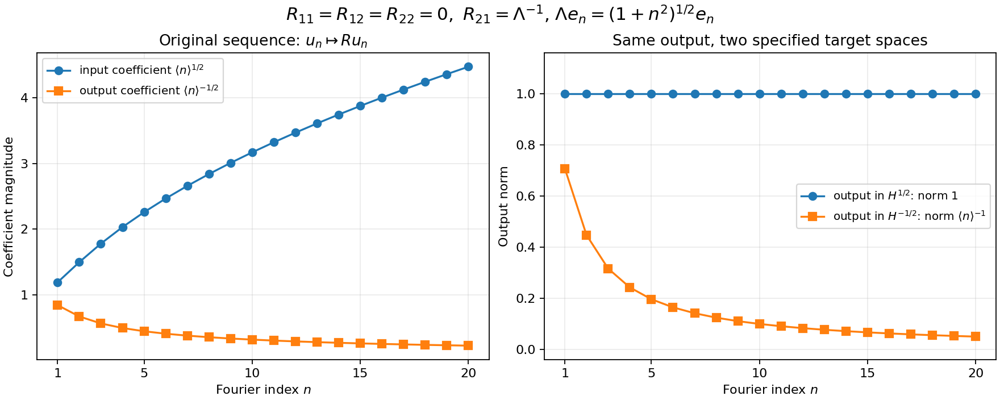

# Calderón projections: trace phases, residues and boundary norms

This note compares the original conventions in Lashi Bandara, Magnus Goffeng and Hemanth Saratchandran, [*Realisations of elliptic operators on compact manifolds with boundary*, arXiv:2104.01919v2](https://arxiv.org/abs/2104.01919v2), July 22, 2021, with the complete construction in [Cauchy data from jumps and residues](../src/calderon-cauchy-data.md). The source supplies a freely accessible higher-order treatment, including the graded boundary spaces and the mixed regularity of maximal-domain traces. Its Section 3.1 states the approximate projector theorem by citation. The course's proofs of the layer traces, ordered jump, residue projection and full smooth-kernel defect are retained; that citation does not replace them.

The convention corrections below concern this exact source version. They are editorial calculations, not statements attributed to its authors. The source remains identifiable by its labels and its [original-author TeX](https://arxiv.org/src/2104.01919v2). The displayed source mathematics is compared at its original order, with every phase and coefficient retained. No claim of mathematical novelty is made.

## 1. Two trace vectors and their exact map

Keep the original inward coordinate \(t\), the same bundles, the same positive density and the same differential operator. Write the two trace vectors as
\[
 h_k=(\partial_t^ku)|_{0+},\qquad
 U_k=(D_t^ku)|_{0+},\qquad D_t=-i\partial_t,\qquad
 C=\operatorname{diag}\big(1,-i,\ldots,(-i)^{m-1}\big).
 \tag{BC1}
\]
The source's Section 2.1 defines its trace using \(h_k\); its boundary ODE in Section 3.1 instead specifies \(D_t^kv(0)\). For every smooth section, repeated multiplication by the constant \(-i\) proves
\[
 U=Ch,\qquad h=C^{-1}U,\qquad
 C^{-1}=\operatorname{diag}\big(1,i,\ldots,i^{m-1}\big).
 \tag{BC2}
\]
Both maps extend to boundary distributions by componentwise multiplication. Each component has modulus one, so they preserve the direct-sum norm with any of the component Sobolev orders. In particular, the source's graded space at parameter \(r\) and the course's jet space at parameter \(s\) are related by the exact identities
\[
 \mathbb H^r=\bigoplus_{k=0}^{m-1}H^{r-k},\qquad
 \mathcal H_s=\bigoplus_{k=0}^{m-1}H^{s-k-1/2}
              =\mathbb H^{s-1/2}.
 \tag{BC3}
\]
The maps in (BC2) are isometries for the same chosen component norms. This comparison concerns the full indicated spaces. It does not identify their norm with the stronger quotient graph norm on all maximal-domain traces.

If \(q_D\) acts on the \(D_t\)-jets, the projector on ordinary derivative jets is
\[
 q_{\partial}=C^{-1}q_D C,\qquad
 (q_{\partial})_{jk}=i^j(q_D)_{jk}(-i)^k .
 \tag{BC4}
\]
Indeed \(q_DU\) becomes \(C^{-1}q_DCh\), and the same calculation gives both its range and kernel under (BC2). The identity holds for full operators as well as frozen matrices when the respective input and output trace conventions are used. Matrix factors are kept in their displayed order.

## 2. The full jump, including all coefficient jets

Write the original differential operator in both index conventions:
\[
 P=\sum_{a=0}^{m}P_a(t,y,D_y)D_t^a
   =\sum_{r=0}^{m}A_r(t,y,D_y)D_t^{m-r},\qquad
 A_r=P_{m-r}.
 \tag{BC5}
\]
The course's exact jump is (CD14):
\[
 \mathcal JU=i^{-1}\sum_{k=0}^{m-1}
       \sum_{l=0}^{m-1-k}
 P_{k+l+1}(t,y,D_y)\big(U_k(y)D_t^l\delta(t)\big).
 \tag{BC6}
\]
Substituting both \(U_k=(-i)^kh_k\) and \(D_t^l\delta=(-i)^l\partial_t^l\delta\), and retaining \(i^{-1}=-i\), gives
\[
 \mathcal J_{\partial}h
 =\sum_{k=0}^{m-1}\sum_{l=0}^{m-1-k}
 (-i)^{k+l+1}
 A_{m-l-k-1}(t,y,D_y)
       \big(h_k(y)\partial_t^l\delta(t)\big).
 \tag{BC7}
\]
This is the same distribution, with support on the original boundary. In particular the normal coefficient functions multiply the delta derivatives before those derivatives are evaluated. For a scalar or matrix coefficient \(a(t)\), the exact product formula is
\[
 a(t)\partial_t^l\delta(t)
 =\sum_{r=0}^{l}(-1)^r\binom lr
       (\partial_t^ra)(0)\partial_t^{l-r}\delta(t).
 \tag{BC8}
\]
To prove it, pair with a compactly supported smooth test function \(\phi\). The left side gives \((-1)^l\partial_t^l(a\phi)(0)\). Leibniz's rule expands this into
\((-1)^l\sum_r\binom lr(\partial_t^ra)(0)(\partial_t^{l-r}\phi)(0)\).
Pairing each term on the right gives exactly this expression. The proof is entrywise for matrices and preserves their order of multiplication. It also applies coefficientwise to the original tangential differential operator in (BC7).

Let \(T\) be the course's properly supported parametrix, with both remainders retained as in (CD10), and let \(\gamma_j^\partial=\partial_t^j|_{0+}\). The full ordinary-trace entry is consequently
\[
 (Q_\partial)_{jk}f
 =\sum_{l=0}^{m-1-k}(-i)^{k+l+1}\,
   \gamma_j^\partial r^+T\!
   \left[A_{m-l-k-1}(t,y,D_y)
           \big(f(y)\partial_t^l\delta(t)\big)\right].
 \tag{BC9}
\]
This follows by taking the output trace of \(T\mathcal J_\partial\), with no further phase: that output trace is already an ordinary derivative. In the source's labelled formula formulaforaprprood, the exponent is printed as \(j+l+1\). With its stated ordinary traces, the required exponent is \(k+l+1\). If the traces are instead changed to \(D_t\)-traces, all input and output phases must be changed by (BC2)–(BC4); changing the name of one trace does not change the other entries.

## 3. A complete scalar check of the trace convention

Keep the frozen polynomial of the original Laplacian,
\[
 p(\zeta)=\zeta^2+\rho^2,\qquad \rho>0.
 \tag{BC10}
\]
Its positive and negative solutions are \(e^{-\rho t}\) and \(e^{\rho t}\). Their ordinary jet lines are \(\mathbb C(1,-\rho)\) and \(\mathbb C(1,\rho)\); their \(D_t\)-jet lines are \(\mathbb C(1,i\rho)\) and \(\mathbb C(1,-i\rho)\). Solving each two-by-two decomposition gives
\[
 q_\partial=\frac12\begin{pmatrix}1&-1/\rho\\-\rho&1\end{pmatrix},
 \qquad
 q_D=\frac12\begin{pmatrix}1&1/(i\rho)\\i\rho&1\end{pmatrix},
 \qquad C=\begin{pmatrix}1&0\\0&-i\end{pmatrix}.
 \tag{BC11}
\]
For example \(a(1,-\rho)+b(1,\rho)=(h_0,h_1)\) gives
\(a=(h_0-h_1/\rho)/2\), proving the first matrix. The second follows in the same way, or by the full conjugation \(q_D=Cq_\partial C^{-1}\). Thus both matrices are projections, but on the indicated different trace vectors.

The full real-line inverse kernel is
\[
 G(t)=\frac{e^{-\rho|t|}}{2\rho},\qquad
 (-\partial_t^2+\rho^2)G=\delta,\qquad
 G(0+)=\frac1{2\rho},\
 G'(0+)=-\frac12,\
 G''(0+)=\frac{\rho}{2}.
 \tag{BC12}
\]
Away from zero the differential equation follows by differentiation. The first derivative has jump \(-1\), so the distribution \(-G''\) contributes precisely \(+\delta\); this proves the middle identity including its sign. Convolution against \(\delta'\) gives \(G'\). Using these three values in the source's printed formula yields the matrix \(q_D\) in (BC11), although its declared input is the ordinary trace. The mismatch is visible on the actual positive ordinary jet:
\[
 q_D\binom{1}{-\rho}
   =\frac12\binom{1+i}{\rho(i-1)}
   \ne\binom{1}{-\rho}.
 \tag{BC13}
\]
By contrast (BC9) gives \(q_\partial\), which fixes that vector and annihilates \((1,\rho)\). The course uses \(D_t\)-jets consistently in (CD2), (CD14), (CD22) and (AP13); none of its working matrices is replaced by an ordinary-trace matrix.

## 4. The meromorphic matrix and the missing phase

At a fixed original boundary point and nonzero tangential covector, retain
\[
 p(\zeta)=\sum_{a=0}^{m}p_a\zeta^a,\qquad
 L_{rk}=\begin{cases}p_{r+k+1},&r+k\leq m-1,\\0,&r+k>m-1,\end{cases}
 \qquad H_{jr}(\zeta)=\zeta^{j+r}I .
 \tag{BC14}
\]
Here \(0\leq j,r,k<m\), and \(p_a\) is the original homogeneous coefficient from \(E_y\) to \(F_y\). The matrix \(H\) acts on the jet factor. Its entries are holomorphic polynomials, including every indicated power. The inverse \(p^{-1}\) acts diagonally from the \(F_y\) factor to the \(E_y\) factor. The ordered matrix integrand has entries
\[
 (p^{-1}HL)_{jk}
 =\sum_{r=0}^{m-1-k}\zeta^{j+r}p(\zeta)^{-1}p_{r+k+1}.
 \tag{BC15}
\]
Indeed matrix multiplication supplies exactly the intermediate index \(r\); the scalar powers commute with the bundle maps, but those bundle maps are not commuted with each other. Applying the residue theorem componentwise to the upper contour of (CD22) therefore gives
\[
 q_D=\sum_{\operatorname{Im}\zeta>0}
           \operatorname{Res}_{\zeta}(p^{-1}HL).
 \tag{BC16}
\]
This formula is valid even when the rational entries have polynomial terms: their polynomial terms have zero residues, and the analytic subtraction in the complete layer-trace proof (T16)–(T25) specifies the same contour value.

The source's principal boundary-pairing matrix is \(\sigma(\mathfrak a)=-iL\), with its displayed \(-i\). Consequently the equivalent formula with that particular matrix is
\[
 q_D=i\sum_{\operatorname{Im}\zeta>0}
           \operatorname{Res}_{\zeta}
                    \big(p^{-1}H\sigma(\mathfrak a)\big).
 \tag{BC17}
\]
The factor \(i\) is required by \(i(-i)=1\). In the condensed formula following source label sigmaoss, it is absent. A first-order example avoids all trace-phase ambiguity: take
\[
 P=D_t-iD_y,\qquad \eta=1,\qquad
 p(\zeta)=\zeta-i,\quad L=1,\quad H=1,\quad
 \sigma(\mathfrak a)=-i .
 \tag{BC18}
\]
For every real \((\tau,\eta)\ne(0,0)\), \(\tau-i\eta\ne0\), so the original operator is elliptic. Its solution at this indicated tangential covector is \(e^{-t}\), with stable trace space \(\mathbb C\); hence the projection is \(1\). Formula (BC16) gives \(1\), whereas the printed condensed formula gives \(-i\). Since \((-i)^2=-1\ne-i\), the latter is not a projection.

There is also a holomorphic-extension issue in that same condensed formula. If \(v(\zeta)=(1,\zeta,\ldots,\zeta^{m-1})^T\), then
\[
 H(\zeta)=v(\zeta)v(\zeta)^T
         =v(\zeta)v(\overline\zeta)^*,\qquad
 (v(\zeta)v(\zeta)^*)_{jr}
         =\zeta^j\overline\zeta^{\,r}.
 \tag{BC19}
\]
The star denotes the usual Hermitian adjoint, as in the source's adjoint discussion. For \(r\geq1\), the last expression is not a holomorphic polynomial: for instance its \((0,1)\) entry is \(\overline\zeta\), whose derivative with respect to \(\overline\zeta\) is \(1\). Thus that expression has no meromorphic residues in the usual sense. On real \(\zeta\) it agrees with \(H\), and the unique polynomial continuation of those real values is \(H\) in (BC14). Uniqueness follows because the difference of two such holomorphic continuations vanishes on a real interval and hence vanishes by the identity theorem. Formulas (BC15)–(BC17) state the continuation explicitly.

## 5. The degree of an entry and the antipodal rank

The course's \((j,k)\) residue entry has degree \(j-k\). To prove this without changing the original polynomial, rescale the indicated tangential covector by \(r>0\) and the contour variable by \(\zeta=r w\). Homogeneity gives a factor \(r^{-m}\) from \(p^{-1}\), a factor \(r^{m-k-l-1}\) from \(p_{k+l+1}\), a factor \(r^{j+l}\) from the power, and a factor \(r\) from \(d\zeta\). Their entire product is
\[
 r^{-m}r^{m-k-l-1}r^{j+l}r=r^{j-k}.
 \tag{BC20}
\]
Both trace-phase matrices are constant, so (BC4) preserves that degree. It is also required by (BC3): mapping the \(k\)-th component \(H^{s-k-1/2}\) to the \(j\)-th component \(H^{s-j-1/2}\) costs \(j-k\) orders. Source label sigmaoss prints \(k-j\). The Laplace entries in (BC11), of degrees \(-1\) above the diagonal and \(1\) below it, give an explicit check of the correction.

The source's Proposition with label nontrivialityofeplussd states nonvanishing on every component of the tangential cosphere in dimension greater than one. Its own following remark notes the dimension-two qualification. The precise identity for the original full principal polynomial is (AP1)–(AP12):
\[
 q_D(y,-\eta)=S(I-q_D(y,\eta))S,\qquad
 S=\operatorname{diag}\big(1,-1,\ldots,(-1)^{m-1}\big).
 \tag{BC21}
\]
For completeness, homogeneity of each \(p_a\) gives
\(p(y,-\eta,\zeta)=(-1)^m p(y,\eta,-\zeta)\).
Reflection \(v(t)\mapsto v(-t)\) sends the positive modes to the negative modes at the antipodal covector, with every jet multiplied by \((-1)^k\). ODE uniqueness gives the direct sum of the two jet spaces, including all generalized modes. The projection with that direct-sum kernel must therefore satisfy (BC21). No orthogonality is assumed. Taking dimensions yields
\[
 \operatorname{rank}q_D(y,-\eta)=mN-\operatorname{rank}q_D(y,\eta).
 \tag{BC22}
\]
If \(\dim X\geq3\), the punctured tangential fiber is connected. Indeed its dimension is at least two; radial paths join nonzero vectors to a sphere, and that sphere is path connected, using two great-circle arcs through a third unit vector when the endpoints are antipodal. The rank of a smooth projection is locally constant, because it is its integer-valued continuous trace. Thus both sides of the antipodal fiber have the same rank. Equation (BC22) proves rank \(mN/2\), including the necessary evenness of \(mN\).

In dimension two there are two tangential rays, and the following original order-one rank-two system has ranks \(2\) and \(0\):
\[
 P=D_tI-i(2I+N_0)D_y,\qquad
 N_0=\begin{pmatrix}0&1\\0&0\end{pmatrix},\qquad
 v(t)=e^{-2\eta t}(I-\eta tN_0)v(0).
 \tag{BC23}
\]
Its determinant is \((\tau-2i\eta)^2\), nonzero for each nonzero real \((\tau,\eta)\). Direct differentiation of the complete displayed solution verifies the equation, using \(N_0^2=0\). When \(\eta>0\), every vector is decaying; when \(\eta<0\), every nonzero vector grows, since the invertible polynomial factor cannot cancel the exponential. The source's asserted nonvanishing on each cosphere component therefore fails in this dimension. The complementary antipodal ranks remain valid. When \(\dim X=1\), there is no nonzero tangential covector; no such rank condition is inferred. When the boundary is empty or the bundle rank is zero, the corresponding boundary spaces are zero, so blanket noncompactness claims also require those cases to be excluded.

## 6. Why order minus one can fail to be compact

Source Section 9, Proposition with label charcompacssndaa, retains the extra off-diagonal symbol condition for the difference of the spectral and Calderón projectors. Its low-to-high regularity block has only the exact one-order gain required for continuity. Here is a full Fourier model of that mechanism, without identifying an arbitrary matrix with an actual Calderón projector.

On the circle of length \(2\pi\), use \(e_n(y)=e^{iny}/\sqrt{2\pi}\) and the original inhomogeneous multiplier \(\Lambda e_n=(1+n^2)^{1/2}e_n=\langle n\rangle e_n\). Define
\[
 \mathcal L=H^{-1/2}(S^1)\oplus H^{1/2}(S^1),\quad
 \Pi_+=\begin{pmatrix}1&0\\0&0\end{pmatrix},\
 \Pi_-=\begin{pmatrix}0&0\\0&1\end{pmatrix},\quad
 R=\begin{pmatrix}a\Lambda^{-1}&b\Lambda^{-1}\\
                   c\Lambda^{-1}&d\Lambda^{-1}\end{pmatrix}.
 \tag{BC24}
\]
The four constants are arbitrary complex numbers. The exact comparison map
\[
 W=\begin{pmatrix}\Lambda^{-1/2}&0\\0&\Lambda^{1/2}\end{pmatrix}
       :\mathcal L\longrightarrow L^2(S^1)\oplus L^2(S^1)
 \tag{BC25}
\]
is unitary: substituting the complete Fourier weights in each component proves equality of the squared norms, and its inverse is the corresponding reciprocal diagonal multiplier. Computing all four original blocks gives
\[
 WRW^{-1}
 =\begin{pmatrix}a\Lambda^{-1}&b\Lambda^{-2}\\cI&d\Lambda^{-1}\end{pmatrix}.
 \tag{BC26}
\]
No block of \(R\) has been dropped. For every \(\epsilon>0\), the finite-rank Fourier truncations of \(\Lambda^{-\epsilon}\) converge in operator norm, since their error norm is
\(\sup_{|n|>M}(1+n^2)^{-\epsilon/2}\), which tends to zero. Thus (BC26) is compact if \(c=0\). If \(c\ne0\), take the unit orthogonal sequence
\[
 u_n=\binom{\langle n\rangle^{1/2}e_n}{0}\in\mathcal L,\qquad
 Ru_n=\binom{a\langle n\rangle^{-1/2}e_n}
             {c\langle n\rangle^{-1/2}e_n}.
 \tag{BC27}
\]
The second component has \(H^{1/2}\)-norm \(|c|\), and different values of \(n\) are orthogonal in that norm. The first component has \(H^{-1/2}\)-norm \(|a|\langle n\rangle^{-1}\), tending to zero. Hence no subsequence of \(Ru_n\) can converge. We have proved
\[
 R\text{ is compact on }\mathcal L
 \quad\Longleftrightarrow\quad c=0
 \quad\Longleftrightarrow\quad
 \Pi_-\sigma_{-1}(R)(y,\eta)\Pi_+=0
       \quad(\eta\ne0).
 \tag{BC28}
\]
For the final equality, the original order-minus-one symbol is
\(|\eta|^{-1}\begin{pmatrix}a&b\\c&d\end{pmatrix}\), so the indicated lower block is exactly \(c|\eta|^{-1}\). This is a constant-splitting model of the source's condition, with a complete necessity and sufficiency proof for these operators. It imports no unproved assertion that an arbitrary mixed trace space is a fixed-grade jet space.

The figure takes the particular original matrix (BC24) with \(a=b=d=0\), \(c=1\), and plots the exact values in (BC27) for the integer indices \(1\leq n\leq20\). The same output coefficient has norm one in \(H^{1/2}\), and norm \(\langle n\rangle^{-1}\) in \(H^{-1/2}\). Connecting segments guide the eye between the plotted integers. The complete all-index compactness and noncompactness arguments are (BC25)–(BC28). The reproducible [figure source](../figures/calderon-mixed-orders.py) retains \(1+n^2\), the Fourier normalization and all four matrix entries.

On \(H^s(S^1)\oplus H^s(S^1)\), the same original matrix \(R\) is compact for every real \(s\): the componentwise unitary map \(\operatorname{diag}(\Lambda^s,\Lambda^s)\) to \(L^2\oplus L^2\) leaves each of its four blocks a constant times \(\Lambda^{-1}\), and the same finite-rank proof applies. Thus the domain and target orders decide the compactness question. The course's (CD20)–(CD21) concern the common graded spaces \(\mathcal H_s\); the stronger mixed graph-trace space requires its own analysis.

## 7. The sign in the projector comparison

In the proof of source Section 4.1, Lemma with label approximcladldlad, the resolvent difference is printed with \(P_{\mathcal C}-P_m\) between the two resolvents. Its exact identity has the opposite difference. Retain any two bounded operators \(A,B\) on the same Banach space and any \(\lambda\) for which both inverses exist. Direct ordered multiplication gives
\[
 \begin{split}
 (\lambda-A)^{-1}-(\lambda-B)^{-1}
 &=(\lambda-A)^{-1}\big((\lambda-B)-(\lambda-A)\big)(\lambda-B)^{-1}\\
 &=(\lambda-A)^{-1}(A-B)(\lambda-B)^{-1}.
 \end{split}
 \tag{BC29}
\]
For the first equality, expand its right side into two terms. In the first, \((\lambda-B)(\lambda-B)^{-1}=I\) leaves \((\lambda-A)^{-1}\); in the second, \((\lambda-A)^{-1}(\lambda-A)=I\) leaves \((\lambda-B)^{-1}\). No factors are reordered. Setting \(A=P_m\), \(B=P_{\mathcal C}\) proves the correction at the original operators.

The scalar values \(A=2\), \(B=1\), \(\lambda=3\) already distinguish the two signs: the left side is \(1-1/2=1/2\), the corrected right side is \(1\cdot1\cdot(1/2)=1/2\), and the printed right side is \(-1/2\). This checks the algebraic formula; it asserts no identification of those scalars with a particular global Calderón construction.

The operator-order conclusion in that source step survives the sign correction. Whenever its two resolvents have order zero and its difference \(A-B\) has graded order \(-m\), (BC29), with the actual full composition calculus, has graded order \(-m\), since \(0+(-m)+0=-m\). Thus the mistake changes the displayed identity, but does not reverse the claimed order bound. The course's full smooth-kernel defect proof uses (CD30) directly and does not use that printed resolvent identity.

## 8. What the source comparison adds

The full weighted jet construction remains the course's (CD1)–(CD30), with all normal coefficient derivatives, both parametrix remainders and every layer order proved. Equations (BC1)–(BC20) make the free higher-order source's precise receiving maps and convention corrections explicit. Equations (BC21)–(BC23) preserve the complete antipodal result and its dimension exceptions. Equations (BC24)–(BC28) give the exact compactness test in an elementary model of the source's mixed regularity.

The source's Section 3.2 uses additional global Poisson and complementary-extension results for its exact Hardy-space projection and maximal-domain trace decomposition. Its Section 9 also uses the sectorial-projector construction for adapted operators. Those additional results are not inferred merely from \(Q^2-Q\) having a smooth kernel. The course's approximate projection, its subsequent Fredholm proof and a global exact Hardy-space projector remain the respective constructions stated in their own proofs.

This editorial note is independently written. Its new expression is dedicated under [CC0 1.0](https://creativecommons.org/publicdomain/zero/1.0/) to the extent of rights held. The human source has its own [CC BY 4.0 notice](https://creativecommons.org/licenses/by/4.0/); that notice is retained as source information, and its archive is not redistributed here.
