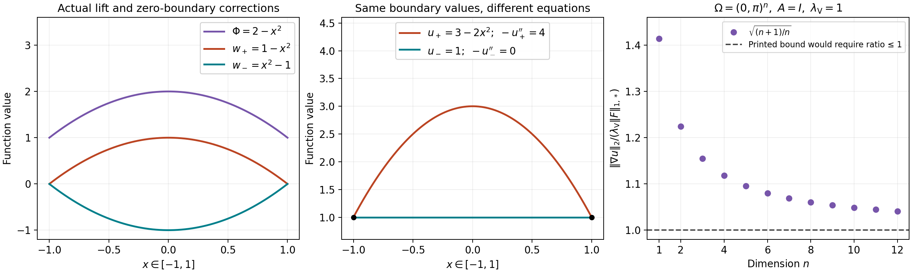

# Dirichlet lifting and the full dual norm

This note compares two formulas in Sergio Vessella's freely accessible [Notes on unique continuation properties for Partial Differential Equations — Introduction to the stability estimates for inverse problems, arXiv:2305.04765v1](https://arxiv.org/abs/2305.04765v1). The original [author source archive](https://arxiv.org/src/2305.04765v1) contains A-INGL1.tex. The relevant locators are the definition Sob:49-0, the dual-space definition preceding Sob:teo2.10, the equations a-dirich, stab, Dirichlet-non om-10 and variazDirichlet-1, and the forcing definition variazDirichlet-10. Both the sign of the lifted forcing and the norm used in its estimate matter.

The corresponding complete course arguments are in [Boundary energy, local inverses, and harmonic data](../src/second-order-boundary.md): (B6), (B7), (B8)–(B12), and the paragraph after (B12). The original operator, coefficient matrix, domain and forcing remain the objects throughout this comparison. The comparison does not change the author's text. The corrections below are editorial mathematics.

The newly authored expression in this note is released under CC0-1.0 to the extent of rights held. The human source has its own terms. Its expression is not relicensed by this notice. Mathematical exposition and editorial comparison were prepared with OpenAI Codex; no independent-review or novelty claim is made.

## 1. The exact closure and dual-space maps

Let \(\Omega\subset\mathbb R^n\) be bounded and open, \(n\geq1\). Use the full norm
\[
 \|v\|_{H^1(\Omega)}^2
 =\int_\Omega\left(|v|^2+\sum_{j=1}^n|\partial_jv|^2\right).
 \tag{VE1}
\]
Vessella's \(H^1_0(\Omega)\) is the closure of \(C_c^\infty(\Omega)\) in this norm. The course space is
\[
 V_\Omega=\overline{C_c^\infty(\Omega)}^{\,H^1(\mathbb R^n)}.
 \tag{VE2}
\]
Zero extension of each test function preserves (VE1) exactly, since the function and all its first derivatives vanish outside \(\Omega\). Thus a Cauchy sequence in either closure is a Cauchy sequence in the other, with the same norm on every difference. Completing this map gives a linear isometry
\[
 Z:H^1_0(\Omega)\longrightarrow V_\Omega,\qquad
 R:V_\Omega\longrightarrow H^1_0(\Omega),\qquad
 RZ=I,\quad ZR=I.
 \tag{VE3}
\]
Here \(R\) is restriction. To verify the two identities, apply each composition to a test function, where it is the identity, and pass to the limit in the equal norms. Surjectivity follows from the definition of the two closures, by applying the same argument to their approximating test sequences. This proof requires no boundary trace or boundary regularity and makes no support characterization for an arbitrary open set.

The dual map is pullback of the functional by \(R\). For real-valued functions it sends Vessella's bounded real-linear functional \(F\) to \(v\mapsto F(Rv)\), with the identical full dual norm. For complex functions, keep a conjugate-linear forcing functional, as in the course. If \(v=v_1+iv_2\) and \(F_1,F_2\) are real-linear functionals, its explicit complexification is
\[
 F(v)=F_1(v_1)+F_2(v_2)
           +i\bigl(F_2(v_1)-F_1(v_2)\bigr).
 \tag{VE4}
\]
Additivity follows term by term. Replacing \(v\) by \(iv=-v_2+iv_1\) gives \(F(iv)=-iF(v)\), proving conjugate linearity; boundedness follows from boundedness of both real functionals and the full norm (VE1). Conversely restricting the real and imaginary parts to real inputs recovers \(F_1,F_2\). Thus the real source argument and its complex version have a proved functional map.

Choose \(R_0>0\) with \(|x_1|\leq R_0\) on \(\Omega\). For a compactly supported test \(v\), integration of \(\partial_1(x_1|v|^2)\) over \(\mathbb R^n\) gives
\[
 \|v\|_2^2
 =-2\operatorname{Re}\int x_1\,\overline v\,\partial_1v
 \leq2R_0\|v\|_2\|\partial_1v\|_2.
 \tag{VE5}
\]
For \(v\ne0\), division by its retained norm gives
\(\|v\|_2\leq2R_0\|\partial_1v\|_2\); for \(v=0\) the same inequality holds. Density extends it to (VE2). Consequently, with \(C_{R_0}=(1+4R_0^2)^{1/2}\),
\[
 \|\nabla v\|_2\leq\|v\|_{H^1}
                 \leq C_{R_0}\|\nabla v\|_2.
 \tag{VE6}
\]
Both the zeroth-order term and the original coordinate bound remain.

For a forcing functional define two distinct norms on these same objects:
\[
 \|F\|_{1,*}=\sup_{\|v\|_{H^1}\leq1}|F(v)|,\qquad
 \|F\|_{\nabla,*}=\sup_{\|\nabla v\|_2\leq1}|F(v)|.
 \tag{VE7}
\]
The first unit ball is contained in the second, and every vector in the second has full norm at most \(C_{R_0}\). Applying homogeneity to each functional therefore proves
\[
 \|F\|_{1,*}\leq\|F\|_{\nabla,*}
                   \leq C_{R_0}\|F\|_{1,*}.
 \tag{VE8}
\]
These are comparisons of the two specified norms, not replacements of the source's full \(H^1\) norm.

## 2. Measurable symmetric coefficients and the retained constants

Keep an essentially bounded measurable real symmetric matrix \(A=(a_{jk})\) satisfying, almost everywhere, the full bounds
\[
 \lambda|\xi|^2\leq
      \sum_{j,k}a_{jk}(x)\xi_k\overline{\xi_j}
                    \leq\Lambda|\xi|^2,\qquad
 0<\lambda\leq\Lambda<\infty.
 \tag{VE9}
\]
For complex \(\xi\), real symmetry cancels the imaginary cross terms, so the real inequalities imply precisely (VE9). With \(D_j=-i\partial_j\), the original form and operator are
\[
 Q(u,v)=\int_\Omega\sum_{j,k}
       a_{jk}D_ku\,\overline{D_jv}
       =\int_\Omega A\nabla u\cdot\overline{\nabla v},
 \qquad
 P=\sum_{j,k}D_j(a_{jk}D_k)=-\operatorname{div}(A\nabla).
 \tag{VE10}
\]
The equality of the forms retains both factors \(-i\) and \(+i\), whose product is one. The operator equality retains \((-i)^2=-1\), and holds distributionally by testing against compact smooth functions.

For \(u,v\in V_\Omega\), the form is bounded by
\(\Lambda\|\nabla u\|_2\|\nabla v\|_2\). To see the pointwise bound, diagonalize the actual finite real symmetric matrix at a point: (VE9) places each eigenvalue in \([\lambda,\Lambda]\), so its operator norm is at most \(\Lambda\). Integrate the resulting pointwise inequality and use Cauchy–Schwarz. Also
\[
 \lambda\|\nabla v\|_2^2\leq Q(v,v)
          \leq\Lambda\|\nabla v\|_2^2.
 \tag{VE11}
\]
Thus the form norm is equivalent to the complete full norm (VE1), using (VE6); no continuity of \(A\) is needed for this step.

For every bounded conjugate-linear forcing \(F\), the functional
\(J(v)=Q(v,v)-2\operatorname{Re}F(v)\) has a finite infimum: its lower bound follows from \(r^2-2Cr\), with \(r=Q(v,v)^{1/2}\) and the bound on \(F\). A minimizing sequence is bounded in that norm. The exact parallelogram identity is
\[
 Q(v_j-v_k,v_j-v_k)
 =2J(v_j)+2J(v_k)-4J((v_j+v_k)/2).
 \tag{VE12}
\]
Since the final value of \(J\) is at least its infimum, the right side tends to zero. Completeness supplies a limit \(u\) attaining the infimum. Differentiation of \(J(u+tv)\) for real \(t\) proves \(\operatorname{Re}Q(u,v)=\operatorname{Re}F(v)\); applying it to \(iv\) proves the imaginary part. Hence \(Q(u,v)=F(v)\) for every \(v\). Two solutions differ by a vector \(w\) with \(Q(w,w)=0\); (VE11) and (VE6) give \(w=0\). This proves weak existence and uniqueness at the original closure domain.

Testing the full equation with \(u\) gives
\[
 \|\nabla u\|_2\leq\lambda^{-1}\|F\|_{\nabla,*}
              \leq\lambda^{-1}C_{R_0}\|F\|_{1,*},
 \qquad
 \|u\|_{H^1}\leq\lambda^{-1}C_{R_0}^2\|F\|_{1,*}.
 \tag{VE13}
\]
If \(F(v)=\int_\Omega f\overline v\), \(f\in L^2\), then (VE5) also gives
\[
 \|\nabla u\|_2\leq2R_0\lambda^{-1}\|f\|_2,\qquad
 \|u\|_{H^1}\leq2R_0C_{R_0}\lambda^{-1}\|f\|_2.
 \tag{VE14}
\]
The original continuous positive symmetric case of (B8) is included. This proves a measurable-coefficient extension of its weak existence assertion. It asserts no \(H^2\) regularity for merely measurable coefficients.

Vessella writes \(\lambda\geq1\) for the parameter in gamma-eq, with bounds \(\lambda^{-1}|\xi|^2\leq A\xi\cdot\xi\leq\lambda|\xi|^2\). This is a different parameter from the lower bound \(\lambda\) in (VE9). In this comparison write \(\lambda_{\rm V}\) for that exact source parameter. For the unchanged matrix in (VE9), any \(\lambda_{\rm V}\geq\max(1,\lambda^{-1},\Lambda)\) satisfies both source inequalities, by their displayed bounds. This notation distinguishes the two original constants; it changes neither matrix nor operator. The source also treats nonsymmetric matrices. The minimization proof above is expressly for the symmetric course setting and does not claim the nonsymmetric assertion.

## 3. The complete lifted forcing

For any bounded open \(\Omega\), fix an actual \(\Phi\in H^1(\Omega)\), and impose \(u-\Phi\in V_\Omega\). On a bounded \(C^1\) domain this is exactly the prescribed-trace condition: the argument following (B6) in the course proves that the trace kernel is \(V_\Omega\), and (B4) and its chart construction provide the bounded \(H^{1/2}\to H^1\) lift. The closure formulation also makes sense on irregular domains without a trace theorem. The original variational problem on this affine domain is
\[
 Q(u,v)=F(v),\qquad v\in V_\Omega,\qquad
 u-\Phi\in V_\Omega.
 \tag{VE15}
\]
Then \(w=u-\Phi\) belongs to \(V_\Omega\) by the specified domain. On a \(C^1\) domain it has zero trace by the proved kernel characterization. Substituting the original \(u=w+\Phi\) into every term of (VE15) gives exactly
\[
 Q(w,v)=F(v)-Q(\Phi,v).
 \tag{VE16}
\]
Conversely (VE16) and \(u=w+\Phi\) give (VE15) by addition of those same form terms. The complete forcing is bounded because
\[
 |F(v)-Q(\Phi,v)|
 \leq\big(\|F\|_{1,*}+\Lambda\|\nabla\Phi\|_2\big)
                                         \|v\|_{H^1}.
 \tag{VE17}
\]
In the homogeneous equation \(F=0\), the distributional equation is
\[
 -\operatorname{div}(A\nabla w)=\operatorname{div}(A\nabla\Phi),
 \qquad
 \langle\operatorname{div}(A\nabla\Phi),v\rangle
       =-\int_\Omega A\nabla\Phi\cdot\overline{\nabla v}.
 \tag{VE18}
\]
The last equality is the definition of weak divergence, followed by density. It fixes the sign. Vessella's equation Dirichlet-non om-10 retains the positive divergence in (VE18), but variazDirichlet-1 and the functional displayed as variazDirichlet-10 have a positive form term. Those latter displays need a minus sign. The norm bounds on that functional survive the correction, because replacing it by its negative leaves its norm unchanged. Subsequent use of \(u=w+\Phi\) requires the corrected forcing.

For two representatives \(\Phi,\Psi\) of the same affine domain, set \(\chi=\Psi-\Phi\in V_\Omega\). On a \(C^1\) domain, two lifts of the same trace satisfy this condition by the proved kernel characterization. If \(w_\Phi\) solves (VE16) for \(\Phi\), the exact solution for \(\Psi\) is
\[
 w_\Psi=w_\Phi-\chi,\qquad
 Q(w_\Psi,v)=F(v)-Q(\Psi,v),\qquad
 w_\Psi+\Psi=w_\Phi+\Phi.
 \tag{VE19}
\]
All three equalities follow by subtraction of the displayed original form terms. Uniqueness in Section 2 makes this the actual solution, proving independence of lift with its complete map.

## 4. A counterexample for the printed lift sign

Take the unit ball in \(\mathbb R^n\), \(n\geq1\), \(A=I\), \(F=0\), boundary value one and the actual smooth lift
\[
 \Phi(x)=2-|x|^2,\quad \gamma\Phi=1,\quad
 \nabla\Phi=-2x,\quad -\Delta\Phi=2n.
 \tag{VE20}
\]
This is an admissible \(H^1\) lift. Its finite norm satisfies a lift bound for this datum with any constant at least \(\|\Phi\|_{H^1}/\|1\|_{H^{1/2}(\partial\Omega)}\). The denominator is nonzero. The example does not assert that the author selected this particular lift; it tests the displayed identity for a permitted nonharmonic lift.

The printed positive form equation makes \(w_+=1-|x|^2\) its unique zero-trace solution: \(\nabla w_+=\nabla\Phi\), so their form terms agree for every test. It then gives
\[
 u_+=w_++\Phi=3-2|x|^2,\qquad
 \gamma u_+=1,\qquad -\Delta u_+=4n\ne0.
 \tag{VE21}
\]
This violates the original homogeneous equation. With the corrected negative form, the actual zero-trace solution is
\[
 w_-=|x|^2-1,\qquad \nabla w_-=-\nabla\Phi,\qquad
 u_-=w_-+\Phi=1,\qquad -\Delta u_-=0.
 \tag{VE22}
\]
The test identities and weak uniqueness prove each solution assertion. Both traces and all factors \(2n,4n\) remain.

## 5. A counterexample for the printed dual-norm bound

Vessella's dual-space section uses the full norm (VE1), as is also explicit in the inner product in the proof of Sob:teo2.10. With that norm, the displayed estimate stab,
\(\|\nabla u\|_2\leq\lambda_{\rm V}\|F\|_{H^{-1}(\Omega)}\), need not hold; here \(\lambda_{\rm V}\) denotes the original source parameter \(\lambda\). The exact comparison is (VE8), and (VE13) supplies a valid bound without changing the norm.

Let \(\Omega=(0,\pi)^n\), \(n\geq1\), \(A=I\), \(\lambda_{\rm V}=1\), and retain
\[
 u(x)=\prod_{j=1}^n\sin x_j,\qquad
 f=nu,\qquad F(v)=n\int_\Omega u\,v.
 \tag{VE23}
\]
Use real functions for this source-norm comparison. Each second derivative of \(u\) in its own coordinate is \(-u\), so \(-\Delta u=nu\). Also \(u\in H^1_0(\Omega)\): multiply it by smooth cutoffs vanishing within distance \(\varepsilon\) of each face and equal to one beyond distance \(2\varepsilon\). On a face strip the corresponding \(\sin x_j\) is at most \(2\varepsilon\), while its cutoff derivative is at most \(C/\varepsilon\). Thus the squared norm of every new first-derivative term is at most a fixed constant times the strip volume, which tends to zero. The original derivative and zeroth-order losses have the same property by boundedness and shrinking volume. There are finitely many faces. These compact smooth products converge in the full \(H^1\) norm, proving the stated closure membership.

Integration by parts on compact tests, then density, gives
\[
 \int_\Omega\nabla u\cdot\nabla v=n\int_\Omega uv,\qquad
 (u,v)_{H^1}=(n+1)\int_\Omega uv,\qquad
 F(v)=\frac{n}{n+1}(u,v)_{H^1}.
 \tag{VE24}
\]
Cauchy–Schwarz gives the upper bound on its full dual norm; the test \(v=u/\|u\|_{H^1}\) attains it. Since
\(\int_0^\pi\sin^2 x\,dx=\int_0^\pi\cos^2 x\,dx=\pi/2\), separation of the \(n\) integrals gives
\[
 \|u\|_2^2=(\pi/2)^n,\qquad
 \|\nabla u\|_2^2=n(\pi/2)^n,\qquad
 \|F\|_{1,*}=\frac{n}{\sqrt{n+1}}(\pi/2)^{n/2}.
 \tag{VE25}
\]
Therefore
\[
 \frac{\|\nabla u\|_2}{\lambda_{\rm V}\|F\|_{1,*}}
       =\sqrt{\frac{n+1}{n}}>1.
 \tag{VE26}
\]
This is a counterexample in every stated dimension, using the original coefficient, right side and full dual norm. If the dual norm is instead \(\|F\|_{\nabla,*}\), testing with \(u/\|\nabla u\|_2\) and the first identity in (VE24) proves
\(\|F\|_{\nabla,*}=\|\nabla u\|_2\); that alternative bound holds, with the exact norm comparison (VE8) retained. It is a distinct norm and cannot be silently substituted for the displayed source definition.

The first two panels show the actual functions in (VE20)–(VE22) for the one-dimensional ball \((-1,1)\), including both zero-boundary corrections and the common endpoint values. The plotted profiles are samples of the stated quadratic formulas; the equations and their derivatives are proved above. The last panel plots the exact values in (VE26) for the displayed integer dimensions \(1\) through \(12\). The proof applies to every \(n\geq1\); the finite plot does not replace that argument. The source of the compared formulas is Vessella, equations variazDirichlet-1 and stab. The [reproducible figure source](../figures/vessella-dirichlet-comparison.py) and [vector figure](../figures/vessella-dirichlet-comparison.svg) retain the original domains, coefficients and constants.

The sign correction in Section 3 preserves subsequent norm estimates on the lifted functional. The dual-norm correction in this section retains the required domain-dependent comparison factor. Neither defect invalidates the course's weak existence proof: it already keeps the original negative lifted forcing and allows the constants from its explicit Poincaré estimate.
