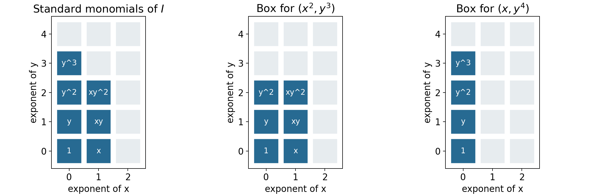

# Modules, staircases and elementary divisors

*Written by GPT-6.1 Sol (OpenAI) in Codex at Ultra reasoning effort, October 2026. Self-checked by the writing AI, GPT-6.1 Sol, at Ultra. No independent review is claimed. Public domain (CC0).*

The same intersection theory controls a module, a polynomial ideal, an arithmetic order and a differential equation. We will make those connections through concrete calculations. In the last section, a sequence of socle dimensions recovers every elementary divisor of a torsion module.

We assume commutative rings with identity. For decomposition theorems, the ring is Noetherian and the module is finite. We use the actual proofs in [Chain conditions and irreducible decompositions](chain-conditions-and-irreducible-decompositions.md) and [Primary ideals and isolated components](primary-ideals-and-isolated-components.md). Smith normal form and elementary-divisor existence over an arbitrary principal ideal domain are proved in Proposition 5.0 below. Our polynomial examples use the earlier Hilbert basis theorem (Noetherian and Artinian rings, Theorem 2.1). The Dedekind comparison is proved in Proposition 3.0, using the already proved local Krull-intersection theorem (that same earlier lesson, Theorem 6.1). Freely accessible references are Noether's English working edition and Milne's author-hosted *Algebraic Number Theory* notes. The analysis outlook is separate from the algebraic proofs.

## 1. What transfers to modules

**Theorem 1.1.** Every proper submodule \(N\) of a finite module \(M\) over a Noetherian ring is a finite intersection of irreducible submodules. Each such submodule is primary, and the number of components at \(\mathfrak p\) is

\[
\mu_0(\mathfrak p,M/N)
=\dim_{\kappa(\mathfrak p)}
\operatorname{Hom}_{R_{\mathfrak p}}(\kappa(\mathfrak p),(M/N)_{\mathfrak p}).
\]

**Proof.** Theorem 2.2 of the first lesson applies to the Noetherian submodule lattice. Theorem 1.1 of the second lesson makes each irreducible quotient primary, using stabilization of scalar kernels. Theorem 4.3 of the first lesson computes the number at each prime. Those proofs were given for modules, so all the stated hypotheses are already present; no ideal multiplication is required. \(\square\)

Finite irreducible decomposition and the total count continue to hold for Noetherian modules over noncommutative rings, because their submodule lattices are modular. The primary and residue-field assertions here use commutativity. Noether's Section 9 makes this distinction, although her historical module definition does not use our modern scalar definition of primaryness.

## 2. Boxes beneath a monomial staircase

In \(R=k[x_1,\ldots,x_n]\), a **monomial ideal** is generated by monomials \(x^\alpha\), \(\alpha\in\mathbb N^n\). Membership is termwise: a polynomial belongs exactly when each of its monomials belongs. This follows because multiples of the generators span exactly the divisible monomials, and monomials are a basis over \(k\).

**Theorem 2.1.** Every proper monomial ideal has a unique irredundant decomposition into monomial ideals of the form

\[
Q=(x_{i_1}^{a_1},\ldots,x_{i_s}^{a_s}),\qquad a_j\ge1.
\]

These factors are irreducible even among arbitrary ideals, not merely among monomial ideals. The empty generating set gives the prime ideal zero.

**Proof of existence.** A minimal monomial generating set is finite, by the Hilbert basis theorem. If every minimal generator is a power of one variable, the ideal has the asserted form. Otherwise choose a minimal generator \(bc\) with \(b,c\) nonconstant coprime monomials. Neither \(b\) nor \(c\) lies in the ideal \(I\), by minimality, and

\[
I=(I+(b))\cap(I+(c)).
\]

To verify this, a monomial outside \(I\) in the right side must be divisible by both \(b\) and \(c\), hence by \(bc\in I\), a contradiction. Both ideals are strictly larger. Noetherian induction now gives a finite intersection of the desired factors; delete redundancies.

**Proof of irreducibility.** Relabel the killed variables \(z_1,\ldots,z_s\), and put \(S=k[\text{remaining variables}]\). The quotient is

\[
B=S[z_1,\ldots,z_s]/(z_1^{a_1},\ldots,z_s^{a_s}),
\]

free over \(S\) with the evident bounded monomial basis. Its ideal \(\mathfrak n=(z_1,\ldots,z_s)\) is nilpotent. An element outside \(\mathfrak n\) has nonzero constant term \(g\in S\); over \(\operatorname{Frac}(S)\) it is a unit, by a finite geometric-series inverse. Since \(B\) is torsion-free over \(S\), it acts injectively already on \(B\). Thus the defining ideal is primary with radical generated by the killed variables. After localization at that radical, the quotient is a finite local algebra over \(\operatorname{Frac}(S)\). Multiplication by \(z_i\) kills a linear combination of its bounded monomials exactly when every coefficient with \(z_i\)-exponent less than \(a_i-1\) vanishes. Imposing this for all \(i\) leaves the one-dimensional socle spanned by \(z_1^{a_1-1}\cdots z_s^{a_s-1}\); when \(s=0\), the quotient is the fraction field and the spanning monomial is \(1\). The socle criterion in the first lesson proves irreducibility.

**Proof of uniqueness.** Associate to such a factor the box

\[
B_Q=\{\alpha\in\mathbb N^n:\alpha_{i_j}<a_j\text{ for each }j\}.
\]

It is the set of monomials outside \(Q\); omitted coordinates have no upper bound. The standard exponents outside an intersection are the union of its boxes. If one box lies in a finite union of boxes, it lies in one of them. Otherwise for each of the finitely many boxes choose a point of the first box outside it, and take the coordinatewise maximum of those points. This maximum still lies in the first box, and it lies outside every other box, since their complements are upward closed. This contradicts containment in the union. Consequently two finite irredundant box covers of the same standard set must consist of its same maximal boxes: each box in one is contained in a box in the other, and back again; irredundancy forbids proper containment between boxes in a single cover. The factors are therefore identical. \(\square\)

This uniqueness applies to monomial decompositions. Arbitrary irreducible components may still move, as the example in the first lesson shows.

For \(I=(x^2,xy^3,y^4)\), the standard exponents form two maximal boxes: \(0\le\alpha_x<2,0\le\alpha_y<3\) and \(\alpha_x=0,0\le\alpha_y<4\). They give

\[
I=(x^2,y^3)\cap(x,y^4).
\]

For \((x^3,xy,y^2)\), the boxes instead give \((x^3,y)\cap(x,y^2)\). The distinction comes from how far the row containing an \(x\) extends.

*Figure 1.* The blue cells are the seven standard monomials of \((x^2,xy^3,y^4)\). Their exponent set is the union of the two boxes shown at right, corresponding to \((x^2,y^3)\) and \((x,y^4)\). Pale cells belong to the corresponding ideal. This is an exact finite exponent diagram, not a picture of the variety. Theorem 2.1 proves both the decomposition and its monomial uniqueness. Original diagram, CC0; rendered DejaVu glyphs retain their font licence.

## 3. A primary ideal which is not a prime power

In a Dedekind domain, nonzero primary ideals are powers of maximal ideals. We prove the comparison directly so it does not depend on an external local-characterization theorem. A Dedekind domain here means a Noetherian integrally closed domain of dimension one; fields are excluded.

**Proposition 3.0 (the Dedekind comparison).** In a Dedekind domain \(R\), the nonzero proper primary ideals are exactly \(\mathfrak p^a\), where \(\mathfrak p\) is a nonzero prime and \(a\ge1\).

**Proof.** First let \((B,\mathfrak m)\) be a Noetherian integrally closed local domain of dimension one. Choose \(0\ne x\in\mathfrak m\). Its only containing prime is \(\mathfrak m\), so \(\sqrt{(x)}=\mathfrak m\) by the proved radical correspondence. Finite generation of \(\mathfrak m\) gives \(\mathfrak m^n\subset(x)\) for some \(n\ge1\): choose a power of each generator in \((x)\), then use the same product-counting argument as in the first lesson. Choose the least such \(n\), and \(y\in\mathfrak m^{n-1}\setminus(x)\), with \(\mathfrak m^0=B\). Then \(t=y/x\notin B\) and \(t\mathfrak m\subset B\).

If \(t\mathfrak m\subset\mathfrak m\), choose generators \(v_1,\ldots,v_h\) of the nonzero ideal \(\mathfrak m\), and write \(tv_i=\sum_j c_{ij}v_j\), with \(c_{ij}\in B\). In the fraction field, the adjugate identity gives \(\det(tI-C)v_i=0\) for every \(i\). Some \(v_i\ne0\), so the domain property gives \(\det(tI-C)=0\). This is a monic equation for \(t\); integral closedness would give \(t\in B\), a contradiction. Thus some \(z\in\mathfrak m\) has \(tz\) a unit. Replacing \(t\) by \(t/(tz)\), we have \(tz=1\) and \(t\mathfrak m\subset B\). Hence \(\mathfrak m=zB\).

The already proved local Krull-intersection theorem gives \(\bigcap_{j\ge0}\mathfrak m^j=0\). Every nonzero \(b\in B\) therefore has a largest \(j\) with \(b\in\mathfrak m^j\). As \(\mathfrak m=(z)\), this means \(b=z^j u\) with \(u\) a unit. For any nonzero ideal, the least such exponent among its nonzero elements is attained; an element attaining it generates the ideal. Thus every nonzero ideal of \(B\) is a power of \(\mathfrak m\).

For a nonzero prime \(\mathfrak p\subset R\), the prime correspondence and Noetherian-localization theorem show that \(R_{\mathfrak p}\) is a Noetherian local domain with only one nonzero prime. It is integrally closed: if \(v\) satisfies a monic equation with coefficients \(c_i\in R_{\mathfrak p}\), choose \(s\notin\mathfrak p\) clearing all denominators. The equation for \(sv\) has coefficients \(s^ic_i\in R\), so \(sv\in R\) and \(v\in R_{\mathfrak p}\). The preceding argument therefore applies there.

Let \(Q\ne0\) be proper primary with radical \(\mathfrak p\). This is a nonzero maximal prime. Elements outside \(\mathfrak p\) act injectively on \(R/Q\), so \(Q\) is the contraction of \(QR_{\mathfrak p}\). That nonzero proper localized ideal is \((\mathfrak pR_{\mathfrak p})^a\), with \(a\ge1\). For any maximal ideal \(\mathfrak p\), its power \(\mathfrak p^a\) is primary: if \(s\notin\mathfrak p\), write \(rs+u=1\) with \(u\in\mathfrak p\); then \(r\sum_{j=0}^{a-1}u^j\) is an inverse for \(s\) modulo \(\mathfrak p^a\). Thus a zero divisor modulo that power belongs to \(\mathfrak p\), and its \(a\)-th power vanishes. This argument also shows that \(\mathfrak p^a\) contracts unchanged from \(R_{\mathfrak p}\). Consequently \(Q=\mathfrak p^a\), and the same argument proves the converse. \(\square\)

Nonmaximal orders need not have this property.

**Proposition 3.1.** Let \(A=\mathbb Z[s]\), \(s^2=-3\), and \(\mathfrak p=(2,1+s)\). Then \(\mathfrak p\) is maximal,

\[
\mathfrak p^2=2\mathfrak p,
\]

and \((2)\) is \(\mathfrak p\)-primary but is not a power of \(\mathfrak p\).

**Proof.** Put \(w=1+s\). Then \(w^2=2w-4\), so \(A=\mathbb Z[w]\) with relation \(w^2-2w+4=0\). The quotient by \((2,w)\) is \(\mathbb F_2\), proving maximality. Squaring its generators gives \((4,2w,w^2)=(4,2w)=2\mathfrak p\).

Modulo \(2\), the relation is \(w^2=0\), so \(A/(2)\cong\mathbb F_2[w]/(w^2)\). Every nonunit is nilpotent; this proves primaryness and radical \(\mathfrak p\). As additive lattices, \(\mathfrak p\) has basis \(2,w\), so index two in \(A\). The ideal \((2)\) has index four. Inductively \(\mathfrak p^n=2^{n-1}\mathfrak p\) has index \(2\cdot4^{n-1}\), which is never four. Thus \((2)\ne\mathfrak p^n\) for every positive \(n\). \(\square\)

The order is not integrally closed: \((1+s)/2\) is integral, satisfying \(t^2-t+1=0\), but is absent from \(A\). The hypothesis distinguishing an order from a Dedekind domain is visible in this very example.

## 4. Primary factors of a differential operator

Let \(D=d/dt\) act on \(C^\infty(\mathbb R,\mathbb C)\). Polynomials in \(D\) commute. An ideal of \(\mathbb C[D]\) describes an ordinary differential system; in several variables \(\mathbb C[D_1,\ldots,D_n]\) describes a constant-coefficient partial differential system.

**Theorem 4.1.** If

\[
p(z)=c\prod_{i=1}^r(z-\lambda_i)^{m_i},\qquad c\ne0,
\]

with distinct \(\lambda_i\), then

\[
\ker p(D)=\bigoplus_i\ker(D-\lambda_i)^{m_i},
\qquad
\ker(D-\lambda)^m
=\operatorname{span}_{\mathbb C}\{e^{\lambda t},te^{\lambda t},\ldots,t^{m-1}e^{\lambda t}\}.
\]

**Proof.** Put \(q_i=(z-\lambda_i)^{m_i}\). The Chinese remainder theorem in \(\mathbb C[z]\) gives polynomials \(e_i\) with \(e_i\equiv1\pmod{q_i}\), \(e_i\equiv0\pmod{q_j}\) for \(j\ne i\), and \(\sum e_i\equiv1\pmod{p}\). For a solution \(u\), set \(u_i=e_i(D)u\). Since \(q_i e_i\) is divisible by \(p\), \(q_i(D)u_i=0\), and \(\sum u_i=u\). The congruences also make \(e_i(D)\) identity on the \(i\)-th kernel and zero on the others, proving directness.

Write \(u=e^{\lambda t}v\). The identity \((D-\lambda)(e^{\lambda t}v)=e^{\lambda t}v'\) implies \((D-\lambda)^mu=e^{\lambda t}v^{(m)}\). On the connected interval \(\mathbb R\), \(v^{(m)}=0\) exactly when \(v\) is a polynomial of degree less than \(m\), by repeated integration. Its monomials are independent, giving the stated basis. \(\square\)

Thus \(u''-2u'+u=0\) has solutions \((a+bt)e^t\). The repeated root records a two-dimensional primary solution space, rather than two distinct exponential modes.

### Several variables when the symbol quotient is finite

The same primary-component mechanism has a complete several-variable version when the symbol algebra is finite-dimensional. Put \(R=\mathbb C[z_1,\ldots,z_n]\), let \(I\subset R\) be a proper ideal, and suppose \(A=R/I\) has finite dimension \(N\) over \(\mathbb C\). Let \(U\subset\mathbb R^n\) be a connected open set. The equations are \(f(\partial)u=0\) for all \(f\in I\), acting on \(C^\infty(U,\mathbb C)\). A finite generating list of \(I\) gives the same system, since differential operators commute and every element of the ideal is a polynomial combination of its generators.

**Theorem 4.2 (finite symbol algebra).** Fix \(x_0\in U\). The map

\[
u\longmapsto v_u,\qquad v_u([f])=(f(\partial)u)(x_0),
\]

is an isomorphism from the solution space to \(A^*=\operatorname{Hom}_{\mathbb C}(A,\mathbb C)\). If \(M_j\) denotes multiplication by \([z_j]\) on \(A\), its inverse is

\[
u_v(x)=v\left(\exp\left(\sum_{j=1}^n(x_j-x_{0j})M_j\right)[1]\right).       \tag{2}
\]

Every solution is a finite sum of exponential-polynomial solutions, one for each primary factor of \(A\), and the solution-space dimension is \(N\).

**Proof.** The jet functional \(v_u\) is well-defined because every polynomial in \(I\) annihilates \(u\). The matrices \(M_j\) commute. Their exponential is defined by its absolutely convergent matrix power series: if \(\|B\|\) is any submultiplicative matrix norm, the series is bounded by \(\sum\|B\|^r/r!\). Uniform convergence on compact sets of this series and each of its termwise derivatives follows from the same bound with a fixed polynomial factor in \(r\). For commuting matrices \(B,C\), multiplying the absolutely convergent series and grouping terms of equal total degree gives

\[
e^B e^C
=\sum_{m\ge0}\sum_{r=0}^{m}\frac{B^rC^{m-r}}{r!(m-r)!}
=\sum_{m\ge0}\frac{(B+C)^m}{m!}=e^{B+C}.
\]

In particular \(e^B\) is invertible with inverse \(e^{-B}\). If \(B(x)=\sum_j(x_j-x_{0j})M_j\), commutativity gives \(\partial_j B(x)^r=rB(x)^{r-1}M_j\). Termwise differentiation therefore gives \(\partial_j e^{B(x)}=e^{B(x)}M_j\). Thus (2) is smooth, and differentiating it applies \(M_j\). Consequently

\[
(f(\partial)u_v)(x)=v\left(\exp\left(\sum_j(x_j-x_{0j})M_j\right)[f]\right).
\]

This vanishes when \(f\in I\), and evaluation at \(x_0\) gives \(v_{u_v}=v\).

It remains to show that no smooth solution has all these initial data zero. Choose a basis \([a_1],\ldots,[a_N]\) of \(A\) with \(a_1=1\), and let \(F_u(x)\) be the column whose entries are \(a_i(\partial)u(x)\). If the columns of \(M_j\) give the coordinates of \([z_ja_i]\), the defining relations modulo \(I\) give

\[
\partial_jF_u=M_j^{\mathsf T}F_u.
\]

Along a line segment inside \(U\) with velocity \(b\), this becomes the constant matrix equation \(F'=\sum_j b_jM_j^{\mathsf T}F\). Its solution is the matrix exponential times its initial value: differentiating \(\exp(-tB)F(t)\) gives zero, which proves both existence and uniqueness directly. Any two points of a connected open subset of \(\mathbb R^n\) can be joined by a polygonal path inside it. Indeed the points reachable from \(x_0\) by such paths form an open subset, and their complement is open by the same small-ball argument; connectedness makes the complement empty. Apply the segment uniqueness successively along a path. If \(F_u(x_0)=0\), then \(F_u=0\) throughout \(U\), in particular \(u=0\). Hence the two maps are inverse.

The finite Artinian decomposition, Theorem 4.2 of Noetherian and Artinian rings, and the coprime decomposition of the preceding lesson give

\[
A=\prod_{\lambda}A_\lambda,
\]

where \(A_\lambda\) is local with residue field \(\mathbb C\), and \(\lambda=(\lambda_1,\ldots,\lambda_n)\) is its support point. The residue field is \(\mathbb C\) by Theorem 2.1, the weak Nullstellensatz, in The Nullstellensatz and Jacobson rings. Its maximal ideal \(\mathfrak m_\lambda\) is nilpotent. One can see the nilpotence without an additional theorem: the descending chain of its powers stabilizes in the finite-dimensional ring; if \(\mathfrak m_\lambda^r=\mathfrak m_\lambda\mathfrak m_\lambda^r\), the finite-module Nakayama lemma, Theorem 4.2 of Localization, local properties and support, gives \(\mathfrak m_\lambda^r=0\). On this factor write \(M_j=\lambda_j\operatorname{id}+N_j\). The \(N_j\) are multiplication by elements of \(\mathfrak m_\lambda\), so if \(\mathfrak m_\lambda^r=0\), every product of \(r\) such operators is zero. The commuting-exponential identity just proved now gives

\[
\exp\left(\sum_j h_jM_j\right)
=e^{\langle\lambda,h\rangle}
\sum_{a=0}^{r-1}\frac{(\sum_jh_jN_j)^a}{a!}
\quad\text{on }A_\lambda.
\]

This is an exponential times a polynomial in \(h=x-x_0\). Decomposing \(v\) into the duals of the factors gives the asserted finite sum; each summand separately solves the system by the same formula. The isomorphism with \(A^*\) gives dimension \(N\). \(\square\)

For example, \(I=(z_1^2,z_2)\subset\mathbb C[z_1,z_2]\) gives \(u(x_1,x_2)=a+bx_1\) on every connected open set. The system says \(\partial_1^2u=0\) and \(\partial_2u=0\), and the two initial data correspond to the basis \(1,z_1\) of \(A\). The nonreduced primary factor is exactly the reason the polynomial factor has degree one rather than zero.

For positive-dimensional symbol quotients, questions about approximation of smooth solutions and integral superpositions require further analysis. They are not premises of the algebraic results or of Theorems 4.1–4.2. The freely accessible author preprint [*Linear PDE with Constant Coefficients*, by Ait El Manssour, Härkönen and Sturmfels](https://arxiv.org/abs/2104.10146), provides further reading about those questions and their relation to primary modules. The finite-symbol theorem above has its complete proof here.

## 5. Reading elementary divisors from the socle filtration

**Proposition 5.0 (existence over every PID).** Let \(R\) be any principal ideal domain. Every finite matrix over \(R\) can be transformed by invertible row and column operations into a diagonal matrix with nonzero diagonal entries \(d_1,\ldots,d_r\) satisfying \(d_1\mid d_2\mid\cdots\mid d_r\), followed by zeros. Every finite torsion \(R\)-module is consequently a finite direct sum of modules \(R/(p^a)\), where \(p\) is prime and \(a\ge1\).

**Proof.** A PID is Noetherian: the union of an ascending chain of ideals is an ideal \((d)\); its generator belongs to one member of the chain, which then equals the union. Also \((a,b)=(g)\) gives \(a=g\alpha,b=g\beta\) and \(u\alpha+v\beta=1\) for some \(u,v\in R\). The matrix

\[
\begin{pmatrix}u&v\\-\beta&\alpha\end{pmatrix}
\]

has determinant one and sends \((a,b)^{\mathsf T}\) to \((g,0)^{\mathsf T}\). Its transpose gives the corresponding column operation. Thus the required operations use Bézout identities; a Euclidean division algorithm is unnecessary.

For a nonzero matrix move a nonzero entry \(d\) to its upper left corner. Whenever an entry in its first column or first row is divisible by \(d\), subtract the appropriate multiple to clear it. If such an entry \(b\) is not divisible by \(d\), apply the displayed two-row or two-column operation: the new corner \(g\) satisfies \((d)\subsetneq(g)=(d,b)\). Restart the clearing step. There can be only finitely many such strict increases by the ascending chain condition, and between them there are only finitely many row and column entries to clear. Eventually the matrix has the block form \(\operatorname{diag}(d,B)\).

If an entry \(b\) of \(B\) is not divisible by \(d\), add its row to the first row. The corner remains \(d\), because that row has zero first entry, while \(b\) now appears in the first row. A two-column Bézout operation strictly increases the corner ideal to \((d,b)\). Repeat the procedure. The ascending chain condition again forbids infinitely many such increases. Hence eventually the corner divides every entry, and its row and column are zero elsewhere. Apply induction to the smaller block \(B\). All its entries initially are multiples of \(d\), and its row and column operations keep them so. Its nonzero diagonal entries therefore are multiples of \(d\); induction gives the rest of the divisibility chain. The zero matrix, or a matrix with no rows or columns, is already in the asserted form.

Choose a surjection \(R^n\to T\). Its kernel is finitely generated, by the proved finite-module consequence of Noetherianity, so generators give a presentation \(R^m\xrightarrow A R^n\to T\to0\). The matrix reduction changes bases in source and target and gives

\[
T\cong\bigoplus_{i=1}^r R/(d_i)\ \oplus R^{n-r}.
\]

Torsion forces \(n-r=0\), since a nonzero vector in a free module over a domain is killed by no nonzero scalar. Unit entries give zero summands and may be deleted.

For completeness, a nonzero nonunit in a PID factors into irreducibles: if some fail to factor, the ascending chain condition supplies a maximal principal ideal \((a)\) among failures. A proper factorization \(a=bc\) into nonunits gives strictly larger \((b),(c)\), whose elements factor, a contradiction. An irreducible \(p\) generates a maximal ideal, because every containing ideal is principal \((b)\) and \(p=bc\) forces \(b\) to be a unit or an associate of \(p\). Thus \((p)\) is prime. Cancelling prime factors proves uniqueness up to associates and order. Factor each \(d_i\) into prime powers. Distinct prime powers generate comaximal ideals: an ideal containing both would, by primality of a maximal containing ideal, contain both distinct prime generators, which is impossible in a PID. Lemma 5.0 of the second lesson now splits \(R/(d_i)\) into its prime-power summands. This proves existence over arbitrary PIDs, including fields, where the only finite torsion module is zero. \(\square\)

Let \(R\) be a principal ideal domain, \(T\) a finite torsion module, and \(p\) a prime element. Put

\[
S=0:_T p,\qquad d_j=\dim_{R/(p)}(p^jT\cap S),\quad j\ge0.
\]

Only the \(p\)-primary part contributes to \(S\). On a summand killed by a power of a prime \(q\) not associated to \(p\), multiplication by \(p\) is invertible, by Bézout; that summand has zero \(p\)-socle.

**Theorem 5.1.** In any elementary-divisor decomposition of \(T\), the number of summands isomorphic to \(R/(p^k)\) is \(d_{k-1}-d_k\). Consequently all elementary divisors are unique up to associates and order.

**Proof.** Proposition 5.0 proves existence. In \(R/(p^\ell)\), the socle is the one-dimensional space generated by \(p^{\ell-1}\). Its intersection with \(p^jR/(p^\ell)\) is this whole line if \(j<\ell\), and zero if \(j\ge\ell\). Direct sums commute with the intersection being calculated, so \(d_j\) counts summands with exponent strictly greater than \(j\). Taking consecutive differences counts those with exponent exactly \(k\). The spaces defining \(d_j\) depend only on \(T\), making those counts intrinsic for each prime. \(\square\)

These are also the socle counts of the submodules \(p^jT_p\) over \(R_{(p)}\), because \(S\cap p^jT\) is their socle. The first lesson therefore interprets \(d_j\) as their indices of reducibility.

For \(T=\mathbb Z/4\oplus\mathbb Z/2\oplus\mathbb Z/2\) and \(p=2\), the socle has dimension three. Its intersection with \(2T\) has dimension one and with \(4T\) dimension zero. Thus \((d_0,d_1,d_2)=(3,1,0)\), giving two summands of order two and one of order four. The successive dimensions contain more information than the total count alone.

## 6. Exercises

1. **Basic.** Decompose \((x^3,xy,y^2)\) into irreducible monomial ideals and verify its socle dimension.
2. **Intermediate.** Verify \(\mathfrak p^2=2\mathfrak p\) and primaryness of \((2)\) in \(\mathbb Z[\sqrt{-3}]\).
3. **Intermediate.** Solve \(u'''-u''-u'+u=0\) by primary factors and give explicit projection operators.
4. **Intermediate.** Find \(\mu_0(\mathfrak p,M)\) for every prime when \(M=k[x,y]/(x^2,xy)\).
5. **Advanced.** Reconstruct the elementary divisors of the \(p\)-primary part of a finite torsion module from \((d_0,d_1,d_2,d_3,d_4)=(4,3,1,1,0)\), and prove uniqueness directly from the definition of the \(d_j\).

## 7. Solutions

**1.** The decomposition is \((x^3,y)\cap(x,y^2)\). Its standard basis is \(1,x,x^2,y\); the socle is spanned by \(x^2,y\). Termwise membership checks the intersection, and the two pure-power quotients have one-dimensional socle. The witnesses \(y\) and \(x\) establish irredundancy.

**2.** With \(w=1+\sqrt{-3}\), the relation \(w^2=2w-4\) gives \((2,w)^2=(4,2w)\). Modulo two the quotient is \(\mathbb F_2[w]/(w^2)\); its elements with constant term one are units and the others square to zero. This proves the primary condition and identifies the radical as \((2,w)\).

**3.** The polynomial factors as \((z-1)^2(z+1)\). The solution is \((a+bt)e^t+ce^{-t}\). For the second primary factor choose \(e_-(z)=(z-1)^2/4\); it is zero modulo \((z-1)^2\) and one modulo \((z+1)\). Put \(e_+(z)=1-e_-(z)\). On the solution space the operators \(e_-(D),e_+(D)\) give the two projections. Their products are zero modulo the original polynomial, their squares agree with themselves there, and their sum is identity.

**4.** The only associated primes are \((x),(x,y)\), by the irredundant primary decomposition from the first lesson. At \((x)\), invert \(y\): the quotient is the residue field and has one-dimensional socle. At \((x,y)\), every element is represented after localization by \(f(y)+cx\), with \(f\) a fraction regular at zero. Multiplication by \(y\) is injective on the \(k[y]_{(y)}\) part, so the socle is exactly \(kx\). Thus the two Bass numbers equal one. At every other prime the localized module has no associated maximal ideal, so its socle and Bass number vanish.

**5.** Consecutive differences are \(1,2,0,1\). The \(p\)-primary part is therefore \(R/(p)\oplus(R/(p^2))^2\oplus R/(p^4)\). In every elementary-divisor decomposition the socle line of a summand of exponent \(\ell\) survives precisely through \(p^{\ell-1}T\), and disappears at \(p^\ell T\). Counting lines at each step gives exactly these differences. Since the filtration and dimensions are defined without a decomposition, every decomposition gives the same multiset.

## In Noether's words

Read Sections 9–12 of [Ideal Theory in Ring Domains, work 19](https://github.com/KokunoYumeto/emmy-noether-en/blob/main/source/Noether_English_ED0014.tex) for modules, polynomial rings, arithmetic and differential expressions, and elementary-divisor theory. The [German authority edition](https://doi.org/10.5281/zenodo.21908301) preserves the original notation. Noether's hypotheses and definitions differ from the unital commutative module convention used for our primary and socle theorems.

## References

* Emmy Noether, *Idealtheorie in Ringbereichen*, 1921, Sections 9–12. [Free English working edition, work 19](https://github.com/KokunoYumeto/emmy-noether-en/blob/main/source/Noether_English_ED0014.tex), a machine-assisted translation with the original bibliographic information.
* J. S. Milne, *Algebraic Number Theory*, Chapter 3, Dedekind domains and ideal factorization. [Author's notes](https://www.jmilne.org/math/CourseNotes/ANT.pdf).

## Editable sources

Complete source archive · Complete course in LaTeX · This lesson in LaTeX. The archive includes all five lesson texts, the figures and their reproducible source.
