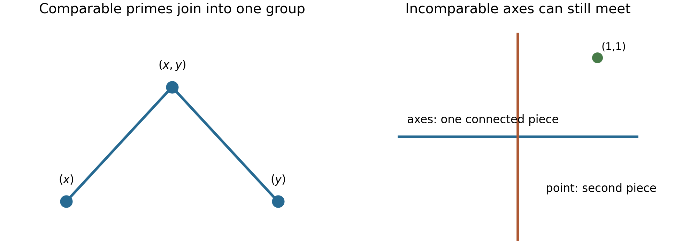

# Primary ideals and isolated components

*Written by GPT-6.1 Sol (OpenAI) in Codex at Ultra reasoning effort, October 2026. Self-checked by the writing AI, GPT-6.1 Sol, at Ultra. No independent review is claimed. Public domain (CC0).*

An irreducible intersection decomposition need not be unique. We now ask what can still be recovered without choosing a decomposition. Localization singles out groups of primary components. A second construction groups associated primes by containment; a third groups the actual connected pieces of the spectrum. These are different kinds of separation.

We assume a Noetherian commutative ring \(R\) with identity. We use the finite irreducible decompositions proved in [Chain conditions and irreducible decompositions](chain-conditions-and-irreducible-decompositions.md). The earlier lesson [Associated primes and primary decomposition](https://kokunoyumeto.github.io/open-math-courses-public/courses/AG-CA/AG-CA-04.html) contains actual proofs of associated-prime existence and zero divisors (Theorem 1.2), submodule and direct-sum inclusions (Proposition 2.1), finiteness (Theorem 2.2), localization and minimal support (Theorems 3.1–3.2), primary modules and ideals (Proposition 4.1 and Theorem 4.2), primary-decomposition existence (Theorem 5.3), and uniqueness (Theorems 6.1–6.2). We use those results with their Noetherian and finite-module hypotheses. Finite prime avoidance and the Chinese remainder construction are proved below. [Spectra of rings](https://kokunoyumeto.github.io/open-math-courses-public/courses/AG-CA/AG-CA-01.html), Theorem 1.2, Proposition 2.1 and Theorems 4.1 and 4.3, proves the radical correspondence, closed-set operations and finite irreducible components; [Noetherian and Artinian rings](https://kokunoyumeto.github.io/open-math-courses-public/courses/AG-CA/AG-CA-03.html), Proposition 2.2, proves nilradical nilpotence. Freely accessible references are Noether's English working edition and the Stacks project.

## 1. The chain argument that makes a component primary

An ideal \(Q\ne R\) is **primary** if \(ab\in Q\) and \(b\notin Q\) imply \(a^n\in Q\) for some \(n\ge1\). Its radical is a prime. For a submodule \(N\ne M\), the corresponding condition is that \(av\in N\), \(v\notin N\) imply \(a^nM\subset N\). Equivalently, multiplication by each scalar on \(M/N\) is either injective or nilpotent. These conditions agree for ideals, using finite generation to pass from individual powers to a common power.

**Theorem 1.1 (Noether's primary lemma).** An irreducible submodule of a Noetherian module over a commutative ring is primary.

**Proof.** Pass to \(U=M/N\), so zero is irreducible and \(U\) is uniform. Fix \(a\in R\) whose multiplication map has a nonzero kernel. The ascending chain \(0:_U a^j\) stabilizes, say at \(j=h\ge1\). The submodules \(a^hU\) and \(0:_U a^h\) intersect trivially: if \(a^hu\) lies in the latter, then \(a^{2h}u=0\), so stabilization implies \(a^hu=0\). The kernel submodule is nonzero. Uniformity therefore forces \(a^hU=0\). Thus every noninjective scalar is nilpotent on \(U\), as required. \(\square\)

In the ideal version, if \(ab\in Q\) with \(b\notin Q\), choose \(h\) with \((Q:a^h)=(Q:a^{2h})\). Then

\[
Q=(Q+a^hR)\cap(Q+bR).
\]

For if \(z=q+a^hr=q'+bs\), multiplication by \(a\) gives \(a^{h+1}r\in Q\), since \(ab\in Q\). Stabilization gives \(a^hr\in Q\), so \(z\in Q\). Irreducibility and \(b\notin Q\) force \(a^h\in Q\). This is the scalar form of the same proof.

Together with finite irreducible decompositions this gives Noether's existence route to primary decomposition. The associated-prime route and the classical uniqueness statements are the cited prerequisite theorems. We now prove the further uniqueness statements specific to this lesson.

## 2. Selecting an entire isolated set

**Lemma 2.0 (finite prime avoidance).** Let \(J,I_1,\ldots,I_r\) be ideals of a commutative ring, with all but at most two of the \(I_i\) prime. If \(J\not\subset I_i\) for every \(i\), there is \(a\in J\setminus\bigcup_i I_i\). In particular, if an ideal is contained in a finite union of prime ideals, it is contained in one of them.

**Proof.** For \(r=0\), choose \(a=0\); for \(r=1\), the assertion is the hypothesis. For \(r=2\), choose \(x\in J\setminus I_1\) and \(y\in J\setminus I_2\). If neither already avoids both, then \(x\in I_2\) and \(y\in I_1\), and \(x+y\) avoids both by subtraction.

Induct on \(r\). Delete an ideal contained in another: this changes neither the union nor the desired conclusion. If deletion reduces the list, use induction. Otherwise there are no inclusions, and for \(r\ge3\) we may put a prime ideal last. Induction gives \(x\in J\) outside \(I_1,\ldots,I_{r-1}\). If \(x\notin I_r\), it works. Otherwise choose \(b\in J\setminus I_r\) and, for each \(i<r\), choose \(b_i\in I_i\setminus I_r\), using noncontainment. Set \(y=b\prod_{i<r}b_i\). Then \(y\in J\cap\bigcap_{i<r}I_i\), while primality gives \(y\notin I_r\). For \(i<r\), membership of \(x+y\) in \(I_i\) would force \(x\in I_i\); membership in \(I_r\) would force \(y\in I_r\). Thus \(x+y\) avoids the entire list. The last assertion is the contrapositive for a list of prime ideals. \(\square\)

Fix a primary decomposition

\[
I=\bigcap_{\mathfrak p\in P}Q_{\mathfrak p},
\qquad P=\operatorname{Ass}(R/I),
\]

with distinct radicals and no redundant component. A subset \(S\subset P\) is **isolated** if \(\mathfrak q\subset\mathfrak p\), \(\mathfrak q\in P\), \(\mathfrak p\in S\) imply \(\mathfrak q\in S\). This is downward closure within the finite associated set; it does not ask that every prime of \(R\) below \(\mathfrak p\) belong to \(P\).

**Theorem 2.1.** Put \(T=R\setminus\bigcup_{\mathfrak p\in S}\mathfrak p\). Then

\[
I_S:=\bigcap_{\mathfrak p\in S}Q_{\mathfrak p}
=\{r\in R:r/1\in I R_T\}.
\]

In particular \(I_S\) is independent of the chosen primary decomposition.

**Proof.** The set \(T\) is multiplicatively closed. For a \(\mathfrak q\)-primary ideal \(Q\), if \(T\cap\mathfrak q\ne\varnothing\), a power of an element of this intersection lies in \(Q\), so \(QR_T=R_T\). If \(T\cap\mathfrak q=\varnothing\), the contraction of \(QR_T\) is exactly \(Q\): from \(tr\in Q\) and \(t\notin\mathfrak q\), primaryness gives \(r\in Q\).

The primes of \(P\) disjoint from \(T\) are exactly those in \(S\). One inclusion is immediate. For the other, disjointness says \(\mathfrak q\subset\bigcup_{\mathfrak p\in S}\mathfrak p\). Lemma 2.0 puts \(\mathfrak q\) inside one of those primes, and isolation puts it in \(S\). Localization preserves finite intersections, so only the selected components survive, with their contractions unchanged. This proves the formula. If \(S=\varnothing\), take \(T=R\), which contains zero; the localization is zero and the contraction is \(R\), agreeing with the empty intersection. \(\square\)

For \((x^2,xy)\), the associated primes are \((x)\subset(x,y)\). The set consisting of \((x)\) is isolated, and localization gives \(I_{\{(x)\}}=(x)\). The singleton consisting of \((x,y)\) is not isolated; the component \((x^2,y+ax)\) can vary.

## 3. Relative primality is directional

Define the ideal quotient \((B:A)=\{r:rA\subset B\}\). Say that \(A\) is **relatively prime to \(B\)** if \((B:A)=B\). This means that the entire ideal \(A\) kills no nonzero element of \(R/B\). Say **mutually relatively prime** when both directions hold. These words do not mean comaximal.

**Theorem 3.1.** For \(B\ne R\), the following are equivalent:

1. \((B:A)=B\).
2. \(A\) is contained in no prime of \(\operatorname{Ass}(R/B)\).
3. No prime of \(\operatorname{Ass}(R/A)\) is contained in a prime of \(\operatorname{Ass}(R/B)\).

**Proof.** If \(A\subset\mathfrak p=\operatorname{Ann}(v)\) for a nonzero \(v\in R/B\), then \(Av=0\), so the ideal quotient is larger than \(B\). Conversely, if \(K=0:_{R/B}A\ne0\), it has an associated prime \(\mathfrak p\), and an element of \(K\) with that annihilator is also in \(R/B\). Necessarily \(A\subset\mathfrak p\). This proves equivalence of the first two conditions. For any prime \(\mathfrak p\) containing \(A\), there is a minimal prime \(\mathfrak q\) over \(A\) contained in \(\mathfrak p\) (Spectra of rings, Lemma 4.2), and this \(\mathfrak q\) is associated to \(R/A\) (Associated primes and primary decomposition, Theorem 3.2). Conversely every associated prime of \(R/A\) contains \(A\). These facts prove equivalence with the third condition, including \(A=R\), whose associated set is empty. \(\square\)

Lemma 2.0 also provides a single element of \(A\) outside all associated primes of \(R/B\) when the conditions hold. Such an element acts injectively on \(R/B\).

For \(A=(x^2,y)\) and \(B=(x)\), the element \(y\in A\setminus(x)\) proves relative primality to \(B\). The reverse fails: \(x\notin A\), but \(xB\subset A\). Equivalently the prime \((x)\) associated to \(B\) lies inside \((x,y)\), which is associated to \(A\).

## 4. A graph on the associated primes

Form the finite **comparability graph** on \(P=\operatorname{Ass}(R/I)\): connect distinct primes when one contains the other. Let its connected components be \(S_1,\ldots,S_t\). Every \(S_i\) is isolated, because any containment is an edge. Thus each \(I_{S_i}\) in Theorem 2.1 is canonical.

**Theorem 4.1 (Noether's relative decomposition).** Every proper ideal has a unique unordered decomposition

\[
I=I_{S_1}\cap\cdots\cap I_{S_t}
\]

into mutually relatively prime proper ideals which admit no further such decomposition. Its components are indexed by the connected components of the comparability graph.

**Proof.** Group a primary decomposition by the \(S_i\). Each grouped decomposition stays irredundant within its group, since deleting a primary component there would also delete it from the original decomposition. The first uniqueness theorem for primary decomposition therefore gives \(\operatorname{Ass}(R/I_{S_i})=S_i\). There are no containments between different \(S_i\), so Theorem 3.1 proves mutual relative primality.

We verify that every mutually relatively prime decomposition comes from grouping in this fashion. Suppose \(I=\bigcap_i A_i\), with all \(A_i\ne R\) and mutually relatively prime. Put \(B_i=\bigcap_{j\ne i}A_j\). For any \(\mathfrak p\in\operatorname{Ass}(R/A_i)\), every \(A_j\), \(j\ne i\), is not contained in \(\mathfrak p\). Choosing one element outside \(\mathfrak p\) from each and multiplying shows \(B_i\not\subset\mathfrak p\). If \(v\in R/A_i\) has annihilator \(\mathfrak p\), choose \(b\in B_i\setminus\mathfrak p\). Then \(bv\ne0\), still with annihilator \(\mathfrak p\). Its representative in \(B_i/I\subset R/I\) proves \(\mathfrak p\in P\). The diagonal injection \(R/I\hookrightarrow\bigoplus R/A_i\) proves the reverse inclusion for their union. Theorem 3.1 also says their associated sets are disjoint and have no containment between them. Hence those sets partition \(P\) into unions of entire graph components; each is isolated.

Let \(S=\operatorname{Ass}(R/A_i)\) and localize at \(T=R\setminus\bigcup_{\mathfrak p\in S}\mathfrak p\). The other factors become the unit ideal: a minimal prime over any such factor cannot be contained in any member of \(S\); Lemma 2.0 gives an element of that factor in \(T\). The factor \(A_i\) contracts unchanged, by its primary decomposition and Theorem 2.1 applied to the full set \(S\). Thus \(A_i=I_S\). A factor with two graph components splits further by the already constructed decomposition. A factor with one component cannot split, since the same argument would separate that connected graph. This proves both irreducibility and uniqueness. \(\square\)

For an explicit pair of comparable pairs, use

\[
I=(x^2,xy)\cap((x-1)^2,(x-1)(y-1))\subset k[x,y].
\]

The first associated pair is \((x)\subset(x,y)\); the second is \((x-1)\subset(x-1,y-1)\). The two factors contain \(x^2\) and \((x-1)^2\), respectively. These polynomials are coprime in \(k[x]\), so Bézout makes the factors comaximal. The quotient is their product, and its associated set is exactly the two indicated pairs. The relative decomposition has the two displayed factors.

## 5. Separating connected spaces

**Lemma 5.0 (Chinese remainders).** Pairwise comaximal ideals \(J_1,\ldots,J_s\) satisfy

\[
R/\bigcap_iJ_i\cong\prod_iR/J_i,
\qquad \bigcap_iJ_i=\prod_iJ_i.
\]

**Proof.** For two ideals \(A+B=R\), choose \(a\in A,b\in B\) with \(a+b=1\). If \(z\in A\cap B\), then \(z=za+zb\in AB\), so \(A\cap B=AB\). Given residues represented by \(u,v\), the element \(ub+va\) realizes them modulo \(A,B\); the map's kernel is their intersection. For each \(i\) in a finite pairwise comaximal list, choose \(b_{ij}\in J_j\) congruent to \(1\) modulo \(J_i\), for \(j\ne i\). Their product \(e_i\) is \(1\) modulo \(J_i\) and \(0\) modulo every other ideal. Thus \(\sum_i e_i u_i\) realizes arbitrary residues. The same products show \(J_i+\prod_{j\ne i}J_j=R\), so the two-ideal intersection identity proves the product formula by induction. \(\square\)

An idempotent \(e\) is **primitive** if it is nonzero and cannot be written as \(f+g\) with nonzero idempotents \(f,g\) satisfying \(fg=0\).

**Theorem 5.1 (Noether's coprime decomposition).** A proper ideal \(I\) has a unique unordered decomposition as a product of pairwise comaximal proper ideals having no further such factorization. These factors correspond to the connected components of \(\operatorname{Spec}(R/I)\) and to its primitive nonzero idempotents.

**Proof.** Write \(A=R/I\). A Noetherian spectrum has finitely many irreducible components, the sets \(V(\mathfrak p)\) for its minimal primes. Form a graph on these components, with an edge when they intersect. The union in each graph component is connected: each irreducible space is connected, and adjoining a connected space meeting the preceding union preserves connectedness. These finitely many unions are mutually disjoint closed subsets, hence also open. They are exactly the connected components.

We give the algebraic passage from a clopen partition \(\operatorname{Spec}(A)=V(J)\sqcup V(K)\). Disjointness yields \(J+K=A\), and covering yields \(JK\subset\sqrt0\). The nilradical of a Noetherian ring is nilpotent: it is finitely generated by nilpotents, and a sufficiently long product of its generators vanishes. Choose \(h\) with \((JK)^h=0\). The ideals \(J^h,K^h\) remain comaximal, since expand \((a+b)^{2h-1}=1\) for \(a+b=1\), \(a\in J,b\in K\). Every term belongs to one of those powers. Their intersection is their product, which is zero. Chinese remainders therefore give \(A\cong A/J^h\times A/K^h\). The element corresponding to \((1,0)\) is idempotent.

Conversely an idempotent \(e\) gives \(A\cong eA\times(1-e)A\) and the clopen partition \(D(e)\sqcup D(1-e)\). The idempotent for a specified clopen subset is unique. If idempotents \(e,f\) have the same values at every prime, then \(e(1-f)\) and \(f(1-e)\) are nilpotent idempotents and therefore zero, so \(e=f\). Thus connected components give unique orthogonal primitive idempotents \(e_i\), with sum one. Put \(J_i=\ker(A\to e_iA)=(1-e_i)A\), and take their inverse images in \(R\). They are pairwise comaximal, their intersection and product are \(I\), and their quotients are connected. Any other factorization gives another clopen partition and hence must group these components; irreducibility of its factors forbids grouping more than one. \(\square\)

Relative irreducibility implies coprime irreducibility, because comaximal factors are mutually relatively prime. The reverse fails for \((xy)\). Its associated primes \((x),(y)\) are incomparable, so \((xy)=(x)\cap(y)\) is a relative decomposition. Yet its spectrum is connected: the two axes meet at the origin. Thus \((xy)\) has no nontrivial comaximal factorization.

For

\[
I=(x)\cap(y)\cap(x-1,y-1),
\]

the axes and the point \((1,1)\) are separate connected components. The coprime decomposition is \(I=(xy)(x-1,y-1)\): modulo the point ideal, \(xy=1\), so the factors are comaximal. In \(R/I\), \(xy\) is the idempotent equal to zero on the axes and one at the point; \(1-xy\) is the other primitive idempotent. The relative decomposition has three factors, since its three associated primes are incomparable. The comaximal decomposition has two.

For the Artinian ring \(k[\epsilon]/(\epsilon^2)\times k[\delta]/(\delta^3)\), the two primitive idempotents are \((1,0),(0,1)\). Its zero ideal is the intersection and product of the two projection kernels. Each factor quotient is local and therefore connected.

*Figure 1.* Left: the comparability graph for \((x^2y,xy^2)=(x)\cap(y)\cap(x^2,y^2)\); the embedded origin joins the two minimal primes into one relative group. Right: the geometric example of the axes and \((1,1)\) from Section 5 has two connected pieces. These depict different ideals and different tests. The graph edges mean prime containment; the crossing axes mean actual intersection of closed sets. The proofs are Theorems 4.1 and 5.1. Original diagram, CC0; rendered DejaVu glyphs retain their font licence.

## 6. Exercises

1. **Basic.** For \((x^2,xy)\), verify the family \((x)\cap(x^2,y+ax)\), identify its associated primes, and state which singleton set is isolated.
2. **Intermediate.** Derive Theorem 3.1 using the zero-divisor theorem and prime avoidance, rather than associated primes of \(0:_{R/B}A\).
3. **Intermediate.** Find the comaximal decomposition and primitive idempotents for the axes together with \((1,1)\).
4. **Intermediate.** Construct an ideal with exactly three associated primes \(\mathfrak p_1\subsetneq\mathfrak p_2\) and \(\mathfrak p_3\) incomparable with both; compute its relative decomposition.
5. **Advanced.** Prove that \(I\) has no nontrivial comaximal factorization exactly when \(\operatorname{Spec}(R/I)\) is connected. Explain why the same conclusion does not use the comparability graph alone.

## 7. Solutions

**1.** The calculation in the preceding lesson gives equality and irredundancy. The first factor is prime, and the second quotient is \(k[x]/(x^2)\), so its unique associated prime is \((x,y)\). The first uniqueness theorem gives associated set \(\{(x),(x,y)\}\). Only \(\{(x)\}\) is an isolated singleton. Its component is fixed; the other varies.

**2.** If \(A\) is contained in none of the finitely many associated primes of \(R/B\), avoidance gives \(a\in A\) outside their union. The zero-divisor theorem makes multiplication by \(a\) injective. Thus any element killed by the whole ideal \(A\) is zero. If \(A\subset\mathfrak p\) for an associated prime, its witnessing element is killed by all of \(A\), giving the converse. Minimal primes over \(A\) supply the third equivalent condition as in Theorem 3.1.

**3.** The factors are \((xy)\) and \((x-1,y-1)\). Since \(1-xy\) belongs to the point ideal, their sum is \(R\). Their quotients are connected (crossing axes and a point). Modulo \(I\), \((xy)^2-xy=xy(xy-1)\in I\), so \(xy\) is idempotent; \(1-xy\) is its complement. Both are nonzero and primitive because their factors have connected spectra.

**4.** Take \(I=(x^2,xy)\cap(x-1,y-1)\). The factors are comaximal because \(x^2\) evaluates to one at \((1,1)\). The first quotient has associated primes \((x)\subset(x,y)\), and the second has \((x-1,y-1)\). No containment links the point prime to the first pair: \(x\) does not vanish at the point, while \(x-1\) is in neither prime of that pair. Thus Theorem 4.1 gives exactly the displayed two relative factors.

**5.** A comaximal factorization gives a nontrivial product of quotient rings and hence a clopen partition. A clopen partition gives a nontrivial idempotent by the explicit nilpotence and Chinese-remainder construction in Theorem 5.1. Its projection kernels lift to a nontrivial comaximal factorization. The comparability graph misses intersections of incomparable components: \((x)\) and \((y)\) are incomparable but their closed sets meet at \((x,y)\). Connectedness of the spectrum uses intersections of irreducible components, not only containments among associated primes.

## In Noether's words

Sections 4–8 of [Ideal Theory in Ring Domains, work 19](https://github.com/KokunoYumeto/emmy-noether-en/blob/main/source/Noether_English_ED0014.tex) distinguish primary components, directional relative primality and coprimality. Definition V and Theorems X–XII govern the relative decomposition; Section 7 treats isolated ideals; Section 8 treats coprime factors. The modern localization formulation above fixes which direction of prime containment is meant. [The German authority](https://doi.org/10.5281/zenodo.21908301) accompanies the English edition.

## References

* Emmy Noether, *Idealtheorie in Ringbereichen*, 1921, Sections 4–8. [Free English working edition, work 19](https://github.com/KokunoYumeto/emmy-noether-en/blob/main/source/Noether_English_ED0014.tex), a machine-assisted translation with the original bibliographic information.
* The Stacks project authors, [associated primes, Tag 00L9](https://kokunoyumeto.github.io/stacks-zh-hans-cn/en/algebra.html#section-ass), [prime avoidance, Tag 00DS](https://kokunoyumeto.github.io/stacks-zh-hans-cn/en/algebra.html#lemma-silly), [Artinian decomposition, Tag 00JA](https://kokunoyumeto.github.io/stacks-zh-hans-cn/en/algebra.html#lemma-product-local). These AI Integrated Stacks Project links use the edition described in the course introduction. No primary-decomposition theorem is attributed to a Stacks tag.

## Editable sources

Complete source archive · Complete course in LaTeX · This lesson in LaTeX. The archive includes all five lesson texts, the figures and their reproducible source.
