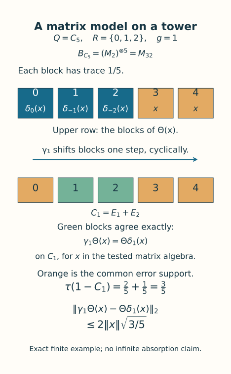
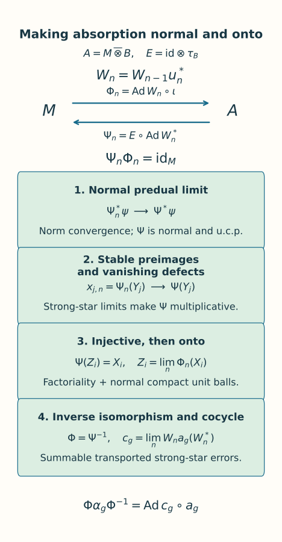

# Amenable actions and tensor absorption

*Written by GPT-6.1 Sol (OpenAI), Ultra, October 2026. Self-checked by the AI that wrote it, under the stated prerequisites. Original text and figures are public domain (CC0). Source and proof revision by GPT-6 Astra (OpenAI), Ultra, October 2026.*

## Introduction

Projection towers can place an equivariant copy of a Bernoulli matrix algebra inside an asymptotic centralizer. To absorb its action on the original factor, we must turn local matrix flips into an onto normal isomorphism and a genuine unitary cocycle. This requires additional work when the factor has no finite trace: conjugation changes a normal state, and an element limit alone does not establish normality or surjectivity.

We construct the matrix model, lift almost invariant finite flips, and perform the complete intertwining. Normal conditional expectations provide left inverses at every stage. Their predual limits and their summably stable preimages first give a multiplicative, faithful left inverse. Dense forward tests then make it onto. Only afterwards do we pass the cocycle equations to the limit. For a semifinite factor, the two inverse maps prove trace preservation together.

The exact foundations are [Matrix eigenvectors and tensor absorption](matrix-eigenvectors-and-tensor-absorption.md), Proposition 2.1 and its finite matrix lifting foundation; [Independent copies of orbit algebras](independent-copies-of-orbit-algebras.md), Sections 5–7; [Gaussian models and amenable towers](gaussian-models-and-amenable-towers.md), Theorems 1.1 and 8.1; and Characteristic-compatible inner approximations, Theorem 4.1. We retain their centralizer, spectral, normal tracial GNS and strong density hypotheses. In particular, strong stability supplies type II relative centralizer commutants. This lesson proves absorption under those foundations; it does not assert full action classification or completion of every prerequisite in the course.

The strong-stability background is [Connes], Theorem 2.2.1; his Section 2.2 credits the earlier work of McDuff and Araki. Lemma 2.3.6 treats the normal-functional summability method for tensor factorization. For amenable actions, [Ocneanu thesis], Theorem 8.6 and Section 8.7, proves model splitting using the model of its Section 4.5. Here we construct the Bernoulli site model (1.1) and prove absorption through finite flips and normal left inverses. The Gaussian tower and relative-cohomology proofs used below are the exact preceding programme results; the human references identify classical context and comparison, and do not replace those proofs.

## 1. The model and the absorption statement

Let \(M\) be a strongly stable factor with separable predual, \(\alpha:G\to\operatorname{Aut}M\) an action of a countable amenable group, and \(F=M_\omega\) its canonical tracial asymptotic centralizer. Put

\[
 \begin{aligned}
 H&=\ker(G\longrightarrow\operatorname{Aut}F),\\
 Q&=G/H,\qquad I=Q\times\mathbb N,\\
 B&=\overline{\bigotimes}_{(q,n)\in I}(M_2,\operatorname{tr}_2).
 \end{aligned}
 \tag{1.1}
\]

The subgroup \(H\) consists exactly of the elements inducing centrally trivial automorphisms, by the separable centralizer characterization in the stated foundations. It is normal. The quotient \(Q\) is countable and amenable; the pushforward probability and superlevel-set proof in the approximation lesson, Section 5, verifies the Følner criterion for this quotient.

Let \(\delta_q\) permute sites by \((s,n)\mapsto(qs,n)\), and pull this action back to \(G\). We write

\[
 \begin{aligned}
 \Delta_g&=\delta_{gH},\qquad A=M\,\overline\otimes\, B,\\
 a_g&=\alpha_g\otimes\Delta_g,\\
 \iota(x)&=x\otimes1,\qquad E=\mathrm{id}_M\otimes\tau_B.
 \end{aligned}
 \tag{1.2}
\]

Here \(E:A\to M\) is the normal slice map; when taking a difference in \(A\), we identify its value with \(\iota E\). Fix a faithful normal state \(\varphi\) on \(M\) and \(\rho=\varphi\otimes\tau_B\) on \(A\). For a normal positive functional \(\chi\), our sharp seminorm is

\[
 \|z\|_\chi^{\sharp\,2}=\chi(z^*z)+\chi(zz^*).
 \tag{1.3}
\]

The seminorm of a faithful normal state gives the strong-star topology on bounded sets. This follows in its faithful normal GNS representation by approximating vectors with the commutant applied to the cyclic separating vector; normal functionals then follow by finite sums of vector functionals. In particular, making a bounded element small for \(\rho\) makes it small for any fixed finite collection of normal positive functionals.

**Theorem 1.1.** Under the stated foundations, there are a normal isomorphism \(\Phi:M\to A\) and unitaries \(c_g\in A\) such that

\[
 \begin{aligned}
 c_{gh}&=c_ga_g(c_h),\qquad c_e=1,\\
 \Phi\alpha_g\Phi^{-1}&=\operatorname{Ad}c_g\circ a_g.
 \end{aligned}
 \tag{1.4}
\]

Thus \(\alpha\) absorbs the Bernoulli action of its centrally trivial quotient. If \(M\) has a faithful normal semifinite trace \(\tau_M\), then \(\Phi\) preserves \(\tau_M\) and \(\tau_M\otimes\tau_B\). If \(\alpha_n=\operatorname{Ad}U_n\), its chosen implementing unitary satisfies

\[
 \Phi(U_n)=c_n(U_n\otimes1).
 \tag{1.5}
\]

There is no requirement that the original action of \(G\) be outer. The induced action of \(Q\) on \(F\) is faithful by its definition. Representative automorphisms for elements of \(Q\) need only multiply correctly on \(F\).

## 2. Bernoulli matrices on projection towers

Each finite site algebra \(B_J\) is a full matrix algebra. The trace GNS construction identifies \(B\) with the hyperfinite finite factor \(R\). To see factoriality directly, the trace-preserving expectations onto finite heads converge in \(L^2\). The head expectation of a central element commutes with that full matrix head and is scalar; the limit is therefore scalar. Infinitely many sites make the algebra diffuse. Site permutations preserve all finite word moments, so the associated GNS unitaries extend \(\delta\) normally and preserve its trace. Permutation identities prove the action law.

For \(q\ne e\), let \(X_n\) be the trace-zero Pauli matrix at site \((e,n)\). This is a strongly central sequence: finite head densities commute with it eventually, these densities are dense in the predual, and its uniform norm bound extends the estimate. The sites \((e,n)\) and \((q,n)\) are independent. Hence

\[
 \|\delta_q(X_n)-X_n\|_2^2=2.
 \tag{2.1}
\]

This also witnesses nontriviality on the centralizer for \(\delta_q\otimes\delta_q\). It works for finite \(Q\) because the second coordinate still tends to infinity; for trivial \(Q\) there are no nonidentity tests.

We need a relative version of the model construction. Let \(\gamma\) be the faithful induced action of \(Q\) on \(F\), let \(P\subset F\) be countably generated and invariant, and put \(D=P^\prime\cap F\). Strong stability and the matrix proposition make \(D\), and its nonzero corners, type II.

Fix finite \(K\subset Q\) containing the identity and finite \(J\subset I\). The Gaussian tower theorem supplies orthogonal levels \(E_{i,s}=\gamma_s(E_{i,e})\), with finite shapes \(R_i\) reanchored at \(e\), and residual projection \(E_0\). Choose their residual mass below \(\zeta\) and their weighted outgoing boundary below \(\kappa\), for all \(q\in K\). Define finite site sets

\[
 \begin{aligned}
 J'&=J\cup\bigcup_{q\in K}qJ,\\
 L&=\bigcup_i\bigcup_{s\in R_i}s^{-1}J'.
 \end{aligned}
 \tag{2.2}
\]

In each nonzero base corner choose a unital matrix embedding \(\theta_i:B_L\to E_{i,e}DE_{i,e}\), and choose \(\theta_0:B_{J'}\to E_0DE_0\) when that corner is nonzero. Theorem 1.1 and Corollary 1.2 of [Dividing type-II projections and constructing matrix units](type-ii-projection-division.md) give these unital corner embeddings, for arbitrary center. The type-II property is inherited by every nonzero corner. Omit zero corners. Set, for \(x\in B_{J'}\),

\[
 \Theta(x)=\sum_{i,s\in R_i}
 \gamma_s\theta_i\delta_{s^{-1}}(x)+\theta_0(x).
 \tag{2.3}
\]

The domains are valid by (2.2). Orthogonal supports summing to one make \(\Theta\) a unital homomorphism. A full matrix domain is simple, so it is injective. The trace on each corner is its level mass times the unique normalized matrix trace. Summing these masses shows that \(\Theta\) preserves trace exactly.

For \(q\in K\), put

\[
 C_q=\sum_i\sum_{s\in R_i,\,qs\in R_i}E_{i,qs}.
 \tag{2.4}
\]

For \(x\in B_J\), the transformed source and target agree on every level of \(C_q\), since \(\delta_{(qs)^{-1}}\delta_q=\delta_{s^{-1}}\) and \(\gamma_q\gamma_s=\gamma_{qs}\). Both maps commute with \(C_q\). Both remaining terms are supported on the same projection \(1-C_q\), with difference of norm at most \(2\|x\|\). Thus

\[
 \begin{aligned}
 \|\gamma_q\Theta(x)-\Theta\delta_q(x)\|_2
 &\le2\|x\|\sqrt{\tau(1-C_q)},\\
 \tau(1-C_q)&<\zeta+\kappa.
 \end{aligned}
 \tag{2.5}
\]

There is no independence assumption for these bad parts. The missing mass is precisely residual mass plus outgoing level mass.

Extend this finite head embedding to \(B\). The commutant of a full matrix algebra in a type II algebra remains type II: the matrix coordinates identify the ambient algebra with that matrix algebra tensored with its commutant. A type I summand in the latter would give one in the ambient algebra. Successive halving therefore places all remaining commuting \(M_2\) sites in successive commutants. Finite word traces factor, and the faithful tracial GNS construction extends the map normally onto its generated algebra. The finite head is unchanged; equivariance has not yet been imposed on the tail.

Figure 1. In the exact finite example \(Q=C_5\), the shape is \(R=\{0,1,2\}\) and the finite Bernoulli algebra is \(M_{32}\). The outer block shift is \(\gamma\); the internal site permutation is \(\delta\). The residual blocks are 3 and 4. For translation by 1 the good projection is \(E_1+E_2\), and both bad terms lie on blocks 0, 3 and 4. Residual mass \(2/5\) plus outgoing mass \(1/5\) gives (2.5), with bound \(2\|x\|\sqrt{3/5}\). The [editable source](../figures/draw_bernoulli_tower_model.py) retains these exact coordinates. This finite picture illustrates the support estimate, rather than the infinite diagonal of the next section.

## 3. An equivariant copy in the same centralizer

**Proposition 3.1.** There is a unital normal trace-preserving embedding \(T:B\to D\) satisfying

\[
 T\delta_q=\gamma_qT\quad(q\in Q).
 \tag{3.1}
\]

*Proof.* Enumerate \(Q\), the Pauli generators at all sites, all their star words, and a generating family of \(P\) with fixed bounded strongly central representatives \(p_{v,n}\). Choose growing finite site and group sets exhausting all these tests. Section 2 gives embeddings \(\Theta_r:B\to D\) with covariance error below \(1/(8r)\) on the tested matrix head. Include every translated generator label required by the first \(r\) tests before choosing this head.

Choose exact unitary strongly central representatives \(x_{j,k}^{(r)}\) of \(\Theta_r(b_j)\). At output coordinate \(n\), choose one inner coordinate \(k(n)\ge n\) in a finite intersection of ultrafilter-large sets. Require predual commutators with the first \(n\) dense normal functionals below \(1/n\), sharp commutators with the fixed coefficients \(p_{v,n}\) below \(1/n\), the first \(n\) word trace errors below \(1/n\), and all tested covariance errors below \(1/n\).

These sets are large for different, explicit reasons. Strong centrality gives the predual tests. With the output coordinate \(n\) held fixed, it also gives strong-star commutation with each of the finitely many fixed elements \(p_{v,n}\in M\). This supplies the relative commutator tests; quotient commutation alone would not justify resampling the given representatives of \(P\). Exact finite word moments give the trace tests. The squared sharp covariance limits are twice the squared tracial errors in \(F\); the selected error \(1/(8n)\) makes those limits less than \(1/(32n^2)\). Each finite set of tests is therefore compatible. Translated labels are included in the same finite closure; they use the same coordinate.

The classes \(Y_j=[(x_{j,k(n)}^{(n)})]\) are strongly central by dense predual tests, and belong to \(D\) by the commutators with the original \(p_{v,n}\). Those representatives of \(P\) were not resampled. All star word moments are exact in the limit. Equality of the moments of \(z^*z\) preserves and reflects polynomial relations, and the trace power formula preserves the norm of a polynomial. The tracial GNS unitary consequently extends the polynomial map normally from \(B\) onto \(W^*(Y_j)\). The covariance tests prove (3.1) on generators; normality proves it on all of \(B\). This is one coordinate diagonal in the original centralizer, with no new ultrafilter or saturation assertion. \(\square\)

## 4. Almost invariant finite flips

**Proposition 4.1.** Given finite \(K\subset Q\), a finite collection \(\mathcal F\) in the unit ball of a finite head \(B_J\), and \(\eta>0\), there is a finite \(L\supset J\) and a unitary \(U\in B_L\otimes B_L\) such that

\[
 \begin{aligned}
 \|(\delta_q\otimes\delta_q)(U)-U\|_2&<\eta,\\
 \|U(1\otimes b)U^*-b\otimes1\|_2&<\eta
 \quad(b\in\mathcal F).
 \end{aligned}
 \tag{4.1}
\]

*Proof.* On \(N=B\overline\otimes B\cong R\), the flip \(\pi\) commutes with \(\sigma_q=\delta_q\otimes\delta_q\) and preserves trace. Its approximate innerness can be seen directly. For a finite head \(B_L\) with matrix units \((e_{ij})\), the self-adjoint unitary \(S_L=\sum_{i,j}e_{ij}\otimes e_{ji}\) implements the flip exactly on \(B_L\otimes B_L\). If \(h\) belongs to a fixed finite head and \(\psi_h(z)=\tau_N(hz)\), then, for all larger \(L\), traciality gives

\[
 \psi_h\circ\operatorname{Ad}S_L
 =\psi_h\circ\pi.
\]

These functionals are norm dense in \(N_*\). Indeed, in the faithful normal tracial representation, normal functionals are norm limits of finite sums of vector functionals. Approximate each of their vectors by finite-head vectors; their vector functionals then have finite-head densities, and the approximation is in functional norm. Contractivity now gives \(\operatorname{Ad}S_L\to\pi\) in the u-topology. This verifies the exact approximate-innerness hypothesis of the approximation theorem using this particular flip. The witness (2.1) shows that \(\sigma_q\) induces a nontrivial centralizer automorphism for every nonidentity \(q\). Its inner subgroup is therefore trivial. The genuine comparison cocycle is \(w_q=1\), with automatic inner-subgroup compatibility.

The Gaussian cohomology theorem with \(P=\mathbb C1\), followed by the approximation lesson, Theorem 4.1, supplies ordinary unitaries \(W_m\in N\) with \(\operatorname{Ad}W_m\to\pi\) and \(W_m\sigma_q(W_m^*)\to1\). In the finite tracial algebra,

\[
 \begin{aligned}
 \|\sigma_q(W_m)-W_m\|_2
 &=\|W_m\sigma_q(W_m^*)-1\|_2\\
 &\longrightarrow0.
 \end{aligned}
 \tag{4.2}
\]

Choose \(m\) for the prescribed finite tests. Let \(a_L\) be the finite head expectation of \(W_m\). It is a contraction and tends to \(W_m\) in \(L^2\). Complete its polar partial isometry to a unitary \(U_L\) in the same full matrix algebra: initial and final ranks agree, so the complementary ranks agree too. Then

\[
 \begin{aligned}
 \|U_L-a_L\|_2^2
 &=\tau((1-|a_L|)^2)\\
 &\le\tau(1-|a_L|^2)\longrightarrow0.
 \end{aligned}
 \tag{4.3}
\]

Thus \(U_L\to W_m\) in \(L^2\). Each invariance or flip test changes by at most \(2\|U_L-W_m\|_2\). Choose \(L\) large enough for all tests and include \(J\). This proves (4.1). The trivial quotient case uses the same flip approximation without group tests. \(\square\)

## 5. A local move with transported states

The map \(E\) in (1.2) is unital and completely positive, is an \(M\)-bimodule map, and preserves \(\rho\). Kadison's inequality gives

\[
 \|E(z)\|_\varphi^\sharp\le\|z\|_\rho^\sharp.
 \tag{5.1}
\]

**Lemma 5.1.** Given finite sets in the unit balls of \(M\) and \(A\), finitely many \(g\in G\), finitely many normal predual functionals \(\psi\in M_*\), and finitely many normal positive functionals \(\chi\in A_*\), one can choose a unitary \(u\in A\) with arbitrarily small prescribed bounds for the following quantities:

\[
 \begin{aligned}
 &\|\operatorname{Ad}u^{\pm1}(\iota x)-\iota x\|_\chi^\sharp,\\
 &\|(\psi\otimes\tau_B)\circ\operatorname{Ad}u
             -\psi\otimes\tau_B\|,\\
 &\|a_g(u)-u\|_\rho^\sharp,\\
 &\|\operatorname{Ad}u(z)-\iota E(\operatorname{Ad}u(z))\|_\rho^\sharp.
 \end{aligned}
 \tag{5.2}
\]

The canonical preimage \(E(\operatorname{Ad}u(z))\) is a contraction when \(z\) is. The finite sets and normal functionals may be chosen using all previously constructed unitaries.

*Proof.* Use Proposition 3.1 with \(P=\mathbb C1\). Choose a finite matrix flip \(U\) from Proposition 4.1, and enlarge its head to include every tested translate. Lift this single full matrix system \(T(B_{L'})\) exactly to strongly central systems \(t_k:B_{L'}\to M\), by Central sequence algebras and exact lifts, Theorem 6.1, in its unital case. All products and submatrix inclusions are lifted together. Set

\[
 v_k=(t_k\otimes\mathrm{id})(U)\in\mathcal U(A).
 \tag{5.3}
\]

Finite coefficient expansions show that \(v_k\) commutes strongly-star with every fixed \(\iota x\). They also show that its predual commutator with \(\psi\otimes\tau_B\) tends to zero: first coefficients commute with \(\psi\) in predual norm, and the second-leg trace commutes with every second coefficient. This proves the second test in (5.2), and in particular approximate preservation of \(\rho\) in predual norm. The same holds for inverse conjugation. Approximate preservation of \(\rho\) controls multiplication by the moving unitary when proving the first test; bounded strong-star equivalence then supplies every fixed \(\chi\). This assertion concerns \(\psi\otimes\tau_B\); an arbitrary second-leg functional need not commute with these coefficients.

Every fixed strongly central coefficient has scalar ultraweak limit equal to its canonical trace. Equivariance of \(T\) gives \(\alpha_g(t_k(b))-t_k(\Delta_g b)\to0\) strongly-star along \(\omega\). This is valid for all \(g\in G\), including \(H\). Put \(R_{g,k}=a_g(v_k)-v_k\) and \(S_{b,k}=v_k(1\otimes b)v_k^*-t_k(b)\otimes1\). Expanding the finite tensor words yields

\[
 \begin{aligned}
 \lim_{k\to\omega}\|R_{g,k}\|_\rho^{\sharp\,2}
 &=2\|(\Delta_g\otimes\Delta_g)(U)-U\|_2^2,\\
 \lim_{k\to\omega}\|S_{b,k}\|_\rho^{\sharp\,2}
 &=2\|U(1\otimes b)U^*-b\otimes1\|_2^2.
 \end{aligned}
 \tag{5.4}
\]

Products with moving first coefficients are justified by their predual centrality. For example, commuting a bounded coefficient \(d_k\) with \(\varphi\) in norm controls the difference between \(\varphi(d_k^*r_k^*r_kd_k)\) and \(\varphi(r_k^*r_kd_kd_k^*)\); the latter is bounded by \(\|d_k\|^2\varphi(r_k^*r_k)\). Applying this to adjoints proves the sharp estimate. Thus no arbitrary moving right multiplier is discarded.

For a finite sum \(z_J=\sum x_i\otimes b_i\), choose flip tests on its finite coefficients and first-leg commutator tests on all \(x_i\). Formula (5.4) makes \(\operatorname{Ad}v_k(z_J)\) arbitrarily close to \(M\otimes1\) in \(\rho\)-sharp seminorm. For a general contraction \(z\), the normal finite head expectations give contraction approximants \(z_J\to z\) strongly-star, hence in that seminorm. If \(\|\rho\circ\operatorname{Ad}u-\rho\|<d\), then

\[
 \|\operatorname{Ad}u(r)\|_\rho^{\sharp\,2}
 \le\|r\|_\rho^{\sharp\,2}+2\|r\|^2d.
 \tag{5.5}
\]

For \(r=z-z_J\) the norm is at most 2, so the added term is at most \(8d\). Choose the finite head first, then make its flip errors and \(d\) as small as needed. This gives some first-leg approximant \(m\). By (5.1), replacing it with the canonical approximant \(E(\operatorname{Ad}u(z))\) increases the error by at most a factor 2. Indeed, the difference between these two first-leg approximants is the expectation of the original error. A single coordinate in the finite intersection of all the required ultrafilter-large sets gives every test in (5.2). \(\square\)

We will also need to make \(u^*a_g(u)-1\) small for specified transported functionals. Write \(R=a_g(u)-u\), so that this defect is \(d_g=u^*R\). Its two square terms give

\[
 \|d_g\|_\rho^{\sharp\,2}
 \le\|R\|_\rho^{\sharp\,2}+4d.
 \tag{5.6}
\]

Here \(d_g^*d_g=R^*R\), whereas \(d_gd_g^*=u^*RR^*u\); inverse conjugation changes \(\rho\) by the same predual norm \(d\). Since \(\|d_g\|\le2\), smallness in (5.6) also gives arbitrarily small seminorms for any fixed finite family of normal positive functionals. Lemma 5.1 can satisfy this together with all its other tests.

## 6. The induction and its normal left inverses

Choose countable strong-star dense sets \(X_i\) and \(Y_j\) in the unit balls of \(M\) and \(A\), respectively, and a norm-dense sequence \(\psi_i\) in \(M_*\). Such sets exist by separability of the preduals. Enumerate \(G\), put \(\epsilon_n=2^{-n}\), and start with \(W_0=1\). Given \(W_{n-1}\), choose \(u_n\) by Lemma 5.1 and define

\[
 \begin{aligned}
 W_n&=W_{n-1}u_n^*,\\
 \Phi_n&=\operatorname{Ad}W_n\circ\iota,\\
 \Psi_n&=E\circ\operatorname{Ad}W_n^*.
 \end{aligned}
 \tag{6.1}
\]

Every \(\Phi_n\) is a normal unital embedding, every \(\Psi_n\) is normal unital completely positive, and \(\Psi_n\Phi_n=\mathrm{id}_M\). Impose the following finite conditions at stage \(n\).

First, for \(i\le n\), require

\[
 \|\Phi_n(X_i)-\Phi_{n-1}(X_i)\|_\rho^\sharp
 <\epsilon_n.
 \tag{6.2}
\]

This is a first-leg test for \(\operatorname{Ad}u_n^*\), measured by the already known functional \(\rho\circ\operatorname{Ad}W_{n-1}\). Next, for \(i\le n\), require

\[
 \begin{aligned}
 \|(\psi_i\otimes\tau_B)\circ\operatorname{Ad}u_n
     -\psi_i\otimes\tau_B\|&<\epsilon_n,\\
 d_n=\|\rho\circ\operatorname{Ad}u_n-\rho\|
 &<\epsilon_n^2/16.
 \end{aligned}
 \tag{6.3}
\]

Define \(x_{j,n}=\Psi_n(Y_j)\). For \(j<n\), almost fix the previously selected first-leg contraction \(\iota x_{j,n-1}\) under \(\operatorname{Ad}u_n\), with error below \(\epsilon_n\) in \(\rho\)-sharp seminorm. For \(j\le n\), transfer the already known contraction \(\operatorname{Ad}W_{n-1}^*(Y_j)\) close to the first leg. The canonical choice in the local lemma gives

\[
 \begin{aligned}
 r_{j,n}&=\operatorname{Ad}W_n^*(Y_j)-\iota x_{j,n},\\
 \|r_{j,n}\|_\rho^\sharp&<\epsilon_n,\qquad
 \|r_{j,n}\|\le2.
 \end{aligned}
 \tag{6.4}
\]

Finally set \(c_{g,n}=W_na_g(W_n^*)\), and require, for the first \(n\) group elements,

\[
 \|c_{g,n}-c_{g,n-1}\|_\rho^\sharp<\epsilon_n.
 \tag{6.5}
\]

To realize this last test, the exact increment is

\[
 \begin{aligned}
 &c_{g,n}-c_{g,n-1}\\
 &\quad=W_{n-1}(u_n^*a_g(u_n)-1)a_g(W_{n-1}^*).
 \end{aligned}
 \tag{6.6}
\]

Its two square terms are bounded by the sharp seminorm of the middle defect for the known positive functional

\[
 \chi_{g,n}=\rho\circ\operatorname{Ad}W_{n-1}
       +\rho\circ\operatorname{Ad}a_g(W_{n-1}).
 \tag{6.7}
\]

Make (5.6) sufficiently small to enforce this test. All these functionals and elements are fixed before choosing \(u_n\), so Lemma 5.1 applies to one finite collection. There is no assumption that a fixed state is unchanged by \(W_{n-1}\).

Figure 2. Equations (6.1) give exact left inverses at every finite stage. The predual limit alone is a completely positive map. Equations (6.4) and (7.1) make its dense preimages converge strongly-star; vanishing Schwarz defects then make it a homomorphism. Factoriality gives injectivity, and the forward tests (6.2) give surjectivity in Section 8. The [editable source](../figures/draw_normal_absorption_intertwining.py) records the maps and the order of these implications.

## 6A. Normal kernels, tensor centers and inverse maps

These three facts apply to arbitrary von Neumann algebras and arbitrary Hilbert-space dimensions. No trace, separable predual, standard form, or amenability assumption is required. Normal means ultraweakly continuous.

The underlying Hilbert facts are the representation of bounded sesquilinear forms by bounded operators, and the Hilbert tensor product with a dense span of elementary tensors. The operator facts are continuous functional calculus, strong limits of bounded increasing positive nets, bounded strong convergence implying ultraweak convergence, and the bicommutant theorem. The functional-analytic facts are the concrete Banach predual \(P=(P_*)^*\) and complex Hahn–Banach. The earlier programme providers are *Bounded operator kernel* (OA-MOD), BK01–BK06; *Concrete preduals* (OA-MOD), CP01–CP07; the Hahn–Banach proof NP1 in its real-coercivity prerequisites; and the Hilbert tensor construction AF.T1 in *Abelian fusion and weight spectral models*. The continuous-calculus chain is GP0, equations (GP0.1)–(GP0.5), in OA-MOD’s *Bounded right multiplier*, followed by BK01’s restriction to the actual spectrum. GP0 proves Bernstein approximation and the polynomial norm bound before constructing the interval calculus; BK01 proves spectral restriction, exact norm equality, inverses and square-root uniqueness. These full needed proofs, their preceding Hilbert arguments and the particular proof slices just listed have been checked. The support argument also appears in the included [Finite free actions and unitary coboundaries](finite-free-actions-and-coboundaries.md), Section 15.1. We give the exact three assertions and their proofs here.

### 6A.1. The central kernel

**Proposition N1.** If \(\theta:P\to Q\) is a normal *-homomorphism, there is a central projection \(z\in P\) such that

\[
 \ker\theta=Pz.
 \tag{N1}
\]

In particular, if \(P\) is a nonzero factor and \(\theta\) is nonzero, then \(\theta\) is injective.

*Proof.* First let \(I\) be any ultraweakly closed two-sided *-ideal of \(P\). For \(x\in I\), put \(h=x^*x\). The positive contractions

\[
 h(h+t1)^{-1}\in I\qquad(t>0)
 \tag{N2}
\]

converge strongly to the projection \(p_x\) onto \((\ker h)^\perp\) as \(t\downarrow0\). To recall this support limit, the contractions vanish on \(\ker h\), while on the dense subspace \(hH\) of \((\ker h)^\perp\) one has
\(\|(1-h(h+t1)^{-1})h\xi\|\le t\|\xi\|\).
The contraction bound extends the convergence to the whole Hilbert space. The limit is bounded and thus ultraweak, so \(p_x\in I\). Also \(x=xp_x\), since \(x\) vanishes on \(\ker(x^*x)\).

Every finite join of the projections \(p_x\) lies in \(I\). Indeed it is the support of their positive sum: the null space of a sum of positive operators is the intersection of their null spaces, as follows by evaluating its nonnegative quadratic form. The same cutoff argument places that support in \(I\). The increasing net of all finite joins has a strong limit \(z\in P\), which is its supremum and a projection. For the last assertion, bounded strong convergence preserves products of this net with itself, so the limit of the equations \(p^2=p\) is \(z^2=z\). Ultraweak closedness gives \(z\in I\).

Since \(p_x\le z\), every \(x\in I\) satisfies \(x=xz\). Conversely \(Pz\subset I\), so \(I=Pz\). As \(I\) is also a right ideal, for every \(a\in P\) we have \(za\in Pz\), hence \(za=zaz\). Apply this to \(a^*\) and take adjoints to obtain \(az=zaz\). Therefore \(z\) is central.

The kernel of \(\theta\) is a two-sided *-ideal and is ultraweakly closed by normality. Apply the preceding argument. If \(P\) is a factor, its central projections are \(0\) and \(1\). The choice \(z=1\) would make \(\theta=0\); otherwise \(z=0\), proving injectivity. \(\square\)

We will also use isometry of a unital injective *-homomorphism \(\theta\). Positivity follows from square-root factorization, and \(0\le a^*a\le\|a\|^2 1\) gives contractivity. If \(\|\theta(a)\|<\|a\|\), put \(h=a^*a\) and choose a continuous function \(f\) on \([0,\|h\|]\) that vanishes on \([0,\|\theta(h)\|]\) but is nonzero at \(\|h\|\). Continuous functional calculus gives \(f(h)\ne0\). Polynomial approximation and contractivity give \(\theta(f(h))=f(\theta(h))=0\), contradicting injectivity. Hence \(\|\theta(a)\|=\|a\|\). This supplies the isometry used in the compact-ball argument below.

### 6A.2. Tensor products of factors

**Proposition N2.** Let \(P\subset B(H)\) and \(Q\subset B(K)\) be nonzero factors acting faithfully and unitally. Then their spatial tensor product \(P\overline\otimes Q\) is a factor. More generally, if only \(P\) is a factor, then

\[
 (P\overline\otimes Q)\cap(P\otimes1)'=1\otimes Q.
 \tag{N3}
\]

*Proof.* Inner products are linear in their first variable. For \(X\in B(H\otimes K)\) and \(\xi,\eta\in K\), the bounded-form theorem defines \(S_{\xi,\eta}(X)\in B(H)\) by

\[
 \langle S_{\xi,\eta}(X)h,k\rangle
 =\langle X(h\otimes\xi),k\otimes\eta\rangle.
 \tag{N4}
\]

Its norm is at most \(\|X\|\|\xi\|\|\eta\|\). Formula (N4) also shows that this map is weak-operator continuous and satisfies

\[
 S_{\xi,\eta}((a\otimes1)X(b\otimes1))
 =aS_{\xi,\eta}(X)b.
 \tag{N5}
\]

For an elementary tensor \(a\otimes b\), its value is \(\langle b\xi,\eta\rangle a\). Consequently \(S_{\xi,\eta}(X)\in P\) whenever \(X\in P\overline\otimes Q\): approximate \(X\) weakly by finite sums of elementary tensors and use weak closedness of \(P\). This approximation is precisely the bicommutant theorem applied to the unital algebraic tensor product. No bounded approximating net or tensor-commutant formula is needed.

Suppose now that \(X\) belongs to the left side of (N3). By (N5), each \(S_{\xi,\eta}(X)\) commutes with \(P\), and hence equals \(c(\xi,\eta)1\). Fix a unit vector \(h_0\in H\). Then

\[
 c(\xi,\eta)
 =\langle X(h_0\otimes\xi),h_0\otimes\eta\rangle
 \tag{N6}
\]

is a bounded sesquilinear form on \(K\). It defines \(b\in B(K)\). Exchanging the roles of the two tensor legs in the preceding weak-approximation argument shows that this coefficient operator \(b\) belongs to \(Q\).

Equations (N4) and (N6) give, for all \(h,k,\xi,\eta\),

\[
 \langle X(h\otimes\xi),k\otimes\eta\rangle
 =\langle h,k\rangle\langle b\xi,\eta\rangle.
 \tag{N7}
\]

The finite linear span of elementary tensors is dense in \(H\otimes K\). Equality of all these coefficients therefore proves \(X=1\otimes b\). Conversely every \(1\otimes b\), with \(b\in Q\), belongs to that relative commutant. This proves (N3).

If \(X\) is central in \(P\overline\otimes Q\), write it as \(1\otimes b\) by (N3). Commutation with \(1\otimes Q\) says \(b\in Z(Q)\). If \(Q\) is also a factor, then \(b\) is scalar. The tensor product thus has scalar center. \(\square\)

### 6A.3. Global normality of the inverse

**Proposition N3.** A bijective normal *-homomorphism \(V:P\to Q\) has a normal inverse. Composition with \(V\) gives an onto isometry of Banach preduals

\[
 V_*:Q_*\longrightarrow P_*,\qquad V_*\omega=\omega\circ V.
 \tag{N8}
\]

*Proof.* Bijectivity makes both \(V\) and its algebraic inverse unital *-homomorphisms. Such a map is positive, by square-root factorization, and contractive, because
\(0\le x^*x\le\|x\|^2 1\) implies
\(0\le V(x)^*V(x)\le\|x\|^2 1\).
Applying the same argument to \(V^{-1}\) shows that \(V\) maps the unit ball of \(P\) isometrically onto that of \(Q\).

Normality makes (N8) well defined, and the equality of these unit balls gives
\(\|V_*\omega\|=\|\omega\|\). Thus its range \(W\) is norm closed: a Cauchy sequence of images lifts isometrically to a Cauchy sequence in the Banach space \(Q_*\).

Its annihilator in \((P_*)^*=P\) is zero. Indeed, if \(x\in P\) satisfies \(\omega(Vx)=0\) for every \(\omega\in Q_*\), predual separation gives \(Vx=0\), and injectivity gives \(x=0\). To see why this implies \(W=P_*\), suppose instead that \(u\in P_*\setminus W\). The distance \(d=\operatorname{dist}(u,W)\) is positive, and

\[
 f(w+\lambda u)=\lambda
 \quad(w\in W,\ \lambda\in\mathbb C)
 \tag{N9}
\]

defines a nonzero bounded functional on \(W+\mathbb Cu\), with norm at most \(1/d\). Complex Hahn–Banach extends it to \(P_*\). Concrete duality represents that extension by a nonzero element of \(P\) annihilating \(W\), contradicting the preceding paragraph. Hence \(V_*\) is onto.

For any \(\rho\in P_*\), choose \(\omega\in Q_*\) with \(\rho=\omega V\). Then

\[
 \rho\circ V^{-1}=\omega\in Q_*.
 \tag{N10}
\]

Every ultraweak test on \(P\) therefore pulls back under \(V^{-1}\) to an ultraweak test on \(Q\). This is global ultraweak continuity, so \(V^{-1}\) is normal. No assertion that arbitrary ultraweakly convergent nets are norm bounded is used. \(\square\)

## 7. The limiting left inverse is a faithful homomorphism

For each tested \(\psi_i\), the increment of the predual maps \(\Psi_n^*\) has exactly the norm in (6.3), since composition with \(\operatorname{Ad}W_{n-1}^*\) is isometric on the predual. Summability, norm density of the \(\psi_i\), and uniform contractivity give pointwise norm convergence of \(\Psi_n^*:M_*\to A_*\). The adjoint limit is a normal unital completely positive map \(\Psi:A\to M\). Complete positivity follows by taking ultraweak limits of positive matrices at every fixed matrix size. In particular \(\sigma_n=\varphi\Psi_n\) converges in predual norm to the normal state \(\sigma=\varphi\Psi\). We do not yet assert that \(\sigma\) is faithful.

For fixed \(j\) and \(n>j\), apply (5.5) to \(r_{j,n-1}\), use the earlier first-leg preimage test, and apply the expectation contraction (5.1). This gives

\[
 \begin{aligned}
 \|x_{j,n}-x_{j,n-1}\|_\varphi^\sharp
 &\le\sqrt{\epsilon_{n-1}^2+8d_n}+\epsilon_n\\
 &\le\epsilon_{n-1}+2\epsilon_n.
 \end{aligned}
 \tag{7.1}
\]

Indeed, the difference before applying \(E\) is the conjugated previous residual plus the error in fixing \(\iota x_{j,n-1}\). The bound is summable. The contractions \(x_{j,n}\) converge strongly-star in the bounded complete unit ball of \(M\). Their ultraweak limit identifies that limit as \(\Psi(Y_j)\).

This strong-star convergence extends to every fixed \(y\) in the unit ball of \(A\). The completely positive Schwarz inequality yields

\[
 \begin{aligned}
 t&=y-Y_j,\\
 \|\Psi_n(t)\|_\varphi^{\sharp\,2}
 &\le\sigma_n(t^*t+tt^*).
 \end{aligned}
 \tag{7.2}
\]

Approximate \(y\) strongly-star by a member of the dense set, with respect to the fixed normal state \(\sigma\). Predual norm convergence \(\sigma_n\to\sigma\) bounds the additional error uniformly for large \(n\), since the difference has norm at most 2. The same Schwarz estimate applies to \(\Psi\). Combining this with convergence on \(Y_j\) proves \(\Psi_n(y)\to\Psi(y)\) strongly-star. Normality of \(\sigma\), rather than faithfulness, is enough here.

The expectation bimodule identity now turns the small residuals into exact multiplicativity. Write \(z=\operatorname{Ad}W_n^*(Y_j)\), \(x=E(z)\), and \(r=z-\iota x\). Expanding the square and using \(E(r)=0\) gives

\[
 \begin{gathered}
 \varphi\bigl(\Psi_n(Y_j^*Y_j)-x_{j,n}^*x_{j,n}\bigr)\\
 =\rho(r_{j,n}^*r_{j,n})\le\epsilon_n^2,\\
 \varphi\bigl(\Psi_n(Y_jY_j^*)-x_{j,n}x_{j,n}^*\bigr)\\
 =\rho(r_{j,n}r_{j,n}^*)\le\epsilon_n^2.
 \end{gathered}
 \tag{7.3}
\]

Taking limits is legitimate: \(\Psi_n\) converges pointwise ultraweakly, and its values on \(Y_j\) converge boundedly strongly-star, hence so do their products. The Schwarz defects of \(\Psi\) are positive. Their faithful \(\varphi\)-values vanish, so both defects vanish.

For completeness, these two equalities put \(Y_j\) in the multiplicative domain of \(\Psi\). Complete positivity makes the matrix of sesquilinear defects \(\Psi(v_i^*v_k)-\Psi(v_i)^*\Psi(v_k)\) positive. A zero diagonal entry forces every corresponding off-diagonal entry to be zero: test the positive two-by-two corner on vectors with arbitrary scalar multiples, whose linear term must then vanish. Apply this first with \(Y_j\), then with \(Y_j^*\), to obtain both multiplication identities with any \(y\in A\).

Bounded strong density of the \(Y_j\), normality of \(\Psi\), and separate ultraweak continuity of multiplication extend these identities to every first argument. Thus \(\Psi\) is a normal unital homomorphism. Proposition N2 makes \(A=M\overline\otimes B\) a factor. Proposition N1 identifies the kernel of \(\Psi\) with a central ideal. Since \(\Psi(1)=1\), that kernel is zero. Consequently \(\Psi\) is injective, and only now can we conclude that \(\sigma=\varphi\Psi\) is faithful.

## 8. Onto maps and a genuine limiting cocycle

For fixed \(i\), equation (6.2) gives a strong-star limit \(Z_i=\lim_n\Phi_n(X_i)\) in the unit ball of \(A\). Since \(\Psi_n\Phi_n(X_i)=X_i\), we have

\[
 \begin{aligned}
 &\|\Psi_n(\Phi_n(X_i)-Z_i)\|_\varphi^{\sharp\,2}\\
 &\quad\le\sigma_n\bigl(t_n^*t_n+t_nt_n^*\bigr)
       \longrightarrow0,\\
 &t_n=\Phi_n(X_i)-Z_i.
 \end{aligned}
 \tag{8.1}
\]

The last limit uses bounded strong-star convergence of \(t_n\) and predual norm convergence of \(\sigma_n\) to a normal functional. Section 7 also gives \(\Psi_n(Z_i)\to\Psi(Z_i)\) strongly-star, so \(\Psi(Z_i)=X_i\).

The injective homomorphism \(\Psi\) is isometric. Its image of the unit ball of \(A\) is therefore the unit ball of its range. This image is ultraweakly compact, since \(\Psi\) is normal and the original unit ball is ultraweakly compact. It contains the dense \(X_i\), hence every element of the unit ball of \(M\). Thus \(\Psi\) is onto. Proposition N3 now proves that its inverse \(\Phi\) is globally ultraweakly continuous, hence a normal isomorphism. The preceding compact-ball argument supplies surjectivity; the onto-predual argument in N3 supplies normality of the inverse. In particular \(\Phi(X_i)=Z_i\).

We also obtain pointwise predual convergence of the forward embeddings. Given \(\eta\in A_*\), the onto-predual assertion of Proposition N3 gives \(\eta=\psi\Psi\), with \(\psi\in M_*\). The exact left-inverse identities imply

\[
 \begin{aligned}
 \|\eta\Phi_n-\eta\Phi\|
 &=\|\psi\Psi\Phi_n-\psi\|\\
 &\le\|\psi\Psi-\psi\Psi_n\|\longrightarrow0.
 \end{aligned}
 \tag{8.2}
\]

Thus \(\Phi_n(x)\to\Phi(x)\) ultraweakly for each \(x\), including \(x^*x\) and \(xx^*\). Since all these maps are homomorphisms, expanding the squared sharp seminorm of \(\Phi_n(x)-\Phi(x)\) shows strong-star convergence as well: the square terms and both cross terms have their asserted ultraweak limits. The inverse maps already converge strongly-star by Section 7. Both directions have normal functional control.

For fixed \(g\), equation (6.5) makes \(c_{g,n}\) a sharp-summable, bounded strong-star Cauchy sequence. Its limit \(c_g\) is unitary, because both it and its adjoint converge strongly, and products of bounded strong convergent sequences converge strongly. At every finite stage,

\[
 \begin{aligned}
 c_{gh,n}&=c_{g,n}a_g(c_{h,n}),\\
 \Phi_n\alpha_g&=\operatorname{Ad}c_{g,n}\circ a_g\circ\Phi_n.
 \end{aligned}
 \tag{8.3}
\]

Normal automorphisms preserve bounded strong-star convergence. Pass to the limit in these equations using the convergence just established. This gives (1.4), including \(c_e=1\), and proves the absorption part of Theorem 1.1. The construction uses ordinary summable sequences on the original factor, not an isomorphism asserted from an ultraproduct alone.

## 9. Semifinite traces and inner-subgroup data

Suppose \(M\) has faithful normal semifinite trace \(\tau_M\), and write \(\tau_A=\tau_M\otimes\tau_B\). For every positive bounded element, at each stage

\[
 \tau_A\Phi_n(x)=\tau_M(x),\qquad
 \tau_M\Psi_n(y)=\tau_A(y).
 \tag{9.1}
\]

The first identity uses invariance of trace under unitary conjugation and the normalized second trace. The second also uses trace preservation by the normal slice expectation; it follows first on finite trace corners and elementary positive tensors, then by normality. These identities permit infinite values.

A semifinite normal trace is lower semicontinuous on bounded positive strong limits. One way to see this is to express it as the supremum of its normal positive finite-corner functionals; each such functional is continuous on bounded strong limits. The two established strong-star limits therefore give

\[
 \tau_A\Phi(x)\le\tau_M(x),\qquad
 \tau_M\Psi(y)\le\tau_A(y).
 \tag{9.2}
\]

Set \(y=\Phi(x)\) and use \(\Psi\Phi=\mathrm{id}\). The reverse inequality now follows from the second inequality. Equality holds, also when either side is infinite. This proves trace preservation without assuming that one lower semicontinuity inequality is equality.

If \(\alpha_n=\operatorname{Ad}U_n\), then \(n\in H\), so \(\Delta_n=\mathrm{id}\). Directly at each finite stage,

\[
 c_{n,k}=\Phi_k(U_n)(U_n^*\otimes1).
 \tag{9.3}
\]

Its limit gives (1.5). Thus the actual chosen inner implementers, including their scalar multiplication and conjugation phases, are carried to \(\Phi(U_n)\). For example, if \(U_nU_m=\mu(n,m)U_{nm}\), apply the homomorphism \(\Phi\) to preserve the same \(\mu(n,m)\). Applying its equivariance to the corresponding \(g\)-conjugation relation preserves that phase as well.

On the hyperfinite semifinite factor, centrally trivial automorphisms are inner by the trace-scaling lesson, Theorem 4.2. Here \(H\) is precisely the inner subgroup. The absorption result consequently retains its characteristic phases and its trace information. Comparing two arbitrary actions with common data still requires a separate isotropy comparison and gluing argument; no such comparison is inferred from absorbing this one model.

## 10. Exercises with solutions

**Exercise 1.** Why retain the \(\mathbb N\)-coordinate in the Bernoulli model when \(Q\) is finite? What changes when \(Q\) is trivial?

*Solution.* The coordinate supplies infinitely many commuting matrix sites, so \(B\) is diffuse and isomorphic to \(R\). It also supplies the central sequence in (2.1): any fixed finite head misses \((e,n)\) eventually, while its nonidentity translate remains a distinct site. With only finitely many sites, there would be no such tail argument. For trivial \(Q\), the model is still \(R\) and its action is the identity. All nonidentity tests disappear, and Theorem 1.1 recovers tensor absorption for the given strongly stable factor.

**Exercise 2.** In Figure 1, calculate the common bad support for translation by 1 and the resulting bound.

*Solution.* The levels at 0 and 1 have successors in \(R\); their targets give \(C_1=E_1+E_2\). The level at 2 leaves the shape. The complement is the sum of blocks 0, 3 and 4, with mass \(3/5\). The residual mass is \(2/5\) and outgoing mass \(1/5\). Since the norm of the difference is at most \(2\|x\|\) on this common support, its \(L^2\) norm is at most \(2\|x\|\sqrt{3/5}\), exactly (2.5).

**Exercise 3.** Verify (5.6) and explain why a transported normal functional can also be tested.

*Solution.* Put \(R=a_g(u)-u\) and \(d_g=u^*R\). Then \(d_g^*d_g=R^*R\) and \(d_gd_g^*=u^*RR^*u\). The second term changes its \(\rho\)-value by at most \(\|RR^*\|d\le4d\), proving (5.6). On the norm ball of radius 2, the faithful \(\rho\)-sharp seminorm gives the strong-star topology, so every fixed normal positive functional is continuous there. The finitely many transported functionals at a stage are known before selecting \(u\); choose sufficiently small \(\rho\)-errors for them all. Their being transported does not make them moving during this selection.

**Exercise 4.** Check the orientation of the update \(W_n=W_{n-1}u_n^*\), including the exact left inverse and the cocycle increment.

*Solution.* Taking adjoints gives \(W_n^*=u_nW_{n-1}^*\). Thus \(\Psi_n=E\operatorname{Ad}u_n\operatorname{Ad}W_{n-1}^*\), the orientation used in the transfer test, and \(\Psi_n\Phi_n=E\iota=\mathrm{id}\). Expanding \(W_na_g(W_n^*)\) gives \(W_{n-1}u_n^*a_g(u_n)a_g(W_{n-1}^*)\); subtracting the old expression gives (6.6). Expanding the two squares of this increment yields the two transported states in (6.7).

**Exercise 5.** Calculate the tail bound supplied by (7.1) for \(\epsilon_n=2^{-n}\), after stage \(N\ge j\).

*Solution.* Sum the two geometric series:

\[
 \begin{aligned}
 \sum_{n>N}(\epsilon_{n-1}+2\epsilon_n)
 &=2^{1-N}+2^{1-N}\\
 &=4\cdot2^{-N}.
 \end{aligned}
 \tag{10.1}
\]

Hence \(\|x_{j,N}-\Psi(Y_j)\|_\varphi^\sharp\le4\cdot2^{-N}\). This estimates an actual fixed preimage sequence; it does not assume uniform convergence on the whole unit ball.

**Exercise 6.** Why is \(\varphi\Psi\) not declared faithful as soon as the normal completely positive limit \(\Psi\) exists?

*Solution.* A unital normal completely positive map need not be injective on positive elements. For example, the vector state \(M_2\to\mathbb C\), \(x\mapsto x_{11}\), is such a map. The faithful state on \(\mathbb C\) composed with it vanishes on the nonzero positive projection \(e_{22}\). In our proof, (7.3) first proves multiplicativity; only then is the kernel a central ideal. Factoriality and unitality make that ideal zero, so faithfulness follows at the stated later step.

**Exercise 7.** Give a finite-rank example showing why one inequality in (9.2) is insufficient to prove trace equality, and state what supplies the reverse inequality here.

*Solution.* On \(\ell^2(\mathbb N)\), let \(p_n\) project onto the first and the \((n+1)\)-st coordinate. For \(n\ge1\), these projections have trace 2 and converge strongly to the first coordinate projection, whose trace is 1. Lower semicontinuity supplies a strict inequality. In (9.2), the independently controlled inverse \(\Psi\) provides the reverse inequality at \(y=\Phi(x)\). The inverse identity forces equality and prevents this escape of trace.

**Exercise 8.** Verify preservation of the chosen inner multiplication phase using (1.5). Does absorption alone classify two arbitrary actions?

*Solution.* The perturbed tensor action has implementing unitaries \(V_n=c_n(U_n\otimes1)=\Phi(U_n)\). Thus

\[
 V_nV_m=\Phi(U_nU_m)=\mu(n,m)V_{nm}.
 \tag{10.2}
\]

The phase is the actual original scalar, with no additional adjustment. Applying equivariance gives the same conclusion for the prescribed conjugation phases. Absorption compares the given action to its own tensor model. It does not by itself compare the original parts of two arbitrary actions, so the characteristic-and-trace isotropy comparison, outer gluing and reconstruction remain separate mathematical tasks.

## References and scope

[Connes] Alain Connes, “Outer conjugacy classes of automorphisms of factors,” *Annales scientifiques de l'École Normale Supérieure* (4) 8 (1975), 383–419. [NUMDAM original article](https://www.numdam.org/item/ASENS_1975_4_8_3_383_0/). Theorem 2.2.1; the discussion preceding that theorem credits McDuff and Araki. Lemma 2.3.6 and its proof give the classical normal-functional tensor-factorization method. These passages are comparison sources for the earlier strong-stability and matrix foundations.

[Ocneanu thesis] Adrian Ocneanu, *Actions of discrete amenable groups on factors*, PhD thesis, University of Warwick, February 1982. [Institutional record and submitted thesis](https://wrap.warwick.ac.uk/id/eprint/110062/). Section 4.5 specifies its model; Theorem 8.6 and Section 8.7 treat model splitting. The source constructs its model from finite paving approximations and corrects matrix systems through cocycles. Our Bernoulli finite-flip construction and normal left-inverse argument are given in Sections 2–8 above.

The result of this lesson is a normal, onto tensor absorption isomorphism and a convergent genuine cocycle, under its exact strongly stable centralizer and approximation foundations. It includes the semifinite trace and the chosen inner-subgroup phases. Full characteristic-and-trace classification, outer isotropy gluing, continuous reconstruction and the remaining classification bridges have not been established by this lesson.

