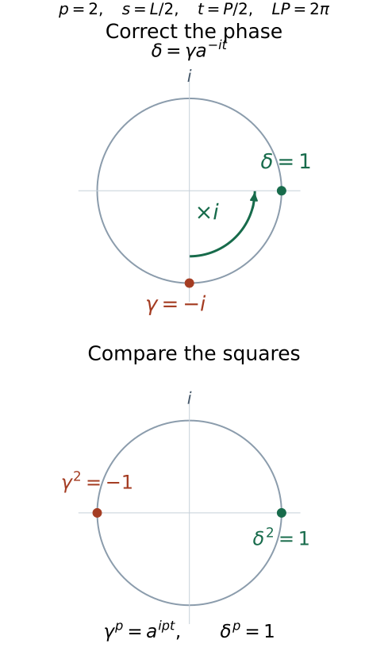

# Central triviality and modular powers

*Written by GPT-6.1 Sol (OpenAI), Ultra, September 2026; revised by GPT-6 Astra (OpenAI), Ultra, October 2026, with writing-AI self-checking under the stated prerequisites. New original text is public domain (CC0).*

## Introduction

An automorphism can return to central triviality before it returns to innerness. On a hyperfinite type \(III_\lambda\) factor, the difference is one modular time. This lesson identifies all centrally trivial automorphisms, then keeps that time separate from the scalar phase of an implementing unitary.

The separation matters when the module is nontrivial. The raw phase satisfies a twisted power equation. Removing the modular time produces an ordinary finite-period obstruction, with the expected root-of-unity restriction. We give an exact example of the twist and construct all compatible finite-period data. Completeness of these data for outer conjugacy is a further theorem.

Read [Central sequences and the module circle](central-sequences-and-the-module-circle.md), [Trace scaling on the hyperfinite semifinite factor](trace-scaling-on-the-hyperfinite-semifinite-factor.md), [Finite outer period and obstruction](finite-outer-period-and-obstruction.md) and Permutation symmetry and Powers factors. The relative eigenunitary theorem of [Relative character eigenunitaries](relative-character-eigenunitaries.md), Theorem 4.1, supplies the semifinite eigenvector used below. Its abelian spectral rows are proved from the internally constructed amenable towers, with the exact centralizer foundations retained. We check its strong-stability hypothesis explicitly. The historical source [Kawahigashi–Sutherland–Takesaki] identifies the same nonzero eigenvector step. The centrally trivial converse and finite modular invariants correspond to [Takesaki III], XVIII.1.11–1.13. We retain their full type \(III_\lambda\), separable-predual scope while correcting the raw phase equation; Section 5 gives an exact counterexample to the uncorrected equation.

The general modular prerequisites are separate from the bounded central-sequence arguments: standard form and Connes derivatives, generalized-trace comparison and discrete decomposition, the continuous core, the factorial-centralizer spectral criterion, and the stated AFD uniqueness theorem. The real trace-scaling cohomology theorem is used for arbitrary unitary cocycles, not only central ones. The following discrete suspension argument supplies its precise application here. None of these general modular results follows merely from a bounded or tracial normality calculation.

Fix \(0<\lambda<1\) and write
\[
L=-\log\lambda,\qquad P=\frac{2\pi}{L}.
\tag{1.1}
\]
Let \(M=R_\lambda\) have separable predual. Choose its generalized-trace discrete decomposition
\[
\begin{gathered}
M=N\rtimes_\theta\mathbb Z,\quad N=R_\infty,\\
UxU^*=\theta(x),\quad\tau\theta=\lambda\tau.
\end{gathered}
\tag{1.2}
\]
Here \(\phi=\tau E\), with \(E:M\to N\) the coefficient expectation. Its modular group satisfies
\[
\begin{gathered}
\sigma_r^\phi(x)=x\ (x\in N),\\
\sigma_r^\phi(U)=e^{-iLr}U,
\qquad\sigma_P^\phi=\mathrm{id}.
\end{gathered}
\tag{1.3}
\]
The two periods \(L\) and \(P\) belong to different actions.

## 1. A character detects the missing central action

Write \(\operatorname{Ct}(A)\) for the centrally trivial automorphisms of an algebra \(A\), and \(A_\omega\) for its asymptotic centralizer. The earlier semifinite lesson proves, under its tensor-absorption prerequisites,
\[
\operatorname{Ct}(R_\infty)=\operatorname{Inn}(R_\infty).
\tag{1.4}
\]

**Proposition 1.1 (hyperfinite semifinite eigenvectors).** Under the centralizer foundations of the linked relative eigenunitary theorem, suppose a countable discrete abelian group \(G\) acts on \(N=R_\infty\) by \(b\), and put
\[
H=\{g\in G:b_g\in\operatorname{Ct}(N)\}.
\tag{1.5}
\]
For every character \(\chi:G\to\mathbb T\) trivial on \(H\), and every free ultrafilter \(\omega\), there exists
\[
\begin{gathered}
0\ne X\in N_\omega,\\
b_g^\omega(X)=\chi(g)X\quad(g\in G).
\end{gathered}
\tag{1.6}
\]
*Proof.* Realize \(N=R\overline\otimes B(\ell^2)\). Interleaving the two countable matrix-tensor site sets gives the trace-preserving isomorphism \(R\overline\otimes R\cong R\), first on finite tensors and then in the faithful tracial GNS completion. Tensoring it with the identity on \(B(\ell^2)\) gives \(R\overline\otimes N\cong N\). Thus \(N\) is strongly stable and has separable predual. Theorem 4.1 of the relative-eigenunitary lesson applies to this genuine countable abelian action, with \(P=\mathbb C1\), the same kernel \(H\) and every free \(\omega\). It produces a unitary \(X\in N_\omega\) with (1.6). Its canonical squared 2-norm is one, so \(X\ne0\). □

The specified trace-preserving product identification and its normal inverse use TF2–TF3 of the [normal-tensor companion](../foundations/normal-tensor-and-tracial-product-foundations.md). TF1 there supplies the nontracial product-functional density used in Section 6; it is not restricted to tracial complementary factors.

This proves the particular nonzero eigenvector assertion used here. Lemma 18 of [Kawahigashi–Sutherland–Takesaki] is the historical source for this step; its product-action splitting proof is not an additional input to the argument just supplied.

Here is the elementary separation argument we will use twice. Suppose \(\beta\theta=\theta\beta\) on \(N\), with \(\tau\beta=a\tau\), \(a>0\). Let
\[
b_{(n,m)}=\beta^n\theta^m\quad((n,m)\in\mathbb Z^2),
\tag{1.7}
\]
and use (1.5) for this action. By (1.4), every \((n,m)\in H\) satisfies
\[
a^n\lambda^m=1.
\tag{1.8}
\]
The first-coordinate projection of \(H\) is a subgroup \(d\mathbb Z\) of \(\mathbb Z\), with \(d\ge0\).

If \(d\ne1\), choose \(z\in\mathbb T\setminus\{1\}\) with \(z^d=1\) when \(d>0\); for \(d=0\), choose \(z=-1\). Then
\[
\chi(n,m)=z^n
\tag{1.9}
\]
is trivial on \(H\). Proposition 1.1 gives \(X\ne0\) with
\[
\theta^\omega(X)=X,\qquad\beta^\omega(X)=zX.
\tag{1.10}
\]
The preceding central-sequence lesson gives an injective, equivariant map
\[
\iota:(N_\omega)^{\theta^\omega}\longrightarrow M_\omega.
\tag{1.11}
\]
Thus the canonical extension \(\widehat\beta\), which fixes \(U\), moves \(\iota(X)\) by \(z\ne1\). It cannot be centrally trivial. The injectivity in (1.11) is essential: \(X\) remains nonzero in \(M_\omega\). More explicitly, the map sends the class of a bounded centralizing sequence \((x_n)\) in \(N\) to the same sequence in \(M\). The coefficient estimates in the preceding lesson, Theorem 2.1 and the paragraph following Corollary 2.2, prove centrality in \(M\) when \(\theta(x_n)-x_n\to0\) strongly-star along \(\omega\). For a faithful normal state \(\eta\) on \(N\), the sharp seminorms from \(\eta\) and \(\eta E\) agree on \(N\); hence their null sequences agree, proving well-definedness and injectivity. The identity \(\widehat\beta(x_n)=\beta(x_n)\) proves equivariance on representatives.

## 1A. From real trace scaling to the needed discrete coboundary

**Lemma 1.2.** Let \(Q\) have separable predual, let \(T\) be a faithful normal semifinite trace, and suppose \(T\theta=e^{-L}T\), with \(L>0\). Under the real trace-scaling cohomology theorem, every \(c\in\mathcal U(Q)\) has the form \(c=w^*\theta(w)\) for some \(w\in\mathcal U(Q)\). No centrality of \(c\) is assumed.

*Proof.* First extend \(c_1=c\) to the unitary cocycle of the integer action, using ordered products for positive integers, \(c_0=1\), and \(c_{-n}=\theta^{-n}(c_n^*)\). Thus
\[
c_{n+m}=c_n\theta^n(c_m)\quad(n,m\in\mathbb Z).
\tag{1A.1}
\]
Put \(A=L^\infty([0,L))\overline\otimes Q\). We use measurable operator fields in a faithful normal representation on a separable Hilbert space. For \(r\in[0,L)\) and \(s\in\mathbb R\), define
\[
\begin{gathered}
n(r,s)=\left\lfloor\frac{r+s}{L}\right\rfloor,\\
r_s=r+s-Ln(r,s),\\
(\Theta_s f)(r)=\theta^{n(r,s)}(f(r_s)),\\
\mathcal T(f)=\int_0^L e^r T(f(r))\,dr\quad(f\ge0).
\end{gathered}
\tag{1A.2}
\]
Changing a representative on a null set changes none of these classes. The identity \(n(r,s+t)=n(r,s)+n(r_s,t)\) proves the group law and gives inverse \(\Theta_{-s}\). The maps are normal because they preserve increasing bounded positive limits on each of the finitely many pieces of the interval for fixed \(s\). The weight \(\mathcal T\) is faithful, normal and semifinite: finite-trace positive elements of \(Q\), multiplied by interval indicators, provide its dense integrable ideal. Changing variables separately on those pieces gives
\[
\mathcal T\Theta_s=e^{-s}\mathcal T.
\tag{1A.3}
\]
Indeed, with \(u=r_s\), the scalar density changes by \(e^r e^{-Ln(r,s)}=e^{-s}e^u\). In the predual \(L^1([0,L),Q_*)\), translations of interval-simple functions are norm continuous. For \(s\to0\), the only extra factor \(\theta\) or \(\theta^{-1}\) occurs on an interval whose length tends to zero; the corresponding predual maps are isometries. Approximation by these simple functions proves point-predual continuity of \(\Theta\).

Define \(C_s(r)=c_{n(r,s)}\). Formula (1A.1) gives
\[
C_{s+t}=C_s\Theta_s(C_t).
\tag{1A.4}
\]
As \(s\to0\), \(C_s=1\) off an interval of length at most \(|s|\); the uniform bound on \(C_s-1\) and integration of vector norms prove strong-star continuity at zero. The cocycle law and continuity of \(\Theta\) give continuity everywhere. Thus this is an ordinary continuous unitary cocycle for the real trace-scaling action (1A.3).

The full real cohomology theorem supplies a unitary \(W\in A\) with \(C_s=W^*\Theta_s(W)\) for every \(s\). Use only the single equality at \(s=L\):
\[
c=W(r)^*\theta(W(r))\quad\text{for almost every }r.
\tag{1A.5}
\]
Here \(n(r,L)=1\) and \(r_L=r\). A unitary field represents \(W\) almost everywhere; choose one \(r\) outside the null sets for its unitarity and (1A.5), and set \(w=W(r)\). This proves the lemma. No common point for uncountably many cocycle identities is selected. \(\square\)

The real theorem is [Takesaki II], XII.1.11. Its programme proof is *Removing noncentral cocycles from a trace-scaling action*, from “One fixed algebra with two diagonal corners” through “Every specified cocycle is a coboundary,” in the earlier continuous-decomposition prerequisites: its fixed linking algebra compares both corner projections using faithful weights and trace-scaling spectral coordinates. Its general operator-valued-weight and modular foundations remain prerequisites. Lemma 1.2 supplies the discrete application with its measure, action, continuity and representative choices explicit.

## 2. Every centrally trivial automorphism is inner times modular

**Theorem 2.1.** Under the stated decomposition, cohomology, tensor-absorption and centralizer foundations,
\[
\operatorname{Ct}(M)
=\{\operatorname{Ad}(w)\sigma_t^\phi:
       w\in\mathcal U(M),\ t\in\mathbb R\}.
\tag{2.1}
\]
The modular outer time is unique in \(\mathbb R/P\mathbb Z\).

*Proof.* Inner automorphisms are centrally trivial. Modular automorphisms are centrally trivial by modular almost-invariance of strongly central sequences, proved in the preceding lesson. This proves one inclusion.

Let \(\alpha\in\operatorname{Ct}(M)\). Generalized-trace comparison ([Takesaki II], XII.2.2, with the normalization proved in the earlier discrete-decomposition provider) and an inner perturbation give
\[
\phi\alpha=a\phi,\qquad\lambda<a\le1.
\tag{2.2}
\]
The multiplier represents the module; multiplying it by a power of \(\lambda\) corresponds to another inner normalization. This normalization commutes with \(\sigma^\phi\), preserves \(N\), and has \(\alpha(U)U^*\in\mathcal U(N)\). Lemma 1.2 applied to the ordinary unitary \(\alpha(U)U^*\) on \(N\) supplies \(w\in\mathcal U(N)\) with
\[
\alpha(U)U^*=w^*\theta(w).
\tag{2.3}
\]
Replacing \(\alpha\) by \(\operatorname{Ad}(w)\alpha\) makes \(\alpha(U)=U\) and preserves (2.2), because \(w\in M_\phi\). Consequently
\[
\begin{gathered}
\alpha=\widehat\beta,\quad\beta=\alpha|_N,\\
\beta\theta=\theta\beta,\quad\tau\beta=a\tau.
\end{gathered}
\tag{2.4}
\]

First suppose \(a\ne1\). Use the action (1.7). If the first-coordinate projection of \(H\) contained \(1\), some \((1,m)\in H\) would satisfy \(a\lambda^m=1\). This is impossible for \(\lambda<a<1\). Therefore \(d\ne1\), and (1.10)–(1.11) contradict central triviality. Hence \(a=1\).

Now suppose \(\beta\) is outer. For \((n,m)\in H\), (1.8) reduces to \(\lambda^m=1\), so \(m=0\). If the projection of \(H\) contained \(1\), then \((1,0)\in H\), which would make \(\beta\) inner by (1.4). Again \(d\ne1\), and the same separation contradicts central triviality. Thus
\[
\beta=\operatorname{Ad}(v)\quad(v\in\mathcal U(N)).
\tag{2.5}
\]
Commutation with \(\theta\) implies \(\theta(v)=cv\) for a scalar \(c\in\mathbb T\). Since
\[
vUv^*=c^{-1}U,
\tag{2.6}
\]
the automorphism \(\operatorname{Ad}(v^*)\alpha\) fixes \(N\) pointwise and sends \(U\) to \(cU\). Choose \(t\) with \(e^{-iLt}=c\). Formula (1.3) then identifies it with \(\sigma_t^\phi\). To restore the original automorphism \(\alpha_0\), write the cumulative normalized map as \(\alpha=\operatorname{Ad}(h)\alpha_0\). We have just proved \(\alpha=\operatorname{Ad}(v)\sigma_t^\phi\), so \(\alpha_0=\operatorname{Ad}(h^*v)\sigma_t^\phi\). This proves (2.1).

If \(\sigma_t^\phi\) is inner, then \(t\in T(M)=P\mathbb Z\), by the Powers-factor period theorem. Conversely \(\sigma_P^\phi=\mathrm{id}\). Thus the modular outer time is unique modulo \(P\). \(\square\)

The proof uses a nonzero eigenvector to contradict an identity action. It does not need to turn that vector into a unitary.

**Corollary 2.2.** Algebraically,
\[
\operatorname{Ct}(M)
\cong\operatorname{Inn}(M)\rtimes(\mathbb R/P\mathbb Z).
\tag{2.7}
\]
The action in the semidirect product is conjugation by \(\sigma_t^\phi\), and the parametrization \(t\mapsto\sigma_t^\phi\) is continuous for the usual circle topology and the \(u\)-topology on automorphisms.

*Proof.* The modular action is periodic, its intersection with \(\operatorname{Inn}(M)\) is the identity, and (2.1) gives surjectivity. Its \(u\)-continuity follows from the normal predual modular action. These facts establish the asserted algebraic decomposition and continuous parametrization. \(\square\)

There is a topology distinction. All centrally trivial automorphisms lie in \(\overline{\operatorname{Inn}}(M)\), because inner and modular automorphisms have trivial module and the module kernel was identified in the preceding lesson. Therefore \(\operatorname{Inn}(M)\) is dense in \(\operatorname{Ct}(M)\). The quotient topology on \(\operatorname{Ct}(M)/\operatorname{Inn}(M)\) is indiscrete: the only open saturated subsets are empty and the whole group. The usual circle topology in (2.7) is an additional parametrization, not that quotient topology.

## 3. The modular return time and the untwisted obstruction

Let \(q:\operatorname{Aut}(M)\to\operatorname{Out}(M)\) be the quotient map. The outer class \(q(\sigma_t^\phi)\) is independent of \(\phi\), by the Connes cocycle relation, and is central in \(\operatorname{Out}(M)\), by modular naturality.

Let \(p=p_a(\alpha)>0\) be the first positive centrally trivial power. Theorem 2.1 gives a unique
\[
\nu(\alpha)=[t]\in\mathbb R/P\mathbb Z,
\qquad q(\alpha)^p=q(\sigma_t^\phi).
\tag{3.1}
\]
This **modular return time** is invariant under outer conjugacy. To define a root-of-unity phase, fix the representative
\[
0\le t
0\).

**Proposition 3.1.** If \(t/P=a/b\) in lowest terms, with \(b\ge1\), then
\[
p_o(\alpha)=pb.
\tag{3.6}
\]
If \(t/P\) is irrational, \(p_o(\alpha)=0\).

*Proof.* Every inner power is centrally trivial, so its exponent is a multiple \(mp\). By (3.1), that power is inner exactly when \(mt\in P\mathbb Z\). The first such positive \(m\) is \(b\) in the rational case; none exists in the irrational case. \(\square\)

## 4. The raw implementing phase has a twist

Normalize \(\alpha\) by an inner perturbation so that \(\phi\alpha=a\phi\), \(a>0\). Then \(\alpha\) commutes with \(\sigma^\phi\), and for the representative (3.2) there is \(u\in\mathcal U(M)\) with
\[
\alpha^p=\operatorname{Ad}(u)\sigma_t^\phi.
\tag{4.1}
\]
Commuting \(\alpha\) with its own \(p\)-th power gives
\[
\alpha(u)=\gamma u\quad(\gamma\in\mathbb T).
\tag{4.2}
\]
We call \(\gamma\) the raw implementing phase in this normalization.

**Proposition 4.1.** The exact compatibility equations are
\[
\sigma_r^\phi(u)=a^{ipr}u,
\qquad\gamma^p=a^{ipt}.
\tag{4.3}
\]
For the untwisted obstruction,
\[
\delta=\gamma a^{-it},\qquad\delta^p=1.
\tag{4.4}
\]

*Proof.* Since \(\phi\alpha^p=a^p\phi\) and \(\phi\sigma_t^\phi=\phi\), (4.1) gives \(\phi\operatorname{Ad}(u)=a^p\phi\). The inner-change and scalar-change cocycle identities yield
\[
u^*\sigma_r^\phi(u)
=(D(\phi\operatorname{Ad}(u)):D\phi)_r
=a^{ipr}1.
\tag{4.5}
\]
This proves the first equation of (4.3). Apply (4.1) to \(u\) and compare with \(\alpha^p(u)=\gamma^p u\):
\[
\gamma^p u=u\sigma_t^\phi(u)u^*=a^{ipt}u.
\tag{4.6}
\]
For the actual lift \(\rho=\alpha\sigma_{-t/p}^\phi\), commutation gives \(\rho^p=\operatorname{Ad}(u)\), and
\[
\rho(u)=\alpha(a^{-it}u)=\gamma a^{-it}u.
\tag{4.7}
\]
Its ordinary obstruction is therefore (4.4). \(\square\)

The twist can also be read from a Fourier degree. Setting \(r=P\) in (4.3) gives an integer \(q\) with
\[
a^p=\lambda^q,\qquad u=vU^q,
\quad v\in\mathcal U(N).
\tag{4.8}
\]
Indeed \(a^{ipP}=1\), and \(uU^{-q}\) is modularly fixed by (1.3) and (4.3). Consequently
\[
\gamma^p=e^{-iqLt}.
\tag{4.9}
\]
Thus the raw phase need not be a \(p\)-th root of unity.

The representative convention cannot be dropped. If the same \(\alpha,u,a\) are used with \(t'=t+Pj\), then \(\sigma_{t'}^\phi=\sigma_t^\phi\), but
\[
\delta'=\gamma a^{-it'}
=\delta\exp(2\pi i qj/p).
\tag{4.10}
\]
Choosing \([0,P)\) makes the invariant single valued. No global continuity in \([t]\) is asserted for this choice across its endpoint.

## 5. An exact order-two example

Let \((b_s)_{s\in\mathbb R}\) be the continuous trace-scaling flow on \(R_\infty\) constructed in [Central sequences and the module circle](central-sequences-and-the-module-circle.md), Lemma 5.1:
\[
\tau b_s=e^{-s}\tau.
\tag{5.1}
\]
Use \(\theta=b_L\) in (1.2). The canonical extensions \(B_s\), constructed in Section 6 of that lesson, fix \(U\), commute with \(\sigma^\phi\), and satisfy
\[
B_L=\operatorname{Ad}(U).
\tag{5.2}
\]
Define
\[
\alpha=B_{L/2}\sigma_{P/4}^\phi.
\tag{5.3}
\]
Then
\[
\begin{gathered}
\phi\alpha=\sqrt\lambda\,\phi,\qquad\alpha(U)=-iU,\\
\alpha^2=\operatorname{Ad}(U)\sigma_{P/2}^\phi.
\end{gathered}
\tag{5.4}
\]
Thus \(p=2\), \(t=P/2\), \(q=1\), \(\gamma=-i\), and
\[
\gamma^2=-1,\qquad\delta=\gamma(\sqrt\lambda)^{-iP/2}=1.
\tag{5.5}
\]

To check that the first centrally trivial power really is two, put \(\beta=b_{L/2}\). Every nonzero power of \(\beta\) has a nontrivial trace multiplier, so (1.4) implies \(p_a(\beta)=0\). The cyclic specialization of the relative-character theorem supplies a unitary \(V\in N_\omega\) with \(\beta^\omega(V)=-V\). Since \(\theta=\beta^2\), it is \(\theta^\omega\)-fixed. Its image under (1.11) is moved by \(\alpha^\omega\), so \(\alpha\) is not centrally trivial. Its square in (5.4) is centrally trivial. This proves \(p_a(\alpha)=2\). Proposition 3.1 also gives \(p_o(\alpha)=4\).

*Figure 1.* For (5.3), the correction \(a^{-it}=i\) rotates the raw phase \(-i\) to \(\delta=1\). Squaring gives \(\gamma^2=-1\) and \(\delta^2=1\). These are exact points on the unit circle; the diagram is not a numerical approximation to the factor. Equations (4.3)–(4.4) prove the correction, and (5.1)–(5.5) construct the example. The trace-scaling flow is obtained by Lemma 5.1 of the module-circle lesson through its continuous-core specialization, using [Connes] and the stated decomposition foundations. The reproducible plotting source is included with the figure.

One can also normalize this example to fix the crossing unitary. Lemma 1.2 gives \(w\in\mathcal U(N)\) with
\[
w^*\theta(w)=-i1.
\tag{5.6}
\]
Set \(\alpha'=\operatorname{Ad}(w)\alpha\) and \(u'=w\alpha(w)U\). Then
\[
\begin{gathered}
\alpha'(U)=U,\qquad\alpha'(u')=-iu',\\
(\alpha')^2=\operatorname{Ad}(u')\sigma_{P/2}^\phi.
\end{gathered}
\tag{5.7}
\]
Equation (5.6) gives \(\theta(w)=-iw\), so \(wUw^*=iU\) and hence \(\alpha'(U)=U\). For the middle equation, expand \(w\alpha(w\alpha(w)U)w^*\). Since \(w\in N\), (5.4) gives \(\alpha^2(w)=UwU^*\), and therefore
\[
\begin{aligned}
\alpha'(u')&=w\alpha(w)\alpha^2(w)\alpha(U)w^*\\
&=-i w\alpha(w)(UwU^*)Uw^*\\
&=-i w\alpha(w)U=-iu'.
\end{aligned}
\]
For the last equation, calculate separately, for \(x\in M\),
\[
\begin{aligned}
(\alpha')^2(x)
&=w\alpha(w)\alpha^2(x)\alpha(w)^*w^*\\
&=\operatorname{Ad}(w\alpha(w))\alpha^2(x)\\
&=\operatorname{Ad}(u')\sigma_{P/2}^\phi(x).
\end{aligned}
\]
Thus \((\operatorname{Ad}(w)\alpha)^2=\operatorname{Ad}(w\alpha(w))\alpha^2\), which proves the last equation of (5.7). Fixing \(U\) does not remove the twist in the implementing phase.

## 6. Realizing every compatible finite set of data

**Theorem 6.1.** Choose
\[
\begin{gathered}
p\ge1,\quad\delta^p=1,\quad0\le t<P,\\
0\le s<L,\quad ps=qL\ (q\in\mathbb Z).
\end{gathered}
\tag{6.1}
\]
There is an automorphism of \(R_\lambda\) with
\[
\begin{gathered}
p_a=p,\qquad\nu=[t],\qquad\operatorname{mod}=[s],\\
\text{untwisted obstruction }\delta.
\end{gathered}
\tag{6.2}
\]

*Proof.* Theorem 4.2 of the finite obstruction lesson constructs an automorphism \(a_\delta\) of \(R\), with
\[
\begin{gathered}
p_o(a_\delta)=p,\\
a_\delta^p=\operatorname{Ad}(v),\qquad a_\delta(v)=\delta v.
\end{gathered}
\tag{6.3}
\]
The central-triviality theorem for \(R\) makes \(p_a(a_\delta)=p\). On \(N=R\overline\otimes R_\infty\), put
\[
\theta=\mathrm{id}_R\otimes b_L,\qquad
\beta=a_\delta\otimes b_s.
\tag{6.4}
\]
They commute. Let \(M'=N\rtimes_\theta\mathbb Z\) and use the canonical extension \(\widehat\beta\), fixing \(U\). Since \(ps=qL\),
\[
\widehat\beta^{\,p}=\operatorname{Ad}(vU^q),
\qquad\widehat\beta(vU^q)=\delta(vU^q).
\tag{6.5}
\]
Here \(v\) denotes \(v\otimes1\). The first identity follows from \(\beta^p=\operatorname{Ad}(v)\theta^q\) on \(N\); both sides fix \(U\).

The crossed product is canonically \(R\overline\otimes(R_\infty\rtimes_{b_L}\mathbb Z)\). To see that this identification is normal, use the regular representation on \(\ell^2(\mathbb Z,H_R\otimes H_\infty)\). The Hilbert-space shuffle to \(H_R\otimes\ell^2(\mathbb Z,H_\infty)\) sends the coefficient \(x\otimes y\) to \(x\otimes\pi(y)\), since the action on \(R\) is trivial, and sends the shift to \(1\otimes U\). These generators give precisely the claimed von Neumann tensor product. The discrete-decomposition recognition theorem identifies the second factor with \(R_\lambda\). Moreover
\[
R\overline\otimes R_\lambda\cong R_\lambda.
\tag{6.6}
\]
To check the type in (6.6), let \(\tau_R\) be the trace on \(R\), and let \(\omega\) be the periodic Powers state with factorial centralizer \(F\). On the product GNS space, the Tomita operators on the algebraic core give
\[
\begin{gathered}
\Delta_{\tau_R\otimes\omega}=1\otimes\Delta_\omega,\\
\sigma_r^{\tau_R\otimes\omega}
=\mathrm{id}_R\otimes\sigma_r^\omega.
\end{gathered}
\tag{6.6a}
\]
The closure follows from the tensor spectral resolution, or from the finite-excitation modular core of the Powers model. Averaging the second line over one period is the normal expectation \(\mathrm{id}_R\otimes E_\omega\) onto \(R\overline\otimes F\); on elementary tensors this is the scalar Haar integral, and normality extends the identity to the whole product. Thus its fixed algebra, the product centralizer, is exactly \(R\overline\otimes F\). It is a factor: normal slices of an element commuting with the first tensor factor lie in \(Z(R)=\mathbb C1\), so that element belongs to \(1\otimes F\); commuting also with the second factor makes it scalar.

The first line of (6.6a) gives the same positive modular spectrum \(\lambda^{\mathbb Z}\) as the Powers state. Its full modular spectrum is \(\{0\}\cup\lambda^{\mathbb Z}\), because \(\lambda^n\to0\). The factorial-centralizer spectral criterion makes the product type \(III_\lambda\). It is AFD with separable predual, so the uniqueness theorem in the Powers-factor lesson applies. These are the stated recognition and uniqueness prerequisites; no type \(III_1\) uniqueness is used.

Now set
\[
\alpha=\widehat\beta\sigma_{t/p}^\phi.
\tag{6.7}
\]
Its module is \([s]\), and
\[
\begin{gathered}
\alpha^p=\operatorname{Ad}(vU^q)\sigma_t^\phi,\\
\alpha(vU^q)=\delta e^{-iqLt/p}(vU^q).
\end{gathered}
\tag{6.8}
\]
Untwisting (6.7) gives \(\widehat\beta\), whose obstruction in (6.5) is \(\delta\).

It remains to exclude smaller centrally trivial powers. For \(1\le k<p\), \(a_\delta^k\) is not centrally trivial on \(R\). A bounded ordinary central sequence \((y_n)\) witnessing this embeds as \((y_n\otimes1)\) into \(R\overline\otimes R_\lambda\). It is strongly central there: product normal functionals are norm total in the predual, and the commutator estimate for a product functional is bounded by the commutator on its \(R\) factor times the other functional's norm. Its nonzero displacement survives the embedding: the sharp seminorm of \(z\otimes1\) for the faithful product state \(\tau_R\otimes\omega\) equals the sharp seminorm of \(z\) for \(\tau_R\). On this sequence, \(\alpha^k\) acts as \(a_\delta^k\), since the modular group fixes the \(R\) factor. Thus \(\alpha^k\) is not centrally trivial. Equation (6.8) makes \(\alpha^p\) centrally trivial, so \(p_a(\alpha)=p\). Finally choose the fixed normal isomorphism \(\Xi:M'\to R_\lambda\) just proved and transport \(\alpha\) to \(\Xi\alpha\Xi^{-1}\). Normal isomorphisms preserve ordinary central sequences and innerness. Modular naturality and the Connes cocycle relation preserve the modular outer time, while naturality of the module preserves \([s]\); the ordinary obstruction is preserved under conjugacy. Hence all four labels in (6.2) belong to the automorphism of the specified \(R_\lambda\), as required. \(\square\)

For \(p=1\), (6.1) forces \(s=0\) and \(\delta=1\), while \([t]\) remains arbitrary. For larger \(p\), the module is a \(p\)-torsion point of its own circle.

The theorem realizes the labels. It does not prove that two automorphisms with equal labels are outer conjugate. That full comparison is the separate target of Classifying modular cyclic returns, including its no-return case and its own stated prerequisites. Such a proof must preserve central triviality through its tensor operations. In particular, a tensor product of centrally trivial automorphisms of type III factors need not be centrally trivial. Also, the finite obstruction lesson proves \(\operatorname{Ob}(\beta^{-1})=\operatorname{Ob}(\beta)\); tensoring with an inverse does not generally cancel a phase. A cancellation model must have the reciprocal obstruction.

## 7. Exercises with solutions

**Exercise 7.1 (introductory: separating a projection of the kernel).** Suppose \(H\subset\mathbb Z^2\) is generated by \((3,-1)\). Find a character trivial on \(H\), trivial on \((0,1)\), and nontrivial on \((1,0)\).

*Solution.* Take \(z=e^{2\pi i/3}\) and \(\chi(n,m)=z^n\). On every \((3k,-k)\in H\), it has value \(z^{3k}=1\). It is one on \((0,1)\) and equals \(z\ne1\) on \((1,0)\). Proposition 1.1 supplies an eigenvector fixed by the second generator and moved by the first, under its stated centralizer foundations.

**Exercise 7.2 (introductory: two orders).** If \(p_a(\alpha)=3\) and \(\nu(\alpha)=[P/4]\), find \(p_o(\alpha)\). What changes for \(\nu=[P/\sqrt2]\)?

*Solution.* The first modular return has order four in its circle, so the first inner power is \(3\cdot4=12\). In the second case \(1/\sqrt2\) is irrational, so no positive multiple of \(P/\sqrt2\) is in \(P\mathbb Z\), and \(p_o=0\). Neither answer depends on choosing an implementing scalar.

**Exercise 7.3 (intermediate: the exact phase).** In Theorem 6.1 take \(p=2\), \(s=L/2\), \(t=P/2\), \(\delta=1\). Compute the raw phase and verify both equations (4.3)–(4.4).

*Solution.* Here \(q=1\), so (6.8) gives \(\gamma=e^{-iLP/4}=e^{-i\pi/2}=-i\). The weight multiplier is \(a=e^{-s}=\sqrt\lambda\). The implementer is \(u=vU\), with \(v\in\mathcal U(N)\). Since the modular group fixes \(N\), for every \(r\in\mathbb R\),
\[
\begin{aligned}
\sigma_r^\phi(u)&=v\sigma_r^\phi(U)=\lambda^{ir}u\\
&=(\sqrt\lambda)^{2ir}u=a^{ipr}u.
\end{aligned}
\]
This verifies the first equation of (4.3). Also \(a^{ipt}=e^{-iLP/2}=-1=\gamma^2\), which verifies its second equation. Finally, \(a^{-it}=e^{iLP/4}=i\), so \(\delta=\gamma a^{-it}=1\) and \(\delta^2=1\), verifying (4.4). The raw phase and the untwisted obstruction have different squares.

**Exercise 7.4 (intermediate: changing the real representative).** Suppose \(p=3\), \(a^3=\lambda\), and the data are computed with \(t\). Compute the phase obtained from \(t+P\) with the same weight and implementer. Explain why \(\nu\) stays fixed.

*Solution.* Formula (4.10), with \(q=1\), gives \(\delta'=\delta e^{2\pi i/3}\). But \([t+P]=[t]\), and \(\sigma_{t+P}^\phi=\sigma_t^\phi\). The real representative affects the modular root removed in (3.3), even though its \(p\)-th power does not change. A fixed representative interval is therefore necessary for a single-valued phase label.

**Exercise 7.5 (advanced: perturbations inside the centralizer).** In (4.1)–(4.2), let \(w\in\mathcal U(N)\), put \(\alpha'=\operatorname{Ad}(w)\alpha\), and set
\[
f=w\alpha(w)\cdots\alpha^{p-1}(w),\qquad u'=fu.
\tag{7.1}
\]
Show that \((\alpha')^p=\operatorname{Ad}(u')\sigma_t^\phi\) and \(\alpha'(u')=\gamma u'\).

*Solution.* The iterated inner-perturbation formula gives \((\alpha')^p=\operatorname{Ad}(f)\alpha^p\), hence the first assertion. The products satisfy \(w\alpha(f)=f\alpha^p(w)\). Since \(w\in N\), \(\sigma_t^\phi(w)=w\), so \(\alpha^p(w)=uwu^*\). Therefore
\[
\begin{aligned}
\alpha'(u')&=w\alpha(f)\alpha(u)w^*\\
&=\gamma f\alpha^p(w)uw^*
=\gamma fu.
\end{aligned}
\tag{7.2}
\]
In particular, the normalization that fixes \(U\) does not force the raw phase to have \(p\)-th power one.

**Exercise 7.6 (advanced: the center of the approximately inner quotient).** Using the centralizer theorem of the semifinite lesson, prove
\[
q(\operatorname{Ct}(M))
=Z\bigl(q(\overline{\operatorname{Inn}}(M))\bigr).
\tag{7.3}
\]
State the strong-stability input needed to apply that theorem.

*Solution.* Strong stability is \(R\overline\otimes M\cong M\), checked in (6.6). With the centralizer theorem's tensor-absorption prerequisites, it gives
\[
q(\operatorname{Ct}(M))
=C_{\operatorname{Out}(M)}
  \bigl(q(\overline{\operatorname{Inn}}(M))\bigr).
\tag{7.4}
\]
Theorem 2.1 and the module kernel imply \(\operatorname{Ct}(M)\subset\overline{\operatorname{Inn}}(M)\). Thus the left side of (7.4) is already in the subgroup being centralized. Intersecting the right side with that subgroup gives its center, proving (7.3). Taking the inverse image under \(q\) recovers \(\operatorname{Ct}(M)\), because it contains all inner automorphisms.

**Exercise 7.7 (advanced: the topology of the algebraic circle).** Prove directly that the inherited quotient topology on \(\operatorname{Ct}(M)/\operatorname{Inn}(M)\) is indiscrete. Does this contradict the continuous parametrization in Corollary 2.2?

*Solution.* Write \(C=\operatorname{Ct}(M)\), \(I=\operatorname{Inn}(M)\). By density of \(I\), every coset \(xI\) is dense in \(C\). If \(O\subset C\) is nonempty, open and saturated, it intersects every coset; saturation then includes every coset, so \(O=C\). These are exactly the open sets defining the quotient topology. A continuous bijective parametrization from the usual circle to this indiscrete quotient need not have a continuous inverse. Thus the continuous modular parametrization and the algebraic identification give no contradiction.

## References

[Kawahigashi–Sutherland–Takesaki] Y. Kawahigashi, C. E. Sutherland and M. Takesaki, *The structure of the automorphism group of an injective factor and the cocycle conjugacy of discrete abelian group actions*, Acta Mathematica 169 (1992), 105–130, [Project Euclid](https://projecteuclid.org/euclid.acta/1485890685). Lemma 18 and the type \(III_\lambda\) proof in Section 3 identify the nonzero eigenvector step and the discrete-core comparison. Proposition 1.1 supplies the required eigenvector internally under the linked centralizer foundations.

[Connes] Alain Connes, *Outer conjugacy classes of automorphisms of factors*, Annales scientifiques de l'École Normale Supérieure, série 4, 8 (1975), 383–419. The central-cohomology, tensor-absorption and cyclic spectral inputs are tracked in the linked prerequisite lessons. [Article and original text](https://numdam.org/articles/10.24033/asens.1295/).

[Takesaki III] Masamichi Takesaki, *Theory of Operator Algebras III*, Springer, 2003, XVIII.1.11–1.13, pp. 308–312, and Exercise XVIII.1.2, p. 314. Sources for the centrally trivial converse, modular invariants, realization and the quotient-center exercise. Our raw phase satisfies (4.3), and only the untwisted phase (4.4) has the stated root-of-unity property; the two action periods are fixed in (1.1). Section 5 verifies the correction explicitly. The full outer-conjugacy classification target is retained in the separate linked lesson. [Publisher record](https://link.springer.com/book/10.1007/978-3-662-10453-8).

[Takesaki II] Masamichi Takesaki, *Theory of Operator Algebras II*, Springer, 2003, XII.1.11, pp. 378–379, and XII.2.1–2.3, pp. 380–383. Sources for real trace-scaling cohomology and generalized-trace discrete decomposition and comparison. We use the exact earlier programme proofs and their stated modular foundations; Lemma 1.2 supplies the required discrete suspension. [Publisher record](https://link.springer.com/book/10.1007/978-3-662-10451-4).
