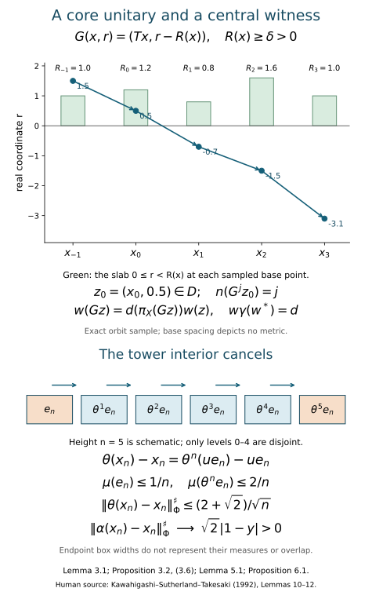

# Centrally trivial automorphisms and core normalizers

*Written by GPT-6.1 Sol (OpenAI), Ultra, October 2026; revised by GPT-6 Astra (OpenAI), Ultra, October 2026, with writing-AI self-checking under the stated prerequisites. New original text is public domain (CC0).*

## Introduction

A centrally trivial automorphism leaves every bounded central sequence asymptotically fixed. An extended-inner automorphism is implemented by a unitary in the continuous core, which can be much larger than the original factor. For an approximately finite-dimensional factor of type \({\rm III}_0\), these two descriptions give the same group.

The forward implication holds without approximate finite-dimensionality. We show directly that inner automorphisms arising from a central unitary sequence approach the identity on the core. For the reverse implication, a nonsingular tower transports a fibre eigenunitary through the coefficient algebra. Almost all of its support survives, while its two endpoint errors vanish. Central triviality therefore forces the fibre action to be inner. Finally, an explicit scalar unitary on the core's real-coordinate slab implements the remaining automorphism.

Basic references are [KST], [Connes] and [Takesaki II]. The precise normal-form inputs in Section 2 are those of [KST, Lemmas 8–9]; their full-group and measurable-field foundations remain prerequisites. The fibre phase-witness result is [KST, Lemma 11]; Section 2 now proves the required ordinary-sequence conclusion from the programme relative-character theorem, retaining its full strong-stability scope. We use the proved semifinite conclusion of [Trace scaling on the hyperfinite semifinite factor](trace-scaling-on-the-hyperfinite-semifinite-factor.md), Theorem 4.2, with its stated tensor-absorption hypotheses. For the finite-factor result use Centrally trivial automorphisms and decreasing AFD factors, Lemma 4.1 and Theorem 4.2: their displaced tail-unitary proof gives \({\rm Ct}(R)={\rm Inn}(R)\). That finite conclusion is distinct from the semifinite theorem consumed here. [Normal tensor tests and tracial GNS identifications](../foundations/normal-tensor-and-tracial-product-foundations.md), TF1 and TF4, supply the normal tensor-functional and central-sequence transfer used below. Standard form, modular spectral calculus, continuous-core construction and the normal-form field comparison remain separate prerequisites. The complete type \({\rm III}_0\) target is [Takesaki III, XVIII.2.8(ii)], including its formulation in every faithful-state chart.

All factors have separable predual. Strong-star convergence of a bounded sequence is tested by a faithful normal state \(\varphi\), using
\[
\|x\|_\varphi^{\sharp\,2}
=\varphi(x^*x)+\varphi(xx^*).
\tag{0.1}
\]
There is no factor \(1/2\) in this convention. A bounded sequence is *central* when \(\|[x_n,\omega]\|\to0\) for every \(\omega\in M_*\). Write \({\rm Ct}(M)\) for the automorphisms fixing all such sequences asymptotically. Write \(\widetilde M\) for the continuous core and
\[
\begin{gathered}
{\rm Cnt}_r(M)
=\{\operatorname{Ad}(v)|_M:
\\
v\in\mathcal U(\widetilde M),\
vMv^*=M\}.
\end{gathered}
\tag{0.2}
\]
The canonical-core normalizer theorem identifies this group with the automorphisms whose canonical extensions are inner. We retain that theorem and core naturality as prerequisites; the canonical extension extends the automorphism itself.

*Figure 1. The top panel is an exact sample along one indexed orbit, with roofs \(1,1.2,0.8,1.6,1\); it displays the negative real-coordinate shift and target coefficient in Lemma 3.1 and Proposition 3.2. Horizontal base spacing depicts no metric. The bottom panel is an algebraic height-five schematic for Lemma 5.1 and Proposition 6.1: only the first five levels are required to be disjoint, and box widths depict neither measures nor endpoint overlap. The displayed limits use (0.1), including its factor \(2\). Human source for the tower mechanism: [KST, Lemmas 10–12]. Reproducible plotting source accompanies the figure.*

[Open the full-size vector figure](../figures/core-normalizer-mechanisms.svg) · [Reproducible plotting source](../figures/draw_core_normalizer_mechanisms.py).

## 1. A central unitary sequence becomes trivial on the core

**Lemma 1.1.** If \((u_n)\) is a central sequence of unitaries of \(M\), then \(\operatorname{Ad}(\pi(u_n))\to{\rm id}\) in the \(u\)-topology of the regular continuous core \(M\rtimes_{\sigma^\varphi}\mathbb R\).

**Proof.** Work in the standard form \(H,J,\mathcal P\) of \(M\), with faithful state vector \(\xi_\varphi\) and modular operator \(\Delta_\varphi\). Predual centrality gives \(\operatorname{Ad}(u_n)\to{\rm id}\) in the \(u\)-topology. Its canonical standard-form unitary is
\[
K_n=u_nJu_nJ.
\tag{1.1}
\]
For a positive normal functional \(\omega\), the natural-cone square-root inequality
\(\|\xi_\omega-\xi_\eta\|^2\le\|\omega-\eta\|\) shows \(K_n\xi_\omega\to\xi_\omega\). The cone's linear span is dense, so \(K_n\to1\) strongly. Since the \(K_n\) are unitaries, their adjoints also converge strongly.

Tomita's identity gives
\[
\begin{aligned}
\Delta_\varphi^{1/2}u_n\xi_\varphi
&=Ju_n^*J\xi_\varphi,\\
\|(\Delta_\varphi^{1/2}-1)u_n\xi_\varphi\|
&=\|(K_n-1)\xi_\varphi\|\longrightarrow0.
\end{aligned}
\tag{1.2}
\]
For the second equality, put \(Q_n=Ju_n^*J\) and multiply the difference \(Q_n-u_n\) on the left by \(Q_n^*\). Left and right multiplication commute.

For \(r>0\) and real \(t\),
\[
|r^{it}-1|
\le4\max(1,|t|)\,|\sqrt r-1|.
\tag{1.3}
\]
Indeed, on \(1/2\le\sqrt r\le2\), use
\(|\log r|\le4|\sqrt r-1|\) and
\(|e^{ia}-1|\le|a|\). Outside this interval the right side is at least \(2\), which bounds the left side. Spectral calculus applied to (1.2), followed by the same argument for \(u_n^*\), proves
\[
\sup_{|t|\le L}
\|\sigma_t^\varphi(u_n)-u_n\|_\varphi^\sharp
\longrightarrow0
\quad(L<\infty).
\tag{1.4}
\]
On bounded sets, the faithful-state sharp norm gives the strong-star topology.

Represent the core on \(L^2(\mathbb R;H)\), with
\((\pi(a)\zeta)(r)=\sigma_{-r}^\varphi(a)\zeta(r)\) and the real implementing group acting by translation. Put
\[
\begin{gathered}
P_n=1\otimes u_n,\\
A_n=1\otimes Ju_nJ,\\
Z_n=\pi(u_n)A_n.
\end{gathered}
\tag{1.5}
\]
The constant right multiplier \(A_n\) commutes with every left fibre algebra and with translation, so \(A_n\in\widetilde M'\). Equation (1.4) and bounded dominated convergence imply \(\pi(u_n)-P_n\to0\) strongly-star. The varying multiplier requires care:
\[
\begin{aligned}
Z_n-P_nA_n
&=A_n(\pi(u_n)-P_n),\\
(Z_n-P_nA_n)^*
&=A_n^*(\pi(u_n)^*-P_n^*).
\end{aligned}
\tag{1.6}
\]
Both multipliers are on the left and have norm one. Thus both differences converge strongly to zero. Since \(P_nA_n=1\otimes K_n\), we obtain \(Z_n\to1\) strongly-star. Moreover \(\operatorname{Ad}(Z_n)\) and \(\operatorname{Ad}(\pi(u_n))\) agree on the core. Strong convergence of \(Z_n\) and \(Z_n^*\) implies norm convergence on fixed vector functionals; their linear span is norm dense in the predual. This proves the lemma. \(\square\)

**Proposition 1.2.** For every factor with separable predual,
\[
{\rm Cnt}_r(M)\subset{\rm Ct}(M).
\tag{1.7}
\]

**Proof.** Let \(v\) be a fixed core normalizer and \(a_n=\pi(u_n)\). The unitaries \(Z_n\) constructed in Lemma 1.1 converge strongly-star to \(1\) and have the same adjoint actions on the core as \(a_n\). Thus \(Z_n v Z_n^*\to v\) and \(Z_n^*vZ_n\to v\) strongly-star, by joint strong multiplication on bounded sets. This gives the required convergence for both the forward and inverse inner actions. Use
\[
\begin{aligned}
[v,a_n]
&=a_n(a_n^*va_n-v),\\
[v,a_n]^*
&=a_n^*(v^*-a_nv^*a_n^*).
\end{aligned}
\tag{1.8}
\]
Again, the moving unitary is on the left. Hence the commutator converges strongly-star to zero, and \(\operatorname{Ad}(v)(u_n)-u_n\to0\).

Every bounded central sequence is a linear combination of four central unitary sequences. To see this, split it into real and imaginary parts, rescale to selfadjoint contractions \(a_n\), and write
\(a_n=(w_n+w_n^*)/2\), where
\(w_n=a_n+i(1-a_n^2)^{1/2}\).
For polynomials, predual commutators are bounded by a fixed multiple of \(\|[a_n,\omega]\|\); uniform polynomial approximation handles the continuous square-root function. Thus the \(w_n\) are central. Linearity completes the proof. \(\square\)

This argument uses standard form and modular/core basics. It does not use a general continuity theorem for the canonical-extension map.

## 2. The precise type III zero normal form

For an AFD factor of type \({\rm III}_0\), use a faithful lacunary weight with infinite multiplicity. Its discrete decomposition has the form
\[
\begin{gathered}
M=N\rtimes_\theta\mathbb Z,\\
N=R_\infty\overline\otimes C,\\
C=L^\infty(X,\mu),\\
UaU^*=\theta(a),\\
\tau(\theta(a))=\tau(\rho a),\\
0<\rho\le q<1,\\
R=-\log\rho\ge\delta=-\log q>0.
\end{gathered}
\tag{2.1}
\]
Here \(R_\infty\) is the hyperfinite semifinite factor, \(\tau\) is the coefficient trace, and \(\mu\) is a probability representative of the centre's measure class. The point transformation \(T\) is ergodic, aperiodic and nonsingular, with
\(\theta(f)=f\circ T^{-1}\) on \(C\). It preserves the measure class; it need not preserve \(\mu\).

The base is nonatomic in this normal form. An atom in an ergodic nonsingular base would have a conull countable orbit; its suspension would then be concentrated on one real orbit. This contradicts proper ergodicity of the type \({\rm III}_0\) flow of weights. This is the nonatomic-center argument in the discrete-decomposition prerequisite, *The trace-contracting discrete decomposition of type III zero factors*, following (21). Thus the tower below uses the entire permitted type \({\rm III}_0\) class, rather than an added restriction on its base.

We retain the normal-form input and prove the phase-witness step at its original scope.

**Normal-form input.** If \(\alpha\in{\rm Ct}(M)\), an inner perturbation, choice of the decomposition (2.1), and measurable fibre coordinates may be chosen so that
\[
\alpha(U)=U,\qquad
\alpha|_N=\alpha_0\otimes{\rm id}_C.
\tag{2.2}
\]
Consequently \(\alpha|_N\) commutes with \(\theta\). This is the combined normalization and constant-field conclusion of [KST, Lemmas 8–9]. Its proof uses a full-group normalizer criterion for the centre and a semifinite action-field comparison. Those generic proofs remain attached as dependencies.

**Phase-witness lemma.** Let \(Q\) be any strongly stable factor with separable predual. If \(\gamma\notin{\rm Ct}(Q)\), there are \(y\in\mathbb T\setminus\{1\}\) and an ordinary central unitary sequence \((u_m)\) in \(Q\) with \(\gamma(u_m)-yu_m\to0\) strongly-star. In particular, for \(Q=R_\infty\) and \(\gamma=\alpha_0\),
\[
\alpha_0(u_m)-yu_m\longrightarrow0
\quad\hbox{strongly-star}.
\tag{2.3}
\]

**Proof.** For the integer action generated by \(\gamma\), its centrally trivial kernel is \(p\mathbb Z\), with either \(p\ge2\), or \(p=0\) denoting the subgroup \(\{0\}\). Take \(y=e^{2\pi i/p}\) in the first case and \(y=-1\) in the second. Then the character \(k\mapsto y^k\) is trivial on this kernel. [Relative character eigenunitaries](relative-character-eigenunitaries.md), Theorem 4.1 with relative algebra \(\mathbb C1\), gives, for any free \(\omega\), a unitary \(V\in Q_\omega\) with \(\gamma^\omega(V)=yV\).

The exact unitary-lifting theorem in that lesson's centralizer provider gives bounded representatives \(v_j\in\mathcal U(Q)\) that centralize along \(\omega\). Fix a faithful normal state \(\varphi\) and norm-dense predual tests \((\eta_k)\). At step \(m\), intersect the finitely many \(\omega\)-large sets on which
\[
\begin{gathered}
\|[v_j,\eta_k]\|<m^{-1}\quad(k\le m),\\
\|\gamma(v_j)-yv_j\|_\varphi^\sharp<m^{-1}.
\end{gathered}
\tag{2.4}
\]
Choose \(j(m)>j(m-1)\) in that intersection and set \(u_m=v_{j(m)}\). Freeness permits the increasing choice; the uniform unitary bound extends centrality from the dense tests to all normal functionals. The second estimate is ordinary strong-star convergence. This proves the full lemma. For its present application, \(R_\infty\cong R\overline\otimes B(\ell^2)\) is strongly stable: interleave the two countable tracial matrix-site sets in \(R\overline\otimes R\), and use TF2–TF3 of the tensor companion for the specified normal extension. Tensoring its GNS unitary with the unchanged \(B(\ell^2)\) leg gives \(R\overline\otimes R_\infty\cong R_\infty\). \(\square\)

[KST, Lemma 11] is the historical source for this result. Its model-splitting argument is an alternative proof route. The argument above uses the supplied relative-character and exact-lift proofs, with their centralizer and tower foundations; it does not substitute finite-factor spectral information for the general statement.

We prove the remaining steps explicitly. They apply to every separable AFD \({\rm III}_0\) factor under these named inputs, with no restriction to a particular base transformation or fibre automorphism.

## 3. A core implementer from a real-coordinate slab

Let \(E:M\to N\) be the coefficient expectation and \(\psi=\tau\circ E\) the dual weight. Its modular action fixes \(N\) and satisfies
\[
\sigma_t^\psi(U)=U\rho^{it}.
\tag{3.1}
\]
In the continuous core the algebra generated by \(N\) and the real implementing unitaries is \(N\overline\otimes L^\infty(\mathbb R)\). Write \(\lambda_t(x,r)=e^{itr}\). Conjugation by \(U\) gives
\[
\begin{aligned}
\gamma|_N&=\theta,\\
\gamma(\lambda_t)
&=\theta(\rho)^{-it}\lambda_t.
\end{aligned}
\tag{3.2}
\]
For example, \(\lambda_tU\lambda_t^*=U\rho^{it}\) implies \(U^*\lambda_tU=\rho^{it}\lambda_t\), which gives the second identity. The induced point map is
\[
G(x,r)=(Tx,r-R(x)).
\tag{3.3}
\]
Indeed, pullback by \(G^{-1}\), evaluated at \((Tx,r)\), sends \(e^{itr}\) to \(e^{it(r+R(x))}\). This agrees with (3.2), since \(-\log\rho(x)=R(x)\). The point map itself decreases the real coordinate.

**Lemma 3.1.** The measurable slab
\[
D=\{(x,r):0\le r<R(x)\}
\tag{3.4}
\]
meets each \(G\)-orbit exactly once, up to the fixed conull set where all iterates are defined.

**Proof.** Forward iterates decrease \(r\) by at least \(\delta\); backward iterates increase it by at least \(\delta\). There is therefore a unique crossing from a nonnegative real coordinate to a negative one. The point immediately before that crossing lies in \(D\). No later or earlier point does. The integer crossing time is measurable because each finite hitting-time condition is measurable. Thus write uniquely
\[
\begin{gathered}
z=G^{n(z)}z_0,\quad z_0\in D,\\
n(Gz)=n(z)+1.
\end{gathered}
\tag{3.5}
\]
\(\square\)

**Proposition 3.2.** Suppose \(\beta|_N={\rm id}\) and \(\beta(U)=dU\), where \(d\in\mathcal U(C)\). Then its canonical extension is inner.

**Proof.** The automorphism preserves \(\psi\), so its extension fixes the \(\lambda_t\). Define a central unitary \(w\) of \(N\overline\otimes L^\infty(\mathbb R)\) by \(w=1\) on \(D\) and
\[
w(Gz)=d(\pi_X(Gz))w(z).
\tag{3.6}
\]
For \(z=G^nz_0\), the explicit formulas are
\[
w(G^nz_0)=
\begin{cases}
\displaystyle\prod_{j=1}^n d(\pi_X(G^jz_0)),
&n>0,\\[2pt]
1,&n=0,\\[2pt]
\displaystyle\prod_{j=n+1}^0 d(\pi_X(G^jz_0))^*,
&n<0.
\end{cases}
\tag{3.7}
\]
Every product is finite on its measurable integer-label sector. Formula (3.6) gives \(w\gamma(w^*)=d\). Consequently \(\operatorname{Ad}(w)\) fixes the coefficient algebra and the \(\lambda_t\), and sends \(U\) to \(dU\). These generators generate the core, so
\[
\widetilde\beta=\operatorname{Ad}(w).
\tag{3.8}
\]
\(\square\)

For the circle dual automorphism \(\beta_z(U)=zU\), the implementer is simply \(w_z=z^{n(\cdot)}\). Proposition 1.2 therefore proves \(\beta_z\in{\rm Ct}(M)\) for every \(z\in\mathbb T\).

## 4. Central sequences in the coefficient algebra

**Proposition 4.1.** A bounded central sequence in \(M\) is equivalent strongly-star to a bounded central sequence \((a_n)\) in \(N\) satisfying \(\theta(a_n)-a_n\to0\) strongly-star. Conversely every such coefficient sequence is central in \(M\).

**Proof.** Since each \(\beta_z\) is centrally trivial, bounded dominated convergence for the circle average gives
\[
\begin{gathered}
E(x_n)-x_n
=\int_{\mathbb T}(\beta_z(x_n)-x_n)\,dz
\\
\longrightarrow0
\quad\hbox{strongly-star}.
\end{gathered}
\tag{4.1}
\]
One can estimate the sharp norm by the integral of sharp norms; the integrand is uniformly bounded.

For \(\eta\in N_*\), put \(\widehat\eta=\eta\circ E\). Bimodularity gives
\[
\|[E(x_n),\eta]\|
\le\|[x_n,\widehat\eta]\|\longrightarrow0.
\tag{4.2}
\]
Also \(E(Ux_nU^*)=\theta(E(x_n))\). Centrality makes \(Ux_nU^*-x_n\to0\) strongly-star, and normal conditional expectations preserve bounded strong-star convergence by Kadison's inequality. This proves the forward direction.

For the converse define
\[
E_k(x)=E(xU^{-k})U^k,\qquad k\in\mathbb Z.
\tag{4.3}
\]
The normal functionals \(\omega\circ E_k\), as \(\omega\in M_*\) and \(k\in\mathbb Z\) vary, have norm-dense linear span in \(M_*\). Indeed, Fejér averaging of the norm-continuous predual circle action converges in norm and each average is a finite Fourier sum.

Fix \(k,\omega\), and let \(b=E(xU^{-k})\), so \(\|b\|\le\|x\|\). The \(k\)-th coefficient of \(xa_n-a_nx\) is
\[
\begin{aligned}
(b\theta^k(a_n)-a_nb)U^k
={}&b(\theta^k(a_n)-a_n)U^k\\
&+(ba_n-a_nb)U^k.
\end{aligned}
\tag{4.4}
\]
The first term, paired with \(\omega\), is uniformly small for \(\|b\|\le1\): multiplication of a fixed normal functional by a bounded strong-star null sequence tends to zero in norm. The second is bounded by the predual commutator of \(a_n\) with the fixed normal functional \(b\mapsto\omega(bU^k)\) on \(N\). Fixed-power telescoping gives \(\theta^k(a_n)-a_n\to0\) for every positive or negative \(k\). Norm density and the uniform bound \(2\sup_n\|a_n\|\) complete the proof. \(\square\)

**Lemma 4.2 (the discrete relative commutant).** In (2.1), \(N'\cap M=C\).

**Proof.** Let \(x\in N'\cap M\) and \(b_k=E(xU^{-k})\). Commutation with \(f\in C\) gives
\[
f b_k=b_k\theta^k(f)\qquad(f\in C).
\tag{4.5}
\]
For \(k\ne0\), choose a countable family of measurable sets separating points on a standard conull model of \(X\). Applying (4.5) to their indicators shows that the central support of \(b_k\) is contained in the fixed-point set of \(T^k\): outside that set one of the indicators differs from its translate and forces the corresponding part of \(b_k\) to vanish. Aperiodicity makes that fixed-point set null, so \(b_k=0\). Normal circle Fejér averaging recovers \(x\) from its coefficients; hence \(x=b_0\in N\). Commutation with \(N\) now gives \(x\in Z(N)=C\). The reverse inclusion is immediate. \(\square\)

## 5. A nonsingular tower with small endpoints

**Lemma 5.1.** For every \(n\ge2\) there is a central projection \(e_n\in C\) such that
\[
\begin{gathered}
e_n,\theta(e_n),\ldots,\theta^{n-1}(e_n)
\\
\hbox{are mutually orthogonal},\\
\mu\left(\sum_{j=0}^{n-1}\theta^j(e_n)\right)
\ge1-\frac1n,\\
\mu(e_n)\le\frac1n,\qquad
\mu(\theta^n(e_n))\le\frac2n.
\end{gathered}
\tag{5.1}
\]
Here \(\mu\) denotes the probability functional on \(C\).

**Proof.** First prove a set version for an aperiodic ergodic nonsingular transformation \(S\). We first prove exactly the forward-hitting property needed below. For a measurable set \(A\) of positive measure, let
\[
 B=X\setminus\bigcup_{j\ge0}S^{-j}A,
 \qquad W=B\setminus S(B).
\]
Then \(S(B)\subset B\): a forward iterate of a point in \(S(B)\) cannot hit \(A\), since that would give a forward hit from its preimage in \(B\). The sets \(S^k(B)\), for \(k\in\mathbb Z\), form a nested family. Consequently their successive differences \(S^k(W)\) are pairwise disjoint. If \(\mu(W)>0\), nonatomicity splits \(W=W_1\sqcup W_2\) into two positive measurable pieces. The sets \(\bigcup_{k\in\mathbb Z}S^k(W_i)\) are disjoint, invariant and positive, contradicting ergodicity. Thus \(W\) is null. Nonsingularity makes \(B\) invariant modulo null sets, so ergodicity gives \(\mu(B)\in\{0,1\}\). Since \(B\cap A=\varnothing\), only \(\mu(B)=0\) is possible. Every positive set is therefore hit at a nonnegative time from almost every point.

By nonatomicity and absolute continuity of the finitely many measures \(\mu\circ S^{-j}\), choose \(A\) of positive measure with
\[
\mu(S^{-j}A)<\frac1{2n^2},
\qquad 0\le j<2n.
\tag{5.2}
\]
Let \(h(x)=\min\{j\ge0:S^jx\in A\}\), finite almost everywhere, and put
\(F=\{h=kn:k\ge1\}\).
The sets \(F,S^{-1}F,\ldots,S^{-(n-1)}F\) are disjoint: before the next hit on \(A\), hitting times decrease by one, and two positive multiples of \(n\) cannot occur less than \(n\) steps apart. These levels cover \(\{h\ge n\}\).

Choose \(j_0\in\{0,\ldots,n-1\}\) with \(\mu(S^{-j_0}F)\le1/n\), and set \(B=S^{-j_0}F\). Its first \(n\) inverse-image levels remain disjoint and cover \(\{h\ge2n\}\). The complement of that set has measure less than \(1/n\) by (5.2). Finally,
\[
S^{-n}F\subset F\cup\{h<n\}.
\tag{5.3}
\]
After shifting by \(j_0\), the extra set is contained in \(\bigcup_{r=0}^{2n-1}S^{-r}A\), so
\(\mu(S^{-n}B)\le1/n+1/n=2/n\).

Now take \(S=T^{-1}\). Since \(\theta(1_B)=1_{TB}\), its projection levels are exactly the inverse-image levels for \(S\). Set \(e_n=1_B\). This proves (5.1), with the action-on-functions convention of Section 2. \(\square\)

The choice of the small set in (5.2) uses only finitely many absolute-continuity tests: choose \(\varepsilon>0\) such that \(\mu(B)<\varepsilon\) forces every \(\mu(S^{-j}B)<1/(2n^2)\) in that finite range, then take \(0<\mu(A)<\varepsilon\) by nonatomicity. For the coverage statements, if \(h(x)\ge n\), subtract its residue modulo \(n\); if \(h(x)\ge2n\), choose the congruent integer in \(\{j_0,\ldots,j_0+n-1\}\). The remaining positive multiple of \(n\) is the hitting time after that shift. This proves each coverage assertion without measure preservation.

Only the first \(n\) levels must be disjoint. The two endpoints \(e_n,\theta^n(e_n)\) need not be disjoint; the estimates below do not assume that they are.

## 6. The tower forces the fibre action to be inner

**Proposition 6.1.** In the normal form (2.2), central triviality of \(\alpha\) implies central triviality of \(\alpha_0\).

**Proof.** Suppose otherwise and choose (2.3). Fix a faithful normal state \(\varphi_0\) on \(R_\infty\), put \(\Phi=\varphi_0\otimes\mu\), and choose a norm-dense sequence \((\eta_k)\) in \(N_*\).

For each height \(n\), first choose \(e_n\) from Lemma 5.1. Then choose \(m=m(n)\) large enough to satisfy the finite packet
\[
\begin{gathered}
\|\theta^j((\alpha_0(u_m)-yu_m)\otimes1)\|_\Phi^\sharp
\le n^{-2},\\
\|[u_m\otimes1,\eta_k\circ\theta^j]\|
\le n^{-2},\\
0\le j<n,\qquad 1\le k\le n.
\end{gathered}
\tag{6.1}
\]
TF1 and TF4 of the tensor companion justify this step on the possibly nontracial coefficient algebra: for product functionals the commutator of \(u_m\otimes1\) is the tensor product of the original commutator and the second functional. Their norm-dense span and the uniform unitary bound give centrality for every element of \(N_*\). Likewise tensor amplification preserves bounded strong-star convergence, first on elementary Hilbert vectors and then by their density. Each transported state and functional is fixed while \(m\) tends to infinity. Thus strong-star convergence and predual centrality permit the choice. No invariance of \(\Phi\) under \(\theta\) is used.

Define
\[
\begin{gathered}
x_n=\sum_{j=0}^{n-1}
\theta^j((u_{m(n)}\otimes1)e_n),
\\
f_n=\sum_{j=0}^{n-1}\theta^j(e_n).
\end{gathered}
\tag{6.2}
\]
The central supports are disjoint and each summand is unitary on its support. Therefore
\[
\begin{gathered}
\|x_n\|\le1,\\
x_n^*x_n=x_nx_n^*=f_n,\\
\|x_n\|_\Phi^\sharp
\ge\sqrt{2(1-1/n)}.
\end{gathered}
\tag{6.3}
\]
A central projection may be moved through a normal functional without adding a commutator. Pulling each summand back by \(\theta^j\) and using (6.1) gives \(\|[x_n,\eta_k]\|\le1/n\) for \(k\le n\). Hence \((x_n)\) is central in \(N\).

The interior levels cancel in the \(\theta\)-defect:
\[
\begin{aligned}
\theta(x_n)-x_n
&=\theta^n((u_m\otimes1)e_n)\\
&\quad -(u_m\otimes1)e_n.
\end{aligned}
\tag{6.4}
\]
For a partial unitary supported on a central projection \(e\), its squared \(\Phi\)-sharp norm is \(2\mu(e)\). The triangle inequality and the two endpoint bounds give
\[
\|\theta(x_n)-x_n\|_\Phi^\sharp
\le\frac{2+\sqrt2}{\sqrt n}
\longrightarrow0.
\tag{6.5}
\]
Proposition 4.1 now makes \((x_n)\) central in \(M\).

Because \(\alpha\) fixes the centre and commutes with \(\theta\), (6.1) also gives
\[
\|\alpha(x_n)-yx_n\|_\Phi^\sharp
\le\frac1n.
\tag{6.6}
\]
Extend \(\Phi\) to \(M\) by \(\Phi\circ E\); on \(N\) its sharp norm is unchanged. Equations (6.3) and (6.6) imply
\[
\begin{gathered}
\|\alpha(x_n)-x_n\|_\Phi^\sharp\\
\ge |1-y|\sqrt{2(1-1/n)}-\frac1n\\
\longrightarrow\sqrt2\,|1-y|>0.
\end{gathered}
\tag{6.7}
\]
This contradicts \(\alpha\in{\rm Ct}(M)\). \(\square\)

In fact, (6.6) and the upper bound \(\|x_n\|_\Phi^\sharp\le\sqrt2\) also show that the left side of (6.7) converges to \(\sqrt2|1-y|\).

Theorem 4.2 of the semifinite lesson gives \({\rm Ct}(R_\infty)={\rm Inn}(R_\infty)\) under its full tensor-absorption prerequisites. Thus \(\alpha_0=\operatorname{Ad}(v)\) for some \(v\in\mathcal U(R_\infty)\).

## 7. The full equality and its consequence for periods

**Theorem 7.1.** For every AFD factor of type \({\rm III}_0\) with separable predual, under the stated standard-form, discrete-normalization, field-comparison and strong-stability inputs,
\[
{\rm Ct}(M)={\rm Cnt}_r(M).
\tag{7.1}
\]

**Proof.** Proposition 1.2 proves one inclusion. For the other, take \(\alpha\in{\rm Ct}(M)\) and put it in (2.2), retaining the earlier inner perturbations. Proposition 6.1 and the semifinite theorem give the coefficient implementer \(v\otimes1\).

Remove it and write \(\beta=\operatorname{Ad}(v^*\otimes1)\alpha\). Then \(\beta|_N={\rm id}\). Both \(\beta(U)\) and \(U\) implement \(\theta\) on \(N\), so \(d=\beta(U)U^*\) belongs to \(N'\cap M=C\), by Lemma 4.2. Thus \(\beta(U)=dU\). Proposition 3.2 constructs \(w_d\) with \(\widetilde\beta=\operatorname{Ad}(w_d)\).

Core functoriality and the canonical extension of an inner automorphism give
\[
\widetilde\alpha
=\operatorname{Ad}((v\otimes1)w_d)
\tag{7.2}
\]
in the normalized coordinates. More explicitly, let \(J:M_{\rm original}\to M\) be the normal coordinate isomorphism and let the normalized map be \(\alpha=\operatorname{Ad}(h)J\alpha_{\rm original}J^{-1}\). If \(V=(v\otimes1)w_d\), then the core unitary \(\widetilde J^{-1}(h^*V)\) implements the canonical extension of \(\alpha_{\rm original}\). Here \(\widetilde J\) is the normal canonical-core isomorphism extending \(J\); its intertwining and inverse properties are the retained core-naturality input. Its restriction normalizes \(M_{\rm original}\), so \(\alpha_{\rm original}\in{\rm Cnt}_r(M_{\rm original})\). \(\square\)

The equivalent central-cocycle description is proved in the [core proof companion](../foundations/core-fixed-points-and-central-cocycles.md), Sections 1–4, with classical antecedent [Takesaki II, XII.6]. To make that additional input precise, fix any faithful normal state \(\varphi\), identify its core with the canonical core, and let \(\vartheta_s\) be the dual flow. For the implementer \(V\) just constructed,
\[
\begin{gathered}
c_s=V^*\vartheta_s(V)\in
\mathcal U(Z(\widetilde M)),\\
c_{s+t}=c_s\vartheta_s(c_t).
\end{gathered}
\tag{7.3}
\]
The first identity follows because the dual flow fixes \(M\) pointwise: \(V\) and \(\vartheta_s(V)\) implement the same action on \(M\), and \(M'\cap\widetilde M=Z(\widetilde M)\). The second follows by applying the dual flow twice. The standard extended-modular construction in the \(\varphi\)-chart supplies a normalizing unitary \(V_c^\varphi\) with \(\vartheta_s(V_c^\varphi)=V_c^\varphi c_s\); its restriction is the extended modular automorphism \(\overline\sigma_c^\varphi\). Therefore \(u=V(V_c^\varphi)^*\) is dual-flow fixed and belongs to \(M\), giving
\[
\alpha=\operatorname{Ad}(u)\,
\overline\sigma_c^\varphi.
\tag{7.4}
\]
Conversely, this form has a core normalizer \(uV_c^\varphi\) and hence is centrally trivial by Proposition 1.2. Since the chart identification is canonical, the description holds for every faithful normal state. For the realization just used, the [core proof companion](../foundations/core-fixed-points-and-central-cocycles.md), Section 3, (C1)–(C25), works in any chosen weight chart, including every faithful normal state. It chooses \(P_\varphi=\log h_\varphi\), with \(\vartheta_s(P_\varphi)=P_\varphi-s\), and realizes \(c\) in the abelian algebra generated by \(Z(\widetilde M)\) and the spectral projections of \(P_\varphi\). In particular \(V_c^\varphi\) commutes with the modular implementing group. Centrality of \(c_s\) makes both \(V_c^\varphi x(V_c^\varphi)^*\) and \((V_c^\varphi)^*xV_c^\varphi\) fixed by the dual flow for \(x\in M\); the fixed-point theorem therefore proves both normalizing inclusions. If a different realizer is chosen, its product with \((V_c^\varphi)^*\) is dual-flow fixed, so the change is a left unitary of \(M\), absorbed in \(u\) in (7.4). This proves that the displayed existence assertion does not depend on that choice, without asserting a continuous choice of realizers.

The exact fixed-point proof is Section 1 of the [core proof companion](../foundations/core-fixed-points-and-central-cocycles.md), (A11)–(A14). Its Section 2 supplies the faithful-state relative-commutant proof (R8)–(R24) and the arbitrary-algebra corner extension (R25)–(R30), with normal chart transport for other weights. These are separate programme proofs: bounded tensor normality alone supplies neither identity. Their standard-form, KMS, continuous-core and general spectral foundations remain attached; (7.3)–(7.4) do not certify those transitive foundations.

Together with the module-kernel proof, this supplies both group equalities and the central-cocycle formulation for separable AFD \({\rm III}_0\) factors. Their transitive generic inputs still require course-wide closure.

Automorphisms carry central sequences to central sequences and preserve bounded strong-star convergence. Thus composition, inversion and conjugation preserve central triviality, so \({\rm Ct}(M)\) is a normal subgroup. For any automorphism \(\alpha\), define \(p_a(\alpha)\) as the least positive \(p\) with \(\alpha^p\in{\rm Ct}(M)\), and set it to \(0\) if no such integer exists. Normality and Theorem 7.1 show
\[
\begin{gathered}
\{k\in\mathbb Z:\alpha^k\in{\rm Cnt}_r(M)\}
\\
=
\begin{cases}
p_a(\alpha)\mathbb Z,&p_a(\alpha)>0,\\
\{0\},&p_a(\alpha)=0.
\end{cases}
\end{gathered}
\tag{7.5}
\]
Thus a finite positive asymptotic period supplies a core implementer for \(\widetilde{\alpha^p}\). The unpowered extension \(\widetilde\alpha\) is inner only when \(\alpha\) itself is centrally trivial. The period-two example, Section 7, distinguishes these statements. Formula (7.5) includes the zero-period branch; it does not establish the complete outer-conjugacy invariant or its completeness.

## 8. Exercises with complete solutions

**Exercise 8.1 (a varying multiplier).** Explain why \(b_n\to0\) strongly and \(\|c_n\|\le1\) do not by themselves imply \(b_nc_n\to0\) strongly. Give an example and identify the extra property used in (1.6).

**Solution.** On \(\ell^2(\mathbb N)\), let \(b_n\) project onto the \(n\)-th basis vector and let \(c_n\) interchange the first and \(n\)-th basis vectors. Then \(b_n\to0\) strongly but \(b_nc_ne_1=e_n\) has norm one. In (1.6) the multiplier commutes with the difference, so it can be moved to the left. For each fixed \(\xi\), \(\|c_nb_n\xi\|\le\|b_n\xi\|\to0\); the displayed adjoint identity handles strong-star convergence separately.

**Exercise 8.2 (the spectral constant).** Prove (1.3) with the displayed constant, and explain why both \(u_n\) and \(u_n^*\) must be tested in Lemma 1.1.

**Solution.** Put \(s=\sqrt r\). On \([1/2,2]\), the derivative of \(2\log s\) has absolute value at most \(4\), so \(|\log r|\le4|s-1|\). Use \(|e^{it\log r}-1|\le|t||\log r|\). Outside this interval \(|s-1|\ge1/2\), and \(4\max(1,|t|)|s-1|\ge2\ge|r^{it}-1|\). The estimate for \(u_n\) controls \(\varphi((\sigma_t(u_n)-u_n)^*(\sigma_t(u_n)-u_n))\); the estimate for \(u_n^*\) controls the other half of (0.1). Both are required for strong-star convergence.

**Exercise 8.3 (the slab sign).** Starting from (3.1), derive (3.2) and check the point map (3.3) at a point \((Tx,r)\).

**Solution.** The crossed-product relation is \(\lambda_tU\lambda_t^*=U\rho^{it}\), hence \(U^*\lambda_tU=\rho^{it}\lambda_t\). Applying \(\operatorname{Ad}(U)\) yields \(U\lambda_tU^*=\theta(\rho)^{-it}\lambda_t\). The inverse of \(G(x,r)=(Tx,r-R(x))\) is \(G^{-1}(Tx,r)=(x,r+R(x))\). Its pullback sends \(\lambda_t\) to \(e^{it(r+R(x))}\), exactly \(\rho(x)^{-it}e^{itr}\). Reversing the point-map sign would give the wrong modular coefficient.

**Exercise 8.4 (negative labels).** Verify (3.6) for every negative integer label using (3.7). Deduce the implementer for a scalar \(d=z\).

**Solution.** If \(n<-1\), the product for \(n+1\) omits the first factor \(d(\pi_X(G^{n+1}z_0))^*\) from the product for \(n\); multiplying the latter by its inverse \(d(\pi_X(G^{n+1}z_0))\) gives the former. For \(n=-1\), the product is \(d(\pi_X(z_0))^*\), so multiplication by \(d(\pi_X(z_0))\) gives \(w(z_0)=1\). Positive labels are checked by appending one factor. For \(d=z\), positive labels give \(z^n\) and negative labels give \((\bar z)^{-n}=z^n\). Thus \(w_z=z^{n(\cdot)}\) and \(w_z\gamma(w_z^*)=z\).

**Exercise 8.5 (tower orientation).** Suppose \(\theta(f)=f\circ T^{-1}\). Which set transformation must be used in the inverse-image tower proof to obtain the projections \(\theta^j(e)\)?

**Solution.** For \(e=1_B\), \(\theta^j(e)=1_{T^jB}\). Taking \(S=T^{-1}\) gives \(S^{-j}B=T^jB\). Thus the set proof must use \(S\), including its endpoint \(S^{-n}B\). Taking \(S=T\) instead would construct \(\theta^{-j}(e)\); its endpoint estimate would concern the wrong direction.

**Exercise 8.6 (two endpoints).** Derive (6.5) without assuming the two endpoint supports are disjoint.

**Solution.** Each endpoint is a unitary restricted to its central support. Its squared sharp norm is twice the support measure. The first has norm at most \(\sqrt{2/n}\), and the last at most \(\sqrt{4/n}=2/\sqrt n\). Apply the triangle inequality to (6.4). This gives \((2+\sqrt2)/\sqrt n\) regardless of overlap. Using a Pythagorean identity without endpoint disjointness would be unjustified.

**Exercise 8.7 (a finite packet).** Why may \(m(n)\) satisfy all of (6.1) even when \(\theta\) changes the product state? Explain how the packet proves centrality for every normal functional.

**Solution.** There are finitely many pairs \((j,k)\) at a fixed height \(n\). Each transported phase error tends strongly-star to zero, hence has small sharp norm for the fixed transported state; each transported predual commutator tends to zero in norm. Take the maximum of the finitely many thresholds. Summing \(n\) defects bounded by \(n^{-2}\) gives \(n^{-1}\) on each of the first \(n\) tests. Given \(\eta\in N_*\), choose a fixed \(\eta_k\) close in norm. Since \(\|x_n\|\le1\), the extra commutator has norm at most \(2\|\eta-\eta_k\|\). First let \(n\to\infty\), then improve the approximation. No invariant state or uniform estimate over infinitely many tests is needed.

**Exercise 8.8 (the zero-period branch).** Prove (7.5), including \(p_a(\alpha)=0\), and identify exactly which extension acquires an inner implementer when \(p_a(\alpha)=p>1\).

**Solution.** The set of integers whose powers lie in the normal subgroup \({\rm Ct}(M)\) is a subgroup of \(\mathbb Z\). If it has a positive element, division with remainder by its least positive element \(p\) shows it equals \(p\mathbb Z\). If it has no positive element, it has no negative element either, since the subgroup is closed under negation; it is therefore \(\{0\}\). Theorem 7.1 replaces \({\rm Ct}(M)\) by \({\rm Cnt}_r(M)\). For \(p>1\), \(\widetilde{\alpha^p}=(\widetilde\alpha)^p\) is inner. The extension \(\widetilde\alpha\) is not inner, because that would put \(\alpha\) in \({\rm Ct}(M)\) and give \(p=1\).

## References

[KST] Y. Kawahigashi, C. E. Sutherland and M. Takesaki, *The structure of the automorphism group of an injective factor and the cocycle conjugacy of discrete abelian group actions*, Acta Mathematica **169** (1992), 105–130. [Publisher record](https://doi.org/10.1007/BF02392758); [Project Euclid](https://projecteuclid.org/euclid.acta/1485890685). Lemmas 7–12 and the type \({\rm III}_0\) proof of Theorem 1.

[Connes] A. Connes, *Outer conjugacy classes of automorphisms of factors*, Annales scientifiques de l'École Normale Supérieure **8** (1975), 383–419. [Primary journal record](https://www.numdam.org/item/ASENS_1975_4_8_3_383_0/).

[Takesaki II] M. Takesaki, *Theory of Operator Algebras II*, Springer, 2003, standard-form and modular-crossed-product foundations, and XII.6.11–6.15, printed pp. 448–452, for canonical functoriality, the core relative commutant, extended unitaries and their central-cocycle description. The exact programme proofs used for realization and relative commutants are identified in Section 7. [Publisher record](https://doi.org/10.1007/978-3-662-10451-4).

[Takesaki III] M. Takesaki, *Theory of Operator Algebras III*, Springer, 2003, XVIII.2.8(ii), printed p. 326, and Exercise XVIII.2.3 and 4(a), printed p. 328. Sources for the full type \({\rm III}_0\) equality, every-faithful-state central-cocycle formulation and integer preimage of the centrally trivial subgroup. The module-kernel assertion of XVIII.2.8(i) remains in the separate linked lesson. [Publisher record](https://doi.org/10.1007/978-3-662-10453-8).
