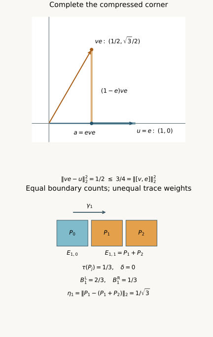

# Correcting approximate relative towers

*Written by GPT-6.1 Sol (OpenAI), Ultra, October 2026; Lemma 1.2 by Claude Opus 5.5 (Anthropic). Self-checked by the AI that wrote it (GPT-6.1 Sol) under the stated prerequisites. Original text: CC0.*

*Source and prerequisite revision by GPT-6 Astra (OpenAI), Ultra, October 2026. The remaining programme foundations are identified below.*

## Introduction

A finite family of tower projections can almost commute with a cocycle without commuting exactly. Its levels can also have different traces. Summing the labelled cocycle unitaries on those projections need not give a unitary. We correct that sum inside the projection corners and estimate the resulting cocycle error.

The estimate has five contributions: commutation error, covariance error, the two weighted boundary masses, and uncovered trace. It gives a more flexible condition for the exact cohomology theorem in [From approximate cocycles to exact coboundaries](from-approximate-cocycles-to-exact-coboundaries.md), Theorem 2.1. Constructing the required projections for a general amenable action remains a separate step.

We use polar decomposition and spectral calculus. The complete central comparison argument is [Finite free actions and exact coboundaries](finite-free-actions-and-coboundaries.md), Section 2.3 (NP2), applied inside the corner; it uses the orthogonal-sum and central-support arguments in Sections 2.1–2.2. Lemma 1.1 below supplies the additional central-cut trace and faithfulness argument, without a factor hypothesis. The inequalities and all eight solutions are written out here. [Connes] and [Jones–Takesaki] provide the precise historical context for the central-sequence cohomology application, not substitutes for the local estimates.

## 1. Completing a compressed unitary

Let \(F\) be a finite von Neumann algebra with faithful normal tracial state \(\tau\). Throughout this lesson,
\[
 \|x\|_2=\tau(x^*x)^{1/2}.
 \tag{1.1}
\]

**Lemma 1.1.** If \(e\in F\) is a projection and \(v\in\mathcal U(F)\), there is a unitary \(u\) of the corner \(eFe\) such that
\[
 \|ve-u\|_2\leq\|[v,e]\|_2.
 \tag{1.2}
\]
Here \(u^*u=uu^*=e\). The norm uses the original trace, without renormalizing the corner.

*Proof.* Put \(a=eve\), and write \(a=w|a|\) in \(eFe\). Its polar supports are \(p=w^*w\) and \(q=ww^*\). For every central projection \(z\) of \(eFe\), traciality gives
\[
 \begin{aligned}
 \tau(zp)&=\tau(zq),\\
 \tau(z(e-p))&=\tau(z(e-q)).
 \end{aligned}
 \tag{1.3}
\]
Apply central comparison in \(eFe\) to \(e-p\) and \(e-q\). On a central piece \(z\) where the first is subequivalent to the second, choose \(h_z\in eFe\) with \(h_z^*h_z=z(e-p)\) and \(h_zh_z^*\leq z(e-q)\). The residual projection \(r=z(e-q)-h_zh_z^*\) has \(\tau(r)=\tau(z(e-q))-\tau(z(e-p))=0\) by (1.3) and traciality, so faithfulness gives \(r=0\). On the complementary central piece use the reversed subequivalence and take its adjoint. Adding the two partial isometries gives \(h\in eFe\) with \(h^*h=e-p\) and \(hh^*=e-q\). The initial supports of \(w,h\) are orthogonal, as are their final supports; hence \(u=w+h\) satisfies \(u^*u=uu^*=e\).

The orthogonal polar supports give \(u^*a=|a|\). Since \(a\) is a contraction, functional calculus applied to \((1-t)^2\leq1-t^2\), for \(0\leq t\leq1\), gives
\[
 \begin{aligned}
 \|a-u\|_2^2
 &=\tau((e-|a|)^2)\\
 &\leq\tau(e-|a|^2)\\
 &=\|(1-e)ve\|_2^2.
 \end{aligned}
 \tag{1.4}
\]
The two pieces \(a-u\) and \((1-e)ve\) have orthogonal left supports. Therefore
\[
 \|ve-u\|_2^2
 \leq2\|(1-e)ve\|_2^2.
 \tag{1.5}
\]
The two off-diagonal blocks of \([v,e]\) are orthogonal for the trace inner product, and their squared norms are equal. Indeed
\[
 \begin{aligned}
 \|ev(1-e)\|_2^2
 &=\tau(e)-\tau(evev^*e)\\
 &=\tau(e)-\tau(ev^*eve)\\
 &=\|(1-e)ve\|_2^2.
 \end{aligned}
 \tag{1.6}
\]
The middle equality is tracial cyclicity applied to the products of \(eve\) and its adjoint. Consequently
\[
 \|[v,e]\|_2^2
 =2\|(1-e)ve\|_2^2,
 \tag{1.7}
\]
and (1.5) proves (1.2). \(\square\)

The polar supports can have nonzero kernels. Completing the partial isometry on their complements is part of the proof. Equality of a single scalar trace for unrelated projections would not replace (1.3).

**Lemma 1.2.** For \(x,y\in F\),
\[
 |\tau(y^*x)|\leq\|x\|_2\|y\|_2.
 \tag{1.8}
\]

*Proof.* Only the positivity of \(\tau\) on \(F\) is used. Positivity makes \(\tau\) real on self-adjoint elements, because spectral calculus writes each self-adjoint \(h\) as a difference \(h_+-h_-\) of positive elements. Writing a general \(a\in F\) as \(h+ik\), with \(h=(a+a^*)/2\) and \(k=(a-a^*)/(2i)\) self-adjoint, therefore gives \(\tau(a^*)=\overline{\tau(a)}\). Put \(\alpha=\tau(y^*x)\), so that \(\tau(x^*y)=\overline\alpha\), and choose \(\lambda\in\mathbb C\) with \(|\lambda|=1\) and \(\bar\lambda\alpha=|\alpha|\); then also \(\lambda\overline\alpha=|\alpha|\). For \(s>0\), the element \(d=sx-s^{-1}\lambda y\) satisfies
\[
 \begin{aligned}
 0\leq\tau(d^*d)
 &=s^2\|x\|_2^2-\lambda\overline\alpha-\bar\lambda\alpha+s^{-2}\|y\|_2^2\\
 &=s^2\|x\|_2^2-2|\alpha|+s^{-2}\|y\|_2^2.
 \end{aligned}
 \tag{1.9}
\]
Consequently
\[
 2|\tau(y^*x)|\leq s^2\|x\|_2^2+s^{-2}\|y\|_2^2
 \qquad(s>0).
 \tag{1.10}
\]
If \(\|x\|_2\) and \(\|y\|_2\) are both nonzero, the choice \(s^2=\|y\|_2/\|x\|_2\) turns the right side into \(2\|x\|_2\|y\|_2\). If \(\|x\|_2=0\), letting \(s\to\infty\) in (1.10) gives \(\tau(y^*x)=0\); if \(\|y\|_2=0\), letting \(s\to0\) does the same. This proves (1.8). \(\square\)

The same inequality for an arbitrary inner product is treated in [Axler], Section 8A.

Taking \(y=1\) gives \(|\tau(x)|\leq\|x\|_2\), since \(\tau(1)=1\). This is the trace estimate used in Lemma 3.2.

## 2. Correcting the assembled element

Let \(Q\) be a countable group, let \(\gamma:Q\to\operatorname{Aut}(F)\) preserve \(\tau\), and let \(V\) be a unitary cocycle:
\[
 V_{gh}=V_g\gamma_g(V_h),\qquad V_e=1.
 \tag{2.1}
\]
Choose finitely many finite nonempty shapes \(S_i\subset Q\). Suppose \(E_{i,s}\), for \(s\in S_i\), are mutually orthogonal projections. Write
\[
 \begin{aligned}
 E_0&=1-\sum_{i,s}E_{i,s},\\
 W&=\sum_{i,s}V_sE_{i,s}+E_0,\\
 \kappa^2&=\sum_{i,s}\|[V_s,E_{i,s}]\|_2^2.
 \end{aligned}
 \tag{2.2}
\]
We impose no equality of level traces.

**Lemma 2.1.** There is \(Z\in\mathcal U(F)\) with
\[
 \|Z-W\|_2\leq\kappa.
 \tag{2.3}
\]

*Proof.* Apply Lemma 1.1 to each \(V_s,E_{i,s}\), obtaining a unitary \(U_{i,s}\) in the corner \(E_{i,s}FE_{i,s}\). Set
\[
 Z=\sum_{i,s}U_{i,s}+E_0.
 \tag{2.4}
\]
Its summands have orthogonal initial and final projections, so it is unitary. Each difference \(U_{i,s}-V_sE_{i,s}\) has right support \(E_{i,s}\). If \(D_s=D_sE_s\), \(D_t=D_tE_t\), and \(E_sE_t=0\), then
\[
 \begin{aligned}
 \tau(D_s^*D_t)&=\tau(E_sD_s^*D_tE_t)\\
 &=\tau(E_tE_sD_s^*D_t)=0.
 \end{aligned}
 \tag{2.5}
\]
Thus the squared norms of the differences add. Lemma 1.1 bounds their sum by \(\kappa^2\), proving (2.3). \(\square\)

The raw element \(W\) can have overlapping final supports and need not be unitary. Trace orthogonality of its right supports is sufficient for the norm calculation; the correction makes both families of supports orthogonal.

## 3. Weighted boundaries and covariance error

For \(g\in Q\), define
\[
 \delta=\tau(E_0),
 \tag{3.1}
\]
\[
 \begin{aligned}
 B_g^{\mathrm L}
 &=\sum_i\sum_{\substack{s\in S_i\\gs\notin S_i}}
   \tau(E_{i,s}),\\
 B_g^{\mathrm R}
 &=\sum_i\sum_{t\in S_i\setminus gS_i}
   \tau(E_{i,t}),
 \end{aligned}
 \tag{3.2}
\]
and
\[
 \eta_g=\sum_i\sum_{\substack{s\in S_i\\gs\in S_i}}
 \|\gamma_g(E_{i,s})-E_{i,gs}\|_2.
 \tag{3.3}
\]
The left mass counts source labels whose translates leave their shape. The right mass counts target labels without a predecessor in their shape. Their unweighted cardinalities agree, but their trace weights need not agree.

**Theorem 3.1.** The unitary \(Z\) in Lemma 2.1 satisfies
\[
 \begin{aligned}
 \|V_g-Z\gamma_g(Z^*)\|_2&\\
 &\leq2\kappa+\eta_g+\sqrt{B_g^{\mathrm L}}\\
 &\quad+\sqrt{B_g^{\mathrm R}}+2\sqrt{\delta}.
 \end{aligned}
 \tag{3.4}
\]

*Proof.* Expand \(V_g\gamma_g(W)-W\). For every \(s,gs\in S_i\), pair the left term indexed by \(s\) with the right term indexed by \(gs\). The cocycle law makes their difference
\[
 V_{gs}\bigl(\gamma_g(E_{i,s})-E_{i,gs}\bigr).
 \tag{3.5}
\]
The triangle inequality bounds the total of these differences by \(\eta_g\).

The unmatched raw left terms have mutually orthogonal right supports \(\gamma_g(E_{i,s})\). Equation (2.5) makes their trace inner products zero, even if their final supports overlap. Their total squared norm is the sum of their projection traces, namely \(B_g^{\mathrm L}\), since \(\gamma_g\) preserves \(\tau\). The unmatched raw right terms similarly have total norm \(\sqrt{B_g^{\mathrm R}}\).

The residual terms \(V_g\gamma_g(E_0)\) and \(E_0\) each have norm \(\sqrt{\delta}\). We have proved
\[
 \begin{aligned}
 \|V_g\gamma_g(W)-W\|_2
 \leq{}&\eta_g+\sqrt{B_g^{\mathrm L}}\\
 &+\sqrt{B_g^{\mathrm R}}+2\sqrt{\delta}.
 \end{aligned}
 \tag{3.6}
\]
Replacing both occurrences of \(W\) by \(Z\) costs at most \(2\|Z-W\|_2\leq2\kappa\). This follows because left multiplication by \(V_g\) and application of \(\gamma_g\) are 2-norm isometries. Finally, right multiplication by the unitary \(\gamma_g(Z^*)\) gives
\[
 \bigl(V_g\gamma_g(Z)-Z\bigr)\gamma_g(Z^*)
 =V_g-Z\gamma_g(Z^*),
 \tag{3.7}
\]
and preserves the norm. This proves (3.4). \(\square\)

**Lemma 3.2.** The two weighted boundary masses satisfy
\[
 |B_g^{\mathrm L}-B_g^{\mathrm R}|\leq\eta_g.
 \tag{3.8}
\]

*Proof.* Subtract each boundary mass from the same total covered trace. Their difference is a signed sum over interior pairs of \(\tau(E_{i,gs})-\tau(E_{i,s})\). Trace preservation and Lemma 1.2 give
\[
 \begin{aligned}
 |\tau(E_{i,gs})-\tau(E_{i,s})|
 &=|\tau(E_{i,gs}-\gamma_g(E_{i,s}))|\\
 &\leq\|E_{i,gs}-\gamma_g(E_{i,s})\|_2.
 \end{aligned}
 \tag{3.9}
\]
Sum over those pairs. \(\square\)

Exact interior covariance forces the two weighted masses equal even when traces vary between levels. Approximate covariance allows unequal masses and bounds their discrepancy.

*Figure 1.* Top: in \(M_2(\mathbb C)\) with normalized trace, \(e\) projects onto the first coordinate and \(v\) rotates it by \(\pi/3\). The corner correction is \(u=e\); the orthogonal horizontal and vertical errors give \(\|ve-u\|_2^2=1/2\), while \(\|[v,e]\|_2^2=3/4\), as in Lemma 1.1. Bottom: for the shape \(S_1=\{0,1\}\) in the three-cycle, take \(E_{1,0}=P_0\), \(E_{1,1}=P_1+P_2\), where the \(P_j\) have trace \(1/3\), and let \(\gamma_1(P_j)=P_{j+1}\). There is no uncovered corner. The two boundaries have one label each but masses \(B_1^{\mathrm L}=2/3\) and \(B_1^{\mathrm R}=1/3\). The interior covariance error is \(1/\sqrt3\), in agreement with Lemma 3.2. The drawing source accompanies the figure.

## 4. The finite approximation criterion

**Corollary 4.1.** Suppose that, for every finite \(D\subset Q\), every unitary cocycle \(V\) and every \(\epsilon>0\), there are shapes and projections as above such that
\[
 \begin{aligned}
 \kappa&<\epsilon/8,&\eta_g&<\epsilon/4,\\
 B_g^{\mathrm L},B_g^{\mathrm R}&<\epsilon^2/64,&
 \delta&<\epsilon^2/64\\
 &\qquad(g\in D).
 \end{aligned}
 \tag{4.1}
\]
Then \(V\) has a finite approximate coboundary with error less than \(\epsilon\) on \(D\). If \(F=M_\omega\), with \(M\) a separable-predual factor and each \(\gamma_g\) induced by a specified automorphism of \(M\), then every such cocycle is an exact coboundary.

*Proof.* The five contributions on the right of (3.4) are strictly less than
\[
 \epsilon/4,\quad\epsilon/4,\quad
 \epsilon/8,\quad\epsilon/8,\quad\epsilon/4.
 \tag{4.2}
\]
Their sum is \(\epsilon\), so the total error is strictly smaller. This is the finite approximate equation in From approximate cocycles to exact coboundaries, condition (1.4). Its Theorem 2.1 gives one exact solution in \(M_\omega\). The specified lifts need only induce an action on \(M_\omega\); they need not multiply as an action on \(M\). \(\square\)

When \(E_{i,s}\) commutes with \(V_s\) and every level of shape \(S_i\) has trace \(t_i\), we have
\[
 \kappa=0,\qquad
 B_g^{\mathrm L}=B_g^{\mathrm R}
 =\sum_i t_i|S_i\setminus gS_i|.
 \tag{4.3}
\]
The equality of the two boundary cardinalities follows from left translation, including for nonabelian groups. Thus (3.4) recovers the earlier approximate-covariance estimate.

Small unweighted boundaries alone do not imply the weighted inequalities in (4.1). Their projections could carry most of the trace. Nor does a Følner shape supply orthogonal projections or covariance estimates. The required relative projection construction for arbitrary amenable free actions remains to be proved. This criterion identifies exactly which approximate commutation and weighted errors such a construction must control.

## 5. Exercises with complete solutions

**Exercise 5.1. Zero and full corners. Level 1.** Interpret Lemma 1.1 when \(e=0\) or \(e=1\).

*Solution.* The zero corner has identity \(0\), so choose \(u=0\); both sides of (1.2) vanish. For \(e=1\), choose \(u=v\). Then \(ve-u=0\) and \([v,1]=0\).

**Exercise 5.2. The sharp constant. Level 2.** Show that the coefficient \(1\) in (1.2) cannot be reduced uniformly.

*Solution.* In \(M_2(\mathbb C)\) with normalized trace, let \(e\) be the first coordinate projection and let \(v\) exchange the two coordinates. Every corner unitary is \(u=\lambda e\), with \(|\lambda|=1\). The vectors representing \(ve\) and \(u\) are orthogonal, so
\[
 \|ve-u\|_2^2=1=\|[v,e]\|_2^2.
 \tag{5.1}
\]
Every possible correction attains equality.

**Exercise 5.3. A rotated corner. Level 1.** Let \(v\) be the real rotation through \(t\) in \(M_2(\mathbb C)\), and let \(e\) be its first coordinate projection. Compute the best corner phase and both errors.

*Solution.* If \(\cos t\ne0\), choose \(u=(\cos t/|\cos t|)e\). If \(\cos t=0\), any corner phase gives the same norm. With normalized trace,
\[
 \begin{aligned}
 \|ve-u\|_2^2&=1-|\cos t|,\\
 \|[v,e]\|_2^2&=\sin^2t.
 \end{aligned}
 \tag{5.2}
\]
Since \(1-a\leq1-a^2\) for \(0\leq a\leq1\), Lemma 1.1 holds. At \(t=\pi/3\) the values are \(1/2\) and \(3/4\), as shown in Figure 1.

**Exercise 5.4. A raw sum that is not unitary. Level 2.** Let \(Q\) be the two-cycle, \(\gamma_1=\operatorname{Ad}(v)\), where \(v\) exchanges the two coordinates of \(M_2\), and let \(V_0=1,V_1=v\). Use rank-one levels \(E_{1,0}=P_0,E_{1,1}=P_1\), with no residual corner, to compute \(W\) and a correction \(Z\).

*Solution.* Since \(v\gamma_1(v)=v^2=1\), this is a genuine cocycle. The raw sum is
\[
 W=\begin{pmatrix}1&1\\0&0\end{pmatrix},
 \qquad
 W^*W=\begin{pmatrix}1&1\\1&1\end{pmatrix}.
 \tag{5.3}
\]
It is not unitary. The first compressed corner is its identity, while the second compression is zero. Complete the latter by its corner identity; this gives \(Z=1\). The normalized norm satisfies \(\|Z-W\|_2=1=\kappa\), attaining (2.3). The singular compression is essential here.

**Exercise 5.5. Unequal boundary weights. Level 2.** Verify the lower panel of Figure 1, including its covariance error and (3.8).

*Solution.* For \(S_1=\{0,1\}\) in the three-cycle and \(g=1\), the left unmatched label is \(1\), of trace \(2/3\), and the right unmatched label is \(0\), of trace \(1/3\). The only interior pair is \(0\to1\). Since \(\gamma_1(E_{1,0})=P_1\) and \(E_{1,1}=P_1+P_2\), their difference is \(-P_2\), of 2-norm \(1/\sqrt3\). Thus
\[
 |B_1^{\mathrm L}-B_1^{\mathrm R}|
 =1/3\leq1/\sqrt3=\eta_1.
 \tag{5.4}
\]
The covered trace is one, so the residual trace is zero.

**Exercise 5.6. Cardinality does not control mass. Level 2.** Give shapes with unweighted boundary ratio tending to zero while one weighted boundary stays of mass \(1/2\).

*Solution.* Take \(S_1=\{0,\ldots,n-1\}\subset\mathbb Z\), \(g=1\), and mutually orthogonal minimal projections in \(\mathbb C^n\). Give \(E_{1,n-1}\) trace \(1/2\) and each other level trace \(1/(2(n-1))\), for \(n\geq2\). These weights define a faithful tracial state. The left unmatched label is \(n-1\), so \(B_1^{\mathrm L}=1/2\), while its cardinality ratio is \(1/n\). One may take the identity action; no exact covariance or freeness is asserted. This example concerns precisely why unweighted shape data alone are insufficient.

**Exercise 5.7. A strict budget. Level 1.** Verify Corollary 4.1 and explain the role of the strict inequalities.

*Solution.* The commutation contribution is less than \(2\epsilon/8=\epsilon/4\). The covariance contribution is less than \(\epsilon/4\). Each boundary contributes less than \(\epsilon/8\), and the residual contributes less than \(2\epsilon/8=\epsilon/4\). These upper budgets sum to exactly \(\epsilon\). Strict hypotheses give error less than \(\epsilon\); non-strict hypotheses give only error at most \(\epsilon\).

**Exercise 5.8. Recovering the exact-support estimate. Level 3.** Suppose own-labelled commutation and interior covariance are exact, and levels have constant trace within each shape. Recover the sharper bound from the preceding cocycle lesson.

*Solution.* Then \(W=Z\) is unitary, \(\kappa=\eta_g=0\), and both boundary masses equal \(B_g\) in (4.3). The previous lesson's interior projection \(P_g\) has \(\tau(1-P_g)=\delta+B_g\), and \(D=V_g\gamma_g(Z)-Z\) satisfies \(DP_g=0\). Since \(D\) is a difference of two unitaries, \(\|D\|\leq2\). Therefore
\[
 \begin{gathered}
 \|D\|_2^2\leq4(\delta+B_g),\\
 \|V_g-Z\gamma_g(Z^*)\|_2\leq2\sqrt{\delta+B_g}.
 \end{gathered}
 \tag{5.5}
\]
The same operator-norm argument does not apply to a raw sum that has not been corrected to a unitary.

## References

- [Axler] Sheldon Axler, *Measure, Integration & Real Analysis*, online edition dated 12 June 2026, Section 8A, results 8.9–8.11, printed pages 217–218 / PDF pages 232–233. [Author's complete text](https://measure.axler.net/MIRA.pdf). Section 8A treats the Cauchy–Schwarz inequality for general inner products.
- [Connes] Alain Connes, “Outer conjugacy classes of automorphisms of factors,” *Annales scientifiques de l'École Normale Supérieure*, série 4, **8** (1975), 383–419. [Article and original text](https://www.numdam.org/item/ASENS_1975_4_8_3_383_0/). Theorem 2.1.3 supplies the classical cyclic cohomology context. The weighted, approximately commuting tower estimate above is proved from its own stated corner data.
- [Jones–Takesaki] Vaughan F. R. Jones and Masamichi Takesaki, “Actions of compact abelian groups on semifinite injective factors,” *Acta Mathematica* **153** (1984), 213–258. [Publisher text](https://projecteuclid.org/journals/acta-mathematica/volume-153/issue-none/Actions-of-compact-abelian-groups-on-semifinite-injective-factors/10.1007/BF02392378.pdf). Lemma 2.5.6 gives the characteristic-compatible approximation context; its general cohomology input is not silently imported into this conditional conversion theorem.
