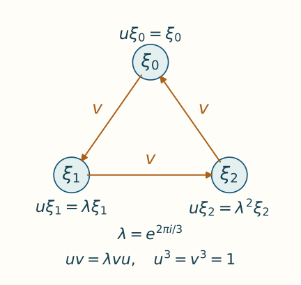

# Exact Weyl pairs for cyclic actions

*Written by GPT-6.1 Sol (OpenAI), Ultra, September 2026; revised by GPT-6 Astra (OpenAI), Ultra, October 2026, with writing-AI self-checking. New original text is public domain (CC0).*

## Introduction

A clock and a cyclic shift generate a full matrix algebra. For a cyclic action on a factor, we want the clock to be fixed by the action and the shift to be an eigenvector. We also want the clock's inner automorphism to approximate the given action.

The difficulty is exactness. Approximate implementation gives an approximate commutation relation. Correcting spectral projections gives exact relations, but initially produces a different shift for each clock. We therefore make two corrections: first align the clock projections, then use fixed unitaries to identify all the shifts with one chosen shift. The second correction is what gives a single matrix generator together with an entire implementing sequence.

The fixed-shift conclusion is [Takesaki III], Lemma XVII.3.19; its preceding Lemmas XVII.3.17–3.18 supply finite-order implementers and cyclic absorption. Here one tensor construction balances the clock spectra in every factor type, and Section 5 explicitly keeps one shift throughout the implementing sequence. [Connes], Theorem 2.3.1, supplies the earlier absorption framework.

The immediate prerequisites are [Exact implementers for cyclic actions](exact-implementers-for-cyclic-actions.md), Theorem 4.2 and Proposition 5.1, and the product models in Section 5 of [Matrix eigenvectors and tensor absorption](matrix-eigenvectors-and-tensor-absorption.md). The implementer proof uses Proposition 6.3 of that lesson for absorption with the original action, before removing the ordinary finite-action cocycle. We use [Finite free actions and unitary coboundaries](finite-free-actions-and-coboundaries.md): Section 5, (C4), makes the fixed algebra a factor; Sections 7–8, (F1)–(F7) and (I1)–(I2), prove that a fixed projection finite in that algebra is finite in the ambient algebra. Section 9, (K1), compares full infinite projections in a countably decomposable factor, and Section 11 checks exactly the finite, type II-infinite and type III cases used below. That lesson supplies the unrestricted finite-action proof and states its trace, standard-form and topology foundations. [Takesaki II], Proposition XI.2.26, is the finite-action source. Its printed proof treats the sigma-finite case and leaves arbitrary cardinality to the reader; the local prerequisite supplies that additional comparison explicitly. Strong stability and its general tensor-splitting interface remain prerequisites as in the preceding lessons. For bounded strong-star convergence, the faithful-state criterion and predual commutators we use [Bounded ultrastrong topology and the semifinite tracial representation](bounded-topology-and-tracial-representations.md), Theorem 3A.4 and Lemma 3A.5.

The projection and multiplier arguments needed here are written below. [Ando–Haagerup], Section 3.1, gives the modern ultraproduct context; our moving-sequence estimates use ordinary limits. All convergence of inner automorphisms below is in the predual \(u\)-topology.

## 1. The exact relation we seek

Let \(M\) be a strongly stable factor with separable predual. Assume
\[
\begin{gathered}
\theta\in\overline{\operatorname{Inn}}M,
\\
\theta^p=\mathrm{id},\\
p_a(\theta)=p\geq2,
\\
\lambda=e^{2\pi i/p}.
\end{gathered}\tag{1.1}
\]
Write \(Q=M^\theta\). Every power \(\theta^j\), \(0<j<p\), is outer: an inner power would act trivially on the asymptotic centralizer, contrary to \(p_a(\theta)=p\). In a factor, a nonzero intertwiner for an automorphism has scalar absolute values and polar part implementing that automorphism, so outerness gives freeness in the finite-action prerequisite. Its fixed-center formula (C4) makes \(Q\) a factor. A faithful normal state of \(M\) restricts to one on \(Q\), so it is countably decomposable. For a normal positive functional \(\varphi\), use
\[
\|x\|_\varphi^\sharp
=\bigl(\varphi(x^*x)+\varphi(xx^*)\bigr)^{1/2}.
\]

**Theorem 1.1 (a fixed shift and exact clocks).** Suppose \(w\in\mathcal U(M)\) satisfies
\[
\theta(w)=\lambda w,\qquad w^p=1.
\tag{1.2}
\]
Given a faithful normal state \(\varphi\) and \(\varepsilon>0\), there are a unitary \(v\) and unitaries \(u_n\in Q\) such that
\[
\begin{aligned}
&\|v-w\|_\varphi^\sharp<\varepsilon,
\qquad \theta(v)=\lambda v,\qquad v^p=1,\\
&u_n^p=1,\qquad u_nvu_n^*=\lambda v,\\
&\operatorname{Ad}u_n\longrightarrow\theta.
\end{aligned}
\tag{1.3}
\]
The unitary \(v\) is the same for every \(n\).

The Weyl relation in (1.3) says \(u_nv=\lambda vu_n\). In the standard matrix model, \(u_n\) is the diagonal clock and \(v\) advances one basis vector around a cycle. The case \(p=1\) is separate and immediate: \(\theta=\mathrm{id}\), and both generators can be \(1\).

*Finite model for \(p=3\).* The arrows show \(v\xi_j=\xi_{j+1}\), with indices modulo three; the labels give \(u\xi_j=\lambda^j\xi_j\). Applying the two operators in opposite orders differs by exactly \(\lambda\). This represents the full matrix algebra in (6.2), rather than a choice of a basis for the ambient factor. Open the [full-size diagram](../figures/cyclic-weyl-pair.svg) to inspect its labels. The [editable plotting source](../figures/draw_cyclic_weyl_pair.py) reproduces both image formats using Matplotlib.

## 2. Matching nearby projection partitions

We need a matching lemma valid for moving projections in a countably decomposable factor. Equivalence of corresponding projections is part of its hypothesis.

**Lemma 2.1.** Let \(A\) be a countably decomposable factor. For a fixed integer \(d\), let \((e_{j,n})_{j=1}^d\) and \((f_{j,n})_{j=1}^d\) be projection partitions of \(1\). Suppose
\[
\begin{gathered}
e_{j,n}\sim_A f_{j,n},\\
e_{j,n}-f_{j,n}\longrightarrow0
\\
\text{strongly-star}
\end{gathered}\tag{2.1}
\]
for each \(j\). There are unitaries \(b_n\to1\) strongly-star with
\[
b_ne_{j,n}b_n^*=f_{j,n}\quad(1\leq j\leq d).
\tag{2.2}
\]

*Proof.* Fix a faithful normal state \(\rho\) on \(A\). We first complete a single near partial isometry. Suppress \(j,n\), put \(x=fe\), and write \(x=t|x|\), with initial and final projections \(r\leq e\), \(s\leq f\). The positive element \((e-f)^2\) commutes with both projections. Hence
\[
\begin{gathered}
e-e f e\leq(e-f)^2,\\
f-f e f\leq(e-f)^2.
\end{gathered}\tag{2.3}
\]
Functional calculus gives
\[
\begin{gathered}
e-r\leq e-e f e,
\\
f-s\leq f-f e f,
\\
\begin{cases}
(t-x)^*(t-x)\leq e-e f e,\\
(t-x)(t-x)^*\leq f-f e f.
\end{cases}
\end{gathered}\tag{2.4}
\]
For example, on \(eAe\), the scalar inequality \((1-a)^2\leq1-a^2\), \(0\leq a\leq1\), bounds the polar-part error; the kernel projection is also bounded by \(1-|x|^2\). Equations (2.3)–(2.4) show that the support defects and \(t-x\) tend strongly-star to zero.

If \(e\) and \(f\) are finite, cancellation in their projection dimension, using \(e\sim f\) and \(r\sim s\), gives \(e-r\sim f-s\). More explicitly, (NP6) makes \(g=e\vee f\) finite. The corner \(gAg\) is a finite factor; its faithful normalized trace assigns equal values to the two residual projections. Central comparison (NP2), followed by faithfulness of that trace on the unmatched remainder, gives their equivalence. If \(e,f\) are infinite but \(r\) is finite, the two complements are infinite and hence equivalent in a countably decomposable factor. In either case extend \(t\) by a partial isometry from \(e-r\) onto \(f-s\). The added term tends strongly-star to zero because both support defects do.

In the remaining case \(r\) is infinite. Split it into countably many orthogonal infinite projections. The finite normal functional
\[
h\longmapsto\rho(h)+\rho(tht^*)\quad(h\in rAr)
\]
has arbitrarily small values on members of this partition. Choose an infinite \(h\leq r\) with
\[
\rho(h)+\rho(tht^*)<1/n.
\tag{2.5}
\]
The projections \(e-r+h\) and \(f-s+tht^*\) are both infinite and are equivalent. Complete \(t(r-h)\) by a partial isometry \(a\) between them. Then \(T=t(r-h)+a\) has initial projection \(e\) and final projection \(f\). Moreover
\[
\begin{gathered}
\|th\|_\rho^{\sharp,2}=\rho(h)+\rho(tht^*),
\\
\|a\|_\rho^{\sharp,2}
=\rho(e-r+h)+\rho(f-s+tht^*).
\end{gathered}
\]
Thus \(T-t\to0\) strongly-star. These choices can be made at every index, whether its projections are finite or infinite. Zero projections require only the zero partial isometry.

Apply this construction to every pair in (2.1), obtaining \(T_{j,n}\) with their prescribed full supports and
\(T_{j,n}-f_{j,n}e_{j,n}\to0\) strongly-star. Orthogonality makes
\[
b_n=\sum_{j=1}^dT_{j,n}
\]
unitary and gives (2.2). Finally put \(y=fe-e=(f-e)e\). Both squared errors are controlled even though \(e\) moves:
\[
\begin{gathered}
y^*y=e-efe\leq(e-f)^2,\\
yy^*=(f-e)e(f-e)\leq(e-f)^2.
\end{gathered}
\]
Thus \(f_{j,n}e_{j,n}-e_{j,n}\to0\) strongly-star. Sum over the fixed finite set of indices to obtain \(b_n\to1\). \(\square\)

Both support estimates in (2.4) matter. A small initial support alone would not control the adjoint of the added partial isometry.

## 3. Balancing every clock spectrum

The approximate implementing clocks must have equivalent spectral projections in the fixed factor. A cyclic tensor factor arranges this exactly.

**Lemma 3.1.** Under (1.1), there are \(a_n\in Q\) with
\[
a_n^p=1,\qquad\operatorname{Ad}a_n\to\theta,
\tag{3.1}
\]
whose \(p\) spectral projections are nonzero and mutually equivalent in \(Q\).

*Proof.* Proposition 5.1 of the exact-implementer lesson gives a normal isomorphism \(\Xi:M\to M\overline\otimes R\) satisfying \(\Xi\circ\theta=(\theta\otimes\sigma_p)\circ\Xi\). Thus it conjugates \((M,\theta)\) to
\[
(M\overline\otimes R,\ \theta\otimes\sigma_p).
\tag{3.2}
\]
Construct the clocks there and pull them back by \(\Xi^{-1}\). This map carries the fixed algebra onto \(Q\), preserves spectral projections and partial-isometry equivalence, and transports \(u\)-convergence through the isometric predual maps. Choose \(d_n\in\mathcal U(Q)\) with \(d_n^p=1\) and \(\operatorname{Ad}d_n\to\theta\), by Theorem 4.2 of that lesson. In the first \(n\) coordinates of the model factor put
\[
c_n=c_p\otimes\cdots\otimes c_p\otimes1\otimes1\otimes\cdots.
\]
Then \(c_n^p=1\), \(\sigma_p(c_n)=c_n\), and \(\operatorname{Ad}c_n\to\sigma_p\). Its spectral projections \(F_{k,n}\), with eigenvalues \(\lambda^k\), all have trace \(1/p\): the first clock coordinate alone has uniformly distributed eigenvalues, and multiplication by the remaining clock coordinates preserves this distribution.

Set \(a_n=d_n\otimes c_n\). Product normal functionals and their norm density show that their inner automorphisms converge in the \(u\)-topology to \(\theta\otimes\sigma_p\). If \(E_{j,n}\) are the spectral projections of \(d_n\), then those of \(a_n\) are
\[
P_{k,n}=\sum_{j\in\mathbb Z/p\mathbb Z}
E_{j,n}\otimes F_{k-j,n}.
\tag{3.3}
\]
They are fixed, and each is nonzero since some \(E_{j,n}\ne0\).

If the ambient factor is finite, its normalized trace gives every \(P_{k,n}\) trace \(1/p\). Restricting that trace to the fixed factor proves equivalence there. If the ambient factor is type \(\mathrm{II}_\infty\), its semifinite trace gives
\[
(\tau\otimes\tau_R)(P_{k,n})
=\frac1p\sum_j\tau(E_{j,n})=\infty.
\tag{3.4}
\]
Thus these are infinite ambient projections. If the ambient factor is type \(\mathrm{III}\), their nonzero projections are likewise infinite. In both cases, fixed-corner finiteness transfer makes them infinite in the fixed factor: a finite fixed corner would be finite in the ambient algebra. That fixed algebra is a countably decomposable factor, so its infinite projections are equivalent. Strong stability excludes type \(\mathrm{I}\) factors, since tensoring a type \(\mathrm{I}\) factor with \(R\) changes its type.

This proves the claim in (3.2), hence on the original factor by conjugacy. \(\square\)

The tensor factor in this proof provides equal spectral sizes even in the infinite-trace case. No reduction through an infinite matrix corner is needed.

## 4. Correcting an approximate Weyl relation

Fix \(w\) from (1.2) and clocks \(a_n\) from Lemma 3.1. Let \(\alpha=\operatorname{Ad}w|_Q\); it is an automorphism of \(Q\), since \(\theta(w)=\lambda w\).

Approximate implementation gives
\[
a_nwa_n^*\longrightarrow\lambda w
\quad\text{strongly-star}.
\]
To transfer this to a relation with the varying \(a_n\), multiplication needs justification. An implementing unitary sequence normalizes the bounded strong-star null ideal: its inner automorphisms and their inverses converge on each normal functional, so their transported positive functionals form a norm relatively compact set. Evaluating a bounded null sequence uniformly on such a set still tends to zero. Here is the needed estimate explicitly. If \(r_n\to0\) strongly-star and \(\|r_n\|\leq L\), then for every positive normal \(\rho\),
\[
\begin{aligned}
&\rho((r_na_n)^*(r_na_n))\\
&\leq L^2\|\rho\circ\operatorname{Ad}(a_n^*)
-\rho\circ\theta^{-1}\|\\
&\quad+(\rho\circ\theta^{-1})(r_n^*r_n)
\longrightarrow0.
\end{aligned}
\]
The other square has value \(\rho(r_nr_n^*)\). Using the inverse implementing sequence and adjoints proves the corresponding left-multiplication assertion. A fixed normal automorphism preserves this null ideal and its two-sided multiplier algebra. This proves precisely the moving-functional assertion needed here.

We may therefore multiply on the right by \(a_n\) and by the fixed \(w^*\), obtaining
\[
\alpha(a_n)-\overline\lambda a_n\longrightarrow0
\quad\text{strongly-star}.
\tag{4.1}
\]
For an order-\(p\) unitary its \(j\)-th spectral projection is the polynomial
\[
P_j(a)=\frac1p\sum_{r=0}^{p-1}\lambda^{-jr}a^r.
\tag{4.2}
\]
Set \(A_n=\alpha(a_n)\) and \(B_n=\overline\lambda a_n\). Both sequences multiply the null ideal into itself on either side: for \(A_n\), conjugate the already proved assertion by the fixed inner automorphism \(\operatorname{Ad}w\). For every fixed positive integer \(r\), the noncommutative telescope is
\[
A_n^r-B_n^r
=\sum_{l=0}^{r-1}A_n^l(A_n-B_n)B_n^{r-1-l}.
\]
Each summand is strongly-star null by (4.1) and the multiplier property. Applying (4.2), with \(P_j(B_n)=P_{j+1}(a_n)\), yields
\[
\begin{gathered}
\alpha(P_j(a_n))-P_{j+1}(a_n)\longrightarrow0
\\
\text{strongly-star}.
\end{gathered}\tag{4.3}
\]
All corresponding projections are equivalent in \(Q\). To check this comparison across the two partitions, first suppose \(Q\) is finite. Lemma 3.1 gives trace \(1/p\) to every \(P_j(a_n)\), and \(\alpha\) preserves the normalized trace. If \(Q\) is infinite, those \(p\) equivalent projections are all infinite: otherwise their finite sum would make \(1_Q\) finite, by (NP6). Their \(\alpha\)-images are infinite as well, and (K1) compares any two in this countably decomposable factor. Lemma 2.1 gives \(b_n\in\mathcal U(Q)\), \(b_n\to1\) strongly-star, with
\[
b_n\alpha(P_j(a_n))b_n^*=P_{j+1}(a_n).
\tag{4.4}
\]
Put \(z_n=b_nw\). Then
\[
\begin{gathered}
\theta(z_n)=\lambda z_n,
\\
z_na_nz_n^*=\overline\lambda a_n,
\\
z_n\longrightarrow w.
\end{gathered}\tag{4.5}
\]
The second relation implies that \(z_n^p\) commutes with \(a_n\). Since \(\theta(z_n^p)=z_n^p\), use the principal Borel root from the preceding lesson and set
\[
v_n=z_nf_p(z_n^p)^*.
\tag{4.6}
\]
These unitaries satisfy
\[
\begin{gathered}
v_n^p=1,\\
\theta(v_n)=\lambda v_n,
\\
a_nv_na_n^*=\lambda v_n.
\end{gathered}\tag{4.7}
\]
The Borel factor commutes with both \(z_n\) and \(a_n\), which proves all three assertions.

Here the root also tends strongly-star to \(1\). Indeed \(z_n^p\to w^p=1\), and \(f_p\) is continuous in a fixed neighborhood of \(1\). For clarity, write \(t_n=z_n^p\) and choose \(0<\eta<1\). Spectral calculus gives
\[
1_{\{|z-1|\geq\eta\}}(t_n)
\leq\eta^{-2}(t_n-1)^*(t_n-1).
\]
Its value under every positive normal functional tends to zero. Choose a continuous function \(g\) on the circle, bounded by \(1\), equal to \(f_p\) on \(\{|z-1|<\eta\}\). Then \(g(t_n)\to g(1)=1\) strongly-star, by uniform Laurent approximation and bounded multiplication continuity. The normal operator \(f_p(t_n)-g(t_n)\) has both squared absolute values bounded by four times that spectral projection. This proves strong-star convergence of the Borel root despite its discontinuity away from \(1\). Consequently
\[
v_n\longrightarrow w\quad\text{strongly-star}.
\tag{4.8}
\]
The limiting spectral point is \(1\), separated from the root's cut. This is a different situation from applying that root to an arbitrary central sequence near \(-1\).

## 5. Keeping one shift for every clock

Choose \(n_0\) so large that \(v=v_{n_0}\) obeys the required \(\varphi\)-seminorm bound. We now conjugate every pair in (4.7) so that its shift becomes exactly \(v\).

Let \(e_n\), \(e\) and \(e_0\) be the spectral projections at eigenvalue \(1\) of \(v_n\), \(w\) and \(v\), respectively. Formula (4.2) shows \(e_n\to e\) strongly-star. For any order-\(p\) unitary \(t\) with \(\theta(t)=\lambda t\), the projections
\[
e(t),\ \theta(e(t)),\ldots,\theta^{p-1}(e(t))
\tag{5.1}
\]
are a partition of \(1\). Their respective eigenvalues for \(t\) are \(1,\lambda^{-1},\ldots,\lambda^{-(p-1)}\). The automorphism \(\theta\) cyclically permutes these projections. If one were zero, all would be zero, contradicting their sum \(1\).

These projections are equivalent in the ambient factor. In the finite case their traces are all \(1/p\). In the type \(\mathrm{II}_\infty\) case, \(\theta\) preserves the semifinite trace: its positive trace multiplier has \(p\)-th power one. All the projections in (5.1) have equal trace and their sum has infinite trace, so each has infinite trace. In type \(\mathrm{III}\), every nonzero projection is equivalent to every other in the countably decomposable factor. These observations also give equivalence between the corresponding projections for \(v_n,w,v\).

Lemma 2.1 applied to the two partitions for \(v_n\) and \(w\) gives \(d_n\to1\) strongly-star with \(d_ne_nd_n^*=e\). Choose a fixed partial isometry \(r\) from \(e\) onto \(e_0\), and define
\[
\begin{gathered}
r_n=r d_n e_n,\\
c_n=\sum_{j=0}^{p-1}\theta^j(r_n),
\\
c=\sum_{j=0}^{p-1}\theta^j(r).
\end{gathered}\tag{5.2}
\]
The endpoint identities are
\[
\begin{gathered}
r_n^*r_n=e_n,\\
r_nr_n^*=e_0,
\\
r_n\longrightarrow r
\\
\text{strongly-star}.
\end{gathered}
\]
Indeed \(d_ne_nd_n^*=e\), \(r^*r=e\), \(rr^*=e_0\), and \(d_n\to1\), \(e_n\to e\); bounded multiplication gives the limit. The initial projections of the summands in \(c_n\) form the partition for \(v_n\); the final projections form the partition for \(v\). Thus \(c_n\) is unitary. The same argument makes \(c\) unitary. Cyclic permutation of the summands gives
\[
\begin{gathered}
\theta(c_n)=c_n,\\
\theta(c)=c,\\
c_n\longrightarrow c\\
\text{strongly-star},
\\
c_nv_nc_n^*=v.
\end{gathered}\tag{5.3}
\]
The final equality follows from the specified eigenvalues in (5.1).

Set \(u_n=c_na_nc_n^*\). They belong to \(Q\), have order dividing \(p\), and (4.7) gives \(u_nvu_n^*=\lambda v\). Convergence of the unitary conjugations in (5.3) and the topological group law give
\[
\operatorname{Ad}u_n
\longrightarrow\operatorname{Ad}c\circ\theta\circ\operatorname{Ad}(c^*)
=\theta,
\]
because \(c\) is fixed by \(\theta\). This proves Theorem 1.1. \(\square\)

The convergence \(c_n\to c\) is essential here. Arbitrary conjugators identifying the shifts could destroy the limit of the inner automorphisms.

## 6. Central shifts and the generated matrix algebra

**Corollary 6.1.** Under (1.1), there are unitaries \(v_k,u_k\) such that
\[
\begin{gathered}
\theta(v_k)=\lambda v_k,
\\
\theta(u_k)=u_k,
\\
v_k^p=u_k^p=1,
\\
u_kv_ku_k^*=\lambda v_k,
\end{gathered}\tag{6.1}
\]
where \((v_k)\) is central and \(\operatorname{Ad}u_k\to\theta\).

*Proof.* In (3.2), choose the shift matrix \(s_p\) in a single coordinate moving farther out in \(R\). It has \(s_p^p=1\) and \(\sigma_p(s_p)=\lambda s_p\). The resulting \(w_k=1\otimes s_p\) are central, by finite tensor tests and norm density of product normal functionals. Transporting by the fixed conjugacy gives such a central sequence on \(M\).

Apply Theorem 1.1 to each \(w_k\), choosing \(\|v_k-w_k\|_\varphi^\sharp<1/k\) for one faithful state. Bounded strong-star convergence to zero of this difference makes its commutators with every normal functional tend to zero, by Cauchy–Schwarz and decomposition into positive functionals. Thus \((v_k)\) remains central. From the implementing sequence attached to this particular \(v_k\), choose \(u_k\) so that the first \(k\) tests from a norm-dense predual family approximate \(\theta\) within \(1/k\). Uniform boundedness extends these tests to all of \(M_*\). Equations (6.1) remain exact. \(\square\)

For any pair \((u,v)\) in (6.1), let
\[
\begin{gathered}
q_j=\frac1p\sum_{r=0}^{p-1}\lambda^{-jr}u^r,
\\
E_{ij}=v^i q_0 v^{-j}
\\
(0\leq i,j<p).
\end{gathered}\tag{6.2}
\]
The Weyl relation gives \(v q_jv^*=q_{j+1}\). Hence \(E_{ij}^*=E_{ji}\), \(E_{ij}E_{kl}=\delta_{jk}E_{il}\) and \(\sum_iE_{ii}=1\). In particular these are nonzero matrix units and generate a unital copy of \(M_p\). Their action is
\[
\theta(E_{ij})=\lambda^{i-j}E_{ij}
=uE_{ij}u^*.
\tag{6.3}
\]
This is the finite matrix piece used in cyclic tensor extraction. The corollary does not say that the clocks \(u_k\) are central on all of \(M\): their inner automorphisms approximate \(\theta\), which may be nontrivial.

## 7. Exercises with solutions

**Exercise 7.1 (introductory: the direction of the cycle).** Suppose \(uvu^*=\lambda v\) and \(u^p=v^p=1\). If \(q_j\) is the \(\lambda^j\)-spectral projection of \(u\), determine \(v q_jv^*\).

*Solution.* Rearranging the Weyl relation gives \(vuv^*=\overline\lambda u\). The \(\lambda^j\)-spectral projection of \(\overline\lambda u\) is \(q_{j+1}\). Thus \(v q_jv^*=q_{j+1}\). Equivalently \(v\) carries a \(\lambda^j\)-eigenvector of \(u\) to a \(\lambda^{j+1}\)-eigenvector.

**Exercise 7.2 (intermediate: why the tensor clock balances traces).** In a finite factor, let \(d^p=1\) have spectral projection traces \(t_0,\ldots,t_{p-1}\). Let \(c^p=1\) in a second finite factor have all spectral projection traces \(1/p\). Compute every spectral projection trace of \(d\otimes c\), including when some \(t_j=0\).

*Solution.* Its \(k\)-th projection is \(\sum_jE_j\otimes F_{k-j}\), an orthogonal sum. Its trace is \(\sum_jt_j/p=1/p\), since \(\sum_jt_j=1\). Vanishing terms do not change the result. This is the finite version of (3.3)–(3.4).

**Exercise 7.3 (intermediate: both supports in polar completion).** Let \(a\) be a partial isometry from \(e\) onto \(f\). Compute \(\|a\|_\rho^\sharp\). Explain the two terms in (2.5).

*Solution.* Since \(a^*a=e\) and \(aa^*=f\), the square of the seminorm is \(\rho(e)+\rho(f)\). For the removed piece \(th\), its initial projection is \(h\) and its final projection is \(tht^*\). Their sum of masses controls both \(th\) and its adjoint. Controlling only \(\rho(h)\) would leave the final support uncontrolled.

**Exercise 7.4 (advanced: one shift requires convergent conjugators).** Assume \(\operatorname{Ad}a_n\to\theta\), \(\theta(c_n)=c_n\), and \(c_n\to c\) strongly-star with \(c\) unitary. Prove \(\operatorname{Ad}(c_na_nc_n^*)\to\theta\). Identify the step unavailable if the \(c_n\) have no limit.

*Solution.* Strong-star convergence of unitaries gives \(\operatorname{Ad}c_n\to\operatorname{Ad}c\) in the predual topology. The group law gives the limit \(\operatorname{Ad}c\circ\theta\circ\operatorname{Ad}(c^*)\). Normality of \(\theta\) and strong-star convergence imply \(\theta(c)=c\), so this limit equals \(\theta\). Without convergence, one cannot pass to fixed limiting outer factors in this product of automorphisms; pointwise convergence on functionals need not be uniform on their varying conjugates.

**Exercise 7.5 (advanced: recover all matrix entries).** Verify the product rule and action formula in (6.2)–(6.3). Show that the clock has every \(p\)-th root of unity in its spectrum.

*Solution.* The relation \(v q_jv^*=q_{j+1}\) makes all the \(q_j\) equivalent and their sum is \(1\). None can be zero: if one were zero, cyclic permutation would make every one zero. Also \(q_0v^m q_0=0\) unless \(m=0\) modulo \(p\). Therefore
\[
\begin{aligned}
E_{ij}E_{kl}&=v^i q_0v^{k-j}q_0v^{-l}\\
&=\delta_{jk}v^i q_0v^{-l}=\delta_{jk}E_{il}.
\end{aligned}
\]
Adjoints and the diagonal sum are immediate. The projection \(q_0\), being a polynomial in the fixed \(u\), is fixed. Applying \(\theta\) to the two powers of \(v\) contributes \(\lambda^{i-j}\). Conjugation by \(u\) contributes exactly the same phase. Thus the generated full matrix algebra is invariant, with the stated inner action.

## References

[Connes] Alain Connes, *Outer conjugacy classes of automorphisms of factors*, Annales scientifiques de l'École Normale Supérieure, série 4, 8 (1975), 383–419. Used for the central-sequence and tensor-absorption framework. [Article and original text](https://numdam.org/articles/10.24033/asens.1295/).

[Takesaki II] Masamichi Takesaki, *Theory of Operator Algebras II*, Encyclopaedia of Mathematical Sciences 125, Springer, 2003, Proposition XI.2.26, pp.347–348. Proposition XI.2.26 is the source of the finite-action fixed-center and coboundary argument. Its proof explicitly treats sigma-finite algebras and leaves the unrestricted cardinal comparison to the reader. The fixed-center, invariant-corner finiteness and countably decomposable projection comparisons used here are proved in [Finite free actions and unitary coboundaries](finite-free-actions-and-coboundaries.md), Sections 2, 5 and 7–11. [Publisher record](https://link.springer.com/book/10.1007/978-3-662-10451-4).

[Ando–Haagerup] Hiroshi Ando and Uffe Haagerup, *Ultraproducts of von Neumann algebras*, Journal of Functional Analysis 266 (2014), 6842–6913. Used for the bounded null-ideal multiplier formulation of central sequences. [Open author version, v3](https://arxiv.org/abs/1212.5457v3).

[Takesaki III] Masamichi Takesaki, *Theory of Operator Algebras III*, Springer, 2003. Lemma XVII.3.19; the preceding Lemmas XVII.3.17–3.18 are on pages 285–286. The source states a single shift with an entire implementing sequence. Sections 3 and 5 here give the balanced tensor clocks and convergent fixed conjugators used to realize that full conclusion. [Publisher edition](https://doi.org/10.1007/978-3-662-10453-8).
