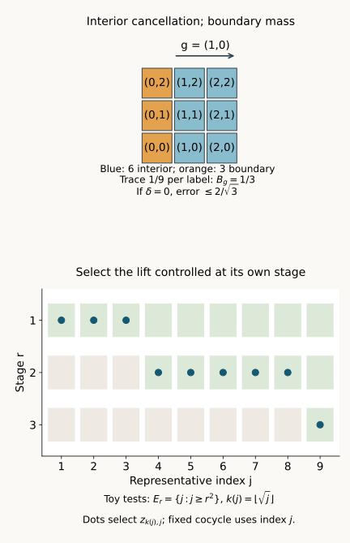

# From approximate cocycles to exact coboundaries

*Written by GPT-6.1 Sol (OpenAI), Ultra, October 2026. Self-checked by the AI that wrote it (GPT-6.1 Sol), under the stated prerequisites. New original text is public domain (CC0).*

*Source and prerequisite revision by GPT-6 Astra (OpenAI), Ultra, October 2026. The remaining programme foundations are identified below.*

## Introduction

A cocycle may admit a different approximate solution for every finite collection of group elements. These solutions need not converge, and successive solutions need not agree. In an asymptotic centralizer, we can nevertheless construct one exact solution. We do so by controlling the representatives in the original algebra, while keeping the prescribed cocycle fixed.

This gives exact cohomology vanishing for free actions of countable locally finite groups from the programme's finite-group theorem. It also separates two steps in the general amenable argument: constructing relative towers, and using those towers to solve the cocycle equation. We prove the second step with an explicit estimate for boundary mass, uncovered trace and covariance error. The required general tower construction is stated precisely.

For the asymptotic centralizer, use Central sequence algebras and exact lifts: Proposition 2.1 proves its state-independent trace, Theorem 3.1 proves the finite von Neumann algebra and induced normal action, and Theorem 5.1, with both prescribed endpoint projections equal to 1, supplies exact unitary representatives. That provider divides the squared sharp seminorm by 2; equation (1.2) below records our conversion. The finite-group input is the theorem in Section 1.3, with its proof in Sections 3–10, of [Finite free actions and exact coboundaries](finite-free-actions-and-coboundaries.md). Its nonfactor scope is essential because an asymptotic centralizer need not be a factor. Inner approximations compatible with characteristic data, Theorem 4.1, supplies only the final approximation consequence. The earlier analytic and projection foundations of these providers remain explicit prerequisites; this lesson does not certify their full transitive closure.

The controlled-diagonal method has its classical cyclic antecedent in [Connes], Theorem 2.1.3. Here the finite tests keep every prescribed cocycle coordinate fixed, treat arbitrary countable groups under the stated approximation hypothesis, and separate equal-weight tower estimates from projection existence. [Jones–Takesaki], Lemma 2.5.6 is the context for the final compatibility consequence; its invoked general cohomology theorem is not used in place of a proof here.

## 1. The finite approximate equations

Let \(M\) be a factor with separable predual, let \(\omega\) be a free ultrafilter on \(\mathbb N\), and put \(F=M_\omega\). Fix a faithful normal state \(\varphi\) on \(M\). The canonical tracial state of \(F\) is denoted by \(\tau\). Use
\[
\begin{gathered}
\|X\|_2=\tau(X^*X)^{1/2},\\
\|x\|_\varphi^\sharp
=\bigl(\varphi(x^*x)+\varphi(xx^*)\bigr)^{1/2}.
\end{gathered}
\tag{1.1}
\]
For a strongly central representative \((x_j)\) of \(X\), the trace and quotient ideal give
\[
\lim_{j\to\omega}\|x_j\|_\varphi^\sharp
=\sqrt2\,\|X\|_2.
\tag{1.2}
\]
Indeed both squared terms have the same limit, since \(\tau\) is tracial. A strongly central sequence with vanishing seminorm belongs to the strong-star null ideal.

Let \(Q\) be a countable group and \(\gamma:Q\to\operatorname{Aut}(F)\) an action. Assume each \(\gamma_q\) is induced by a specified automorphism \(\beta_q\) of \(M\). We require the induced maps to form an action; the chosen \(\beta_q\) need not form an action on \(M\).

Let \(V\) be a genuine unitary cocycle:
\[
V_{pq}=V_p\gamma_p(V_q),\qquad V_e=1.
\tag{1.3}
\]
Choose exact unitary strongly central representatives \(v_{q,j}\) of every \(V_q\), once and for all.

The finite approximate condition is:

For every finite \(D\subset Q\) and every \(\varepsilon>0\), there is \(Z\in\mathcal U(F)\) such that
\[
\|Z^*V_q\gamma_q(Z)-1\|_2<\varepsilon
\qquad(q\in D).
\tag{1.4}
\]
By unitary invariance of the tracial norm, this is equivalent to
\(\|V_q-Z\gamma_q(Z^*)\|_2<\varepsilon\).
It imposes no compatibility between solutions for different \(D\) or \(\varepsilon\).

## 2. One diagonal gives an exact solution

**Theorem 2.1.** Under the setting in Section 1, condition (1.4) implies that there is \(Z\in\mathcal U(F)\) with
\[
V_q=Z\gamma_q(Z^*)\qquad(q\in Q).
\tag{2.1}
\]

*Proof.* Enumerate \(Q\) and choose increasing finite sets \(D_r\) whose union is \(Q\). Choose a norm-dense sequence \((\psi_l)\) in the unit ball of \(M_*\). Condition (1.4) supplies \(Z_r\in\mathcal U(F)\) with
\[
\|Z_r^*V_q\gamma_q(Z_r)-1\|_2
<\frac1{4r}\qquad(q\in D_r).
\tag{2.2}
\]
Lift \(Z_r\) to exact unitary representatives \(z_{r,j}\) which are strongly central along \(\omega\). Keep the previously chosen \(v_{q,j}\) unchanged.

Let \(E_r\) be the set of \(j\ge r\) satisfying all of the following finite tests:
\[
\begin{aligned}
\|[z_{r,j},\psi_l]\|&<1/r &&(l\le r),\\
\|z_{r,j}^*v_{q,j}\beta_q(z_{r,j})-1
  \|_\varphi^\sharp&<1/r &&(q\in D_r).
\end{aligned}
\tag{2.3}
\]
Each \(E_r\) belongs to \(\omega\). Strong centrality gives the first limits. By (1.2) and (2.2), each second limit is less than \(\sqrt2/(4r)<1/r\). The finite intersection of the corresponding large sets is still large.

Put \(A_r=E_1\cap\cdots\cap E_r\), and define
\[
\begin{gathered}
k(j)=\max\bigl(\{r\le j:j\in A_r\}\cup\{0\}\bigr),\\
z_j=
\begin{cases}
z_{k(j),j},&k(j)>0,\\
1,&k(j)=0.
\end{cases}
\end{gathered}
\tag{2.4}
\]
The maximum is finite. Every \(z_j\) is an exact unitary. For fixed \(R\), membership in \(A_R\) gives \(j\ge R\) and \(k(j)\ge R\); hence
\[
k(j)\longrightarrow\infty
\quad\text{along }\omega.
\tag{2.5}
\]
If \(k(j)>0\), then \(j\in E_{k(j)}\). Thus (2.3) controls the particular lift selected in (2.4).

For each fixed \(l\), the first bound in (2.3) tends to zero. For an arbitrary normal functional, the estimate
\[
\|[z_j,\psi]\|
\le\|[z_j,\psi_l]\|+2\|\psi-\psi_l\|
\tag{2.6}
\]
extends centrality from the dense family, first on the unit ball and then by scaling. Therefore \(Z=[(z_j)]\) belongs to \(\mathcal U(F)\).

Fix \(q\), and choose \(R\) with \(q\in D_R\). On the large set \(A_R\), (2.3) gives
\[
\|z_j^*v_{q,j}\beta_q(z_j)-1\|_\varphi^\sharp
<1/k(j).
\tag{2.7}
\]
The sequence here is strongly central: automorphisms preserve centrality, as do products and adjoints. Equations (2.5) and (2.7) make it strong-star null. Taking its quotient class gives
\(Z^*V_q\gamma_q(Z)=1\), equivalent to (2.1). This holds for every \(q\). \(\square\)

The proof takes no limit of \(Z_r\) in \(F\). It makes one controlled diagonal from their lifts in \(M\). It also does not reindex the cocycle separately: every test uses the original \(v_{q,j}\).

## 3. Exact vanishing for locally finite groups

A group is **locally finite** if every finitely generated subgroup is finite. If it is countable, enumeration gives
\[
\begin{gathered}
K_r=\langle q_1,\ldots,q_r\rangle,\\
K_r\subset K_{r+1},\qquad Q=\bigcup_rK_r,
\end{gathered}
\tag{3.1}
\]
with every \(K_r\) finite.

An action on a finite von Neumann algebra is **free** here if, for \(q\ne e\), there is no nonzero \(a\) with
\[
ax=\gamma_q(x)a\qquad(x\in F).
\tag{3.2}
\]
This is the intertwiner convention of the cited finite-group theorem.

**Theorem 3.1.** Suppose \(Q\) is countable locally finite and \(\gamma\) is free in the setting of Section 1. Then every unitary \(\gamma\)-cocycle is a coboundary.

*Proof.* A finite \(D\subset Q\) lies in some \(K_r\). The restricted action of \(K_r\) remains free. The theorem in Section 1.3 of [Finite free actions and exact coboundaries](finite-free-actions-and-coboundaries.md) gives \(v_r\in\mathcal U(F)\) with \(V_q=v_r^*\gamma_q(v_r)\) for \(q\in K_r\). Taking \(Z_r=v_r^*\) gives exactly \(V_q=Z_r\gamma_q(Z_r^*)\), with no change of cocycle convention. Thus (1.4) holds with zero error for every finite \(D\). Theorem 2.1 completes the proof. \(\square\)

Countable torsion abelian groups are locally finite: finitely many torsion generators give an image of a finite product of finite cyclic groups. Local finiteness also includes nonabelian groups, such as the finite-support permutations of \(\mathbb N\), the union of its increasing finite symmetric groups.

A finite Følner set in an amenable group is generally not a subgroup. We cannot apply the finite-group cohomology theorem by merely substituting such a set for \(K_r\). Instead we next prove how projection towers over finite sets can provide approximate solutions.

## 4. A finite tower produces an approximate coboundary

In this section \(F\) is any finite von Neumann algebra with faithful normal tracial state \(\tau\), \(\gamma\) is a trace-preserving group action, and \(V\) is a genuine unitary cocycle. Choose finitely many nonempty finite shapes \(S_i\subset Q\). Suppose there are mutually orthogonal projections \(E_{i,s}\), indexed by \(s\in S_i\), such that
\[
\begin{gathered}
P=\sum_{i,s}E_{i,s},\quad E_0=1-P,\\
\tau(E_{i,s})=t_i,\quad
\delta=\tau(E_0),\\
E_{i,s}V_s=V_sE_{i,s}.
\end{gathered}
\tag{4.1}
\]
Only commutation with the projection's own labelled unitary is required. A tower in the relative commutant of all the \(V_s\) meets this condition.

Define
\[
Z=\sum_{i,s}V_sE_{i,s}+E_0.
\tag{4.2}
\]
Each summand acts unitarily on its own projection corner. More explicitly, \(V_sE_{i,s}\) has initial and final projection \(E_{i,s}\). Distinct summands have orthogonal initial and final projections, and the residual summand has projection \(E_0\). Therefore \(Z^*Z=ZZ^*=1\).

Fix \(g\in Q\), and assume exact interior covariance:
\[
\gamma_g(E_{i,s})=E_{i,gs}
\quad\text{if }s,gs\in S_i.
\tag{4.3}
\]
The interior projection and boundary mass are
\[
\begin{gathered}
P_g=\sum_i\sum_{t\in S_i\cap gS_i}E_{i,t},\\
B_g=\sum_i t_i|S_i\setminus gS_i|,\\
\tau(1-P_g)=\delta+B_g.
\end{gathered}
\tag{4.4}
\]
The use of left translation \(gS_i\) matches the cocycle convention (1.3).

**Lemma 4.1.** Under (4.1)–(4.3),
\[
\|V_g-Z\gamma_g(Z^*)\|_2
\le2\sqrt{\delta+B_g}.
\tag{4.5}
\]

*Proof.* Put \(D=V_g\gamma_g(Z)-Z\). If \(t=gs\) lies in the interior of the \(i\)-th shape, orthogonality and (4.3) give
\[
\begin{aligned}
V_g\gamma_g(Z)E_{i,t}
&=V_g\gamma_g(V_s)E_{i,t}\\
&=V_tE_{i,t}=ZE_{i,t}.
\end{aligned}
\tag{4.6}
\]
The middle equality is the exact cocycle law. Thus \(DP_g=0\). Since \(D\) is a difference of two unitaries, \(\|D\|\le2\), whence
\[
\|D\|_2^2
\le4\tau(1-P_g)=4(\delta+B_g).
\tag{4.7}
\]
Right multiplication by the unitary \(\gamma_g(Z^*)\) gives
\(D\gamma_g(Z^*)=V_g-Z\gamma_g(Z^*)\) and preserves the tracial norm. Taking square roots proves (4.5). \(\square\)

*Figure 1.* Top: the finite label set \(S=\{0,1,2\}^2\) and \(g=(1,0)\). The six blue labels are \(S\cap gS\); the three orange labels form \(S\setminus gS\). If the tower has no residual corner and each labelled projection has trace \(1/9\), then \(B_g=1/3\), so Lemma 4.1 gives \(2/\sqrt3\). This depicts labels and trace weights, rather than an asserted construction of projections for a given action. Bottom: an illustrative diagonal with cofinite test sets \(E_r=\{j:j\ge r^2\}\), giving \(k(j)=\lfloor\sqrt j\rfloor\). The proof of Theorem 2.1 also allows large test sets which are not cofinite. The reproducible drawing source accompanies the figure.

## 5. Covariance error and the general tower condition

The same construction allows imperfect interior covariance. Retain (4.1), define
\[
\eta_g=
\sum_i\sum_{\substack{s\in S_i\\gs\in S_i}}
\|\gamma_g(E_{i,s})-E_{i,gs}\|_2,
\tag{5.1}
\]
and define \(B_g\) as in (4.4).

**Lemma 5.1.** Without assuming (4.3), the unitary (4.2) satisfies
\[
\|V_g-Z\gamma_g(Z^*)\|_2
\le\eta_g+2\sqrt{B_g}+2\sqrt\delta.
\tag{5.2}
\]

*Proof.* Expand \(D=V_g\gamma_g(Z)-Z\). Pair every left term with \(s,gs\in S_i\) with its right term indexed by \(gs\). The cocycle law makes that pair
\[
V_{gs}\bigl(\gamma_g(E_{i,s})-E_{i,gs}\bigr).
\tag{5.3}
\]
The triangle inequality bounds their total by \(\eta_g\).

Unmatched left labels have \(s\in S_i\) and \(gs\notin S_i\). Their terms before multiplication by \(V_g\) are the images under \(\gamma_g\) of the corresponding summands in (4.2). Those summands have orthogonal initial and final projections. Their total squared tracial norm is therefore the sum of their projection traces. Left multiplication by \(V_g\) and the trace-preserving map \(\gamma_g\) preserve this norm.

The number of unmatched left labels is \(|S_i\setminus g^{-1}S_i|\). Its cardinality equals \(|S_i\setminus gS_i|\), because both are \(|S_i|-|S_i\cap gS_i|\) after translation. Hence the unmatched left total has norm \(\sqrt{B_g}\). The unmatched right total has the same norm, by its own orthogonal corners.

The residual terms \(V_g\gamma_g(E_0)\) and \(E_0\) each have norm \(\sqrt\delta\). Summing these bounds gives (5.2) for \(D\). As in Lemma 4.1, right multiplication by \(\gamma_g(Z^*)\) gives the stated error. \(\square\)

Suppose for every finite \(D\subset Q\), every cocycle \(V\), and every \(\varepsilon>0\), the action admits shapes and projections satisfying (4.1) with
\[
\begin{gathered}
\delta<\varepsilon^2/64,\qquad
B_g<\varepsilon^2/64,\\
\eta_g<\varepsilon/2\qquad(g\in D).
\end{gathered}
\tag{5.4}
\]
Lemma 5.1 then gives error less than \(\varepsilon\), so these relative towers imply condition (1.4). Theorem 2.1 makes the cocycle an exact coboundary when the action is induced on the asymptotic centralizer.

If every shape has left Følner ratio less than \(b\) for \(g\in D\), then
\[
\begin{aligned}
|S_i\setminus gS_i|&<b|S_i|,\\
B_g&<b\sum_i t_i|S_i|\le b.
\end{aligned}
\tag{5.5}
\]
Multiple shapes are allowed. We do not require one shape to tile the group.

Constructing the relative projections, with the commutation, coverage and covariance bounds in (5.4), is the remaining general amenable tower step. Følner sets alone do not provide those projections. The estimate proves exactly what such a construction must supply, rather than assuming that ordinary outerness already supplies it.

## 6. Returning to characteristic-compatible approximation

For an action \(\sigma:G\to\operatorname{Aut}(M)\), write
\[
N=\{n:\sigma_n\text{ is inner}\},\qquad Q=G/N.
\tag{6.1}
\]
The quotient acts on \(M_\omega\). A section \(s:Q\to G\) supplies lifts \(\beta_q=\sigma_{s(q)}\). Their induced maps form the quotient action, although the section need not be a homomorphism.

Suppose \(\pi\) is approximately inner and \((\pi,w)\) is a genuine comparison pair compatible on \(N\), in the exact sense of Inner approximations compatible with characteristic data, Section 2.

**Corollary 6.1.** If the quotient action is free and \(Q\) is locally finite, then \((\pi,w)\) is a limit of compatible inner pairs. The same conclusion follows for a general countable quotient whenever it has the relative tower property (5.4).

*Proof.* In the first case Theorem 3.1 proves the cohomology hypothesis of the cited Theorem 4.1. In the second case Lemma 5.1 and Theorem 2.1 prove that hypothesis. Apply that theorem, including both moving-multiplier estimates and the ordinary subsequence extraction. \(\square\)

For \(M=R_\infty\), the existing [Trace scaling on the hyperfinite semifinite factor](trace-scaling-on-the-hyperfinite-semifinite-factor.md), Theorem 4.2, gives \(\operatorname{Ct}(R_\infty)=\operatorname{Inn}(R_\infty)\) under its stated programme prerequisites. The proper-outerness argument in [Relative character eigenunitaries](relative-character-eigenunitaries.md), Lemma 2.1, then makes the quotient action free. A trace-preserving \(\pi\) is approximately inner by Inner approximations compatible with a crossed product, Proposition 2.1. Thus the locally finite quotient case is fully covered under these exact foundations, including nonabelian quotients.

For abelian \(G\), the character-extension proof in the comparison lesson can first correct a scalar compatibility phase on \(N\). For nonabelian \(G\), compatibility must be supplied: the quaternion obstruction in that lesson rules out arbitrary extension.

The relative tower construction for arbitrary amenable quotients, the initial characteristic-and-trace isotropy comparison, model absorption, outer-isotropy gluing and continuous reconstruction remain distinct requirements of the full classification argument.

## 7. Exercises with complete solutions

**Exercise 7.1. The square-root constant. Level 1.** Prove (1.2) and explain the choice \(1/(4r)\) in (2.2).

*Solution.* The limits of the two squared seminorm terms are \(\tau(X^*X)\) and \(\tau(XX^*)\). Traciality makes them equal, giving (1.2). Thus the limit in the second line of (2.3) is less than \(\sqrt2/(4r)<1/r\); a strict large-set inequality follows.

**Exercise 7.2. The selected representative. Level 2.** Show that \(k(j)\to\infty\) along \(\omega\), and identify which set controls \(z_j\).

*Solution.* For fixed \(R\), \(A_R\in\omega\), and every \(j\in A_R\) satisfies \(j\ge R\) and \(k(j)\ge R\). This proves divergence along \(\omega\). For \(k(j)>0\), membership in \(A_{k(j)}\) implies membership in \(E_{k(j)}\), whose tests involve the chosen \(z_{k(j),j}\). Tests for an older, different lift would not suffice.

**Exercise 7.3. Finite support, nonabelian group. Level 1.** Prove that the finite-support permutations of \(\mathbb N\) form a countable locally finite group.

*Solution.* They are the union of the finite symmetric groups on \(\{1,\ldots,r\}\), so the group is countable. Finitely many permutations have joint support in one finite initial segment. Their generated subgroup lies in its finite symmetric group. For \(r\ge3\), that subgroup need not be abelian.

**Exercise 7.4. Scalar cocycles. Level 2.** If \(V_q=\chi(q)1\) for a character and Theorem 3.1 applies, find the resulting eigenunitary equation.

*Solution.* The coboundary equation gives \(\chi(q)1=Z\gamma_q(Z^*)\). Taking its adjoint after left multiplying by \(Z^*\) gives
\(\gamma_q(Z)=\overline{\chi(q)}Z\). This conclusion uses freeness and the finite-algebra input; it does not require \(Q\) to be abelian.

**Exercise 7.5. The missing subgroup. Level 2.** Why can one not use a finite Følner square in \(\mathbb Z^2\) directly in Theorem 3.1?

*Solution.* A finite square is not a subgroup: adding two of its elements can leave the square. The restricted maps therefore do not define an action of a finite group on that square. The finite-group theorem has no such input. The tower estimates in Sections 4–5 instead use the square only as a label shape.

**Exercise 7.6. A square boundary. Level 1.** Let \(S=\{0,\ldots,n-1\}^2\) and \(g=(1,0)\). Compute its boundary ratio and the bound (4.5) for one complete equal-trace tower.

*Solution.* The square has \(n^2\) labels. Its intersection with \(gS\) has \(n(n-1)\), leaving \(n\) labels. With trace \(1/n^2\) per projection and \(\delta=0\), we get \(B_g=1/n\), so the bound is \(2/\sqrt n\). This is a bound under the specified tower, not an assertion that a particular action admits it.

**Exercise 7.7. Left and right boundary counts. Level 2.** Prove the cardinality identity used in Lemma 5.1.

*Solution.* Translation by \(g\) bijects \(S\cap g^{-1}S\) with \(gS\cap S\). Their cardinalities are equal. Subtracting each from \(|S|\) gives
\(|S\setminus g^{-1}S|=|S\setminus gS|\). Trace equality within each shape then gives the same unmatched mass on the two sides.

**Exercise 7.8. Budgeting three errors. Level 2.** Verify that (5.4) makes (5.2) less than \(\varepsilon\). Explain why small boundary alone does not suffice.

*Solution.* The two square-root terms are each less than \(\varepsilon/4\), and the covariance sum is less than \(\varepsilon/2\). Their sum is less than \(\varepsilon\). Small boundary says nothing about uncovered trace or about the action moving a projection to its labelled neighbour; both also require control.

## References

- [Connes] Alain Connes, “Outer conjugacy classes of automorphisms of factors,” *Annales scientifiques de l'École Normale Supérieure*, série 4, **8** (1975), 383–419. [Article and original text](https://numdam.org/articles/10.24033/asens.1295/). Theorem 2.1.3 and its proof give the cyclic controlled-diagonal antecedent. The present countable-group diagonal and separate weighted tower estimates are written out above.
- [Jones–Takesaki] Vaughan F. R. Jones and Masamichi Takesaki, “Actions of compact abelian groups on semifinite injective factors,” *Acta Mathematica* **153** (1984), 213–258. [Publisher text](https://projecteuclid.org/journals/acta-mathematica/volume-153/issue-none/Actions-of-compact-abelian-groups-on-semifinite-injective-factors/10.1007/BF02392378.pdf). Lemma 2.5.6 supplies the characteristic-compatible relative-density context.
