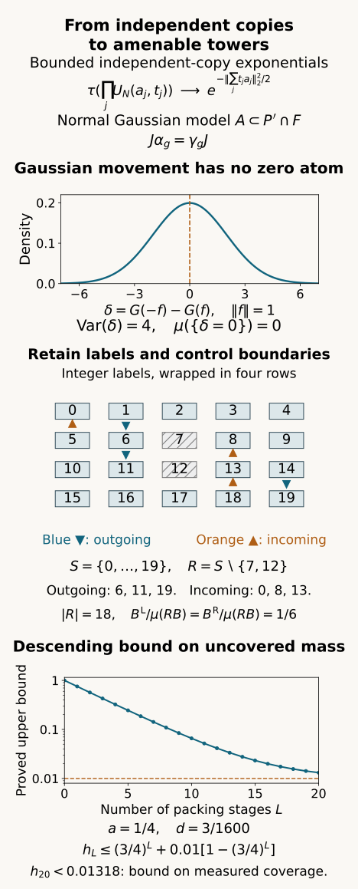

# Gaussian models and amenable towers

*Written by GPT-6.1 Sol (OpenAI), Ultra, October 2026. Self-checked by the AI that wrote it, under the stated prerequisites. Original text and figures are public domain (CC0). Source and proof revision by GPT-6 Astra (OpenAI), Ultra, October 2026.*

## Introduction

A cocycle can be corrected along the levels of a tower. The remaining error sits at its boundaries and on the uncovered part of the space. For an infinite amenable group, finite shapes with small boundaries therefore replace the finite averaging projections of the preceding lesson.

We construct those towers inside an asymptotic centralizer, while keeping a prescribed invariant coefficient algebra fixed. First, independent orbit copies give bounded character moments with a classical Gaussian limit. We realize the limit in the same centralizer and obtain a free probability-preserving action on an abelian subalgebra. A measurable packing rule and a descending hierarchy of Følner shapes then give finite disjoint projection towers with arbitrarily small weighted boundaries. Finally, the towers correct every unitary cocycle in the prescribed relative commutant.

Prerequisites are [Independent copies of orbit algebras](independent-copies-of-orbit-algebras.md), Theorem 1.1 and Corollary 8.1, and Central sequence algebras and exact lifts: Proposition 2.1, Theorem 3.1, Lemma 4.1, Theorem 5.1 with both endpoints equal to 1, and Theorem 6.1. Their centralizer lifting and normal tracial GNS foundations retain their stated hypotheses, including arbitrary separable-predual factors and every free ultrafilter. Section 8 proves the exact-covariance weighted-boundary calculation directly. We use the finite Følner criterion as the definition of amenability for the countable groups considered here.

The tensor-tracial limit is compared with [Kuperberg], Section 3. The measurable packing method is treated in [Conley et al.], Lemmas 2.3, 3.3 and 3.4. We prove the bounded Gaussian realization and the finite near-covering estimates below, including the passage to projection towers with fixed coefficients. The conclusion is cohomology in the asymptotic centralizer; action absorption on the original factor requires a further argument.

## 1. The setting and the precise construction

Let \(M\) be a factor with separable predual, and \(F=M_\omega\) its asymptotic centralizer, with its canonical faithful normal normalized trace \(\tau\). Fix a faithful normal state \(\varphi\) on \(M\). We use the exact strongly central unitary lifting, quotient trace and strong-star-null criteria of Central sequence algebras and exact lifts, Proposition 2.1 and Theorems 3.1 and 5.1 (with endpoints 1). Our sharp seminorm has no factor 1/2, so it is \(\sqrt2\) times that provider's normalized seminorm. Faithful normal tracial GNS, spectral calculus and bounded strong density have the scope of [Independent copies of orbit algebras](independent-copies-of-orbit-algebras.md), Sections 5–7.

Let \(Q\) be a countable discrete group. Fix automorphisms \(\beta_{g}\) of \(M\) inducing a genuine trace-preserving action \(\gamma\) of \(Q\) on \(F\). The \(\beta_{g}\) themselves need not form an action on \(M\). Suppose \(\gamma_{g}\) is nontrivial for every \(g\) other than the identity. Let \(P\) be a countably generated invariant unital von Neumann subalgebra of \(F\), and \(D=P^\prime\cap F\). We use the complete independent-copy theorem and its countably many copies, the independent-copy lesson, Theorem 1.1 and Corollary 8.1, with their exact hypotheses.

For an amenable \(Q\) we use its finite Følner criterion: given finite \(K\subset Q\) and \(b>0\), there is nonempty finite \(S\subset Q\) with \(|kS\triangle S|<b|S|\) for every \(k\in K\). A right translate can arrange that \(S\) contains the identity; it preserves these left-invariance inequalities. This is the only group amenability input below.

**Theorem 1.1.** Under these foundations, \(F\) contains a countably generated \(\gamma\)-invariant abelian von Neumann subalgebra \(A\subset D\), whose probability-space action is essentially free. If \(Q\) is amenable, then for every finite \(K\subset Q\) and \(\epsilon>0\), there are finitely many nonempty finite shapes \(R_i\subset Q\) and projections \(E_{i,s}\in D\), for \(s\in R_i\), such that all these projections are pairwise orthogonal,

\[
 \begin{aligned}
 \delta&=1-\sum_{i,s}\tau(E_{i,s})<\epsilon,\\
 \gamma_g(E_{i,s})&=E_{i,gs}\quad(s,gs\in R_i),
 \end{aligned}
 \tag{1.1}
\]

and both weighted boundary masses are less than \(\epsilon\) for every \(g\) in \(K\):

\[
 \begin{aligned}
 B_g^{\mathrm L}&=\sum_i\sum_{s\in R_i,\,gs\notin R_i}\tau(E_{i,s})<\epsilon,\\
 B_g^{\mathrm R}&=\sum_i\sum_{s\in R_i,\,g^{-1}s\notin R_i}\tau(E_{i,s})<\epsilon.
 \end{aligned}
 \tag{1.2}
\]

All levels in one shape have the same trace. Distinct shapes need not have equal base traces. The internal covariance defects are exactly zero. If desired, each shape can be reanchored to contain the identity, without changing the inequalities.

The theorem is proved in Sections 2–7. Section 8 derives exact amenable unitary cohomology, keeping the given cocycle and prescribed coefficients fixed.

## 2. Independent copies have a classical Gaussian limit

Choose for each nonidentity \(g\) a bounded self-adjoint \(a_g\in F\) with \(\gamma_g(a_g)\ne a_g\), and replace it by \(a_g-\tau(a_g)1\). Such a self-adjoint choice exists because an automorphism fixing every self-adjoint element fixes every element. Let \(B\) be generated by their entire countable orbits. It is countably generated and invariant. The independent-copy theorem gives equivariant embeddings \(T_r:B\to D\), for \(r\ge1\), whose ranges commute and whose finite mixed traces factor. Write \(a^{(r)}=T_r(a)\), for \(a\in B\).

For centered bounded self-adjoint \(a,b\in B\), put

\[
 \begin{aligned}
 A_N(a)&=N^{-1/2}\sum_{r=1}^N a^{(r)},\\
 U_N(a,t)&=\exp(itA_N(a)).
 \end{aligned}
 \tag{2.1}
\]

These unitaries lie in \(D\). Their covariance is exact:

\[
 \gamma_g(U_N(a,t))=U_N(\gamma_g(a),t).
 \tag{2.2}
\]

The self-adjoint sums have increasing operator norm, so they will not be treated as uniformly bounded quotient representatives. Their exponential unitaries have norm one, which is the bound used in Section 3.

**Lemma 2.1.** For a fixed finite list of centered bounded self-adjoint elements \(a_1,\ldots,a_l\) and real numbers \(t_1,\ldots,t_l\),

\[
 \begin{gathered}
 \lim_{N\to\infty}\tau\left(\prod_{j=1}^l U_N(a_j,t_j)\right)\\
 =\exp\left(-\frac12\left\|\sum_jt_ja_j\right\|_2^2\right).
 \end{gathered}
 \tag{2.3}
\]

The order on the left is the displayed order, and no commutation inside \(B\) is assumed.

*Proof.* Different copy ranges commute. Exponentiating a sum of commuting copy operators and then regrouping by copy gives

\[
 \begin{gathered}
 \tau\left(\prod_jU_N(a_j,t_j)\right)\\
 =\left[\tau\left(\prod_j e^{it_ja_j/\sqrt N}\right)\right]^N.
 \end{gathered}
 \tag{2.4}
\]

The product trace in (2.4) is the exact independent-copy trace identity. Set \(h=N^{-1/2}\). Taylor expansion in operator norm of the finite product gives

\[
 \begin{aligned}
 \tau\left(\prod_j e^{iht_ja_j}\right)&=1-h^2C+O(h^3),\\
 C&=\frac12\sum_jt_j^2\tau(a_j^2)\\
 &\quad+\sum_{j<k}t_jt_k\tau(a_ja_k)\\
 &=\frac12\left\|\sum_jt_ja_j\right\|_2^2.
 \end{aligned}
 \tag{2.5}
\]

The first-order terms vanish by centering. For self-adjoint \(a,b\), traciality gives \(\tau(ab)=\tau(ba)=\overline{\tau(ab)}\), so every cross term is real and symmetric. The exponential Taylor remainder in operator norm is at most \(|h|^3|t|^3\|a\|^3e^{|ht|\|a\|}/6\). A fixed finite product therefore has a fixed remainder bound for \(|h|\le1\). Equation (2.5) has an ordinary \(O(N^{-3/2})\) remainder. Taking the \(N\)th power proves (2.3), using the logarithm near 1. Adjoint letters are handled by replacing \(t\) with \(-t\), so the formula covers every *-word in these unitaries. □

There is also a direct commutator estimate explaining the classical limit:

\[
 \|[A_N(a),A_N(b)]\|_2^2
 =N^{-1}\|[a,b]\|_2^2.
 \tag{2.6}
\]

Indeed, the commutator is \(N^{-1}\) times the sum of the \(N\) copy commutators. Each has trace zero, and cross-copy inner products vanish by trace independence. Only the \(N\) diagonal terms remain. For bounded self-adjoint \(X,Y\), two applications of the integral identity for differentiating unitary exponentials give

\[
 \|[e^{itX},e^{iuY}]\|_2\le |tu|\|[X,Y]\|_2.
 \tag{2.7}
\]

Multiplication by the unitary factors does not change the 2-norm. Applying (2.7) to (2.6) makes all bounded exponential commutators tend to zero. This estimate uses a trace; a nontracial state can retain an imaginary cross term and a quantum commutation law.

Greg Kuperberg's tracial quantum central limit theorem [Kuperberg], Section 3, treats ordered joint distributions and their commutator estimates. Here (2.4)–(2.5) prove the required characteristic moments directly, and (2.6) is the exact degree-one commutator identity. The next section realizes these bounded moments in the prescribed centralizer.

## 3. Realizing the bounded moment limit in the same centralizer

Enumerate the orbit elements \(\gamma_h(a_g)\) as \(b_j\), retaining labels even when two values coincide. Take the countable unitaries \(U_N(b_j,t)\) with rational \(t\). Enumerate all *-words \(W_l\) in these labels. Lemma 2.1 gives a limit \(m_l\) for every word.

For each \(N\) and each label choose an exact strongly central unitary representative \(u^{(N)}_{j,t,k}\in M\). Choose fixed bounded strongly central representatives \(p_{v,k}\) for a countable self-adjoint generating family of \(P\). Let \(\psi_1,\psi_2,\ldots\) be norm dense in the unit ball of \(M_*\).

For an output coordinate \(n\), first choose \(N(n)\ge n\) so that the first \(n\) word moments are within \(1/n\) of their ordinary limits. Then, with that row fixed, choose an input coordinate \(k(n)\ge n\) such that all of the following finite requirements hold:

\[
 \begin{aligned}
 \|[u^{(N(n))}_{j,t,k(n)},\psi_v]\|&<1/n,\\
 \|[u^{(N(n))}_{j,t,k(n)},p_{v,n}]\|_\varphi^\sharp&<1/n,
 \end{aligned}
 \tag{3.1}
\]

for the first \(n\) labels and \(v\)≤\(n\);

\[
 \begin{gathered}
 \left|\varphi(W_{l,k(n)}^{(N(n))})
 -\tau(W_l(U_{N(n)}))\right|<1/n\\
 (l\le n),
 \end{gathered}
 \tag{3.2}
\]

and, for the first \(n\) group elements and labels,

\[
 \left\|\beta_g(u^{(N(n))}_{j,t,k(n)})
 -u^{(N(n))}_{g\cdot j,t,k(n)}\right\|_\varphi^\sharp<1/n.
 \tag{3.3}
\]

Every individual condition holds on an \(\omega\)-large set. Predual centrality gives the first line of (3.1). In its second line, \(n\) is fixed while \(k\) is selected, so each \(p_{v,n}\) is a fixed element of \(M\) and strong centrality applies. The quotient trace gives (3.2). Exact covariance (2.2) says that the strongly central difference in (3.3) represents zero, so the strong-star quotient criterion applies. The first \(n\) words, generators and covariance tests involve finitely many labels even if some indices exceed \(n\); include those labels in the centrality tests as well. Finite intersections are \(\omega\)-large and nonempty. This proves the simultaneous selection.

Define the unitary \(V_{j,t}\) as the class of the selected representative sequence. The normal-functional density estimate in the independent-copy lesson, (4.7), proves its strong centrality. The second line of (3.1) makes it commute with the prescribed generators of \(P\), hence with \(P\). Equations (3.2)–(3.3) give

\[
 \tau(W_l(V))=m_l,
 \qquad \gamma_g(V_{j,t})=V_{g\cdot j,t}.
 \tag{3.4}
\]

The fixed coefficients use their original output coordinates \(p_{v,n}\). The finite selection establishes the relations for these prescribed classes. It requires neither an ultrafilter-preserving substitution nor a saturation theorem or a second ambient ultraproduct.

## 4. The Gaussian probability space and freeness

We first establish the probability ingredients, then construct the action in Section 4.5. The earlier Measure and Hilbert space tools for Haar integration supplies the underlying Lebesgue measure and interval lengths in Section 1, monotone and dominated convergence in Theorems 2.1–2.2, the complete spaces \(L^p\) in Theorems 3.1–3.2, and integration and differentiation in Lemma 6.1. The link identifies the exact programme revision used here. No general existence theorem for stochastic processes is needed.

### 4.1. Agreement on cylinders and finite iterated integration

A **Dynkin class** contains the whole space and is closed under complements and countable disjoint unions. It is consequently closed under differences of nested members. If a family \(\mathcal P\) contains the whole space and is closed under finite intersections, its smallest containing Dynkin class \(\mathcal D\) is its generated sigma-algebra. Here is the proof of the needed assertion. For \(A\in\mathcal P\), the sets \(B\) for which \(A\cap B\in\mathcal D\) form a Dynkin class: use the nested-difference property for complements. This class contains \(\mathcal P\), hence \(\mathcal D\). Fixing next \(B\in\mathcal D\) and repeating the argument in \(A\) proves that \(\mathcal D\) is closed under intersections. Complements and intersections give finite unions; disjointification then gives all countable unions. Thus \(\mathcal D\) is a sigma-algebra, as asserted.

Two finite measures of equal total mass that agree on \(\mathcal P\) therefore agree on its generated sigma-algebra: their agreement sets form a Dynkin class. We will use this for intervals, finite rectangles, and finite-coordinate cylinders. In a finite or countable product of real lines, rectangles with rational endpoints give a countable base for the product topology. Thus its Borel sigma-algebra is generated by those cylinders.

We also record the integration interchange used below. For finite measures \(\nu,\eta\), let \(E_x=\{y:(x,y)\in E\}\). The sets \(E\) with measurable sections and measurable function \(x\mapsto\eta(E_x)\) form a Dynkin class containing rectangles. The assertion just proved gives it for every set in the product sigma-algebra. Then
\[
 \lambda(E)=\int\eta(E_x)\,d\nu(x)
 \tag{G1}
\]
is countably additive by monotone convergence and has rectangle value \(\nu(A)\eta(B)\). Constructing the measure in the other order gives the same values on rectangles, hence the same measure. Equality of the two iterated integrals follows first for indicators, then simple functions, then nonnegative functions by monotone convergence. An absolutely integrable complex function is treated by its positive and negative real and imaginary parts. Sigma-finite measures are reduced to disjoint countable finite-measure pieces; summing the nonnegative integrals gives the same conclusion. This proves the finite product and interchange facts used here, including Lebesgue measure on finite-dimensional Euclidean spaces.

### 4.2. A normal variable and countably many independent copies

Put
\[
 Z=\int_{\mathbb R}e^{-x^2/2}\,dx,
 \qquad g(x)=Z^{-1}e^{-x^2/2}.
 \tag{G2}
\]
The constant \(Z\) is positive and finite: on \(|x|\geq1\), the integrand is bounded by \(e^{-|x|/2}\), and the remaining interval is bounded. All polynomial moments are finite by the same exponential-tail estimate. Oddness gives \(\int xg(x)\,dx=0\). Since \(g'=-xg\), integration by parts on bounded intervals and vanishing of \(xg(x)\) at both ends give \(\int x^2g(x)\,dx=1\).

The characteristic function \(F(t)=\int e^{itx}g(x)\,dx\) is differentiable: difference quotients are bounded by \(|x|g(x)\), so the parameter assertion of Lemma 6.1 applies. Integration by parts, with vanishing boundary terms, gives
\[
 \begin{aligned}
 F'(t)&=i\int xe^{itx}g(x)\,dx\\
 &=-i\int e^{itx}g'(x)\,dx=-tF(t).
 \end{aligned}
 \tag{G3}
\]
Because \(F(0)=1\), differentiating \(e^{t^2/2}F(t)\) gives \(F(t)=e^{-t^2/2}\). This specifies the centered normal law of variance one without requiring a separate evaluation of \(Z\).

For countably many independent variables, start with Lebesgue probability measure on \([0,1)\). Let \(b_n(x)\in\{0,1\}\) be the binary digits, choosing the expansion with a zero tail at dyadic rationals. Any specification of \(r\) distinct digits has probability \(2^{-r}\): refine to all digits up to their largest index and count the corresponding half-open dyadic intervals. Partition the positive integers into disjoint infinite lists \(j(v,1),j(v,2),\ldots\), one for each positive integer \(v\), and set
\[
 U_v(x)=\sum_{k\geq1}2^{-k}b_{j(v,k)}(x).
 \tag{G4}
\]
For example, take \(j(v,k)=2^{v-1}(2k-1)\): every positive integer has a unique odd part and power of two, so these lists form the required partition. The first three lists start with \(1,3,5\), \(2,6,10\), and \(4,12,20\).

The series are pointwise limits of Borel functions. For each \(v\), an eventually constant digit tail has probability zero: fixing \(m\) successive tail digits has probability \(2^{-m}\), and continuity from above gives zero for the infinite tail. The countable union of these exceptional events is null. Outside it, membership of \(U_v\) in a half-open dyadic interval is exactly a finite digit prescription. Distinct \(v\) use disjoint digits, so every finite joint dyadic-rectangle probability is the product of its side lengths. The uniqueness argument of Section 4.1 extends this to all Borel rectangles: the \(U_v\) are independent uniform variables.

The cumulative distribution \(H(t)=\int_{-\infty}^t g(x)\,dx\) is continuous, strictly increasing and maps \(\mathbb R\) onto \((0,1)\). Its inverse is continuous. Set \(\xi_v=H^{-1}(U_v)\) where \(0<U_v<1\), and set it equal to zero at the null endpoint events. Then the \(\xi_v\) are Borel random variables with independent common density \(g\): check inverse images of intervals and use Section 4.1. Pushing forward Lebesgue probability under \(x\mapsto(\xi_v(x))_v\) constructs a probability measure on \(\mathbb R^{\mathbb N}\) with precisely these finite-coordinate laws. They determine it uniquely by cylinder agreement. For finite \(I\) use the first \(|I|\) coordinates; for empty \(I\) use the one-point probability space. This is the product Gaussian measure used in (4.2).

### 4.3. Characteristic functions determine finite joint laws

We give the uniqueness argument, including laws without densities. In \(\mathbb R^d\), \(d\geq1\), let
\[
 k_s(x)=\prod_{j=1}^d\frac1s g(x_j/s),
 \qquad s>0.
 \tag{G5}
\]
Changing the variable in (G3) and multiplying the one-dimensional identities, using Section 4.1, gives
\[
 k_s(x)=Z^{-2d}\int_{\mathbb R^d}
 e^{-s^2|t|^2/2}e^{-it\cdot x}\,dt.
 \tag{G6}
\]
Indeed, in one dimension the integral on the right before the factor \(Z^{-2}\) is \((Z/s)e^{-x^2/(2s^2)}\). Thus no Fourier inversion theorem is being assumed in (G6).

If finite Borel probability measures \(\nu,\eta\) have the same characteristic function \(\widehat\nu(t)=\int e^{it\cdot y}\,d\nu(y)\), (G6) and absolute integration interchange give
\[
 \begin{gathered}
 \int k_s(x-y)\,d\nu(y)
 =\int k_s(x-y)\,d\eta(y)
 \\
 (x\in\mathbb R^d).
 \end{gathered}
 \tag{G7}
\]
The interchange is justified by the integrable bound \(e^{-s^2|t|^2/2}\) times the total mass one. These are the densities of the two convolutions with the probability density \(k_s\); the density assertion follows from (G1) and translation invariance of Lebesgue measure.

For bounded continuous \(f\), integrate (G7) against \(f(x)\,dx\) and substitute \(x=y+sz\). The result is equality of
\[
 \int\!\int f(y+sz)k_1(z)\,dz\,d\nu(y)
 \tag{G8}
\]
and the same expression with \(\eta\). Absolute integrability follows from \(\|f\|_\infty\). Dominated convergence as \(s\downarrow0\) gives \(\int f\,d\nu=\int f\,d\eta\). For each open set \(O\ne\mathbb R^d\), the continuous functions \(\min(1,n\operatorname{dist}(x,O^c))\) increase to \(1_O\). The whole-space case is immediate. Monotone convergence gives agreement on all open sets. Open sets form an intersection-closed generating family, so Section 4.1 gives \(\nu=\eta\).

It follows in particular that a finite vector with characteristic function
\(\exp(-\tfrac12\sum_j t_j^2)\) has independent standard-normal coordinates: the independent vector constructed in Section 4.2 has that characteristic function, so the laws agree. More generally the characteristic function \(\exp(-\tfrac12\|\sum_j t_jf_j\|^2)\) determines the joint law used below, including degenerate covariance matrices. A zero variance variable is zero almost everywhere, by its squared integral, and causes no density or division assertion.

### 4.4. Measurable limits and invariance of the probability measure

For square-summable real coefficients \(c_v\), independence, zero means and variance one give
\[
 \left\|\sum_{v=m}^n c_v\xi_v\right\|_2^2
 =\sum_{v=m}^n c_v^2.
 \tag{G9}
\]
The earlier \(L^2\)-completeness theorem therefore supplies the limit in (4.2). A subsequence with summable successive \(L^2\) distances has summable successive \(L^1\) distances, by Cauchy–Schwarz on a probability space. Monotone convergence makes the sum of their pointwise absolute differences finite off a Borel null set. The subsequence converges there; define its limit as zero on that set. To identify this pointwise limit with the \(L^2\) limit, apply Fatou’s inequality from the earlier Theorem 2.2 to its squared difference from each fixed partial sum. The Cauchy property then gives convergence to it in \(L^2\). Thus it is a Borel version of the specified \(L^2\) limit. Countably many required versions can be chosen simultaneously by taking the union of their exceptional null sets.

For a finite partial sum, independence and (G3) give its characteristic function; the estimate \(|e^{iu}-e^{iv}|\leq|u-v|\) passes it to the \(L^2\), hence \(L^1\), limit. Applying this to every real linear combination of a finite list gives the joint characteristic formula in Section 4.3 and the covariance in (4.2). The coordinates in (4.3) consequently have the same finite joint laws as the original coordinates. Their Borel map has the same pushforward measure on all cylinders, so Section 4.1 proves measure preservation on the entire Borel sigma-algebra. This supplies both the cylinder-extension step and the measurable-limit step used in the action construction.

### 4.5. The Gaussian action and its embedding

Let \(H\) be the separable real Hilbert space obtained by completing the real span of all \(b_j\) in \(L^2(F,\tau)\), with inner product \(\tau(ab)\). The action \(\gamma\) induces an orthogonal representation \(\rho\) of \(Q\) on \(H\). Each nonidentity \(g\) moves at least the originally chosen \(a_g\), so

\[
 \|\rho_g(a_g)-a_g\|_H>0.
 \tag{4.1}
\]

Choose a finite or countable real orthonormal basis \(e_v\). On the product Gaussian probability space \(X=\mathbb R^I\) with product standard-normal measure \(\mu\), let \(\xi_v\) be the coordinates and define

\[
 G(f)=\sum_v\langle f,e_v\rangle\xi_v,
 \qquad f\in H.
 \tag{4.2}
\]

The series converges in \(L^2\). Sections 4.1–4.4 construct this probability measure and prove the characteristic-function, measurable-limit and cylinder-extension facts used here. Every prescribed countable list of vectors has simultaneously defined measurable versions. The resulting variables are centered Gaussian, with covariance \(\mathbb E(G(f)G(h))=\langle f,h\rangle\) and characteristic function \(e^{-\|f\|^2/2}\). To justify the infinite case, finite partial sums have these characteristic functions. Their \(L^2\) limit converges in probability, and the bounded exponentials converge in \(L^1\) by the Lipschitz estimate. This proves the limiting formula and every finite joint Gaussian law. Almost-sure subsequences of the partial sums give measurable versions. We choose such versions for all the countably many group, orbit and basis expressions below.

Define \(T_{g}\) on \(X\) by its coordinates

\[
 (T_gx)_v=G(\rho_{g^{-1}}e_v)(x).
 \tag{4.3}
\]

Every finite coordinate vector on the right consists of independent standard normals, since its covariance matrix is the identity and its joint characteristic function factors. Thus \(T_{g}\) preserves \(\mu\), first on finite-coordinate cylinders and then on their generated sigma-algebra by the monotone-class argument. For any \(f\) in \(H\), finite sums followed by \(L^2\) limits give

\[
 G(f)\circ T_g=G(\rho_{g^{-1}}f).
 \tag{4.4}
\]

The validity of taking the \(L^2\) limit after composition follows from measure preservation. Applying (4.4) to the basis coordinates proves \(T_gT_h=T_{gh}\) almost everywhere, and \(T_e=\mathrm{id}\). Countably many coordinate equalities and group relations hold off one null set. Remove also all its preimages under the countably many \(T_{g}\). On the remaining conull Borel set the relations hold everywhere, the maps preserve this set, and \(T_g^{-1}=T_{g^{-1}}\). This supplies a genuine Borel probability-preserving action. Completion of the measure makes no difference to the von Neumann algebra.

The automorphism \(\alpha_g(f)=f\circ T_{g^{-1}}\) satisfies \(\alpha_g(G(f))=G(\rho_gf)\). A point fixed by \(T_g\) must have \(G(\rho_{g^{-1}}a_g)-G(a_g)=0\), by (4.4). This variable is normal with positive variance by (4.1). Its singleton zero has measure zero, since its density is a finite rescaling of the standard Gaussian density. Thus each nonidentity group element has a null fixed-point set. Removing their countable union gives an invariant conull set on which the action is free.

Consider the bounded Gaussian unitaries \(Z_{j,t}=e^{itG(b_j)}\) for rational \(t\). Their *-word moments are exactly the limits \(m_l\) of Section 3. They generate \(L^\infty(X,\mu)\): rational characters determine each real value \(G(b_j)\), since for all sufficiently large \(n\) the principal argument of \(e^{iG(b_j)/n}\), multiplied by \(n\), equals that value. Hence each \(G(b_j)\) is measurable in the generated sigma-algebra. The \(b_j\) span \(H\) densely, so \(L^2\) convergence makes every basis coordinate \(\xi_v\) measurable there as well. Their finite cylinders generate the full product sigma-algebra.

Word moment equality defines a trace-preserving *-isomorphism of the polynomial algebras \(Z\mapsto V\). Equality of \(\tau(R^*R)\) detects all relations by faithfulness; the trace-power norm formula of the independent-copy lesson, (5.3), preserves operator norms. The map \(R(Z)1\mapsto R(V)1\) on GNS spaces extends to a unitary and intertwines left multiplication. Taking the generated von Neumann algebras therefore gives a normal trace-preserving isomorphism

\[
 \begin{gathered}
 J:L^\infty(X,\mu)\longrightarrow A\subset D,\\
 J(Z_{j,t})=V_{j,t}.
 \end{gathered}
 \tag{4.5}
\]

The normality assertion follows from unitary conjugation of the GNS von Neumann algebras, as in the independent-copy lesson. Both directions are normal. Equation (3.4) gives \(J\alpha_g=\gamma_gJ\) on generators and hence throughout by normality. This proves the first assertion of Theorem 1.1. For the trivial group, \(H\) may be zero and \(X\) a one-point space; freeness is then automatic. The Gaussian action need not be ergodic.

## 5. A measurable packing rule with a quantitative stopping condition

We now work on any standard probability space with a free Borel probability-preserving action of \(Q\). Write \(sx=T_s(x)\). Fix a nonempty finite shape \(S\) containing the identity and \(0<a<1\). For any measurable previously covered set \(U_0\), we select countably many center sets \(B_c\) and enlarge \(U_0\) by their full \(S\)-tiles. Each new tile keeps at least \((1-a)|S|\) previously uncovered points; all the kept points are disjoint. The coloring and selection mechanism can be compared with [Conley et al.], Lemmas 2.3 and 3.3. We give the countable-color construction and its measure estimate explicitly.

First partition \(X\) into countably many Borel colors \(C_c\) such that \(Sx\) and \(Sy\) are disjoint for distinct points of the same color. Choose a countable Borel separating family of sets, with binary codes separating all points. The finite forbidden-neighbor set is \(L=S^{-1}S\setminus\{e\}\). Freeness gives \(lx\ne x\) for all \(l\in L\). At \(x\) choose the least \(n\) for which its first \(n\) code bits differ from those of every \(lx\). Color \(x\) by this length and its bit prefix. This is a countable Borel coloring. If adjacent points \(x,y=lx\) had the same color, that prefix would both agree and differ. An overlap \(sx=ty\) with \(x\ne y\) gives \(y=t^{-1}sx\), precisely such a neighbor. This proves the separation of full tiles.

Starting with \(U_{0}\), process all these colors in order. At color c choose

\[
 \begin{aligned}
 B_c&=\left\{x\in C_c:
       \sum_{s\in S}1_{U_{c-1}}(sx)\le a|S|\right\},\\
 U_c&=U_{c-1}\cup\bigcup_{s\in S}sB_c.
 \end{aligned}
 \tag{5.1}
\]

The selected centers and coverage are measurable. Define at each selected \(x\)

\[
 R(x)=\{s\in S:sx\notin U_{c-1}\}.
 \tag{5.2}
\]

At least \((1-a)|S|\) labels are retained. Same-color full tiles are disjoint, so their kept points are disjoint. Each kept point lies outside all earlier full tiles and hence outside all earlier kept points. Let \(U_\infty=\bigcup_cU_c\). The retained pieces partition \(U_\infty\setminus U_0\), and consequently

\[
 (1-a)|S|\sum_c\mu(B_c)
 \le\mu(U_\infty\setminus U_0).
 \tag{5.3}
\]

To justify (5.3) when the retained shape depends on the center, partition each \(B_c\) into the finitely many measurable sets \(B_{c,R}=\{x\in B_c:R(x)=R\}\). All sets \(sB_{c,R}\), with \(s\in R\), are disjoint. Countable additivity and measure preservation give \(\mu(U_\infty\setminus U_0)=\sum_{c,R}|R|\mu(B_{c,R})\). Apply \(|R|\ge(1-a)|S|\), then sum the measures of the partition of each \(B_c\), to obtain (5.3).

Each point \(x\) is processed at its unique color. If selected, its entire \(S\)-tile is subsequently covered. If not selected, more than \(a|S|\) of its tile labels were already covered, and coverage only increases. Thus for every \(x\),

\[
 \sum_{s\in S}1_{U_\infty}(sx)>a|S|.
 \tag{5.4}
\]

There is no transfinite choice or unmeasurable maximal family in this construction. It uses one countable color pass.

Put \(C=U_\infty\setminus U_0\) and \(h_0=1-\mu(U_0)\). Integrate (5.4) on \(X\setminus U_0\). The contribution from \(C\) is at most \(|S|\mu(C)\), by measure preservation. The contribution from old coverage is

\[
 \sum_{s\in S}\mu(s^{-1}U_0\setminus U_0)
 \le\sum_{s\in S}\mu(s^{-1}U_0\mathbin\triangle U_0).
 \tag{5.5}
\]

If each summand on the right is at most \(d/(1-a)\), this proves

\[
 \begin{aligned}
 \mu(C)&\ge ah_0-\frac d{1-a},\\
 1-\mu(U_\infty)&\le(1-a)h_0+\frac d{1-a}.
 \end{aligned}
 \tag{5.6}
\]

The gain in (5.6) is independent of the cardinality of \(S\). Controlling old-coverage invariance is the reason for the descending hierarchy in the next section.

## 6. A finite hierarchy covers almost all the space

Fix finite \(K\subset Q\), a required boundary ratio \(\kappa\in(0,1)\), and required uncovered mass \(\zeta\in(0,1)\). Put \(a=b=\kappa/8\). Choose an integer \(L\) and \(d>0\) with

\[
 (1-a)^L<\zeta/2,
 \qquad \frac d{a(1-a)}<\zeta/2.
 \tag{6.1}
\]

Using the finite Følner criterion recursively, choose finite \(S_{1}\),…,\(S_{L}\) containing the identity such that every \(S_{j}\) is \(b\)-invariant under \(K\) and \(K^{-1}\), and, for i<\(j\), is d-invariant under every element of \(S_i^{-1}\):

\[
 \begin{aligned}
 |gS_j\mathbin\triangle S_j|&<b|S_j|
       &&(g\in K\cup K^{-1}),\\
 |tS_j\mathbin\triangle S_j|&<d|S_j|
       &&(t\in S_i^{-1},\ i<j).
 \end{aligned}
 \tag{6.2}
\]

At the jth construction step all earlier \(S_{i}\) are finite and already chosen. Thus their inverse union is a finite test set, and the criterion supplies \(S_{j}\) with the smaller of \(b\),d as needed. No circular choice of an error after an unknown shape size occurs.

Apply the color packing rule first to \(S_{L}\) with empty coverage, then \(S_{L-1}\), and finally down to \(S_{1}\), always retaining the full covered set from preceding stages. The retained pieces from all stages remain disjoint. Equation (5.3), summed over stages, gives a uniform total multiplicity bound

\[
 \sum_{j,c}|S_j|\mu(B_{j,c})\le\frac1{1-a}.
 \tag{6.3}
\]

Before stage \(i\), old coverage is a union of full \(S_jB_{j,c}\) tiles with \(j>i\). For \(t\in S_i^{-1}\), (6.2), the union symmetric-difference inequality and countable subadditivity give

\[
 \begin{aligned}
 \mu(tU_0\mathbin\triangle U_0)
 &\le\sum_{j>i,c}|tS_j\mathbin\triangle S_j|\mu(B_{j,c})\\
 &\le d\sum_{j>i,c}|S_j|\mu(B_{j,c})
 \le\frac d{1-a}.
 \end{aligned}
 \tag{6.4}
\]

Here is the set estimate behind (6.4). For a finite shape \(S\) and measurable base \(B\), one has \(t(SB)\mathbin\triangle SB\subseteq\bigcup_{u\in tS\mathbin\triangle S}uB\). Indeed, a point in either difference has a label absent from the other shape; any common label would put that point in both unions. Also, the symmetric difference of two unions with the same indexing is contained in the union of the corresponding symmetric differences. Apply these two inclusions to the full tiles and use measure preservation. Their total multiplicity is bounded by (6.3), which was obtained from the disjoint kept pieces. Thus no error from the deleted labels enters (6.4).

The hypothesis of (5.6) is now verified at every stage. Iterating its scalar recurrence from initial uncovered mass 1 gives

\[
 \begin{aligned}
 h_{\rm final}&\le(1-a)^L
       +\frac d{1-a}\sum_{r=0}^{L-1}(1-a)^r\\
 &<(1-a)^L+\frac d{a(1-a)}<\zeta.
 \end{aligned}
 \tag{6.5}
\]

We used countably many colors but finitely many original shapes. Each \(S_j\) also has only finitely many retained subsets \(R\). Group all center sets of stage \(j\) with the same retained subset by defining

\[
 B_{j,R}=\bigcup_c\{x\in B_{j,c}:R(x)=R\}.
 \tag{6.6}
\]

For fixed \(j\), the center colors are disjoint. The kept sets \(sB_{j,R}\), for \(s\in R\), are pairwise disjoint across all \(j,R,s\), because they are unions of the previously disjoint kept pieces. Their union is the final covered set. There are finitely many pairs \((j,R)\), and every nonempty base has a shape of size at least \((1-a)|S_j|\). Omit null bases.

For \(g\) in \(K\) and a retained R subset \(S_{j}\), outgoing and incoming missing labels satisfy

\[
 \begin{gathered}
 |\{s\in R:gs\notin R\}|\\
 \le|gS_j\setminus S_j|+|S_j\setminus R|,\\
 |\{s\in R:g^{-1}s\notin R\}|\\
 \le|g^{-1}S_j\setminus S_j|+|S_j\setminus R|.
 \end{gathered}
 \tag{6.7}
\]

For the first bound, targets outside \(S_j\) are counted by \(gS_j\setminus S_j\); targets in \(S_j\setminus R\) are counted by injectivity of left multiplication. Replace \(g\) by \(g^{-1}\) for the second bound. By (6.2), each ratio to \(|R|\) is at most

\[
 \frac{b+a}{1-a}
 =\frac{\kappa/4}{1-\kappa/8}<\kappa.
 \tag{6.8}
\]

This proves a finite measurable collection of disjoint towers, with all its shapes approximately invariant and uncovered mass below \(\zeta\). The descending-shape method is developed in [Conley et al.], Lemma 3.4. Equations (5.5)–(6.5) provide the probability-measure estimate needed here, using full-tile invariance and disjoint retained pieces. Theorem 3.6 of that paper additionally removes the residual set modulo null sets; our finite near-covering proof is complete at (6.8).

## 7. Projection towers and their exact weighted bounds

Use the free Gaussian model \(A\) of Sections 2–4, and apply Sections 5–6 on its probability space. List the finitely many retained shapes and bases as \(R_i,B_i\). Set

\[
 \begin{aligned}
 E_{i,s}&=J(1_{sB_i})\quad(s\in R_i),\\
 E_0&=1-\sum_{i,s}E_{i,s}.
 \end{aligned}
 \tag{7.1}
\]

The disjointness in Section 6 makes these projections an exact finite partition after adding \(E_0\). Normality of \(J\) makes their traces equal to their measures. Equivariance gives \(\gamma_g(E_{i,s})=J(1_{gsB_i})=E_{i,gs}\) whenever both labels belong to \(R_i\). Every internal covariance defect is zero.

Since each action map preserves measure, \(\tau(E_{i,s})=\mu(B_i)\) for every label in one shape. The weighted boundary estimates, using (6.8), are

\[
 \begin{aligned}
 B_g^{\mathrm L},B_g^{\mathrm R}
 &<\kappa\sum_i|R_i|\mu(B_i)\le\kappa,\\
 \delta&=\mu(X\setminus\bigcup_{i,s}sB_i)<\zeta.
 \end{aligned}
 \tag{7.2}
\]

Take \(\kappa,\zeta<\min(\epsilon,1)\). This proves Theorem 1.1, including both weighted boundaries. To reanchor a shape, choose \(r_i\in R_i\), replace \(R_i\) by \(R_ir_i^{-1}\), and replace \(B_i\) by \(r_iB_i\). The levels agree because \((sr_i^{-1})(r_iB_i)=sB_i\). Cardinalities and left-boundary ratios are unchanged, and the new shape contains the identity.

These are nonrelative towers when \(P\) is the scalar algebra, and towers in the prescribed commutant for general \(P\). They have exact internal covariance, but they are not complete exactly equivariant finite partitions under all group elements: the small residual and boundary labels are essential.

Figure 1. The upper panel shows the bounded character moments of (2.3), the equivariant normal embedding (4.5), and the reflection example \(\delta=G(-f)-G(f)\), with \(\|f\|=1\). Its normal density has variance 4. The density at zero is positive, but the singleton zero has probability zero; this is the freeness mechanism of Section 4. The middle panel uses the actual integer labels in Exercise 9.7. Hatched cells are deleted labels. The two oriented boundary sets give the exact ratio \(3/18\) in (6.7). This is one retained shape. The lower panel plots the proved recurrence bound (6.5) for \(a=1/4\) and \(d=3/1600\). The curve bounds uncovered mass; it is not a sample from a particular action. The hierarchy in (6.2)–(6.4) establishes the bound. The [editable figure source](../figures/draw_amenable_gaussian_towers.py) uses exactly these coordinates.

## 8. Exact amenable cohomology with fixed coefficients

**Theorem 8.1.** With the hypotheses of Theorem 1.1 and \(Q\) amenable, every left unitary \(\gamma\)-cocycle \(c_g\in\mathcal U(D)\),

\[
 c_{gh}=c_g\gamma_g(c_h),
 \tag{8.1}
\]

has a correcting unitary \(w\in\mathcal U(D)\) such that

\[
 c_g=w\gamma_g(w^*)\quad(g\in Q).
 \tag{8.2}
\]

*Proof.* Enlarge \(P\) to the invariant algebra generated by \(P\) and all \(\gamma_h(c_g)\). It remains countably generated. Apply Theorem 1.1 to this coefficient algebra. The resulting projections commute with every cocycle value and belong to the original \(D\). For any prescribed finite \(K\), take the towers of Section 7 and put

\[
 z=\sum_{i,s}c_sE_{i,s}+E_0.
 \tag{8.3}
\]

Every summand has its own initial and final projection, since the level commutes with \(c_s\). Orthogonality makes \(z\) a unitary in the original \(D\). For a fixed \(g\), put

\[
 \begin{aligned}
 O_g&=\sum_{i,\,s\in R_i,\,gs\notin R_i}
       c_g\gamma_g(c_s)\gamma_g(E_{i,s}),\\
 I_g&=\sum_{i,\,t\in R_i,\,g^{-1}t\notin R_i}
       c_tE_{i,t}.
 \end{aligned}
 \tag{8.3a}
\]

At each internal pair \(s,gs\in R_i\), exact covariance and the left cocycle identity give
\(c_g\gamma_g(c_s)\gamma_g(E_{i,s})=c_{gs}E_{i,gs}\).
These are precisely the matching terms of \(c_g\gamma_g(z)\) and \(z\). Consequently

\[
 c_g\gamma_g(z)-z
 =O_g-I_g+c_g\gamma_g(E_0)-E_0.
 \tag{8.3b}
\]

The translated outgoing levels are pairwise orthogonal. They commute with every cocycle coefficient, because the enlarged coefficient algebra is invariant. Each coefficient in \(O_g\) is unitary, so \(O_g^*O_g\) is the sum of its translated levels, and \(\|O_g\|_2^2=B_g^{\mathrm L}\). The untransformed missing levels similarly give \(\|I_g\|_2^2=B_g^{\mathrm R}\). No orthogonality between \(O_g\) and \(I_g\) is needed. Trace preservation and unitary left multiplication give
\(\|c_g\gamma_g(E_0)\|_2=\|E_0\|_2=\sqrt\delta\).
Apply the triangle inequality to (8.3b), and then multiply on the right by the unitary \(\gamma_g(z^*)\). The tracial 2-norm is unchanged, giving

\[
 \|c_g-z\gamma_g(z^*)\|_2
 \le\sqrt{B_g^{\mathrm L}}+\sqrt{B_g^{\mathrm R}}+2\sqrt\delta.
 \tag{8.4}
\]

This calculation uses only exact covariance and commutation of these towers. Choosing \(\kappa,\zeta<\eta^2/64\) makes (8.4) less than \(\eta/2\) for every \(g\in K\). Thus finite approximate solutions in the original \(D\) have arbitrarily small error.

For completeness, the final relative diagonal is explicit. Enumerate \(Q\) as \(g_1,g_2,\ldots\), with repetitions in the finite case. Choose approximate unitaries \(z^{(r)}\in D\) with errors below \(1/(4r)\) for \(g_1,\ldots,g_r\). Lift them to strongly central exact unitaries \(z^{(r)}_k\in M\). Lift each given \(c_g\) once to \(c_{g,k}\), and keep the original representatives \(p_{v,k}\) of the generators of \(P\). For each \(r\), choose \(A_r\in\omega\) on which, for \(l,v\le r\),

\[
 \begin{aligned}
 \|[z^{(r)}_k,\psi_v]\|&<1/r,\\
 \|[z^{(r)}_k,p_{v,k}]\|_\varphi^\sharp&<1/r,\\
 \|c_{g_l,k}-z^{(r)}_k\beta_{g_l}(z^{(r)*}_k)\|_\varphi^\sharp&<1/r.
 \end{aligned}
 \tag{8.5}
\]

The first requirements are predual centrality. The second differences represent zero because \(z^{(r)}\) belongs to \(D\). For the last requirement the \(\omega\) limit of the sharp seminorm is \(\sqrt2\) times the error 2-norm, which is less than \(\sqrt{2}/(4r)<1/r\). All their finite intersections are \(\omega\)-large. Replace A_r by decreasing finite intersections and impose \(k\)≥\(r\).

For \(k\in A_1\), let \(d(k)\) be the largest \(r\le k\) with \(k\in A_r\), and define \(w_k=z^{(d(k))}_k\). Put \(w_k=1\) outside \(A_1\). Then \(d(k)\to\infty\) along \(\omega\). The first line of (8.5) proves strong centrality, the second makes \(w\) commute with \(P\), and the third gives (8.2). Every \(w_k\) is unitary. The prescribed cocycle and coefficient representatives keep their original coordinate \(k\); only the correcting unitary changes rows. This proves Theorem 8.1. □

The correcting conjugacy \(\operatorname{Ad}(w)\) fixes \(P\) pointwise, and

\[
 \operatorname{Ad}(c_g)\gamma_g
 =\operatorname{Ad}(w)\gamma_g\operatorname{Ad}(w^*).
 \tag{8.6}
\]

This is a cohomology theorem in the asymptotic centralizer. Turning it into model absorption or a classification of actions on \(M\) still requires those separate constructions.

## 9. Exercises with solutions

**Exercise 9.1 (noncommuting coordinates, classical covariance).** For the Pauli matrices \(X,Z\) with normalized trace, compute the covariance of \(aX+bZ\) and the commutator norm for their \(N\)-copy sums.

*Solution.* The Pauli identities are \(X^2=Z^2=1\), \(XZ=-ZX\) and \(\tau(XZ)=0\). Expanding the square gives the first identity below. Also \([X,Z]=2XZ\), whose squared 2-norm is 4. Equation (2.6) gives the second identity. The limiting Gaussian coordinates are independent despite the original anticommutation.

\[
 \begin{aligned}
 \|aX+bZ\|_2^2&=a^2+b^2,\\
 \|[A_N(X),A_N(Z)]\|_2^2&=4/N.
 \end{aligned}
 \tag{9.1}
\]

**Exercise 9.2 (a phase test for the ordered product).** Prove that \(\tau(e^{ihX}e^{ihZ})=\cos^2h\), and find the \(N\)-copy characteristic limit when \(h=N^{-1/2}\).

*Solution.* The exponentials are \(\cos h\,1+i\sin h\,X\) and \(\cos h\,1+i\sin h\,Z\). Multiplying these expansions gives three nonconstant terms, all of trace zero. The trace is \(\cos^2h\). Taking the \(N\)th power with \(h=N^{-1/2}\) gives the limit below. The variance of \(X+Z\) is 2, agreeing with (2.3).

\[
 \begin{aligned}
 \tau(e^{ihX}e^{ihZ})&=\cos^2h,\\
 \cos^{2N}(N^{-1/2})&\longrightarrow e^{-1}.
 \end{aligned}
 \tag{9.2}
\]

**Exercise 9.3 (nontrivial Gaussian motion).** Suppose an orthogonal group element sends a unit vector \(f\) to -\(f\). Show that its Gaussian transformation has a null fixed-point set. Explain why faithfulness of the orthogonal representation alone suffices for every nonidentity element.

*Solution.* A fixed point would have \(G(f)=G(-f)=-G(f)\), hence \(G(f)=0\). A standard normal variable has no atom at zero. For a general nonidentity orthogonal operator \(\rho_g\), choose \(f\) with \(\rho_gf\ne f\). The difference \(G(\rho_gf)-G(f)\) is normal with variance \(\|\rho_gf-f\|^2>0\), so equality again has probability zero. Countability permits one conull free set for the group. This does not require mixing or ergodicity.

\[
 \begin{aligned}
 \operatorname{Var}(G(-f)-G(f))&=4,\\
 \mu(\{G(f)=0\})&=0\quad(\|f\|=1).
 \end{aligned}
 \tag{9.3}
\]

**Exercise 9.4 (a color for finite-shape separation).** For a free action and \(S=\{e,s\}\), identify the forbidden neighbor set and verify the binary-prefix coloring in Section 5.

*Solution.* \(S^{-1}S\setminus\{e\}\) consists of \(s\) and \(s^{-1}\), with repetitions removed, except in the trivial-shape case. Freeness separates \(x\) from each distinct forbidden neighbor. Some finite prefix distinguishes \(x\) from all of them. Adjacent points with the same pair (prefix length, prefix) would contradict this distinction at one endpoint. An overlap of their \(S\)-tiles gives precisely such an adjacency. Thus each color supports disjoint full \(S\)-tiles, even when the action of \(s\) has finite order greater than one.

\[
 S^{-1}S\setminus\{e\}=\{s,s^{-1}\}\setminus\{e\}.
 \tag{9.4}
\]

**Exercise 9.5 (the stopping inequality).** If \(S\) has four labels and \(a=1/4\), determine the allowed old overlap, the minimum retained size and the conclusion at every point after a complete color pass.

*Solution.* A selected center has at most one old covered label, so at least three new labels are retained. After the pass, any unselected center had strictly more than one covered label at its processing time, hence at least two in final coverage. A selected center has all four labels in final coverage. Therefore (5.4) holds everywhere and (5.3) has the exact multiplicity factor 3/4.

\[
 |R(x)|\ge3,\qquad
 \sum_{s\in S}1_{U_\infty}(sx)>1.
 \tag{9.5}
\]

**Exercise 9.6 (the scalar coverage recurrence).** With \(a=1/4\) and \(d=3/1600\), bound the uncovered mass after twenty stages by (6.5).

*Solution.* Here \(d/[a(1-a)]=(3/1600)/(3/16)=1/100\). Substitute into the finite geometric sum in (6.5) to obtain the bound below. The last inequality follows from \((3/4)^{20}<0.00318\). This is a bound on measured coverage; the required group shapes must still satisfy (6.2).

\[
 \begin{aligned}
 h_{20}&\le(3/4)^{20}+\frac1{100}(1-(3/4)^{20})\\
 &<0.01318.
 \end{aligned}
 \tag{9.6}
\]

**Exercise 9.7 (trimming and boundary orientation).** In the additive group of integers take \(S=\{0,1,\ldots,19\}\) and \(R=S\setminus\{7,12\}\). Count both boundary sets for translation by +1 and verify the general estimate (6.7).

*Solution.* The outgoing labels are 6,11,19, whose targets are the two holes and 20. The incoming labels are 0,8,13, whose predecessors are -1 and the holes. Both counts are 3. Each is at most the old outgoing count 1 plus the two deleted labels. The two oriented boundary sets differ, even though their cardinalities agree in this example. Right reanchoring by any retained label preserves the counts.

\[
 \begin{aligned}
 \{s\in R:s+1\notin R\}&=\{6,11,19\},\\
 \{s\in R:s-1\notin R\}&=\{0,8,13\}.
 \end{aligned}
 \tag{9.7}
\]

**Exercise 9.8 (the fixed-cocycle diagonal).** Why would replacing \(c_{g,k}\) in (8.5) by \(c_{g,k(r)}\) fail to prove the theorem? Explain how the stated diagonal preserves the coefficients and produces a unitary in \(D\).

*Solution.* Reindexing a prescribed centralizer representative can change its quotient class unless separately controlled. The equation would then concern another cocycle. In (8.5) every row is tested against \(c_{g,k}\) and \(p_{v,k}\) at the actual output coordinate \(k\). Choosing \(d(k)\) changes only the row of \(z^{(r)}\), whose lift is unitary. Errors and commutators tend to zero along \(\omega\), while predual centrality puts the bounded sequence in \(F\). Its class lies in \(D\) and solves the equation for the original cocycle. No group action on \(M\) is required.

\[
 \begin{aligned}
 w_k&=z^{(d(k))}_k,\\
 d(k)&\longrightarrow\infty\quad\text{along }\omega.
 \end{aligned}
 \tag{9.8}
\]

## References

[Kuperberg] Greg Kuperberg, *A tracial quantum central limit theorem*, Transactions of the American Mathematical Society 357 (2005), 459–471. [Author preprint, arXiv:math-ph/0202035v1](https://arxiv.org/abs/math-ph/0202035v1), Section 3: ordered joint distributions and commutator estimates. The bounded character calculation used in this lesson is proved in Section 2 above.

[Conley et al.] Clinton T. Conley, Steve C. Jackson, David Kerr, Andrew S. Marks, Brandon Seward and Robin D. Tucker-Drob, *Følner tilings for actions of amenable groups*, Mathematische Annalen 371 (2018), 663–683. [Author preprint, arXiv:1704.00699v2](https://arxiv.org/abs/1704.00699v2), Lemma 2.3 (countable Borel coloring), Lemma 3.3 (measurable selection of trimmed tiles), Lemma 3.4 (the descending hierarchy), and Theorem 3.6 (conull tilings). Sections 5–6 above prove the finite measure estimates and both oriented boundary bounds used here.
