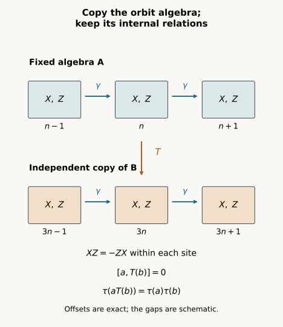

# Independent copies of orbit algebras

*Written by GPT-6.1 Sol (OpenAI), Ultra, October 2026. Self-checked by the AI that wrote it, under the stated prerequisites. New original text and figures are public domain (CC0). Source and proof revision by GPT-6 Astra (OpenAI), Ultra, October 2026.*

## Introduction

An orbit algebra records every translated generator and every relation between them. Moving only a projection partition leaves much of that structure uncontrolled. We now copy the whole orbit algebra while keeping a prescribed coefficient algebra fixed.

The copy preserves all noncommutative word moments and the group action. It commutes with the fixed algebra, and their joint trace factors. We prove that multiplication extends to a normal isomorphism of the spatial von Neumann tensor product. Iteration gives countably many independent copies.

This is a model-embedding step. The image is the algebra generated by the fixed algebra and the copy; no assertion says that it fills the asymptotic centralizer or absorbs an action on the original factor. The general amenable projection construction and the later classification arguments remain to be proved.

Centralizer prerequisites are Central sequence algebras and exact lifts: Proposition 2.1 gives scalar ultraweak limits, Theorem 3.1 gives the faithful normal trace and induced action, and Lemma 4.1, Theorem 5.1 with both endpoints equal to 1, and Theorem 6.1 give exact projection, unitary and finite-partition lifts. These results apply to arbitrary factors with separable predual and every free ultrafilter. The preceding relative-partition argument is a pedagogical antecedent; Theorem 1.1 below has its own proof in Sections 2–7. Spectral calculus, bounded strong density and the tracial GNS representation retain their recorded foundational scope. Sections 5 and 7 explain the normal extensions used here. The coordinate-selection method has antecedents in [Connes, Proposition 2.1.2, Lemma 2.1.4 and the proof of Theorem 2.2.1]. Sections 2–7 give the full word-moment, equivariance and spatial tensor-product argument needed here. [Ando–Haagerup, Definition 4.34 and Proposition 4.35] supplies the modern centralizer context.

## 1. Setting and theorem

Let \(M\) be a factor with separable predual, let \(\omega\) be a free ultrafilter on
the positive integers, and let \(F=M_\omega\) be its asymptotic centralizer. We
use its faithful normal canonical tracial state \(\tau\), its bounded strongly
central representatives, the quotient strong-star-null ideal, and the
coordinate action of automorphisms of \(M\). The exact scope is recorded in the
public lesson Central sequence algebras and exact lifts, Proposition 2.1 and Theorem 3.1. Fix a faithful
normal state \(\varphi\) on \(M\) and a norm-dense sequence \(\psi_i\) in the unit ball of \(M_*\).

We also use spectral calculus, normality of fixed multiplication, the
faithful normal tracial GNS representation, and bounded strong density of a
unital \(C^*\)-algebra in its von Neumann closure. The finite tracial GNS and
spatial tensor construction used in Sections 5 and 7 are explained
below. None of these assertions supplies a general amenable tower theorem.

Let \(Q\) be a countable group and \(\gamma\) an action of \(Q\) on \(F\). For each \(g\) choose
an automorphism \(\beta_g\) of \(M\) inducing \(\gamma_g\). These chosen lifts are not
assumed to multiply as an action on \(M\). Since \(M\) is a factor, \(\gamma\) preserves
\(\tau\). Let \(A\) be a countably generated von Neumann subalgebra of \(F\). Let \(B\) be a
countably generated \(\gamma\)-invariant von Neumann subalgebra of \(F\).

**Theorem 1.1.** There exists a unital normal trace-preserving
*-isomorphism \(T\) from \(B\) onto a \(\gamma\)-invariant von Neumann subalgebra \(B'\) of \(F\)
such that
\[
 \begin{aligned}
 T\gamma_g|_B&=\gamma_g T\quad(g\in Q),\\
 B'&\subset A'\cap F.
 \end{aligned}
 \tag{1.1}
\]
and
\[
 \begin{gathered}
 \tau(aT(b))=\tau(a)\tau(b)\\
 (a\in A,\ b\in B).
 \end{gathered}
 \tag{1.2}
\]
Consequently multiplication implements a unital normal trace-preserving
isomorphism
\[
 \begin{aligned}
 A\overline\otimes B&\longrightarrow W^*(A,B'),\\
 a\otimes b&\longmapsto aT(b).
 \end{aligned}
 \tag{1.3}
\]
If \(A\) is \(\gamma\)-invariant, this isomorphism intertwines the diagonal action
\(\gamma|_A\otimes\gamma|_B\) with \(\gamma\) on its image. Invariance of \(A\) is needed
only for this final equivariance assertion.

Replacing \(A\) by the algebra generated by all \(\gamma_g(A_s)\) retains countable
generation and supplies a \(\gamma\)-invariant fixed algebra whenever that is
desired. The theorem requires neither freeness nor amenability of \(Q\).

## 2. The scalar ultraweak limit of a central representative

If \((z_k)\) is a bounded strongly central representative of \(Z\) in \(F\), then
\[
 z_k\longrightarrow\tau(Z)1
 \quad\hbox{ultraweakly along }\omega.
 \tag{2.1}
\]
Indeed the norm ball is ultraweakly compact, so its ultrafilter limit \(z\)
exists. For \(x\) in \(M\) and \(\psi\) in \(M_*\), predual centrality gives \(\psi(xz-zx)=0\), by taking the
ultrafilter limit of \(\psi(xz_k-z_kx)\). Thus \(z\) is central in the factor \(M\)
and is a scalar. Its scalar value is \(\lim_{k\to\omega}\varphi(z_k)=\tau(Z)\).

For a fixed bounded \(c\) in \(M\), the functional \(x\mapsto\varphi(xc)\) is normal. Hence
\[
 \lim_{k\to\omega}\varphi(z_kc)=\tau(Z)\varphi(c).
 \tag{2.2}
\]
Here \(c\) is fixed while \(k\) varies. We will apply this with \(c\) depending on the
output coordinate \(n\), after \(n\) has been fixed. It is not an assertion of
uniform convergence on arbitrary moving coefficients.

## 3. Labels remember compositions of the chosen lifts

Choose countable generating families \((A_s)\) for \(A\) and \((X_j)\) for \(B\), with
bounded strongly central representatives \(a_{s,n}\) and \(x_{j,k}\). Rescale each
generator, if necessary, so these representatives are contractions. This
does not change either generated algebra.

Let \(\Lambda\) be the countable set of finite words in the letters \(\beta_g\) and
\(\beta_g^{-1}\), including the empty word. For \(\lambda\) in \(\Lambda\) write \(\rho_\lambda\)
for the composed automorphism of \(M\), and \(\pi(\lambda)\) for the corresponding
group element. Thus \(\rho_\lambda\) induces \(\gamma_{\pi(\lambda)}\) on \(F\). Include all
words, even if different words compose to the same automorphism or induce
the same group element. Enumerate \(\Lambda\) once, with the empty word first.
Define
\[
 X_{\lambda,j}=\gamma_{\pi(\lambda)}(X_j),\qquad
 x_{\lambda,j,k}=\rho_\lambda(x_{j,k}).
 \tag{3.1}
\]
Every coordinate sequence in (3.1) is bounded and strongly central.

Let \((W_r)\) enumerate every finite word, including 1, in the labeled
generators \(X_{\lambda,j}\) and their adjoints. Let \(w_{r,k}\) be its coordinate
word. Let \((V_t)\) enumerate every finite word in the \(A_s\) and their adjoints,
with \(v_{t,n}\) its coordinate word. Both word families are countable. Their complex linear spans are the
generated unital *-algebras. Each coordinate word is a
contraction and is strongly central. By (2.1),
\[
 \lim_{k\to\omega}\varphi(w_{r,k})=\tau(W_r).
 \tag{3.2}
\]

The use of lift words is essential. Knowing only moments of the single
lifts \(\beta_g\) does not by itself ensure that an arbitrary coordinate
substitution preserves \(\beta_h\beta_g=\beta_{hg}\) modulo the quotient ideal.
All such relations appear among the labeled word moments below. No action
identity on \(M\) is assumed.

## 4. One coordinate choice enforces the finite tests

For each positive integer \(n\) choose \(k(n)\ge n\) for which all the following hold:
\[
 \|[x_{j,k(n)},\psi_i]\|<1/n\quad(j,i\le n),
 \tag{4.1}
\]
\[
 \begin{gathered}
 \|[\rho_\lambda(x_{j,k(n)}),a_{s,n}]\|_\varphi^\sharp<1/n\\
 (\lambda,j,s\le n),
 \end{gathered}
 \tag{4.2}
\]
\[
 |\varphi(w_{r,k(n)})-\tau(W_r)|<1/n\quad(r\le n),
 \tag{4.3}
\]
\[
 \begin{gathered}
 |\varphi(w_{r,k(n)}v_{t,n})
      -\tau(W_r)\varphi(v_{t,n})|<1/n\\
 (r,t\le n).
 \end{gathered}
 \tag{4.4}
\]
Here \(\lambda\le n\) means its position in the chosen enumeration, and
\[
 \|c\|_\varphi^\sharp
 =\bigl(\varphi(c^*c)+\varphi(cc^*)\bigr)^{1/2}.
 \tag{4.5}
\]

Every listed individual condition holds on a set in \(\omega\). For (4.1) use
predual centrality. For (4.2), \(n\) is fixed, so the finitely many \(a_{s,n}\) are
fixed elements of \(M\); strong centrality of \(\rho_\lambda(x_{j,k})\) implies
strong-star commutation with them. For (4.3) use (3.2). For (4.4) use (2.2)
with \(c=v_{t,n}\). The cofinite condition \(k\ge n\) also belongs to \(\omega\). Their
finite intersection remains in \(\omega\), so a common \(k(n)\) exists. Monotonicity
of \(k(n)\) is unnecessary; no ultrafilter-preserving substitution is asserted.

Put
\[
 \begin{aligned}
 y_{j,n}&=x_{j,k(n)},&Y_j&=[(y_{j,n})],\\
 Y_{\lambda,j}&=[(\rho_\lambda(y_{j,n}))].
 \end{aligned}
 \tag{4.6}
\]
First, \(y_j\) is strongly central. For \(\psi\) in the unit ball of \(M_*\) and a fixed
\(i\), the contraction bound gives
\[
 \|[y_{j,n},\psi]\|
 \le\|[y_{j,n},\psi_i]\|+2\|\psi-\psi_i\|.
 \tag{4.7}
\]
For \(n\ge\max(i,j)\) the first term is at most \(1/n\). Take the limit and then
approximate \(\psi\) by \(\psi_i\). Scaling handles arbitrary normal functionals.
Automorphisms preserve strong centrality, so all \(Y_{\lambda,j}\) are defined.

Condition (4.2) implies \([Y_{\lambda,j},A_s]=0\): the commutator is strongly
central and its sharp seminorm tends to zero. Define \(B'\) as the von Neumann
algebra generated by all the \(Y_{\lambda,j}\). The two generated algebras then
commute, so \(B'\) is contained in \(A'\cap F\). Composing \(\rho_\lambda\) on the
left by \(\beta_g\) is again a lift word. Thus \(\gamma_g\) maps the generating family
into itself. The inverse time does the same, proving \(\gamma\)-invariance of \(B'\).

## 5. Moments preserve all relations and the operator norm

If \(W'_r\) is the word \(W_r\) evaluated at the \(Y_{\lambda,j}\), it is represented
by \(w_{r,k(n)}\). By (4.3) and the quotient trace,
\[
 \tau(W'_r)=\tau(W_r)\quad(r\ge1).
 \tag{5.1}
\]
For any finite complex polynomial \(P\) in the labeled generators and their
adjoints, linearity applied to all words in \(P^*P\) gives
\[
 \tau(P(Y)^*P(Y))=\tau(P(X)^*P(X)).
 \tag{5.2}
\]
If \(P(X)=0\), faithfulness of \(\tau\) makes \(P(Y)=0\). Conversely the same identity
makes \(P(X)=0\) when \(P(Y)=0\). Evaluation therefore defines a bijective unital
*-homomorphism \(T_0\) between the generated *-algebras, with \(T_0(X_{\lambda,j})=Y_{\lambda,j}\), preserving their traces.

It is also isometric in operator norm. For any element \(z\) of a finite von
Neumann algebra with faithful normal normalized trace,
\[
 \|z\|=\lim_{m\to\infty}
          \tau((z^*z)^m)^{1/(2m)}.
 \tag{5.3}
\]
The upper bound is at most \(\|z\|\). If \(0<c<\|z\|\), the spectral projection
\(e=1_{(c^2,\infty)}(z^*z)\) is nonzero and has positive trace. Then
\(\tau((z^*z)^m)\ge c^{2m}\tau(e)\), whose indicated root tends to at least \(c\).
Let \(c\) increase to \(\|z\|\). This proves (5.3), including \(z=0\) separately.
Equation (5.1), expanded for \((P^*P)^m\), therefore gives
\[
 \|T_0(P(X))\|=\|P(X)\|.
 \tag{5.4}
\]
Thus \(T_0\) extends to a trace-preserving \(C^*\)-isomorphism of the norm closures.

Here is the bounded density step used next. Let \(D\) be the unital
\(C^*\)-algebra generated by the labeled \(X\)'s. Kaplansky density gives,
for each contraction \(b\in B\), a net of contractions in \(D\) converging
strongly to \(b\). Approximating each of these elements in norm by a
polynomial, with the norm error tending to zero, gives a uniformly bounded
polynomial net. In the faithful normal tracial representation its vectors
converge to \(b\Omega\). Thus it is the norm-closed generated algebra to
which bounded density is first applied; no bounded-density assertion for
an arbitrary unclosed polynomial algebra is being assumed.

The map \(P(X)\Omega\mapsto P(Y)\Omega\) preserves inner products by (5.2), and its
range is dense in the tracial GNS space of \(B'\). Its domain is dense in that
of \(B\): bounded strong density and normality of the trace give \(L^2\) density.
It extends to a unitary \(U\) between the two GNS spaces. For polynomials \(P\),\(R\),
\[
 U\bigl(P(X)R(X)\Omega\bigr)
   =P(Y)R(Y)\Omega.
 \tag{5.5}
\]
Conjugation by \(U\) therefore identifies the left regular \(C^*\)-algebras and
their von Neumann closures. Faithful normal tracial GNS representations
identify those closures with \(B\) and \(B'\). This supplies the unital normal
trace-preserving isomorphism \(T\) asserted in Theorem 1.1.

The representation and closure assertions have exact programme proofs in
[Bounded topology and tracial representations](bounded-topology-and-tracial-representations.md),
Theorems 3.1 and 6.1. Its normality construction applies to the restrictions
of \(\tau\) to \(B\) and \(B'\), and its compact-ball argument identifies
their represented von Neumann closures. The elementary Hilbert-space,
predual, spectral and Kaplansky-density foundations retained in that lesson
remain prerequisites here; this reference does not declare their transitive
programme proof coverage complete.

For each \(g\), \(\gamma_g(X_{\lambda,j})\) is the labeled generator for \(\beta_g\)
composed on the left with \(\rho_\lambda\), and the identical coordinate formula
holds for \(Y_{\lambda,j}\). Hence \(T_0\gamma_g=\gamma_gT_0\) on the polynomial
algebra. Normality extends this equality to \(B\). In particular all relations
between different lift words survive. For example, two words inducing the
same element of \(Q\) give the same original labeled generator; (5.2) makes
their copied generators equal, even if their compositions on \(M\) differ.

## 6. The copied algebra is trace-independent of the fixed one

Condition (4.4) gives
\[
 \tau(W'_r V_t)=\tau(W_r)\tau(V_t).
 \tag{6.1}
\]
Indeed \(v_{t,n}\) is a fixed bounded strongly central representative of \(V_t\),
and \(\tau\) of the product is its coordinate \(\varphi\) limit. The error in (4.4)
tends to zero ordinarily. Linearity proves (1.2) for polynomial \(a,b\).

For a fixed polynomial \(T(b)\), both sides of (1.2) are normal linear
functionals of \(a\). Ultraweak density extends their equality to every \(a\in A\).
Fix such an \(a\). Both sides are then normal linear functionals of \(b\), because
fixed multiplication and \(T\) are normal. Extend again to all \(b\) in \(B\). These
are two separate density arguments; no joint ultraweak continuity of
multiplication is being assumed.

## 7. Why multiplication extends to the spatial tensor product

The commuting ranges define a unital *-homomorphism on \(A\) algebraically
tensor \(B\) by \(a\otimes b\mapsto aT(b)\). Put \(C=W^*(A,B')\). For a finite sum \(z\) of such
simple tensors, (1.2) gives
\[
 \begin{aligned}
 \left\|\sum_i a_iT(b_i)\right\|_2^2
   &=\sum_{i,j}\tau(a_i^*a_j)\\
   &\qquad\cdot\tau(b_i^*b_j).
 \end{aligned}
 \tag{7.1}
\]
The right side is the squared norm of \(\sum_i a_i\Omega_A\otimes b_i\Omega_B\)
in \(L^2(A)\otimes L^2(B)\). Thus
\[
 a\Omega_A\otimes b\Omega_B
    \longmapsto aT(b)\Omega_C
 \tag{7.2}
\]
extends to an isometry, and it is onto. Finite sums of products are a unital
*-algebra generating \(C\) because the ranges commute. Bounded strong density
and the trace again make their GNS vectors dense in \(L^2(C)\).

The unitary (7.2) intertwines left multiplication by every simple tensor
with left multiplication by its product in \(C\). Taking von Neumann closures
therefore identifies the spatial tensor algebra \(A\overline\otimes B\) with \(C\).
This is (1.3), as a normal isomorphism; it is not merely an algebraic or a
minimal \(C^*\)-tensor embedding. The vector \(\Omega_A\otimes\Omega_B\) maps to
\(\Omega_C\), so product trace is preserved.

For clarity, the left regular representation used here is faithful and
normal. Faithfulness follows by testing \(x\Omega\), whose squared norm is
\(\tau(x^*x)\). If a bounded positive net \(x_i\) increases to \(x\), then for each
\(a\Omega\) the values \(\tau(a^*(x-x_i)a)\) tend to zero by normality. Positivity and
boundedness give strong convergence of the represented net to \(x\) on this
dense set and hence on the whole GNS space. This proves normality.

In the spatial tensor representation the vector product state is normal
and faithful. Right multiplications from \(A\) and \(B\) commute with the left
tensor algebra and their orbit of \(\Omega_A\otimes\Omega_B\) is dense; the
vector is therefore separating for the left algebra. Its state restricts
to \(\tau\otimes\tau\) and is tracial on the dense tensor *-algebra, hence on the
closure. Explicitly, first fix an algebraic tensor \(x\). The two normal
functionals \(y\mapsto\langle xy\Omega,\Omega\rangle\) and
\(y\mapsto\langle yx\Omega,\Omega\rangle\) agree on algebraic tensors, so
they agree throughout the spatial tensor algebra. Next fix arbitrary
\(y\) and use normality in \(x\) to extend this equality in the other
variable. This uses separate normality, not joint ultraweak continuity of
multiplication. These facts justify the faithful normal tracial tensor GNS model
in (7.1)-(7.2).

If \(A\) is \(\gamma\)-invariant, equivariance on simple tensors is
\[
 \gamma_g(aT(b))=\gamma_g(a)T(\gamma_g(b)).
 \tag{7.3}
\]
Normality gives the equivariant tensor statement on the whole image. This
finishes the proof of Theorem 1.1.

## 8. Countably many independent equivariant copies

**Corollary 8.1.** If \(A\) is \(\gamma\)-invariant and countably generated, \(F\) contains
a \(\gamma\)-invariant normal copy of
\[
 A\overline\otimes
       \mathop{\overline{\bigotimes}}_{r=1}^{\infty}(B,\tau|_B),
 \tag{8.1}
\]
with the diagonal action and product trace, whose restriction to \(A\) is the
original inclusion.

*Proof.* Apply Theorem 1.1 repeatedly. After \(r\) steps the previously
generated algebra \(A_r=W^*(A,B_1,\ldots,B_r)\) is still countably generated and
\(\gamma\)-invariant. The next copy \(B_{r+1}\) commutes with \(A_r\) and is trace
independent of it. Induction using (7.1) gives the finite product
identifications, consistent on earlier tensor factors. On the union of
finite products the product GNS inner product is therefore exactly the
ambient trace inner product. Complete this union to the infinite product
GNS space. Its image is dense in \(L^2\) of the von Neumann algebra generated
by all copies. The same intertwining of left multiplication as in (7.2)
gives a normal trace-preserving isomorphism of the infinite product onto
that generated algebra. Each diagonal \(\gamma_g\) preserves the finite
product inner product and is inverse to \(\gamma_{g^{-1}}\), so its unitary
implementation extends to the GNS completion. Its action agrees with the
ambient \(\gamma\) on every finite product and hence on the closure. This proves
the corollary. No separability of the predual of \(F\) is assumed.

## 9. A tail-site example with noncommuting internal generators

Take \(M\) to be the trace tensor product of \(M_2(\mathbb C)\) over sites in \(\mathbb Z\), and let \(\beta\)
shift each site to its successor. This is a separable-predual factor: the
finite tensor union is dense in \(L^2\), and a central element commuting with
every finite tensor algebra equals its scalar trace by the corresponding
finite-site expectations. Its trace provides \(\varphi\). Let \(X\) and \(Z\) denote the
Pauli matrices with \(XZ=-ZX\), each at one site. Define in \(F\)
\[
 \begin{gathered}
 X_s=[(X\text{ at site }n+s)],\\
 Z_s=[(Z\text{ at site }n+s)]\\
 (s\in\mathbb Z).
 \end{gathered}
 \tag{9.1}
\]
These sequences are strongly central. They commute eventually with every
fixed finite-site element; finite-site \(L^1\) densities are dense in the
predual and give predual commutation by approximation. They generate a
\(\gamma\)-invariant countable orbit algebra \(B\) with \(\gamma\)(\(X_s\))=\(X_{s+1}\) and the
same formula for \(Z_s\).

Keep \(A\)=\(B\) at its original coordinates \(n+s\). Reindex the copied generators
to sites \(3n+s\). For any two fixed finite sets of offsets, the sets \(n+S\) and
\(3n+T\) are disjoint for all sufficiently large \(n\). The finite-site tensor
trace factors exactly between them. The copied and fixed algebras
therefore commute and are trace-independent, first on finite words and
then by the separate normal density arguments of Section 6.

Within each orbit algebra, all word moments are unchanged: a common site
translation preserves both coincident offset labels and the Pauli product
order. In particular
\[
 \begin{aligned}
 \|[X_0,Z_0]\|_2^2&=4,\\
 \|[T(X_0),T(Z_0)]\|_2^2&=4,\\
 [T(X_0),Z_0]&=0.
 \end{aligned}
 \tag{9.2}
\]
The construction copies a noncommutative algebra. It does not turn its
internal generators into commuting ones. Shift covariance is exact
because \(\beta\) sends \(3n+s\) to \(3n+s+1\) at the unchanged output coordinate \(n\).
Moving both the original and copied families to the same sites would
retain the commutator 4 and destroy the required independence.

Figure 1. A finite window of the two orbit algebras in Section 9. At each
displayed site \(X\) and \(Z\) anticommute; generators at distinct sites commute.
The upper orbit at \(n+s\) stays fixed, while the lower copy is at \(3n+s\).
Horizontal arrows are the actual shift \(\gamma\); vertical correspondences are
\(T\) on the indicated generators. The gaps are schematic, not a common
coordinate scale. The full infinite tensor argument proves separation for
every fixed finite collection of offsets. Equations (9.1)-(9.2), (1.2) and
(7.1)-(7.3) are the proof locators. The reproducible original scene is
[draw_equivariant_independent_copy.py](../figures/draw_equivariant_independent_copy.py). Connes's central-sequence framework
is credited below; the two-tail-site example and diagram are original.

## 10. What this establishes, and what is still needed

This proof provides an equivariant, trace-independent normal copy of each
specified countably generated orbit algebra and countably many such copies
inside \(F\). It extends the preceding finite-partition transfer by preserving
all noncommutative word moments, quotient relations between chosen lift
compositions, operator norms, and the full normal generated algebra.

It is an embedding theorem. Its image is the specified generated subalgebra
\(W^*(A,B')\); it need not be all of \(F\). It does not identify an action on \(M\) with a tensor product action on \(M\)
or prove absorption by a prescribed model.
It does not construct the general amenable nonrelative weighted projection
towers, compare arbitrary characteristic-and-trace isotropy, glue outer
isotropy, or reconstruct the general continuous action. Those remaining classification arguments are still required.

The centralizer foundations are in Central sequence algebras and exact lifts, Proposition 2.1 and Theorem 3.1. The preceding finite-partition transfer motivates the construction; Sections 2–7 prove the whole orbit-algebra transfer directly. [Connes], Section 2, is background for the central-sequence setting. The proofs here are written out under these exact foundations.

## 11. Exercises with solutions

**Exercise 11.1. (introductory: small trace still detects the norm).** In the normalized trace on \(M_{100}(\mathbb C)\), let \(p\) be rank one and \(z=2p\). Compute the roots in (5.3) and their limit. Explain why a small positive trace is sufficient.

*Solution.* Since \(z^*z=4p\),
\[
 \tau((z^*z)^m)^{1/(2m)}
   =2\cdot100^{-1/(2m)}\longrightarrow2.
 \tag{11.1}
\]
For every positive number \(t\), \(t^{1/(2m)}\) tends to one. The lower spectral bound in (5.3) needs the detecting projection to have positive trace, not a uniform lower bound on that trace. The limit agrees with \(\|z\|=2\).

**Exercise 11.2. (intermediate: faithfulness is essential).** Put \(D=\mathbb C\oplus\mathbb C\) and \(\sigma(a,b)=a\). Find an element whose positive moments all vanish while its operator norm is nonzero. Which inference in Section 5 fails?

*Solution.* Take \(q=(0,1)\). It is a nonzero projection, and
\[
 \sigma((q^*q)^m)=0\quad(m\ge1),
 \qquad\|q\|=1.
 \tag{11.2}
\]
The trace is normal and tracial but not faithful. A zero squared trace norm does not imply that an operator is zero. Both the polynomial-relation test (5.2) and the lower spectral bound in (5.3) require faithfulness.

**Exercise 11.3. (advanced: different lift words give the same copy).** Suppose \(\pi(\lambda)=\pi(\mu)\). Show explicitly how word-moment preservation proves \(Y_{\lambda,j}=Y_{\mu,j}\), without requiring \(\rho_\lambda=\rho_\mu\) on \(M\).

*Solution.* In the original quotient, \(X_{\lambda,j}=X_{\mu,j}\). Expand the squared difference as four words. Equation (5.1) preserves their traces, so
\[
 \begin{aligned}
 \|Y_{\lambda,j}-Y_{\mu,j}\|_2^2
 &=\|X_{\lambda,j}-X_{\mu,j}\|_2^2\\
 &=0.
 \end{aligned}
 \tag{11.3}
\]
Faithfulness gives equality of the copied elements. The composed lifts may differ on ordinary elements of \(M\); the statement preserves their quotient relation because that relation is included in the moment tests. This is the reason Section 3 retains all lift words.

**Exercise 11.4. (advanced: why the original algebra is a factor).** Let \(M=\mathbb C^2\) with its equal-weight trace and the trivial action. All bounded sequences are central. Let \(p=(1,0)\) be constant, and take \(A=B=M\). Can a unital trace-preserving copy \(T\) satisfy (1.2)? Relate the obstruction to (2.1).

*Solution.* The quotient of bounded sequences modulo trace-null sequences is again \(\mathbb C^2\): ultrafilter limits of the two scalar coordinates give this identification. A unital trace-preserving injective copy of \(\mathbb C^2\) into itself maps \(p\) to \(p\) or \(1-p\). Therefore
\[
 \begin{aligned}
 \tau(pT(p))&\in\{0,1/2\},\\
 \tau(p)\tau(T(p))&=1/4.
 \end{aligned}
 \tag{11.4}
\]
Neither value satisfies independence. The ultraweak limit of the constant central representative \(p\) is \(p\), not \(\tau(p)1\). Factorhood gives the scalar limit that makes the mixed tests (4.4) possible.

**Exercise 11.5. (intermediate: product trace alone does not give a tensor map).** In \(M_2(\mathbb C)\) with normalized trace, let \(X,Z\) be the Pauli matrices and put \(A=W^*(X)\), \(D=W^*(Z)\). Show that \(\tau(ad)=\tau(a)\tau(d)\) for every \(a\in A,d\in D\), while multiplication does not define a homomorphism from \(A\otimes D\).

*Solution.* Write \(a=\alpha1+\beta X\), \(d=\eta1+\zeta Z\). The traces of \(X,Z,XZ\) all vanish, so both sides are \(\alpha\eta\). Nevertheless
\[
 XZ=-ZX,\qquad\|[X,Z]\|_2^2=4.
 \tag{11.5}
\]
The elements \(X\otimes1\) and \(1\otimes Z\) commute in the tensor algebra; their proposed images do not. Section 7 uses both trace independence and commuting ranges. Independence alone does not provide a tensor-product representation.

**Exercise 11.6. (advanced: the two normal extensions).** Explain why (6.1) extends to all \(a\in A,b\in B\) without any joint ultraweak continuity assertion for multiplication.

*Solution.* First fix a polynomial \(b\). The functions \(a\mapsto\tau(aT(b))\) and \(a\mapsto\tau(a)\tau(b)\) are normal linear functionals and agree on an ultraweakly dense unital *-algebra. They agree on all of \(A\). Next fix an arbitrary \(a\in A\). Normality of \(T\) and of multiplication by this fixed \(a\) makes both functions of \(b\) normal. Agreement on the polynomial algebra extends to all of \(B\). Each extension holds one variable fixed. The order is needed because the second extension uses the conclusion of the first.

**Exercise 11.7. (advanced: an embedding need not fill the ambient algebra).** In the bilateral tensor factor from Section 9, now use the trivial group action. Take \(A=\mathbb C1\) and let \(B\) be the matrix algebra generated by the Pauli sequences at site \(n\). Copy it to site \(3n\). Prove that the image is a proper subalgebra of \(F\).

*Solution.* The copied Pauli relations generate \(C\cong M_2(\mathbb C)\). Let \(D\) be the class of the Pauli \(X\) at site \(5n\). These coordinates are disjoint for all positive \(n\), so
\[
 D^2=1,\qquad\tau(D)=0,\qquad[D,C]=0.
 \tag{11.7}
\]
If \(D\) belonged to \(C\), it would be in the center of the matrix algebra, hence scalar. Its zero trace would make it zero, contradicting \(D^2=1\). Thus \(D\in F\setminus C\). The action is trivial here, so \(B\) is invariant and all theorem hypotheses hold. The theorem gives its stated normal tensor image, not an onto-\(F\) conclusion.

**Exercise 11.8. (advanced: averaging independent copies).** In Corollary 8.1 choose a self-adjoint unitary \(u\in B\) with \(\tau(u)=0\), and let \(u_r\) be its image in copy \(r\). Compute the squared trace norm of their average over the first \(m\) copies.

*Solution.* For \(r\ne s\), successive product-trace independence gives \(\tau(u_ru_s)=\tau(u_r)\tau(u_s)=0\). Each diagonal term has trace one. Therefore
\[
 \begin{aligned}
 \left\|\frac1m\sum_{r=1}^m u_r\right\|_2^2
 &=\frac1{m^2}\sum_{r,s=1}^m\tau(u_ru_s)\\
 &=\frac1m.
 \end{aligned}
 \tag{11.8}
\]
The averages have operator norm at most one and trace norm tending to zero. This is a calculation inside the independent-copy image; it does not assert that the image equals \(F\).

## References

[Connes] Alain Connes, *Outer conjugacy classes of automorphisms of factors*, Annales scientifiques de l'Ecole Normale Superieure, serie 4, 8 (1975), 383–419. Proposition 2.1.2, Lemma 2.1.4 and the proof of Theorem 2.2.1 give the central-sequence reindexing antecedents used here. The full equivariant, trace-independent copy is proved in Sections 2–7 of this lesson. [Article and original text](https://numdam.org/articles/10.24033/asens.1295/).

[Ando–Haagerup] Hiroshi Ando and Uffe Haagerup, *Ultraproducts of von Neumann algebras*, Journal of Functional Analysis 266 (2014), 6842–6913. Definition 4.34 and Proposition 4.35, pages 38–39 of arXiv version 3, identify the centralizer framework; the whole paper is not a prerequisite claim. [Open author version, 22 March 2014](https://arxiv.org/abs/1212.5457v3).
