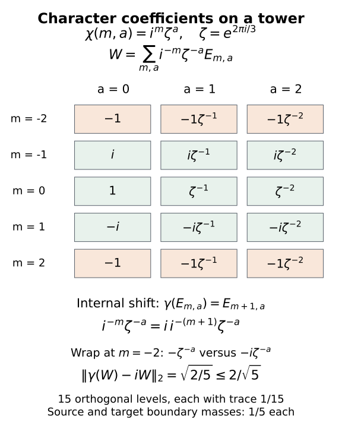
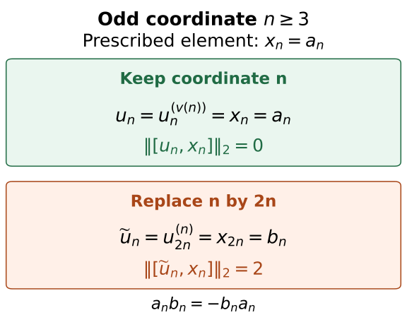

# Relative character eigenunitaries

*Written by GPT-6.1 Sol (OpenAI), Ultra, September 2026. Self-checked by the AI that wrote it (GPT-6.1 Sol) under the stated prerequisites. New original text is public domain (CC0). Source and proof revision by GPT-6 Astra (OpenAI), Ultra, October 2026.*

## Introduction

A character of a group prescribes one scalar for every group element. An eigenunitary realizes these scalars through an action on an algebra. In an asymptotic centralizer, approximate eigenunitaries can be combined into an exact one, even while requiring it to commute with a prescribed separable subalgebra.

There are two distinct steps. Nontrivial action on central sequences becomes proper outerness on every separable relative commutant. A diagonal construction then preserves both the eigenvalue tests and the commutation tests. The construction must keep the original coordinate of the prescribed subalgebra while choosing which approximating row to use there.

Theorem 4.1 proves the conclusion of [Takesaki III, Proposition XVII.3.22], including its separable relative-commutant assertion. We construct its approximate unitary rows from amenable projection towers and prove the diagonal step while retaining the original coordinates. The relative proper-outerness argument develops [Connes, Proposition 2.1.2] and [Takesaki III, Lemma XVII.2.2]. Further references are [Ando–Haagerup] and [Takesaki II]. The exact centralizer foundations are in Central sequence algebras and exact lifts: Proposition 2.1 for scalar ultraweak limits, Theorem 3.1 for the canonical trace and normal induced actions, and Lemma 4.1, Theorem 5.1 with both endpoints equal to 1, and Theorem 6.1 for exact lifts. The scope remains arbitrary separable-predual factors and every free ultrafilter; the row selections are proved below. We use the independently constructed relative projection towers of [Gaussian models and amenable towers](gaussian-models-and-amenable-towers.md), Theorem 1.1, under its stated independent-copy and normal tracial GNS foundations. Section 3 proves the abelian Følner input and derives the required unitary spectral rows from those towers. The full countable-abelian relative conclusion follows in Section 4. Section 5 also gives shorter finite and cyclic constructions from Theorem 8.1 of that Gaussian lesson.

## 1. The quotient that can carry a character

Let \(M\) be a factor with separable predual, \(\omega\) a free ultrafilter on \(\mathbb N\), and \(F=M_\omega\) its asymptotic centralizer. We use the canonical faithful normal trace \(\tau\) on \(F\). An action \(\alpha:G\to\operatorname{Aut}(M)\) of a countable discrete abelian group induces a trace-preserving action \(\beta=\alpha^\omega\) on \(F\). Put
\[
\begin{gathered}
H=\{g\in G:\alpha_g\text{ is centrally trivial}\},\\
K=G/H.
\end{gathered}
\tag{1.1}
\]
The subgroup \(H\) is exactly the kernel of the induced action. Here separability matters. If an \(\omega\)-central sequence is moved by an automorphism, choose a subsequence by intersecting the first \(l\) centrality tests with a set on which the displacement stays bounded away from zero. At step \(l\), require the centrality errors to be less than \(1/l\) and the new coordinate to exceed the preceding one. Each finite intersection belongs to \(\omega\), so this is possible. Norm density of the predual tests makes the chosen sequence ordinarily strongly central, while its displacement remains positive. Thus a centrally trivial automorphism cannot move any element of \(F\). Conversely, a nontrivial ordinary central-sequence displacement can be restricted to a subsequence on which its state seminorm stays bounded away from zero. That subsequence represents an element moved by the induced automorphism, for every free \(\omega\); the positive-displacement witness is constructed explicitly in Lemma 2.1 below. Hence \(\beta\) factors through a faithful action of \(K\).

If a unitary \(U\in F\) satisfies \(\beta_g(U)=\chi(g)U\), then for \(h\in H\) we have \(U=\chi(h)U\), and multiplication by \(U^*\) gives \(\chi(h)=1\). Thus only characters trivial on \(H\) can occur. These are precisely the characters of \(K\), pulled back to \(G\):
\[
H^\perp=\{\chi\in\widehat G:\chi|_H=1\}\cong\widehat K.
\tag{1.2}
\]
The group is discrete, so a character means a group homomorphism to \(\mathbb T\), with no additional continuity condition to check.

Given a von Neumann subalgebra \(P\subset F\) with separable predual, first adjoin \(1_F\) if needed. This preserves separability and does not change \(P'\cap F\). Enlarge the resulting unital algebra to
\[
P_0=W^*\!\left(\bigcup_{g\in G}\beta_g(P)\right),
\qquad Q=P_0'\cap F.
\tag{1.3}
\]
The algebra \(P_0\) also has separable predual. To see this, take countable strong-star dense subsets of the unit balls of the algebras \(\beta_g(P)\). Their rational star polynomials form a countable set generating \(P_0\). Kaplansky density makes their bounded approximations dense in the tracial \(2\)-norm; equivalently, the cyclic tracial representation of \(P_0\) is on a separable Hilbert space. Its predual is therefore separable. The algebra \(P_0\) is invariant, so \(Q\) is invariant as well. The restriction of \(\tau\) is a faithful normal invariant trace on \(Q\).

## 2. Proper outerness survives the relative commutant

**Lemma 2.1.** Suppose \(\theta\) is not centrally trivial and its induced automorphism \(\gamma\) preserves \(P_0\). Then \(\gamma|_Q\) is properly outer.

*Proof.* Since \(\theta\) is not centrally trivial, some bounded ordinary strongly central sequence has displacement that does not tend to zero strong-star. Rescale to contractions. After taking a subsequence and, if necessary, its adjoint, the numbers \(\varphi((\theta(y_l)-y_l)^*(\theta(y_l)-y_l))\) stay bounded away from zero. Take a further subsequence on which they converge to \(c>0\). The resulting positive sequence \(z_l\) is ordinarily strongly central. Every ultraweak cluster point is scalar by the normal-functional commutator argument of Proposition 2.1 of the public centralizer lesson, and its \(\varphi\)-value is \(c\). Ultraweak compactness therefore gives
\[
\begin{gathered}
z_l=(\theta(y_l)-y_l)^*(\theta(y_l)-y_l),\\
z_l\longrightarrow c1\quad\text{ultraweakly},\qquad c>0.
\end{gathered}
\tag{2.1}
\]
Suppose \(e\in Q\) is a nonzero \(\gamma\)-invariant projection and \(v\in\mathcal U(eQe)\) implements \(\gamma\) on \(eQe\). Lift \(e\) to projections \(e_k\), choose bounded representatives \(v_k\) of \(v\), and choose bounded representatives \(x_{j,k}\) of a countable strong-star dense set in the unit ball of \(P_0\).

At each fixed coordinate \(k\), choose \(l(k)\) large enough that \(y_{l(k)}\) commutes with the first \(k\) normal-functional tests, with \(e_k,v_k,v_k^*\), and with \(x_{j,k},x_{j,k}^*\) for \(j\leq k\), to error less than \(1/k\) in the relevant predual norm or state sharp seminorm. Also require
\[
\left|\varphi(e_kz_{l(k)}e_k)-c\varphi(e_k)\right|<1/k.
\tag{2.2}
\]
Here \(\varphi\) is a faithful normal state on \(M\). All elements tested at this coordinate are fixed while \(l\) tends to infinity. Ordinary centrality supplies the commutation tests; (2.1), tested by \(x\mapsto\varphi(e_kxe_k)\), supplies (2.2).

The class \(Y=[(y_{l(k)})]\) belongs to \(Q\) and commutes with \(e,v\). Invariance of \(e\) and (2.2) give
\[
\|e(\gamma(Y)-Y)e\|_{2,\tau}^2=c\tau(e)>0.
\tag{2.3}
\]
But the assumed inner corner gives \(e\gamma(Y)e=v(eYe)v^*=eYe\), a contradiction. Thus no nonzero invariant corner of \(Q\) carries an inner restriction.

This also gives the intertwiner form of proper outerness. If \(b x=\gamma(x)b\) for all \(x\in Q\) and \(b\ne0\), polar decomposition makes \(b^*b\) and \(bb^*\) central. The initial and final projections of its polar part are central and equivalent, and therefore equal, say \(e\). The intertwining relation makes \(\gamma(e)=e\), and the polar part is a unitary implementing \(\gamma\) on \(eQe\), contrary to what was just proved. \(\square\)

**Corollary 2.2.** The induced action of \(K\) on \(Q\) is free: each nonidentity group element acts properly outerly.

*Proof.* A representative \(g\notin H\) has \(\alpha_g\) not centrally trivial, and \(P_0\) is invariant under it. Apply Lemma 2.1. \(\square\)

No assumption that \(Q\) is a factor is used. Ordinary outerness on a nonfactor would be too weak for this conclusion.

## 3. The finite-trace spectral statement

The finite-trace approximation needed here takes place in the particular relative algebra \(Q=P_0'\cap F\). We construct it from relative centralizer towers, without requiring a spectral theorem for an arbitrary finite algebra.

**Lemma 3.1 (abelian Følner sets).** Every countable discrete abelian group satisfies the finite Følner criterion used in the tower lesson.

*Proof.* Let \(S=\{s_1,\ldots,s_d\}\subset K\) be finite and nonempty. The homomorphism \(\pi:\mathbb Z^d\to K\), \(\pi(n)=\prod_js_j^{n_j}\), pushes the uniform probability on the integer box \([-N,N]^d\) forward to a finitely supported probability \(p_N\). Colliding labels add their weights. Pushforward contracts the \(\ell^1\)-norm: apply the triangle inequality separately to the sum over each fibre. Translating the box by a coordinate unit vector loses and gains one face, so
\[
 \|s_jp_N-p_N\|_1\le\frac{2}{2N+1}.
 \tag{3.1a}
\]
Here \((sp)(k)=p(s^{-1}k)\). Given \(b>0\), choose \(N\) with \(2d/(2N+1)<b\). For \(t>0\), let \(E_t=\{k:p_N(k)>t\}\). These sets are finite, and the scalar identity \(\int_0^\infty|1_{u>t}-1_{v>t}|\,dt=|u-v|\), for \(u,v\ge0\), gives
\[
 \begin{aligned}
 \int_0^\infty |E_t|\,dt&=1,\\
 \int_0^\infty\sum_j|s_jE_t\triangle E_t|\,dt&<b.
 \end{aligned}
 \tag{3.1b}
\]
If every nonempty \(E_t\) had summed boundary at least \(b|E_t|\), these integrals would contradict one another. Thus some nonempty \(E_t\) has summed boundary less than \(b|E_t|\), and each individual boundary has that bound. Only finitely many distinct superlevel sets occur, so the conclusion also follows directly by a finite weighted average. For an empty test set take \(E=\{e\}\). This proves the criterion, including torsion groups and quotients with collisions. □

**Proposition 3.2 (relative unitary spectral rows).** Let \(M\) be strongly stable with separable predual, and retain the setting of Section 1 and the stated centralizer foundations. For every \(\chi\in H^\perp\), finite \(S\subset G\) and \(\varepsilon>0\), there is \(W\in\mathcal U(Q)\) such that
\[
 \|\beta_s(W)-\chi(s)W\|_{2,\tau}<\varepsilon
 \qquad(s\in S).
 \tag{3.1}
\]

*Proof.* The character descends to \(\bar\chi\in\widehat K\). Choose one representative \(g_k\in G\) of each \(k\in K\), and lift the quotient automorphism \(\gamma_k\) of \(F\) by \(\alpha_{g_k}\). The lifts need not themselves form an action on \(M\); Theorem 1.1 of the Gaussian-tower lesson requires only that their induced maps form a genuine action on \(F\). Here they do, because \(H\) is its kernel. That action is faithful, trace preserving and nontrivial at every nonidentity element. The orbit algebra \(P_0\) is invariant and countably generated. These are exactly the theorem's action and relative-algebra hypotheses. Lemma 3.1 supplies amenability. Its independent-copy, trace, lifting and GNS foundations are retained.

Apply that theorem to the image of \(S\) in \(K\), with \(0<\eta<\min(1,\varepsilon^2/16)\). Write the tower projections as \(E_{i,k}\), their residual as \(E_0=1-\sum_{i,k}E_{i,k}\), and their uncovered trace as \(\delta=\tau(E_0)<\eta\). Both oriented weighted boundaries \(B_s^{\mathrm L},B_s^{\mathrm R}\) are less than \(\eta\). Put
\[
 W=\sum_{i,k\in R_i}\overline{\bar\chi(k)}E_{i,k}+E_0.
 \tag{3.1c}
\]
Every coefficient has modulus one. Orthogonality and the residual projection therefore give \(W^*W=WW^*=1\), so this is an exact unitary of \(Q\). For an internal pair \(k,sk\in R_i\), exact covariance gives \(\gamma_s(E_{i,k})=E_{i,sk}\). Its coefficient in \(\gamma_s(W)\) is \(\overline{\bar\chi(k)}=\bar\chi(s)\overline{\bar\chi(sk)}\), exactly its coefficient in \(\bar\chi(s)W\).

Subtract these matching terms. The remaining source-boundary sum, after applying \(\gamma_s\), has squared 2-norm \(B_s^{\mathrm L}\). The remaining target-boundary sum has squared 2-norm \(B_s^{\mathrm R}\). Orthogonality within each sum and modulus-one coefficients give these identities; no orthogonality between the two sums is asserted. Each of the two residual terms has norm \(\sqrt\delta\). The triangle inequality yields
\[
 \begin{gathered}
 \|\gamma_s(W)-\bar\chi(s)W\|_2\\
 \le\sqrt{B_s^{\mathrm L}}+\sqrt{B_s^{\mathrm R}}+2\sqrt\delta\\
 <4\sqrt\eta<\varepsilon.
 \end{gathered}
 \tag{3.1d}
\]
For an original group element use its coset and \(\chi(s)=\bar\chi(sH)\). This proves (3.1). The trivial quotient is included: take \(W=1\). □

Enumerate \(G\), and choose increasing finite sets \(S_r\) whose union is \(G\). Applying Proposition 3.2 with \(\varepsilon=1/(8r)\) gives \(U^{(r)}\in\mathcal U(Q)\) satisfying
\[
 \begin{gathered}
 \|\beta_g(U^{(r)})-\chi(g)U^{(r)}\|_{2,\tau}<\frac1{8r}\\
 \qquad(g\in S_r).
 \end{gathered}
 \tag{3.2}
\]
The given relative coefficients stay fixed throughout this construction. The projections lie in their commutant; only the correcting spectral row changes. The next diagonal keeps their original coordinate as well.

*Figure 3.1.* A finite permutation illustration of (3.1c)–(3.1d), with labels \(m\in\{-2,-1,0,1,2\}\) and \(a\in\mathbb Z/3\mathbb Z\), fifteen orthogonal projections of trace \(1/15\), and coefficients \(i^{-m}\zeta^{-a}\). The first permutation shifts \(m\) cyclically and the second shifts \(a\) cyclically. The first shift has four internal pairs and one wrap per torsion label. At the wrap its coefficient is \(-\zeta^{-a}\), whereas that of \(iW\) is \(-i\zeta^{-a}\). Thus its exact squared error is \(2/5\); both oriented boundary masses are \(1/5\) and the residual is zero, giving the proved bound \(2/\sqrt5\). The torsion shift has no error. The finite illustration explains cancellation and phase direction; it is not a faithful action of the infinite quotient. [Editable figure source](../figures/draw_abelian_character_towers.py).

## 4. Choosing a row without changing its coordinate

**Theorem 4.1 (relative eigenunitaries).** Under the centralizer foundations stated above, let \(M\) be a strongly stable factor with separable predual, let \(\alpha\) be an action of a countable discrete abelian group \(G\), and let \(H\) be as in (1.1). For every free \(\omega\), every separable-predual von Neumann subalgebra \(P\subset M_\omega\), and every \(\chi\in H^\perp\), there is
\[
\begin{gathered}
U\in\mathcal U(P'\cap M_\omega),\\
\alpha_g^\omega(U)=\chi(g)U\quad(g\in G).
\end{gathered}
\tag{4.1}
\]
In fact \(U\) can be chosen in \(Q=P_0'\cap M_\omega\). Consequently the unitary character spectrum in this relative commutant is exactly \(H^\perp\).

*Proof.* Construct the rows (3.2). Lift each \(U^{(r)}\) to an exactly unitary sequence \((u^{(r)}_k)_k\) that is strongly central along \(\omega\). Choose a norm-dense sequence \((\psi_j)\) in the unit ball of \(M_*\), a faithful normal state \(\varphi\), and bounded representatives \(x_{j,k}\) of a countable strong-star dense subset of the unit ball of \(P_0\).

Put \(\Delta_{g,k}^{(r)}=\alpha_g(u_k^{(r)})-\chi(g)u_k^{(r)}\). For fixed \(r\), relative commutation, centrality and (3.2) give, respectively,
\[
\begin{aligned}
&\lim_{k\to\omega}\|[u^{(r)}_k,x_{j,k}]\|_\varphi^\sharp=0,\\
&\lim_{k\to\omega}\|[u^{(r)}_k,\psi_j]\|=0,\\
&\lim_{k\to\omega}\|\Delta_{g,k}^{(r)}\|_\varphi^\sharp
<\frac{\sqrt2}{8r}\qquad(g\in S_r).
\end{aligned}
\tag{4.2}
\]
The last relation uses trace equality of the two squared seminorms of the class in \(F\). We use \(\|x\|_\varphi^\sharp=(\varphi(x^*x)+\varphi(xx^*))^{1/2}\).

There is therefore \(B_r\in\omega\) on which all the following bounds hold at once:
\[
\begin{gathered}
\|[u^{(r)}_k,x_{j,k}]\|_\varphi^\sharp<1/r\\
 (j\leq r),\\
\|[u^{(r)}_k,\psi_j]\|<1/r\\
 (j\leq r),\\
\|\alpha_g(u^{(r)}_k)-\chi(g)u^{(r)}_k\|_\varphi^\sharp<1/r\\
 (g\in S_r).
\end{gathered}
\tag{4.3}
\]
Define nested sets and a finite row selector by
\[
\begin{gathered}
A_r=\{k\geq r\}\cap\bigcap_{s=1}^r B_s,\\
v(k)=\max\{r\leq k:k\in A_r\}.
\end{gathered}
\tag{4.4}
\]
with \(v(k)=0\) if the set is empty. Each \(A_r\) belongs to \(\omega\). For \(k\in A_r\), the maximum is at least \(r\), so \(v(k)\to\infty\) along \(\omega\). Now set
\[
u_k=\begin{cases}
u^{(v(k))}_k,&v(k)>0,\\
1,&v(k)=0.
\end{cases}
\tag{4.5}
\]
Every \(u_k\) is unitary. The coordinate remains \(k\) throughout.

If \(v(k)\geq j\), then \(k\in A_{v(k)}\subset B_{v(k)}\), so both commutators in (4.3) are bounded by \(1/v(k)\). This proves strong centrality against each \(\psi_j\). Norm density and the estimate
\[
\|[u_k,\psi]-[u_k,\psi_j]\|\leq2\|\psi-\psi_j\|
\tag{4.6}
\]
prove it against every normal functional. Thus \(U=[(u_k)]\) is a unitary of \(F\). The first commutator bound makes it commute with each class \(X_j=[(x_{j,k})]\). Strong-star density and continuity of multiplication by the fixed unitary \(U\) make it commute with all of \(P_0\).

For a fixed \(g\), choose \(r_0\) with \(g\in S_{r_0}\). When \(v(k)\geq r_0\), the last bound in (4.3) gives error less than \(1/v(k)\). Its ultralimit is zero, yielding the exact eigenrelation for this \(g\). This works for every group element, proving (4.1). Necessity of \(\chi\in H^\perp\) was proved in Section 1. \(\square\)

## 5. Finite and cyclic quotients

**Proposition 5.1.** If \(K\) is finite, conclusion (4.1) also follows directly from the Gaussian lesson's Theorem 8.1.

*Proof.* Let \(\gamma\) be the induced quotient action and \(\bar\chi\) the descended character, as in Proposition 3.2. Define the scalar left cocycle \(c_k=\overline{\bar\chi(k)}1\). The character law gives \(c_{kl}=c_k\gamma_k(c_l)\). The faithful quotient action and invariant countably generated algebra \(P_0\) meet the hypotheses of the Gaussian lesson's Theorem 8.1; Lemma 3.1 supplies amenability. It gives a unitary \(b\in Q\) with
\[
c_k=b\gamma_k(b^*).
\tag{5.1}
\]
Taking adjoints gives \(\bar\chi(k)1=\gamma_k(b)b^*\), hence \(\gamma_k(b)=\bar\chi(k)b\). Pulling this relation back to \(G\), take \(U=b\). For the trivial quotient one may simply take \(U=1\). \(\square\)

**Proposition 5.2.** If \(K\cong\mathbb Z\), conclusion (4.1) also follows from an exact relative cyclic partition constructed by the Gaussian lesson's Theorem 8.1.

*Proof.* Choose \(g\in G\) whose coset generates \(K\), write \(\gamma=\beta_g\), and put \(z=\chi(g)\). No nonzero power of \(\alpha_g\) is centrally trivial, since its coset has infinite order. For any positive integer \(n\), put \(\zeta=e^{2\pi i/n}\) and apply the Gaussian lesson's Theorem 8.1 to the action \(\gamma^m\), the invariant algebra \(P_0\), and the scalar left cocycle \(c_m=\zeta^{-m}1\). Its hypotheses hold for the same quotient action as in Proposition 3.2. The theorem gives \(V\in\mathcal U(Q)\) with \(\gamma(V)=\zeta V\). Thus \(T=V^n\) is \(\gamma\)-invariant. Choose a Borel function \(r:\mathbb T\to\mathbb T\) with \(r(t)^n=t\) and set \(Y=Vr(T)^*\). Functional calculus makes \(r(T)\) commute with \(V\) and remain \(\gamma\)-invariant. Hence \(Y^n=1\) and \(\gamma(Y)=\zeta Y\).

The spectral projections \(E_j=1_{\{\zeta^{-j}\}}(Y)\), for \(0\le j<n\), are orthogonal, belong to \(Q\), and sum to 1. Normality and spectral calculus give
\[
 \gamma(E_j)=1_{\{\zeta^{-j}\}}(\zeta Y)
             =1_{\{\zeta^{-(j+1)}\}}(Y)=E_{j+1},
 \tag{5.1a}
\]
with indices modulo \(n\). Trace preservation makes all their traces equal, so each is \(1/n\). This is the exactly rotated relative partition required here. The unitary
\[
W_n=\sum_{j=0}^{n-1}z^{-j}E_j
\tag{5.2}
\]
satisfies
\[
\begin{aligned}
\gamma(W_n)-zW_n&=(z^{-(n-1)}-z)E_0,\\
\|\gamma(W_n)-zW_n\|_{2,\tau}&\leq2/\sqrt n.
\end{aligned}
\tag{5.3}
\]
For every integer \(m\), telescoping, trace preservation and the inverse action give
\[
\|\gamma^m(W_n)-z^mW_n\|_{2,\tau}\leq2|m|/\sqrt n.
\tag{5.4}
\]
Every finite set of cosets is a finite set of such powers. Choose \(n\) large enough to obtain the rows (3.2), and apply exactly the construction of Section 4. \(\square\)

The general abelian theorem cannot be replaced by these cyclic cases alone: a countable abelian quotient can have several independent infinite directions, or can be a divisible group such as \(\mathbb Q\).

## 6. What coordinate resampling can lose

The final selector in [Takesaki III, Proposition XVII.3.22] takes one coordinate from each successive row and uses it as a new sequence coordinate. Its finite commutation tests concern the original coordinate of the prescribed algebra. That selection does not preserve the prescribed commutation tests: the following example satisfies every row test but its selected sequence fails to commute with the prescribed algebra. This invalidates that diagonal inference, not the theorem; the selector in Section 4 proves the conclusion while keeping the tested coordinate.

Here is an example entirely inside the tracial hyperfinite factor. In its \(j\)-th \(M_2\)-coordinate, let
\[
a_j=\begin{pmatrix}1&0\\0&-1\end{pmatrix}_j,
\qquad b_j=\begin{pmatrix}0&1\\1&0\end{pmatrix}_j.
\tag{6.1}
\]
They are self-adjoint unitaries and satisfy \(a_jb_j=-b_ja_j\). Define
\[
x_k=\begin{cases}a_k,&k\text{ odd},\\b_{k/2},&k\text{ even}.
\end{cases}
\tag{6.2}
\]
The supporting tensor coordinate tends to infinity, so \((x_k)\) is an ordinary bounded central sequence. Choose a free ultrafilter containing the odd integers, put \(X=[(x_k)]\), and let \(P=W^*(X)\). This is a separable abelian algebra. For every row \(r\), choose \(u^{(r)}_k=x_k\). Each row is exactly unitary and commutes with the prescribed representatives \(x_k\) at every coordinate.

To make all the usual finite centrality tests explicit, choose a norm-dense sequence \(\psi_j\) of normal functionals represented by finite-tensor densities whose support is in the first \(j-1\) tensor coordinates. Such an enumeration is obtained by postponing each member of a fixed countable dense finite-tensor family until its support fits, and filling unused positions by scalar densities. For
\[
A_r=\{k\geq2r\},
\tag{6.3}
\]
every \(x_k\), \(k\in A_r\), lives in a tensor coordinate at least \(r\), so it commutes exactly with \(\psi_j\) for \(j\leq r\). Take the trivial action and the trivial character: the eigenvalue tests are also exact.

If instead of (4.5) we take the first coordinate of \(A_r\) and put
\[
\widetilde u_r=u^{(r)}_{2r}=x_{2r}=b_r,
\tag{6.4}
\]
the resulting sequence is central and unitary, but it need not commute with \(X\). For every odd \(r\), \(x_r=a_r\), and
\[
\|[\widetilde u_r,x_r]\|_{2,\tau_R}
=\|[b_r,a_r]\|_{2,\tau_R}=2.
\tag{6.5}
\]
The odd integers belong to \(\omega\), so this commutator does not vanish in the quotient. The row originally commuted with \(x_{2r}\); that relation says nothing about \(x_r\). Selecting a row at coordinate \(k\), as in (4.5), preserves precisely the relation that is actually tested.

*Figure 6.1.* The exact comparison in (6.2)–(6.5), for odd output coordinates \(n\geq3\). With the sets (6.3), the valid selector has \(v(n)=\lfloor n/2\rfloor\), so its entry remains \(x_n=a_n\). Resampling from coordinate \(2n\) instead gives \(b_n\), which anticommutes with the prescribed \(a_n\). The norms use the normalized trace. [Full-size figure](../figures/relative-coordinate-commutation.svg).

## 7. Exercises with solutions

**Exercise 7.1 (introductory: the forbidden phase).** Let \(G=\mathbb Z\) and \(H=4\mathbb Z\). Which characters \(\chi(n)=z^n\) can be realized by a unitary for the induced action? Explain the restriction without a spectral theorem.

*Solution.* The fourth power acts trivially on \(F\). An eigenunitary would satisfy \(U=z^4U\), so \(z^4=1\). The possible phases are \(1,i,-1,-i\). These are exactly the characters trivial on \(H\); their existence follows from Proposition 5.1 because \(G/H\) is finite.

**Exercise 7.2 (intermediate: the direction of a cyclic phase).** Derive (5.3). What happens if the coefficients in (5.2) are \(z^j\) instead?

*Solution.* Since \(\gamma(E_j)=E_{j+1}\), the coefficient of \(E_l\) in \(\gamma(W_n)\), for \(1\leq l<n\), is \(z^{-(l-1)}=z\,z^{-l}\). The coefficient at \(E_0\) is \(z^{-(n-1)}\), giving the displayed seam. Its \(2\)-norm is bounded by \(2\tau(E_0)^{1/2}=2/\sqrt n\). Coefficients \(z^j\) instead approximate eigenvalue \(z^{-1}\).

**Exercise 7.3 (intermediate: the row selector).** Prove that \(v(k)\) in (4.4) is finite for every \(k\) and tends to infinity along \(\omega\). Why is taking the maximum over all positive integers unnecessary?

*Solution.* Only \(r\leq k\) is considered, so the maximum is over a finite set. For a fixed \(r\), every \(k\in A_r\) has \(k\geq r\) and gives \(v(k)\geq r\). Thus \(\{k:v(k)\geq r\}\) contains the ultrafilter set \(A_r\). This is exactly ultrafilter divergence to infinity. In fact \(k\in A_s\) already forces \(s\leq k\), so the finite cutoff loses no admissible row.

**Exercise 7.4 (advanced: resampling).** Verify that both \((x_k)\) and \((b_k)\) in Section 6 are central, while their commutator is not null along the chosen ultrafilter.

*Solution.* The tensor support of \(x_k\) is either \(k\) or \(k/2\), and that of \(b_k\) is \(k\). Both therefore eventually commute with every fixed finite tensor. Uniform boundedness and finite-tensor approximation in \(2\)-norm prove centrality against every fixed element; the tracial predual criterion gives strong centrality. For odd \(k\), the relation \(a_kb_k=-b_ka_k\) makes \([b_k,x_k]=2b_ka_k\), whose \(2\)-norm is two. An ultrafilter containing the odd integers retains this positive displacement, so the two classes do not commute.

**Exercise 7.5 (advanced: an eigenfiber is a fixed-algebra module).** Suppose \(U\in\mathcal U(Q)\) has eigencharacter \(\chi\). Show that every \(x\in Q\) with the same eigencharacter has the form \(x=aU\) with \(a\in Q^\beta\). Describe how two unitary choices of \(U\) differ.

*Solution.* Set \(a=xU^*\). Then \(\beta_g(a)=\chi(g)x\,\overline{\chi(g)}U^*=a\), so \(a\in Q^\beta\). Conversely, if \(a\) is fixed, \(aU\) has eigencharacter \(\chi\). If \(V\) is another unitary choice, \(VU^*\) is a fixed unitary and \(V=(VU^*)U\). No assertion that independently chosen eigenunitaries for different characters form a representation follows from this module description.

**Exercise 7.6 (intermediate: collisions in a Følner probability).** Push the uniform probability on \([-N,N]\subset\mathbb Z\) to \(\mathbb Z/3\mathbb Z\). Why can a translation have smaller \(\ell^1\)-error after pushforward? Compute the probabilities and one translation error for \(N=2\).

*Solution.* The five integers have residues \(1,2,0,1,2\), so the probabilities at \(0,1,2\) are \((1,2,2)/5\). Translation by one gives \((2,1,2)/5\), whose difference has \(\ell^1\)-norm \(2/5\), equal to the box bound here. For \(N=1\), the three residues are equally weighted and the translated error is zero, although the original integer interval has error \(2/3\). Cancellation within the fibres explains contraction. Neither injectivity of the box map nor a decomposition of the abelian group is needed.

**Exercise 7.7 (advanced: scalar cocycle orientation).** Apply Theorem 8.1 of the Gaussian-tower lesson to \(c_k=\overline{\bar\chi(k)}1\). Derive an exact eigenunitary and compare this route with the spectral-row construction.

*Solution.* Scalars commute with the relative algebra and satisfy the left cocycle identity because \(\bar\chi\) is a homomorphism. The same faithful quotient action, countably generated invariant orbit algebra and abelian Følner input meet that theorem's hypotheses. It gives \(c_k=w\gamma_k(w^*)\). Taking adjoints gives \(\bar\chi(k)1=\gamma_k(w)w^*\); multiplying on the right by \(w\) proves \(\gamma_k(w)=\bar\chi(k)w\). Thus \(w\) is the desired relative unitary. Choosing \(c_k=\bar\chi(k)1\) instead gives the conjugate eigencharacter for \(w\). Theorem 8.1 uses the same weighted towers and original-coordinate diagonal; Section 3 makes their scalar case explicit rather than using the completed cohomology theorem.

**Exercise 7.8 (advanced: a nonzero semifinite eigenvector).** For \(N=R\overline\otimes B(\ell^2)\), prove the strong-stability hypothesis and deduce a nonzero central eigenvector for every allowed character of a countable abelian action.

*Solution.* Write the tracial hyperfinite factor as \(R=\overline\bigotimes_{n\ge1}(M_2,\operatorname{tr}_2)\). Interleaving the sites of two copies gives a trace-preserving isomorphism \(R\overline\otimes R\cong R\): it agrees on every finite tensor, preserves the faithful product trace and extends by the tracial GNS construction. Tensoring this isomorphism with the identity on \(B(\ell^2)\) gives \(R\overline\otimes N\cong N\). Theorem 4.1 with \(P=\mathbb C1\) now supplies a unitary in \(N_\omega\) with the chosen eigencharacter, for every free \(\omega\). Its squared canonical 2-norm is one, so it is nonzero. This proves precisely the eigenvector assertion needed in the modular converse, under the same centralizer foundations.

## References

[Connes] Alain Connes, *Outer conjugacy classes of automorphisms of factors*, Annales scientifiques de l'École Normale Supérieure, série 4, 8 (1975), 383–419. Proposition 2.1.2 gives the nonrelative proper-outerness argument; Lemma 2.1.4 and the proof of Theorem 2.1.3 give relative cyclic partitions and a diagonal that preserves the original coordinate. The relative corner argument and the countable-abelian spectral rows are proved here. [Article and original text](https://numdam.org/articles/10.24033/asens.1295/).

[Ando–Haagerup] Hiroshi Ando and Uffe Haagerup, *Ultraproducts of von Neumann algebras*, Journal of Functional Analysis 266 (2014), 6842–6913. Definition 4.34 and Proposition 4.35, pages 38–39 of arXiv version 3, identify the asymptotic centralizer and supply modern context for the quotient used here. [Open preprint, 22 March 2014](https://arxiv.org/abs/1212.5457v3).

[Takesaki II] Masamichi Takesaki, *Theory of Operator Algebras II*, Encyclopaedia of Mathematical Sciences 125, Springer, 2003. Proposition XI.2.26 proves the broader finite free-action coboundary theorem. The finite and cyclic constructions here use the Gaussian lesson's Theorem 8.1; the general relative spectral rows are proved here from its internally constructed amenable towers. [Publisher record](https://link.springer.com/book/10.1007/978-3-662-10451-4).

[Takesaki III] Masamichi Takesaki, *Theory of Operator Algebras III*, Encyclopaedia of Mathematical Sciences 127, Springer, 2003. Lemma XVII.2.2 is an antecedent for relative proper outerness. Proposition XVII.3.22 states the full character-eigenunitary result with the relative-commutant strengthening. The construction here supplies the spectral rows explicitly and uses the original-coordinate diagonal in Section 4; Section 6 examines the resampling issue. [Publisher record](https://link.springer.com/book/10.1007/978-3-662-10453-8).
