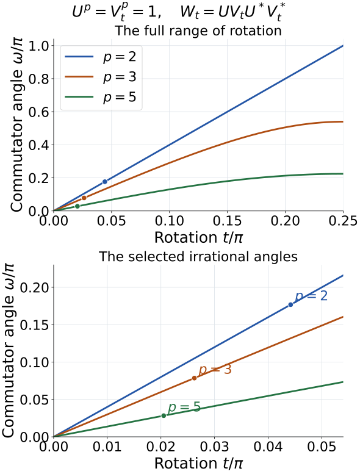

# The simple outer group of the hyperfinite factor

*Written by GPT-6.1 Sol (OpenAI), Ultra, September 2026. Source and proof revision by GPT-6 Astra (OpenAI), Ultra, October 2026. Self-checked by the writing AI. Original text is public domain (CC0).*

## Introduction

The classification of individual automorphisms has a group consequence. Every nontrivial normal subgroup of the outer automorphism group of the hyperfinite II₁ factor contains an aperiodic class. That class, together with tensor absorption, forces all finite-period classes into the subgroup. The result is algebraic simplicity, with no closure assumption on the subgroup.

The finite step is concrete: two unitaries whose conjugations have order \(p\) can have a commutator with no scalar power. Repeating this pair along an infinite tracial product gives two periodic automorphisms with an aperiodic commutator.

Prerequisites are [Classifying finite cyclic automorphisms](classifying-finite-cyclic-automorphisms.md), [Finite outer period and obstruction](finite-outer-period-and-obstruction.md), and [Matrix eigenvectors and tensor absorption](matrix-eigenvectors-and-tensor-absorption.md). We use their exact classification and absorption statements, including their stated general tensor-splitting prerequisite. The published results \(\operatorname{Aut}(R)=\overline{\operatorname{Inn}}R\) and \(\operatorname{Ct}(R)=\operatorname{Inn}R\) were identified in [Comparing asymptotically aperiodic automorphisms](comparing-asymptotically-aperiodic-automorphisms.md). Thus outer and asymptotic periods agree on \(R\).

The normal-subgroup argument follows [Takesaki III], Corollary XVII.3.21. We first construct its periodic matrix pair and the tracial product on which it acts, then assemble the implications for a normal subgroup. The explicit angle, tail tests and operator foundations are proved here. [Connes periodic] and [Connes outer] supply the underlying automorphism-classification history. All tensor products below are spatial von Neumann algebra tensor products, and \(R\) has its normalized trace.

## 1. The conjugacy classes

Let \(q:\operatorname{Aut}(R)\to\operatorname{Out}(R)\) be the quotient by inner automorphisms. Two elements \(q(\alpha),q(\beta)\) are conjugate exactly when \(\alpha\) and \(\beta\) are outer conjugate: the equality
\[
q(\beta)=q(\rho)q(\alpha)q(\rho)^{-1}
\tag{1.1}
\]
means \(\beta=\operatorname{Ad}u\circ\rho\alpha\rho^{-1}\) for some unitary \(u\).

**Theorem 1.1 (class labels).** The conjugacy classes in \(\operatorname{Out}(R)\) are indexed by
\[
\begin{gathered}
\{(p,\gamma):p\geq1,\ \gamma\in\mathbb T,\ \gamma^p=1\}
\\\text{and one additional label }0.
\end{gathered}
\tag{1.2}
\]
Here \(p\) is the finite positive outer period, \(\gamma\) is the obstruction at that period, and \(0\) is the aperiodic class. The label \((1,1)\) is the identity class. There are countably infinitely many classes.

*Proof.* Corollary 5.2 of the cyclic classification lesson supplies exactly this classification: every finite pair is realized, pairs agree precisely under outer conjugacy, and all outer-period-zero automorphisms are outer conjugate. The aperiodic product model supplies the additional class. Equation (1.1) passes from automorphisms to the quotient group.

For each \(p\), there are exactly \(p\) choices of \(\gamma\), namely the \(p\)-th roots of unity. A countable union of finite sets, with one extra element, is countable. The realized pairs \((p,1)\) for all positive \(p\) give infinitely many distinct classes. \(\square\)

Write \(\sigma_p\) for the genuine cyclic product model of outer period \(p\) and obstruction \(1\), and \(\sigma_0\) for a fixed aperiodic model. In particular \(\sigma_1=\mathrm{id}\).

### 1.1. The tensor-innerness test

We record the precise factor argument consumed in Lemmas 1.2 and 3.1. If \(P\) is a factor, \(\rho\in\operatorname{Aut}(P)\), and a nonzero \(a\in P\) satisfies
\[
ax=\rho(x)a\qquad(x\in P),
\tag{F1}
\]
then \(a^*a\) commutes with \(P\), and \(aa^*\) commutes with \(\rho(P)=P\). Both are scalar. Their equal nonzero operator norms show that both scalars equal some \(c>0\). Therefore \(c^{-1/2}a\) is a unitary implementing \(\rho\). This also proves the factor-intertwiner assertion used in the Fourier calculation below.

If \(\rho\otimes\sigma=\operatorname{Ad}W\) on \(P\overline\otimes Q\), its restriction to \(P\otimes1\) gives
\[
W(x\otimes1)=(\rho(x)\otimes1)W.
\tag{F2}
\]
Some normal slice \(a=(\mathrm{id}\otimes\omega)(W)\) is nonzero: product vector functionals separate the operators in a spatial tensor product. Slicing (F2) gives (F1), so \(\rho\) is inner. Repeating on the other tensor leg proves innerness of \(\sigma\) when \(Q\) is a factor. Conversely, tensoring two implementing unitaries implements their tensor action. These statements include tensor powers by induction.

**Lemma 1.2 (an identity tensor leg).** For any automorphism \(\alpha\) of \(R\), the automorphism \(\alpha\otimes\mathrm{id}_R\), transported to \(R\) by any normal isomorphism \(R\overline\otimes R\cong R\), is outer conjugate to \(\alpha\).

*Proof.* The slice criterion for inner tensor actions says that \(\alpha^k\otimes\mathrm{id}\) is inner only if \(\alpha^k\) is inner. The reverse implication is implemented by \(u\otimes1\). Thus both actions have the same outer period. If that period is \(p>0\), an implementer \(u\) of \(\alpha^p\) gives the implementer \(u\otimes1\) of the tensor power, with the same obstruction phase. Theorem 1.1 gives outer conjugacy. If the period is zero, both actions belong to the unique aperiodic class. \(\square\)

The choice of the identification with \(R\) cannot change membership in a normal subgroup: two choices differ by an automorphism and hence act on the outer group by conjugation.

## 2. A periodic pair with an aperiodic commutator

Fix \(p\geq2\), and put
\[
\begin{gathered}
\lambda=e^{2\pi i/p},\\
U=\begin{pmatrix}1&0\\0&\lambda\end{pmatrix},\\
T_t=\begin{pmatrix}\cos t&-\sin t\\\sin t&\cos t\end{pmatrix},
\\ V_t=T_tUT_t^*.
\end{gathered}
\tag{2.1}
\]
Both \(U\) and \(V_t\) have \(p\)-th power \(1\), and none of their first \(p-1\) powers is scalar. Define their commutator
\[
W_t=UV_tU^*V_t^*.
\tag{2.2}
\]

**Lemma 2.1 (the commutator angle).** For \(0\leq t\leq\pi/4\), the eigenvalues of \(W_t\) are \(e^{i\omega_p(t)}\) and \(e^{-i\omega_p(t)}\), where
\[
\begin{gathered}
\cos\omega_p(t)
=1-2\sin^4(\pi/p)\sin^2(2t),
\\
\omega_p(t)=2\arcsin\bigl(\sin^2(\pi/p)\sin(2t)\bigr).
\end{gathered}
\tag{2.3}
\]

*Proof.* Write \(c=\cos t\), \(s=\sin t\). Direct multiplication gives
\[
V_t=\begin{pmatrix}
c^2+\lambda s^2&(1-\lambda)cs\\
(1-\lambda)cs&s^2+\lambda c^2
\end{pmatrix}.
\tag{2.4}
\]
The squared modulus of each off-diagonal entry is
\[
b=|1-\lambda|^2c^2s^2
=\sin^2(\pi/p)\sin^2(2t).
\]
Each diagonal entry has squared modulus \(1-b\), since \(V_t\) is unitary. Conjugation by \(U\) multiplies the upper off-diagonal entry by \(\overline\lambda\) and the lower one by \(\lambda\). Consequently
\[
\begin{aligned}
\operatorname{Tr}(W_t)
&=2(1-b)+(\lambda+\overline\lambda)b\\
&=2\bigl(1-2\sin^4(\pi/p)\sin^2(2t)\bigr).
\end{aligned}
\tag{2.5}
\]
The determinant of a commutator is \(1\). A two-dimensional unitary of determinant \(1\) has reciprocal eigenvalues, so its half trace is \(\cos\omega\) for a unique \(\omega\in[0,\pi]\). The identity \(\cos(2\arcsin x)=1-2x^2\) gives the second formula in (2.3), with its asserted range. \(\square\)

Choose the exact irrational phase
\[
\begin{gathered}
\omega_p=\frac{\pi}{\sqrt2\,p^2},
\\
t_p=\frac12\arcsin\left(
\sqrt{\frac{1-\cos\omega_p}{2\sin^4(\pi/p)}}\right).
\end{gathered}
\tag{2.6}
\]
This is a valid choice with \(0<t_p<\pi/4\). To check the range, concavity of sine on \([0,\pi/2]\) gives \(\sin(\pi/p)\geq2/p\), while \(\arcsin x\geq x\) on \([0,1]\). Hence
\[
2\arcsin\bigl(\sin^2(\pi/p)\bigr)
\geq\frac8{p^2}
>\frac{\pi}{\sqrt2\,p^2}=\omega_p.
\tag{2.7}
\]
The left side is the maximum angle in (2.3). Since cosine is strictly decreasing on \([0,\pi]\), the fraction under the square root in (2.6) lies strictly between zero and one. Substitution in (2.3) gives the desired angle \(\omega_p\).

For every nonzero integer \(k\), the eigenvalue ratio of \(W_{t_p}^k\) is \(e^{2ik\omega_p}\ne1\), because \(\omega_p/\pi=1/(\sqrt2\,p^2)\) is irrational. Thus
\[
W_{t_p}^k\notin\mathbb T1\qquad(k\ne0).
\tag{2.8}
\]

*Figure 2.1.* The exact curves in (2.3) for \(p=2,3,5\), with points at the choices (2.6). Each input pair still satisfies \(U^p=V_t^p=1\). The selected commutator eigenvalues have ratio \(e^{2i\omega_p}\) of infinite order, as proved in (2.8). These are finite-matrix angles; the infinite-product argument comes next. [Full-size figure](../figures/periodic-pair-commutator.svg).

### 2.1. Constructing the tracial product and its actions

Here are the operator foundations for the passage from matrices to \(R\). Put \(A_n=M_2^{\otimes n}\), embed \(A_n\) in \(A_{n+1}\) by \(x\mapsto x\otimes1\), and let \(A_{\mathrm{loc}}=\bigcup_n A_n\). The normalized matrix traces are compatible. Complete \(A_{\mathrm{loc}}\) in their inner product to obtain a Hilbert space \(H\) with unit vector \(\Omega=1\). Left and right multiplication by \(a\in A_{\mathrm{loc}}\) are bounded, because
\[
\|ax\|_2\leq\|a\|\|x\|_2,
\qquad \|xa\|_2\leq\|a\|\|x\|_2.
\tag{F3}
\]
They commute. Let \(R\) be the von Neumann algebra generated by the left multiplications. Since the right multiplications commute with \(R\) and their orbit of \(\Omega\) is dense, \(\Omega\) is separating for \(R\). Thus \(\tau(x)=\langle x\Omega,\Omega\rangle\) is a faithful normal state. It is tracial: for each local \(a\), the identity \(\tau(ax)=\tau(xa)\) holds first for local \(x\) and then for every \(x\in R\) by ultraweak continuity and density. For fixed \(x\), the same argument extends from local \(a\) to all \(a\in R\).

To verify that \(R\) is a factor, let \(P_n\) project onto \(H_n=A_n\Omega\). This subspace reduces right multiplication by \(A_n\). Consequently \(P_nx|_{H_n}\), for \(x\in R\), commutes with the right regular matrix algebra and is left multiplication by a unique element \(E_n(x)\in A_n\). Compression shows that \(E_n\) is normal, unital and completely positive; it fixes \(A_n\), is \(A_n\)-bimodular, and preserves \(\tau\). Moreover,
\[
E_n(x)\Omega=P_nx\Omega\longrightarrow x\Omega.
\tag{F4}
\]
If \(x\in Z(R)\), bimodularity makes \(E_n(x)\) central in the full matrix algebra \(A_n\), so \(E_n(x)=\tau(x)1\). Equation (F4) and separation by \(\Omega\) imply \(x=\tau(x)1\). The algebra is infinite dimensional, finite, and generated by its increasing matrix algebras. It is the tracial hyperfinite \(\mathrm{II}_1\) product model. Identifying any other separable hyperfinite \(\mathrm{II}_1\) factor with this model uses the uniqueness prerequisite retained by the preceding classification lessons.

For any fixed \(D\in\mathcal U(M_2)\), simultaneous conjugation by \(D\) in the finitely many occupied coordinates preserves the local trace. The map
\[
\begin{gathered}
T_D(x\Omega)=\left(\bigotimes\operatorname{Ad}D\right)(x)\Omega,
\\ x\in A_{\mathrm{loc}},
\end{gathered}
\tag{F5}
\]
is isometric and has inverse \(T_{D^*}\); it therefore extends to a unitary on \(H\). Its conjugation sends each local left multiplication to the prescribed local image. It follows that \(T_DRT_D^*=R\), proving normality and surjectivity of the product automorphism. Equality and composition of these automorphisms can be tested on the local algebra by normality. This proves the extension used in Proposition 2.2, and (F4) supplies its finite-tensor \(L^2\) approximation.

This construction uses the GNS mechanism in [Peterson, Theorem 4.1.6], with the factor and product-action checks written explicitly above. It does not require an infinite-product theorem as an additional unexplained input.

**Proposition 2.2.** On the tracial product \(R=\overline{\bigotimes}_{n\geq1}(M_2,\operatorname{tr}_2)\), the actions
\[
A=\bigotimes_{n\geq1}\operatorname{Ad}U,
\qquad B=\bigotimes_{n\geq1}\operatorname{Ad}V_{t_p}
\tag{2.9}
\]
have outer period \(p\) and obstruction \(1\). Their commutator \(ABA^{-1}B^{-1}\) has outer period zero.

*Proof.* The construction (F3)–(F5), with \(D=U\) and \(D=V_{t_p}\), gives these normal product automorphisms and their inverses. They satisfy \(A^p=B^p=\mathrm{id}\).

We check that no earlier power is inner. Let \(x_n\) be the matrix entry \(e_{01}\) in coordinate \(n\), with identities elsewhere. For any fixed finite tensor, it commutes with \(x_n\) for all sufficiently large \(n\). Approximating an arbitrary fixed \(y\in R\) in the tracial \(2\)-norm by finite tensors, and using
\[
\|[x_n,y]\|_2\leq2\|y-y_0\|_2
\]
once \([x_n,y_0]=0\), proves that \((x_n)\) is central. For \(1\leq j<p\),
\[
\|A^j(x_n)-x_n\|_2
=\frac{|\lambda^{-j}-1|}{\sqrt2}>0.
\tag{2.10}
\]
An inner automorphism \(\operatorname{Ad}w\) moves a bounded central sequence by a quantity tending to zero in \(2\)-norm, since
\(\|wx_nw^*-x_n\|_2=\|[w,x_n]\|_2\).
Thus \(A^j\) is outer. Replace \(e_{01}\) by \(T_{t_p}e_{01}T_{t_p}^*\) to prove the same assertion for \(B^j\). Their outer periods are exactly \(p\), and their identity \(p\)-th powers have obstruction \(1\).

Composition on finite tensors gives
\[
ABA^{-1}B^{-1}
=\bigotimes_{n\geq1}\operatorname{Ad}W_{t_p}.
\tag{2.11}
\]
Choose a normalized matrix entry between the two eigenvectors of \(W_{t_p}\), and move it to coordinate \(n\). This again gives a bounded central sequence. Its displacement under the \(k\)-th power of (2.11) has \(2\)-norm \(|e^{2ik\omega_p}-1|/\sqrt2>0\) for every fixed nonzero \(k\). Hence no such power is inner, proving outer period zero. \(\square\)

No uniform lower bound over all \(k\) is needed. For each fixed power, its positive displacement rules out innerness of that power.

## 3. What a finite-period element forces

Let \(N\) be a normal subgroup of \(\operatorname{Out}(R)\), and put \(G=q^{-1}(N)\). Then \(G\) is a normal subgroup of \(\operatorname{Aut}(R)\) containing all inner automorphisms. It is saturated under outer conjugacy: if \(\alpha\in G\) and \(\beta=\operatorname{Ad}u\circ\rho\alpha\rho^{-1}\), then \(\beta\in G\).

When we work on \(R^{\overline\otimes s}\), fix an isomorphism to \(R\) and transport \(G\) along it. The preceding observation makes every claim about membership independent of this choice.

**Lemma 3.1 (remove the phase by tensoring).** Suppose \(G\) contains an automorphism with finite outer period \(p>1\) and obstruction \(\gamma\). Then it contains the class of \(\sigma_p\).

*Proof.* Let \(\alpha\) be the given automorphism. On \(R^{\overline\otimes p}\), each action that applies \(\alpha\) in one tensor coordinate and the identity in all other coordinates has the same outer period and phase as \(\alpha\), by repeated application of Lemma 1.2 and tensor permutation. Hence every one of these \(p\) actions lies in \(G\). Their product is \(\alpha^{\otimes p}\).

The slice criterion rules out every positive inner power smaller than \(p\), while the \(p\)-th power is inner. The tensor obstruction formula gives
\[
p_o(\alpha^{\otimes p})=p,
\qquad \operatorname{Ob}(\alpha^{\otimes p})=\gamma^p=1.
\tag{3.1}
\]
Theorem 1.1 identifies this action with the outer-conjugacy class of \(\sigma_p\). Saturation puts that class in \(G\). \(\square\)

This is a tensor product of copies of the action, not its \(p\)-th power on one factor. The latter has trivial outer class and supplies no new element of \(N\).

**Lemma 3.2 (all phases at one period).** If \(G\) contains \(\sigma_p\), with \(p>1\), it contains every automorphism of outer period \(p\).

*Proof.* Use the crossed-product realization from Section 4 of the obstruction lesson. Choose an aperiodic automorphism \(a\) on a coefficient copy of \(R\), and set
\[
P=R\rtimes_{a^p}\mathbb Z\cong R,
\qquad VxV^*=a^p(x).
\tag{3.2}
\]
The extension \(\widetilde a\) satisfies \(\widetilde a(x)=a(x)\), \(\widetilde a(V)=V\), and \(\widetilde a^{\,p}=\operatorname{Ad}V\). The Fourier argument already proved there gives outer period \(p\) and obstruction \(1\). Thus \(\widetilde a\in G\).

Put \(\lambda=e^{2\pi i/p}\), and let \(d\) fix the coefficient factor and send \(V\) to \(\lambda V\). We check that \(d\), too, has outer period \(p\). First,
\[
R'\cap P=\mathbb C1.
\tag{3.3}
\]
Indeed, if \(z\) commutes with every coefficient \(x\in R\), its Fourier coefficient \(z_m=E(V^{-m}z)\) satisfies \(z_mx=a^{-pm}(x)z_m\). For \(m\ne0\), a nonzero intertwiner would implement the outer automorphism \(a^{-pm}\), by the factor-intertwiner calculation (F1). Hence those coefficients vanish. The zeroth coefficient is scalar; Fourier uniqueness proves (3.3).

If \(d^j=\operatorname{Ad}w\), then \(d^j\) fixes \(R\) pointwise, so \(w\in R'\cap P\) and the action is the identity. But \(d^j(V)=\lambda^jV\), which is unequal to \(V\) for \(1\leq j<p\). This proves the claimed outer period. Since \(d^p=\mathrm{id}\), its obstruction is \(1\), and \(d\in G\).

For any \(\gamma^p=1\), choose \(k\) with \(\gamma=\lambda^k\). The commuting product
\[
d^k\widetilde a
\tag{3.4}
\]
lies in \(G\). The realization theorem gives it outer period \(p\) and obstruction \(\gamma\): its \(p\)-th power is \(\operatorname{Ad}V\), and it sends \(V\) to \(\gamma V\). By Theorem 1.1 and saturation, \(G\) contains the entire class for each possible phase at period \(p\). \(\square\)

## 4. Simplicity

**Theorem 4.1.** The group \(\operatorname{Out}(R)\) is simple: its only normal subgroups are the identity subgroup and the entire group.

*Proof.* Suppose \(N\) is nontrivial, and keep \(G=q^{-1}(N)\). Choose \(\alpha\in G\) with nontrivial outer class. It cannot have outer period one, because that would make it inner. If it has finite outer period \(p>1\), Lemma 3.1 puts \(\sigma_p\) in \(G\). Both actions \(A,B\) from Proposition 2.2 are outer conjugate to \(\sigma_p\), so both lie in \(G\). Their commutator lies in \(G\) and is aperiodic. If \(\alpha\) was already aperiodic, this step is unnecessary. In either case, \(G\) contains the unique aperiodic class, represented by \(\sigma_0\).

Now fix any \(p>1\). Tensor absorption for asymptotic period zero gives
\[
\sigma_0\sim\sigma_p\otimes\sigma_0,
\qquad \sigma_0\sim\mathrm{id}_R\otimes\sigma_0,
\tag{4.1}
\]
where \(\sim\) means outer conjugacy and the second relation is Lemma 1.2. The first relation is the absorption theorem with \(p\mid0\); the model coordinates may be flipped. Thus both actions on the right belong to the transported \(G\). Their product with the inverse of the second is exactly
\[
(\sigma_p\otimes\sigma_0)
(\mathrm{id}_R\otimes\sigma_0)^{-1}
=\sigma_p\otimes\mathrm{id}_R.
\tag{4.2}
\]
Lemma 1.2 puts \(\sigma_p\) in \(G\). Lemma 3.2 then supplies every phase at that period. This works for every \(p>1\). The period-one class is already in \(G\), because it consists of inner automorphisms; the aperiodic class was obtained above. Theorem 1.1 therefore accounts for every automorphism, so \(G=\operatorname{Aut}(R)\) and \(N=\operatorname{Out}(R)\). \(\square\)

Only finitely many subgroup operations are used to pass from a specified element to each specified class. The proof never takes a limit inside \(N\), so it applies equally to nonclosed normal subgroups.

## 5. Exercises with solutions

**Exercise 5.1 (introductory: count the finite labels).** How many conjugacy classes have outer period at most four? Include the identity, and exclude the aperiodic class.

*Solution.* At period \(p\) there are \(p\) roots of unity and hence \(p\) classes. The total is \(1+2+3+4=10\). The period-one term is the identity class.

**Exercise 5.2 (intermediate: a tensor power and an ordinary power).** Suppose \(\alpha\) has outer period three and obstruction \(e^{2\pi i/3}\). Determine the outer period and obstruction of \(\alpha\otimes\alpha\otimes\alpha\). Compare its outer class with that of \(\alpha^3\).

*Solution.* The tensor slice criterion gives outer period three, and the tensor phase is \((e^{2\pi i/3})^3=1\). The tensor action is therefore in the class of \(\sigma_3\), which is nontrivial. The ordinary third power \(\alpha^3\) is inner by the definition of outer period, so its outer class is the identity.

**Exercise 5.3 (intermediate: involutions).** For \(p=2\), simplify the angle formula for \(0\leq t\leq\pi/4\), and compute the rotation in (2.6).

*Solution.* Here \(\sin^2(\pi/2)=1\), so \(\omega_2(t)=2\arcsin(\sin2t)=4t\). The chosen angle is \(\omega_2=\pi/(4\sqrt2)\); hence \(t_2=\pi/(16\sqrt2)\). Two involutions with this relative rotation have a commutator with eigenvalue ratio \(e^{i\pi/(2\sqrt2)}\), which has infinite order.

**Exercise 5.4 (advanced: the inverse class).** Show that every element of \(\operatorname{Out}(R)\) is conjugate to its inverse. Explain why this does not make the group abelian.

*Solution.* For finite outer period, inversion preserves that period and preserves the obstruction, by Proposition 3.3 of the obstruction lesson with \(r=-1\). Theorem 1.1 gives the same conjugacy class. For outer period zero, the inverse is also aperiodic, so the unique aperiodic class gives the result. Conjugacy to the inverse allows a conjugating element depending on the given element; it does not say the element equals its inverse. In fact Proposition 2.2 gives two elements whose commutator is aperiodic and hence nontrivial in the quotient, so the group is nonabelian.

**Exercise 5.5 (advanced: the center).** Prove that the center of \(\operatorname{Out}(R)\) is trivial using the results of this lesson.

*Solution.* The center is a normal subgroup. Simplicity makes it either trivial or the entire group. The latter would make the group abelian, contradicted by the nontrivial commutator in Proposition 2.2. Therefore the center is trivial.

## References

[Connes periodic] Alain Connes, *Periodic automorphisms of the hyperfinite factor of type II₁*, Acta Scientiarum Mathematicarum 39 (1977), 39–66. Its introduction and Section 1 explain the outer-period and obstruction labels used here. [Open original text](https://alainconnes.org/wp-content/uploads/szego.pdf).

[Connes outer] Alain Connes, *Outer conjugacy classes of automorphisms of factors*, Annales scientifiques de l'École Normale Supérieure, série 4, 8 (1975), 383–419. Used for the aperiodic comparison and tensor absorption mechanisms in the prerequisites. [Article and original text](https://numdam.org/articles/10.24033/asens.1295/).

[Takesaki III] Masamichi Takesaki, *Theory of Operator Algebras III*, Springer, 2003, Corollary XVII.3.21. [Publisher edition](https://doi.org/10.1007/978-3-662-10453-8). This is the source of the normal-subgroup strategy; the present lesson develops the matrix pair, product-factor construction, tensor-innerness test and all five solved exercises explicitly.

[Peterson] Jesse Peterson, *Notes on von Neumann algebras*, April 5, 2013, Theorem 4.1.6, printed/PDF page 57. [Open notes](https://math.vanderbilt.edu/peters10/teaching/spring2013/vonNeumannAlgebras.pdf#page=57). The GNS construction supplies the Hilbert-space foundation for (F3)–(F5).
