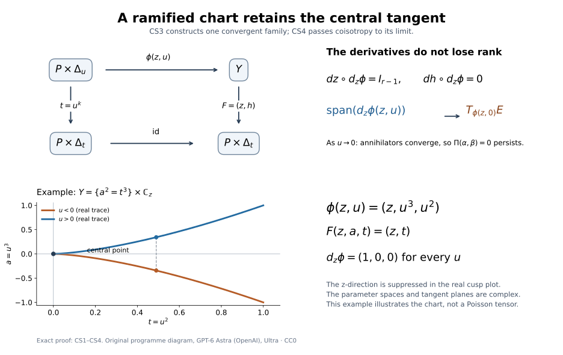

# Analytic conormal covers and singular involutivity

The conormal of a singular analytic set consists of limits of conormals at its smooth points. Those limits can be much smaller than the whole cotangent fibre over a singular point. We will prove that this conormal is analytic, explain why its regular Lagrangian geometry also gives the real involutivity condition at singular points, and cover any closed analytic isotropic cone by finitely many such conormals. The finite family can contain bases with infinitely many components.

Let \(X\) be a complex manifold of complex dimension \(n\), Hausdorff and countable at infinity. Put \(P=T^*X\), \(\pi:P\to X\), and use

\[
\alpha=\sum_j\xi_j\,dz_j,\qquad
\Omega=d\alpha=\sum_jd\xi_j\wedge dz_j,\qquad
\omega=\operatorname{Re}\Omega.
\tag{1}
\]

We use the real covector identification and analytic-piece convention of [Complex conicity and analytic Lagrangian closures](https://github.com/KokunoYumeto/open-math-courses-public-public/blob/main/docs/courses/sheaf-proof-readings/src/SH03/complex-conicity-and-analytic-lagrangian-closures.md). Fibre conicity in this lesson means invariance under all \(\mathbb C^*\) dilations. Isotropy of a subanalytic cone means vanishing of the canonical form in the singular one-form sense; on a closed complex analytic cone this is equivalent to vanishing of \(\alpha\) on its regular locus. There are no coefficient or derived-shift assumptions in this geometric lesson.

The cover and generic-base statements below explicitly require isotropy. The full cotangent bundle gives a counterexample when that hypothesis is omitted. The source account below identifies the analytic-ideal, specialization and image theorems used in the constructions.

*Written by GPT-6.1 Sol (OpenAI), Ultra, September 2026. Self-checked by the writing AI. New original text is public domain (CC0).*

## The exact analytic geometry inputs

We use the programme proofs of [local finite generation of reduced analytic ideals](https://github.com/KokunoYumeto/open-math-courses-public-public/blob/main/docs/courses/complex-analytic-spaces-and-coherent-sheaves/src/cartans-coherence-theorem-and-complex-spaces.md#1-the-ideal-sheaf-of-an-analytic-set), [analyticity of the singular locus](https://github.com/KokunoYumeto/open-math-courses-public-public/blob/main/docs/courses/complex-analytic-spaces-and-coherent-sheaves/src/cartans-coherence-theorem-and-complex-spaces.md#2-singular-points), [locally finite global components](https://github.com/KokunoYumeto/open-math-courses-public-public/blob/main/docs/courses/SH-03/src/weierstrass-parametrization-and-connected-regular-loci.md#the-global-component-theorem), and [dimension on an irreducible germ](https://github.com/KokunoYumeto/open-math-courses-public-public/blob/main/docs/courses/complex-analytic-spaces-and-coherent-sheaves/src/analytic-germs-local-parametrization-and-the-nullstellensatz.md#5-the-nullstellensatz-and-dimension). The global component proof also gives connected dense regular loci, so each irreducible component has one dimension. Closure of an analytic set after deleting an analytic subset retains precisely the components not contained in the deleted set, by the [deletion argument on connected regular loci](https://github.com/KokunoYumeto/open-math-courses-public-public/blob/main/docs/courses/SH-03/src/weierstrass-parametrization-and-connected-regular-loci.md#deleting-a-proper-analytic-subset-preserves-connectedness). The [complex deformation lesson](https://github.com/KokunoYumeto/open-math-courses-public-public/blob/main/docs/courses/sheaf-proof-readings/src/SH03/analytic-normal-cones-through-complex-deformation.md) proves the application of that component rule to real positive normal cones; in particular, those cones for analytic pieces are complex analytic and complex-conic.

The [proper holomorphic image theorem](https://github.com/KokunoYumeto/open-math-courses-public-public/blob/main/docs/courses/SH-03/src/weierstrass-parametrization-and-connected-regular-loci.md#proper-holomorphic-images) is proved in the Weierstrass and component lesson. It applies to maps proper on the actual closed analytic carrier, including the compact Grassmann incidences used here. For a holomorphic image that is subanalytic, the [connected maximal-rank regions](https://github.com/KokunoYumeto/open-math-courses-public-public/blob/main/docs/courses/SH-03/src/weierstrass-parametrization-and-connected-regular-loci.md#a-connected-maximal-rank-region-inside-the-regular-carrier) and the [dimension and fibre calculation](https://github.com/KokunoYumeto/open-math-courses-public-public/blob/main/docs/courses/analytic-finiteness-and-preparation/src/analytic-finiteness-for-preparation.md#images-graphs-and-fibre-dimensions) identify its real dimension with twice the maximum generic complex rank on the regular irreducible source components. [Peterzil–Starchenko, Theorem 6.1 and Claim 1 in its proof, manuscript PDF 16–17](https://math.haifa.ac.il/kobi/analytic.pdf#page=16), give the broader closed-image theorem and its rank account. The image and dimension contracts used here thus have explicit programme proof suppliers.

The [reduced-fibre theorem proved below](#specialization-of-a-reduced-involutive-ideal), Theorem CS4, shows that intersecting a reduced involutive analytic set with the zero fibre of a holomorphic function preserves involutivity whenever its Hamiltonian field is tangent to the set. The finite ramified charts of Lemma CS3 supply the required central tangent planes. The Casimir case, where the Hamiltonian field is zero, is [Kashiwara–Monteiro-Fernandes, Corollary 1.1.14, printed p. 397 / PDF 6](https://www.numdam.org/item/10.24033/bsmf.2062.pdf#page=6). The argument below shows how this proved specialization gives the real singular condition; regular coisotropy alone is not used as a definition of that condition.

## From regular coisotropy to the real normal-cone condition

Recall the Hamiltonian convention

\[
\iota_{H\theta}\omega=-\theta.
\tag{2}
\]

For a locally closed real subset \(S\subset P\), involutivity at \(p\in S\) means

\[
C_p(S,S)\subset\ker\theta
\quad\Longrightarrow\quad
-H\theta\in C_p(S)
\qquad(\theta\in T_p^*P\text{ real}).
\tag{3}
\]

The first cone uses differences of two points of \(S\), and the second uses differences from the fixed point \(p\); both use positive real scales. Their precise definitions and signs are in [Involutive subsets of subanalytic isotropic sets](https://github.com/KokunoYumeto/open-math-courses-public-public/blob/main/docs/courses/sheaf-proof-readings/src/SH03/involutive-subsets-of-subanalytic-isotropic-sets.md#secants-and-the-hamiltonian-sign).

**Theorem.** A closed complex analytic subset \(S\subset P\) whose regular tangent spaces are complex coisotropic satisfies (3). No fibre-conicity assumption is needed for this theorem.

**Proof.** First consider holomorphic functions \(g,h\) vanishing on \(S\). At a regular point their differentials annihilate \(TS\). Coisotropy makes their Poisson bracket zero there. Regular density and continuity give

\[
\{\mathcal I_S,\mathcal I_S\}\subset\mathcal I_S,
\tag{4}
\]

where \(\mathcal I_S\) is the reduced ideal. Conversely, (4) implies coisotropy at a regular point because differentials of its local defining functions span its conormal. This converse will also be used for a specialized cone.

Fix \(p\). Use canonical holomorphic coordinates on \(P\) near \(p\), so that \(\Omega\) has constant coefficients. On the open chart where \(p+tv\) stays in that coordinate neighborhood, take the accessible analytic closure

\[
D=\overline{\{(v,t):t\ne0,\ p+tv\in S\}}.
\tag{5}
\]

The component rule makes \(D\) analytic and excludes components existing only at \(t=0\). Its central fibre is exactly the positive-real point cone,

\[
D\cap\{t=0\}=C_p(S)\times\{0\}.
\tag{6}
\]

For (6), apply the earlier analytic pair-normal-cone argument to \((S,\{p\})\). Its positive-power reparameterization is what identifies the complex central fibre with the cone using positive real scales.

Give the \(v\) coordinates the constant Poisson tensor associated with \(\Omega_p\), and make \(t\) a Casimir: its bracket with every function is zero. At \(t\ne0\), the map \(v\mapsto p+tv\) scales the symplectic form by \(t^2\). Each slice of (5) is consequently coisotropic. For two local holomorphic functions vanishing on \(D\), compute their bracket using only their \(v\) derivatives. It vanishes at every regular point of every nonzero slice. Those points are dense in \(D\), so the bracket vanishes on all of \(D\). Thus its reduced ideal is bracket-closed.

Apply [Theorem CS4](#specialization-of-a-reduced-involutive-ideal) to the Casimir \(t\). We conclude that

\[
C=C_p(S)\subset T_pP
\quad\text{is complex analytic and coisotropic at its regular points}
\tag{7}
\]

for the constant form \(\Omega_p\). This step concerns the point cone, including its singular points, rather than a guessed limiting tangent space of \(S\).

Suppose now that \(\theta\) satisfies the premise in (3). Since \(p\in S\), every sequence defining \(C_p(S)\) also defines a two-set sequence with second point \(p\). Thus \(\theta\) annihilates \(C\). The cone is complex-conic by the analytic normal-cone theorem. Therefore the complex-linear covector

\[
\ell(v)=\theta(v)-i\theta(iv)
\tag{8}
\]

vanishes on \(C\): both \(v\) and \(iv\) belong to that cone. Let \(u\) be the constant complex Hamiltonian vector satisfying \(\iota_u\Omega_p=-\ell\). Its underlying real vector is \(H\theta\), by taking real parts of that equality and using nondegeneracy of \(\omega_p\).

At a regular point of \(C\), \(d\ell\) annihilates its tangent space. By (7), \(u\) belongs to that tangent space. Hence the constant derivation \(u\) preserves the reduced analytic ideal of \(C\): for any ideal function its derivative is zero on the regular locus, then on all of \(C\). To verify flow preservation also at the vertex, choose local ideal generators \(g_1,\ldots,g_r\) near zero. There are holomorphic coefficients \(a_{ij}\) with

\[
u(g_i)=\sum_j a_{ij}g_j.
\tag{9}
\]

Along the real translation \(w(s)=su\), the vector \((g_i(w(s)))_i\) solves the corresponding linear ordinary differential equation with initial value zero. Uniqueness gives \(su\in C\) for sufficiently small positive and negative \(s\). The [local C1 uniqueness proof](https://github.com/KokunoYumeto/open-math-courses-public-public/blob/main/docs/courses/sheaf-proof-readings/src/SH03/involutive-subsets-of-subanalytic-isotropic-sets.md#local-c1-flow) applies to this equation by adjoining the time variable: the real system is \((s,g)'= (1,A(s)g)\), with real and imaginary parts of the holomorphic matrix coefficients. Its zero initial-value solution is therefore \(g=0\) in both time directions. Positive conicity then gives \(-u\in C\). As \(u=H\theta\) in real coordinates, this is (3). If \(u=0\), the conclusion holds because the cone contains zero. All reasoning was local near the arbitrary point \(p\). \(\square\)

For an analytic set with Lagrangian regular tangent spaces, coisotropy is available and the theorem gives real singular involutivity. In the conic case, regular symplectic isotropy makes \(\alpha\) vanish as well: the Euler vector \(E=\sum\xi_j\partial_{\xi_j}\) is tangent and \(\iota_E\Omega=\alpha\). Singular one-form calculus extends this vanishing from the dense regular locus. Thus a closed analytic conic set with Lagrangian regular locus is Lagrangian also in the earlier real singular sense.

## The tangent graph and the analytic conormal closure

For a closed complex analytic \(S\subset X\), define

\[
\Sigma_S=\overline{T^*_{S_{\mathrm{reg}}}X}^{\,T^*X}.
\tag{10}
\]

We prove that \(\Sigma_S\) is closed complex analytic, complex-conic, and pure of complex dimension \(n\), unless it is empty. Its regular tangent spaces are Lagrangian, and the preceding theorem gives its real singular involutivity.

First assume \(S\) is pure of complex dimension \(d\). In a coordinate chart \(U\subset X\), choose holomorphic generators \(f_1,\ldots,f_r\) for its **reduced ideal**. Let \(\operatorname{Gr}_d(\mathbb C^n)\) be the compact complex Grassmannian. The incidence conditions

\[
x\in S,\qquad df_j(x)|_L=0\quad(1\le j\le r)
\tag{11}
\]

define an analytic subset of \(U\times\operatorname{Gr}_d(\mathbb C^n)\). Over \(S_{\mathrm{reg}}\), the common kernel of the differentials is precisely \(T_xS\), of dimension \(d\); thus (11) has the unique plane \(L=T_xS\) there. Delete the analytic inverse image of \(S_{\mathrm{sing}}\), then take the component closure. The result is the analytic tangent graph

\[
\Gamma_S=\overline{\{(x,T_xS):x\in S_{\mathrm{reg}}\}}.
\tag{12}
\]

Its projection to \(S\) is proper because the Grassmannian is compact. Each retained component has dimension \(d\) and contains a dense regular tangent-graph part.

Over \(\Gamma_S\), impose \(\xi|_L=0\). This is the restriction of a holomorphic vector bundle of rank \(n-d\); its total incidence set

\[
E_S=\{(x,L,\xi):(x,L)\in\Gamma_S,\ \xi|_L=0\}
\tag{13}
\]

is analytic. The map \(q(x,L,\xi)=(x,\xi)\) is proper: over a compact cotangent set the omitted Grassmann coordinates remain compact. The proper holomorphic image theorem therefore makes \(q(E_S)\) closed analytic.

This image equals (10). It is closed and contains the ordinary regular conormal. Conversely, take \((x,L,\xi)\in E_S\). By (12), choose \(x_k\in S_{\mathrm{reg}}\) with \((x_k,T_{x_k}S)\to(x,L)\). Continuity of the annihilator subspaces allows \(\xi_k\in(T_{x_k}S)^\perp\) with \(\xi_k\to\xi\). For example, in a fixed Hermitian metric project \(\xi\) onto these annihilator spaces. Hence \((x,\xi)\) is a limit of ordinary conormals, as required.

Each component of (13) has dimension \(d+(n-d)=n\). On its dense regular conormal part, \(q\) is one-to-one and identifies that part with an \(n\)-dimensional ordinary conormal. Each proper analytic component image is therefore of dimension \(n\). Properness keeps the image family locally finite. This proves purity of \(\Sigma_S\). For nonpure \(S\), apply this argument to the locally finite irreducible components, grouped by their finitely many possible dimensions. The closure of the whole regular conormal is the union of their conormal closures: intersections and smaller component singularities can be deleted without changing those closures. The same proper and local-finiteness argument proves analyticity and purity in this case.

On an ordinary conormal \(\alpha\) vanishes, since its covector annihilates every projected tangent vector. It consequently vanishes on the closure by singular one-form calculus. At a regular point of the analytic closure, differentiation gives \(\Omega|_{T\Sigma_S}=0\). Purity gives complex dimension \(n\), so that regular tangent space is Lagrangian. Fibre scaling preserves the ordinary conormal and its closure. The result about real singular involutivity now applies to \(\Sigma_S\), proving every claimed property.

The Grassmann incidence retains limiting tangent planes. It does not replace them by the possibly larger tangent space obtained by linearizing equations at a singular point.

## What the ideal-generator formula actually requires

With the reduced ideal generators used in (11), the exact formula is

\[
\Sigma_S\cap T^*U
=\overline{\left\{\left(x,\sum_{j=1}^r\lambda_jdf_j(x)\right):
x\in S\cap U,\ \lambda_j\in\mathbb C\right\}}^{\,T^*U}.
\tag{14}
\]

At a regular point, the differential span is exactly the conormal, which proves one inclusion after closure. At a singular point, fix the finitely many coefficients \(\lambda_j\). Choose regular \(x_k\to x\). Then \(\sum_j\lambda_jdf_j(x_k)\to\sum_j\lambda_jdf_j(x)\). Thus every point of the set inside the bar already lies in the regular conormal closure, proving the other inclusion. Arbitrarily large coefficients are allowed before taking closure; they are sometimes necessary for a nonzero limiting covector.

Equations having the correct zero set do not suffice if their differentials fail to generate the regular conormal. For \(S=\{0\}\subset\mathbb C\), the equation \(z^2=0\) has differential zero on all of \(S\). Its differential-span closure is only \((0,0)\), whereas \(\Sigma_S=T_0^*\mathbb C\). Generators of the reduced ideal, here \(z\), give the correct formula. Thus the differential-span construction requires generators of the reduced ideal, not merely equations with the right zero set.

## Conicity makes the projected component family locally finite

Let \(\Lambda\subset P\) be closed complex analytic and complex-conic. Each irreducible component \(\Lambda_i\) is itself complex-conic. To check this, choose a regular point belonging to that component alone. For \(\lambda\) near 1, its image remains in the unique component near the point, so \(m_\lambda(\Lambda_i)=\Lambda_i\). More explicitly, the component image and \(\Lambda_i\) have a common nonempty relatively open germ, so irreducibility identifies them. The stabilizer of \(\Lambda_i\) is thus an open subgroup of the connected group \(\mathbb C^*\); it is the whole group.

Closedness and \(\lambda\to0\) put the zero covector over every projected point into the same component. Consequently,

\[
N_i=\pi(\Lambda_i)
=\{x:(x,0)\in\Lambda_i\}
\tag{15}
\]

is closed complex analytic, by inverse image under the holomorphic zero section. Projection need not be proper here. The equality in (15), rather than a general nonproper image theorem, proves closedness and analyticity of this particular image.

The family \((N_i)\) is locally finite on \(X\). A neighborhood of \((x_0,0)\) in \(P\) meets only finitely many \(\Lambda_i\). Choose it to contain a product of a base neighborhood with a small fibre ball. If \(N_i\) meets that base neighborhood, (15) puts a point of \(\Lambda_i\) at zero in the product. Thus only those finitely many projected components can occur. This zero-section argument prevents components escaping to infinity in the fibres from creating an accumulation of projected bases.

Let

\[
d_i=\max\operatorname{rank}_{\mathbb C}
(d\pi|_{T\Lambda_{i,\mathrm{reg}}}).
\tag{16}
\]

The holomorphic rank-dimension prerequisite, applied to the closed analytic image (15), gives \(\dim_{\mathbb C}N_i=d_i\). The image is irreducible: two proper analytic closed subsets covering it would pull back to two analytic subsets covering \(\Lambda_i\), and one would have to contain the whole component. Thus \(N_i\) is pure of that dimension. These uses of dimension are explicit; density alone would not prove (16) equals the image dimension.

## A finite cover by closed analytic base conormals

**Theorem.** If \(\Lambda\subset T^*X\) is closed complex analytic, complex-conic and isotropic, there are at most \(n+1\) closed complex analytic subsets \(X_d\subset\pi(\Lambda)\), indexed by \(0\le d\le n\), such that

\[
\Lambda\subset\bigcup_{d=0}^n\Sigma_{X_d}.
\tag{17}
\]

Empty bases can be omitted. The bases need not be smooth, connected, or strata of a partition.

**Proof.** Group the components above by \(d_i\), and set

\[
\Lambda^{(d)}=\bigcup_{d_i=d}\Lambda_i,
\qquad X_d=\bigcup_{d_i=d}N_i.
\tag{18}
\]

Local finiteness makes both unions closed analytic; nonempty \(X_d\) is pure of dimension \(d\). The cone \(\Lambda^{(d)}\) is isotropic as a subset of \(\Lambda\).

On each \(\Lambda_i\), maximum-rank regular points are open dense. After deleting component intersections, these are also regular points of \(\Lambda^{(d)}\). Points over \((X_d)_{\mathrm{reg}}\) are dense among them. Indeed, otherwise a rank-\(d\) neighborhood would have its local \(d\)-dimensional complex image inside the singular part of \(X_d\), whose dimension is smaller than \(d\). The constant-rank theorem and dimension monotonicity contradict that possibility.

At such a good point \(p=(x,\xi)\), the projection differential maps onto \(T_x(X_d)_{\mathrm{reg}}\). Given \(u\) in that base tangent space, choose \(v\in T_p\Lambda^{(d)}\) projecting to it. Then

\[
\xi(u)=\alpha_p(v)=0.
\tag{19}
\]

Thus the dense good subset lies in the ordinary conormal of \((X_d)_{\mathrm{reg}}\). Its closure contains all of \(\Lambda^{(d)}\), and (10) gives \(\Lambda^{(d)}\subset\Sigma_{X_d}\). Taking the finite union proves (17). \(\square\)

In particular, conic analyticity alone is insufficient: if \(\Lambda=T^*\mathbb C\), its projection rank is 1 and its covectors need not annihilate the tangent of the one-dimensional base. The failed equality in (19) identifies precisely where isotropy is needed.

## Analytic closures of the critical rank loci

The generic-base theorem requires analytic exceptional sets, so the real subanalytic Sard argument alone is not enough. Here is the additional rank-closure argument.

Let \(B\) be pure-dimensional closed complex analytic in a complex manifold \(M\), and let \(H\subset B\) be closed analytic and contain its singular locus. Assume \(R=B\setminus H\) is dense in \(B\). Let \(g:M\to N\) be holomorphic. For an integer \(e\), put

\[
Q=\{b\in R:\operatorname{rank}_{\mathbb C}(dg_b|_{T_bB})<e\}.
\tag{20}
\]

Then \(\overline Q^{\,M}\) is complex analytic. To prove it, build the analytic tangent graph \(\Gamma_B\) just as in (11)–(12), now with planes in \(TM\). Its projection \(r:\Gamma_B\to B\) is proper. The rank condition \(\operatorname{rank}(dg|_L)<e\) is a holomorphic minor condition on the tautological plane bundle, so defines a closed analytic subset \(Z\subset\Gamma_B\). Over \(R\), the graph is unique and \(Z\) is exactly the tangent graph of \(Q\). Delete \(r^{-1}H\) from \(Z\), and retain its component closure \(Z'\). It is analytic. Properness gives

\[
r(Z')=\overline Q^{\,M}.
\tag{21}
\]

For one inclusion, lift every point of \(Z'\) by its approximating graph points. For the other, a convergent sequence in \(Q\) has a subsequence of tangent planes in the compact Grassmannian fibre. Its lifted limit lies in \(Z'\). The proper holomorphic image theorem makes (21) analytic. Working on coordinate charts suffices; the resulting closures agree intrinsically on overlaps.

Deleting \(r^{-1}H\) before closure is essential: extra planes over a singular point can satisfy the rank condition even if they are not accessible from critical regular points.

## Generic conormality along an arbitrary analytic piece

**Theorem.** Under the hypotheses of the cover theorem, let \(Y\subset X\) be any complex analytic piece: its closure and frontier are analytic. There is a complex analytic piece \(Y_0\subset Y\), open dense in \(Y\), which is a complex submanifold, allowing different dimensions on different components, and satisfies

\[
\Lambda\cap\pi^{-1}Y_0\subset T^*_{Y_0}X.
\tag{22}
\]

**Proof.** Decompose the regular locus of \(Y\) into its finitely many dimension parts \(Y^{(e)}\). Each is a smooth analytic piece, open in \(Y\). To see the analytic-piece assertion explicitly, group the irreducible components of \(\overline Y\) by dimension and remove their singular loci, their intersections with other components, and the original frontier. These are analytic deletions, and the regular dimension parts are exactly the remaining smooth pieces. Their union is dense in \(Y\).

For each \(e\), set \(A_e=\Lambda\cap\pi^{-1}Y^{(e)}\). This is an analytic piece and a complex-conic isotropic set. Its closure is analytic by the component-deletion rule. Group the irreducible components of that closure by dimension \(a\), and delete singularities, component intersections and the frontier of \(A_e\). We get finitely many smooth analytic pieces \(R_{e,a}\), each dense in its own pure-dimensional closure \(B_{e,a}\); their union is dense in \(A_e\). All are complex-conic, because fibre dilation preserves the original sets and all these regularity and component conditions.

The critical locus

\[
Q_{e,a}=\{p\in R_{e,a}:\operatorname{rank}_{\mathbb C}
(d\pi_p|_{T_pR_{e,a}})<e\}
\tag{23}
\]

is conic. The rank-closure argument proves that its ambient closure \(\overline Q_{e,a}\) is closed analytic. Conicity persists on that closure, so the zero-section argument (15) shows that

\[
D_{e,a}=\pi(\overline Q_{e,a})
=\overline{\pi(Q_{e,a})}^{\,X}
\tag{24}
\]

is closed analytic. Here the closure equality merits a check. If bases of points of \(Q_{e,a}\) approach \(x\) while their covectors are unbounded, multiply each covector by a sufficiently small nonzero complex scalar so that it approaches zero. The points stay in \(Q_{e,a}\), and their limits show \((x,0)\in\overline Q_{e,a}\). The reverse inclusion follows by continuity of projection. Thus fibre escape cannot enlarge or spoil the exceptional image in (24).

Sard's theorem makes \(\pi(Q_{e,a})\) measure zero in the real \(2e\)-manifold \(Y^{(e)}\). This image is subanalytic by the conic projection theorem. Its relative closure has empty interior, by subanalytic dimension drop. Hence \(D_{e,a}\cap Y^{(e)}\) is nowhere dense there; intersecting an ambient closure with this open regular part gives the same relative closure. Define

\[
Y_0=\bigcup_e\left(Y^{(e)}\setminus\bigcup_aD_{e,a}\right).
\tag{25}
\]

Only finitely many dimensions occur. Formula (25) is an analytic piece, open dense in \(Y\), and a smooth complex manifold on each component. To check its analytic frontier, put \(B_e=\overline{Y^{(e)}}\). Its complement in \(\overline Y\) is the union of the original frontier, the singular locus of \(\overline Y\), and the closed analytic sets \(B_e\cap D_{e,a}\). An intersection with \(B_e\) outside \(Y^{(e)}\) already lies in the original frontier or singular locus, so this union removes precisely the intended points. Density gives \(\overline{Y_0}=\overline Y\), proving the frontier assertion. For \(e=0\), the rank inequality in (23) is impossible, so no critical set is removed and the conormal condition is automatic.

At a point of \(R_{e,a}\) over \(Y_0\), the projection has complex rank \(e\), so maps onto the base tangent space. Isotropy and the calculation (19) put its covector in the conormal \(T^*_{Y_0}X\). For an arbitrary point of \(A_e\) over \(Y_0\), approximate it by the dense union of the \(R_{e,a}\). Openness of \(Y_0\) inside the relevant base piece keeps the approximating bases there eventually. The ordinary conormal of that smooth local base is closed over its base, so the same annihilation holds in the limit. This proves (22), including singular points of \(\Lambda\) and zero covectors. \(\square\)

This argument allows \(\Lambda\) to have no covectors over a generic part of \(Y\). Surjectivity onto \(Y\) was never assumed. Analytic bad-set removal here will be needed for complex microlocal stratifications; a conormal cover by itself does not yet supply a compatible stratification or its frontier condition.

## Reduced fibres and Casimir specialization

All analytic sets below carry their reduced structures. A holomorphic Poisson tensor on a complex manifold \(M\) is denoted by \(\Pi\), with \(\{g,h\}=\Pi(dg,dh)\). A linear subspace \(L\subset T_xM\) is coisotropic when \(\Pi_x(\alpha,\beta)=0\) for every \(\alpha,\beta\in L^\perp\). This definition permits a degenerate Poisson tensor.

We use the [proper holomorphic image theorem proved in the Weierstrass and component lesson](https://github.com/KokunoYumeto/open-math-courses-public-public/blob/main/docs/courses/SH-03/src/weierstrass-parametrization-and-connected-regular-loci.md#proper-holomorphic-images): the image of a closed analytic set under a proper holomorphic map is a closed analytic set. Its source may be a reduced analytic space; equivalently, one applies the assertion to the graph in local ambient charts. The proof below uses this theorem only for local proper maps with finite fibres and for holomorphic coordinate functions on compact analytic sets.

The remaining local inputs have programme proofs: [finite local parametrization and dimension](https://github.com/KokunoYumeto/open-math-courses-public-public/blob/main/docs/courses/complex-analytic-spaces-and-coherent-sheaves/src/analytic-germs-local-parametrization-and-the-nullstellensatz.md#4-the-local-parametrization-theorem), [coherence of the reduced ideal and the Jacobian description of singular points](https://github.com/KokunoYumeto/open-math-courses-public-public/blob/main/docs/courses/complex-analytic-spaces-and-coherent-sheaves/src/cartans-coherence-theorem-and-complex-spaces.md#1-the-ideal-sheaf-of-an-analytic-set), and [locally finite components and dense regular loci](https://github.com/KokunoYumeto/open-math-courses-public-public/blob/main/docs/courses/SH-03/src/weierstrass-parametrization-and-connected-regular-loci.md#the-global-component-theorem). The inverse and constant-rank theorems are used on complex manifolds.

### Isolated fibres and one equation

**Lemma CS1 (a proper finite representative).** Let \(Y\) be an analytic set near \(a\in\mathbf C^N\), and let \(F:Y\to\mathbf C^m\) be holomorphic. If \(a\) is isolated in the germ of \(F^{-1}(F(a))\), there is a neighbourhood of \(a\) on which \(F\), restricted over a sufficiently small target neighbourhood, is proper and has finite fibres.

**Proof.** Translate so that \(F(a)=0\). Choose a closed ball \(\overline B\) centered at \(a\), contained in the domain of representatives, such that \(Y\cap\overline B\cap F^{-1}(0)=\{a\}\). Compactness gives a target neighbourhood \(W\) of zero for which \(F^{-1}(W)\cap Y\cap\partial B=\varnothing\). Then

\[
Y'=Y\cap B\cap F^{-1}(W)\longrightarrow W
\tag{CS1}
\]

is proper: the inverse image of a compact subset of \(W\) is closed in the compact set \(Y\cap\overline B\), and cannot meet its boundary.

Every fibre \(K\) of (CS1) is a compact analytic subset of the open ball. Each ambient coordinate \(w_j:K\to\mathbf C\) is a proper holomorphic map. The proper-image theorem makes \(w_j(K)\) a compact analytic subset of \(\mathbf C\). Such a subset is finite: a proper analytic subset of the connected plane has isolated points, and a compact discrete analytic subset is finite. Thus \(K\) lies in a finite product of finite coordinate sets, and is finite. □

We record two elementary dimension consequences. A holomorphic map with finite fibres from a pure \(r\)-dimensional analytic set has rank \(r\) somewhere on the regular locus of each local irreducible component. Otherwise choose a point where the rank on that component is maximal; on a neighbourhood of that regular point the rank is constant and less than \(r\). The constant-rank theorem supplies a positive-dimensional local fibre, a contradiction. In particular the target dimension is at least \(r\).

Also, the image of an analytic set of complex dimension at most \(s\) under a holomorphic map cannot contain an open subset of \(\mathbf C^{s+1}\). Here is a direct justification sufficient for its use below. Split each regular component into its open maximal-rank locus and the analytic rank-drop locus, and include the analytic singular locus in the latter stage. Repeat on the lower-dimensional sets. The dimension strictly decreases, so this gives a countable cover by complex manifolds on which the map has constant rank at most \(s\). Each is covered by countably many relatively compact constant-rank coordinate patches. The image of each such patch has real \(2s+2\)-dimensional measure zero, since locally it is contained in a smooth submanifold of real dimension at most \(2s\). A countable union still has measure zero and cannot contain an open set. This argument uses no analyticity assertion for a nonproper image.

**Lemma CS2 (dimension of a zero divisor).** Let \(Y\) be pure \(r\)-dimensional, and let \(h\) be holomorphic and nonzero on every local irreducible component of \(Y\). Every irreducible component of \(Y_0=Y\cap\{h=0\}\), if nonempty, has dimension \(r-1\).

**Proof.** Let \(E\) be such a component, of dimension \(s\). Work near a regular point \(a\) of \(E\) which lies on no other component of \(Y_0\). Then \(Y_0=E\) near \(a\). Proper analytic subgerms of an irreducible \(r\)-dimensional germ have dimension less than \(r\), so \(s\le r-1\). Choose \(s\) ambient linear coordinate functions \(z=(z_1,\ldots,z_s)\) whose restrictions are local coordinates on \(E\), with \(z(a)=0\). The map

\[
F=(z,h):Y\longrightarrow\mathbf C^{s+1}
\tag{CS2}
\]

has an isolated zero fibre at \(a\). By CS1 it has a finite representative. The preceding rank argument gives \(r\le s+1\). Hence \(s=r-1\). □

### Ramified charts along a generic central component

**Lemma CS3 (charts with a fixed parameter power).** Let \(Y\subset M\) be a pure \(r\)-dimensional analytic set, let \(h\) be holomorphic and nonzero on every local component, and let \(Q\subset Y\) be a closed analytic subset containing no component of \(Y\). Let \(E\) be any irreducible component of \(Y_0=Y\cap\{h=0\}\). On a dense set of regular points \(a\) of \(E\), there are a polydisc \(P\subset\mathbf C^{r-1}\), a disc \(\Delta\subset\mathbf C\), an integer \(k\ge1\), and a holomorphic map

\[
\phi:P\times\Delta\longrightarrow Y,
\qquad h(\phi(z,u))=u^k,
\tag{CS3}
\]

such that:

- \(\phi(z,0)\) parametrizes an open subset of \(E_{\rm reg}\) containing \(a\), with rank \(r-1\);
- for \(u\ne0\), \(\phi(z,u)\) lies in \(Y_{\rm reg}\setminus Q\), and \(dh|_{T_{\phi(z,u)}Y}\ne0\);
- the \(r-1\) derivatives with respect to \(z\) form a basis of \(T_{\phi(z,u)}Y\cap\ker dh\) for \(u\ne0\), and of \(T_{\phi(z,0)}E\) for \(u=0\).

**Proof.** The assertion is local along \(E\). Choose a regular point \(a_0\in E\) away from other central components. By CS2, \(\dim E=r-1\). Choose ambient coordinate functions \(z=(z_1,\ldots,z_{r-1})\) restricting to coordinates on \(E\) near \(a_0\). Shrink the source so that \(Y_0=E\), and so that \(z|_E\) is one-to-one. CS1 makes \(F=(z,h)\) proper with finite fibres over a small connected base polydisc

\[
B=P_0\times\Delta_t\subset\mathbf C^{r-1}\times\mathbf C.
\]

Keep a representative containing only the local components through \(a_0\). Each has dimension \(r\), none is contained in \(Q\), and none is contained in \(h=0\). Shrinking achieves these assertions for all components of the representative. The image \(F(Y)\) is closed analytic in \(B\) by the proper-image theorem. It contains an open set by the finite-fibre rank argument. Hence \(F(Y)=B\).

Let \(C\subset Y\) be the union of \(Q\), the singular locus, and the critical locus of \(F\) on \(Y_{\rm reg}\). This is a closed analytic subset of smaller dimension. For completeness, if \(g_1,\ldots,g_q\) generate the reduced ideal of \(Y\subset\mathbf C^N\), its singular-or-critical part is cut out on \(Y\) by the \(N\)-minors of the matrix with rows

\[
dg_1,\ldots,dg_q,dF_1,\ldots,dF_r.
\tag{CS4}
\]

At a regular point the \(dg_j\) span an \((N-r)\)-dimensional conormal, so an \(N\)-minor is nonzero exactly when \(dF|_{TY}\) has rank \(r\). At a singular point their rank is less than \(N-r\), so all these minors vanish. Finite fibres ensure that (CS4) does not vanish identically on any component. Adding \(Q\) still gives a proper analytic subset on every component.

The restriction \(F|_C\) is proper. Consequently \(F(C)\) is closed analytic in \(B\), and is proper there by the dimension observation following CS1. Choose, after shrinking \(B\), a nonzero holomorphic function \(b(z,t)\) vanishing on \(F(C)\). Expand in \(t\) and remove the largest common power of \(t\):

\[
b(z,t)=t^m c(z,t),\qquad c(z,0)\not\equiv0.
\tag{CS5}
\]

The set of \(z\in P_0\) with \(c(z,0)\ne0\) is open and dense. Around any such \(z_0\), shrink to a product \(P\times\Delta_t\) on which \(c\) is nowhere zero. Thus \(F(C)\cap(P\times\Delta_t)\subset\{t=0\}\). Over \(P\times\Delta_t^*\), \(F\) is therefore a proper local biholomorphism with finite fibres, and hence a finite covering. The elementary proof is the usual disjoint inverse-chart argument: finitely many inverse charts around a fibre cover the inverse image of a small base neighbourhood, since any escaping sequence over a convergent base sequence would violate properness.

The polydisc \(P\) is simply connected and \(\pi_1(P\times\Delta_t^*)\cong\mathbf Z\). A generator acts on the finite set of sheets by a permutation. Choose \(k\) divisible by its order. After the change of base \(t=u^k\), monodromy is trivial. Path lifting consequently gives finitely many single-valued inverse branches

\[
\phi_j:P\times\Delta_u^*\longrightarrow Y,
\qquad F(\phi_j(z,u))=(z,u^k).
\tag{CS6}
\]

They are holomorphic because every local inverse of \(F\) is holomorphic. Their ambient coordinates are bounded: the proper finite representative lies in the fixed source ball used in CS1. Each coordinate extends holomorphically across \(u=0\). One can see joint holomorphicity directly by its Laurent coefficients in \(u\), given by Cauchy integrals on a small fixed circle. They are holomorphic in \(z\); boundedness makes every negative coefficient zero, so the resulting power series extends across the whole smaller product. Closedness of \(Y\) and its defining equations show that the extended maps still take values in \(Y\). The strict boundary margin from CS1 ensures that their limiting values remain in the chosen source representative. Equation (CS6) extends as well.

Every central point over \(P\times\{0\}\) is attained by at least one extended branch. Indeed \(Y\setminus\{h=0\}\) is dense in \(Y\), since \(h\) vanishes on no component. Approximate the given point by nonzero-parameter points, lift each base parameter to a \(k\)-th root, and pass to a subsequence with one fixed branch index. Its limit is the required branch value. In the chosen neighbourhood \(Y_0=E\) and \(z|_E\) is one-to-one, so each such \(\phi_j(z,0)\) is exactly the inverse \(z\)-coordinate parametrization of \(E\). In particular its \(z\)-derivative has rank \(r-1\). For \(u\ne0\), differentiating (CS6) gives \(dz\circ d_z\phi_j=\mathrm{id}\) and \(dh\circ d_z\phi_j=0\). The target relative tangent space has dimension \(r-1\), since \(F\) is locally biholomorphic. The derivative columns therefore form its basis. At \(u=0\) they form a basis of \(TE\).

The permitted \(z_0\)'s are dense in the initial central chart. The same construction begins in any open subset of \(E_{\rm reg}\) away from the other central components. It therefore supplies a dense set in \(E\), as asserted. For \(r=1\), \(P\) is a point and the tangent bases have zero columns; the argument and conclusion retain their usual meanings. □

The diagram displays the exact maps in CS3 and CS6. In the example \(Y=\{a^2=t^3\}\times\mathbf C_z\), \(F(z,a,t)=(z,t)\) and \(\phi(z,u)=(z,u^3,u^2)\); the two sheets over \(t\ne0\) become single-valued after \(t=u^2\). Here \(d_z\phi=(1,0,0)\) spans both the nearby relative tangent and the central tangent. The drawn cusp is its real trace, while the maps and tangent statements are complex. This example illustrates the chart, without asserting a symplectic structure on the cusp. Diagram: original programme exposition, CC0. [Reproducible figure source](figures/draw_casimir_chart.py).

### Specialization of a reduced involutive ideal

**Theorem CS4.** Let \((M,\Pi)\) be a smooth complex Poisson manifold. Let \(Y\subset M\) be a closed reduced analytic subset satisfying

\[
\{\mathcal I_Y,\mathcal I_Y\}\subset\mathcal I_Y.
\tag{CS7}
\]

If \(f\in\mathcal O(M)\) has Hamiltonian field tangent to \(Y\), then the reduced analytic zero fibre \(Y_0=Y\cap\{f=0\}\) also satisfies (CS7). In particular this holds when \(f\) is a Casimir, meaning that its Hamiltonian field is identically zero.

**Proof.** At a regular point of \(Y\), (CS7) says exactly that \(T_yY\) is coisotropic: differentials of reduced ideal generators span its conormal. Conversely, coisotropy on a dense set of regular points of every component implies (CS7), since the bracket of any two ideal functions is holomorphic and vanishes on that dense set. This equivalence also shows that each local irreducible component of \(Y\) is involutive: away from the other components its regular locus is part of the regular locus of \(Y\), and density extends the bracket identity to the component. Tangency of \(H_f\) to each component follows in the same way by differentiating its local ideal functions on that dense locus.

It therefore suffices to treat one pure-dimensional local irreducible component. If \(f\) vanishes identically on it, its zero fibre is the same component and there is nothing to prove. Otherwise take \(h=f\) in CS3, and consider a central component \(E\subset Y_0\). At the nonzero-parameter points of the resulting chart, put

\[
L_{z,u}=T_{\phi(z,u)}Y\cap\ker df,
\qquad u\ne0.
\tag{CS8}
\]

Since \(df|_{TY}\ne0\), elementary linear algebra gives

\[
L_{z,u}^{\perp}=(T_{\phi(z,u)}Y)^{\perp}+\mathbf C\,df.
\tag{CS9}
\]

The Poisson tensor vanishes on pairs from the first summand by (CS7). It vanishes on a pair \(\alpha,df\), with \(\alpha\in(TY)^\perp\), because \(H_f\) is tangent to \(Y\). It vanishes on \(df,df\) by alternation. Thus \(L_{z,u}\) is coisotropic.

Fix \(z\). By CS3 the columns \(d_z\phi(z,u)\) are a holomorphic family of \(r-1\) independent vectors even at \(u=0\). Their spans tend to \(T_{\phi(z,0)}E\). Coisotropy is closed under this limit. Explicitly, an invertible minor of the column matrix remains invertible near \(u=0\); solving with that minor produces a continuous local basis of its annihilator. Evaluate \(\Pi\) on pairs of these covectors and pass to \(u=0\). All resulting pairings are zero. Hence \(E\) is coisotropic at every central point provided by CS3, a dense set in \(E\).

For local holomorphic \(g_1,g_2\) vanishing on \(Y_0\), their differentials annihilate \(TE\) at these points, so \(\{g_1,g_2\}=0\) there. Continuity makes the bracket zero on all of \(E\). Do this for every central component of each original component. There are finitely many in a sufficiently small representative, and they cover \(Y_0\). Therefore the bracket vanishes on \(Y_0\), which is exactly bracket closure of its reduced ideal. This argument includes mixed-dimensional \(Y\) by the initial component reduction. □

The proof does not say that the radical of an arbitrary bracket-closed ideal is bracket-closed. For example, in \(\mathbf C^2\) with \(\{x,y\}=1\), the ideal \((x,y)^2\) is bracket-closed whereas its radical \((x,y)\) is not. CS4 uses reducedness of the original set, the Hamiltonian tangency condition, and the analytic family of tangent planes produced above.

### Applying the theorem to the point cone

Use the canonical holomorphic coordinates and the accessible deformation

\[
D=\overline{\{(v,t):t\ne0,\ p+tv\in S\}}
\subset T_pP\times\mathbf C
\]

from the [complex deformation proof](https://github.com/KokunoYumeto/open-math-courses-public-public/blob/main/docs/courses/sheaf-proof-readings/src/SH03/analytic-normal-cones-through-complex-deformation.md). It is analytic, has no component contained in \(t=0\), and its reduced central fibre is \(C_p(S)\times\{0\}\). Give the \(v\)-space its constant Poisson tensor and declare \(t\) to be a Casimir. For \(t\ne0\), the map \(v\mapsto p+tv\) scales the symplectic form by \(t^2\), so the regular nonzero slices are coisotropic. They are dense in \(D\), and the bracket of two functions vanishing on \(D\), computed in the \(v\) variables, vanishes there and hence on \(D\). Thus CS4 applies.

Consequently \(D\cap\{t=0\}\) has bracket-closed reduced ideal in the product Poisson manifold. Functions vanishing on \(C_p(S)\) extend independently of \(t\), and their product Poisson bracket is their constant symplectic bracket in \(v\). It follows that the reduced ideal of \(C_p(S)\subset T_pP\) is bracket-closed. At its regular points the tangent spaces are coisotropic. This is precisely the assertion needed before the constant-Hamiltonian flow argument at the cone vertex; that flow argument requires no change.

*Specialization proof and diagram by GPT-6 Astra (OpenAI), Ultra, 9 October 2026. Original programme exposition, CC0.*

## Exercises with complete solutions

### Reduced equations and large coefficients

*Difficulty: Introductory.*

Compare formula (14) for \(S=\{0\}\subset\mathbb C\) using \(z\) and \(z^2\). For the cusp \(S=\{y^2=x^3\}\subset\mathbb C^2\), explain why restricting the coefficient of \(d(y^2-x^3)\) to a bounded set loses nonzero conormal limits at the origin.

**Solution.** The reduced generator \(z\) gives every covector \(\lambda dz\) at zero. The equation \(z^2\) gives only zero there and therefore fails despite having the same zero set. On the cusp, write \((x,y)=(t^2,t^3)\). Then

\[
d(y^2-x^3)=(-3t^4,2t^3),\qquad
\lambda=\frac{b}{2t^3}
\quad\Longrightarrow\quad
\lambda d(y^2-x^3)=\left(-\frac32tb,b\right).
\tag{26}
\]

For fixed nonzero \(b\), this tends to \((0,b)\), using unbounded coefficients. Bounded coefficients instead make both entries tend to zero. Formula (14) permits all finite coefficients at each nonzero \(t\), followed by closure; it imposes no uniform coefficient bound along a sequence.

### Crossing branches retain two lines

*Difficulty: Introductory.*

For \(S=\{xy=0\}\subset\mathbb C^2\), compute \((\Sigma_S)_0\) in covector coordinates \(a\,dx+b\,dy\). Compare it with the conormal to the point and with the tangent graph over zero.

**Solution.** The punctured horizontal branch has tangent \(\mathbb C\partial_x\) and conormal \(a=0\); the punctured vertical branch gives \(b=0\). Thus

\[
(\Sigma_S)_0=\{a=0\}\cup\{b=0\}.
\tag{27}
\]

Both lines are attained by constant covectors on their respective branches. The tangent graph at zero consists of exactly the two coordinate tangent lines, not all lines in \(\mathbb C^2\). Their annihilators give (27). The point conormal is the full fibre \(\mathbb C^2\), strictly larger: for example \((1,1)\) belongs to it but not to (27).

### The cusp's graph and singular fibre

*Difficulty: Intermediate.*

Give the limiting tangent plane and the entire origin conormal fibre for the complex cusp. Verify that each nonzero covector in that fibre is accessible from ordinary conormals.

**Solution.** At \(t\ne0\), its tangent line is spanned by \((2t,3t^2)\), or equivalently \((1,3t/2)\). Its unique limiting line is \(\mathbb C(1,0)\). The annihilator equation is \(2a+3tb=0\). A finite covector limit has bounded \(b\), hence \(a\to0\); every \((0,b_0)\) is obtained by taking \(b=b_0\), \(a=-3tb_0/2\). Therefore the origin fibre is exactly \(\{a=0\}\). It is a full complex line, and the tangent graph supplies that line even though the defining equation has zero differential at the origin.

### The real Hamiltonian sign at a smooth cone

*Difficulty: Intermediate.*

In \(T^*\mathbb C\), take the zero section. Write a real covector annihilating its point cone using \(z=x+iy\) and \(\xi=a+ib\). Compute \(-H\theta\) and check the singular involutivity convention directly.

**Solution.** The real symplectic form is \(da\wedge dx-db\wedge dy\). The point cone at any zero-section point is the real plane spanned by \(\partial_x,\partial_y\), and its two-set cone is the same plane. An annihilating real covector is \(\theta=A\,da+B\,db\). The convention \(\iota_{H\theta}\omega=-\theta\) gives \(H\theta=A\partial_x-B\partial_y\). Consequently \(-H\theta=-A\partial_x+B\partial_y\) belongs to that same point cone. The sign on the imaginary covector coordinate follows from the minus sign in \(\omega\); replacing it by a plus sign would give the wrong identification.

### A singular Lagrangian which is not fibre-conic

*Difficulty: Advanced.*

In \(T^*\mathbb C\), let \(L=\{\xi^2=z^3\}\), parametrized by \((z,\xi)=(t^2,t^3)\). Compute its point cone at the origin, show that its two-set cone there is all of \(\mathbb C^2\), and explain why the coisotropy theorem applies although \(\alpha\) is nonzero on its regular curve.

**Solution.** The point cone is \(\mathbb C\partial_z\). If \(t^2/h\) has a finite limit with \(h>0\), then \(t^3/h=t(t^2/h)\to0\); every complex first coordinate is obtainable by choosing a square root of a prescribed multiple of \(h\). For the pair cone, choose first parameter \(t\) and second parameter \(u=-t+ct^2\). Their differences are

\[
t^2-u^2=2ct^3+O(t^4),\qquad
t^3-u^3=2t^3+O(t^4).
\tag{28}
\]

Given a target \((A,B)\) with \(B\ne0\), choose \(c=A/B\), choose a fixed argument of \(t\) making \(t^3/|t|^3=B/|B|\), and take \(h=2|t|^3/|B|\). The quotients tend to \((A,B)\). Targets with \(B=0\) are already in the point cone and therefore in the two-set cone. Thus the pair cone is the whole space, and the premise of (3) at the origin forces \(\theta=0\), giving the conclusion directly.

Every regular tangent is a complex line in a complex symplectic surface, so is Lagrangian. The analytic coisotropy theorem gives real involutivity at all points. Meanwhile \(\alpha=\xi dz\) pulls back to \(2t^4dt\), which is nonzero away from zero. There is no contradiction: fibre conicity was needed to infer canonical-form vanishing from symplectic isotropy, and this curve is not fibre-conic.

### One finite base with infinitely many components

*Difficulty: Introductory.*

Let \(Z=\{m:m\in\mathbb Z\}\subset\mathbb C\) and \(\Lambda=\bigcup_{m\in\mathbb Z}T_m^*\mathbb C\). Exhibit the rank-group cover and check local finiteness.

**Solution.** The integers are the zero set of the entire function \(\sin(\pi z)\); they have no finite accumulation. Every compact base region meets finitely many of them, so the full vertical fibres form a closed locally finite analytic union. Each fibre is complex-conic and Lagrangian. Its projection rank is zero, so (18) gives \(X_0=Z\), with \(X_1\) empty. The single conormal \(\Sigma_Z\) equals \(\Lambda\). The cover is finite even though this one base has infinitely many connected components. Local finiteness is checked on compact coordinate neighborhoods, not by requiring the entire manifold to meet finitely many components.

### Generic bases for a zero section and a fibre

*Difficulty: Intermediate.*

Take \(\Lambda=\{\xi=0\}\cup\{z=0\}\subset T^*\mathbb C\). Give the cover (17). For \(Y=\mathbb C\) and for \(Y=\{0\}\), find a valid \(Y_0\) and verify (22). Explain what happens if \(\Lambda\) is replaced by all of \(T^*\mathbb C\).

**Solution.** The zero section has projection rank 1 and base \(X_1=\mathbb C\); the vertical fibre has rank zero and base \(X_0=\{0\}\). Their base conormals give exactly the stated union. For \(Y=\mathbb C\), take \(Y_0=\mathbb C\setminus\{0\}\). Over it, only the zero covector occurs, which annihilates its tangent. Including the origin would fail, since its nonzero vertical covectors do not annihilate the tangent of \(\mathbb C\). For the zero-dimensional base \(Y=\{0\}\), take all of it: its tangent is zero, and its conormal is the full fibre.

If \(\Lambda=T^*\mathbb C\), every nonempty open smooth base has arbitrary nonzero covectors above it. Its tangent is one-dimensional, so (22) fails on every possible open dense \(Y_0\subset\mathbb C\). Nor can finitely many closed analytic base conormals cover it. A closed analytic subset of the connected curve \(\mathbb C\) is either all of \(\mathbb C\), with zero-section conormal, or discrete, with full conormal fibres only over that discrete set. Finitely many discrete bases still leave some base point outside them, where only zero covectors have been covered. The full cotangent bundle is analytic and complex-conic but fails isotropy. It verifies the need for the hypothesis in both valid theorems.

### Why projected components need conicity

*Difficulty: Advanced.*

Consider the discrete analytic set \(A=\{(1/m,m):m\ge1\}\subset T^*\mathbb C\). Show that it is closed analytic and that its projected component family is not locally finite near zero. Identify the failure of the zero-section argument.

**Solution.** Its fibre coordinates tend to infinity, so every compact subset of \(T^*\mathbb C\) contains only finitely many of these points. The set is closed and locally a finite union of isolated analytic points, hence complex analytic. Each point is an irreducible component. Their projected bases are \(\{1/m\}\), which accumulate at zero, so are not locally finite there; their union is not closed in \(\mathbb C\). The set is not fibre-conic: scaling \((1/m,m)\) does not stay in its singleton component. In particular \((1/m,0)\) does not belong to it. Equation (15) therefore fails, and no neighborhood of \((0,0)\) detects those escaping components. Zero-dimensional regular tangent spaces have vanishing canonical form, so this example also shows that isotropy without conicity does not supply the projected local-finiteness argument.

## What remains a prerequisite

The normal-cone, ideal, flow, tangent-graph, finite-cover and generic-base arguments use the linked programme proofs of local analytic algebra, proper holomorphic images, dimension and subanalytic geometry. The reduced-fibre specialization needed here is proved in CS1–CS4. The stronger Thom statement about every limiting sequence is not required by that proof. A complex microlocal stratification refining an analytic covering, the sheaf constructibility equivalences, and the nonproper curve-base direct-image theorem require their own arguments. The defining-equation and missing-isotropy counterexamples retain the precise limits of the constructions; full transitive proof closure is not claimed.

## Sources and the conormal construction

**Reduced ideals and specialization.** Masaki Kashiwara and Teresa Monteiro Fernandes, [*Involutivité des variétés microcaractéristiques*, Bulletin de la Société Mathématique de France 114 (1986), 393–402](https://www.numdam.org/item/10.24033/bsmf.2062.pdf#page=5), Definition 1.1.9 and Lemma 1.1.11, printed p. 396, describe analytic involutivity by bracket closure of the reduced defining ideal. Theorem 1.1.12, printed p. 397 / PDF 6, assumes that the Hamiltonian field of the chosen holomorphic function is tangent to the involutive analytic set; Corollary 1.1.14 treats a Casimir. Their proof uses the generic limiting-tangent Lemma 1.1.13 and its Thom-stratification input. Our Theorem CS4 proves the same specialization statement using the independently proved ramified-chart Lemma CS3. It needs a dense set of attainable central tangent planes, rather than the stronger assertion about every limiting sequence. The Casimir case gives the central fibre of (5); the constant-Hamiltonian ideal equation and flow at the cone vertex then give the real normal-cone condition (3).

**Analytic images, dimensions and ideals.** Ya’acov Peterzil and Sergei Starchenko, [*Complex analytic geometry and analytic-geometric categories*, author manuscript](https://math.haifa.ac.il/kobi/analytic.pdf#page=16), Theorem 6.1 and Claim 1 of its proof, manuscript pp. 16–17, give analyticity of a closed holomorphic image in the analytic-geometric category and its dimension from maximal generic complex rank. Their proof uses countable local charts, regular irreducible components and the preceding removal results. Properness supplies closedness and subanalyticity in the applications here; neither arbitrary projection nor rank at a single exceptional point suffices. Jean-Pierre Demailly, [*Complex Analytic and Differential Geometry*, 21 June 2012](https://www-fourier.univ-grenoble-alpes.fr/~demailly/manuscripts/agbook.pdf#page=99), Chapter II, Theorem 4.29 and Theorem 4.31, pp. 99–101, supplies coherence of the reduced ideal and analyticity of the singular locus; Corollary 5.4, p. 103, gives the component-deletion rule. [Theorem 8.8](https://www-fourier.univ-grenoble-alpes.fr/~demailly/manuscripts/agbook.pdf#page=118), pp. 118–121, is the classical proper mapping theorem. Its simultaneous induction with the extension theorem ends on p. 121. The [programme proper-image proof](https://github.com/KokunoYumeto/open-math-courses-public-public/blob/main/docs/courses/SH-03/src/weierstrass-parametrization-and-connected-regular-loci.md#proper-holomorphic-images) supplies the theorem used for compact Grassmann incidence here, using the proved pure-dimensional removal theorem.

**What the lesson constructs.** The conormal is built from the closure of the tangent graph and its annihilator incidence, retaining compactness of the Grassmann factor. The reduced-generator test is essential: the solved zero-set example shows exactly why equations with vanishing differentials can give the wrong conormal. The finite covering argument groups the analytic bases by generic projection dimension and explicitly keeps isotropy. The final rank-drop construction deletes the analytic frontier before closing the critical locus and projects only after checking its analytic, conic and dimension properties.

**Teaching route and remaining foundations.** The sequence runs from singular involutivity to the tangent graph, the finite family and generic base directions, with eight complete solutions testing hypotheses and calculations. The ramified-chart supplement proves the full Hamiltonian-tangent specialization theorem and its Casimir case. The [proper-image proof](https://github.com/KokunoYumeto/open-math-courses-public-public/blob/main/docs/courses/SH-03/src/weierstrass-parametrization-and-connected-regular-loci.md#proper-holomorphic-images) and the exact local algebra and subanalytic providers supply the other geometric inputs named above. The source credit identifies the human theorems and methods, while the normal-cone flow, incidence, projection and specialization arguments are given explicitly in the programme.
