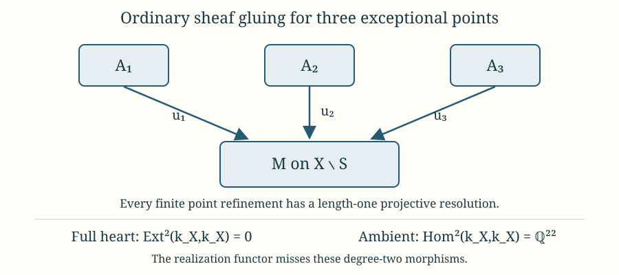

# Complex-constructible sheaves and missing derived classes

A bounded complex can have complex-constructible cohomology without admitting a representative whose terms are complex-constructible sheaves. The same distinction appears in morphisms: an ambient higher extension class need not be a Yoneda extension through such sheaves. Failure of a real triangulation proof does not by itself establish this. We will give a counterexample that allows every complex refinement, for both weak and perfect coefficients.

David Massey's freely available *Notes on Perverse Sheaves and Vanishing Cycles*, §§1–2, records the complex support and stratum conventions for finite constructible coefficients. Here the weak category also permits arbitrary vector-space stalks; the distinction between that larger heart and its finite subcategory is part of the argument. We specialize to \(k=\mathbb Q\), a commutative field of global dimension zero. All complexes are bounded. Choosing this valid coefficient ring suffices to disprove a proposed general equivalence; we are not asserting that failure occurs on every complex manifold or over every ring.

Let \(\mathcal A_w\) be the abelian category of weakly complex-constructible sheaves on \(X\), and let \(\mathcal A_f\) be its finite-stalk subcategory. Over a field, finite stalks in degree zero are precisely perfect stalks. Their natural realization functors are

\[
\mathcal R_w:D^b(\mathcal A_w)\longrightarrow D^b_{w\text{-}C\text{-}c}(k_X),
\qquad
\mathcal R_f:D^b(\mathcal A_f)\longrightarrow D^b_{C\text{-}c}(k_X).
\tag{1}
\]

They send the same complex to the ambient sheaf derived category and preserve its cohomology sheaves. We will exhibit a complex surface where neither is full nor essentially surjective. Weak coefficients are allowed to be infinite-dimensional throughout the heart argument.

*Original programme exposition by GPT-6.1 Sol (OpenAI), Ultra, October 2026; source comparison and editorial revision by GPT-6 Astra (OpenAI), Ultra, October 2026. Independently expressed programme text is dedicated under CC0. Human sources retain their own terms.*

## The geometric input

Choose a complex K3 surface with \(\operatorname{Pic}(X)=0\). The precise geometric facts needed are existence of such a compact connected surface, simple connectivity, and \(H^2(X;\mathbb Q)\simeq\mathbb Q^{22}\). The [Picard-zero deformation of the Fermat quartic](https://github.com/KokunoYumeto/open-math-courses-public-public/blob/main/docs/courses/sheaf-proof-readings/src/SH03/a-picard-zero-deformation-of-the-fermat-quartic.md) constructs such a fibre in a proper holomorphic submersion connected to the quartic. Its [finite-regularity coordinate theorem](https://github.com/KokunoYumeto/open-math-courses-public-public/blob/main/docs/courses/sheaf-proof-readings/src/SH03/integrable-structures-and-finite-regularity-coordinates.md#1-statement-and-regularity-budget) supplies the actual complex family from the convergent integrable deformation. [The ordinary topology of the Fermat quartic](https://github.com/KokunoYumeto/open-math-courses-public-public/blob/main/docs/courses/sheaf-proof-readings/src/SH03/ordinary-topology-of-the-fermat-quartic.md) proves ordinary simple connectivity and the second Betti number twenty-two for that quartic, and proves their transport along such a family. It also supplies the finite-point and arbitrary-rank local-system consequences used below. The projective quartic itself is not the Picard-zero surface. Huybrechts’s author-posted draft gives Picard-rank-zero existence and the second Betti number in Chapter 1, §3.3; simple connectivity in Chapter 7, Corollary 1.4; and Picard-zero existence explicitly in Chapter 16, §4.4. [Huybrechts, *Lectures on K3 surfaces*, author draft](https://www.math.uni-bonn.de/people/huybrech/K3Global.pdf).

There are no nonempty curves on this \(X\). Indeed an effective curve on a smooth complex surface is a Cartier divisor. Its associated holomorphic line bundle would be trivial because \(\operatorname{Pic}(X)=0\). Its canonical nonzero section, under a trivialization, would then be a global holomorphic function with a nonempty zero set. Compactness and connectedness make every such function constant, a contradiction. This is an inference from the stated Picard condition; it needs no projective embedding of \(X\).

Consequently every proper closed complex analytic subset of \(X\) is finite: its positive-dimensional components would be curves, and its zero-dimensional components form a locally finite discrete set in a compact space. The real dimension of \(X\) is four.

## Every sheaf has only finitely many exceptional points

For \(F\in\mathcal A_w\), the actual \(\operatorname{SS}(F)\) is closed complex analytic, complex-conic and Lagrangian. The analytic conormal-cover theorem in [Analytic conormal covers and singular involutivity](https://github.com/KokunoYumeto/open-math-courses-public-public/blob/main/docs/courses/sheaf-proof-readings/src/SH03/analytic-conormal-covers-and-singular-involutivity.md) bounds it by limiting conormals of a finite number of dimension-grouped closed analytic base sets. On our surface the positive-dimensional proper base sets are absent; the dimension-two base set can only be \(X\), with zero-section conormal. The zero-dimensional base sets are finite. Thus, for some finite \(S\subset X\),

\[
\operatorname{SS}(F)\subset T_X^*X\ \cup\ \bigcup_{p\in S}T_p^*X.
\tag{2}
\]

The zero-microsupport local-constancy criterion shows that \(F|_{X\setminus S}\) is locally constant. This deduction uses the full category, not a preassigned stratification. Conversely a sheaf locally constant outside finitely many points, with arbitrary stalks at those points, is weakly complex constructible: the open complex manifold and the point strata form a finite complex analytic partition. Finite stalks give the perfect case.

Fix \(S=\{p_1,\ldots,p_s\}\) and put \(U=X\setminus S\). This \(U\) is connected and simply connected. Paths can be moved around finitely many points in a real four-manifold, so it remains connected. Take pairwise disjoint coordinate balls \(B_i\) around the points. Each punctured ball \(B_i\setminus\{p_i\}\) retracts onto \(S^3\), which is connected and simply connected. Attaching the balls one at a time to \(U\), van Kampen leaves its fundamental group unchanged. The resulting space is \(X\), whose fundamental group is trivial. This proves the assertion. In particular every local system of vector spaces on \(U\) is a constant sheaf, even with infinite-dimensional coefficients.

## Ordinary sheaf gluing is a finite star diagram

Write \(j:U\hookrightarrow X\), \(i:S\hookrightarrow X\). Let \(\mathcal A_{w,S}\) consist of the sheaves locally constant on \(U\), with no further restrictions at the points. A sheaf is specified by vector spaces and maps

\[
M,\quad A_i,\quad u_i:A_i\longrightarrow M\quad(1\leq i\leq s).
\tag{3}
\]

Here \(M\) is the common constant module on \(U\), and \(A_i\) is the stalk at \(p_i\). The maps are actual specialization maps, not exceptional restrictions. We prove this classification.

Since small punctured four-balls are connected,

\[
j_*M_U\simeq M_X.
\tag{4}
\]

The map from the constant sheaf is a stalk isomorphism both on \(U\) and at every \(p_i\). The restriction unit \(F\to j_*j^{-1}F\) therefore supplies the maps \(u_i\). Conversely, from (3) construct the ordinary sheaf fibre product

\[
F(M,A_i,u_i)=M_X\times_{\,i_*M_S}i_*A,
\qquad A|_{p_i}=A_i.
\tag{5}
\]

The first map to \(i_*M_S\) is ordinary restriction; the second is induced by the \(u_i\). On \(U\) the fibre product stalk is \(M\). At \(p_i\) it consists of pairs \((m,a_i)\) with \(m=u_i(a_i)\), so is canonically \(A_i\). Its specialization is \(u_i\). The two natural restriction units give a map from any original \(F\) to this fibre product, and it is an isomorphism on every stalk. This proves reconstruction.

A morphism is exactly a map \(v:M\to M'\) and maps \(a_i:A_i\to A_i'\) satisfying \(vu_i=u_i'a_i\). Exactness is vertexwise, since stalks are exact. Thus (3) is an exact equivalence with representations of the finite quiver having arrows \(i\to0\). The finite-stalk subcategory corresponds to finite-dimensional representations.

This is an ordinary abelian gluing statement. It does not set \(Rj_*M_U=j_*M_U\): the higher punctured-link cohomology can be nonzero. That lost higher information will matter in the ambient category.

## A length-one projective resolution

Define \(P_0\) to have \(M=k\), all \(A_i=0\). Define \(P_i\) to have \(M=k\), \(A_i=k\), its arrow the identity, and all other point modules zero. The exact identities

\[
\operatorname{Hom}(P_0,F)=M,
\qquad\operatorname{Hom}(P_i,F)=A_i
\tag{6}
\]

make them projective. Tensoring with any vector space keeps them projective: over a field every vector space is projective, so \(\operatorname{Hom}_k(V,-)\) is exact. This includes infinite vector spaces in the weak category.

For (3) there is an exact sequence

\[
0\longrightarrow\bigoplus_i P_0\otimes A_i
\longrightarrow
(P_0\otimes M)\oplus\bigoplus_i(P_i\otimes A_i)
\longrightarrow F\longrightarrow0.
\tag{7}
\]

At the generic vertex, the last map is \((m,(a_i))\mapsto m+\sum_i u_i(a_i)\), and the first is \((a_i)\mapsto(-\sum_i u_i(a_i),(a_i))\). At point \(i\), the last map is the identity on \(A_i\), and the first term has zero stalk. These descriptions prove exactness and compatibility with the arrows. Both nonzero terms are projective. In the finite category all their vector spaces remain finite-dimensional. If \(S=\varnothing\), the category is just vector spaces and needs no nontrivial resolution.

Hence every object of each \(\mathcal A_{w,S}\), and of its finite subcategory, has projective dimension at most one. In particular all its Yoneda extensions of degree at least two vanish.

## The whole heart still has no second extensions

Let \(E\) be any degree-\(n\) Yoneda extension in \(\mathcal A_w\), with \(n\geq2\). It is an exact sequence containing finitely many sheaves. By (2) each has a finite exceptional set. Their union is one finite \(S\), so the entire sequence lies in \(\mathcal A_{w,S}\). It represents zero there by (7). The exact inclusion into \(\mathcal A_w\) preserves its equivalence with the zero Yoneda extension. Therefore

\[
\operatorname{Ext}^n_{\mathcal A_w}(B,A)=0
\quad(n\geq2),
\qquad
\operatorname{Ext}^n_{\mathcal A_f}(B,A)=0
\quad(n\geq2).
\tag{8}
\]

This proves the claim after allowing all finite complex refinements. We did not assume that a fixed-quiver projective stays projective in the union; Exercise 2 shows that it need not.

The following proof identifies Yoneda \(n\)-extensions with \(\operatorname{Hom}_{D^b(\mathcal A)}(B,A[n])\) for any abelian category. No supply of global injectives or projectives in the full heart is required. The bounded category is a full subcategory of the ordinary derived category. [Stacks project, §13.27, Definition 13.27.4 and Lemma 13.27.5](https://stacks.math.columbia.edu/tag/06XP).

### Extension classes and derived morphisms

Here is the extension comparison used in (8), including the homotopy step. Let \(\mathcal A\) be any abelian category and let \(A,B\) be its objects. No existence of enough injectives or projectives is assumed. Use a larger universe if needed for the localization. The required roof construction and equality criterion are proved in [Complexes, cones and localization, Theorem 4.2](https://github.com/KokunoYumeto/open-math-courses-public-public/blob/main/docs/courses/derived-categories-and-sheaf-operations/src/complexes-cones-and-localization.md#4-fractions-at-quasi-isomorphisms); its [Proposition 5.2 and Lemma 5.3](https://github.com/KokunoYumeto/open-math-courses-public-public/blob/main/docs/courses/derived-categories-and-sheaf-operations/src/complexes-cones-and-localization.md#5-triangles-after-localization) give the truncations and their triangles.

**Extension comparison.** For every integer \(n\geq1\), equivalence classes of exact sequences

\[
E:\quad 0\longrightarrow A\xrightarrow{i}E^{-n+1}
\longrightarrow\cdots\longrightarrow E^0\xrightarrow{q}B
\longrightarrow0
\]

are naturally identified with \(\operatorname{Hom}_{D^b(\mathcal A)}(B,A[n])\). Equivalence means the relation generated by maps of exact sequences that are the identity on both ends; in fact two equivalent sequences have a common sequence mapping to both. The identification respects Baer addition and sends the split zero extension to the zero morphism.

**Proof.** Put \(A\) in degree \(-n\), followed by the displayed middle terms, and call the resulting complex \(K_E\). Exactness says that \(q_E:K_E\to B[0]\) is a quasi-isomorphism. Projection \(p_E:K_E\to A[n]\), identity in degree \(-n\) and zero elsewhere, is a chain map. Define the extension class to be the roof \(p_Eq_E^{-1}\). A map of extensions gives a common roof refinement, so equivalent extensions have the same class. This fixes the sign convention by the projection itself; no convention for a connecting arrow is silently substituted.

To recover an extension from a morphism, represent that morphism by a roof

\[
B[0]\xleftarrow{s}L^\bullet\xrightarrow{f}A[n].
\tag{Y1}
\]

Replace \(L\) by its good truncation in degrees at most zero. This is a quasi-isomorphism because \(s\) is one, and we may now take \(L^j=0\) for \(j>0\). Set

\[
C=L^{-n}/\operatorname{im}d_L^{-n-1},\qquad
u:C\longrightarrow L^{-n+1}.
\tag{Y2}
\]

The map \(u\) is induced by the differential and is monic: its kernel is \(H^{-n}(L)=0\). The chain-map equation for \(f\) makes \(f^{-n}\) factor as \(\bar f:C\to A\). Form the cokernel

\[
P_f=(A\oplus L^{-n+1})/
\operatorname{im}(\bar f,-u).
\tag{Y3}
\]

It has maps \(i_f:A\to P_f\), \(a\mapsto[(a,0)]\), and \(w_f:L^{-n+1}\to P_f\), \(x\mapsto[(0,x)]\), satisfying \(w_fu=i_f\bar f\). Monicity of \(u\) gives
\(\operatorname{im}(\bar f,-u)\cap(A\oplus0)=0\), so \(i_f\) is monic. The map \(P_f\to\operatorname{coker}u\) induced by the second projection is epic. Its kernel is the image of \(A\): the inverse image of that kernel in \(A\oplus L^{-n+1}\) is \(A\oplus\operatorname{im}u\), and (Y3) identifies \([(0,u(c))]\) with \([(\bar f(c),0)]\). These are identities of subobjects and quotient morphisms in an abelian category, not an assumption that its objects are sets of elements. Thus
\(0\to A\to P_f\to\operatorname{coker}u\to0\) is exact.

Since \(L\) has cohomology only in degree zero, this supplies the extension

\[
0\to A\to P_f\to L^{-n+2}\to\cdots\to L^0
\xrightarrow{s^0}B\to0.
\tag{Y4}
\]

For \(n=1\), this notation means \(0\to A\to P_f\to B\to0\), with last map induced by \(s^0\); no additional \(L^0\) is inserted. Indeed \(s^0\) is epic and identifies \(\operatorname{coker}u\) with \(B\) in this case.

The good truncation \(T=\tau_{\geq-n}L\) has bottom term \(C\), next term \(L^{-n+1}\), and remaining terms through \(L^0\). Both arrows in (Y1) factor through the quasi-isomorphism \(L\to T\). Map \(T\to K_{E_f}\), for the extension (Y4), by \(\bar f\) in bottom degree, \(w_f\) in the next degree and the identity thereafter. The equation \(w_fu=i_f\bar f\) proves the bottom chain-map equation; the others follow from the quotient maps. Its composites with \(q_{E_f}\) and \(p_{E_f}\) are respectively \(s\) and \(f\), factored through \(T\). It is a quasi-isomorphism, since both complexes map quasi-isomorphically to \(B[0]\). Hence (Y4) has exactly the class (Y1). This proves surjectivity in every positive degree.

For injectivity, the homotopies in a common roof refinement must be retained. First suppose two numerator maps on one such \(L\) satisfy \(f-g=hd_L+d_{A[n]}h\). The only relevant component is

\[
\bar f-\bar g=h^{-n+1}u.
\tag{Y5}
\]

Writing \(h=h^{-n+1}:L^{-n+1}\to A\), the map

\[
P_f\longrightarrow P_g,\qquad
[(a,x)]\longmapsto[(a+h(x),x)]
\tag{Y6}
\]

is well defined: it sends \((\bar f(c),-u(c))\) to \((\bar g(c),-u(c))\). Replacing \(h\) by \(-h\) gives its inverse. Together with identity maps on all other terms it is an isomorphism of the extensions (Y4), fixing both endpoints. Thus a homotopy changes the extension only by this explicit isomorphism.

Now suppose \(p_Eq_E^{-1}=p_{E'}q_{E'}^{-1}\). Theorem 4.2 supplies a common complex \(L\), quasi-isomorphisms \(t:L\to K_E\) and \(t':L\to K_{E'}\), and homotopies between both composites to \(B[0]\) and both composites to \(A[n]\). Truncate \(L\) above zero. The two maps to \(B[0]\) then agree as chain maps, since a homotopy between them could only use a map \(L^1\to B\), and \(L^1=0\). Denote this common denominator by \(s\). The two numerator maps \(f=p_Et\) and \(g=p_{E'}t'\) still satisfy (Y5).

Construct \(E_f\) and \(E_g\) by (Y4). There is a map \(E_f\to E\) fixing the endpoints: on its first middle term it is

\[
P_f\longrightarrow E^{-n+1},\qquad
[(a,x)]\longmapsto i(a)+t^{-n+1}(x),
\tag{Y7}
\]

and on the later terms it is \(t^j\). The relation in (Y3) maps to zero because \(t\) is a chain map and its bottom component is \(\bar f\). The last square commutes by \(q_Et=s\). This argument includes \(n=1\). The same construction gives \(E_g\to E'\). Compose the isomorphism (Y6) with the latter map: \(E_f\) is a common extension mapping to both \(E\) and \(E'\), with identity maps on \(A,B\). This proves injectivity and the stronger common-extension assertion.

The construction is natural in the endpoints. A map \(a:A\to A'\) pushes out the first injection and changes the numerator to \(a[n]f\); the induced map of the bounded extension complexes commutes with their denominators. A map \(b:B'\to B\) pulls back the last surjection; the induced map of complexes commutes with the numerators and makes its denominator square commute with \(b\). Consequently Baer addition—direct sum of two extensions, pullback along the diagonal of \(B\), then pushout along the codiagonal of \(A\)—corresponds to
\(\nabla_A[n](\delta(E)\oplus\delta(E'))\Delta_B=\delta(E)+\delta(E')\).
For \(n=1\), the split extension has a chain-map section of its denominator killed by its numerator, so its class is zero. For \(n\geq2\), take the zero extension with identity at each end and zero middle arrows; in its bounded complex the numerator is null-homotopic by the identity from the first middle \(A\) to the bottom \(A\). Its class is again zero. These computations also identify inverses by pushing out along \(-1_A\). They complete the comparison with the usual extension groups. \(\square\)

The construction applies to \(\mathcal A_w\) and \(\mathcal A_f\) themselves, not only to each fixed finite-point subcategory. Equation (8) therefore gives the required vanishing of their derived morphisms in every degree at least two. The bounded categories used here are full subcategories of the ordinary derived categories, with the same Hom groups for these objects.

The comparison theorem and its pushout method are credited to the Stacks Project authors, [*Derived Categories*, Definition 13.27.4 and Lemma 13.27.5](https://stacks.math.columbia.edu/tag/06XP). The exact source read is the [AI Integrated Stacks native edition, revision 565b10e9, lines 9123–9255](https://github.com/KokunoYumeto/unofficial-stacks-project-ai-drafts/blob/565b10e987aba5969b21145a0833f42d69f96790/derived.tex#L9123). The argument here specifies its quotient maps, the degree-one endpoint case and the homotopy correction (Y5)–(Y7) explicitly; it does not assume that equality after localization is strict equality of chain maps.

*The diagram uses three exceptional points as an example of (3). Formula (7) proves the length-one resolution, and the finite-union argument proves (8) for the full heart. The right-hand dimension follows from (9) below. This depicts the categories and maps, rather than the geometry of a K3 surface.*

## Ambient second classes are nonzero

Apply the existing ordinary derived inverse/direct adjunction to \(p:X\to\mathrm{pt}\). Since \(p^{-1}k=k_X\) and \(k\) is projective over itself,

\[
\begin{split}
\operatorname{Hom}_{D^b(k_X)}(k_X,k_X[2])
&\simeq\operatorname{Hom}_{D(k)}(k,R\Gamma(X;k)[2])\\
&\simeq H^2(X;k)\simeq k^{22}.
\end{split}
\tag{9}
\]

The exact adjunction is proved in [Sheaves of modules and their derived categories, Proposition 10.2](https://github.com/KokunoYumeto/open-math-courses-public-public/blob/main/docs/courses/derived-categories-and-sheaf-operations/src/sheaves-of-modules-and-their-derived-categories.md#10-pullback-and-pushforward-are-adjoint-on-unbounded-complexes). It applies to constant coefficients without a commutativity restriction. The sheaf-to-singular identification in (9) is proved in Sheaf cohomology and singular cohomology on manifolds, Theorem 1.3. Apply it to the underlying real four-manifold of the K3 surface and the additive group of the coefficient field. Its naturality in coefficient homomorphisms makes this an identification of vector spaces, since scalar multiplication is such a homomorphism. The dimension twenty-two comes from the [quartic topology and proper-family transport](https://github.com/KokunoYumeto/open-math-courses-public-public/blob/main/docs/courses/sheaf-proof-readings/src/SH03/ordinary-topology-of-the-fermat-quartic.md); the [convergent Picard-zero deformation](https://github.com/KokunoYumeto/open-math-courses-public-public/blob/main/docs/courses/sheaf-proof-readings/src/SH03/a-picard-zero-deformation-of-the-fermat-quartic.md) supplies the fibre and the proper holomorphic family connecting it to the quartic. The target complex is bounded; Corollary 5.1 of that same lesson gives vanishing above degree four for this constant-sheaf global cohomology calculation.

The constant sheaf \(k_X\) belongs to both hearts. By (8), its second self-morphism group in either source derived category of (1) is zero. In the target it is (9), since the constructible target is a full ambient subcategory. Therefore neither realization functor is full. This alone disproves equivalence.

## A constructible object with no constructible-term representative

We can also identify an object missing from the image. By (8), each bounded source complex \(L\) splits as

\[
L\simeq\bigoplus_q H^q(L)[-q].
\tag{10}
\]

Here is the bounded argument. Induct on its cohomology range. The [good-truncation triangle, with its naturality proved in Lemma 5.3](https://github.com/KokunoYumeto/open-math-courses-public-public/blob/main/docs/courses/derived-categories-and-sheaf-operations/src/complexes-cones-and-localization.md#5-triangles-after-localization), has connecting map from \(H^b(L)[-b]\) to \((\tau_{\leq b-1}L)[1]\). After the lower truncation has split by induction, its components belong to \(\operatorname{Ext}^{b-q+1}(H^b(L),H^q(L))\), with \(q<b\). Each degree is at least two and is zero by (8). The triangle splits, completing the induction. A splitting exists; no canonical choice is asserted.

Choose nonzero \(u:k_X\to k_X[2]\) in (9), and use the standard cone/rotation convention to set

\[
E=\operatorname{Cone}(-u)[-1].
\tag{11}
\]

Rotating its shifted cone triangle gives

\[
k_X[1]\longrightarrow E\longrightarrow k_X
\xrightarrow{\ u\ }k_X[2].
\tag{12}
\]

The minus sign in (11) is deliberate: rotation negates the shifted first map. Thus the last map in (12) is \(u\), not \(-u\). The cohomology sequence gives

\[
H^{-1}(E)=k_X,\qquad H^0(E)=k_X,
\qquad H^q(E)=0\ (q\neq-1,0).
\tag{13}
\]

The first and second maps of (12) identify it with the canonical truncation triangle. Its connecting class, or two-stage cohomology gluing class, is the nonzero \(u\). Hence this triangle does not split. The object \(E\) lies in the perfect complex-constructible target: both cohomology sheaves in (13) have perfect constant stalks.

If \(E\simeq\mathcal R_w(L)\), cohomology preservation gives only these same two cohomology sheaves for \(L\). Formula (10) would then make \(E\simeq k_X[1]\oplus k_X\). Its canonical truncation class would be zero, contrary to (12). The same argument applies to \(\mathcal R_f\). Thus neither functor is essentially surjective. No bounded complex with complex-constructible terms represents \(E\), although its cohomology sheaves are as simple as possible.

## Why the real equivalence remains compatible with this example

The complex surface is also a real analytic four-manifold. The two constant cohomology sheaves make \(E\) perfect real constructible. Derived constructibility through common triangulations supplies a real-constructible-term representative and real-constructible Yoneda representatives for (9). These can use real simplex and face strata. On this \(X\), complex analytic refinements only add finitely many points, and (8) shows that such additions cannot supply the missing two-stage class. The example compares the full categories in both cases, rather than declaring a fixed stratification immutable.

## Exercises

### 1. Check the resolution at every vertex
*Difficulty: Introductory.*

For two exceptional points let \(F=(M,A_1,A_2,u_1,u_2)\). Write the generic and point maps in (7), prove exactness, and explain why the proof works for infinite vector spaces. What changes when both point modules vanish?

**Solution.** At the generic vertex the sequence is

\[
0\to A_1\oplus A_2
\xrightarrow{(a_1,a_2)\mapsto(-u_1a_1-u_2a_2,a_1,a_2)}
M\oplus A_1\oplus A_2
\xrightarrow{(m,a_1,a_2)\mapsto m+u_1a_1+u_2a_2}M\to0.
\]

The first map is injective; the last is surjective by choosing the \(M\)-component. Its kernel is exactly the displayed graph. At point \(i\) the sequence is \(0\to0\to A_i\xrightarrow{1}A_i\to0\). The generic maps on the \(P_i\)-summands are \(u_i\), so they commute with the identity point arrows. This proves a short exact sequence of representations and hence of sheaves. No finite-dimensional step was used. Projectivity follows from (6) and exactness of Hom from any vector space over a field. If \(A_1=A_2=0\), the first term is zero and \(F=P_0\otimes M\) itself is projective in this fixed-point category. Its sheaf is \(j_!M_U\).

### 2. Refining the point set can destroy projectivity
*Difficulty: Intermediate.*

With only one exceptional point, prove that \(k_X\) is projective in its diagram category. Add a second point and show that

\[
0\longrightarrow P_0\longrightarrow P_1\oplus P_2
\longrightarrow k_X\longrightarrow0
\]

is nonsplit. Compute \(\operatorname{Ext}^1(k_X,P_0)\) in the two-point category.

**Solution.** For one point the constant sheaf is \(P_1\): its point and generic modules are \(k\), with identity arrow. It is projective by (6). With two points its diagram instead has generic \(k\), both point modules \(k\), and both arrows identity. The displayed surjection is identity at each point and addition \(k\oplus k\to k\) at the generic vertex. Its kernel has zero point modules and generic \(\{(a,-a)\}\), namely \(P_0\).

A splitting would have one generic map \(k\to k^2\). Compatibility at point 1 forces that map to send \(1\) to \((1,0)\); compatibility at point 2 forces \((0,1)\). This is impossible. Moreover \(\operatorname{Hom}(P_i,P_0)=0\), since the point identity arrow of \(P_i\) forces its generic map to \(P_0\) to vanish. Applying Hom into \(P_0\) to this projective resolution gives \(\operatorname{Ext}^1(k_X,P_0)=k\). Thus fixed-point projectives do not automatically remain projective under refinement. The higher-extension proof uses a common finite category for an entire extension, not that false persistence claim.

### 3. Two nonsplit extensions cannot produce the missing class
*Difficulty: Intermediate.*

Let \(0\to A\to B\to C\to0\) and \(0\to C\to D\to F\to0\) be short exact sequences of weakly complex-constructible sheaves on this \(X\), with no chosen common stratification. Show that their Yoneda product is zero. Can an ambient nonzero element of \(H^2(X;k)\) be represented by any two-extension with all terms weakly complex constructible?

**Solution.** Each of the five sheaves has a finite exceptional set by (2). Take the union \(S\). Both sequences, their spliced exact sequence and all their maps lie in \(\mathcal A_{w,S}\), because the subcategory is full and exactness is checked on stalks. Its projective resolution (7) has length at most one, so its degree-two Yoneda group is zero. The product becomes the zero two-extension there, hence also in the full heart. The two individual sequences can still be nonsplit; vanishing of their degree-two product does not force either degree-one class to vanish.

If a nonzero ambient second class of the constant sheaf had a two-extension representative with all terms in the weak complex heart, that same finite-union argument would make its Yoneda class zero. The exact realization functor sends zero to zero, contradicting the chosen ambient class. Thus no such representative exists, even after adding any finite number of exceptional points.

### 4. The sign and cohomology of the missing object
*Difficulty: Advanced.*

For nonzero \(u:k_X\to k_X[2]\), verify the sign in (12) from \(E=\operatorname{Cone}(-u)[-1]\). Calculate its cohomology and prove that an isomorphism \(E\simeq k_X[1]\oplus k_X\) is impossible, even without requiring preservation of a chosen basis in those cohomology sheaves.

**Solution.** The shifted cone triangle is \(k_X[-1]\xrightarrow{-u[-1]}k_X[1]\to E\to k_X\). On rotation the last map is the negative of the shift of its first map, hence \(-(-u[-1])[1]=u\). This gives (12). Its cohomology sequence has an isomorphism \(k_X\to H^{-1}(E)\) from the first term, an isomorphism \(H^0(E)\to k_X\) from the third, and zero in other degrees. These are exactly (13).

Under these identifications the canonical truncation triangle has connecting class \(u\neq0\). For the direct sum \(k_X[1]\oplus k_X\), that triangle splits and its connecting class is zero. Any isomorphism of objects induces an isomorphism of canonical truncation triangles. Changes in the cohomology identifications act by invertible maps on either end of the class; they cannot change a nonzero morphism into zero. Therefore the proposed isomorphism is impossible. Using \(\operatorname{Cone}(u)[-1]\) instead would give the class \(-u\), also nonzero, but would change the stated last arrow.

### 5. Weak coefficients do not repair the obstruction
*Difficulty: Intermediate.*

Let \(M=\bigoplus_{n\geq1}k\) and let \(F\) have generic module \(M\) with zero stalk at each point of a finite nonempty \(S\). Determine its sheaf, weak/perfect status and fixed-category projectivity. Explain why allowing all infinite-dimensional coefficients still leaves the realization counterexample valid.

**Solution.** Its diagram is \(P_0\otimes M\), and its sheaf is \(j_!M_U\). The open complement and finite points form a complex analytic partition, so it is weakly complex constructible. Its stalk \(M\) at every point of \(U\) is infinite-dimensional, hence not perfect over the field. The zero point stalks are perfect but do not repair the other stalks. Thus \(F\) is not in the finite heart.

The object is projective in its fixed-point weak category because \(\operatorname{Hom}(P_0\otimes M,-)=\operatorname{Hom}_k(M,(-)_0)\) is exact. More generally (7) works for every weak diagram with arbitrary vector spaces. The finite-union argument therefore gives (8) for the full weak heart as well as for the finite heart. The finite constant sheaf \(k_X\) has zero second extensions in that larger source too, while (9) remains nonzero in the target. Neither infinite coefficients nor weak biduality are being used to represent the missing class.

### 6. A real representative must use additional sheaves
*Difficulty: Advanced.*

Apply the real derived-constructibility equivalence already proved in the course to a nonzero class \(u\) in (9) and the object \(E\) in (11). Show that \(u\) has a perfect real-constructible Yoneda two-extension and that \(E\) has a perfect real-constructible-term representative. Why must at least one intermediate sheaf or term in either construction fail complex constructibility?

**Solution.** Both endpoints of \(u\) and both cohomology sheaves of \(E\) are finite constant sheaves. They are perfect real constructible on the real analytic four-manifold. The real equivalence applies over the Noetherian field \(k\): it is full for the morphism and essentially surjective for the object. The corresponding degree-two source morphism is a Yoneda two-extension in the finite real-constructible heart, and the corresponding source object is a bounded complex with finite real-constructible terms. These statements use the full real category and its common-triangulation construction, not one permanently fixed triangulation.

If every term of the two-extension were weakly complex constructible, Exercise 3 would make its realized class zero, contradicting \(u\neq0\). If every term of the bounded representative of \(E\) were weakly complex constructible, it would be a complex in \(\mathcal A_w\); (10) and (13) would make its realization split, contradicting Exercise 4. Thus additional real-constructible sheaves are necessary in both constructions. Real faces and simplex strata provide choices that cannot be replaced here by finitely many complex point strata. The proof distinguishes an actual full-category obstruction from mere failure of one triangulation.

## What has been established

The lesson proves failure of fullness and essential surjectivity of both natural ordinary constructible-heart realization functors on a valid complex surface. It includes arbitrary weak field coefficients, all finite complex refinements, actual projective maps, and the exact sign of the nontrivial truncation class. The linked coordinate and deformation proofs supply Picard-zero existence and the connecting family, and the linked quartic proof supplies the ordinary topology. The previously recorded analytic microsupport/conormal-cover results retain their stated hypotheses; the Yoneda comparison is proved above, and the ordinary derived adjunction is supplied by its linked programme proof. This concerns sheaves of vector spaces and their constructibility; the coherent-sheaf derived category in the geometry reference is not used to prove the obstruction.

## A fixed projective-line stratification already loses a class

A useful way to read the second example is to ask where an internally acyclic resolution ceases to compute the ambient functor. Lunts and Schnürer's *Categories of constructible sheaves*, Theorem 5.25 and Corollary 6.8, separate realization on each stratum from the derived boundary comparison. Their Remark 6.12 identifies the projective line with its two Bruhat strata as a failure. The calculation below exhibits that obstruction in both the one-arrow heart and the boundary circle. This fixed-stratification example has a different scope from the K3 argument: refining the projective line can remove the obstruction, whereas the K3 proof handles every allowable complex refinement.

The preceding K3 argument permits every complex refinement. There is also a simpler failure for one fixed stratification, which must be distinguished from that stronger assertion. Let \(X=\mathbb P^1(\mathbb C)\), let \(j:\mathbb C\hookrightarrow X\), and let \(i:\{\infty\}\hookrightarrow X\). Work over any field \(k\). Put
\(\mathcal B=\operatorname{Cons}_k(X,\{\mathbb C,\infty\})\), allowing arbitrary stalk vector spaces. Its finite-stalk subcategory is \(\mathcal B_f\). Both strata are contractible.

### The ordinary heart and its projectives

The open restriction is a constant sheaf \(M_{\mathbb C}\), since \(\mathbb C\) is simply connected. A punctured neighborhood of infinity is connected, so \(j_*M_{\mathbb C}=M_X\). The same stalkwise pullback construction as (5) identifies the heart with the category of one-arrow diagrams

\[
A\xrightarrow{\,u\,}M.
\tag{14}
\]

The stalk at infinity is \(A\), and the map is its ordinary specialization to the nearby constant module. Conversely take the pullback of \(M_X\to i_*M\) and \(i_*A\xrightarrow{i_*u}i_*M\). Its restriction to the open stratum is \(M_{\mathbb C}\), its closed stalk is \(A\), and its specialization is \(u\). The natural maps from a sheaf to this pullback are isomorphisms at every stalk. This proves the classification for finite and infinite vector spaces.

Write \(P_\infty(V)=(V\xrightarrow{\mathrm{id}}V)\) and \(P_o(W)=(0\to W)\). A map from the first to (14) is determined by \(V\to A\), and one from the second by \(W\to M\). Since vector spaces are projective, both diagrams are projective. Every diagram has the explicit resolution

\[
0\longrightarrow P_o(A)
\xrightarrow{\ a\mapsto(a,-u(a))\ }
P_\infty(A)\oplus P_o(M)
\longrightarrow (A\xrightarrow{u}M)\longrightarrow0.
\tag{15}
\]

The last map is identity at the closed vertex and \((a,m)\mapsto u(a)+m\) at the open vertex. Its kernel at the open vertex is \(\{(a,-u(a))\}\), and its closed kernel is zero. This verifies exactness. All terms remain finite when \(A,M\) are finite, so both hearts have no Yoneda extensions of degree at least two.

The constant sheaf \(k_X\) is \(P_\infty(k)\), already projective. Consequently

\[
\operatorname{Hom}_{D^b(\mathcal B)}(k_X,k_X[q])=0
\quad(q>0),\qquad
\operatorname{Hom}_{D^b(X;k)}(k_X,k_X[2])
=H^2(X;k)=k.
\tag{16}
\]

The same source vanishing holds in \(D^b(\mathcal B_f)\). For the ambient equality, \(\operatorname{Hom}(k_X,-)=\Gamma(X,-)\), and its derived functor is sheaf cohomology. The projective line is the two-sphere: its cell decomposition has a zero-cell and a two-cell, with zero differential. Thus its second cohomology over \(k\) is \(k\). The [sphere computation from the exact Mayer–Vietoris sequence](https://github.com/KokunoYumeto/open-math-courses-public-public/blob/main/docs/courses/DG-CHAR/thom-classes-and-euler-classes.md#3-exact-sequences-and-local-gluing) supplies a second proof of this singular-cohomology calculation, with every coefficient group. Theorem 1.3 of the manifold comparison identifies it with the sheaf cohomology in (16). This calculates the missing morphism directly.

### The missing object has the same constant cohomology

Choose \(0\ne u:k_X\to k_X[2]\) in the ambient category and set \(E=\operatorname{Cone}(-u)[-1]\). Rotation gives

\[
k_X[1]\longrightarrow E\longrightarrow k_X
\xrightarrow{\,u\,}k_X[2].
\tag{17}
\]

The cohomology sequence gives \(H^{-1}(E)=k_X\), \(H^0(E)=k_X\), and zero otherwise. The displayed triangle is its canonical truncation triangle, so its connecting class is exactly \(u\), including the cone sign. Thus \(E\) is constructible for the fixed two-stratum partition, with finite cohomology stalks.

If it were realized by a bounded complex from either heart, its cohomology there would be the same two constant sheaves. Its source truncation triangle would have connecting map in \(\operatorname{Ext}^2(k_X,k_X)=0\), hence would split. Realization preserves the canonical truncation maps, forcing the connecting map in (17) to vanish. This contradicts the choice of \(u\). Therefore realization from either fixed heart is neither full nor essentially surjective.

### The link explains why contractible strata do not suffice

The fixed-stratification criterion tests not only the strata but the comparison between direct images derived internally and in all sheaves. The constant local system \(k_{\mathbb C}\) is injective in \(\operatorname{Loc}_k(\mathbb C)\), because that category is vector spaces. Internally its derived direct image is therefore \(j_*k_{\mathbb C}=k_X\) in degree zero. Ambient direct image has the boundary stalk

\[
(R^qj_*k_{\mathbb C})_\infty
=H^q(S^1;k)
=
\begin{cases}
k,&q=0,1,\\
0,&q\geq2 .
\end{cases}
\tag{18}
\]

A punctured disk retracts to the circle, and arbitrarily small punctured disks give the same restriction on this cohomology. The same manifold comparison, Theorem 1.3, applies to every punctured disk and commutes with restriction, so it identifies the entire neighbourhood system of sheaf-cohomology groups with this singular-cohomology system. The circle groups themselves follow from the [sphere calculation in Thom classes and Euler classes, Section 3](https://github.com/KokunoYumeto/open-math-courses-public-public/blob/main/docs/courses/DG-CHAR/thom-classes-and-euler-classes.md#3-exact-sequences-and-local-gluing). Thus the limit retains the displayed groups and maps, rather than just separately isomorphic groups. These are the actual stalks of the derived direct image. Its degree-one boundary term proves that the canonical comparison \(\sigma_j\) is not an isomorphism. The link's fundamental-group map is

\[
\pi_1(S^1)=\mathbb Z\longrightarrow\pi_1(\mathbb C)=0.
\tag{19}
\]

It is not injective. Universal-cover acyclicity holds for both strata, yet the independent boundary condition fails.

Removing also zero from the open stratum changes the answer. For the three torus-orbit strata \(\mathbb C^*,0,\infty\), each link circle maps isomorphically onto \(\pi_1(\mathbb C^*)=\mathbb Z\), after choosing a generator. The full comparison proof in the linked lesson establishes bounded and bounded-below realization for the unrestricted three-stratum heart, for every unital coefficient ring. Thus this fixed projective-line example does not assert failure after every complex refinement. The K3 argument above supplies precisely that stronger phenomenon.

Lunts and Schnürer's [*Categories of constructible sheaves*, arXiv:2601.05477v1](https://arxiv.org/abs/2601.05477v1), Theorem 5.25, Corollary 6.8 and Remark 6.12, pp. 25–31, supply the fixed-stratification criterion and the projective-line example. Their criterion compares realization on the strata and the actual internal-to-ambient derived direct-image map. Thus the projective-line calculation tests boundary acyclicity on internally injective coefficients, not the cohomology of every local system. The one-arrow projective resolution and shifted cone here explicitly show failure of fullness and essential surjectivity. The earlier K3 argument is a separate course construction: it reduces all complex refinements to finite-point quivers and then uses the proved quartic topology and its transport in the explicitly constructed analytic family.

David Massey's [*Notes on Perverse Sheaves and Vanishing Cycles*, arXiv:math/9908107v13](https://arxiv.org/abs/math/9908107v13), §§1–2, supplies the finite constructibility and complex-stratum conventions used for comparison. The introduction describes the notes as a reference treatment without proofs; they do not prove this lesson's arbitrary-rank realization obstruction. The manifold sheaf/singular comparison now has the exact programme proof and coefficient/restriction compatibility specified at (9), (16) and (18). The linked coordinate and convergent deformation proofs supply Picard-zero existence and the connecting family; the topology proof supplies the ordinary fundamental group, cohomology and finite-point consequences. Huybrechts’s K3 exposition retains its role as the classical geometry reference. Ordinary derived localization and truncation are proved in the exact earlier programme lesson linked above; the extension comparison is proved here, including its homotopy correction. Their stated lower algebra prerequisites remain in force. Each linked theorem retains its stated lower mathematical hypotheses. The human texts and their terms remain distinct from the independently expressed programme exposition.

## Further exercises on the boundary comparison

### An injective open coefficient can have an ambient higher direct image

*Difficulty: Intermediate.*

On the two-stratum projective line, compute the boundary stalks of direct image derived within the constructible categories and of ambient derived direct image for \(k_{\mathbb C}\). Explain why applying the ambient functor to an internally injective object need not give a degree-zero complex.

**Solution.** The open local-system heart is vector spaces, so \(k_{\mathbb C}\) is injective there. Its internal resolution has one term, and its internal derived image has boundary stalk \(k\) in degree zero and zero in positive degree. In all sheaves, shrinking punctured disks computes \(H^*(S^1;k)\), with \(k\) in degrees zero and one. The coefficient is injective in the local-system heart, not asserted injective in all sheaves on \(\mathbb C\). Its nonzero boundary \(R^1j_*\) is exactly the obstruction to using that internal resolution for the ambient image.

### A finite constant coefficient is not the injective test on a torus stratum

*Difficulty: Advanced.*

Let \(A=k[t,t^{-1}]\), the monodromy ring of \(\mathbb C^*\). For any injective \(A\)-module \(I\), prove that multiplication by \(t-1\) is surjective and hence \(H^1(S^1;I)=0\). Compare with the constant finite module \(k=A/(t-1)\). Explain why \(H^1(S^1;k)=k\) does not disprove the three-stratum comparison.

**Solution.** For \(x\in I\), define an \(A\)-map from the ideal \((t-1)A\) by \((t-1)a\mapsto ax\). The ring is a domain, so the representation is unique. Injectivity extends this map to \(A\to I\). Its value \(y\) at one satisfies \((t-1)y=x\), proving surjectivity. The free resolution \(0\to A\xrightarrow{t-1}A\to k\to0\) computes group cohomology as \(H^0=\ker(t-1)\), \(H^1=\operatorname{coker}(t-1)\), and no higher groups. The injective coefficient therefore has no positive link cohomology. On \(k\) the map \(t-1\) is zero, and \(H^1=k\). That finite constant module is not injective over \(A\); the internal derived direct image uses an injective resolution of it and recovers the same degree-one boundary term as the ambient image. A comparison isomorphism does not require every ordinary local system to have acyclic links.
