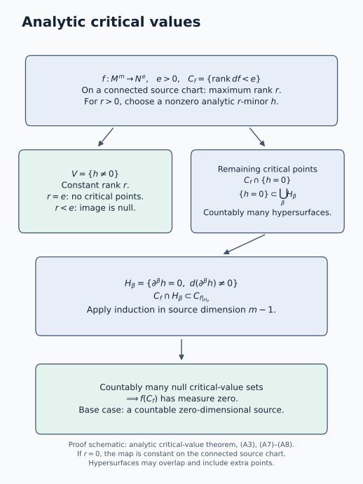

# Finite conormal closures and generic base directions

An isotropic cotangent set can have several limiting normal directions over a singular base point. The finite-cover theorem retains them by taking closures of conormal bundles. The bases in the cover are smooth, but the closed conormal pieces need not be smooth where their bases accumulate. A second theorem says that along a generic smooth part of any prescribed subanalytic base set, every covector in the isotropic set annihilates that part's tangent space.

Let \(X\) be a real analytic manifold of dimension \(n\), Hausdorff and countable at infinity. Put \(\pi:T^*X\to X\), and use

\[
\alpha=\sum_i\xi_i\,dx_i,\qquad \omega=d\alpha.
\tag{1}
\]

Conic means invariant under every positive fibre dilation. Isotropic means \(\alpha|_A=0\) on the regular locus of the subanalytic set \(A\). We use the singular one-form calculus in Subanalytic sets and limiting tangent directions and the conic image theorem in [Conic subanalytic images and isotropic dimension](conic-subanalytic-images-and-isotropic-dimension.md#linear-images-including-changing-rank). The proper-closure set calculus, pair normal-cone construction, and subset, closure and locally finite union rules supply the other set and one-form operations used below. There are no sheaf coefficients in this lesson.

The conormal interpretation of subanalytic isotropic sets is developed by Masaki Kashiwara and Pierre Schapira in [*Microlocal Study of Sheaves*](https://webusers.imj-prg.fr/~pierre.schapira/BooksMono/Ast128.pdf), Astérisque 128 (1985). The proofs below obtain a finite conormal-closure cover by decreasing projection rank and treat a prescribed base through its critical values. All bars below denote closure in the indicated ambient manifold.

## Source account: submersion witnesses and decreasing projection rank

Kashiwara and Schapira, [*Microlocal Study of Sheaves*](https://webusers.imj-prg.fr/~pierre.schapira/BooksMono/Ast128.pdf), Astérisque 128 (1985), Proposition 8.2.3, pp. 144–145, place a closed conic subanalytic isotropic set inside the total conormal of a Whitney real-analytic stratification. Their proof first chooses compatible Whitney stratifications of the cotangent set and its projection for which each stratum map is a submersion. Canonical-form vanishing then forces every covector to annihilate the tangent space of the corresponding base stratum. Equation (9) below uses precisely this tangent-lifting mechanism. The source adopts locally closed subanalytic sets in §8.2, p. 143; the present argument separately specifies its nonclosed remainders and generalized conormals on arbitrary subanalytic bases.

The proof organization here does not use that stratified-map existence theorem as its input. Bounded tangent witnesses first make rank loci and conormals subanalytic through proper-closure projection. At maximum projection rank, the analytic critical-value argument and constant-rank calculus produce a dense submersion locus over a smooth base. Removing the closed conormal piece removes every regular point of that rank, and the remaining set is used without closing it. Rank then strictly decreases. The result is a finite family of possibly disconnected smooth bases; they are not asserted to be strata or to satisfy the frontier rule. For a prescribed base, the proof instead removes the relative closures of critical-value images on each regular dimension part and passes tangent annihilation to singular cotangent limits.

Bierstone and Milman, [*Semianalytic and subanalytic sets*](https://www.numdam.org/item/PMIHES_1988__67__5_0/), Publications Mathématiques de l’IHÉS 67 (1988), Definition 3.1, Lemmas 3.4 and 3.6 and Remark 3.5, pp. 16–18, supply the local-lift, rank and dimension framework. Their proof of the complement theorem, Theorem 3.10 on p. 19, uses fibre cutting and induction; Theorem 7.2 on pp. 37–38 treats the fixed-dimensional smooth loci using further analytic-locus results. These are pertinent foundational comparisons, not a proof of all the dimension and singular-form rules assumed below. In particular, density alone is never used as a substitute for the stated strict dimension drop.

The analytic critical-value theorem A1–A8 has its full source-dimension proof in this lesson. A nonzero maximum-rank minor separates a constant-rank region; its zero set is covered by countably many regular derivative hypersurfaces. Each original critical point is still critical for the restricted map, permitting induction. Lower-dimensional images are null by the explicit cube estimate. Neither of the passages just cited is being credited with this exact proof, and the argument supplies neither a locally finite hypersurface partition nor a subanalytic critical-value image. In the generic-base application, conic projection separately supplies subanalyticity, which is needed to turn the null exceptional image into a nowhere-dense relative closure.

The order is analytic critical values, bounded witnesses, rank removal, the conormal-cover equivalence, and the prescribed-base statement, with six complete solved tests. The closed-cover theorem and the separate nonclosed generic-base corollary retain their stated scopes. Independently expressed programme text is dedicated under CC0 1.0 Universal; no human prose, figure or exercise sequence is imported or relicensed.

## The precise dimension prerequisite

We need the following further part of the underlying subanalytic dimension theory. For a nonempty subanalytic \(E\) in a finite-dimensional analytic manifold,

\[
\dim\overline E=\dim E,\qquad
\dim(E\setminus E_{\mathrm{reg}})<\dim E.
\tag{2}
\]

Dimension is monotone under inclusion and agrees with manifold dimension on an analytic submanifold. The regular locus is open in \(E\); its parts of each fixed dimension are subanalytic and open and closed in the regular locus. We use \(\dim\varnothing=-\infty\).

The intrinsic regular-locus theorem identifies regular dimension with analytic-cell dimension and proves subanalyticity of every regular dimension part. The [cell-dimension calculus](../../../analytic-finiteness-and-preparation/src/analytic-finiteness-for-preparation.md#dimension-fibrewise-closure-and-the-frontier) and [strict frontier theorem](../../../analytic-finiteness-and-preparation/src/analytic-finiteness-for-preparation.md#strict-frontier-decrease) give a direct verification of (2). Shrink to the interior of a compact coordinate box contained in a bounded witness chart. The proved local-to-global comparison makes the trace in this box globally subanalytic, so it admits a finite analytic-cell partition. Let \(d\) be the largest cell dimension. The lower-dimensional cells already have dimension less than \(d\). For a dimension-\(d\) cell \(C\), its intersection with the closure of any other cell \(D\) lies in \(\overline D\setminus D\), since the cells are disjoint. Strict frontier decrease makes each such intersection lower-dimensional. Outside these finitely many intersections, an ambient neighbourhood meets no other cell, so the trace agrees there with the embedded analytic manifold \(C\); every such point is regular. The singular part is therefore contained in a finite union of lower-dimensional sets, proving the strict inequality. Closure preserves the trace's dimension by the same frontier theorem. Shrinking inside the chart identifies its local closure with the ambient closure of the original set. Applying this at every point proves the closure equality and the singular-dimension bound on the manifold. For dimension zero the exceptional union is empty, as required.

A dense regular locus by itself would not prove the strict inequality in (2). The dimension and regularity framework is developed by Edward Bierstone and Pierre D. Milman in [*Semianalytic and subanalytic sets*](https://www.numdam.org/item/PMIHES_1988__67__5_0/), Publications Mathématiques de l’IHÉS 67 (1988). The finite-cell, frontier and intrinsic regular-locus results named above are the dimension inputs. Analytic Taylor expansion and the proved real analytic inverse, implicit and constant-rank coordinates are the analytic-calculus inputs. The [analytic critical-value theorem](#analytic-critical-values) needed below is proved directly here, with no previously chosen Whitney stratification. These elementary calculus results are prerequisites, distinct from the analytic critical-value argument proved below.

## Analytic critical values by source-dimension descent

**Analytic critical-value theorem.** Let \(f:M\to N\) be an analytic map between finite-dimensional Hausdorff analytic manifolds with countable atlases. Let \(e=\dim N\), treating the open components of each target dimension separately if necessary. The critical-value set

\[
 f(C_f),\qquad C_f=\{p\in M:\operatorname{rank}df_p<e\},
 \tag{A1}
\]

has Lebesgue measure zero in every target coordinate chart. No properness, subanalytic image, constant-rank hypothesis, or compactness of the source is required. For \(e=0\), \(C_f\) is empty.

We supply three elementary steps before proving the theorem.

### Step A.1. Lower-dimensional smooth images

Suppose \(r<e\), and \(\psi\) is a \(C^1\) map from an open subset of \(\mathbb R^r\) to \(\mathbb R^e\). Cover its domain by countably many compact cubes contained in that open subset. On one such cube \(K\), enlarge it slightly within the domain and bound the derivative there by \(L\). Subdivide \(K\) into cubes of side at most \(\delta\). At most \(C_K\delta^{-r}\) cubes are needed for \(0<\delta\le1\). The mean-value estimate puts the image of each cube in an \(e\)-cube of side at most \(2(1+L)\sqrt r\,\delta\). Its outer measure is therefore bounded above by

\[
 C_K\,[2(1+L)\sqrt r]^e\,\delta^{e-r}.
 \tag{A2}
\]

Let \(\delta\downarrow0\). This proves that \(\psi(K)\) has measure zero; countable subadditivity gives the assertion on the whole domain. The case \(r=0\) is a point on each chart and is immediate. Thus every embedded \(r\)-dimensional smooth submanifold of \(\mathbb R^e\) has measure zero, by its countable parametrization charts. Coordinate changes preserve zero outer measure: on a countable cover by relatively compact coordinate balls they are Lipschitz, and the same cube-cover estimate in equal dimensions multiplies the total cover volume by a bounded constant.

### Step A.2. A derivative hypersurface cover

Let \(h\) be a non-identically-zero analytic function on a connected open coordinate set \(U\subset\mathbb R^m\), where \(m\ge1\). Define, for each multi-index \(\beta\in\mathbb N^m\),

\[
 H_\beta=\{x\in U:\partial^\beta h(x)=0,
                       \ d(\partial^\beta h)_x\ne0\}.
 \tag{A3}
\]

Each nonempty \(H_\beta\) is an analytic embedded hypersurface, by the implicit-function theorem. It has a countable atlas as a submanifold of \(U\). We claim

\[
 \{h=0\}\subset\bigcup_{\beta\in\mathbb N^m}H_\beta.
 \tag{A4}
\]

The nonzero germ assertion needed here follows directly from analyticity. The set of points where the germ of \(h\) is zero is open. It is closed too: at a limit of such points every derivative vanishes by continuity, and the convergent Taylor series is consequently zero on a neighborhood of the limit. Connectedness and the hypothesis make this set empty. At a point \(p\) with \(h(p)=0\), choose the least positive total order \(k\) with some \(\partial^\alpha h(p)\ne0\), \(|\alpha|=k\). Choose \(j\) with \(\alpha_j>0\), and set \(\beta=\alpha-\mathbf e_j\). Minimality gives \(\partial^\beta h(p)=0\), while

\[
 \partial_j\partial^\beta h(p)=\partial^\alpha h(p)\ne0.
 \tag{A5}
\]

Hence \(p\in H_\beta\). This proves (A4). The hypersurfaces may overlap and may include points outside \(\{h=0\}\). They need not form a partition or a locally finite family. Only their countability and the dimension decrease will be used.

### Step A.3. Constant-rank images

If a \(C^1\) map has constant rank \(r<e\) on an open source manifold, the constant-rank theorem puts its image near every source point in an embedded \(r\)-dimensional target submanifold. A countable source subcover and A.1 show that its whole image has measure zero in target coordinates. This argument is valid for a nonproper map and an unbounded source.

### Induction on source dimension

**Proof.** We induct on the source dimension \(m\). A zero-dimensional source with a countable atlas has countably many points. For \(e>0\), its image has measure zero. For \(e=0\) there are no critical points, in every source dimension.

Assume the assertion for all analytic source manifolds of dimension less than \(m\), with every target dimension. Cover the source by countably many connected coordinate balls \(U\) whose images lie in target coordinate charts. It suffices to prove the assertion for the coordinate map \(F:U\to\mathbb R^e\). Put

\[
 r=\max_{x\in U}\operatorname{rank}dF_x.
 \tag{A6}
\]

If \(r=0\), all coordinate derivatives vanish and \(F\) is constant on the connected ball, so its image has measure zero. Suppose \(r>0\). Choose one \(r\)-by-\(r\) differential minor that is nonzero somewhere, and denote its analytic determinant by \(h\). On \(V=\{h\ne0\}\), the rank is exactly \(r\). If \(r=e\), this set contains no critical points. If \(r<e\), A.3 shows that \(F(V)\), and hence the critical image from \(V\), has measure zero.

The rest of the critical set lies in \(\{h=0\}\), covered by the countable hypersurfaces (A3). At each \(p\in C_F\cap H_\beta\),

\[
 \operatorname{rank}d(F|_{H_\beta})_p
 \le \operatorname{rank}dF_p<e.
 \tag{A7}
\]

Therefore

\[
 F(C_F\cap H_\beta)
 \subset (F|_{H_\beta})\bigl(C_{F|_{H_\beta}}\bigr).
 \tag{A8}
\]

The domain of the restriction is an analytic manifold of dimension \(m-1\), so the induction hypothesis makes the right-hand side null. Countably many \(\beta\), together with the null contribution from \(V\), prove that \(F(C_F)\) is null. Applying the countable source cover proves the theorem. \(\square\)

The use of (A7) is essential: although \(H_\beta\) need not be contained in the original critical set or zero set, the points that are being estimated remain critical for the restricted map. Nothing in this proof supplies local finiteness or subanalyticity of the critical-value image.

**Dense regular lifts.** If \(f:M\to N\) is analytic and onto, then the set of \(y\in N\) having a lift \(p\) with surjective \(df_p\) is dense in \(N\). For \(e>0\), every target point outside the null set \(f(C_f)\) has a lift by surjectivity, and each of its lifts is regular. Every nonempty target open set has positive coordinate measure, so this complement is dense. For \(e=0\), every differential onto the zero tangent space is surjective. We have asserted the existence of dense regular lifts, not that the differential is onto everywhere.

*Proof schematic.* On a connected source chart, a nonzero maximum-rank minor separates the constant-rank part from the remaining critical points. Formulas (A3)–(A4) give a countable analytic-hypersurface cover of the latter. The restriction inequality (A7) permits induction on source dimension, and (A8) then controls their images. The hypersurfaces can overlap; they are not claimed to be a stratification. See [Steps A.1–A.3 and the induction](#analytic-critical-values) for the complete argument.

## Subanalytic rank loci with bounded auxiliary vectors

If \(M\) is a subanalytic analytic submanifold of an analytic manifold \(P\), its tangent bundle, viewed inside \(TP\), is subanalytic. Indeed,

\[
TM=C(M,M)|_M.
\tag{3}
\]

Straightening a smooth submanifold proves the equality, and the pair normal-cone theorem proves subanalyticity. If components of \(M\) have different dimensions, apply the same argument on each of its finitely many dimension parts.

Let \(g:P\to Q\) be analytic. The locus where \(dg|_{TM}\) has rank at least \(r\) is subanalytic. To see this locally, give the tangent coordinates a Euclidean norm and consider tuples

\[
(p,v_1,\ldots,v_r),\qquad
p\in M,\quad v_i\in T_pM,\quad |v_i|\le1,
\tag{4}
\]

for which the vectors \(dg_pv_i\) are linearly independent. Independence is an analytic minor condition, or the nonvanishing of their Gram determinant. Every independent tuple can be scaled to satisfy the bounds. Forgetting the vectors is proper on the closure of this set: over a compact coordinate-base set the closed unit vector balls are compact. The proper-closure image theorem therefore gives the claimed rank locus. Taking differences gives exact-rank loci. This argument supplies the needed bounded projection; it does not assume an arbitrary projection of a subanalytic set is subanalytic.

For \(g=\pi\) and positive-conic \(M\subset T^*X\), these rank loci are also positive-conic. A fibre dilation preserves \(M\), and its composition with \(\pi\) equals \(\pi\). Thus it carries the restricted differential to a map of the same rank.

## Conormals from bounded tangent witnesses

Let \(G\subset X\) be an analytic submanifold that is subanalytic in \(X\), and suppose the programme tangent/normal-cone calculus has supplied subanalyticity of \(TG\subset TX\). Work in an analytic coordinate chart and put

\[
 K=\{(x,\xi,v):x\in G,\ v\in T_xG,\ |v|\le1,
                            \langle\xi,v\rangle\ne0\}.
 \tag{B1}
\]

This set is subanalytic by the stated set operations. The projection \(q(x,\xi,v)=(x,\xi)\) is proper on \(\overline K\): its inverse image over a compact cotangent set is a closed subset of the product of that compact set with the closed unit tangent-coordinate ball. Thus \(q(K)\) is subanalytic by the proper-closure image theorem. A covector fails to annihilate \(T_xG\) precisely when a nonzero pairing has a witness of norm at most one, by scaling the witness. Consequently

\[
 T_G^*X=\pi^{-1}G\setminus q(K).
 \tag{B2}
\]

This proves subanalyticity, locally and hence globally. The conormal is positive-conic, and its canonical one-form is zero because every tangent vector to it projects into \(T_xG\). All zero covectors over \(G\) are included by (B2); no zero covector over a point outside \(G\) is added.

## Where a constant-rank image is smooth

Suppose \(M\subset T^*X\) is a nonempty positive-conic subanalytic analytic submanifold, and \(\pi|_M\) has constant rank \(d\). Set

\[
B=\pi(M),\qquad G=B_{\mathrm{reg}},\qquad
M'=M\cap\pi^{-1}G.
\tag{5}
\]

The conic projection theorem makes \(B\) subanalytic. Then \(G\) has dimension \(d\), \(M'\) is open dense in \(M\), and \(\pi:M'\to G\) is a submersion.

**Proof.** At a point of a dimension-\(e\) regular part of \(B\), the constant-rank local image of \(M\) lies in that smooth part. Consequently \(d\le e\). If \(e>d\), restrict \(\pi\) to the open part of \(M\) mapping into this regular part. Every point is critical for that map. The [analytic critical-value theorem](#analytic-critical-values) says its image has measure zero in the \(e\)-dimensional target. It is also surjective onto that part, a contradiction. The theorem includes countable atlases and countably many source components, so it applies on this whole open source. Hence every regular part of \(B\) has dimension \(d\).

It follows from (2) that \(\dim(B\setminus G)<d\). If \(M\setminus M'\) contained a nonempty open subset of \(M\), the constant-rank theorem would put a \(d\)-dimensional local image submanifold inside \(B\setminus G\). Dimension monotonicity forbids this. Thus \(M'\) is dense. It is open because \(G\) is open in \(B\). At its points, the rank-\(d\) differential takes values in the \(d\)-dimensional tangent space of \(G\), and is therefore onto. \(\square\)

In this argument the image need not be closed, and \(\pi|_M\) need not be proper. Positive conicity supplied precisely the image theorem that was needed.

## Removing a conormal closure lowers projection rank

For a smooth subanalytic base \(G\subset X\), write

\[
T_G^*X=\{(x;\xi):x\in G,\ \xi|_{T_xG}=0\}.
\tag{6}
\]

Let \(A\subset T^*X\) be a nonempty positive-conic subanalytic isotropic set; it may be nonclosed. On its regular locus, let

\[
d=\max_{p\in A_{\mathrm{reg}}}
\operatorname{rank}(d\pi_p|_{T_pA_{\mathrm{reg}}}),\qquad
M=\{p\in A_{\mathrm{reg}}:\operatorname{rank}d\pi_p=d\}.
\tag{7}
\]

The regular locus is nonempty by regular density. The locus \(M\) is open in \(A\), subanalytic and positive-conic, by the preceding rank argument. Its projection has a smooth regular locus \(G\) as in (5). We claim

\[
M\subset\overline{T_G^*X}.
\tag{8}
\]

At \(p=(x;\xi)\in M'\), take any \(u\in T_xG\). Surjectivity of \(d\pi_p\) supplies \(v\in T_pM'\) with \(d\pi_pv=u\). Isotropy gives

\[
0=\alpha_p(v)=\xi(u).
\tag{9}
\]

Thus \(M'\subset T_G^*X\). Its density in \(M\) proves (8).

Now remove the **closed** conormal piece:

\[
A_1=A\setminus\overline{T_G^*X}.
\tag{10}
\]

It is a subanalytic positive-conic isotropic set and is open in \(A\). Near every point of \(A_1\), the sets \(A_1\) and \(A\) agree. In particular,

\[
(A_1)_{\mathrm{reg}}
=A_{\mathrm{reg}}\cap A_1.
\tag{11}
\]

Equation (8) removes every rank-\(d\) regular point. If \(A_1\ne\varnothing\), its maximum regular projection rank is at most \(d-1\). We apply this construction to \(A_1\) itself, without closing it. At rank zero, removal leaves no regular point; regular density then forces the remainder to be empty.

The base \(G\) has fixed dimension \(d\), but it can have infinitely many connected components. Each subsequent base is inside the projection of the current remainder, hence inside \(\pi(A)\). Since ranks lie between zero and \(n\), at most \(n+1\) steps are needed.

## The complete conormal-cover equivalence

Let \(\Lambda\subset T^*X\) be **closed**, positive-conic and subanalytic. The following conditions are equivalent:

1. \(\Lambda\) is isotropic.
2. There is an ambient locally finite family of subanalytic subsets \(S_j\subset X\) such that
   \[
   \Lambda\subset\bigcup_j\overline{T_{S_j}^*X}.
   \tag{12}
   \]
   For singular \(S_j\), the conormal here is the generalized conormal.
3. There is a finite family of smooth subanalytic bases \(G_j\subset\pi(\Lambda)\) such that
   \[
   \Lambda\subset\bigcup_j\overline{T_{G_j}^*X}.
   \tag{13}
   \]

**Proof.** The rank-removal argument proves 1 implies 3, with at most \(n+1\) bases. Condition 3 implies 2 because a finite family is locally finite.

For 2 implies 1, first observe that the canonical form is zero on a smooth conormal bundle. A tangent vector to \(T_G^*X\) projects to a vector in \(T_xG\), which its covector annihilates. The singular one-form cone criterion then gives

\[
\alpha|_{\overline{T_G^*X}}=0.
\tag{14}
\]

Indeed point normal cones are unchanged by taking closure, and that criterion includes all ambient closure points.

For an arbitrary subanalytic \(S\), we explicitly extend the generalized-conormal definition beyond locally closed bases by setting

\[
T_S^*X=\overline{T_{S_{\mathrm{reg}}}^*X}\cap\pi^{-1}S.
\tag{15}
\]

This agrees with the earlier definition on locally closed bases. Its subanalyticity follows from the [bounded conormal-witness argument](#bounded-conormal-witnesses) on the finitely many fixed-dimensional regular parts of \(S\), followed by closure and intersection. It contains \(T_{S_{\mathrm{reg}}}^*X\) and is contained in its closure, so

\[
\overline{T_S^*X}=\overline{T_{S_{\mathrm{reg}}}^*X}.
\tag{16}
\]

Thus every piece in (12) is subanalytic and has vanishing canonical form. Their family is locally finite in \(T^*X\): their bases lie in \(\overline{S_j}\), and closures of an ambient locally finite base family remain locally finite. The singular one-form calculus gives vanishing on their union and then on its subanalytic subset \(\Lambda\). This proves isotropy. \(\square\)

The bars in (12) and (13) are part of the theorem. Formula (13) does not assert that each selected smooth base passes through every point under its conormal closure. It also does not assert that the \(G_j\) form a partition or satisfy a frontier condition. Those additional properties belong to stratification theory.

## Generic conormality along any subanalytic base

Let \(\Lambda\) be as in the theorem, and let \(Y\subset X\) be **any subanalytic subset**. There is a subanalytic analytic submanifold \(Y_0\subset Y\), open dense in \(Y\), such that

\[
\Lambda\cap\pi^{-1}Y_0\subset T_{Y_0}^*X.
\tag{17}
\]

Different connected components of \(Y_0\) may have different dimensions. Equivalently, one can keep the finitely many fixed-dimension parts separately. The statement allows \(Y\) to be singular, nonclosed, or only partly contained in \(\pi(\Lambda)\).

**Proof.** Put \(A=\Lambda\cap\pi^{-1}Y\). It is subanalytic, positive-conic and isotropic. For each dimension \(e\), let \(Y^{(e)}\) be the dimension-\(e\) part of \(Y_{\mathrm{reg}}\), and put

\[
M_e=A_{\mathrm{reg}}\cap\pi^{-1}Y^{(e)},\qquad
Q_e=\{p\in M_e:\operatorname{rank}(d\pi_p|_{T_pM_e})<e\}.
\tag{18}
\]

The domain \(M_e\) is open in \(A_{\mathrm{reg}}\): \(Y^{(e)}\) is open in \(Y\), and \(\pi(A)\subset Y\). The map \(M_e\to Y^{(e)}\) is analytic. The bounded-vector rank argument makes \(Q_e\) subanalytic and positive-conic. Hence its image

\[
E_e=\pi(Q_e)\subset Y^{(e)}
\tag{19}
\]

is subanalytic by conic projection. The [analytic critical-value theorem](#analytic-critical-values), applied separately to the finitely many source-dimension parts of \(M_e\), makes it measure zero in \(Y^{(e)}\). When \(e=0\), the critical set and its image are empty.

Its closure *inside* \(Y^{(e)}\) has empty interior there. Here is a useful justification that does not confuse measure zero with nowhere density. If a subanalytic measure-zero set were dense in a nonempty open set \(O\) of a smooth manifold, it would have a regular point in \(O\). Near that point it is a closed analytic submanifold. Density makes that submanifold the whole neighborhood, contradicting measure zero. Apply this observation to \(E_e\).

Therefore

\[
Y_0=\bigcup_e
\left(Y^{(e)}\setminus\overline{E_e}^{\,Y^{(e)}}\right)
\tag{20}
\]

is subanalytic and open dense in \(Y\). There are only finitely many possible dimensions. On regular points of \(A\) lying over \(Y_0\), the projection is onto the relevant base tangent space. Equation (9) then says that their covectors annihilate \(T Y_0\).

Finally take any \(p\in A\) over \(Y_0\). Choose regular points \(p_k\in A_{\mathrm{reg}}\) tending to \(p\). Because \(Y_0\) is open in \(Y\), their bases eventually lie in \(Y_0\), and near the limiting base point they lie in its same smooth local part. The conormal bundle of that part is closed over its base. Passing to the limit gives \(p\in T_{Y_0}^*X\). This proves (17), including zero covectors and singular points of \(A\). \(\square\)

This proof does not require a surjective projection onto all of \(Y\). If the cotangent set has no fibres over a generic part of \(Y\), the assertion there holds directly; critical values account for its smaller projected parts.

### Nonclosed isotropic inputs

**Corollary.** The conclusion (17) remains true when the positive-conic subanalytic isotropic set \(\Lambda\) is not closed.

**Proof.** The preceding proof never used closedness of \(\Lambda\). Its restriction \(A=\Lambda\cap\pi^{-1}Y\) remains subanalytic, conic and isotropic by the singular subset rule. Formulas (18)–(20) use only regularity, conic projection and the analytic critical-value theorem. At the last step, regular density approximates each actual point of \(A\), and closedness of the smooth target conormal *over its own base* passes the annihilation property to the limit. This latter closedness does not require closedness of \(\Lambda\). Thus the same \(Y_0\) construction proves (17), including empty fibres, zero covectors and singular cotangent points. \(\square\)

## Exercises with complete solutions

### Two limiting conormal lines at a crossing

*Difficulty: Introductory.*

Let \(N=\{xy=0\}\subset\mathbb R^2\), with covectors \(a\,dx+b\,dy\). Compute the fibre at the origin of \(\Lambda=\overline{T_{N_{\mathrm{reg}}}^*\mathbb R^2}\). Give a two-base cover of the form (13), and explain the role of closure.

**Solution.** On the punctured horizontal axis, conormal covectors satisfy \(a=0\). On the punctured vertical axis they satisfy \(b=0\). Limits with a finite covector therefore give

\[
\Lambda_{(0,0)}
=\{a=0\}\cup\{b=0\}.
\tag{21}
\]

Take \(G_1=\{(x,0):x\ne0\}\) and \(G_2=\{(0,y):y\ne0\}\). Their conormal closures have union exactly \(\Lambda\). Their ordinary conormal bundles have no fibre at the origin, so these same two bases without closures would not cover \(\Lambda\). The point-stratum conormal is the whole two-dimensional cotangent fibre; it is larger than (21). Such a larger piece can occur in a cover, but it must not be mistaken for this limiting fibre.

### The cusp retains only its limiting normal line

*Difficulty: Intermediate.*

For the cusp \(N=\{(t^2,t^3):t\in\mathbb R\}\), compute the origin fibre of \(\overline{T_{N\setminus\{0\}}^*\mathbb R^2}\). Can a single smooth base serve in (13)?

**Solution.** For \(t\ne0\), the tangent vector is \((2t,3t^2)\). Its annihilator satisfies

\[
2a+3tb=0,\qquad a=-\tfrac32tb.
\tag{22}
\]

A convergent cotangent sequence has bounded \(b\), so at \(t\to0\) it has \(a\to0\). Conversely every finite \(b_0\) is realized by taking \(b=b_0\) and \(a=-3tb_0/2\). The limiting fibre is precisely \(\{a=0\}\). The single base \(G=N\setminus\{0\}\), a subanalytic analytic submanifold, has conormal closure equal to the whole set in question. Its two branches are allowed in one base. Replacing that limiting fibre by the conormal to the point would incorrectly turn a line into the entire fibre.

### A finite family with infinitely many base components

*Difficulty: Introductory.*

In \(T^*\mathbb R\), let \(\Lambda=\bigcup_{m\in\mathbb Z}T_m^*\mathbb R\). Verify the hypotheses of the cover theorem and exhibit a one-base cover.

**Solution.** Near any compact base interval there are only finitely many integers. Thus \(\mathbb Z\) is closed and subanalytic, and is a zero-dimensional analytic submanifold with infinitely many components. Its full conormal is \(\Lambda\), a closed locally finite union of vertical cotangent fibres. Each fibre has zero canonical form, and the union is isotropic by local finiteness. It is positive-conic. Take \(G=\mathbb Z\); then \(\Lambda=T_G^*\mathbb R\) is already closed. A finite family of possibly disconnected bases need not be a finite family of connected strata.

### The rank-removal remainder need not be closed

*Difficulty: Intermediate.*

Let \(\Lambda=T_{\mathbb R}^*\mathbb R\cup T_0^*\mathbb R\). Carry out (7)–(10), identify the remainder, and finish the cover.

**Solution.** In coordinates \((x;\xi)\), this set is the union of the horizontal line \(\xi=0\) and the vertical line \(x=0\). Away from their intersection it is regular. The maximum projection rank is one, attained on \(M=\{\xi=0,x\ne0\}\). Its projected regular base is \(G_1=\mathbb R\setminus\{0\}\), and \(\overline{T_{G_1}^*\mathbb R}=\{\xi=0\}\). Removal leaves \(\{x=0,\xi\ne0\}\), which is nonclosed but has projection rank zero. Its base is \(G_2=\{0\}\), and its conormal closure covers that remainder. The two closed conormal pieces give the original \(\Lambda\). The second application of the argument is valid on the nonclosed remainder itself.

### A transverse prescribed base requires an exceptional point

*Difficulty: Advanced.*

In \(X=\mathbb R^2\), let \(N=\{y=0\}\), \(Y=\{x=0\}\), and \(\Lambda=T_X^*X\cup T_N^*X\). Explain why (17) fails with \(Y_0=Y\), and find an open dense \(Y_0\) for which it holds.

**Solution.** At the origin, \(dy\in T_N^*X\subset\Lambda\). The tangent to \(Y\) is spanned by \(\partial_y\), and \(dy(\partial_y)=1\). Hence \(dy\notin T_Y^*X\), so the whole-base assertion fails. Take \(Y_0=Y\setminus\{(0,0)\}\). Over this base the only covectors of \(\Lambda\) are zero covectors, which annihilate every tangent vector. This \(Y_0\) is subanalytic and open dense in \(Y\). In the critical-value proof, the nonzero vertical \(dy\)-fibre at the origin has rank-zero projection to the one-dimensional \(Y\), producing the exceptional base value. The regular zero section over \(Y\setminus\{0\}\) has rank one.

### Why the two finiteness arguments have their stated hypotheses

*Difficulty: Advanced.*

Prove that an ambient locally finite family \((S_j)\) has locally finite closures. Explain why Sard's measure-zero conclusion alone would not justify removing a nowhere-dense closed exceptional set in (20).

**Solution.** Choose an open neighborhood \(U\) of any ambient point meeting only finitely many \(S_j\). If \(U\) meets \(\overline{S_j}\), a smaller open neighborhood of that intersection point lies inside \(U\) and meets \(S_j\). Thus only those same finitely many closures meet \(U\). Since \(\pi(\overline{T_{S_j}^*X})\subset\overline{S_j}\), their conormal closures are locally finite in the cotangent bundle too.

For the second issue, \(\mathbb Q\subset\mathbb R\) has measure zero and dense closure. Its complement contains no nonempty open interval, so merely deleting the closure would leave no generic base. In (19) the critical-value set is additionally subanalytic. If its closure had interior, regular density would produce a neighborhood on which that set is a closed analytic submanifold and dense. It would equal the neighborhood and have positive measure. This contradiction is the extra step used in the proof; \(\mathbb Q\) lacks the required subanalytic regularity.

## What the cover supplies next

The theorem replaces a closed subanalytic isotropic cotangent set by finitely many closed conormal pieces, and (17) gives the exact generic tangent annihilation needed when refining a prescribed base. Involutivity will impose a complementary lower dimension bound on subsets of such an isotropic set. Together these facts will lead to Lagrangian supports and compatible microlocal stratifications.

The cited works provide the subanalytic and cotangent context. The arguments here combine proper-closure and conic-image proofs, bounded-vector rank and conormal tests, the directly proved analytic critical-value theorem, constant-rank calculus, and singular one-form restriction. The rank-removal argument is finite because ranks strictly decrease; the generic-base argument treats each regular base dimension separately and then passes to singular cotangent limits. The complete subanalytic dimension, regularity and singular-form foundations, together with the stated analytic-calculus theorems, remain explicit transitive inputs. The critical-value proof itself uses no subanalytic stratification or uniformization.
